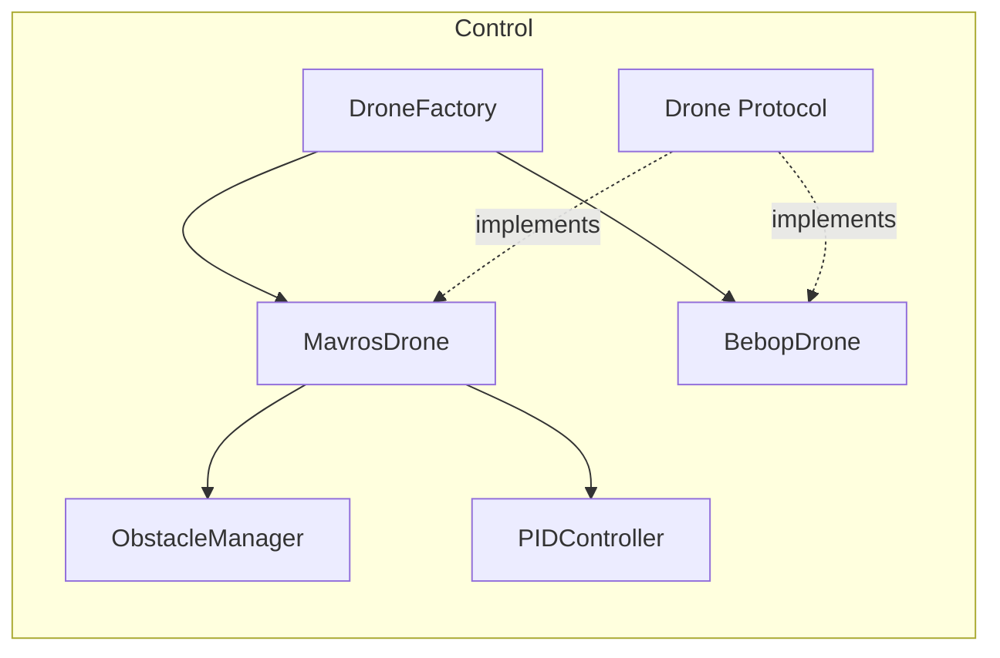
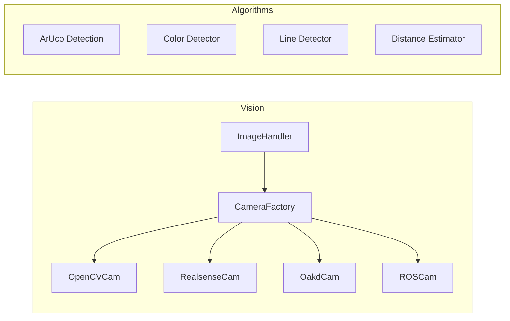
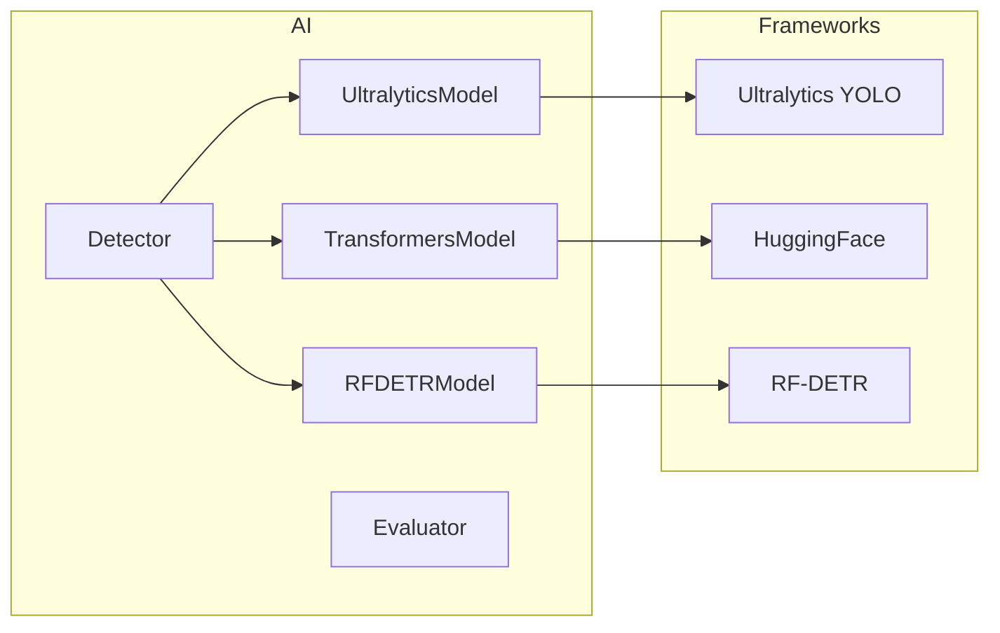
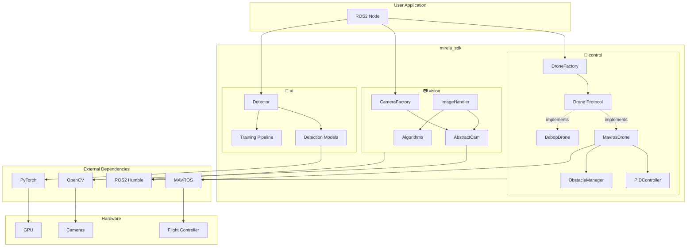
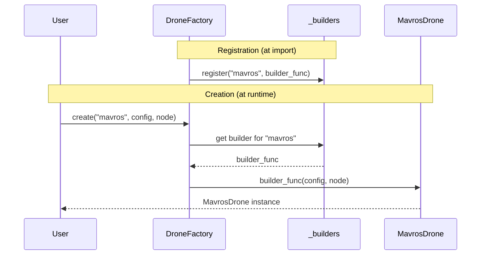
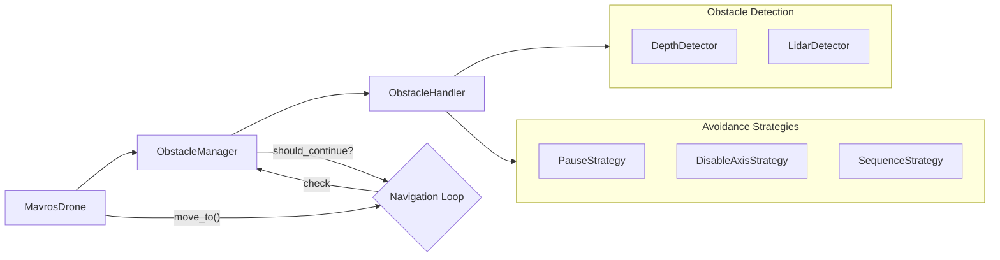
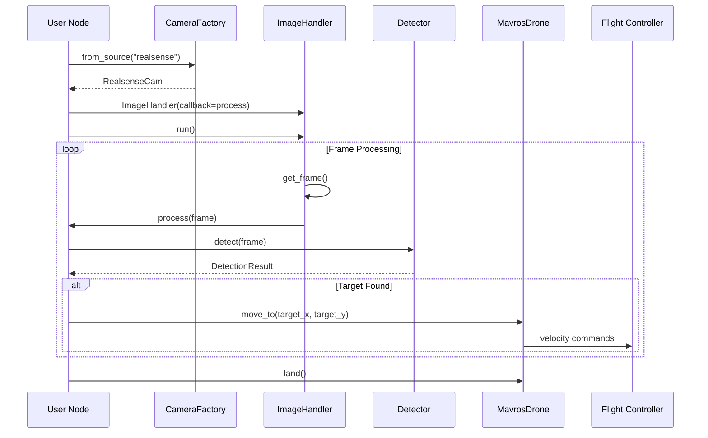

# Mirela SDK: Drone Control, Computer Vision & AI Toolkit

<table>
  <tr>
    <td>
      <a href="https://docs.ros.org/en/humble/"></a>
    </td>
    <td>
      <a href="https://opencv.org/"></a>
    </td>
    <td>
      <a href="https://www.python.org/"></a>
    </td>
    <td>
      <a href="https://pytorch.org/"></a>
    </td>
    <td>
      <a href="https://www.docker.com/"></a>
    </td>
  </tr>
</table>


A modular software development kit for autonomous aerial systems built on [ROS2 Humble](https://docs.ros.org/en/humble/). Designed for drone competitions, research, and rapid prototyping of UAV applications.

Developed by the [Black Bee Drones](https://github.com/Black-Bee-Drones) competition team.

## Table of Contents 📚

- [Features](#features-)
- [Installation](#installation-)
- [Quick Start](#quick-start-)
- [Modules](#modules-)
- [Architecture](#architecture)
- [Examples](#examples-)
- [ROS2 Nodes](#ros2-nodes-)
- [Directory Structure](#directory-structure-)
- [Contributing](#contributing)
- [License](#license)

## Features 🐎

### 🚁 Drone Control
- **Protocol-based architecture** with factory pattern for multiple drone types
- **MAVROS** integration for ArduPilot/PX4 flight controllers ([MAVROS docs](https://github.com/mavlink/mavros))
- **Parrot Bebop 2** support via bebop_autonomy
- **Position navigation** with PID or setpoint strategies
- **GPS waypoint missions** with EGM96 geoid correction
- **Obstacle detection** system with configurable avoidance strategies

### 📷 Computer Vision
- **Camera abstraction layer** supporting USB, RealSense, OAK-D, ROS topics
- **ArUco marker detection** with 6-DOF pose estimation ([OpenCV ArUco](https://docs.opencv.org/4.x/d5/dae/tutorial_aruco_detection.html))
- **Color detection** with HSV/LAB calibration tools
- **Line detection** with multiple estimation methods (Hough, RANSAC, rotated rect)
- **Distance estimation** using regression models (linear, polynomial, exponential)

### 🤖 AI / Deep Learning
- **Multi-framework detection** API: Ultralytics YOLO, HuggingFace Transformers, RF-DETR
- **Training pipelines** with TensorBoard and HuggingFace Hub integration
- **Slicing inference** for high-resolution images
- **Model evaluation** with mAP, precision, recall metrics

### 🖥️ Interface
- **Tkinter GUI** for manual drone control and testing
- **Keyboard controls** with velocity sliders
- **Camera streaming** with snapshot and recording

## Installation 🦥

### 🚀 Automated Installation (Recommended)

```bash
wget https://raw.githubusercontent.com/Black-Bee-Drones/mirela-sdk/main/scripts/install_env.sh
chmod +x install_env.sh
./install_env.sh
```

Installs: Git, ROS2 Humble, MAVROS, GeographicLib, Python dependencies, and builds the workspace.

See [`README_INSTALLATION.md`](README_INSTALLATION.md) for detailed instructions.

### 🐳 Docker

```bash
# Linux
./docker/run_docker_linux.sh

# Windows (PowerShell)
.\docker\run_docker_win.ps1
```

See [`docker/README.md`](docker/README.md) for container details.

### 👨🏻‍💻 Manual Installation

**Requirements:** Ubuntu 22.04+, Python 3.10+, [ROS2 Humble](https://docs.ros.org/en/humble/Installation.html)

```bash
# 1. Clone into ROS2 workspace
cd ~/ros2_ws/src
git clone https://github.com/Black-Bee-Drones/mirela-sdk.git

# 2. Install Python dependencies
pip install -r mirela-sdk/requirements.txt

# 3. (Optional) AI module dependencies
pip install torch torchvision --index-url https://download.pytorch.org/whl/cu124
pip install -r mirela-sdk/requirements-ai.txt

# 4. Build workspace
cd ~/ros2_ws
source /opt/ros/humble/setup.bash
rosdep install -i --from-path src --rosdistro humble -r -y
colcon build --symlink-install
source install/local_setup.bash
```

## Quick Start 🦓

### Drone Control

```python
import rclpy
from rclpy.node import Node
from mirela_sdk.control import DroneFactory, MavrosConfig, PoseSource

rclpy.init()
node = Node("flight_node")

# Create drone with GPS positioning
config = MavrosConfig(pose_source=PoseSource.GPS)
drone = DroneFactory.create("mavros", config, node)

# Flight sequence
drone.takeoff(altitude=2.0)
drone.move_to(x=5.0, y=0.0, z=0.0, precision=0.3)
drone.land()

drone.cleanup()
rclpy.shutdown()
```

### Camera Capture

```python
import rclpy
from rclpy.node import Node
from mirela_sdk.vision import ImageHandler, OpenCVConfig

class CameraNode(Node):
    def __init__(self):
        super().__init__("camera_node")
        
        config = OpenCVConfig(width=1280, height=720, fps=30)
        self.handler = ImageHandler(
            node=self,
            image_source="webcam",
            config=config,
            image_processing_callback=self.process,
            show_result="Camera"
        )
        self.handler.run()
    
    def process(self, frame):
        # Process each frame here
        pass

rclpy.init()
rclpy.spin(CameraNode())
```

### Object Detection

```python
from mirela_sdk.ai.detection import Detector

# Load model (auto-detects framework)
detector = Detector("yolov8n.pt")
detector.load()

# Run detection
result = detector.detect(image, conf=0.5)
for det in result:
    print(f"{det.class_name}: {det.confidence:.2f} at {det.bbox}")

# Draw annotations
annotated = detector.draw_detections(image, result)
```

## Modules ♟️

### [Control Module](mirela_sdk/mirela_sdk/control/README.md)

Protocol-based drone control with factory instantiation and configurable navigation.



| Component | Description | Documentation |
|-----------|-------------|---------------|
| `DroneFactory` | Creates drone instances by type | [control/README.md](mirela_sdk/mirela_sdk/control/README.md) |
| `MavrosDrone` | ArduPilot/PX4 via MAVROS | [mavros/README.md](mirela_sdk/mirela_sdk/control/mavros/README.md) |
| `BebopDrone` | Parrot Bebop 2 control | [bebop/README.md](mirela_sdk/mirela_sdk/control/bebop/README.md) |
| `ObstacleManager` | Detection and avoidance | [obstacles/README.md](mirela_sdk/mirela_sdk/control/obstacles/README.md) |
| `PIDController` | Position control loops | [pid/README.md](mirela_sdk/mirela_sdk/control/pid/README.md) |

### [Vision Module](mirela_sdk/mirela_sdk/vision/README.md)

Camera abstraction and image processing algorithms.



| Component | Description | External Docs |
|-----------|-------------|---------------|
| `CameraFactory` | Multi-backend camera creation | - |
| `ImageHandler` | ROS2 timer-based capture | - |
| `Aruco` | Marker detection and pose | [OpenCV ArUco](https://docs.opencv.org/4.x/d5/dae/tutorial_aruco_detection.html) |
| `ColorDetector` | HSV/LAB color filtering | [OpenCV Color Spaces](https://docs.opencv.org/4.x/df/d9d/tutorial_py_colorspaces.html) |
| `LineDetector` | Line estimation methods | [OpenCV Hough](https://docs.opencv.org/4.x/d9/db0/tutorial_hough_lines.html) |
| `DistanceEstimator` | Pixel-to-distance models | - |

**Supported Cameras:**
| Type | SDK | Use Case |
|------|-----|----------|
| `webcam` | OpenCV | Generic USB cameras |
| `realsense` | [pyrealsense2](https://github.com/IntelRealSense/librealsense) | Intel D435i depth |
| `oakd` | [DepthAI](https://docs.luxonis.com/en/latest/) | Luxonis OAK-D |
| `c920` | OpenCV | Logitech C920/C920e |
| `imx219` | GStreamer | Raspberry Pi Camera v2 |

### [AI Module](mirela_sdk/mirela_sdk/ai/README.md)

Deep learning inference and training for object detection.



| Component | Supported Models | External Docs |
|-----------|------------------|---------------|
| `UltralyticsModel` | YOLOv8, YOLOv10, YOLO11 | [Ultralytics Docs](https://docs.ultralytics.com/) |
| `TransformersModel` | DETR, Conditional DETR | [HuggingFace Transformers](https://huggingface.co/docs/transformers/) |
| `RFDETRModel` | RF-DETR variants | [RF-DETR](https://github.com/roboflow/RF-DETR) |

### [Interface Module](mirela_sdk/mirela_sdk/interface/README.md)

Tkinter-based GUI for drone testing and control.

| Component | Description |
|-----------|-------------|
| `DroneGUI` | Main application window |
| `BebopComponent` | Bebop-specific controls |
| `MavComponent` | MAVROS-specific controls |

## Architecture 🏗️

### System Overview



### Design Patterns

The SDK is built on proven design patterns for maintainability and extensibility:

| Pattern | Implementation | Purpose |
|---------|----------------|---------|
| **Factory + Registry** | `DroneFactory`, `CameraFactory`, `Detector` | Decouple object creation from usage. Register new types at runtime. |
| **Protocol (Duck Typing)** | `Drone`, `ObstacleDetector` | Define interfaces without inheritance. Enable polymorphism via structural typing. |
| **Strategy** | `AvoidanceStrategy`, `ILineEstimationMethod`, `EstimationModel` | Swap algorithms at runtime. Encapsulate behavior variations. |
| **Abstract Base Class** | `BaseDrone`, `AbstractCam`, `BaseDetectionModel` | Share common implementation. Enforce method contracts. |
| **Dataclass Config** | `MavrosConfig`, `OpenCVConfig`, `TrainingConfig` | Type-safe configuration with defaults and validation. |

### Factory Pattern Flow



### Obstacle Avoidance (Strategy Pattern)



### Data Flow: Vision-Guided Mission



### Extensibility Points

Add new implementations by registering with factories:

```python
# Add new drone type
from mirela_sdk.control import DroneFactory, BaseDrone

class MyCustomDrone(BaseDrone):
    # ... implementation
    pass

DroneFactory.register("custom", lambda cfg, node: MyCustomDrone(cfg, node))
drone = DroneFactory.create("custom", config, node)

# Add new camera driver
from mirela_sdk.vision import CameraFactory, AbstractCam

class ThermalCamera(AbstractCam):
    # ... implementation
    pass

CameraFactory.register("thermal", ThermalCamera)
camera = CameraFactory.from_source("thermal")

# Add new detection framework
from mirela_sdk.ai.detection import Detector, BaseDetectionModel

class CustomModel(BaseDetectionModel):
    # ... implementation
    pass

Detector.register("custom", lambda name, **kw: CustomModel(name, **kw))
detector = Detector("model.bin", framework="custom")
```

## Examples 🦎

Working examples are located in `mirela_sdk/mirela_sdk/examples/`:

### Control Examples

| Example | Description | Run Command |
|---------|-------------|-------------|
| `basic.py` | Takeoff, velocity, land | `python3 basic.py --drone mavros` |
| `sensors.py` | GPS/vision data monitoring | `python3 sensors.py --source gps` |
| `pid_simulation.py` | PID controller simulation | `python3 pid_simulation.py --plot` |
| `mavros_navigation.py` | Position navigation | `python3 mavros_navigation.py` |
| `mavros_obstacles.py` | Obstacle avoidance | `python3 mavros_obstacles.py` |

See [examples/control/README.md](mirela_sdk/mirela_sdk/examples/control/README.md)

### Vision Examples

| Example | Description | Run Command |
|---------|-------------|-------------|
| `camera_example.py` | Multi-camera capture | `ros2 run mirela_sdk camera_example` |
| `depth_example.py` | Depth visualization | `ros2 run mirela_sdk depth_example --camera realsense` |

See [examples/vision/README.md](mirela_sdk/mirela_sdk/examples/vision/README.md)

### AI Examples

| Example | Description | Run Command |
|---------|-------------|-------------|
| `detector_example.py` | Real-time detection | `ros2 run mirela_sdk detector_example` |
| `batch_detector.py` | Batch image/video processing | `python3 batch_detector.py --input ./images` |

See [examples/ai/README.md](mirela_sdk/mirela_sdk/examples/ai/README.md)

## ROS2 Nodes 🐢

Pre-built nodes for common tasks:

```bash
# GUI
ros2 run mirela_sdk gui

# ArUco detection
ros2 run mirela_sdk aruco_node --ros-args -p image_source:=webcam -p marker_dict:=5 -p tag_size:=0.05

# Line detection
ros2 run mirela_sdk line_detection_node --ros-args -p line_colors:="blue,red" -p method:=HoughLinesP

# Color calibration
ros2 run mirela_sdk color_calibration_node --ros-args -p image_source:=webcam

# Camera calibration
ros2 run mirela_sdk camera_calibration --ros-args -p chessboard_size:="9,7"

# Webcam publisher
ros2 run mirela_sdk webcam_publisher --ros-args -p width:=1280 -p height:=720

# Object detection
ros2 run mirela_sdk detector_example --ros-args -p model_source:=yolov8n.pt
```

## Directory Structure 📁

```
mirela-sdk/
├── docker/                     # Container setup
│   ├── Dockerfile
│   ├── run_docker_linux.sh
│   └── run_docker_win.ps1
├── docs/                       # Project documentation
│   ├── CONTRIBUTING.md
│   ├── CODE_OF_CONDUCT.md
│   └── SECURITY.md
├── mirela_interfaces/          # ROS2 message definitions
│   └── msg/
│       ├── ArucoTransforms.msg
│       └── LineInfo.msg
├── mirela_sdk/                 # Main ROS2 package
│   └── mirela_sdk/
│       ├── control/            # Drone control module
│       │   ├── base.py         # BaseDrone abstract class
│       │   ├── factory.py      # DroneFactory
│       │   ├── mavros/         # MAVROS implementation
│       │   ├── bebop/          # Bebop implementation
│       │   ├── obstacles/      # Obstacle detection
│       │   └── pid/            # PID controller
│       ├── vision/             # Computer vision module
│       │   ├── camera/         # Camera drivers
│       │   │   ├── factory.py
│       │   │   ├── handler.py
│       │   │   └── drivers/
│       │   ├── algorithms/     # Vision algorithms
│       │   │   ├── markers/
│       │   │   ├── color/
│       │   │   ├── line/
│       │   │   └── distance/
│       │   └── nodes/          # ROS2 nodes
│       ├── ai/                 # AI/Detection module
│       │   ├── detection/
│       │   │   ├── detector.py
│       │   │   ├── models/
│       │   │   ├── training/
│       │   │   └── evaluation/
│       │   └── utils/
│       ├── interface/          # GUI module
│       │   ├── gui.py
│       │   └── *_component.py
│       ├── examples/           # Working examples
│       │   ├── control/
│       │   ├── vision/
│       │   └── ai/
│       └── utils/              # Shared utilities
├── scripts/                    # Installation scripts
│   ├── install_env.sh
│   └── install_realsense.sh
├── requirements.txt            # Core dependencies
├── requirements-ai.txt         # AI module dependencies
└── README.md
```

## Contributing

We welcome contributions from the community! Please see our [`CONTRIBUTING.md`](docs/CONTRIBUTING.md) guide to get started.

Before contributing:
1. Check [GitHub Issues](https://github.com/Black-Bee-Drones/mirela-sdk/issues) for existing discussions
2. Follow [Conventional Commits](https://www.conventionalcommits.org) for commit messages
3. Read our [Code of Conduct](docs/CODE_OF_CONDUCT.md)

Thank you 🙏 to all our contributors!

<a href="https://github.com/Black-Bee-Drones/mirela-sdk/graphs/contributors">
  
</a>

## References & Documentation 📖

| Resource | Link |
|----------|------|
| ROS2 Humble | [docs.ros.org/en/humble](https://docs.ros.org/en/humble/) |
| MAVROS | [github.com/mavlink/mavros](https://github.com/mavlink/mavros) |
| OpenCV | [docs.opencv.org](https://docs.opencv.org/4.x/) |
| Ultralytics YOLO | [docs.ultralytics.com](https://docs.ultralytics.com/) |
| HuggingFace Transformers | [huggingface.co/docs/transformers](https://huggingface.co/docs/transformers/) |
| Intel RealSense | [github.com/IntelRealSense/librealsense](https://github.com/IntelRealSense/librealsense) |
| Luxonis DepthAI | [docs.luxonis.com](https://docs.luxonis.com/en/latest/) |
| PyTorch | [pytorch.org/docs](https://pytorch.org/docs/stable/index.html) |

## License 

This project is licensed under the Apache-2.0 License - see the [`LICENSE`](LICENSE) file for details.
