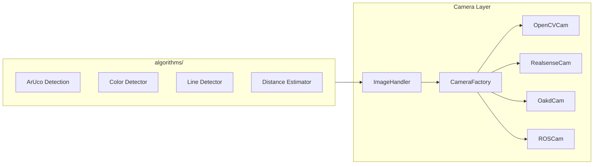

# Nectar SDK

 A modular software development kit for 
autonomous aerial systems built on [ROS2](https://docs.ros.org/). Designed for drone 
competitions, research, and rapid prototyping of of UAV applications


<p>
  <a href="https://docs.ros.org/en/humble/"></a>
  <a href="https://www.python.org/"></a>
  <a href="https://opencv.org/"></a>
  <a href="https://pytorch.org/"></a>
  <a href="https://www.docker.com/"></a>
  <a href="LICENSE"></a>
</p>

| ROS 2 Distro | Build & Test | Docker |
|:---:|:---:|:---:|
| **Humble** | [](https://github.com/Black-Bee-Drones/nectar-sdk/actions/workflows/build-test.yml) | [](https://hub.docker.com/r/blackbeedrones/nectar-sdk/tags?name=humble) |
| **Jazzy** | [](https://github.com/Black-Bee-Drones/nectar-sdk/actions/workflows/build-test.yml) | [](https://hub.docker.com/r/blackbeedrones/nectar-sdk/tags?name=jazzy) |
| **Kilted** | [](https://github.com/Black-Bee-Drones/nectar-sdk/actions/workflows/build-test.yml) | [](https://hub.docker.com/r/blackbeedrones/nectar-sdk/tags?name=kilted) |

Developed by the [Black Bee Drones](https://github.com/Black-Bee-Drones) competition team.

---

## Table of Contents

- [Features](#features)
- [Installation](#installation)
- [Quick Start](#quick-start)
- [Modules](#modules)
- [Architecture](#architecture)
- [Examples](#examples)
- [ROS 2 Nodes](#ros-2-nodes)
- [Directory Structure](#directory-structure)
- [Contributing](#contributing)
- [License](#license)

## Features

### Drone Control
- **Protocol-based architecture** with factory pattern for multiple drone types
- **MAVROS** integration for ArduPilot/PX4 flight controllers ([MAVROS docs](https://github.com/mavlink/mavros))
- **Parrot Bebop 2** support via bebop_autonomy
- **Position navigation** with PID or setpoint strategies
- **GPS waypoint missions** with EGM96 geoid correction
- **Obstacle detection** system with configurable avoidance strategies

### Computer Vision
- **Camera abstraction layer** supporting USB, RealSense, OAK-D, ROS topics
- **ArUco marker detection** with 6-DOF pose estimation ([OpenCV ArUco](https://docs.opencv.org/4.x/d5/dae/tutorial_aruco_detection.html))
- **Color detection** with HSV/LAB calibration tools
- **Line detection** with multiple estimation methods (Hough, RANSAC, rotated rect)
- **Distance estimation** using regression models (linear, polynomial, exponential)

### AI / Deep Learning
- **Multi-framework detection** API: Ultralytics YOLO, HuggingFace Transformers, RF-DETR
- **Training pipelines** with TensorBoard and HuggingFace Hub integration
- **Slicing inference** for high-resolution images
- **Model evaluation** with mAP, precision, recall metrics

### Interface
- **Qt6 / PySide6 GUI** for manual drone control and testing
- **Keyboard controls** with velocity sliders
- **Camera streaming** with snapshot and recording
- **Real-time topic monitoring** and parameter reconfiguration

## Installation

### From Zero (full setup)

```bash
git clone git@github.com:Black-Bee-Drones/nectar-sdk.git
cd nectar-sdk
./scripts/setup.sh full-install    # or: ./scripts/setup.sh (interactive menu)
```

### Already Have ROS 2 + Workspace

```bash
cd ~/ros2_ws/src/nectar-sdk
./scripts/setup.sh python all      # Install Python dependencies
./scripts/setup.sh build            # Build workspace
# or: make install-all && make build
```

### Module-Specific

```bash
./scripts/setup.sh python control   # GPS, PID, navigation
./scripts/setup.sh python vision    # ArUco, color, line detection
./scripts/setup.sh python ai        # YOLO, Transformers, RF-DETR
./scripts/setup.sh python interface # PySide6 GUI
```

All versions and package lists live in [`scripts/lib/config.sh`](scripts/lib/config.sh) (single source of truth).

See [`docs/INSTALL.md`](docs/INSTALL.md) for the full installation guide.

### Docker

```bash
make docker-build       # SDK image (no AI, fast)
make docker-run         # Run with X11 + cameras + USB

make docker-build-full  # Full image (+ PyTorch + AI)
```

See [`docker/README.md`](docker/README.md) for GPU, Jetson, and advanced options.

## Quick Start

### Drone Control

```python
import rclpy
from rclpy.node import Node
from nectar.control import DroneFactory, MavrosConfig, PoseSource

rclpy.init()
node = Node("flight_node")

# Create drone with GPS positioning
config = MavrosConfig(pose_source=PoseSource.GPS)
drone = DroneFactory.create("mavros", config, node)

# Flight sequence
drone.takeoff(altitude=2.0)
drone.move_to(x=5.0, y=0.0, z=0.0, precision=0.3)
drone.land()

drone.cleanup()
rclpy.shutdown()
```

### Camera Capture

```python
import rclpy
from rclpy.node import Node
from nectar.vision import ImageHandler, OpenCVConfig

class CameraNode(Node):
    def __init__(self):
        super().__init__("camera_node")

        config = OpenCVConfig(width=1280, height=720, fps=30)
        self.handler = ImageHandler(
            node=self,
            image_source="webcam",
            config=config,
            image_processing_callback=self.process,
            show_result="Camera"
        )
        self.handler.run()

    def process(self, frame):
        # Process each frame here
        pass

rclpy.init()
rclpy.spin(CameraNode())
```

### Object Detection

```python
from nectar.ai.detection import Detector

# Load model (auto-detects framework)
detector = Detector("yolov8n.pt")
detector.load()

# Run detection
result = detector.detect(image, conf=0.5)
for det in result:
    print(f"{det.class_name}: {det.confidence:.2f} at {det.bbox}")

# Draw annotations
annotated = detector.draw_detections(image, result)
```

## Modules

### [Control](nectar/nectar/control/README.md)

Protocol-based drone control with factory instantiation and configurable navigation.

| Component | Description | Docs |
|-----------|-------------|------|
| `DroneFactory` | Creates drone instances by type | [control/](nectar/nectar/control/README.md) |
| `MavrosDrone` | ArduPilot/PX4 via MAVROS | [mavros/](nectar/nectar/control/mavros/README.md) |
| `BebopDrone` | Parrot Bebop 2 control | [bebop/](nectar/nectar/control/bebop/README.md) |
| `ObstacleManager` | Detection and avoidance | [obstacles/](nectar/nectar/control/obstacles/README.md) |
| `PIDController` | Position control loops | [pid/](nectar/nectar/control/pid/README.md) |

### [Vision](nectar/nectar/vision/README.md)

Camera abstraction and image processing algorithms.



| Component | Description | Docs |
|-----------|-------------|------|
| `CameraFactory` | Multi-backend camera creation | [vision/](nectar/nectar/vision/README.md#camerafactory) |
| `ImageHandler` | ROS 2 timer-based capture | [vision/](nectar/nectar/vision/README.md#imagehandler) |
| `Aruco` | Marker detection and pose | [vision/](nectar/nectar/vision/README.md#aruco-markers) |
| `ColorDetector` | HSV/LAB color filtering | [vision/](nectar/nectar/vision/README.md#color-detection) |
| `LineDetector` | Line estimation methods | [vision/](nectar/nectar/vision/README.md#line-detection) |
| `DistanceEstimator` | Pixel-to-distance models | [vision/](nectar/nectar/vision/README.md#distance-estimation) |

**Supported Cameras:**

| Type | SDK | Use Case |
|------|-----|----------|
| `webcam` | OpenCV | Generic USB cameras |
| `realsense` | [pyrealsense2](https://github.com/IntelRealSense/librealsense) | Intel D435i depth |
| `oakd` | [DepthAI](https://docs.luxonis.com/en/latest/) | Luxonis OAK-D |
| `c920` | OpenCV | Logitech C920/C920e |
| `imx219` | GStreamer | Raspberry Pi Camera v2 |

### [AI](nectar/nectar/ai/README.md)

Deep learning inference and training for object detection.

| Component | Supported Models | External Docs |
|-----------|------------------|---------------|
| `UltralyticsModel` | YOLOv8, YOLOv10, YOLO11 | [Ultralytics](https://docs.ultralytics.com/) |
| `TransformersModel` | DETR, Conditional DETR | [HuggingFace](https://huggingface.co/docs/transformers/) |
| `RFDETRModel` | RF-DETR variants | [RF-DETR](https://github.com/roboflow/RF-DETR) |

### [Interface](nectar/nectar/interface/README.md)

Qt6 / PySide6 GUI for drone testing and control.

| Component | Description |
|-----------|-------------|
| `DroneGUI` | Main application window |
| `BebopComponent` | Bebop-specific controls |
| `MavComponent` | MAVROS-specific controls |

### [Nectar Interfaces](nectar_interfaces/README.md)

Custom ROS 2 message definitions for inter-module communication.

| Message | Description | Used By |
|---------|-------------|---------|
| `ArucoTransforms` | Marker ID, translation, yaw | `ArucoNode` |
| `LineInfo` | Line center, angle, dimensions | `LineDetectionNode` |
| `PhotoInfo` | Photo coordinates and metadata | Vision nodes |

## Architecture

### Design Patterns

| Pattern | Implementation | Purpose |
|---------|----------------|---------|
| **Factory + Registry** | `DroneFactory`, `CameraFactory`, `Detector` | Decouple object creation from usage. Register new types at runtime. |
| **Protocol (Duck Typing)** | `Drone`, `ObstacleDetector` | Define interfaces without inheritance. Enable polymorphism via structural typing. |
| **Strategy** | `AvoidanceStrategy`, `ILineEstimationMethod`, `EstimationModel` | Swap algorithms at runtime. Encapsulate behavior variations. |
| **Abstract Base Class** | `BaseDrone`, `AbstractCam`, `BaseDetectionModel` | Share common implementation. Enforce method contracts. |
| **Dataclass Config** | `MavrosConfig`, `OpenCVConfig`, `TrainingConfig` | Type-safe configuration with defaults and validation. |

### Extensibility

Add new implementations by registering with factories:

```python
# New drone type
from nectar.control import DroneFactory, BaseDrone

class MyCustomDrone(BaseDrone):
    ...

DroneFactory.register("custom", lambda cfg, node: MyCustomDrone(cfg, node))
drone = DroneFactory.create("custom", config, node)

# New camera driver
from nectar.vision import CameraFactory, AbstractCam

class ThermalCamera(AbstractCam):
    ...

CameraFactory.register("thermal", ThermalCamera)
camera = CameraFactory.from_source("thermal")

# New detection framework
from nectar.ai.detection import Detector, BaseDetectionModel

class CustomModel(BaseDetectionModel):
    ...

Detector.register("custom", lambda name, **kw: CustomModel(name, **kw))
detector = Detector("model.bin", framework="custom")
```

## Examples

Working examples are in `nectar/nectar/examples/`:

### Control

| Example | Description | Run |
|---------|-------------|-----|
| `basic.py` | Takeoff, velocity, land | `python3 basic.py --drone mavros` |
| `sensors.py` | GPS/vision data monitoring | `python3 sensors.py --source gps` |
| `pid_simulation.py` | PID controller simulation | `python3 pid_simulation.py --plot` |
| `mavros_navigation.py` | Position navigation | `python3 mavros_navigation.py` |
| `mavros_obstacles.py` | Obstacle avoidance | `python3 mavros_obstacles.py` |

See [examples/control/](nectar/nectar/examples/control/README.md)

### Vision

| Example | Description | Run |
|---------|-------------|-----|
| `camera_example.py` | Multi-camera capture | `ros2 run nectar camera_example` |
| `depth_example.py` | Depth visualization | `ros2 run nectar depth_example --camera realsense` |

See [examples/vision/](nectar/nectar/examples/vision/README.md)

### AI

| Example | Description | Run |
|---------|-------------|-----|
| `detector_example.py` | Real-time detection | `ros2 run nectar detector_example` |
| `batch_detector.py` | Batch image/video processing | `python3 batch_detector.py --input ./images` |

See [examples/ai/](nectar/nectar/examples/ai/README.md)

## ROS 2 Nodes

```bash
# GUI
ros2 run nectar app.py

# ArUco detection
ros2 run nectar aruco_node.py --ros-args -p image_source:=webcam -p marker_dict:=5 -p tag_size:=0.05

# Line detection
ros2 run nectar line_detection_node.py --ros-args -p line_colors:="blue,red" -p method:=HoughLinesP

# Color calibration
ros2 run nectar color_calibration_node.py --ros-args -p image_source:=webcam

# Camera calibration
ros2 run nectar calibration.py --ros-args -p chessboard_size:="9,7"

# Webcam publisher
ros2 run nectar webcam_publisher_node.py --ros-args -p width:=1280 -p height:=720

# Object detection
ros2 run nectar detector_example.py --ros-args -p model_source:=yolov8n.pt
```

## Directory Structure

```
nectar-sdk/
├── scripts/                    # Setup & installation
│   ├── setup.sh                # CLI + interactive menu
│   └── lib/                    # Modular functions
│       ├── config.sh           # Versions, packages (single source of truth)
│       ├── common.sh           # Logging utilities
│       ├── system.sh           # apt packages
│       ├── ros2.sh             # ROS 2 install + env
│       ├── python.sh           # pip from pyproject.toml
│       ├── realsense.sh        # Intel RealSense D435i
│       ├── workspace.sh        # Build, clean, verify
│       └── git.sh              # Git/SSH setup
├── docker/                     # Container setup
│   ├── Dockerfile              # x86_64: sdk + sdk-full
│   └── Dockerfile.jetson       # ARM64: Jetson Orin Nano
├── docs/                       # Project documentation
│   ├── INSTALL.md
│   ├── CONTRIBUTING.md
│   ├── CODE_OF_CONDUCT.md
│   └── SECURITY.md
├── nectar_interfaces/          # ROS 2 message definitions
│   ├── CMakeLists.txt
│   ├── package.xml
│   └── msg/
├── nectar/                     # Main ROS 2 package (ament_cmake + ament_cmake_python)
│   ├── CMakeLists.txt
│   ├── package.xml
│   ├── pyproject.toml          # Python dependencies (single source of truth)
│   └── nectar/                 # Python package
│       ├── control/            # Drone control module
│       ├── vision/             # Computer vision module
│       ├── ai/                 # AI / Detection module
│       ├── interface/          # Qt6 / PySide6 GUI
│       ├── examples/           # Working examples
│       │   ├── control/
│       │   ├── vision/
│       │   └── ai/
│       └── utils/              # Shared utilities
├── Makefile                    # Thin wrapper around setup.sh
└── README.md
```

## Contributing

We welcome contributions from the community! Please see our [`CONTRIBUTING.md`](docs/CONTRIBUTING.md) guide to get started.

Before contributing:
1. Check [GitHub Issues](https://github.com/Black-Bee-Drones/nectar-sdk/issues) for existing discussions
2. Follow [Conventional Commits](https://www.conventionalcommits.org) for commit messages
3. Read our [Code of Conduct](docs/CODE_OF_CONDUCT.md)

Thank you to all our contributors!

<a href="https://github.com/Black-Bee-Drones/nectar-sdk/graphs/contributors">
  
</a>

## References

| Resource | Link |
|----------|------|
| ROS 2 Humble | [docs.ros.org/en/humble](https://docs.ros.org/en/humble/) |
| MAVROS | [github.com/mavlink/mavros](https://github.com/mavlink/mavros) |
| OpenCV | [docs.opencv.org](https://docs.opencv.org/4.x/) |
| Ultralytics YOLO | [docs.ultralytics.com](https://docs.ultralytics.com/) |
| HuggingFace Transformers | [huggingface.co/docs/transformers](https://huggingface.co/docs/transformers/) |
| Intel RealSense | [github.com/IntelRealSense/librealsense](https://github.com/IntelRealSense/librealsense) |
| Luxonis DepthAI | [docs.luxonis.com](https://docs.luxonis.com/en/latest/) |
| PyTorch | [pytorch.org/docs](https://pytorch.org/docs/stable/index.html) |

## License

This project is licensed under the Apache-2.0 License — see the [`LICENSE`](LICENSE) file for details.
