# Nectar SDK

<div align="center">


ROS 2 software development kit for autonomous aerial systems. Provides unified interfaces for flight control, computer vision, and object detection through a modular, extensible architecture.

<p align="center">
  <a href="LICENSE"></a>
  <a href="https://github.com/Black-Bee-Drones/nectar-sdk/releases/latest"></a>
  <a href="https://github.com/Black-Bee-Drones/nectar-sdk/compare/main...dev"></a>
  <a href="https://github.com/Black-Bee-Drones/nectar-sdk/stargazers"></a>
</p>

| ROS 2 Distro | Build & Test | Docker |
|:---:|:---:|:---:|
| **Humble** | [](https://github.com/Black-Bee-Drones/nectar-sdk/actions/workflows/build-test-humble.yml) | [](https://hub.docker.com/r/blackbeedrones/nectar-sdk/tags?name=humble) |
| **Jazzy** | [](https://github.com/Black-Bee-Drones/nectar-sdk/actions/workflows/build-test-jazzy.yml) | [](https://hub.docker.com/r/blackbeedrones/nectar-sdk/tags?name=jazzy) |
| **Kilted** | [](https://github.com/Black-Bee-Drones/nectar-sdk/actions/workflows/build-test-kilted.yml) | [](https://hub.docker.com/r/blackbeedrones/nectar-sdk/tags?name=kilted) |

</div>

## Table of Contents

- [Features](#features)
  - [Drone Control](#drone-control)
  - [Computer Vision](#computer-vision)
  - [AI / Detection](#ai--detection)
  - [Sensors](#sensors)
  - [Localization](#localization)
  - [Interface](#interface)
  - [Nectar Interfaces](#nectar-interfaces)
- [Installation](#installation)
- [Architecture](#architecture)
- [Documentation](#documentation)
- [ROS 2 Nodes](#ros-2-nodes)
- [Examples](#examples)
- [Simulation](#simulation)
- [Directory Structure](#directory-structure)
- [Contributing](#contributing)
- [Black Bee Drones](#black-bee-drones)
- [Acknowledgments](#acknowledgments)
- [License](#license)

## Features

### [Drone Control](nectar/nectar/control/README.md)

Protocol-based drone interface with factory instantiation. `DroneFactory` creates drone implementations by key — [ArduPilot](https://ardupilot.org/) over two transports ([MAVROS](https://github.com/mavlink/mavros) or direct [pymavlink](https://mavlink.io/en/mavgen_python/)) and [PX4](https://px4.io/) over three (MAVROS, direct pymavlink, or native [uXRCE-DDS](https://docs.px4.io/main/en/middleware/uxrce_dds.html)), plus Parrot Bebop 2 and Bitcraze Crazyflie, extensible to any platform. ArduPilot and PX4 share one firmware-agnostic vehicle core, so flight behavior is identical regardless of autopilot or link; each firmware adds only its own semantics (ArduPilot GUIDED, PX4 OFFBOARD streaming). All drones implement the same `Drone` protocol: takeoff, land, move_to, move_to_gps, move_velocity, rtl, obstacle management.

- Position navigation via PID control or FCU setpoints, in body, world, or takeoff reference frames
- GPS waypoint missions with [EGM96](https://en.wikipedia.org/wiki/EGM96) geoid correction for AMSL altitude
- Event-based obstacle detection with strategy-based avoidance (pause, axis disable, custom sequences)
- Return-to-launch with PID or ArduPilot-native RTL modes
- Per-axis PID tuning via YAML with runtime updates

```python
import nectar
from nectar.control import DroneFactory, MavrosConfig, PoseSource

nectar.init()
drone = DroneFactory.create("mavros", MavrosConfig(pose_source=PoseSource.GPS))

drone.takeoff(altitude=2.0)
drone.move_to(x=5.0, y=0.0, z=0.0, precision=0.3)
drone.move_to_gps(lat=-22.413, lon=-45.449, alt=15.0)
drone.land()
nectar.shutdown()
```

The same flight calls drive every backend — change only the factory key and its config:

| Key | Config | Vehicle / transport |
|-----|--------|---------------------|
| `mavros` | `MavrosConfig` | ArduPilot over MAVROS |
| `mavlink` | `MavlinkConfig` | ArduPilot over direct MAVLink (no MAVROS) |
| `px4` | `Px4MavrosConfig` | PX4 over MAVROS (OFFBOARD) |
| `px4_mavlink` | `Px4MavlinkConfig` | PX4 over direct MAVLink (no MAVROS) |
| `px4_dds` | `Px4DdsConfig` | PX4 over native uXRCE-DDS |
| `bebop` | `BebopConfig` | Parrot Bebop 2 |
| `crazyflie` | `CrazyflieConfig` | Bitcraze Crazyflie |

[Control overview](nectar/nectar/control/README.md) · [Vehicle core](nectar/nectar/control/vehicle/README.md) · [ArduPilot](nectar/nectar/control/ardupilot/README.md) · [PX4](nectar/nectar/control/px4/README.md) · [MAVROS](nectar/nectar/control/mavros/README.md) · [MAVLink](nectar/nectar/control/mavlink/README.md) · [Localization](nectar/nectar/control/localization/README.md) · [Obstacles](nectar/nectar/control/obstacles/README.md) · [PID](nectar/nectar/control/pid/README.md) · [Bebop](nectar/nectar/control/bebop/README.md) · [Crazyflie](nectar/nectar/control/crazyflie/README.md)

### [Computer Vision](nectar/nectar/vision/README.md)

Camera abstraction and image processing. `CameraFactory` auto-detects the source type from a string identifier and returns the matching driver. `ImageHandler` wraps any camera in a ROS 2 timer loop with frame callbacks and optional OpenCV display.

- Camera drivers: USB ([OpenCV](https://opencv.org/)), Intel [RealSense](https://github.com/IntelRealSense/librealsense) D4xx, Luxonis [OAK-D](https://docs.luxonis.com/), ROS 2 topics, Raspberry Pi Camera v2
- [ArUco](https://docs.opencv.org/4.x/d5/dae/tutorial_aruco_detection.html) marker detection with 6-DOF pose estimation
- Color detection with HSV/LAB calibration and interactive trackbars
- Line detection with five estimation methods (Hough, RANSAC, rotated rect, fit ellipse, adaptive Hough)
- Distance estimation via six regression models (linear, polynomial, exponential, logarithmic, inverse power, robust)
- Hand and face tracking via [MediaPipe](https://ai.google.dev/edge/mediapipe/solutions)

```python
import nectar
from nectar.vision import CameraFactory, ImageHandler, OpenCVConfig, Aruco

nectar.init()

# One factory, any camera
camera = CameraFactory.from_source("webcam", config=OpenCVConfig(width=1280, height=720))
camera = CameraFactory.from_source("realsense")
camera = CameraFactory.from_source("/camera/image_raw")   # ROS 2 topic

# Timer-based capture with processing callback
aruco = Aruco(marker_dict=5, tag_size=0.05)

handler = ImageHandler(
    image_source="webcam",
    image_processing_callback=lambda frame: aruco.pose_estimate(frame, draw=True),
    show_result="Camera",
)
handler.run()
nectar.spin()
```

[Vision overview](nectar/nectar/vision/README.md) · [Cameras](nectar/nectar/vision/camera/README.md) · [Algorithms](nectar/nectar/vision/algorithms/README.md) · [ROS 2 nodes](nectar/nectar/vision/nodes/README.md)

### [AI / Detection](nectar/nectar/ai/README.md)

Object detection across three frameworks through `Detector`, a single factory-based entry point. Auto-detects the framework from the model path or accepts explicit selection. Models load from local files, Ultralytics Hub, or HuggingFace Hub.

- [Ultralytics YOLO](https://docs.ultralytics.com/) (YOLOv8, YOLOv10, YOLO11), [HuggingFace Transformers](https://huggingface.co/docs/transformers/) (DETR, Conditional DETR), [RF-DETR](https://github.com/roboflow/RF-DETR)
- Training with per-framework config dataclasses, [TensorBoard](https://www.tensorflow.org/tensorboard) logging, [HuggingFace Hub](https://huggingface.co/docs/hub/) push
- Slicing inference for high-resolution images with four post-processing strategies (NMS, Soft-NMS, WBF, NMM)
- Model evaluation with mAP, precision, recall via [supervision](https://github.com/roboflow/supervision)
- CLI tools (`nectar-ai`) for predict, train, and evaluate workflows

```python
from nectar.ai.detection import Detector

detector = Detector("yolov8n.pt")                         # Ultralytics YOLO
detector = Detector("facebook/detr-resnet-50")             # HuggingFace DETR
detector = Detector("rfdetr-nano")                         # RF-DETR

detector.load()
result = detector.detect(image, conf=0.5)

for det in result:
    print(f"{det.class_name}: {det.confidence:.2f} at {det.xyxy}")

annotated = detector.draw_detections(image, result)
```

[AI overview](nectar/nectar/ai/README.md) · [Detection details](nectar/nectar/ai/detection/README.md) · [Segmentation](nectar/nectar/ai/segmentation/README.md)

### [Sensors](nectar/nectar/sensors/README.md)

Companion-side sensor drivers and value filters, plus a ready-made ROS 2 node that bridges a serial rangefinder to MAVLink `DISTANCE_SENSOR` so an ArduPilot/PX4 FCU can consume it as its primary rangefinder. Composition-first: any `DistanceSensor` driver and optional `DistanceFilter` plug into a `RangefinderPublisher` that pushes filtered samples into a [`MavlinkConnection`](nectar/nectar/control/mavlink/README.md). Designed to run in parallel with MAVROS so missions stay unchanged.

- [Benewake TF-Luna](https://en.benewake.com/TFLuna/index.html) UART driver with checksum and signal-strength gating
- `ObstacleMaskFilter` for masking step-drops in the rangefinder when crossing obstacles (the canonical case where ArduPilot would otherwise climb to "compensate"). Auto-estimates the obstacle height from the entry drop magnitude; pass `obstacle_height_m` to lock it.
- ROS 2 node fully parameterized via launch file — start it alongside the mission, no mission code changes needed

```python
from nectar.control import MavlinkConnection
from nectar.sensors import ObstacleMaskFilter, RangefinderPublisher, TFLuna

sensor = TFLuna(port="/dev/ttyUSB0")
conn = MavlinkConnection()
conn.connect("udp:127.0.0.1:14551")

publisher = RangefinderPublisher(
    sensor=sensor,
    connection=conn,
    rate_hz=50.0,
    filter=ObstacleMaskFilter(),  # auto-detect; pass obstacle_height_m=X to lock
)
publisher.start()
```

[Sensors overview](nectar/nectar/sensors/README.md) · [MAVLink connection](nectar/nectar/control/mavlink/README.md)

### [Localization](nectar/nectar/control/localization/README.md)

External-navigation integration for GPS-denied (indoor) flight. A producer (Intel RealSense + [Isaac ROS Visual SLAM](https://nvidia-isaac-ros.github.io/repositories_and_packages/isaac_ros_visual_slam/isaac_ros_visual_slam/index.html)) runs in a dedicated Jetson container; a consumer bridge forwards the VSLAM pose to the FCU so its EKF (ArduPilot EKF3 / PX4 EKF2) can estimate position without GPS. Producer and consumer share a `ROS_DOMAIN_ID` over host networking.

- Producer launch (`isaac_vslam_realsense.launch.py`): RealSense stereo IR + IMU and Isaac ROS Visual SLAM
- Consumer launch (`vision_pose.launch.py`): `backend:=mavros` republishes onto `/mavros/vision_pose/pose_cov`, or `backend:=mavlink` sends `VISION_POSITION_ESTIMATE` directly (no MAVROS)
- RViz check (`vslam_rviz.launch.py`): `profile:=light|full` for pre-flight pose/drift/loop-closure inspection
- Self-contained Isaac container ([`docker/isaac_vslam`](docker/isaac_vslam)) wrapping NVIDIA's `isaac_ros_common`

```bash
# Producer (Isaac container) - enter and launch
make isaac-run
nectar-vslam

# Consumer (SDK container or host), same ROS_DOMAIN_ID
ros2 launch nectar vision_pose.launch.py backend:=mavros fcu_url:=/dev/ttyTHS1:921600
```

[Localization overview](nectar/nectar/control/localization/README.md) — topology, components, backends, FCU setup, visualization

### [Interface](nectar/nectar/interface/README.md)

[Qt6 / PySide6](https://doc.qt.io/qtforpython-6/) desktop application for testing and operating the SDK without writing code. Three tabs: **Control** (firmware + link selection for ArduPilot and PX4 over MAVROS / direct MAVLink / uXRCE-DDS, plus Bebop and Crazyflie; arm/takeoff/land, keyboard velocity control, position navigation), **Vision** (camera streaming with 20+ real-time filters including ArUco detection and MediaPipe tracking), and **ROS** (topic browser/subscriber/publisher, service caller, parameter viewer, image subscriber).

[Interface overview](nectar/nectar/interface/README.md) — architecture, tabs, widgets, threading model, camera integration, theming

### [Nectar Interfaces](nectar_interfaces/README.md)

Custom ROS 2 messages connecting vision output to control decisions:

| Message | Fields | Published By |
|---------|--------|--------------|
| `ArucoTransforms` | marker ID, translation vector, yaw | `ArucoNode` |
| `LineInfo` | center XY, angle, width, height | `LineDetectionNode` |
| `PhotoInfo` | coordinate array, photo identifier | Vision nodes |

[Interfaces overview](nectar_interfaces/README.md) — message definitions, usage examples (Python/C++), building, verification

## Installation

Pick the row that matches where you're starting from:

| Your starting point | Run |
|---|---|
| Fresh machine, no ROS 2 | `bash <(curl -fsSL https://raw.githubusercontent.com/Black-Bee-Drones/nectar-sdk/main/scripts/bootstrap.sh)` |
| Have ROS 2, no SDK yet | `cd ~/ros2_ws/src && git clone git@github.com:Black-Bee-Drones/nectar-sdk.git && cd nectar-sdk && make setup` |
| Have the SDK cloned | `make setup` (opens the setup menu) |
| Want zero host setup | `make docker-build && make docker-run` (or `docker-build-full` for AI) |

`make setup` (or `./scripts/setup.sh` with no args) opens an interactive menu — nothing installs until you choose. From it you can run a quick setup, pick Python modules, configure a drone driver, install system packages (skipped when already present), set up the ROS 2 environment, build, and verify. The core install does not pull control backends: MAVROS and the other drivers are opt-in (e.g. `make drone-mavros`), so you only install the protocol your vehicle uses. Python deps go into a shared [uv](https://github.com/astral-sh/uv)-managed workspace venv (`$WORKSPACE/.venv`) that every workspace project reuses ([details](docs/setup/index.md#python-environment)). Full reference: the **[Installation Guide](docs/setup/index.md)** and the tested **[compatibility matrix](docs/COMPATIBILITY.md)**; all versions live in [`scripts/lib/config.sh`](scripts/lib/config.sh).

Then add only what your mission needs:

| Goal | Commands |
|---|---|
| ArduPilot / PX4 over direct MAVLink (simplest) | `make setup` (pick `control`) then `make drone-mavros` |
| ArduPilot / PX4 over MAVROS | `make setup` (pick `control`) then `make drone-mavros` |
| PX4 over uXRCE-DDS + object detection | `make setup` (pick `control ai`) then `make drone-px4-dds` |
| Crazyflie / Bebop | `make drone-crazyflie` / `make drone-bebop` |
| GUI app only | `make python-interface` |
| A single module | `make python-vision` (or `python-control` / `python-ai` / `python-sensors`) |
| Everything (AI + GPU) | `make python-full && make pytorch` |

To **fly real hardware**, start the driver/bridge your mission connects to with `make driver DRONE=<type> ENV=<outdoor\|indoor>` (the real-world counterpart of `make sim-bridge`), then run a mission/example. See the **[Drone drivers guide](docs/setup/drivers.md)** for worked examples (direct-MAVLink 2 m square, Crazyflie, PX4-DDS + detection).

## Architecture

End-to-end view: mission code, state machines, and the GUI drive the SDK modules, which reach flight controllers, cameras, and detection models through ROS 2. Each module README holds its own detailed class diagram.

```mermaid
flowchart TB
    subgraph APP["Mission / Application"]
        direction LR
        Mission["User mission code<br/>/ examples"]
        FSM["State machines<br/>(Yasmin)"]
        GUI["Qt6 GUI<br/>(NectarApp)"]
    end

    subgraph SDK["Nectar SDK"]
        direction TB

        subgraph CTRL["control"]
            direction TB
            DroneFactory(["DroneFactory"])
            DroneProto{{"Drone protocol"}}
            subgraph CORE["vehicle - shared core"]
                direction TB
                VehicleDrone["VehicleDrone<br/>shared flight logic"]
                ArduPilotDrone["ArduPilotDrone"]
                Px4Drone["Px4Drone"]
                Navigator["VehicleNavigator"]
                Sequencer["FlightSequencer"]
                PID["PIDController"]
                MavrosT["MavrosTransport"]
                PymavlinkT["PymavlinkTransport"]
                DdsT["Px4DdsTransport"]
            end
            Bebop["BebopDrone"]
            Crazyflie["CrazyflieDrone"]
            ObstacleMgr["ObstacleManager<br/>detector + strategy"]
            VisionBridge["localization<br/>vision-pose bridge"]
        end

        subgraph VIS["vision"]
            direction TB
            CameraFactory(["CameraFactory"])
            ImageHandler["ImageHandler"]
            VisAlgos["ArUco · Color · Line<br/>Distance · MediaPipe"]
        end

        subgraph AIM["ai"]
            direction TB
            DetSeg(["Detector / Segmentor"])
            Slicing["SlicingInference"]
            Evalr["Evaluation<br/>mAP / IoU"]
        end

        subgraph SENS["sensors"]
            Rangefinder["RangefinderPublisher<br/>TF-Luna + filters"]
        end

        subgraph UTIL["utils"]
            direction LR
            GPSU["GPSCalculate"]
            PosU["PositionUtils"]
            ProcU["ProcessUtils"]
        end
    end

    subgraph ROS["ROS 2 middleware"]
        direction LR
        Topics["Topics · Services<br/>Actions · TF2"]
        Msgs["nectar_interfaces<br/>ArucoTransforms · LineInfo · PhotoInfo"]
    end

    subgraph EXT["External systems"]
        direction LR
        FCU["Flight controller<br/>ArduPilot · PX4 · Bebop"]
        Cameras["Cameras<br/>USB · RealSense · OAK-D"]
        VSLAM["Isaac ROS Visual SLAM<br/>GPS-denied pose"]
        Models["Models<br/>YOLO · DETR · RF-DETR"]
    end

    Mission --> DroneFactory & CameraFactory & DetSeg
    FSM --> DroneFactory
    GUI --> DroneFactory & CameraFactory

    DroneFactory --> DroneProto
    DroneProto -. implements .-> VehicleDrone
    DroneProto -.-> Bebop
    DroneProto -.-> Crazyflie
    VehicleDrone -. firmware .-> ArduPilotDrone & Px4Drone
    VehicleDrone --> Navigator & Sequencer & ObstacleMgr & MavrosT & PymavlinkT & DdsT
    Navigator --> PID & GPSU & PosU

    CameraFactory --> ImageHandler --> VisAlgos
    ObstacleMgr -. depth .-> ImageHandler
    DetSeg --> Slicing & Evalr & Models

    MavrosT <--> Topics
    PymavlinkT <--> FCU
    DdsT <--> FCU
    VSLAM --> VisionBridge --> FCU
    Rangefinder --> FCU
    Topics <--> FCU
    ImageHandler <--> Topics
    ImageHandler --> Cameras
    VisAlgos --> Msgs
    ProcU -. spawns drivers .-> FCU

    classDef entry fill:#dbeafe,stroke:#2563eb,color:#0b2447,font-weight:bold;
    classDef ext fill:#f5ead2,stroke:#b08900,color:#3a2f00;
    classDef ros fill:#d8f3e3,stroke:#16a34a,color:#0b3d1f;
    class DroneFactory,CameraFactory,DetSeg entry;
    class FCU,Cameras,VSLAM,Models ext;
    class Topics,Msgs ros;
    style APP fill:#f6f5ff,stroke:#8b80c9
    style SDK fill:#f8fafc,stroke:#94a3b8
    style ROS fill:#f1fbf5,stroke:#86c9a4
    style EXT fill:#fdfaf0,stroke:#cdb46a
    style CORE fill:#eef4ff,stroke:#7aa0d6
```



### Design Patterns

The codebase uses the same patterns across all modules, making it predictable to navigate and extend:

| Pattern | Where | What It Does |
|---------|-------|--------------|
| **Factory + Registry** | `DroneFactory`, `CameraFactory`, `Detector` | Decouples creation from usage. New types are registered at runtime and instantiated by key. |
| **Protocol** | `Drone`, `ObstacleDetector` | Defines interfaces via structural typing (duck typing). Any class matching the signature is accepted. |
| **Strategy** | `AvoidanceStrategy`, `ILineEstimationMethod`, `EstimationModel`, `BaseMergingStrategy` | Encapsulates interchangeable algorithms behind a common interface. |
| **Abstract Base Class** | `BaseDrone`, `AbstractCam`, `DepthCam`, `BaseDetectionModel` | Shares common logic and enforces method contracts for concrete implementations. |
| **Dataclass Config** | `MavrosConfig`, `OpenCVConfig`, `TrainingConfig`, `EvaluationConfig` | Type-safe configuration with defaults, validation, and YAML serialization. |

Every factory supports runtime registration, so adding a new drone type, camera driver, or detection framework follows the same pattern:

```python
DroneFactory.register("custom", lambda cfg, executor: MyDrone(cfg, executor))
drone = DroneFactory.create("custom", config)

CameraFactory.register("thermal", ThermalCamera)
camera = CameraFactory.from_source("thermal")

Detector.register("custom", lambda name, **kw: CustomModel(name, **kw))
detector = Detector("model.bin", framework="custom")
```

## Documentation

| Document | Contents |
|----------|----------|
| [Installation Guide](docs/setup/index.md) | Bootstrap, workspace setup, Python environment (uv venv), module install, PyTorch, build & verify, troubleshooting |
| [Control Module](nectar/nectar/control/README.md) | Drone protocol, factory, configuration, capabilities, submodule index |
| [Vehicle Core](nectar/nectar/control/vehicle/README.md) | Firmware-agnostic core: bridge design, firmware hooks, navigation, frames, altitude, takeoff/land, GPS/EGM96, PID |
| [ArduPilot Vehicle Core](nectar/nectar/control/ardupilot/README.md) | ArduPilot specifics: GUIDED arming, `GUID_OPTIONS`/WPNAV, native RTL, parameters |
| [PX4](nectar/nectar/control/px4/README.md) | PX4 specifics: OFFBOARD setpoint streaming, flight modes, AUTO.LAND/RTL; MAVROS / direct-MAVLink / uXRCE-DDS backends |
| [MAVROS Transport](nectar/nectar/control/mavros/README.md) | MAVROS plumbing: telemetry mapping, topics/services, service-ACK behavior, indoor vision |
| [MAVLink Transport](nectar/nectar/control/mavlink/README.md) | Direct pymavlink: connection, RX/TX, stream rates, vision bridge |
| [Localization](nectar/nectar/control/localization/README.md) | Indoor VSLAM: Isaac producer, vision-pose bridge (MAVROS/MAVLink), Isaac container, RViz |
| [Obstacle Detection](nectar/nectar/control/obstacles/README.md) | Depth detector, avoidance strategies, handler/manager configuration |
| [PID Controller](nectar/nectar/control/pid/README.md) | Tuning guide, YAML config, runtime updates, default indoor/outdoor configs |
| [Bebop Implementation](nectar/nectar/control/bebop/README.md) | Bebop 2 control, velocity, acrobatics |
| [Crazyflie Implementation](nectar/nectar/control/crazyflie/README.md) | Crazyswarm2 control, position/velocity, parameters |
| [Sensors Module](nectar/nectar/sensors/README.md) | TF-Luna driver, rangefinder filters, MAVLink `DISTANCE_SENSOR` bridge, ROS 2 node |
| [Vision Module](nectar/nectar/vision/README.md) | Camera drivers, ArUco, color, line, distance, MediaPipe, nodes, calibration |
| [AI Module](nectar/nectar/ai/README.md) | Detector/Segmentor API, training, evaluation, `nectar-ai` CLI |
| [Detection Module](nectar/nectar/ai/detection/README.md) | Class diagram, core types, framework configs, slicing, CLI, extension guide |
| [Segmentation Module](nectar/nectar/ai/segmentation/README.md) | Segmentor API, training, evaluation |
| [Interface Module](nectar/nectar/interface/README.md) | GUI tabs, widgets, threading model, camera integration, theming |
| [Nectar Interfaces](nectar_interfaces/README.md) | ROS 2 message definitions, Python/C++ usage |
| [Simulation](nectar/simulation/README.md) | ArduPilot SITL + Gazebo, indoor/outdoor, vision pipeline, test suite |
| [Docker Guide](docker/README.md) | Build variants, GPU, RealSense, Isaac VSLAM container, dependency strategy |
| [Contributing](docs/CONTRIBUTING.md) | Development setup, code style, documentation conventions, PR process |
| [Releasing](docs/RELEASING.md) | Version bump, CI workflows, Docker Hub push |

## ROS 2 Nodes

Pre-built nodes installed by the package (run with `ros2 run nectar <node>`):

```bash
# GUI
ros2 run nectar app.py

# ArUco detection
ros2 run nectar aruco_node.py --ros-args \
    -p image_source:=webcam -p marker_dict:=5 -p tag_size:=0.05

# Line detection
ros2 run nectar line_detection_node.py --ros-args \
    -p line_colors:="blue,red" -p method:=HoughLinesP

# Color / camera calibration
ros2 run nectar color_calibration_node.py --ros-args -p image_source:=webcam
ros2 run nectar calibration.py --ros-args -p chessboard_size:="9,7"

# Camera publisher
ros2 run nectar camera_publisher_node.py --ros-args -p camera_source:=webcam

# Rangefinder bridge (TF-Luna over UART -> MAVLink DISTANCE_SENSOR)
ros2 run nectar rangefinder_node.py --ros-args \
    -p serial_port:=/dev/ttyUSB0 -p mavlink_url:=udp:127.0.0.1:14551 -p filter:=obstacle_mask

# Vision-pose bridge (VSLAM pose -> FCU, MAVROS or direct MAVLink)
ros2 run nectar vision_pose_node.py --ros-args -p backend:=mavros
```

Localization and simulation are launch-based (see their READMEs):

```bash
ros2 launch nectar isaac_vslam_realsense.launch.py   # RealSense + Isaac VSLAM (Isaac container)
ros2 launch nectar vision_pose.launch.py backend:=mavros   # FCU vision-pose feed
ros2 launch nectar vslam_rviz.launch.py profile:=light     # VSLAM RViz check
```

## Examples

Working examples in `nectar/nectar/examples/` (see each area's README for full arguments):

| Example | Description |
|---------|-------------|
| [basic.py](nectar/nectar/examples/control/basic.py) | Takeoff, velocity/hover/position, land — any drone (`--drone`) |
| [navigation.py](nectar/nectar/examples/control/navigation.py) | ArduPilot navigation test suite (MAVROS/MAVLink, indoor/outdoor) |
| [interactive_navigation.py](nectar/nectar/examples/control/interactive_navigation.py) | Interactive navigation REPL |
| [obstacles.py](nectar/nectar/examples/control/obstacles.py) | Obstacle avoidance |
| [sensors.py](nectar/nectar/examples/control/sensors.py) | Monitor GPS/vision telemetry |
| [pid_simulation.py](nectar/nectar/examples/control/pid_simulation.py) | PID controller simulation |
| [camera_example.py](nectar/nectar/examples/vision/camera_example.py) · [depth_example.py](nectar/nectar/examples/vision/depth_example.py) | Camera capture / depth |
| [detector_example.py](nectar/nectar/examples/ai/detector_example.py) · [batch_detector.py](nectar/nectar/examples/ai/batch_detector.py) | Object detection |
| [rangefinder_example.py](nectar/nectar/examples/sensors/rangefinder_example.py) | TF-Luna -> filter -> MAVLink `DISTANCE_SENSOR` bench test |
| [sitl_test.py](nectar/nectar/examples/simulation/sitl_test.py) | Automated SITL flight tests |

See: [control](nectar/nectar/examples/control/README.md) · [vision](nectar/nectar/examples/vision/README.md) · [AI](nectar/nectar/examples/ai/README.md) · [sensors](nectar/nectar/examples/sensors/README.md)

## Simulation

ArduPilot or PX4 SITL with Gazebo, indoor and outdoor, over MAVROS or direct MAVLink — one unified, parameterized CLI. Two terminals: `make sim-start FIRMWARE=.. ENV=..` runs the simulator, `make sim-bridge FIRMWARE=.. ENV=.. PROTOCOL=..` runs the Gazebo/ROS stack (defaults: `ardupilot` / `outdoor` / `mavros`). Both firmwares fly the same shared arena with a matched sensor suite. See the **[Simulation guide](nectar/simulation/README.md)** for the full matrix and the test suite.

## Directory Structure

```
nectar-sdk/
├── scripts/                    # Setup and installation
│   ├── bootstrap.sh            # Standalone curl installer
│   ├── setup.sh                # CLI + interactive menu
│   ├── lib/                    # Modular shell functions (config.sh, ros2.sh, python.sh, drones.sh, simulation.sh, ...)
│   └── simulation/             # SITL/Gazebo install + start, gz_vision_source.py
├── docker/
│   ├── Dockerfile              # x86_64: sdk + sdk-full stages
│   ├── Dockerfile.jetson       # ARM64: Jetson Orin Nano
│   └── isaac_vslam/            # Isaac ROS Visual SLAM container (run_dev.sh wrapper)
├── docs/                       # INSTALL, CONTRIBUTING, RELEASING, SECURITY, CODE_OF_CONDUCT
├── nectar_interfaces/          # ROS 2 custom messages (msg/)
├── nectar/                     # Main ROS 2 package (CMakeLists.txt, package.xml, pyproject.toml)
│   ├── launch/                 # sitl, sitl_gazebo, isaac_vslam_realsense, vision_pose, vslam_rviz
│   ├── simulation/             # Gazebo worlds, models, params, config
│   └── nectar/                 # Python package
│       ├── control/            # Drone control: vehicle (core), ardupilot, px4, mavros, mavlink,
│       │                       #   bebop, crazyflie, localization, obstacles, pid, */config
│       ├── vision/             # Computer vision
│       ├── ai/                 # AI: detection, segmentation
│       ├── sensors/            # Sensor drivers, filters, MAVLink bridges
│       ├── interface/          # Qt6 GUI
│       ├── examples/           # control, vision, ai, sensors, simulation
│       └── utils/
├── Makefile
└── README.md
```

## Contributing

We welcome contributions. Please see the [Contributing guide](docs/CONTRIBUTING.md) for development setup, code style (PEP 8, NumPy docstrings, type hints), documentation conventions, and the PR process.

1. Check [GitHub Issues](https://github.com/Black-Bee-Drones/nectar-sdk/issues) for existing discussions
2. Follow [Conventional Commits](https://www.conventionalcommits.org) for commit messages
3. Read our [Code of Conduct](docs/CODE_OF_CONDUCT.md)

<div align="center">
<a href="https://github.com/Black-Bee-Drones/nectar-sdk/graphs/contributors">
  
</a>
</div>

## Black Bee Drones

[Black Bee Drones](https://github.com/Black-Bee-Drones) is Latin America's first academic autonomous drone team. Founded as a research project at the [Federal University of Itajuba](https://unifei.edu.br/) (UNIFEI) in 2014, the team develops unmanned aircraft for complex missions requiring computer vision and artificial intelligence. We compete nationally and internationally, including [IMAV](https://www.imavs.org/) (3rd place indoor 2023 and 2025, 3rd place outdoor 2015, best autonomous indoor flight worldwide), [CBR RoboCup Flying Robots League](https://cbr.robocup.org.br/), [SAE Eletroquad](https://saebrasil.org.br/programas-estudantis/eletroquad/,) and participate in events like DroneShow and Campus Party.

Nectar SDK started in 2023 as a way to stop rewriting the same camera, PID, and detection code for each competition mission. It evolved into a ROS 2 package with consistent interfaces across drone control, computer vision, and AI detection — the shared foundation our team uses for every project. It has been turned into an open-source project to enable continuous development and to help other teams and researchers build autonomous systems more rapidly.

## Acknowledgments

Nectar SDK exists because of the open source projects it builds on. We are grateful to the [ROS 2](https://docs.ros.org/) community and Open Robotics for the middleware that connects everything. [MAVROS](https://github.com/mavlink/mavros) and the [MAVLink](https://mavlink.io/) protocol for bridging ROS 2 with [ArduPilot](https://ardupilot.org/) and [PX4](https://docs.px4.io/) flight controllers. [NVIDIA Isaac ROS](https://nvidia-isaac-ros.github.io/) for GPU-accelerated Visual SLAM. [OpenCV](https://opencv.org/) for the computer vision foundation. [Ultralytics](https://docs.ultralytics.com/), [HuggingFace](https://huggingface.co/), and [Roboflow](https://roboflow.com/) for making object detection accessible through YOLO, Transformers, RF-DETR, and supervision. [PyTorch](https://pytorch.org/) for the deep learning backend. [Intel RealSense](https://github.com/IntelRealSense/librealsense) and [Luxonis](https://docs.luxonis.com/) for depth camera SDKs. [Google MediaPipe](https://ai.google.dev/edge/mediapipe/solutions) for hand and face tracking. [Qt for Python](https://doc.qt.io/qtforpython-6/) for the GUI framework.

## License

This project is licensed under the Apache-2.0 License — see the [`LICENSE`](LICENSE) file for details.
