# Mirela SDK: Your Drone Control and Computer Vision Toolkit 

<table>
  <tr>
    <td>
      <a href="#"></a>
    </td>
    <td>
      <a href="#"></a>
    </td>
    <td>
      <a href="#"></a>
    </td>
    <td>
      <a href="#"></a>
    </td>
  </tr>
</table>


Welcome to the Mirela SDK, a software development kit designed to simplify drone control and computer vision tasks.  This SDK provides a robust and user-friendly interface for interacting with various drone platforms and processing image data.  Whether you're building autonomous navigation systems, performing object detection, or creating interactive drone interfaces, the Mirela SDK has you covered.

## Table of Contents 📚

- [Features](#features)
- [Installation](#installation)
- [Usage Examples](#usage-examples)
- [Modules](#modules)
- [Class Diagram](#class-diagram)
- [Directory Structure](#directory-structure)
- [Contributing](#contributing)
- [License](#license)

<a name="features"></a>
## Features 🐎

* **Drone Control:** Control drones programmatically.  
    * **Multi-Drone Support:**  Control different drone types (currently supports Parrot Bebop and MAVROS-enabled drones).
    * **Intuitive APIs** Takeoff, land, perform flips (Bebop), and execute precise velocity-based movements.
    * **PID Control:**  Implement precise control loops using a built-in PID controller.

* **Computer Vision:** Leverage powerful computer vision capabilities:
    * **Aruco Marker Detection:** Detect and estimate the pose of ArUco markers for precise positioning and tracking.
    * **Color Detection:** Calibrate and detect specific colors in images for object recognition and tracking.
    * **Camera Calibration:** Calibrate your camera using a chessboard pattern for accurate measurements and pose estimation.
    * **GPS Integration:** Calculate GPS coordinates of pixels in images and define geofences for autonomous flight.
    * **OAK-D Camera Support:**  Interface with Luxonis OAK-D cameras for depth perception and other advanced vision tasks.

* **ROS2 Integration:** Built on ROS2 for robust communication and interoperability.
* **GUI:**  A user-friendly graphical interface for controlling drones and visualizing computer vision results.
* **Cross-Platform Support:**  Run the SDK on Windows and Linux using Docker.

<a name="installation"></a>
## Installation 🦥

- 🐳 **Docker (Recommended):**  For a consistent environment, use the provided [Dockerfile](docker/Dockerfile) and scripts:
    * **Linux:** [`./run_docker_linux.sh`](docker/run_docker_linux.sh)
    * **Windows:** 
        - CMD: [`.\run_docker_win.cmd`](docker/run_docker_win.cmd)
        - PowerShell: [`.\run_docker_win.ps1`](docker/run_docker_win.ps1)

    Consult the [Docker README](docker/README.md) for more information.

- 👨🏻‍💻 **Manual Installation:**
    1. **Prerequisites:** Ensure you have Python 3.8+ and pip installed.  You'll also need ROS2 installed and configured.

    2. **Clone the Repository:** Go into your ROS2 workspace and clone the repository:
        ```bash
        git clone https://github.com/Black-Bee-Drones/mirela-sdk.git
        ```
    3. **Install Dependencies:**  Install the required Python packages listed in [`requirements.txt`](requirements.txt):
        ```bash
        pip install -r requirements.txt
        ```

    4. **Build (if necessary):**  Some components might require building.  
        ```bash
        cd <your_ros2_workspace>
        colcon build --symlink-install
        source install/local_setup.bash
        ```

## Usage Examples 🦓

- **Pre built nodes:**
    * **Graphical User Interface:**  Run the [GUI](mirela_sdk/mirela_sdk/interface/gui.py) node:
        ```bash
        ros2 run mirela_sdk gui
        ```
    * **Test Velocity Control:**  Run the [velocity control](mirela_sdk/mirela_sdk/examples/test_velocity.py) node:
        ```bash
        ros2 run mirela_sdk test_velocity
        ```
    * **Aruco Marker Detection:**  Run the [Aruco marker detection](mirela_sdk/mirela_sdk/image_processing/aruco/aruco_node.py) node:
        ```bash
        ros2 run mirela_sdk aruco_node
        ```
        - Optional arguments `--ros-args`:
            - `-p image_source:=<image_source>`:  Specify the image source, webcam or ros2 image topic (e.g., `image_source:=/camera/image_raw`).
            - `-p marker_dict:=<marker_dict> tag_size:=<tag_size>`:  Specify the Aruco marker dictionary and tag size. Default is `marker_dict:=5 tag_size:=20`.
    * **Color Detection Calibration:**  Run the [color detection calibration](mirela_sdk/mirela_sdk/image_processing/color/color_calibration_node.py) node:
        ```bash
        ros2 run mirela_sdk color_calibration_node [optional arguments] --ros-args -p image_source:=<image_source>
        ```
    * **Camera Calibration:**  Run the [camera calibration](mirela_sdk/mirela_sdk/image_processing/camera/calibration/calibration.py) node:
        ```bash
        ros2 run mirela_sdk camera_calibration_node
        ```

- **Custom Nodes:**
    * **Create a new node:**  Create a new class that inherits from `rclpy.node.Node`.
    * **Add Mirela SDK components:**  Add Mirela SDK components to your node (e.g., Bebop/Mav drone control, Image processing...).
    * **Run the node:**  Run your node using `rclpy.spin(node)` or `rclpy.spin_once(node)`. (Consult the ROS2 documentation for more information).

    - **Bebop Drone Takeoff:**

    ```python
    import rclpy
    from rclpy.node import Node
    from mirela_sdk.control.bebop import Bebop

    class MyBebopNode(Node):
        def __init__(self):
            super().__init__('my_bebop_node')
            self.bebop = Bebop(node=self, driver=True)

        def run(self):
            self.bebop.takeoff()
            # ... further control commands ...

    def main(args=None):
        rclpy.init(args=args)
        node = MyBebopNode()
        node.run()
        rclpy.shutdown()
    ```

    - **Webcam Viewer:**

    ```python
    import rclpy
    from rclpy.node import Node
    from mirela_sdk.image_processing.camera.image_handler import ImageHandler

    class CameraViewer(Node):
        def __init__(self, image_source: str = "webcam"):
            super().__init__("camera_viewer_node")
            self.image_handler = ImageHandler(
                node=self, image_source=image_source, show_result="Viewer"
            )
            self.image_handler.run()


    def main(args=None) -> None:
        rclpy.init()
        test = CameraViewer()
        rclpy.spin(test)
        rclpy.shutdown()
    ```

**More examples are available in the `examples` directory.**

## Modules ♟️

Every module in the SDK is designed to be modular and easy to use. Consult the README files in each module for more information. 
Here's a brief overview of the main modules:

### [Drone Control](mirela_sdk/mirela_sdk/control/README.md)

- **Bebop**: Interface for controlling Parrot Bebop drones.
- **Mavros**: Interface for controlling MAVROS-enabled drones.
- **Controller**: Implementation of a PID controller for precise control loops.

### [Image Processing](mirela_sdk/mirela_sdk/image_processing/README.md)

- **Camera**: Handles image acquisition and camera calibration.
- **Color**: Tools for color detection and calibration.
- **Aruco**: ArUco marker detection and pose estimation.

### [Utilities](mirela_sdk/mirela_sdk/utils/README.md)

- **Process**: Functions for managing processes, useful for launching and controlling external applications.

### [GUI](mirela_sdk/mirela_sdk/interface/README.md)

- **GUI**: Graphical user interface for easy drone control and configuration.

## Class Diagram

```mermaid
classDiagram
    %% Abstract base classes
    class ABC {
        <<abstract>>
    }
    class Node {
        <<abstract>>
    }
    class DroneComponent {
        <<abstract>>
        +__init__(root, node)
        +init_drone_config()
        +check_driver_status()
        +update_state(on)
        +create_specific_widgets()
        +create_common_widgets()
        +create_widgets()
        +on_off()
        +move(pitch, roll, thrust, yaw)
        +move_velocity(velocity)
        +moviment_control(key_pressed, hold)
        +cleanup()
    }
    class Drone {
        <<abstract>>
        +__init__(node)
        +subscribers()
        +clients()
        +publishers()
        +is_flying()
        +driver_initialized()
        +check_driver_node(timeout)
        +get_driver_node_name()
        +start_driver_node()
        +init_drivers()
        +takeoff()
        +land()
        +image_viewer()
        +record(record)
        +snapshot()
        +delay(time)
        +_create_subscriber(msg_type, topic, callback, qos)
        +_create_client(srv_type, service_name)
        +_create_publisher(msg_type, topic, qos)
        +cleanup()
    }

    %% Inheritance from ABC
    ABC <|-- DroneComponent
    ABC <|-- Drone

    %% DroneComponent children
    class BebopComponent {
        +__init__(root, node)
        +update_state(on)
        +create_specific_widgets()
        +move_velocity(velocity)
        +open_flip_menu()
    }
    class MavComponent {
        +__init__(root, node)
        +update_state(on)
        +on_off()
        +create_specific_widgets()
        +move_velocity(velocity)
    }
    DroneComponent <|-- BebopComponent
    DroneComponent <|-- MavComponent

    %% Drone children
    class MavDrone {
        +__init__(node, mavros)
        +start_driver_node()
        +get_driver_node_name()
        +get_state()
        +get_gps()
        +get_rel_alt()
        +get_rng_alt()
        +get_local_pos()
        +get_heading()
        +get_vel_body()
        -__startup()
        +force_correct_altitude()
        +force_correct_heading()
        +_call_service(service, request, success_message, failure_message, sync)
        +kill_motors()
        +set_mode(mode)
        +arm()
        +takeoff(takeoff_alt)
        +arm_takeoff(takeoff_alt)
        +land()
        +set_home(current_gps, yaw, latitude, longitude, altitude)
        +set_param(param_id, param_value)
        +rtl(rtl_alt, precision_landing, aruco_target)
        +do_servo(aux_out, pwm_value)
        +offboard_gps_position(lat_setpoint, lon_setpoint, alt_setpoint, heading, precision_radius, initial_heading)
        +offboard_velocity(linear_x, linear_y, linear_z, angular_z, ground_reference)
        +offboard_velocity_timer(linear_x, linear_y, linear_z, angular_z, ground_reference, pub_rate, time)
        +image_viewer()
        +record(record)
        +snapshot()
    }
    class Bebop {
        +__init__(node, driver)
        +start_driver_node()
        +get_driver_node_name()
        +takeoff()
        +land()
        +offboard_velocity(linear_x, linear_y, linear_z, angular_z)
        +offboard_velocity_timer(linear_x, linear_y, linear_z, angular_z, pub_rate, time)
        +flip(direction)
        +camera_control(tilt, pan)
        +image_viewer()
        +record(record)
        +snapshot()
    }
    Drone <|-- MavDrone
    Drone <|-- Bebop

    %% Node children
    class DroneGUI {
        +__init__()
        +ros_spin()
        +start_gui()
        +init_widgets()
        +progress_bar(callback)
        +update_drone(event)
    }
    class ColorCalibrationNode {
        +__init__(image_source)
        +process(img)
    }
    class ArucoNode {
        +__init__()
        +process_image(img)
        +cleanup()
    }
    class Calibration {
        +__init__(chessboard_size)
        -__photo(img)
        +run_photos()
        -__find_corners(show_result)
        +calibrate(show_corners)
        +overwrite_matrices()
        +get_camera_matrix_distortion(cls)
    }
    class TestVelocity {
        +__init__()
        +run()
    }
    class OakdTeste {
        +__init__()
    }
    class RaspicamViewer {
        +__init__()
    }
    class ExampleSystem {
        +__init__()
        +control_callback(control_effort)
    }
    Node <|-- DroneGUI
    Node <|-- ColorCalibrationNode
    Node <|-- ArucoNode
    Node <|-- Calibration
    Node <|-- TestVelocity
    Node <|-- OakdTeste
    Node <|-- RaspicamViewer
    Node <|-- ExampleSystem

    %% Utility classes
    class ColorDetector {
        +__init__(mode, color)
        +hsv_color()
        +hsv_color(values)
        +empty(a)
        +initTrackbars()
        +getTrackValues()
        +filterColor(img)
        +getColorHSV(color_name)
        +saveColorHSV()
    }
    class Aruco {
        +__init__(marker_dict, tag_size)
        +total_markers()
        +marker_dict()
        +tag_size()
        +aruco_config(marker_dict, tag_size)
        +detect(img, draw)
        +calculateYawFromCorners(bbox)
        +pose_estimate(img, draw)
    }
    class ImageHandler {
        +__init__(node, image_source, image_processing_callback, show_result, cap, oakd_num)
        +_configure_ros_topic()
        +process()
        +ros_topic_callback(data)
        +webcam_callback()
        +oakd_callback()
        +run()
        +cleanup()
        +__del__()
    }
    class ImageCalculus {
        +find_coordinate(centerpixel_lon, centerpixel_lat, centerpixel_height, centerpixel_width, pixel2_height, pixel2_width, gdr, bearing)
    }
    class OakdCam {
        +__init__()
        +setup_camera(cam_num, link_out, set_control)
        +init_cam(full_speed)
        +color_camera()
        +mono_camera()
        +getQueue_CamType()
        +getQueue(stream_name, maxSize, blocking)
        +getFrame(queue)
        +get_stereo_depth()
        +configure_stereo_node_output(stream_names)
        +create_imu()
        +enable_imu_sensor(sensor_name, rate)
        -__set_control_input(cam)
        -__oakd_controls()
        -__enable_binary_controls(control, action, mode)
        -__put_in_range(control, value)
        +get_control_input_queue()
        +set_control(control, value, mode)
        +set_manual_control(manual_control, value)
        +clean()
    }
    class ProcessUtils {
        +is_gui_available()
        +start_process(command, name, gui)
        +has_process(name)
        +kill_process(name)
    }
    class PrecisionLanding {
        +__init__(drone, node, delivery, aruco_target)
        -__sub_aruco_callback(aruco)
        -__move_to_aruco()
    }
    class GPSController {
        +__init__(drone)
        +_check_position()
        +geofence(coords, rtl)
        +geoid_height(lat, lon)
        +gps_reach(lat_setpoint, lon_setpoint, precision_radius)
        +gps_send(lat_setpoint, lon_setpoint, alt_setpoint, heading, precision_radius)
        +calculate_bearing(lat, lon)
        +haversine_distance(lat, lon)
    }
    class PIDController {
        +__init__(node, name, kp, ki, kd, setpoint, callback, use_sample_time, sample_time, derivative_on_measurement, remove_ki_bump, reset_windup, pid_enabled, cut_off_freq, out_min, out_max, control_value_topic, actual_state_topic, set_point_topic, loop_freq)
        +_init_node()
        +_init_topics()
        +_init_client_params()
        +_control_callback(msg)
        +enable(enable)
        +setpoint()
        +setpoint(value)
        +state()
        +state(value)
    }

    %% Relationships
    ColorDetector -- ColorCalibrationNode
    Aruco -- ArucoNode
    OakdCam -- ImageHandler
    MavDrone -- PrecisionLanding
    MavDrone -- GPSController
    MavDrone -- PIDController
    Aruco -- PrecisionLanding
    ImageCalculus -- GPSController
```



## Directory Structure 📁

```bash
mirela_sdk
├── docker # Dockerfile and scripts for Linux and Windows setup
│   ├── Dockerfile
│   ├── README.md
│   ├── run_docker_linux.sh
│   ├── run_docker_win.cmd
│   └── run_docker_win.ps1
├── mirela_interfaces # ROS2 messages definitions
│   ├── CMakeLists.txt
│   ├── LICENSE
│   ├── msg
│   │   ├── ArucoTransforms.msg
│   │   ├── LineInfo.msg
│   │   └── PhotoInfo.msg
│   └── package.xml
├── mirela_sdk
│   ├── LICENSE
│   ├── mirela_sdk
│   │   ├── __init__.py
│   │   ├── control # Drone control modules (bebop, mavros, pid)
│   │   │   ├── drone.py
│   │   │   ├── bebop
│   │   │   │   ├── bebop_api.py
│   │   │   │   ├── __init__.py
│   │   │   ├── mavros
│   │   │   │   ├── gps_controller.py
│   │   │   │   ├── __init__.py
│   │   │   │   ├── mavros_api.py
│   │   │   │   └── precision_landing.py
│   │   │   ├── pid
│   │   │   │   ├── controller.py
│   │   │   │   └── __init__.py
│   │   │   └── README.md
│   │   ├── examples # Example scripts demonstrating SDK usage
│   │   │   ├── oakd_disparity_display.py
│   │   │   ├── oakd_test.py
│   │   │   ├── pid_example_system.py
│   │   │   ├── raspicam_viewer.py
│   │   │   └── test_velocity.py
│   │   ├── image_processing # Computer vision modules (aruco, camera, color)
│   │   │   ├── aruco
│   │   │   │   ├── aruco_detect.py
│   │   │   │   ├── aruco_node.py
│   │   │   │   └── __init__.py
│   │   │   ├── camera
│   │   │   │   ├── calibration
│   │   │   │   │   ├── calibration.py
│   │   │   │   │   ├── camera_distortion.txt
│   │   │   │   │   ├── camera_matrix.txt
│   │   │   │   │   └── dataset
│   │   │   │           └── dataset.txt
│   │   │   │   ├── image_calculus.py
│   │   │   │   ├── image_handler.py
│   │   │   │   ├── __init__.py
│   │   │   │   └── oakd_cam.py
│   │   │   ├── color
│   │   │   │   ├── color_calibration_node.py
│   │   │   │   ├── color_calibration.txt
│   │   │   │   ├── color_detector.py
│   │   │   │   └── __init__.py
│   │   │   └── README.md
│   │   ├── interface # Graphical User Interface
│   │   │   ├── bebop_component.py
│   │   │   ├── drone_component.py
│   │   │   ├── gui.py
│   │   │   ├── images
│   │   │   │   ├── camera.png
│   │   │   │   ├── logo.png
│   │   │   │   ├── photo.png
│   │   │   │   └── video.png
│   │   │   ├── mav_component.py
│   │   │   └── README.md
│   │   └── utils # Utility functions
│   │       └── process.py
│   ├── ... # Other files of ros2 package
├── README.md
└── requirements.txt

```

## Contributing

Contributions are welcome!  Please see `CONTRIBUTING.md` for guidelines. **TODO: Add CONTRIBUTING.md file**

## License 

This project is licensed under the Apache-2.0 License - see the `LICENSE` file for details.
