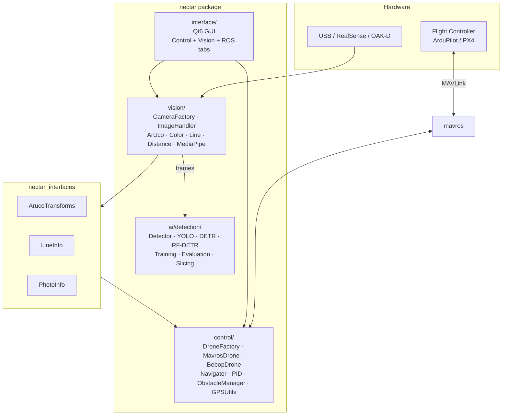

# Nectar SDK


A modular software development kit for autonomous aerial systems built on [ROS 2](https://docs.ros.org/). Designed for drone competitions, research, and rapid prototyping of UAV applications.

<p>
  <a href="https://docs.ros.org/en/humble/"></a>
  <a href="https://www.python.org/"></a>
  <a href="https://opencv.org/"></a>
  <a href="https://pytorch.org/"></a>
  <a href="LICENSE"></a>
</p>

| ROS 2 Distro | Build & Test | Docker |
|:---:|:---:|:---:|
| **Humble** | [](https://github.com/Black-Bee-Drones/nectar-sdk/actions/workflows/build-test.yml) | [](https://hub.docker.com/r/blackbeedrones/nectar-sdk/tags?name=humble) |
| **Jazzy** | [](https://github.com/Black-Bee-Drones/nectar-sdk/actions/workflows/build-test.yml) | [](https://hub.docker.com/r/blackbeedrones/nectar-sdk/tags?name=jazzy) |
| **Kilted** | [](https://github.com/Black-Bee-Drones/nectar-sdk/actions/workflows/build-test.yml) | [](https://hub.docker.com/r/blackbeedrones/nectar-sdk/tags?name=kilted) |

Developed by the [Black Bee Drones](https://github.com/Black-Bee-Drones) competition team.

---

## Table of Contents

- [Features](#features)
- [Installation](#installation)
- [Quick Start](#quick-start)
- [Architecture](#architecture)
- [Modules](#modules)
- [ROS 2 Nodes](#ros-2-nodes)
- [Examples](#examples)
- [Directory Structure](#directory-structure)
- [Contributing](#contributing)
- [Acknowledgments](#acknowledgments)
- [License](#license)

## Features

### Drone Control
- Protocol-based drone interface with factory instantiation for [MAVROS](https://github.com/mavlink/mavros) (ArduPilot/PX4) and Bebop 2
- Position navigation via PID control or FCU setpoints, in body, world, or takeoff reference frames
- GPS waypoint missions with [EGM96](https://en.wikipedia.org/wiki/EGM96) geoid correction for AMSL altitude
- Event-based obstacle detection with strategy-based avoidance (pause, axis disable, custom sequences)
- Return-to-launch with PID or ArduPilot-native RTL modes

### Computer Vision
- Camera abstraction: USB ([OpenCV](https://opencv.org/)), Intel [RealSense](https://github.com/IntelRealSense/librealsense) D4xx, Luxonis [OAK-D](https://docs.luxonis.com/), ROS 2 topics, Raspberry Pi Camera v2
- [ArUco](https://docs.opencv.org/4.x/d5/dae/tutorial_aruco_detection.html) marker detection with 6-DOF pose estimation
- Color detection with HSV/LAB calibration and interactive trackbars
- Line detection with five estimation methods (Hough, RANSAC, rotated rect, fit ellipse, adaptive Hough)
- Distance estimation via regression models (linear, polynomial, exponential, logarithmic, inverse power, robust)
- Hand and face tracking via [MediaPipe](https://ai.google.dev/edge/mediapipe/solutions)

### AI / Detection
- Unified detection API across [Ultralytics YOLO](https://docs.ultralytics.com/), [HuggingFace Transformers](https://huggingface.co/docs/transformers/) (DETR), and [RF-DETR](https://github.com/roboflow/RF-DETR)
- Training pipelines with [TensorBoard](https://www.tensorflow.org/tensorboard) logging and [HuggingFace Hub](https://huggingface.co/docs/hub/) integration
- Slicing inference for high-resolution images with configurable post-processing (NMS, Soft-NMS, WBF, NMM)
- Model evaluation with mAP, precision, recall via [supervision](https://github.com/roboflow/supervision)
- CLI tools for predict, train, and evaluate workflows

### Interface
- [Qt6 / PySide6](https://doc.qt.io/qtforpython-6/) desktop GUI with control, vision, and ROS 2 tabs
- Keyboard drone control with velocity sliders and position navigation
- Camera streaming with real-time filters, ArUco detection, and MediaPipe tracking
- ROS 2 topic browser, service caller, parameter viewer, and image subscriber

## Installation

### From Scratch

A standalone bootstrap script handles everything: ROS 2, system packages, MAVROS, GeographicLib, git/SSH, cloning, Python dependencies, workspace build, and verification. It prompts for workspace path and branch with sensible defaults.

```bash
bash <(curl -fsSL https://raw.githubusercontent.com/Black-Bee-Drones/nectar-sdk/main/scripts/bootstrap.sh)
```

### Existing ROS 2 Workspace

Clone and run a single command — it installs all Python dependencies, initializes rosdep, and builds the SDK packages:

```bash
cd ~/ros2_ws/src
git clone git@github.com:Black-Bee-Drones/nectar-sdk.git
cd nectar-sdk
make setup
```

### Install by Module

Install only the modules you need:

```bash
make python-control    # GPS, PID, MAVROS navigation
make python-vision     # Camera drivers, ArUco, color, line detection
make python-ai         # YOLO, DETR, RF-DETR (requires PyTorch)
make python-interface  # Qt6 / PySide6 GUI
make pytorch           # PyTorch (auto-detects CUDA)
```

### Interactive Menu

Run the setup script with no arguments for a guided menu where you can pick individual steps:

```bash
./scripts/setup.sh
```

### Docker

```bash
make docker-build       # SDK image (no AI)
make docker-build-full  # Full image (+ PyTorch + AI)
make docker-run         # Run with X11 + cameras + USB
```

| Tag | Contents | PyTorch |
|-----|----------|---------|
| `:humble` | control + vision + interface + realsense + oakd | None |
| `:humble-full-cpu` | All above + AI | CPU |
| `:humble-full-cu124` | All above + AI | CUDA 12.4 |

See [`docker/README.md`](docker/README.md) for GPU, RealSense, and advanced options.

All versions and package lists live in [`scripts/lib/config.sh`](scripts/lib/config.sh) (single source of truth). See [`docs/INSTALL.md`](docs/INSTALL.md) for the full guide.

## Quick Start

### Drone Control

```python
import rclpy
from rclpy.node import Node
from nectar.control import DroneFactory, MavrosConfig, PoseSource

rclpy.init()
node = Node("flight_node")

config = MavrosConfig(pose_source=PoseSource.GPS)
drone = DroneFactory.create("mavros", config, node)

drone.takeoff(altitude=2.0)
drone.move_to(x=5.0, y=0.0, z=0.0, precision=0.3)
drone.land()

drone.cleanup()
rclpy.shutdown()
```

### Camera Capture

```python
import rclpy
from rclpy.node import Node
from nectar.vision import ImageHandler, OpenCVConfig

class CameraNode(Node):
    def __init__(self):
        super().__init__("camera_node")

        config = OpenCVConfig(width=1280, height=720, fps=30)
        self.handler = ImageHandler(
            node=self,
            image_source="webcam",
            config=config,
            image_processing_callback=self.process,
            show_result="Camera"
        )
        self.handler.run()

    def process(self, frame):
        pass

rclpy.init()
rclpy.spin(CameraNode())
```

### Object Detection

```python
from nectar.ai.detection import Detector

detector = Detector("yolov8n.pt")  # auto-detects framework
detector.load()

result = detector.detect(image, conf=0.5)
for det in result:
    print(f"{det.class_name}: {det.confidence:.2f} at {det.bbox}")

annotated = detector.draw_detections(image, result)
```

## Architecture

The SDK is organized into four modules connected through ROS 2. Frames flow from cameras through vision algorithms and AI detection, producing results that inform control decisions. The interface ties everything together for interactive testing.



### Design Patterns

The codebase uses the same patterns across all modules, making it predictable to navigate and extend:

| Pattern | Where | What It Does |
|---------|-------|--------------|
| **Factory + Registry** | `DroneFactory`, `CameraFactory`, `Detector` | Decouples creation from usage. New types are registered at runtime and instantiated by key. |
| **Protocol** | `Drone`, `ObstacleDetector` | Defines interfaces via structural typing (duck typing). Any class matching the signature is accepted. |
| **Strategy** | `AvoidanceStrategy`, `ILineEstimationMethod`, `EstimationModel`, `BaseMergingStrategy` | Encapsulates interchangeable algorithms behind a common interface. |
| **Abstract Base Class** | `BaseDrone`, `AbstractCam`, `DepthCam`, `BaseDetectionModel` | Shares common logic and enforces method contracts for concrete implementations. |
| **Dataclass Config** | `MavrosConfig`, `OpenCVConfig`, `TrainingConfig`, `EvaluationConfig` | Type-safe configuration with defaults, validation, and YAML serialization. |

Every factory supports runtime registration, so adding a new drone type, camera driver, or detection framework follows the same pattern:

```python
# New drone
DroneFactory.register("custom", lambda cfg, node: MyDrone(cfg, node))
drone = DroneFactory.create("custom", config, node)

# New camera
CameraFactory.register("thermal", ThermalCamera)
camera = CameraFactory.from_source("thermal")

# New detection framework
Detector.register("custom", lambda name, **kw: CustomModel(name, **kw))
detector = Detector("model.bin", framework="custom")
```

## Modules

Each module has its own README with class diagrams, API reference, configuration options, and links to external documentation.

### Control

Drone control through a protocol-based interface. `DroneFactory` instantiates implementations: `MavrosDrone` communicates with ArduPilot/PX4 flight controllers via MAVROS, `BebopDrone` controls Parrot Bebop 2 drones. Navigation supports PID control with per-axis gain tuning or direct FCU setpoints, operating in body, world, or takeoff-relative reference frames. GPS missions apply EGM96 geoid correction for AMSL altitude. The obstacle system uses detectors paired with avoidance strategies (pause, disable axis, custom evasion sequences) through an event-driven handler.

- [Control overview](nectar/nectar/control/README.md) — architecture, Drone protocol, factory, configuration, movement API, obstacle system
- [MAVROS implementation](nectar/nectar/control/mavros/README.md) — MAVLink concepts, flight modes, coordinate frames, altitude types, PID vs setpoint navigation, GPS utilities, ROS 2 topics/services
- [Obstacle detection](nectar/nectar/control/obstacles/README.md) — detector protocol, avoidance strategies, handler configuration
- [PID controller](nectar/nectar/control/pid/README.md) — tuning, YAML configuration, runtime updates
- [API reference](nectar/nectar/control/API.md) — complete method signatures

### Vision

Camera abstraction and image processing algorithms. `CameraFactory` auto-detects the source type (USB webcam, RealSense depth camera, OAK-D, ROS 2 topic, image file) from a string identifier and returns the matching driver. `ImageHandler` wraps any camera in a ROS 2 timer loop with frame callbacks and optional OpenCV display. Algorithms include ArUco marker pose estimation, HSV/LAB color filtering with trackbar calibration, line detection via five estimation methods (Hough, RANSAC, rotated rect, fit ellipse, adaptive Hough), pixel-to-distance regression with six model types, and MediaPipe hand/face tracking.

- [Vision overview](nectar/nectar/vision/README.md) — camera classes, algorithm API, node parameters, calibration, module structure

### AI / Detection

Object detection across three frameworks through `Detector`, a single factory-based entry point. It auto-detects the framework from the model path or accepts explicit selection (`ultralytics`, `transformers`, `rfdetr`). Models load from local files, Ultralytics Hub, or HuggingFace Hub. Training uses per-framework config dataclasses with TensorBoard logging and optional HuggingFace push. Evaluation computes mAP via supervision. Slicing inference tiles large images and merges results with four post-processing strategies (NMS, Soft-NMS, WBF, NMM). CLI tools wrap predict, train, and evaluate as shell commands.

- [AI overview](nectar/nectar/ai/README.md) — public API, Detector usage, training, evaluation, device management
- [Detection details](nectar/nectar/ai/detection/README.md) — class diagram, core types, framework configs, slicing, CLI, config files, extension guide

### Interface

Qt6 / PySide6 desktop application for testing and operating the SDK without writing code. Three tabs: **Control** (drone connection, arm/takeoff/land, keyboard velocity control, position navigation with move_to), **Vision** (camera streaming with 20+ real-time filters including ArUco detection and MediaPipe tracking), and **ROS** (topic browser/subscriber/publisher, service caller, parameter viewer, image subscriber). The UI runs the Qt event loop on the main thread and ROS 2 in a background thread, with blocking operations (flight actions, navigation) dispatched to QThread workers.

- [Interface overview](nectar/nectar/interface/README.md) — architecture, tabs, widgets, threading model, camera integration, theming

### Nectar Interfaces

Custom ROS 2 message definitions for inter-module communication:

| Message | Fields | Published By |
|---------|--------|--------------|
| `ArucoTransforms` | marker ID, translation vector, yaw | `ArucoNode` |
| `LineInfo` | center XY, angle, width, height | `LineDetectionNode` |
| `PhotoInfo` | coordinate array, photo identifier | Vision nodes |

- [Interfaces overview](nectar_interfaces/README.md) — message definitions, usage examples (Python/C++), building, verification

## ROS 2 Nodes

Pre-built nodes for common tasks:

```bash
# GUI
ros2 run nectar app.py

# ArUco detection
ros2 run nectar aruco_node.py --ros-args \
    -p image_source:=webcam -p marker_dict:=5 -p tag_size:=0.05

# Line detection
ros2 run nectar line_detection_node.py --ros-args \
    -p line_colors:="blue,red" -p method:=HoughLinesP

# Color calibration
ros2 run nectar color_calibration_node.py --ros-args -p image_source:=webcam

# Camera calibration
ros2 run nectar calibration.py --ros-args -p chessboard_size:="9,7"

# Webcam publisher
ros2 run nectar webcam_publisher_node.py --ros-args -p width:=1280 -p height:=720

# Object detection
ros2 run nectar detector_example.py --ros-args -p model_source:=yolov8n.pt
```

## Examples

Working examples in `nectar/nectar/examples/`:

| Module | Example | Description |
|--------|---------|-------------|
| Control | `basic.py` | Takeoff, velocity control, land |
| Control | `sensors.py` | GPS and vision data monitoring |
| Control | `pid_simulation.py` | PID controller simulation (no ROS 2 required) |
| Control | `mavros_navigation.py` | Position navigation with body/takeoff/GPS modes |
| Control | `mavros_obstacles.py` | Obstacle-aware navigation |
| Vision | `camera_example.py` | Multi-camera capture and configuration |
| Vision | `depth_example.py` | Depth camera visualization |
| AI | `detector_example.py` | Real-time object detection |
| AI | `batch_detector.py` | Batch image/video processing |

See: [control examples](nectar/nectar/examples/control/README.md) · [vision examples](nectar/nectar/examples/vision/README.md) · [AI examples](nectar/nectar/examples/ai/README.md)

## Directory Structure

```
nectar-sdk/
├── scripts/                    # Setup and installation
│   ├── setup.sh                # CLI + interactive menu
│   └── lib/                    # Modular shell functions
│       ├── config.sh           # Versions, packages (single source of truth)
│       ├── common.sh           # Logging
│       ├── system.sh           # apt packages
│       ├── ros2.sh             # ROS 2 install + env
│       ├── python.sh           # pip from pyproject.toml
│       ├── realsense.sh        # Intel RealSense from source
│       ├── workspace.sh        # Build, clean, verify
│       └── git.sh              # Git/SSH setup
├── docker/
│   ├── Dockerfile              # x86_64: sdk + sdk-full stages
│   └── Dockerfile.jetson       # ARM64: Jetson Orin Nano
├── docs/
│   ├── INSTALL.md              # Full installation guide
│   ├── CONTRIBUTING.md         # Development setup, code style, PR process
│   ├── RELEASING.md            # Version bump, CI, Docker Hub push
│   └── SECURITY.md
├── nectar_interfaces/          # ROS 2 custom messages
│   ├── CMakeLists.txt
│   ├── package.xml
│   └── msg/
├── nectar/                     # Main ROS 2 package
│   ├── CMakeLists.txt
│   ├── package.xml
│   ├── pyproject.toml
│   └── nectar/                 # Python package
│       ├── control/            # Drone control
│       ├── vision/             # Computer vision
│       ├── ai/                 # AI / detection
│       ├── interface/          # Qt6 GUI
│       ├── examples/
│       └── utils/
├── Makefile
└── README.md
```

## Contributing

We welcome contributions. Please see [`docs/CONTRIBUTING.md`](docs/CONTRIBUTING.md) for development setup, code style (PEP 8, NumPy docstrings, type hints), and the PR process.

1. Check [GitHub Issues](https://github.com/Black-Bee-Drones/nectar-sdk/issues) for existing discussions
2. Follow [Conventional Commits](https://www.conventionalcommits.org) for commit messages
3. Read our [Code of Conduct](docs/CODE_OF_CONDUCT.md)

<a href="https://github.com/Black-Bee-Drones/nectar-sdk/graphs/contributors">
  
</a>

## Acknowledgments

Nectar SDK exists because of the open source projects it builds on. We are grateful to:

The [ROS 2](https://docs.ros.org/) community and Open Robotics for the middleware that connects everything. [MAVROS](https://github.com/mavlink/mavros) and the [MAVLink](https://mavlink.io/) protocol for bridging ROS 2 with ArduPilot and PX4 flight controllers. The [ArduPilot](https://ardupilot.org/) project for the flight controller firmware and its extensive documentation. [OpenCV](https://opencv.org/) for the computer vision foundation. [Ultralytics](https://docs.ultralytics.com/), [HuggingFace](https://huggingface.co/), and [Roboflow](https://roboflow.com/) for making object detection accessible through YOLO, Transformers, RF-DETR, and supervision. [PyTorch](https://pytorch.org/) for the deep learning backend. [Intel RealSense](https://github.com/IntelRealSense/librealsense) and [Luxonis](https://docs.luxonis.com/) for depth camera SDKs. [Google MediaPipe](https://ai.google.dev/edge/mediapipe/solutions) for hand and face tracking. [Qt for Python](https://doc.qt.io/qtforpython-6/) for the GUI framework.

## License

This project is licensed under the Apache-2.0 License — see the [`LICENSE`](LICENSE) file for details.
