# Arquitetura

O código de missão, as máquinas de estados e a GUI acionam os módulos do SDK, que chegam
aos controladores de voo, câmeras e modelos de detecção via ROS 2. Cada página de módulo
tem seu próprio diagrama de classes detalhado; esta página é a visão ponta a ponta e os
padrões compartilhados entre todos os módulos.

## Ponta a ponta

Leia da esquerda para a direita como quatro camadas:

1. **Application** — seu código de missão, máquinas de estados
   [Yasmin](https://github.com/uleroboticsgroup/yasmin) ou a GUI Qt6.
2. **Nectar SDK** — os módulos `control`, `vision`, `ai` e `sensors`, cada um acessado por
   uma factory ou protocol e apoiado pelos `utils` compartilhados.
3. **ROS 2 middleware** — os tópicos, serviços, actions e TF2 que carregam tudo, mais as
   mensagens `nectar_interfaces`.
4. **External systems** — controladores de voo, câmeras, VSLAM e modelos.

Cada módulo é colorido por camada. Setas sólidas são os caminhos principais de dados/comando;
a seta pontilhada marca um vínculo opcional (frames de profundidade alimentando detecção de
obstáculos). Clique no diagrama para zoom e pan.

```mermaid
---
config:
  layout: elk
  elk:
    nodePlacementStrategy: NETWORK_SIMPLEX
    mergeEdges: true
---
flowchart LR
  subgraph APP["Application"]
    direction TB
    Mission["Mission code / examples"]
    FSM["State machines · Yasmin"]
    GUI["Qt6 GUI · NectarApp"]
  end

  subgraph SDK["Nectar SDK"]
    direction TB

    subgraph CTRL["control"]
      direction TB
      DroneFactory(["DroneFactory"])
      DroneProto{{"Drone protocol"}}
      VehicleDrone["VehicleDrone<br/>ArduPilot · PX4 core"]
      Transports["Transports<br/>MAVROS · MAVLink · uXRCE-DDS"]
      OtherDrones["BebopDrone · CrazyflieDrone"]
      Nav["Navigator · PID · Sequencer"]
      Obstacles["ObstacleManager<br/>detector + strategy"]
      Loc["Localization<br/>vision-pose bridge"]
    end

    subgraph VIS["vision"]
      direction TB
      CameraFactory(["CameraFactory"])
      ImageHandler["ImageHandler"]
      VisAlgos["ArUco · Color · Line<br/>Distance · MediaPipe"]
    end

    subgraph AIM["ai"]
      direction TB
      DetSeg(["Detector / Segmentor"])
      AIExtras["Slicing · Training · Evaluation"]
    end

    subgraph SENS["sensors"]
      direction TB
      Rangefinder["Rangefinder → MAVLink<br/>TF-Luna + filters"]
    end

    subgraph UTIL["utils"]
      direction TB
      Utils["GPSCalculate · PositionUtils<br/>ProcessUtils"]
    end
  end

  subgraph ROS["ROS 2 middleware"]
    direction TB
    Topics["Topics · Services<br/>Actions · TF2"]
    Msgs["nectar_interfaces<br/>ArucoTransforms · LineInfo · PhotoInfo"]
  end

  subgraph EXT["Vehicles · sensors · models"]
    direction TB
    FCU["Flight controller<br/>ArduPilot · PX4 · Bebop · Crazyflie"]
    Cameras["Cameras<br/>USB · RealSense · OAK-D · Pi"]
    Models["Models<br/>YOLO · DETR · RF-DETR"]
    VSLAM["Isaac ROS Visual SLAM"]
  end

  Mission --> DroneFactory
  Mission --> CameraFactory
  Mission --> DetSeg
  FSM --> DroneFactory
  GUI --> DroneFactory
  GUI --> CameraFactory

  DroneFactory --> DroneProto
  DroneProto --> VehicleDrone
  DroneProto --> OtherDrones
  VehicleDrone --> Transports
  VehicleDrone --> Nav
  VehicleDrone --> Obstacles
  Nav --> Utils

  CameraFactory --> ImageHandler
  ImageHandler --> VisAlgos
  Obstacles -. depth .-> ImageHandler
  DetSeg --> AIExtras
  DetSeg --> Models
  VisAlgos --> Msgs

  Transports <--> Topics
  Transports <--> FCU
  Topics <--> FCU
  ImageHandler <--> Topics
  ImageHandler --> Cameras
  VSLAM --> Loc
  Loc --> FCU
  Rangefinder --> FCU

  classDef app fill:#3b82f6,stroke:#1d4ed8,color:#ffffff;
  classDef ctl fill:#f5a623,stroke:#b8770a,color:#1a1a1a;
  classDef vis fill:#22c55e,stroke:#15803d,color:#052e16;
  classDef aim fill:#a855f7,stroke:#7c3aed,color:#ffffff;
  classDef sen fill:#ef4444,stroke:#b91c1c,color:#ffffff;
  classDef utl fill:#94a3b8,stroke:#475569,color:#0b1220;
  classDef ros fill:#14b8a6,stroke:#0f766e,color:#04231f;
  classDef ext fill:#64748b,stroke:#334155,color:#ffffff;

  class Mission,FSM,GUI app;
  class DroneFactory,DroneProto,VehicleDrone,Transports,OtherDrones,Nav,Obstacles,Loc ctl;
  class CameraFactory,ImageHandler,VisAlgos vis;
  class DetSeg,AIExtras aim;
  class Rangefinder sen;
  class Utils utl;
  class Topics,Msgs ros;
  class FCU,Cameras,Models,VSLAM ext;
```



## Padrões de projeto

O código usa os mesmos padrões em todos os módulos, o que torna a navegação e a extensão
previsíveis:

| Padrão | Onde | O que faz |
|--------|------|-----------|
| **Factory + Registry** | `DroneFactory`, `CameraFactory`, `Detector` | Desacopla criação do uso. Novos tipos são registrados em runtime e instanciados por chave. |
| **Protocol** | `Drone`, `ObstacleDetector` | Define interfaces por tipagem estrutural (duck typing). Qualquer classe que corresponda à assinatura é aceita. |
| **Strategy** | `AvoidanceStrategy`, `ILineEstimationMethod`, `EstimationModel`, `BaseMergingStrategy` | Encapsula algoritmos intercambiáveis por meio de uma interface comum. |
| **Abstract Base Class** | `BaseDrone`, `AbstractCam`, `DepthCam`, `BaseDetectionModel` | Compartilha lógica comum e impõe contratos de método nas implementações concretas. |
| **Dataclass Config** | `MavrosConfig`, `OpenCVConfig`, `TrainingConfig`, `EvaluationConfig` | Configuração tipada com defaults, validação e serialização YAML. |

Toda factory permite registro em runtime, então adicionar um novo tipo de drone, driver de
câmera ou framework de detecção segue a mesma receita:

```python
DroneFactory.register("custom", lambda cfg, executor: MyDrone(cfg, executor))
drone = DroneFactory.create("custom", config)

CameraFactory.register("thermal", ThermalCamera)
camera = CameraFactory.from_source("thermal")

Detector.register("custom", lambda name, **kw: CustomModel(name, **kw))
detector = Detector("model.bin", framework="custom")
```

Assinaturas completas de classes e métodos são geradas a partir das docstrings do código na
[referência da API Python](../../api/) (em inglês): [control](../../api/control/),
[vision](../../api/vision/), [ai](../../api/ai/), [sensors](../../api/sensors/) e
[utils](../../api/utils/).

## Modelo de runtime

Cada drone possui seu próprio `Node` ROS 2. Todos os nós de subsistema do SDK entram em um
`MultiThreadedExecutor` compartilhado gerenciado por `nectar.runtime`, que gira em uma
thread de fundo. Chamadas bloqueantes (`takeoff`, `land`, `move_to`) dormem na thread do
chamador enquanto o executor continua disparando callbacks de telemetria. Três padrões de
uso compartilham as mesmas primitivas:

| Padrão | Chamada de setup | O que acontece |
|--------|------------------|----------------|
| Script standalone | `nectar.init()` | Cria o executor compartilhado e a thread de spin; `DroneFactory.create(...)` registra o nó do drone; `nectar.shutdown()` na saída. |
| Missão Yasmin | `nectar.use_executor(...)` | Chamado uma vez no início para que os subsistemas do SDK se registrem no executor da missão em vez de criar uma segunda thread de spin. |
| GUI | `ROSExecutor` registra em `nectar.runtime` | Drones e handlers de câmera criados nas abas compartilham o executor do app automaticamente. |

## Transportes: um núcleo, links intercambiáveis

Toda a lógica de voo e navegação vive uma vez no `VehicleDrone` agnóstico a firmware.
Especializações de firmware (`ArduPilotDrone`, `Px4Drone`) acrescentam só a semântica do
firmware e leem telemetria / emitem comandos por um `VehicleTransport` plugável:

| Transporte | Classe | Como funciona | Backends |
|------------|--------|---------------|----------|
| MAVROS | `MavrosTransport` | Subscriptions → telemetria, clients de serviço → comandos, publishers → setpoints (exige um `mavros_node` em execução). | `mavros`, `px4` |
| MAVLink direto | `PymavlinkTransport` | Possui o link do FCU diretamente; um `MavlinkModeCodec` isola a única diferença de firmware (encode/decode de modo de voo), então ArduPilot e PX4 o compartilham. | `mavlink`, `px4_mavlink` |
| uXRCE-DDS | `Px4DdsTransport` | uORB nativo do PX4 pela ponte uXRCE-DDS (`px4_msgs`). | `px4_dds` |

Assim o PX4 oferece três backends (`px4`, `px4_mavlink`, `px4_dds`) e o ArduPilot dois
(`mavros`, `mavlink`), todos compartilhando a mesma lógica de voo — as missões são
agnósticas ao backend. O núcleo trabalha em tipos simples, sem ROS (ENU/FLU, radianos);
cada transporte converte de e para o formato on-wire. Detalhe completo:
[Vehicle core](../modules/control/vehicle.md) e o
[módulo Control](../modules/control/index.md).
