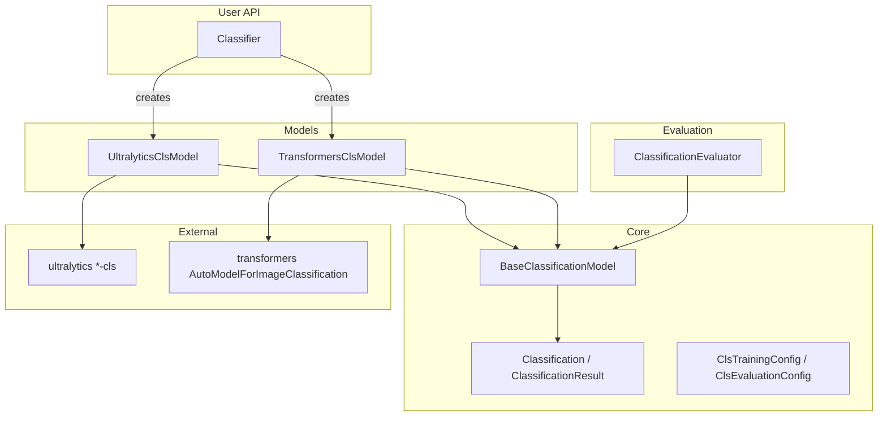

# Módulo de Classificação

Classificação de imagens entre Ultralytics YOLO-cls e HuggingFace Transformers por meio de um
único `Classifier` — carregue um modelo, chame `classify`, e obtenha resultados top-k tipados.
A mesma API cobre treinamento, avaliação e ferramentas de dataset ImageFolder / HuggingFace,
via a CLI `nectar-ai classify`.

## Resumo rápido

```python
from nectar.ai.classification import Classifier

classifier = Classifier("yolo26n-cls.pt")
classifier.load()
result = classifier.classify(image)
print(result.top1_name, result.top1_confidence)
for pred in result.topk(5):
    print(pred.class_name, pred.confidence)
```

## Tutorial (Colab)

Fluxo ponta a ponta de classificação (dataset → train → TensorBoard → eval → Hub):

[Abrir no Google Colab](https://colab.research.google.com/drive/1mEo05wfYJRsuxKodxbFwBuxRSRh43f-X?usp=sharing)

## Arquitetura



## Classifier

```python
from nectar.ai.classification import Classifier
from nectar.ai.core import Framework

classifier = Classifier("yolo26n-cls.pt")
classifier = Classifier("google/vit-base-patch16-224-in21k", framework=Framework.TRANSFORMERS)
classifier.load()
result = classifier.classify(image, topk=5)
annotated = classifier.draw_classification(image, result)
```

Detecção automática de framework: `-cls` → Ultralytics; `vit` / `google/` / `facebook/` →
Transformers.

## Configs de exemplo

Templates portáveis em `configs/` (só caminhos relativos; sem IDs de Hub específicos de
organização):

| Config | Backend | Preparo do dataset |
|--------|---------|--------------|
| `mnist_yolo26n_cls.yaml` | Ultralytics YOLO-cls | `dataset download --source ultralytics --dataset mnist160` |
| `mnist_vit_example.yaml` | Transformers ViT | `dataset download --source huggingface --repo ylecun/mnist --max-samples 128` |
| `cifar10_yolo26n_cls_example.yaml` | Ultralytics + opções de Hub | `dataset download --source ultralytics --dataset cifar10 --max-samples 200` |

Copie um config e altere `dataset_path`, `model`, `epochs`, e opcionalmente habilite o upload
para o Hub.

## Treinamento

**Layout ImageFolder** (formato de dataset de classificação do Ultralytics):

```
dataset/
├── train/<class_name>/*.jpg
├── val/<class_name>/*.jpg
└── test/<class_name>/*.jpg
```

```python
from nectar.ai.classification import Classifier, ClsTrainingConfig

classifier = Classifier("yolo26n-cls.pt")
classifier.load()
result = classifier.train(ClsTrainingConfig(
    dataset_path="data/mnist160",
    epochs=50,
    imgsz=64,
    tensorboard=True,
))
```

```bash

# Ultralytics + TensorBoard

nectar-ai classify train --config configs/mnist_yolo26n_cls.yaml --tensorboard

# Transformers ViT

nectar-ai classify train --config configs/mnist_vit_example.yaml

# Enable Hub upload (requires HF_TOKEN): set in YAML or override

nectar-ai classify train --config configs/cifar10_yolo26n_cls_example.yaml \
    --push-to-hub --hub-model-id your-org/cifar10-yolo26n-cls
```

Traga seu próprio ImageFolder da mesma forma: aponte `data.dataset_path` para qualquer árvore
`train/<class>/*.jpg` (Food-101, dados próprios, etc.).

## Avaliação

Produz um conjunto plano de artefatos, alinhado com detection/segmentation:

- Métricas: acurácia top-1 / top-k, P/R/F1 macro e ponderado, tabela por classe
- Curvas: `P_curve`, `R_curve`, `F1_curve`, `PR_curve`
- Plots: `confusion_matrix`, `error_analysis`, `performance_analysis`, `results`, `prediction_samples`
- Tabelas: `metrics_summary.json`, `evaluation_metrics.csv`, `per_class_metrics.{json,csv}`,
  `pr_analysis_results.csv`, `error_statistics.csv`, `evaluation_report.json`,
  `evaluation_results.json`

```bash
nectar-ai classify eval --model-path best.pt --dataset-path data/mnist160 \
    --framework ultralytics --split test --conf-threshold 0.0 --topk 5
```

## Gerenciamento de dataset

```bash

# Tiny Ultralytics set (recommended for smoke tests)

nectar-ai classify dataset download --source ultralytics --dataset mnist160 \
    --output data/mnist160

# CIFAR-10 cached under nectar/ai/data/ultralytics/, then a small subset

nectar-ai classify dataset download --source ultralytics --dataset cifar10 \
    --max-samples 200 --output data/cifar10-subset

nectar-ai classify dataset download --source huggingface --repo ylecun/mnist \
    --max-samples 128 --output data/mnist-hf

nectar-ai classify dataset analyze --input data/mnist160
nectar-ai classify dataset convert --input data/raw --output data/normalized
nectar-ai classify dataset stratify --input data/unsplit --output data/split
nectar-ai classify dataset subset --input data/full --output data/subset --max-train-samples 1000
nectar-ai classify dataset upload --target huggingface --repo user/my-cls --dataset data/mnist160 --public
```

## CLI

```
nectar-ai classify <command> [options]

Commands: train | predict | eval | dataset
Aliases: classification, cls
```

## Frameworks suportados

| Framework | Train | Eval | Predict |
|-----------|-------|------|---------|
| Ultralytics YOLO-cls | sim | sim | sim |
| HuggingFace Transformers | sim | sim | sim |

## Layout

- `classifier.py` — facade e factory `Classifier`
- `core/` — tipos, configs, `BaseClassificationModel`
- `models/` — backends Ultralytics e Transformers
- `training/` — configs de treinamento específicas de framework
- `evaluation/` — `ClassificationEvaluator` + plots
- `datasets/` — ferramentas ImageFolder, conversores HF, handlers
- `cli/`, `configs/`, `scripts/`
- Compartilhado entre tasks: `nectar.ai.core` (Framework, ModelLoader, utils)
