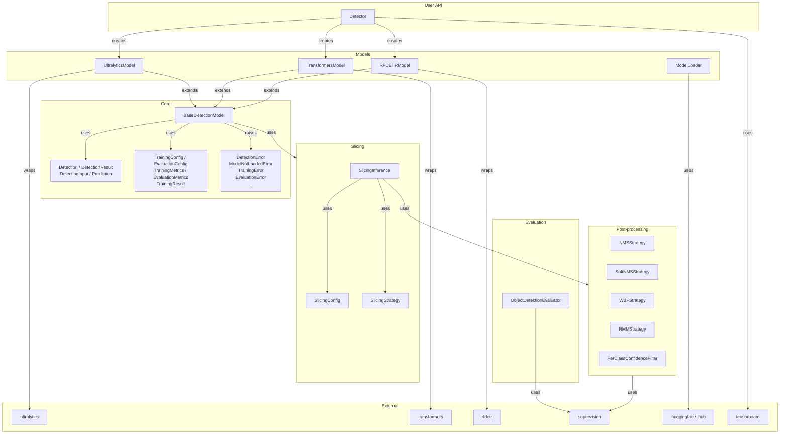
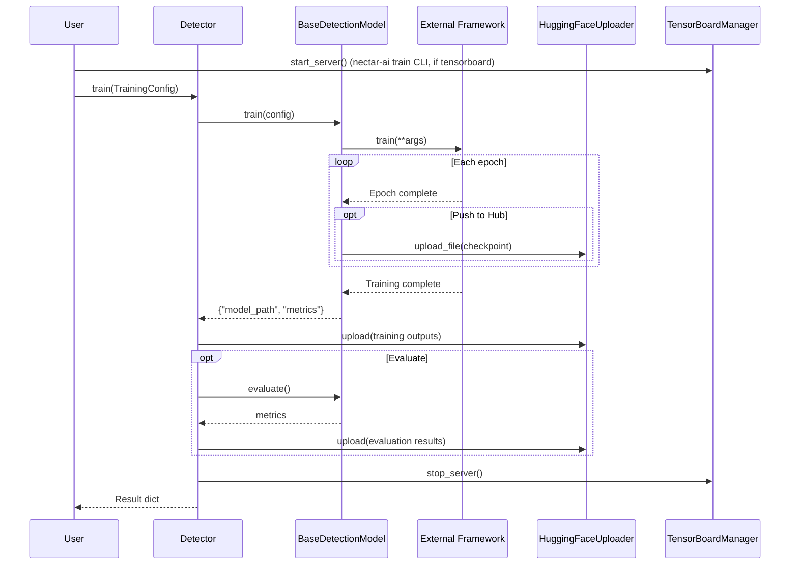
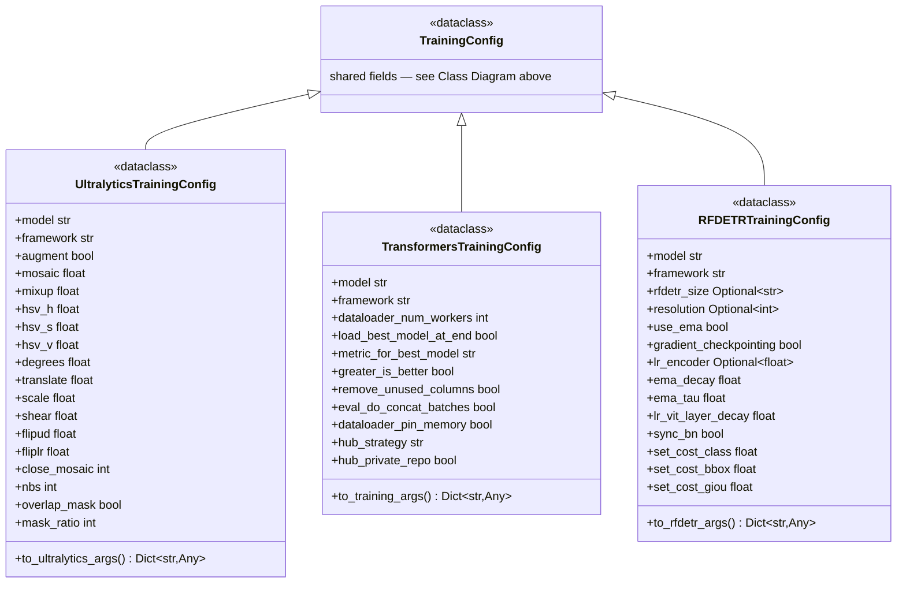
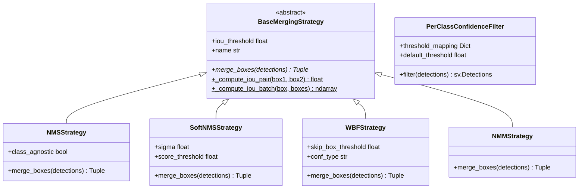

# Módulo de Detecção

Detecção de objetos com Ultralytics YOLO, HuggingFace Transformers (DETR) e RF-DETR, todos
por meio de uma única interface `Detector` — carregue um modelo, chame `detect` e obtenha
resultados tipados. A mesma API cobre treinamento, avaliação e inferência com slicing, com
ferramentas de dataset e uma CLI `nectar-ai`.

## Visão geral

```python
from nectar.ai.detection import Detector

detector = Detector("yolov8n.pt")     # framework auto-detected from the model name
detector.load()
result = detector.detect(image)
for det in result:
    print(f"{det.class_name}: {det.confidence:.2f}")
```

Lado a lado com Ultralytics / Transformers / RF-DETR:
[Com e sem Nectar](../../get-started/with-without.md)
([with-without.md](../../get-started/with-without/)).

## Tutorial (Colab)

Passo a passo interativo de ponta a ponta para detecção (dataset → treinamento → TensorBoard → avaliação):

[Abrir no Colab](https://colab.research.google.com/drive/1mQmbWwnwn-nzMdBlzvkuBmYPMHUrCm_Z?usp=sharing)

## Conceitos

`Detector` é uma factory leve sobre três backends de framework (`UltralyticsModel`,
`TransformersModel`, `RFDETRModel`), todos compartilhando `BaseDetectionModel` e os mesmos
resultados tipados, slicing, pós-processamento e avaliação:



## Detector

Detector baseado em factory, com detecção automática ou seleção explícita de framework.

**Detecção automática a partir do nome do modelo**:

```python
from nectar.ai.core import Framework
from nectar.ai.detection import Detector

detector = Detector("yolov8n.pt")
```

**Framework explícito**:

```python
detector = Detector("model.pt", framework="ultralytics")
detector = Detector("facebook/detr-resnet-50", framework=Framework.TRANSFORMERS)
```

**Modelo do HuggingFace** (`user/repo:filename`):

```python
detector = Detector("user/repo:model.pt")
```

Carregue e execute:

```python
detector.load()
result = detector.detect(image, conf=0.5)
results = detector.detect_batch([img1, img2, img3])
annotated = detector.draw_detections(image, result)
```

**Propriedades**:

```python
detector.framework          # Framework.ULTRALYTICS
detector.is_loaded          # bool
detector.class_names        # Dict[int, str]
Detector.available_frameworks()  # ['ultralytics', 'transformers', 'rfdetr']
```

### Enum Framework

```python
Framework.ULTRALYTICS  # YOLOv8, YOLOv10, YOLO11
Framework.TRANSFORMERS  # DETR, Conditional DETR
Framework.RFDETR        # RF-DETR
```

## Diagrama de Classes

```mermaid
classDiagram
    class Framework {
        <<enum>>
        ULTRALYTICS
        TRANSFORMERS
        RFDETR
    }

    class Detector {
        -_builders Dict~str,BuilderFunc~
        -_model BaseDetectionModel
        -_framework Framework
        -_loaded bool
        -_hf_token Optional~str~
        -_kwargs Dict
        +model_source str
        +device str
        +confidence_threshold float
        +framework Framework
        +is_loaded bool
        +class_names Dict~int,str~
        +model BaseDetectionModel
        +register(framework, builder)$
        +available_frameworks()$ List~str~
        +_detect_framework(source)$ Framework
        +_create_model(framework, model_name)$ BaseDetectionModel
        +load(model_path) bool
        +detect(image, conf, iou) DetectionResult
        +detect_batch(images, conf, iou) List~DetectionResult~
        +train(config) Dict~str,Any~
        +evaluate(config) Dict~str,Any~
        +draw_detections(image, result, show_labels, show_confidence, show_class, annotator_type, thickness, text_scale) ndarray
        +enable_slicing(config)
        +disable_slicing()
    }

    class BaseDetectionModel {
        <<abstract>>
        +model_name str
        +framework str
        +model Any
        +class_names Dict~int,str~
        +slicing_config Optional~SlicingConfig~
        -_slicing_inference Optional~SlicingInference~
        -logger Logger
        +is_loaded bool
        +load_model(path)*
        +_predict_single(input)* Prediction
        +_predict_batch(input) Prediction
        +predict(input) Prediction
        +_predict_with_slicing(input) Prediction
        +detect(image, conf, iou) DetectionResult
        +detect_batch(images, conf, iou) List~DetectionResult~
        +train(config)* TrainingResult
        +save(path)* str
        +evaluate(config) EvaluationMetrics
        +draw_detections(image, result, show_labels, show_confidence, show_class, annotator_type, thickness, text_scale) ndarray
        +enable_slicing(config)
        +disable_slicing()
    }

    class UltralyticsModel {
        -model Optional~YOLO~
        -_callbacks List
        +from_scratch bool
        +load_model(path)
        +_download_from_huggingface(path) str
        +train(config) TrainingResult
        +save(path) str
    }

    class TransformersModel {
        -model Optional~AutoModelForObjectDetection~
        -processor Optional~AutoImageProcessor~
        +from_scratch bool
        +load_model(path, id2label, label2id, imgsz)
        +train(config) TrainingResult
        +save(path) str
    }

    class RFDETRModel {
        -model Optional
        -model_class Type
        -base_model_name str
        -model_path Optional~str~
        +rfdetr_size Optional~str~
        +resolution Optional~int~
        +from_scratch bool
        +load_model(path)
        +_infer_model_size(path) str
        +train(config) TrainingResult
    }

    class Detection {
        <<dataclass>>
        +xyxy ndarray
        +confidence float
        +class_id int
        +class_name str
        +center Tuple~float,float~
        +width int
        +height int
        +area int
        +bbox List~int~
        +to_dict() Dict
        +from_dict(data)$ Detection
    }

    class DetectionResult {
        <<dataclass>>
        +detections List~Detection~
        +image Optional~ndarray~
        +inference_time float
        +image_path Optional~str~
        +model_name Optional~str~
        +__len__() int
        +__getitem__(idx) Detection
        +__iter__() Iterator
        +__bool__() bool
        +filter_by_confidence(threshold) DetectionResult
        +filter_by_class(class_names) DetectionResult
        +filter_by_class_id(class_ids) DetectionResult
        +to_supervision() sv.Detections
        +from_supervision(detections, class_names)$ DetectionResult
        +to_dict() Dict
    }

    class TrainingConfig {
        <<dataclass>>
        +dataset_path str
        +epochs int
        +batch_size int
        +learning_rate float
        +output_dir str
        +device str
        +seed int
        +tensorboard bool
        +save_period int
        +push_to_hub bool
        +hub_model_id Optional~str~
        +multi_gpu bool
        +mixed_precision str
        +gradient_accumulation_steps int
        +max_train_samples Optional~int~
        +max_eval_samples Optional~int~
        +max_test_samples Optional~int~
        +train_split float
        +val_split float
        +test_split float
        +dataset_format Optional~str~
        +framework str
        +model str
        +from_scratch bool
        +imgsz Optional~Union~int,List~int~~
        +early_stopping_patience Optional~int~
        +early_stopping_delta float
        +early_stopping_metric str
        +early_stopping_mode str
        +weight_decay float
        +lr_scheduler_type str
        +warmup_steps int
        +warmup_ratio float
        +max_grad_norm float
        +optimizer_type str
        +dropout float
        +warmup_epochs float
        +warmup_momentum float
        +lrf float
        +freeze Optional~Union~int,List~int~~
        +cos_lr bool
        +rfdetr_size Optional~str~
        +lr_encoder Optional~float~
        +use_ema bool
        +gradient_checkpointing bool
        +drop_path float
        +ema_decay float
        +sync_bn bool
        +num_workers int
        +gc_per_accumulation bool
        +evaluate bool
        +resume bool
        +to_dict() Dict
        +to_yaml(path)
        +from_dict(data)$ TrainingConfig
        +from_yaml(path)$ TrainingConfig
    }

    class EvaluationConfig {
        <<dataclass>>
        +model_path str
        +dataset_path str
        +framework str
        +output_dir str
        +dataset_type str
        +split str
        +conf_threshold float
        +iou_threshold float
        +device str
        +batch_size int
        +num_samples Optional~int~
        +to_dict() Dict
        +from_dict(data)$ EvaluationConfig
        +from_yaml(path)$ EvaluationConfig
    }

    class TrainingMetrics {
        <<dataclass>>
        +epoch int
        +train_loss float
        +val_loss Optional~float~
        +map50 Optional~float~
        +map50_95 Optional~float~
        +precision Optional~float~
        +recall Optional~float~
        +f1_score Optional~float~
        +learning_rate Optional~float~
        +to_dict() Dict
    }

    class EvaluationMetrics {
        <<dataclass>>
        +map50 float
        +map50_95 float
        +mar50 float
        +mar50_95 float
        +precision float
        +recall float
        +f1_score float
        +inference_time_per_image float
        +total_detections int
        +per_class_metrics List~Dict~
        +visualizations Dict~str,str~
        +to_dict() Dict
        +save_json(path)
    }

    class TrainingResult {
        <<dataclass>>
        +model_path str
        +metrics TrainingMetrics
        +config TrainingConfig
    }

    class DetectionInput {
        <<dataclass>>
        +image Union~ImageType,BatchImageType~
        +conf_threshold float
        +iou_threshold float
        +device Optional~str~
        +is_batch bool
        +to_dict() Dict
    }

    class Prediction {
        <<dataclass>>
        +detections Optional~sv.Detections~
        +batch_detections Optional~List~sv.Detections~~
        +results Optional~List~DetectionResult~~
        +inference_time float
        +image_path Optional~Union~str,List~str~~
        +model_name Optional~str~
        +is_batch bool
        +num_detections int
        +to_dict() Dict
        +from_detections(detections, class_names)$ Prediction
        +from_batch_detections(batch_detections, class_names)$ Prediction
    }

    class SlicingConfig {
        <<dataclass>>
        +strategy SlicingStrategy
        +slice_size Tuple~int,int~
        +overlap_ratio float
        +iou_threshold float
        +conf_threshold float
        +min_slice_area_ratio float
        +max_slices int
        +adaptive_threshold float
        +clustering_eps float
        +clustering_min_samples int
        +merge_strategy str
        +include_full_image bool
        +from_dict(config_dict)$ SlicingConfig
        +to_dict() Dict
        +grid(slice_size, overlap_ratio)$ SlicingConfig
        +adaptive(slice_size, threshold)$ SlicingConfig
    }

    class SlicingStrategy {
        <<enumeration>>
        NONE
        GRID
        ADAPTIVE
        CLUSTERING
        SUPERVISION
    }

    class SlicingInference {
        -config SlicingConfig
        -slicer ImageSlicer
        -_merge_strategy BaseMergingStrategy
        +run_sliced_inference(image, inference_callback, initial_detections) sv.Detections
        -_create_merge_strategy(strategy_name) BaseMergingStrategy
    }

    class ObjectDetectionEvaluator {
        -model Any
        -config EvaluationConfig
        -output_dir Path
        -device str
        -logger Logger
        +evaluate() EvaluationMetrics
    }

    Detector --> Framework
    Detector --> BaseDetectionModel
    Detector ..> UltralyticsModel : creates
    Detector ..> TransformersModel : creates
    Detector ..> RFDETRModel : creates

    BaseDetectionModel <|-- UltralyticsModel
    BaseDetectionModel <|-- TransformersModel
    BaseDetectionModel <|-- RFDETRModel

    BaseDetectionModel --> Detection
    BaseDetectionModel --> DetectionResult
    BaseDetectionModel --> DetectionInput
    BaseDetectionModel --> Prediction
    BaseDetectionModel --> TrainingConfig
    BaseDetectionModel --> EvaluationConfig
    BaseDetectionModel --> SlicingConfig
    BaseDetectionModel ..> SlicingInference : uses

    DetectionResult o-- Detection
    DetectionResult --> DetectionInput
    Prediction o-- DetectionResult
    Prediction --> DetectionInput

    SlicingInference o-- SlicingConfig
    SlicingInference --> SlicingStrategy
    SlicingInference --> BaseMergingStrategy

    ObjectDetectionEvaluator --> EvaluationConfig
    ObjectDetectionEvaluator --> EvaluationMetrics
```



## Classes de Modelo Diretas

Para controle avançado:

```python
from nectar.ai.detection import UltralyticsModel, TransformersModel, RFDETRModel

model = UltralyticsModel("yolov8n.pt")
model.load_model()

model = TransformersModel("facebook/detr-resnet-50")
model.load_model()

model = RFDETRModel("rfdetr-medium")
model.load_model()
```

## Tipos Principais

### `Detection`

```python
from nectar.ai.detection import Detection

det = Detection(
    xyxy=np.array([100, 100, 200, 200]),  # [x1, y1, x2, y2]
    confidence=0.95,
    class_id=0,
    class_name="person",
)

det.center    # (150, 150)
det.width     # 100
det.height    # 100
det.area      # 10000
```

### `DetectionResult`

```python
result = detector.detect(image)

len(result)              # Number of detections
result.detections        # List[Detection]
result.inference_time    # Seconds

for det in result:
    print(det.class_name, det.confidence)

filtered = result.filter_by_confidence(0.5)
filtered = result.filter_by_class_id([0, 1, 2])          # by class id; filter_by_class([...]) takes class names
```

## Treinamento

```python
from nectar.ai.detection import Detector, TrainingConfig

detector = Detector("yolov8n.pt")
detector.load()

config = TrainingConfig(
    dataset_path="/path/to/dataset",
    epochs=100,
    batch_size=16,
    learning_rate=0.001,
    output_dir="outputs/",
    tensorboard=True,  # enable TensorBoard logging
    push_to_hub=True,
    hub_model_id="user/model-name",
)

result = detector.train(config)

# Training outputs and evaluation results automatically uploaded to HF Hub

print(f"Model saved: {result['model_path']}")
```

### Fluxo de Treinamento

O treinamento cuida automaticamente de:

- Ciclo de vida do servidor do TensorBoard (start/stop)
- Uploads para o HuggingFace Hub (checkpoints durante o treinamento, saídas finais, resultados de avaliação)
- Conversão de formato de dataset (YOLO ↔ COCO)
- Criação de subconjunto balanceado



### Configs Específicas de Framework

Subclasses específicas de framework estendem o `TrainingConfig` base (lista completa de
campos no [diagrama de classes acima](#diagrama-de-classes)):



## Avaliação

```python
from nectar.ai.detection import Detector, EvaluationConfig
from nectar.ai.detection.evaluation import ObjectDetectionEvaluator

detector = Detector("best.pt")
detector.load()

config = EvaluationConfig(
    model_path="best.pt",
    dataset_path="/path/to/dataset",
    framework="ultralytics",
    split="test",
    conf_threshold=0.25,
)

evaluator = ObjectDetectionEvaluator(detector.model, config)

# Optional: add a per-class confidence filter (set_post_processor takes filter_strategy only)

from nectar.ai.detection.postprocess import PerClassConfidenceFilter

evaluator.set_post_processor(
    filter_strategy=PerClassConfidenceFilter(csv_path="pr_analysis_results.csv"),
)

metrics = evaluator.evaluate()

print(f"mAP@50: {metrics.map50:.4f}")
print(f"mAP@50-95: {metrics.map50_95:.4f}")
```

## Inferência com Slicing

Para imagens de alta resolução:

```python
detector = Detector("yolov8n.pt")
detector.load()

detector.enable_slicing({
    "strategy": "grid",
    "slice_size": (640, 640),
    "overlap_ratio": 0.2,
    "merge_strategy": "nms",  # nms, soft_nms, wbf, nmm
})

result = detector.detect(large_image)
detector.disable_slicing()
```

### Estratégias de Pós-processamento



### Filtragem de Confiança por Classe

Carregue thresholds ótimos a partir de resultados de análise de PR:

**A partir de um CSV de análise de PR**:

```python
from nectar.ai.detection.postprocess import PerClassConfidenceFilter

filter = PerClassConfidenceFilter(csv_path="evaluation/pr_analysis_results.csv")
```

**Mapeamento manual**:

```python
filter = PerClassConfidenceFilter(threshold_mapping={0: 0.3, 1: 0.5}, default_threshold=0.25)
```

```python
filtered = filter.filter(detections)
```

## Utilitários

Os helpers compartilhados vivem em `nectar.ai.core` (usado por detection, segmentation e classification).

### Gerenciamento do TensorBoard

```python
from nectar.ai.core import TensorBoardManager

manager = TensorBoardManager()
manager.start_server(log_dir="outputs", port=6006)

# ... training ...

manager.stop_server()
```

### Upload para o HuggingFace Hub

```python
from nectar.ai.core import HuggingFaceUploader

uploader = HuggingFaceUploader(
    repo_id="user/model-name",
    local_dir="outputs/",
    repo_type="model",
)
uploader.upload(commit_message="Upload training results")
```

O treinamento faz upload automático das saídas e dos resultados de avaliação para o HuggingFace Hub quando `push_to_hub=True` e `hub_model_id` está definido.

## Extensão

### Adicionando um Framework

```python
from nectar.ai.detection import Detector
from nectar.ai.detection.core.base import BaseDetectionModel

class CustomModel(BaseDetectionModel):
    def load_model(self, path):
        pass

    def _predict_single(self, input):
        pass

    def train(self, config):
        pass

    def save(self, path):
        pass

Detector.register("custom", lambda name, **kw: CustomModel(name, **kw))
detector = Detector("model.pt", framework="custom")
```

## CLI

O módulo de detecção é operado por meio da CLI unificada `nectar-ai`, sob a tarefa `detect`
(`detect`, `detection` e `od` são aliases):

**Treinamento**:

```bash
nectar-ai detect train --config configs/yolo_example.yaml
```

**Predição**:

```bash
nectar-ai detect predict --model yolov8n.pt --input image.jpg --output results/
```

**Avaliação**:

```bash
nectar-ai detect eval --model-path best.pt --framework ultralytics --dataset-path /path/to/dataset
```

**Gerenciamento de datasets**:

```bash
nectar-ai detect dataset download --source visdrone --output datasets/visdrone
nectar-ai detect dataset convert --input datasets/coco --output datasets/yolo --format yolo
nectar-ai detect dataset stratify --input datasets/unsplit --output datasets/split --train-ratio 0.8
nectar-ai detect dataset subset --input datasets/full --output datasets/subset --max-train-samples 1000
nectar-ai detect dataset augment --input datasets/my_dataset --output datasets/my_dataset_augmented --preset aerial --num-augmented 2 --splits train --num-workers 8
nectar-ai detect dataset analyze --input datasets/my_dataset
nectar-ai detect dataset merge --dataset1 datasets/d1 --dataset2 datasets/d2 --output datasets/merged --train-config '{"d1": 1000, "d2": 5000}' --output-format coco
nectar-ai detect dataset upload --target huggingface --repo user/my-dataset --dataset datasets/my_dataset --title "My Dataset" --model-repo user/my-model
nectar-ai detect dataset upload --target huggingface --raw --repo user/my-dataset --dataset datasets/my_dataset
nectar-ai detect dataset upload --target roboflow --api-key KEY --project my-project --dataset datasets/my_dataset --splits train valid test
nectar-ai detect dataset upload --target roboflow --images-only --api-key KEY --project my-project --dataset images/
nectar-ai detect dataset upload-images --api-key KEY --project my-project --directory images/
nectar-ai detect dataset download --source huggingface --repo user/my-dataset --format yolo --output data/local
```

### Treinamento

**Usando um arquivo de config** (recomendado):

```bash
nectar-ai detect train --config configs/yolo_example.yaml
```

**Usando argumentos de CLI**:

```bash
nectar-ai detect train --model yolov8n.pt --dataset /path/to/dataset --epochs 100 --batch-size 16
```

### Avaliação

```bash
nectar-ai detect eval --model-path best.pt --framework ultralytics --dataset-path /path/to/dataset
```

**Com thresholds de confiança por classe** (pares nome=valor; resolvidos contra os nomes de classe do modelo):

```bash
nectar-ai detect eval --model-path best.pt --framework ultralytics --dataset-path /path/to/dataset \
    --conf-per-class 'crack=0.4,pothole=0.55'
```

## Gerenciamento de Datasets

Utilitários para preparar datasets de detecção, cada um disponível como uma classe Python e
como um subcomando `nectar-ai detect dataset <command>`:

| Tarefa | API Python | CLI |
|------|-----------|-----|
| Detectar / converter formato (COCO ↔ YOLO) | `FormatDetector`, `FormatConverter` | `convert` |
| Subconjunto balanceado | `SubsetCreator` | `subset` |
| Divisão treino/val/teste | `Stratifier` | `stratify` |
| Augmentation | `AugmentationBuilder` | `augment` |
| Análise e estatísticas | `DatasetAnalyzer` | `analyze` |
| Download por fonte (VisDrone, Roboflow) | `DatasetHandlerRegistry` | `download` |
| Mesclar datasets | `DatasetMerger` | `merge` |
| Upload (HuggingFace / Roboflow) | `HuggingFaceDatasetUploader`, `RoboflowUploader` | `upload` |

### Detecção e Conversão de Formato

Os datasets são detectados e convertidos automaticamente entre os formatos COCO e YOLO, conforme necessário:

```python
from nectar.ai.detection.datasets import FormatDetector, FormatConverter

# Auto-detect format

detector = FormatDetector("datasets/my_dataset")
format_type = detector.detect()  # "coco" or "yolo"

# Convert format

converter = FormatConverter("datasets/coco", "datasets/yolo")
yaml_path = converter.convert(target_format="yolo")
```

### Criação de Subconjunto Balanceado

Cria subconjuntos balanceados mantendo a distribuição de classes:

```python
from nectar.ai.detection.datasets import SubsetCreator

creator = SubsetCreator("datasets/full", "datasets/subset", seed=42)
subset_path = creator.create(
    max_train_samples=1000,
    max_eval_samples=200,
    max_test_samples=100,
)
```

### Estratificação de Dataset

Divide datasets não separados em treino/val/teste com distribuição de classes balanceada:

```python
from nectar.ai.detection.datasets import Stratifier

stratifier = Stratifier("datasets/unsplit", "datasets/split", seed=42)
split_path = stratifier.stratify(
    train_ratio=0.8,
    val_ratio=0.2,
    test_ratio=0.0,
)
```

### Augmentation

Monta configs de augmentation e as aplica aos datasets com processamento paralelo:

**Usando um preset**:

```python
from nectar.ai.detection.datasets import AugmentationBuilder

builder = AugmentationBuilder(preset="aerial")
builder.apply(
    input_path="datasets/my_dataset",
    output_path="datasets/my_dataset_augmented",
    num_augmented=2,
    splits=["train"],
    num_workers=8,
)
```

**Transformações personalizadas**:

```python
builder = AugmentationBuilder(config={
    "HorizontalFlip": {"p": 0.5},
    "Rotate": {"limit": 15, "p": 0.3},
})
builder.apply("datasets/input", "datasets/output", num_augmented=3)
```

**Comportamento da augmentation:**

- `num_augmented`: número de cópias aumentadas geradas por imagem original.
  - Exemplo: 1000 imagens originais + `num_augmented=2` → 1000 originais + 2000 aumentadas = 3000 no total

- `max_original_samples`: limita quantas imagens originais são selecionadas para a augmentation (não o total gerado).
  - Exemplo: 1000 imagens originais + `max_original_samples=500` + `num_augmented=2`:
    - Todas as 1000 imagens originais são mantidas na saída
    - 500 imagens originais são aumentadas (cada uma produz 2 cópias)
    - Total: 1000 originais + 1000 aumentadas = 2000 imagens

- `augmentation_ratio`: adiciona dados aumentados como fração do tamanho do treino.
  - Exemplo: `augmentation_ratio=0.25` com 1000 imagens → adiciona ~250 imagens aumentadas (25% do original)
  - Calcula `max_original_samples` automaticamente com base na proporção

- `prioritize_rare_classes`: ao usar `max_original_samples`, prioriza imagens contendo categorias sub-representadas para balancear o dataset.

**Uso via CLI:**

**Augmentation básica** (2 cópias por imagem):

```bash
nectar-ai detect dataset augment \
  --input datasets/visdrone \
  --output datasets/visdrone-augmented \
  --preset aerial \
  --num-augmented 2 \
  --splits train \
  --num-workers 8
```

**Limitar a 1000 imagens originais**:

```bash
nectar-ai detect dataset augment \
  --input datasets/visdrone \
  --output datasets/visdrone-augmented \
  --preset aerial \
  --num-augmented 2 \
  --max-original-samples 1000
```

**Adicionar 25% de dados extras via augmentation ratio**:

```bash
nectar-ai detect dataset augment \
  --input datasets/visdrone \
  --output datasets/visdrone-augmented \
  --preset aerial \
  --num-augmented 2 \
  --augmentation-ratio 0.25
```

**Priorizar classes raras ao limitar amostras**:

```bash
nectar-ai detect dataset augment \
  --input datasets/visdrone \
  --output datasets/visdrone-augmented \
  --preset aerial \
  --num-augmented 2 \
  --max-original-samples 1000 \
  --prioritize-rare-classes
```

### Análise de Dataset

Analisa a distribuição do dataset e gera visualizações:

```python
from nectar.ai.detection.datasets import DatasetAnalyzer

analyzer = DatasetAnalyzer("datasets/my_dataset", output_dir="analysis/")
results = analyzer.analyze()

# Generates plots and statistics report

```

### Handlers de Dataset

Faz o download de datasets de várias fontes usando o registro de handlers:

```python
from nectar.ai.detection.datasets import DatasetHandlerRegistry

# VisDrone

handler_class = DatasetHandlerRegistry.get("visdrone")
handler = handler_class("datasets/visdrone")
handler.download_and_convert(output_format="coco")

# Roboflow

handler_class = DatasetHandlerRegistry.get("roboflow")
handler = handler_class("datasets/roboflow", api_key="YOUR_KEY")
handler.download(workspace="workspace", project="project", version=1, format_type="yolo")
```

### Mesclagem de Datasets

Mescla dois datasets (formato YOLO ou COCO) com amostragem balanceada:

```python
from nectar.ai.detection.datasets import DatasetMerger

# Auto-detect formats and merge (output format matches first dataset)

merger = DatasetMerger("datasets/dataset1", "datasets/dataset2", "datasets/merged", seed=42)
merger.merge({
    "train": {"d1": 1000, "d2": 5000},
    "valid": {"d1": "all", "d2": 500},
    "test": {"d1": 200, "d2": 200}
})

# Specify output format explicitly

merger = DatasetMerger(
    "datasets/dataset1",
    "datasets/dataset2",
    "datasets/merged",
    output_format="coco",  # or "yolo", "auto"
    seed=42
)
```

### Upload de Dataset

Faz upload de datasets para o HuggingFace Hub ou Roboflow com imagens **e** anotações.

#### HuggingFace: Parquet nativo (recomendado)

`upload_native()` converte um dataset local COCO/YOLO para o schema nativo do Hub
(coluna `image` + `objects.{bbox, category, area}` com `ClassLabel`). O viewer de dataset
do Hub renderiza os overlays de bounding box automaticamente.

```python
from nectar.ai.detection.datasets import HuggingFaceDatasetUploader

uploader = HuggingFaceDatasetUploader(repo_id="user/my-dataset", private=False)

result = uploader.upload_native(
    dataset_path="datasets/my_dataset",   # COCO or YOLO, auto-detected
    commit_message="Upload v1.0",
    card_metadata={
        "title": "My Dataset",
        "description": "Aerial gate detection.",
        "license": "apache-2.0",
        "tags": ["drone", "uav"],
        "model_repo": "user/my-model",     # optional, links the trained model
    },
)
print(result["splits"], result["class_names"])

# Legacy raw-files upload (no viewer):

uploader.upload_dataset(dataset_path="datasets/my_dataset")
```

#### Roboflow: dataset (imagens + anotações)

`upload_dataset()` detecta automaticamente o formato COCO/YOLO, pareia cada imagem com sua
anotação, preserva a divisão train/valid/test e faz o upload em paralelo.

```python
from nectar.ai.detection.datasets import RoboflowUploader

uploader = RoboflowUploader(api_key="YOUR_KEY")

stats = uploader.upload_dataset(
    dataset_path="datasets/my_dataset",
    project_name="my-project",
    annotation_format=None,   # auto-detect ("coco" or "yolo")
    splits=["train", "valid", "test"],
    batch_name="batch-1",
    tag_names=["robotics"],
    max_workers=10,
)
print(stats["per_split"], stats["failed_files"])

# Legacy: upload images only (no annotations) for an annotation workflow.

uploader.upload_directory(directory_path="images/", project_name="my-project")
```

#### CLI

**Upload nativo para o HuggingFace** (Parquet + viewer):

```bash
nectar-ai detect dataset upload --target huggingface \
    --repo user/my-dataset --dataset datasets/my_dataset \
    --public --title "My Dataset" --model-repo user/my-model
```

**Fallback de arquivos brutos (raw) para o HuggingFace**:

```bash
nectar-ai detect dataset upload --target huggingface --raw \
    --repo user/my-dataset --dataset datasets/my_dataset
```

**Dataset do Roboflow** (imagens + anotações, padrão):

```bash
nectar-ai detect dataset upload --target roboflow --api-key KEY \
    --project my-project --dataset datasets/my_dataset \
    --splits train valid test
```

**Somente imagens no Roboflow** (legado):

```bash
nectar-ai detect dataset upload --target roboflow --images-only \
    --api-key KEY --project my-project --dataset images/
```

### Download de Dataset

O handler `huggingface` (alias `hf`) baixa um dataset do HF e o materializa em disco no
formato COCO ou YOLO, pronto para treinamento.

```python
from nectar.ai.detection.datasets import HuggingFaceHandler

handler = HuggingFaceHandler("data/imav-gate", token=None)  # uses HF_TOKEN
handler.download(
    repo_id="blackbeedrones/imav-2025-gate-dataset",
    format_type="yolo",   # or "coco"
)

# data/imav-gate now has data.yaml + train/images + train/labels (YOLO)

# or train/_annotations.coco.json + image files (COCO)

```

CLI:

```bash
nectar-ai detect dataset download --source huggingface \
    --repo blackbeedrones/imav-2025-gate-dataset \
    --format yolo --output data/imav-gate

nectar-ai detect dataset download --source roboflow \
    --workspace WS --project P --version 1 --format coco \
    --api-key KEY --output data/roboflow
```

### Conversores de formato HF

Conversores de baixo nível usados tanto pelo upload quanto pelo download:

```python
from nectar.ai.detection.datasets import (
    coco_to_hf, yolo_to_hf, hf_to_coco, hf_to_yolo, generate_dataset_card,
)

ds = coco_to_hf("datasets/my_dataset")          # COCO -> DatasetDict
ds = yolo_to_hf("datasets/my_dataset")          # YOLO -> DatasetDict
hf_to_coco(ds, "out/coco")                      # DatasetDict -> COCO files
hf_to_yolo(ds, "out/yolo")                      # DatasetDict -> YOLO files + data.yaml
card = generate_dataset_card(ds, "user/repo", title="My Dataset")
```

## Arquivos de Configuração

Arquivos de config YAML para treinamento:

```yaml
data:
  dataset_path: /path/to/dataset
  dataset_format: coco

train:
  framework: transformers
  model: facebook/detr-resnet-50
  epochs: 50
  batch_size: 4
  learning_rate: 5e-5
  output_dir: outputs/detr
  device: cuda
  tensorboard: true
  push_to_hub: true
  hub_model_id: user/model-name
  mixed_precision: fp16
  max_train_samples: 1000
  max_eval_samples: 200

eval:
  evaluate: true
  eval_split: test
  conf_threshold: 0.25
  iou_threshold: 0.5
  batch_size: 2
  device: auto
  num_samples: 100
```

Uso:

```bash
nectar-ai detect train --config configs/detr_example.yaml
```

## Estrutura

O pacote `detection/` está organizado em:

- [`detector.py`](https://github.com/Black-Bee-Drones/nectar-sdk/blob/main/nectar/nectar/ai/detection/detector.py) — a fachada e a factory do `Detector`
- [`core/`](https://github.com/Black-Bee-Drones/nectar-sdk/tree/main/nectar/nectar/ai/detection/core) — `BaseDetectionModel`, tipos de detecção, `TrainingConfig`/`EvaluationConfig`, exceções
- [`models/`](https://github.com/Black-Bee-Drones/nectar-sdk/tree/main/nectar/nectar/ai/detection/models) — backends de framework (`UltralyticsModel`, `TransformersModel`, `RFDETRModel`) e dataset loaders
- [`training/`](https://github.com/Black-Bee-Drones/nectar-sdk/tree/main/nectar/nectar/ai/detection/training) — configs de treinamento específicas de framework
- [`evaluation/`](https://github.com/Black-Bee-Drones/nectar-sdk/tree/main/nectar/nectar/ai/detection/evaluation) — `ObjectDetectionEvaluator`, análise de PR/erro, plots
- [`slicing/`](https://github.com/Black-Bee-Drones/nectar-sdk/tree/main/nectar/nectar/ai/detection/slicing) — `SlicingConfig` e `SlicingInference` para tiling em alta resolução
- [`postprocess/`](https://github.com/Black-Bee-Drones/nectar-sdk/tree/main/nectar/nectar/ai/detection/postprocess) — estratégias de merge (NMS, Soft-NMS, WBF, NMM) e filtragem de confiança por classe
- [`datasets/`](https://github.com/Black-Bee-Drones/nectar-sdk/tree/main/nectar/nectar/ai/detection/datasets) — conversão de formato, subset/stratify/augment/analyze/merge, e handlers de download (VisDrone, Roboflow, HuggingFace)
- [`cli/`](https://github.com/Black-Bee-Drones/nectar-sdk/tree/main/nectar/nectar/ai/detection/cli), [`configs/`](https://github.com/Black-Bee-Drones/nectar-sdk/tree/main/nectar/nectar/ai/detection/configs), [`scripts/`](https://github.com/Black-Bee-Drones/nectar-sdk/tree/main/nectar/nectar/ai/detection/scripts) — a CLI `nectar-ai`, configs de exemplo e scripts shell de treinamento

Compartilhado entre as tarefas (`nectar.ai.core`): `Framework`, `ModelLoader`, callbacks de device / Hub / TensorBoard / treinamento.
