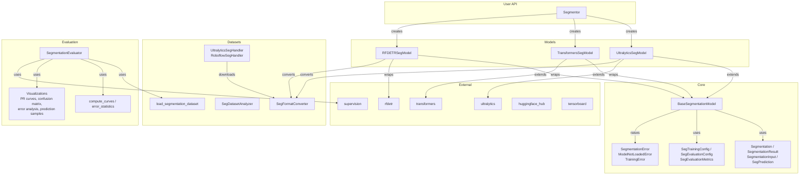

# Módulo de Segmentação

Segmentação de instâncias entre Ultralytics YOLO, HuggingFace Transformers (MaskFormer) e
RF-DETR Seg por meio de um único `Segmentor` — carregue um modelo, chame `segment`, e obtenha
máscaras tipadas. A mesma API cobre treinamento e avaliação, com ferramentas de dataset e uma
CLI `nectar-ai segment`.

## Resumo rápido

```python
from nectar.ai.segmentation import Segmentor

segmentor = Segmentor("yolov8n-seg.pt")     # framework auto-detected from the model name
segmentor.load()
result = segmentor.segment(image)
for seg in result:
    print(f"{seg.class_name}: {seg.confidence:.2f}, mask_area={seg.mask_area}px")
```

## Tutorial (Colab)

Fluxo ponta a ponta de segmentação (dataset → train → TensorBoard → eval → Hub):

[Abrir no Google Colab](https://colab.research.google.com/drive/1qZzAF_iD2sZyuWPin48XpxaY6dtak_gV?usp=sharing)

## Conceitos

`Segmentor` é uma factory sobre três backends de framework (`UltralyticsSegModel`,
`TransformersSegModel`, `RFDETRSegModel`), todos compartilhando `BaseSegmentationModel`, os
mesmos resultados tipados, o tratamento de dataset e a avaliação:



## Segmentor

Interface baseada em factory, com detecção automática ou seleção explícita de framework.

**Detecção automática a partir do nome do modelo**:

```python
from nectar.ai.segmentation import Segmentor
from nectar.ai.core import Framework

segmentor = Segmentor("yolov8n-seg.pt")
segmentor = Segmentor("rfdetr-seg-nano")
segmentor = Segmentor("facebook/maskformer-swin-tiny-coco")
```

**Framework explícito**:

```python
segmentor = Segmentor("model.pt", framework="ultralytics")
segmentor = Segmentor("rfdetr-seg-medium", framework=Framework.RFDETR)
segmentor = Segmentor("facebook/maskformer-swin-tiny-coco", framework=Framework.TRANSFORMERS)
```

Carregue e rode:

```python
segmentor.load()
result = segmentor.segment(image, conf=0.5)
annotated = segmentor.draw_segmentations(image, result, show_masks=True, show_boxes=True)
```

## Tipos principais

```python
from nectar.ai.segmentation import (
    Segmentation,          # Single instance: xyxy, confidence, class_id, class_name, mask
    SegmentationResult,    # Per-image container: list of Segmentation + semantic_map
    SegmentationInput,     # Model input: image(s), thresholds, device
    SegPrediction,         # Model output: sv.Detections + SegmentationResult list
)
```

`Segmentation` carrega uma máscara binária (`np.ndarray` de shape `(H, W)` dtype `bool`) junto
com a bounding box. Propriedades: `mask_area`, `polygon`, `center`, `width`, `height`.

`SegmentationResult` converte de/para `supervision.Detections` via `to_supervision()` /
`from_supervision()`.

## Modelos

| Classe | Framework | Tipo de Segmentação | Formatos |
|-------|-----------|-------------------|---------|
| `UltralyticsSegModel` | Ultralytics | Instância | YOLO-seg |
| `RFDETRSegModel` | RF-DETR | Instância | COCO-seg |
| `TransformersSegModel` | HuggingFace | Instância + Semântica | COCO-seg |

### Ultralytics

Suporta YOLOv8-seg, YOLO11-seg, YOLO26-seg.

```python
from nectar.ai.segmentation import UltralyticsSegModel

model = UltralyticsSegModel("yolo26n-seg.pt")
model.load_model()
result = model.segment(image, conf=0.5)
```

### RF-DETR Seg

Suporta os tamanhos nano, small, medium, large, xlarge, 2xlarge.

```python
from nectar.ai.segmentation import RFDETRSegModel

model = RFDETRSegModel("rfdetr-seg-nano", resolution=312)
model.load_model()
result = model.segment(image, conf=0.3)
```

### Transformers

Segmentação de instâncias via MaskFormer. Segmentação semântica via SegFormer.

```python
from nectar.ai.segmentation import TransformersSegModel

model = TransformersSegModel("facebook/maskformer-swin-tiny-coco", mode="instance")
model.load_model()
result = model.segment(image)
```

## Treinamento

O treinamento é configurado via a dataclass `SegTrainingConfig` ou arquivos de config YAML.
Configs específicas de framework estendem a base.

### Config YAML

```yaml
data:
  dataset_path: data/crack-seg/data.yaml
  dataset_format: yolo

train:
  framework: ultralytics
  model: yolo26n-seg.pt
  epochs: 50
  batch_size: 16
  imgsz: 640
  output_dir: outputs/my-run
  device: "0"
  tensorboard: true
  push_to_hub: true
  hub_model_id: user/model-name

eval:
  evaluate: true
  eval_split: test
  conf_threshold: 0.25
```

### CLI

```bash
nectar-ai segment train --config path/to/config.yaml
nectar-ai segment train --model yolo26n-seg.pt --dataset data/crack-seg/data.yaml --epochs 50
```

### Configs específicas de framework

```python
from nectar.ai.segmentation.training.config import (
    UltralyticsSegTrainingConfig,
    TransformersSegTrainingConfig,
    RFDETRSegTrainingConfig,
)
```

Cada uma fornece um método `to_*_args()` que mapeia para a API de treinamento do framework
subjacente.

### Conversão de formato de dataset

O pipeline de treinamento converte automaticamente entre os formatos YOLO-seg e COCO-seg
conforme necessário:

- Ultralytics exige o formato YOLO-seg (labels de polígono em arquivos `.txt`)
- RF-DETR e Transformers exigem o formato COCO (anotações de polígono em JSON)

A conversão é feita pelo `SegFormatConverter`.

## Avaliação

O avaliador segue o mesmo padrão do módulo de detecção:

1. Carrega o ground truth com máscaras via `load_segmentation_dataset()`
2. Roda a inferência com confiança baixa (0.001) para capturar todas as predições
3. Filtra pelo threshold especificado pelo usuário
4. Computa as métricas (mAP, precision, recall, F1) via supervision
5. Gera plots de visualização e relatórios CSV/JSON

```python
from nectar.ai.segmentation import SegmentationEvaluator, SegEvaluationConfig

config = SegEvaluationConfig(
    model_path="best.pt",
    dataset_path="data/crack-seg",
    framework="ultralytics",
    output_dir="outputs/eval",
    split="test",
    conf_threshold=0.25,
)

evaluator = SegmentationEvaluator(model, config)
metrics = evaluator.evaluate()
```

### Artefatos gerados

| Arquivo | Descrição |
|------|-------------|
| `BoxPR_curve.png` / `MaskPR_curve.png` | Curva Precision-Recall (Box sempre; Mask quando há máscaras) |
| `BoxP_curve.png` / `MaskP_curve.png` | Precision vs confiança |
| `BoxR_curve.png` / `MaskR_curve.png` | Recall vs confiança |
| `BoxF1_curve.png` / `MaskF1_curve.png` | F1 vs confiança |
| `confusion_matrix.png` | Matriz de confusão |
| `error_analysis.png` | Detalhamento de FP/FN, principais confusões |
| `performance_analysis.png` | Barra de AP por classe + scatter P-R |
| `prediction_samples.png` | GT vs Pred com overlays de máscara |
| `results.png` | Gráfico de barras com o resumo das métricas |
| `per_class_metrics.csv` | AP, precision, recall, F1 por classe |
| `evaluation_metrics.csv` | Métricas gerais |
| `evaluation_report.json` | Relatório completo com config e caminhos de visualização |

### CLI

```bash
nectar-ai segment eval \
  --model-path best.pt \
  --dataset-path data/crack-seg \
  --framework ultralytics \
  --output-dir outputs/eval \
  --split test \
  --conf-threshold 0.25
```

## Gerenciamento de dataset

### Download

**Datasets Ultralytics** (crack-seg, coco8-seg, etc.):

```bash
nectar-ai segment dataset download --source ultralytics --dataset crack-seg --output data/crack-seg
```

**Projetos Roboflow**:

```bash
nectar-ai segment dataset download --source roboflow --api-key KEY \
  --workspace ws --project proj --version 1 --roboflow-format yolov8
```

**HuggingFace Hub** (dataset de seg nativo → YOLO-seg ou COCO-seg em disco):

```bash
nectar-ai segment dataset download --source huggingface \
  --repo blackbeedrones/sae-2026-hook --format yolo --output data/sae-2026-hook
```

### Upload para o HuggingFace

`upload` converte um dataset YOLO-seg/COCO-seg local para o schema nativo do Hub (`image` +
`objects.{bbox, category, area, segmentation}`) e envia shards Parquet mais um dataset card
gerado automaticamente. O viewer do Hub renderiza overlays de bounding-box (derivados dos
polígonos); os próprios polígonos são armazenados para treinamento com máscara e fazem o caminho
de volta para YOLO-seg via `HuggingFaceSegHandler`.

**Upload nativo** (Parquet + viewer):

```bash
nectar-ai segment dataset upload --target huggingface \
  --repo user/my-seg-dataset --dataset data/my-seg \
  --public --title "My Seg Dataset" --model-repo user/my-model
```

**Upload raw** (arquivos como estão, sem viewer / sem Parquet):

```bash
nectar-ai segment dataset upload --target huggingface --raw \
  --repo user/my-seg-dataset --dataset data/my-seg
```

```python
from nectar.ai.segmentation.datasets import HuggingFaceSegDatasetUploader

uploader = HuggingFaceSegDatasetUploader(repo_id="user/my-seg-dataset", private=False)
result = uploader.upload_native(
    dataset_path="data/my-seg",          # YOLO-seg or COCO-seg, auto-detected
    card_metadata={"title": "My Seg Dataset", "model_repo": "user/my-model"},
)
print(result["splits"], result["class_names"])
```

### Conversão de formato

Labels YOLO-seg usam vértices de polígono normalizados: `class_id x1 y1 x2 y2 ... xN yN`.
Anotações COCO-seg usam coordenadas absolutas de polígono no campo `segmentation`.

```bash
nectar-ai segment dataset convert --input data/crack-seg --output data/crack-seg-coco --format coco
```

```python
from nectar.ai.segmentation.datasets import SegFormatConverter

converter = SegFormatConverter("data/yolo-seg", "data/coco-seg")
converter.convert(target_format="coco", copy_images=True)
```

### Análise

```bash
nectar-ai segment dataset analyze --input data/crack-seg --output data/crack-seg/analysis
```

Gera: `sample_mosaic.png` (com overlays de máscara), `class_distribution.png`,
`mask_area_distribution.png`, `annotations_per_image.png`, `dimension_insights.png`,
`analysis_report.json`.

### Subconjunto

```bash
nectar-ai segment dataset subset --input data/crack-seg --output data/crack-seg-small \
  --max-train-samples 500 --max-eval-samples 100
```

### Predição

```bash
nectar-ai segment predict --model best.pt --input image.jpg --output predictions/ --save-masks
```

## Referência da CLI

```
nectar-ai segment <command> [options]

Commands:
  train     Train a segmentation model
  predict   Run inference
  eval      Evaluate on a dataset
  dataset   Dataset management (download, convert, subset, analyze)
```

## Integrações de treinamento

### Upload para o HuggingFace Hub

Todos os frameworks enviam checkpoints para o HuggingFace Hub **durante o treinamento** (entre
epochs), não só depois. Configurado via `push_to_hub: true` e `hub_model_id` no config YAML.

> **Nota:** exige a variável de ambiente `HF_TOKEN`.

| Framework | Mecanismo | Momento do Upload |
|-----------|-----------|---------------|
| Ultralytics | `model.add_callback("on_train_epoch_end", ...)` | Pesos após cada epoch + diretório completo ao final do treino |
| RF-DETR | PTL `Callback.on_validation_epoch_end` | Diretório de saída após cada epoch de validação + ao final do fit |
| Transformers | `push_to_hub` nativo + `hub_strategy="every_save"` | A cada salvamento de checkpoint |

As implementações de callback são compartilhadas entre as tasks via
`nectar.ai.core.utils.callbacks`.

### TensorBoard

Todos os frameworks logam para o TensorBoard quando `tensorboard: true` está no config:

- **Ultralytics**: eventos em `{save_dir}/` (configurado via `ultralytics_settings`)
- **RF-DETR**: `TensorBoardLogger` adicionado pelo `build_trainer` (PTL)
- **Transformers**: `report_to: ["tensorboard"]` em `TrainingArguments`

Veja os logs: `tensorboard --logdir nectar/nectar/ai/outputs/`

## Testes E2E

### Pré-requisitos

```bash
cd nectar-sdk/nectar
export PYTHONPATH=$(pwd):$PYTHONPATH
export HF_TOKEN=<your-hf-token>
pip install -e ".[ai]"
```

### Rodar todos os testes de segmentação (Ultralytics + RF-DETR + Transformers)

```bash
bash nectar/nectar/ai/segmentation/scripts/e2e_cli_test.sh
```

Este script: baixa o dataset crack-seg -> analisa -> treina o YOLO26n-seg (3 epochs) -> treina
o RF-DETR Seg Nano (10 epochs) -> treina o MaskFormer Swin-Tiny (2 epochs) -> avalia + faz
predição de cada um -> verifica TensorBoard + upload HF -> imprime o resumo.

### Rodar frameworks individualmente

```bash

# 1. Download dataset (once)

nectar-ai segment dataset download \
  --source ultralytics --dataset crack-seg \
  --output nectar/nectar/ai/data/crack-seg --format yolo

# 2. Train YOLO26n-seg (500 train samples, 3 epochs, 320px)

nectar-ai segment train --config nectar/nectar/ai/segmentation/configs/crackseg_yolo26n_seg.yaml

# 3. Train RF-DETR Seg Nano (full dataset, 10 epochs, 312px)

nectar-ai segment train --config nectar/nectar/ai/segmentation/configs/crackseg_rfdetr_seg_nano.yaml

# 4. Train MaskFormer Swin-Tiny (50 train samples, 2 epochs, 320px, fp32)

nectar-ai segment train --config nectar/nectar/ai/segmentation/configs/crackseg_mask2former.yaml
```

### Rodar todos os testes de detecção (Ultralytics + RF-DETR + Transformers)

```bash
bash nectar/nectar/ai/detection/scripts/e2e_cli_test.sh
```

Este script: baixa o dataset gate do Roboflow -> treina o YOLO26n (3 epochs) -> treina o
RF-DETR Nano (5 epochs) -> treina o DETR (2 epochs) -> avalia + faz predição de cada um ->
verifica TensorBoard + upload HF -> imprime o resumo.

### Rodar frameworks de detecção individualmente

```bash

# 1. Download gate dataset (once)

nectar-ai detect dataset download \
  --source roboflow --api-key $ROBOFLOW_API_KEY \
  --workspace black-bee-drones --project imav-25-gate-sfbbq --version 1 \
  --output nectar/nectar/ai/data/imav-gate --format yolo

# 2. Train YOLO26n (100 train samples, 3 epochs, 320px)

nectar-ai detect train --config nectar/nectar/ai/detection/configs/gate_yolo26n.yaml

# 3. Train RF-DETR Nano (100 train samples, 5 epochs, 312px)

nectar-ai detect train --config nectar/nectar/ai/detection/configs/gate_rfdetr_nano.yaml

# 4. Train DETR (100 train samples, 2 epochs, 320px)

nectar-ai detect train --config nectar/nectar/ai/detection/configs/gate_detr.yaml
```

### O que verificar depois de cada execução

1. **Outputs de treinamento** existem em `nectar/nectar/ai/outputs/<run-name>/`
2. **Eventos do TensorBoard**: `find nectar/nectar/ai/outputs/<run-name> -name "events.out.tfevents.*"`
3. **Repo do HuggingFace** atualizado em `https://huggingface.co/blackbeedrones/<hub_model_id>`
4. **Métricas de avaliação** em `nectar/nectar/ai/outputs/<run-name>/evaluation/metrics_summary.json`
5. **Predições** em `nectar/nectar/ai/outputs/<run-name>/predictions/`

## Status dos frameworks

Testado ponta a ponta no
[Crack Segmentation Dataset](https://docs.ultralytics.com/datasets/segment/crack-seg/) (4029
imagens, 1 classe).

| Framework | Train | Eval | Predict | Upload HF | TensorBoard | Notas |
|-----------|-------|------|---------|-----------|-------------|-------|
| Ultralytics (YOLO26n-seg) | OK | OK | OK | Por epoch | OK | Pipeline completo |
| RF-DETR Seg Nano | OK | OK | OK | Por epoch (PTL) | OK (PTL) | Usa a Custom Training API |
| Transformers (MaskFormer) | OK | OK | OK | Nativo | OK | Mapas de instância via `CocoInstanceSegDataset`; use fp32 (fp16 gera NaNs no matcher) |

### Ultralytics (YOLO26n-seg) — Pipeline completo

- Download, análise, treino, avaliação e predição, tudo funcionando via CLI
- Upload HF por epoch via `setup_ultralytics_hf_callbacks()` compartilhado
- A avaliação usa `MetricTarget.MASKS` para métricas corretas baseadas em máscara
- A avaliação isolada gera 16 artefatos (13 plots PNG mais relatórios CSV/JSON; veja [Artefatos gerados](#artefatos-gerados) acima)

### RF-DETR Seg Nano — Pipeline completo

- Fixado em `rfdetr[train]==1.7.1` (PyPI)
- O treinamento usa a [Custom Training API](https://rfdetr.roboflow.com/latest/learn/train/customization/) (`RFDETRModelModule`, `RFDETRDataModule`, `build_trainer`) para injeção de callback
- Upload HF por epoch via `HuggingFaceUploadPTLCallback` do PTL
- Nomes de classe sincronizados automaticamente a partir do checkpoint em `load_model()`
- IDs de classe inválidos filtrados em `_predict_single()`
- Conversão automática para o formato COCO a partir de YOLO-seg via `SegFormatConverter`
- **Nota de treinamento**: modelos estilo DETR precisam de epochs suficientes para calibração de confiança. Recomendado: 10+ epochs com `lr=5e-5`, scheduler `cosine`, `warmup_epochs=2`.

### Transformers (MaskFormer) — Pipeline completo

- A inferência pré-treinada e com fine-tuning funciona via CLI / `Segmentor`
- O treinamento usa `CocoInstanceSegDataset`: polígonos COCO → mapas de instância + `instance_id_to_semantic_id` para o image processor do MaskFormer (não o `annotations=` estilo DETR)
- O collate devolve `mask_labels` / `class_labels` (tamanho variável por imagem)
- Processor redimensionado para `imgsz` fixo (padrão 320 no config do crack-seg) para VRAM de GPU pequena
- **fp16 é desabilitado automaticamente** para treinamento de instância: o matcher Húngaro do MaskFormer produz NaNs sob autocast
- Logs do TensorBoard sob o diretório de execução do Trainer; upload HF por epoch + final via callback transformers compartilhado quando `push_to_hub: true`
- Validado no crack-seg (pico de ~1 GB na GTX 1650 em 320px / batch 2; Colab T4 recomendado para subconjuntos maiores)
- **Dica de avaliação**: checkpoints iniciais são pouco confiantes — use `conf_threshold: 0.01`. O AP da curva PR e o `box_map50` se movem primeiro; o mAP@0.25 de máscara fica perto de zero até os scores calibrarem (mesma observação estilo DETR do RF-DETR)

### Detalhes de implementação importantes

- **Callbacks compartilhados**: `nectar.ai.core.utils.callbacks` fornece `setup_ultralytics_hf_callbacks()`, `setup_ultralytics_gc_callback()` e `get_hf_upload_ptl_callback()`, usados por detection, segmentation e classification
- **Custom Training API do RF-DETR**: os modelos RF-DETR de detecção e segmentação usam `build_trainer` + `trainer.callbacks.extend()` em vez de `rfdetr_wrapper.train()`, permitindo a injeção de callback
- **Dependência do RF-DETR**: fixada em `rfdetr==1.7.1` (PyPI) para suporte a treinamento PTL e correções de segmentação
- **IDs de categoria COCO**: `SegFormatConverter` usa os IDs padrão indexados a partir de 1 (classes do YOLO, indexadas a partir de 0, mapeiam para `category_id = class_id + 1` do COCO)
- **Métricas de avaliação**: `SegmentationEvaluator` usa `supervision.metrics` com `MetricTarget.MASKS` quando há máscaras presentes; recorre a `MetricTarget.BOXES` caso contrário
- **Dataset do MaskFormer**: `CocoInstanceSegDataset` + `instance_seg_collate_fn` em `segmentation/models/dataset.py`

## Arquivos de config

Configs de treinamento de exemplo em `configs/`:

| Config | Framework | Descrição |
|--------|-----------|--------------|
| `crackseg_yolo26n_seg.yaml` | Ultralytics | YOLO26n-seg, 3 epochs, 320px, 500 amostras de treino |
| `crackseg_rfdetr_seg_nano.yaml` | RF-DETR | RF-DETR Seg Nano, 10 epochs, 312px, LR cosine |
| `crackseg_mask2former.yaml` | Transformers | MaskFormer Swin-Tiny, 5 epochs, 320px, fp32, upload no Hub |

## Layout

O pacote `segmentation/` espelha `detection/`:

- `segmentor.py` — a facade e factory `Segmentor`
- `core/` — `BaseSegmentationModel`, tipos de segmentação, `SegTrainingConfig`/`SegEvaluationConfig`, exceções
- `models/` — backends de framework (`UltralyticsSegModel`, `RFDETRSegModel`, `TransformersSegModel`) e carregamento de dataset
- `training/` — configs de treinamento específicas de framework
- `evaluation/` — `SegmentationEvaluator`, análise de PR/erro, plots
- `datasets/` — conversão YOLO-seg/COCO-seg, upload para o HuggingFace, análise e handlers de download
- `cli/`, `configs/` — a CLI `nectar-ai segment` e configs de exemplo
