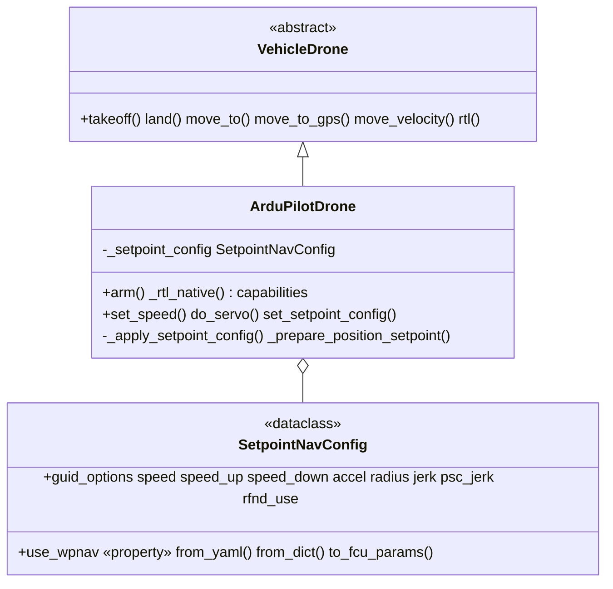

# Núcleo do Veículo ArduPilot

Especialização de firmware ArduPilot do [núcleo do veículo](../vehicle/) compartilhado. `ArduPilotDrone` ([`drone.py`](https://github.com/Black-Bee-Drones/nectar-sdk/blob/main/nectar/nectar/control/ardupilot/drone.py)) acrescenta a semântica de voo do ArduPilot — arming em modo GUIDED, a configuração de setpoint `GUID_OPTIONS`/`WPNAV`, e o retorno ao ponto de lançamento em modo `RTL` nativo — sobre o [`VehicleDrone`](https://github.com/Black-Bee-Drones/nectar-sdk/blob/main/nectar/nectar/control/vehicle/drone.py); a navegação agnóstica a transporte, a detecção de takeoff/land, a matemática de GPS e o controle PID são herdados do núcleo. `MavrosDrone` e `MavlinkDrone` são o **mesmo veículo, alcançado por dois transportes diferentes** ([mavros](../mavros/), [mavlink](../mavlink/)).

> Esta página documenta apenas as especificidades do ArduPilot. Os métodos de navegação compartilhados, os frames de referência, as fontes de altitude, a detecção de takeoff/land, o tratamento de GPS/EGM96 e a configuração de PID — que se aplicam a todo veículo — estão no [README do núcleo do veículo](../vehicle/). As especificidades do PX4 estão em [PX4](../px4/).

## Arquitetura



O diagrama de classes completo do núcleo (`VehicleDrone`, `VehicleNavigator`, `VehicleTransport`, transportes) está no [README do núcleo do veículo](../vehicle/#design).

## Módulos

| Arquivo | Responsabilidade |
| --- | --- |
| `drone.py` | `ArduPilotDrone(VehicleDrone)` — semântica de voo do ArduPilot: arming em GUIDED, WPNAV/GUID_OPTIONS, RTL nativo, `set_speed`/`do_servo`. |
| `setpoint_config.py` | `SetpointNavConfig` — tratamento de parâmetros `GUID_OPTIONS`/`WPNAV` (com aliases 4.6/4.8). |
| `config/` | Presets YAML de PID + setpoint embutidos (`position_*.yaml`, `setpoint_*.yaml`, incluindo os presets de SITL `*_sim_*`). |

## Capacidades

`ArduPilotDrone.capabilities` é derivado declarativamente da `pose_source` configurada (veja [`capabilities.py`](https://github.com/Black-Bee-Drones/nectar-sdk/blob/main/nectar/nectar/control/capabilities.py)): outdoor adiciona `GPS_NAV`/`GLOBAL_SETPOINT`, indoor adiciona `VISION_POSE`. Sobre o conjunto compartilhado, ele declara `SERVO` (o caminho de PWM por canal `do_servo` do ArduPilot, que o PX4 não expõe), além de `ACTUATOR` (`DO_SET_ACTUATOR`) e `GRIPPER` (`DO_GRIPPER`) para payloads (ambos compartilhados com o PX4). Operações protegidas por capacidade chamam `_require(...)`, então `do_servo` / `set_actuator` / `set_gripper` lançam `CapabilityNotSupportedError` em um drone que não os declara; consulte com `drone.supports(Capability.SERVO)`.

## MAVLink e o FCU

[MAVLink](https://ardupilot.org/dev/docs/mavlink-basics.html) é o protocolo binário entre o controlador de voo (FCU), estações de solo e computadores de bordo. O SDK envia comandos de velocidade/posição e lê dados de sensor por ele — via MAVROS em um transporte, via pymavlink diretamente no outro. O drone precisa estar em [modo GUIDED](https://ardupilot.org/dev/docs/copter-commands-in-guided-mode.html) para controle offboard.

## Modos de Voo

Os [modos de voo](https://ardupilot.org/copter/docs/flight-modes.html) do ArduPilot determinam como o FCU interpreta as entradas. Modos usados por este SDK:

| Modo | Descrição |
|------|-------------|
| GUIDED | Controle offboard. Aceita comandos de posição/velocidade do computador de bordo. Exigido para a navegação do SDK. |
| STABILIZE | Voo estabilizado manual. O piloto controla via RC. |
| LOITER | Manutenção de posição baseada em GPS. |
| RTL | Retorno ao ponto de lançamento — voa de volta para home e pousa. |
| LAND | Auto-pouso na posição atual. |

Definido via `drone.set_mode()`. Veja o [protocolo MAVLink de modo de voo](https://ardupilot.org/dev/docs/mavlink-get-set-flightmode.html).

## Arme (GUIDED)

`ArduPilotDrone.arm()` define o modo `GUIDED`, espera o modo refletir no estado, opcionalmente envia os parâmetros de setpoint (quando `apply_setpoint_params=True`), comanda o arme, e faz poll de `is_armed` para confirmar. GUIDED é o modo de controle offboard e persiste durante toda a navegação, então — diferente do OFFBOARD do PX4 — nenhum stream contínuo de setpoint é necessário para permanecer nele.

## EKF (Filtro de Kalman Estendido)

O [EKF](https://ardupilot.org/copter/docs/common-apm-navigation-extended-kalman-filter-overview.html) é o estimador de estado do ArduPilot. Ele funde dados de IMU, GPS, barômetro e, opcionalmente, visão/rangefinder, em uma estimativa de posição/velocidade/atitude. Todos os valores de altitude e posição neste SDK vêm, em última instância, da saída do EKF, exposta pelo transporte como `local_pose`, `gps`, `rel_alt`, etc.

### Origem do EKF (Requisito Indoor)

O frame local do EKF precisa de uma origem — a referência (0,0,0) para o NED. Outdoor,
o GPS geralmente a define. Indoor, sem fix de GPS, defina-a manualmente (Mission Planner
"Set EKF Origin Here" ou [`SET_GPS_GLOBAL_ORIGIN`](https://mavlink.io/en/messages/common.html#SET_GPS_GLOBAL_ORIGIN)).
Home (RTL) é um conceito diferente. Regras completas (ArduPilot vs. PX4, persistência em 4.7+,
por que o ícone do mapa da GCS aparece, o que o Nectar não envia):
[Localization → Origem do EKF](localization/#ekf-origin).

### Sistemas de Visão (Fonte de Posição Indoor)

Um sistema de visão externo alimenta dados de pose para o EKF do ArduPilot como [`VISION_POSITION_ESTIMATE`](https://mavlink.io/en/messages/common.html#VISION_POSITION_ESTIMATE). O EKF funde isso com o IMU e produz a pose local. Os dois transportes injetam isso de forma diferente — veja o README de cada transporte — mas o comportamento do veículo é idêntico.

Parâmetros-chave do ArduPilot: `EK3_SRC1_POSXY=6`, `EK3_SRC1_POSZ=6`, `EK3_SRC1_YAW=6` (ExternalNav), `VISO_TYPE=1`. Veja a [configuração de VIO do ArduPilot](https://ardupilot.org/copter/docs/common-vio-tracking-camera.html), o [guia de VIO com ROS](https://ardupilot.org/dev/docs/ros-vio-tracking-camera.html) e o [Non-GPS Position Estimation](https://ardupilot.org/dev/docs/mavlink-nongps-position-estimation.html).

## Controladores de Posição do Modo GUIDED do ArduPilot

Quando o SDK publica um setpoint de posição local (`NavigationMethod.POSITION` / `POSITION_GLOBAL`, documentado no [README do núcleo do veículo](../vehicle/#navegacao-por-setpoint-posicao)), o modo GUIDED do ArduPilot o roteia para um de dois controladores, selecionados pelo parâmetro [`GUID_OPTIONS`](https://ardupilot.org/copter/docs/ac2_guidedmode.html#guided-mode-options):

| Controlador | GUID_OPTIONS | SubMode | Trajetória | Controle de Velocidade |
|---|---|---|---|---|
| **AC_PosControl** (padrão) | bit 6 = 0 | `SubMode::Pos` | PID direto ao alvo | Limites de velocidade do WPNAV na inicialização |
| **AC_WPNav** | bit 6 = 1 (valor 64) | `SubMode::WP` | Planejamento de trajetória em S-curve | Conjunto completo de parâmetros WPNAV |

Fonte: [`mode_guided.cpp :: set_pos_NED_m()`](https://github.com/ArduPilot/ardupilot/blob/master/ArduCopter/mode_guided.cpp) — `use_wpnav_for_position_control()` seleciona o submodo a partir do bit 6 de `GUID_OPTIONS`.

- **AC_PosControl (SubMode::Pos)** — PID direto em direção ao alvo, sem modelagem de trajetória. Limites de velocidade lidos uma vez na inicialização do modo. Sem raio de chegada interno (a verificação de chegada do SDK cuida disso). Adequado para streaming contínuo de posição; pode produzir movimento abrupto em alta velocidade/longa distância.
- **AC_WPNav (SubMode::WP)** — caminho em linha reta com um perfil de velocidade em S-curve; respeita todos os parâmetros `WPNAV_*` dinamicamente (incluindo `WPNAV_RADIUS` para desaceleração e chegada), suporta planejamento de trajetória com desvio de obstáculos. Cada novo alvo dispara um replanejamento completo — melhor para missões ponto a ponto, não para retargeting rápido.

### Parâmetros WPNAV

Os [parâmetros `WPNAV_*`](https://ardupilot.org/copter/docs/parameters-Copter-stable-V4.6.3.html#wpnav-parameters) do ArduPilot v4.6.3 controlam velocidade, aceleração e precisão de navegação:

| Parâmetro | Descrição | Padrão do ArduPilot | Unidade |
|---|---|---|---|
| `WPNAV_SPEED` | Velocidade horizontal | 1000 (10 m/s) | cm/s |
| `WPNAV_SPEED_UP` | Velocidade de subida | 250 (2,5 m/s) | cm/s |
| `WPNAV_SPEED_DN` | Velocidade de descida | 150 (1,5 m/s) | cm/s |
| `WPNAV_ACCEL` | Aceleração horizontal | 250 (2,5 m/s²) | cm/s/s |
| `WPNAV_RADIUS` | Raio de chegada ao waypoint | 200 (2,0 m) | cm |
| `WPNAV_JERK` | Jerk horizontal | 1,0 | m/s/s/s |
| `WPNAV_RFND_USE` | Terrain following por rangefinder | 1 (habilitado) | bool |

> No ArduPilot dev (v4.8+) esses parâmetros são renomeados para `WP_*`. `SetpointNavConfig` usa nomes de campo descritivos e carrega um mapa `PARAM_ALIASES` (`WPNAV_SPEED` → `WP_SPD`, etc.), então mudanças de versão exigem apenas a tabela de alias.

O SDK também define `PSC_JERK_XY` (4.6.3) / `PSC_JERK_NE` (4.8+) — jerk horizontal do controlador de posição, padrão 5,0 m/s³ — via `SetpointNavConfig.psc_jerk`. Isso controla a velocidade de resposta do AC_PosControl em SubMode::Pos; o SITL tipicamente precisa de valores mais altos (por exemplo, 50) para uma resposta usável.

**Efeito em runtime de `set_param` por submodo**: em SubMode::WP, todos os `WPNAV_*` são relidos a cada novo alvo (`wp_nav->set_wp_destination()`). Em SubMode::Pos, os limites de velocidade/aceleração são definidos uma vez na entrada do submodo — use `set_speed()` para mudanças dinâmicas. O `_prepare_position_setpoint()` do SDK usa a releitura do WPNav para atualizar `WPNAV_RADIUS` a partir do argumento `precision`, em cada chamada `POSITION`/`POSITION_GLOBAL`, quando o WPNav está habilitado e `apply_setpoint_params=True`.

### Controle de Velocidade em Runtime

`set_speed(speed, speed_type)` envia [`MAV_CMD_DO_CHANGE_SPEED`](https://ardupilot.org/copter/docs/common-mavlink-mission-command-messages-mav_cmd.html#mav-cmd-do-change-speed) (178), que atualiza imediatamente os limites de velocidade ativos do AC_PosControl em **ambos** os submodos:

```python
drone.set_speed(0.5, "horizontal")   # 0.5 m/s horizontal
drone.set_speed(0.3, "climb")        # 0.3 m/s climb
drone.set_speed(0.3, "descent")      # 0.3 m/s descent
drone.set_speed(-2, "horizontal")    # revert to WPNAV_SPEED default
```

Em contraste, `set_param("WPNAV_SPEED", value)` só entra em efeito no próximo alvo (WP) ou na próxima inicialização de modo (Pos).

## RTL

`rtl()` usa por padrão `RTLMethod.NAVIGATE` (o caminho PID compartilhado do SDK até home — veja o [núcleo do veículo](../vehicle/#rtl)). `RTLMethod.NATIVE` usa o próprio modo de voo `RTL` do ArduPilot:

```python
drone.rtl(method=RTLMethod.NATIVE)   # ArduPilot RTL mode, auto-land
```

- **NATIVE**: define `RTL_ALT` (altitude de retorno, ou 0 para manter a altitude atual em vez do padrão de 15 m do ArduPilot) e `RTL_ALT_FINAL` (0 para auto-pousar, ou a altitude de retorno para manter acima de home), depois define o modo `RTL`. Os nomes de parâmetro diferem por versão: `RTL_ALT` / `RTL_ALT_FINAL` (v4.6.3, cm) vs. `RTL_ALT_M` / `RTL_ALT_FINAL_M` (v4.8+, m); o SDK tenta primeiro o nome da v4.6.3 e recorre automaticamente ao outro. Veja o [modo RTL](https://ardupilot.org/copter/docs/rtl-mode.html).

## Manipulação de Parâmetros

`drone.set_param(name, value)` repassa para o transporte. Inteiros são enviados como int, floats como double. O ArduPilot persiste `PARAM_SET` em armazenamento, então os valores sobrevivem a reinicializações.

```python
drone.set_param("RTL_ALT", 1500)        # int, cm
drone.set_param("WPNAV_SPEED", 200.0)   # float, cm/s
drone.set_param("GUID_OPTIONS", 65)     # int, bits 0 + 6
```

Parâmetros dependentes de versão (WPNAV/PSC, RTL) são escritos primeiro com o nome da v4.6.3, recorrendo ao alias da v4.8+ em caso de falha, usando `SetpointNavConfig.PARAM_ALIASES`. Como um `set_param` é confirmado depende do transporte (resultado de serviço vs. eco de `PARAM_VALUE`) — veja os READMEs de transporte. Veja [Get/Set Parameters](https://ardupilot.org/dev/docs/mavlink-get-set-params.html).

## Configuração de Navegação por Setpoint

`SetpointNavConfig` controla o comportamento do modo GUIDED para `NavigationMethod.POSITION` / `POSITION_GLOBAL`: o submodo do controlador de posição (AC_PosControl vs. AC_WPNav) e os parâmetros WPNAV/PSC.

**Ciclo de vida**:

1. **Na inicialização**: `_load_setpoint_config()` carrega de `setpoint_config_file`, senão os `setpoint_indoor.yaml` / `setpoint_outdoor.yaml` embutidos, por `is_indoor`. Sempre carregado para a lógica do lado do SDK (por exemplo, verificações de `use_wpnav`).
2. **No arme** (somente se `apply_setpoint_params=True`): `_apply_setpoint_config()` envia `GUID_OPTIONS` e os parâmetros `WPNAV_*` / `PSC_JERK_*` para o FCU via `set_param()`, logando cada resultado.
3. **Em `move_to` / `move_to_gps` com um método POSITION** (somente se `apply_setpoint_params=True` e `use_wpnav`): `_prepare_position_setpoint()` sincroniza `WPNAV_RADIUS` com `precision`.

> **Persistência no FCU**: `set_param` escreve no armazenamento do autopiloto e sobrevive a reinicializações. `apply_setpoint_params` tem padrão `False`, então por padrão o SDK não toca nos parâmetros do FCU. Defina-o como `True` para deixar o SDK ser o proprietário deles (por exemplo, em SITL). `drone.set_setpoint_config(config)` envia sob demanda independentemente dessa flag (passe `apply=False` para atualizar apenas a config do lado do SDK).

**Padrões da dataclass** (unidades SI; velocidade/aceleração/raio são convertidos para cm/s, cm por `to_fcu_params()`):

| Campo | Padrão | Padrão de fábrica do ArduPilot |
|---|---|---|
| `guid_options` | `1` (bit 0) | `0` |
| `speed` | 2,0 m/s | 10,0 m/s |
| `speed_up` | 1,5 m/s | 2,5 m/s |
| `speed_down` | 1,5 m/s | 1,5 m/s |
| `accel` | 1,0 m/s² | 2,5 m/s² |
| `radius` | 0,2 m | 2,0 m |
| `jerk` | 1,0 m/s³ | 1,0 m/s³ |
| `psc_jerk` | 5,0 m/s³ | 5,0 m/s³ |
| `rfnd_use` | 1 | 1 |

`guid_options` é a bitmask do [`GUID_OPTIONS`](https://ardupilot.org/copter/docs/ac2_guidedmode.html#guided-mode-options); `use_wpnav` é `True` quando o bit 6 está definido. Valores comuns: `1` (arme pela TX), `64` (apenas WPNav), `65` (arme pela TX + WPNav). Os padrões de velocidade do SDK são intencionalmente conservadores em relação aos valores de fábrica do ArduPilot, para evitar movimento agressivo.

**Enviar para o FCU**:

```python
drone.set_setpoint_config({"guid_options": 65, "speed": 0.5, "radius": 0.1})
```

**Atualizar apenas a config do lado do SDK** (`apply=False`):

```python
drone.set_setpoint_config({"speed": 0.5}, apply=False)
```

## Configuração de PID

O ArduPilot carrega seu `PositionPIDConfig` a partir dos [presets embutidos](https://github.com/Black-Bee-Drones/nectar-sdk/tree/main/nectar/nectar/control/ardupilot/config) (`position_indoor.yaml` / `position_outdoor.yaml`, mais os presets de SITL `position_sim_*.yaml`) — o ciclo de carregamento e as sobrescritas em runtime são compartilhados e documentados no [README do núcleo do veículo](../vehicle/#configuracao-de-pid). Os internos do controlador (ganhos, clamps de saída, tratamento integral) estão no [módulo PID](pid.md).

## Transportes

- [Transporte MAVROS](../mavros/) — `MavrosTransport`: subscriptions → telemetria, service clients → comandos, publishers → setpoints. Exige um `mavros_node` em execução.
- [Transporte MAVLink direto](../mavlink/) — `PymavlinkTransport`: possui o link do FCU, decodificação por timer de RX, `mav.*_send` direto, ponte de visão embutida.

## Referências

### MAVLink e ArduPilot

- [MAVLink Basics](https://ardupilot.org/dev/docs/mavlink-basics.html) · [Mensagens comuns do MAVLink](https://mavlink.io/en/messages/common.html) · [MAV_FRAME](https://mavlink.io/en/messages/common.html#MAV_FRAME)
- [ArduPilot Copter Documentation](https://ardupilot.org/copter/) · [Flight Modes](https://ardupilot.org/copter/docs/flight-modes.html) · [GUIDED Mode](https://ardupilot.org/copter/docs/ac2_guidedmode.html)
- [GUIDED Mode Commands](https://ardupilot.org/dev/docs/copter-commands-in-guided-mode.html) · [PosControl and Navigation Overview](https://ardupilot.org/dev/docs/code-overview-copter-poscontrol-and-navigation.html)
- [WPNAV Parameters (v4.6.3)](https://ardupilot.org/copter/docs/parameters-Copter-stable-V4.6.3.html#wpnav-parameters) · [MAV_CMD_DO_CHANGE_SPEED](https://ardupilot.org/copter/docs/common-mavlink-mission-command-messages-mav_cmd.html#mav-cmd-do-change-speed)
- [Understanding Altitude](https://ardupilot.org/copter/docs/common-understanding-altitude.html) · [EKF Overview](https://ardupilot.org/copter/docs/common-apm-navigation-extended-kalman-filter-overview.html) · [RTL Mode](https://ardupilot.org/copter/docs/rtl-mode.html)
- [Get/Set Parameters](https://ardupilot.org/dev/docs/mavlink-get-set-params.html) · [Set/Get flight mode](https://ardupilot.org/dev/docs/mavlink-get-set-flightmode.html)

### Código-fonte do ArduPilot

- [`mode_guided.cpp`](https://github.com/ArduPilot/ardupilot/blob/master/ArduCopter/mode_guided.cpp) — submodos GUIDED, `pva_control_start()`, `set_pos_NED_m()`
- [`AC_WPNav.cpp`](https://github.com/ArduPilot/ardupilot/blob/Copter-4.6.3/libraries/AC_WPNav/AC_WPNav.cpp) · [`AC_PosControl.h`](https://github.com/ArduPilot/ardupilot/blob/master/libraries/AC_AttitudeControl/AC_PosControl.h) · [`GCS_MAVLink_Copter.cpp`](https://github.com/ArduPilot/ardupilot/blob/master/ArduCopter/GCS_MAVLink_Copter.cpp)

### Visão e Navegação Indoor

- [VIO Tracking Camera](https://ardupilot.org/copter/docs/common-vio-tracking-camera.html) · [ROS VIO Setup](https://ardupilot.org/dev/docs/ros-vio-tracking-camera.html) · [Non-GPS Position Estimation](https://ardupilot.org/dev/docs/mavlink-nongps-position-estimation.html)
- Navegação, frames e altitude compartilhados, GPS/EGM96: [README do núcleo do veículo](../vehicle/)
