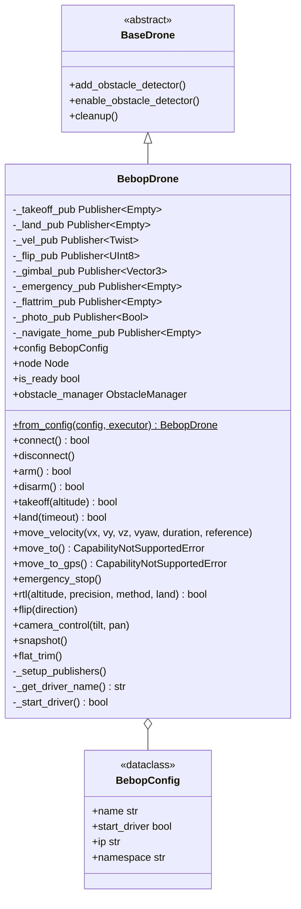

# Módulo de Controle do Bebop

Controle do Parrot Bebop 2 via o pacote ROS 2 [`ros2_bebop_driver`](https://github.com/jeremyfix/ros2_bebop_driver),
para voo baseado em velocidade.

## Resumo rápido

```python
import nectar
from nectar.control import DroneFactory, BebopConfig

nectar.init()
drone = DroneFactory.create("bebop", BebopConfig())

drone.takeoff()                              # fixed preset height (altitude arg ignored)
drone.move_velocity(vx=0.3, duration=2.0)    # body-frame, normalized [-1, 1]
drone.land()
nectar.shutdown()
```

## Capacidades

`BebopDrone.capabilities` declara `VELOCITY_BODY` (`move_velocity` em frame do corpo via
`cmd_vel`) e `NATIVE_RTL` (`navigate_home`). Ele **não** suporta controle de posição, GPS,
vision pose, parâmetros, ou navegação do lado do companion. Consulte com
`drone.supports(Capability.VELOCITY_BODY)`.

Comportamentos específicos do hardware Bebop:

- **A velocidade é apenas em frame do corpo**, normalizada para `[-1, 1]`; as referências
  `WORLD`/`TAKEOFF` não são suportadas.
- **A altitude de takeoff é fixa** — o argumento `altitude` de `takeoff()` é ignorado (o
  Bebop sobe até sua altura predefinida; ajuste depois com `move_velocity(vz=...)`).
- `move_to()` / `move_to_gps()` levantam `CapabilityNotSupportedError` (sem posicionamento
  onboard — sem GPS, sem PID do companion).
- `connect()` apenas verifica se o processo `bebop_driver` está em execução; não há
  handshake com um controlador de voo.
- `rtl()` publica o comando autoflight `navigate_home`; com `land=True` ele aguarda um
  delay fixo pela manobra (ele **não** chama `land()`).

## Arquitetura



## Configuração

```python
from nectar.control import DroneFactory, BebopConfig

config = BebopConfig(
    name="bebop_drone",
    start_driver=True,        # auto-start the ROS 2 driver on init
    ip="192.168.42.1",        # Bebop WiFi IP
    namespace="bebop",        # ROS 2 topic namespace prefix
)
drone = DroneFactory.create("bebop", config)
```

O Bebop cria sua própria rede WiFi — conecte-se a `Bebop2-XXXXXX` (IP padrão
`192.168.42.1`) antes de iniciar o driver.

## API de Controle

### Controle de Velocidade

```python
drone.move_velocity(
    vx=0.0,    # forward (+) / backward (-), normalized [-1, 1]
    vy=0.0,    # left (+) / right (-), normalized [-1, 1]
    vz=0.0,    # up (+) / down (-), normalized [-1, 1]
    vyaw=0.0,  # CCW (+) / CW (-), normalized [-1, 1]
    duration=None,                 # None = single publish; float = republish at 30 Hz for the duration
    reference=MoveReference.BODY,  # BODY only
)
```

Todas as entradas são limitadas a `[-1, 1]`.

### Operações de Voo

```python
drone.takeoff(altitude=1.5)   # altitude ignored (fixed height)
drone.land(timeout=30.0)
drone.rtl(land=True)          # autoflight navigate_home
drone.emergency_stop()        # reset command (hard stop)
```

### Recursos Específicos do Bebop

```python
drone.flip(0)                                # 0=Front, 1=Back, 2=Right, 3=Left
drone.camera_control(tilt=-45.0, pan=15.0)   # degrees; tilt +down/-up, pan +left/-right
drone.snapshot()                             # capture a photo
drone.flat_trim()                            # IMU calibration (on a flat, level surface)
```

## Tópicos ROS 2

Todos os tópicos usam o prefixo de namespace configurado (padrão `/bebop`):

| Tópico | Tipo | Finalidade |
|-------|------|---------|
| `/{ns}/takeoff` | Empty | Dispara o takeoff |
| `/{ns}/land` | Empty | Dispara o pouso |
| `/{ns}/cmd_vel` | Twist | Comandos de velocidade (`linear.x/y/z`, `angular.z`, cada um `[-1, 1]`) |
| `/{ns}/flip` | UInt8 | Executa a manobra de flip |
| `/{ns}/move_camera` | Vector3 | Controle do gimbal (x=tilt, y=pan) |
| `/{ns}/reset` | Empty | Parada de emergência / reset |
| `/{ns}/flattrim` | Empty | Calibração da IMU |
| `/{ns}/photo` | Bool | Captura uma foto |
| `/{ns}/autoflight/navigate_home` | Empty | Comando de RTL |

## Instalação

**Automatizada (Nectar)**:

```bash
make drone-bebop            # or: ./scripts/setup.sh drone bebop
```

Instala as dependências apt, clona `ros2_parrot_arsdk` e `ros2_bebop_driver` no
workspace se estiverem faltando, e os builda na ordem correta (aplicando os patches
abaixo). Os passos manuais equivalentes são:

```bash
sudo apt install ros-${ROS_DISTRO}-camera-info-manager ros-${ROS_DISTRO}-image-transport \
  ros-${ROS_DISTRO}-cv-bridge libavdevice-dev libavahi-client-dev python-is-python3
cd ~/ros2_ws/src
git clone https://github.com/jeremybernard/ros2_parrot_arsdk.git
git clone https://github.com/jeremybernard/ros2_bebop_driver.git
# Necessário com o repo do Google ≥2.65: pin do ARSDK 3.14.0 por tag, não SHA nu
sed -i 's|SET(ARSDK_MANIFEST_HASH 1ff5bdc5458627c12eb22e1dd1814cff25778f31)|SET(ARSDK_MANIFEST_HASH refs/tags/ARSDK3_version_3_14_0)|' \
  ros2_parrot_arsdk/CMakeLists.txt
cd ~/ros2_ws
colcon build --packages-select ros2_parrot_arsdk
colcon build --packages-select ros2_bebop_driver --symlink-install
```

- `python-is-python3` é necessário porque o build Alchemy do ARSDK invoca `python`, que
  está ausente por padrão no Ubuntu 24.04.
- No Ubuntu 24.04 (FFmpeg 5/6), `avcodec_find_decoder()` retorna `const AVCodec*`, então
  `AVCodec *p_codec_` precisa se tornar `const AVCodec *p_codec_` em
  `include/ros2_bebop_driver/video_decoder.hpp`. O `make drone-bebop` aplica esse patch
  automaticamente.
- O launcher `repo` do Google (≥2.65) rejeita `repo init -b <sha-nu>`. O upstream
  `ros2_parrot_arsdk` fixa o ARSDK 3.14.0 por SHA; o `make drone-bebop` reescreve esse pin
  para `refs/tags/ARSDK3_version_3_14_0` (mesmo commit).

Launch manual (quando `start_driver=False`):

```bash
ros2 launch ros2_bebop_driver bebop_node_launch.xml ip:=192.168.42.1
```

## Exemplo de Uso

```python
import nectar
from nectar.control import DroneFactory, BebopConfig

nectar.init()
drone = DroneFactory.create("bebop", BebopConfig(ip="192.168.42.1"))
drone.connect()                              # verifies the bebop_driver process

drone.takeoff(altitude=1.5)                  # fixed height
drone.move_velocity(vx=0.3, duration=2.0)    # forward 2s
drone.move_velocity(vyaw=0.5, duration=1.0)  # rotate CCW 1s
drone.flip(0)                                # front flip
drone.rtl(land=True)                         # navigate home
```

## Referências

- [ros2_bebop_driver](https://github.com/jeremyfix/ros2_bebop_driver) · [ros2_parrot_arsdk](https://github.com/jeremyfix/ros2_parrot_arsdk)
- [Especificações do Parrot Bebop 2](https://www.parrot.com/en/support/documentation/bebop-range) · [Bebop Commands and Events](https://developer.parrot.com/docs/bebop/index.html?c#commands-and-events) · [Documentação do ARSDK](https://developer.parrot.com/docs/SDK3/)
