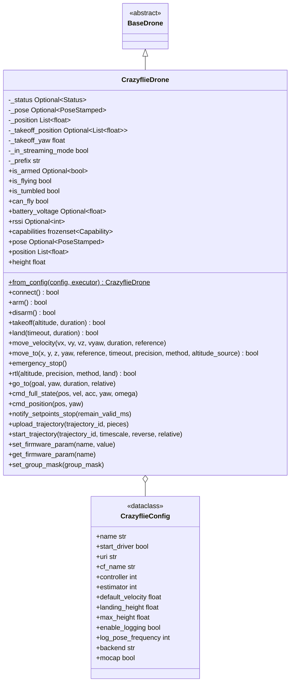

# Módulo de Controle do Crazyflie

Controle do drone [Bitcraze Crazyflie 2.x](https://www.bitcraze.io/products/crazyflie-2-1/)
via [Crazyswarm2](https://imrclab.github.io/crazyswarm2/) para ROS 2 — o mesmo protocolo
`Drone` usado pelos drones com FCU, mas sobre uma bridge Crazyswarm2 em vez de MAVROS.

## Resumo rápido

```python
import nectar
from nectar.control import DroneFactory, CrazyflieConfig

nectar.init()
drone = DroneFactory.create("crazyflie", CrazyflieConfig(cf_name="cf231"))

drone.takeoff(altitude=0.5)
drone.move_to(x=0.5, y=0.0, z=0.0)   # POSITION via the onboard goTo planner
drone.land()
nectar.shutdown()
```

## Capacidades

`CrazyflieDrone.capabilities` declara `LOCAL_SETPOINT` (`move_to` POSITION via o planner
onboard `goTo`), `VELOCITY_BODY`/`VELOCITY_WORLD`/`VELOCITY_TAKEOFF` (`move_velocity` via
streaming) e `PARAMS` (acesso a parâmetros do firmware). Não suporta navegação por GPS,
PID do lado do companion, vision pose, telemetria de rangefinder, controle de servo, ou
RTL nativo. Consulte com `drone.supports(Capability.LOCAL_SETPOINT)`.

## Conceitos Principais

### Crazyswarm2

O [Crazyswarm2](https://github.com/IMRCLab/crazyswarm2) é um stack ROS 2 para controlar
drones Crazyflie. Ele fornece um node `crazyflie_server` que trata a comunicação de rádio
via [Crazyradio PA/2](https://www.bitcraze.io/products/crazyradio-pa/), a sincronização de
parâmetros do firmware, o streaming de log variables, e expõe comandos de voo como
serviços e tópicos ROS 2.

Este SDK usa o Crazyswarm2 como bridge de comunicação — o mesmo padrão usado pelo MAVROS
para ArduPilot/PX4 e pelo `ros2_bebop_driver` para o Parrot Bebop. A classe
`CrazyflieDrone` se comunica exclusivamente via ROS 2, nunca diretamente com o rádio do
Crazyflie.

### Comandos de Alto Nível vs Baixo Nível

O firmware do Crazyflie tem dois modos de comando:

| Modo | Comandos | Descrição |
|------|----------|-------------|
| **Alto nível** | `takeoff`, `land`, `goTo`, `startTrajectory` | Planner polinomial onboard. Define o alvo e a duração, o firmware planeja uma trajetória suave. |
| **Baixo nível (streaming)** | `cmdFullState`, `cmdPosition` | Setpoints diretos em alta frequência (~50Hz). O firmware rastreia o setpoint. |

Trocar de streaming para alto nível exige chamar `notify_setpoints_stop()`. O SDK trata
isso automaticamente em `move_to()`, `land()`, e `go_to()` quando precedidos por comandos
de streaming.

### Flow Deck v2

O [Flow Deck v2](https://www.bitcraze.io/products/flow-deck-v2/) fornece estimativa de
posição relativa usando:

- **Sensor de fluxo óptico**: rastreia o movimento sobre a superfície do solo
- **Rangefinder ToF**: mede a altura em relação ao solo (alcance ~0,2m a ~4m)

O [estimador Kalman](https://www.bitcraze.io/documentation/repository/crazyflie-firmware/master/functional-areas/sensor-to-control/state_estimators/)
(EKF) onboard funde esses sensores com a IMU para produzir estimativas de posição.

**Restrições**:

- A posição deriva com o tempo (sem referência absoluta)
- Exige uma superfície de piso texturizada para o fluxo óptico
- Altura máxima prática de voo ~3m (limite de alcance do ToF)
- A proximidade de paredes pode confundir as leituras do ToF (detecção em formato de cone)

### Controlador Onboard

O Crazyflie suporta dois controladores onboard:

- **PID** (`controller=1`): controlador PID em cascata padrão
- **Mellinger** (`controller=2`): controlador de tracking geométrico para manobras
  agressivas

A seleção do controlador é um parâmetro de firmware definido na inicialização via
`CrazyflieConfig.controller`.

## Arquitetura



## CrazyflieDrone

### Inicialização

```python
from nectar.control import DroneFactory, CrazyflieConfig

config = CrazyflieConfig(
    cf_name="cf231",                   # Robot name in crazyflies.yaml
    uri="radio://0/80/2M/E7E7E7E7E7",  # Crazyradio URI
    controller=2,                       # 1=PID, 2=Mellinger
    estimator=2,                        # 2=Kalman (required for Flow Deck)
    default_velocity=0.3,               # m/s for goTo duration estimation
    max_height=3.0,                     # Flow Deck v2 ToF limit
)

drone = DroneFactory.create("crazyflie", config)
```

### Propriedades

```python
drone.is_armed             # Optional[bool]: Motor arm state from supervisor
drone.is_flying            # bool: Whether currently in flight
drone.is_tumbled           # bool: Crash detection
drone.can_fly              # bool: Ready for flight commands
drone.battery_voltage      # Optional[float]: Battery voltage (V)
drone.rssi                 # Optional[int]: Radio signal strength (dBm)
drone.pose                 # Optional[PoseStamped]: Full estimated pose
drone.position             # List[float]: Current [x, y, z] in meters
drone.height               # float: Current height above ground (m)
```

### Operações de Voo

```python
drone.connect()                        # Wait for status, verify connection
drone.takeoff(altitude=0.5)            # Takeoff to 0.5m (duration auto-estimated)
drone.takeoff(altitude=0.5, duration=2.0)  # Explicit duration

drone.move_to(x=0.5, y=0.0, z=0.0)    # 0.5m forward (BODY); POSITION method (default, only option)
drone.move_to(x=1.0, reference=MoveReference.TAKEOFF)  # 1m forward of takeoff

drone.move_velocity(vx=0.2, duration=2.0)  # Streaming velocity for 2 seconds

drone.land()                            # Land from current height
drone.emergency_stop()                  # Hard kill (requires reboot)
drone.rtl()                             # Return to takeoff (NAVIGATE method, default) and land
```

### Recursos Específicos do Crazyflie

#### Comando GoTo Direto

```python
drone.go_to(goal=[1.0, 0.0, 0.5], yaw=0.0, duration=3.0, relative=False)
```

#### Trajetórias Polinomiais

```python
drone.upload_trajectory(0, trajectory_pieces)
drone.start_trajectory(0, timescale=1.0, relative=True)
```

#### Streaming Full-State

```python
drone.cmd_full_state(
    pos=[0.0, 0.0, 0.5],
    vel=[0.1, 0.0, 0.0],
    acc=[0.0, 0.0, 0.0],
    yaw=0.0,
    omega=[0.0, 0.0, 0.0],
)

# After streaming, before high-level commands:

drone.notify_setpoints_stop()
```

#### Parâmetros de Firmware

```python
drone.set_firmware_param("stabilizer.controller", 2)   # Switch to Mellinger
drone.set_firmware_param("ring.effect", 7)              # Solid LED color
drone.get_firmware_param("stabilizer.controller")       # Read current value
```

#### Group Mask do Swarm

```python
drone.set_group_mask(1)  # Assign to group 1 for broadcast commands
```

## API de Movimento

### Frames de Referência

| MoveReference | Mapeamento no goTo | Descrição |
|---------------|-------------|-------------|
| **BODY** | Offset rotacionado pelo yaw atual, enviado como absoluto | Relativo à posição e ao heading atuais |
| **WORLD** | Coordenadas absolutas | Alvo direto em frame do mundo |
| **TAKEOFF** | Offset rotacionado pelo yaw do takeoff, enviado como absoluto | Relativo à posição e ao heading do takeoff |

**Importante**: o `goTo(relative=True)` do Crazyswarm2 é alinhado ao mundo (não relativo ao
heading). O SDK rotaciona os offsets BODY pelo yaw atual para produzir o comportamento
correto relativo ao heading.

### Estimativa de Duração

O serviço `goTo` do Crazyflie exige um parâmetro `duration` explícito. Para `move_to`, o
SDK estima esse valor a partir tanto da distância percorrida quanto da mudança de yaw:

```
yaw_duration = yaw_diff / radians(60)              # ~60 deg/s
duration = max(distance / default_velocity, yaw_duration, 1.0)
```

Onde `default_velocity` vem do `CrazyflieConfig` (padrão 0.3 m/s). O takeoff usa uma
duração mínima de 2.0 s; o land usa 1.0 s. Para controle preciso de timing, use o método
`go_to()` diretamente.

### Controle de Velocidade

`move_velocity()` usa setpoints de streaming `cmd_full_state`. Isso muda o Crazyflie para
o modo de baixo nível. O SDK chama `notify_setpoints_stop()` automaticamente ao voltar
para comandos de alto nível.

### Métodos de navegação (`move_to` / `rtl`)

`move_to` aceita `method: NavigationMethod` (padrão `NavigationMethod.POSITION`). O
**CrazyflieDrone só suporta `NavigationMethod.POSITION`** (`goTo` onboard de alto nível).
`NavigationMethod.PID`, `NavigationMethod.PID_EKF`, e `NavigationMethod.POSITION_GLOBAL`
levantam `CapabilityNotSupportedError`.

`rtl` aceita `method: RTLMethod` (padrão `RTLMethod.NAVIGATE`). O **CrazyflieDrone só
suporta `RTLMethod.NAVIGATE`** (mesmo caminho baseado em goTo que `move_to`, até a pose de
takeoff). `RTLMethod.NATIVE` levanta `CapabilityNotSupportedError`.

### Matriz de Capacidades

| Método | Suportado | Notas |
|--------|-----------|-------|
| `takeoff` | Sim | Commander onboard de alto nível |
| `land` | Sim | Commander onboard de alto nível |
| `move_to` | Sim | Somente `NavigationMethod.POSITION` (goTo); outros métodos levantam `CapabilityNotSupportedError`; todos os frames de `MoveReference` são suportados |
| `move_velocity` | Sim | Via streaming cmd_full_state |
| `move_to_gps` | Não | Sem GPS no Crazyflie 2.x |
| `rtl` | Sim | Somente `RTLMethod.NAVIGATE` (goTo até a posição de takeoff); `RTLMethod.NATIVE` levanta `CapabilityNotSupportedError` |
| `emergency_stop` | Sim | Hard kill, exige reboot |
| `set_home` | Não | Sem GPS |

## Interface ROS 2

### Serviços (por robô: `/<cf_name>/...`)

| Serviço | Tipo | Finalidade |
|---------|------|---------|
| `/<cf>/emergency` | `std_srvs/Empty` | Mata os motores, trava o firmware |
| `/<cf>/takeoff` | `crazyflie_interfaces/Takeoff` | Voa até a altura em uma duração |
| `/<cf>/land` | `crazyflie_interfaces/Land` | Desce até a altura em uma duração |
| `/<cf>/go_to` | `crazyflie_interfaces/GoTo` | Navegação polinomial suave |
| `/<cf>/upload_trajectory` | `crazyflie_interfaces/UploadTrajectory` | Envia um polinômio por partes |
| `/<cf>/start_trajectory` | `crazyflie_interfaces/StartTrajectory` | Executa a trajetória enviada |
| `/<cf>/notify_setpoints_stop` | `crazyflie_interfaces/NotifySetpointsStop` | Encerra o modo streaming |
| `/<cf>/arm` | `crazyflie_interfaces/Arm` | Arma/desarma (Bolt/brushless) |

### Tópicos

| Tópico | Tipo | Direção | Finalidade |
|-------|------|-----------|---------|
| `/<cf>/cmd_full_state` | `crazyflie_interfaces/FullState` | Pub | Setpoint full-state em streaming |
| `/<cf>/cmd_position` | `crazyflie_interfaces/Position` | Pub | Setpoint de posição em streaming |
| `/<cf>/pose` | `geometry_msgs/PoseStamped` | Sub | Pose estimada pelo state estimator |
| `/<cf>/status` | `crazyflie_interfaces/Status` | Sub | Bateria, RSSI, estado do supervisor |
| `/tf` | `tf2_msgs/TFMessage` | Sub | Pose de simulação quando `backend:=sim` (o Crazyswarm2 publica o TF do modelo aqui; `connect()` espera por esse caminho em vez de `/<cf>/pose`) |

### Parâmetros (via crazyflie_server)

Os parâmetros do firmware são expostos como parâmetros ROS 2 no `/crazyflie_server` sob
`<cf_name>.params.<group>.<name>`. Exemplos:

- `cf231.params.stabilizer.controller` (1=PID, 2=Mellinger)
- `cf231.params.stabilizer.estimator` (1=complementary, 2=kalman)
- `cf231.params.commander.enHighLevel` (1=enable high-level commander)

## Instalação

**Automatizada (Nectar)**:

```bash
make drone-crazyflie        # or: ./scripts/setup.sh drone crazyflie
```

Instala os pacotes apt abaixo (quando disponíveis para sua distro ROS) mais o `rowan`, e
configura as permissões USB do Crazyradio (passo 2). Depois disso só o `crazyflies.yaml`
(passo 3) precisa ser editado com sua URI de rádio. Faça logout e login de novo uma vez
para que a mudança de grupo `plugdev` seja aplicada.

### 1. Instalar o Crazyswarm2

**Binário (recomendado)**:

```bash
sudo apt install ros-${ROS_DISTRO}-crazyflie ros-${ROS_DISTRO}-crazyflie-interfaces
pip3 install rowan
```

**A partir do source**:

```bash
cd ~/ros2_ws/src
git clone https://github.com/IMRCLab/crazyswarm2 --recursive
cd ~/ros2_ws
colcon build --symlink-install --cmake-args -DCMAKE_BUILD_TYPE=Release
```

### 2. Configurar as Permissões USB do Crazyradio

```bash
sudo groupadd plugdev
sudo usermod -a -G plugdev $USER
cat <<EOF | sudo tee /etc/udev/rules.d/99-bitcraze.rules
SUBSYSTEM=="usb", ATTRS{idVendor}=="1915", ATTRS{idProduct}=="7777", MODE="0664", GROUP="plugdev"
SUBSYSTEM=="usb", ATTRS{idVendor}=="1915", ATTRS{idProduct}=="0101", MODE="0664", GROUP="plugdev"
EOF
sudo udevadm control --reload-rules
sudo udevadm trigger
```

Faça logout e login de novo para que as mudanças de grupo tenham efeito.

### 3. Configurar o crazyflies.yaml

Edite o arquivo de configuração do Crazyswarm2 (tipicamente em
`<crazyswarm2_ws>/src/crazyswarm2/crazyflie/config/crazyflies.yaml`):

```yaml
robots:
    cf231:
        enabled: true
        uri: radio://0/80/2M/E7E7E7E7E7
        initial_position: [0, 0, 0]
        type: cf21

robot_types:
    cf21:
        motion_capture:
            enabled: false
        big_quad: false
        battery:
            voltage_warning: 3.8
            voltage_critical: 3.7

all:
    firmware_logging:
        enabled: true
        default_topics:
            pose:
                frequency: 10
    firmware_params:
        commander:
            enHighLevel: 1
        stabilizer:
            estimator: 2  # Kalman (required for Flow Deck)
            controller: 2  # Mellinger
```

### 4. Verificar a Conexão

**Terminal 1 — servidor Crazyflie**:

```bash
ros2 launch crazyflie launch.py
```

**Terminal 2 — verificar os tópicos**:

```bash
ros2 topic list | grep cf231
ros2 topic echo /cf231/status
```

## Exemplos de Uso

### Voo Básico

```python
import nectar
from nectar.control import DroneFactory, CrazyflieConfig

nectar.init()
drone = DroneFactory.create("crazyflie", CrazyflieConfig())
drone.connect()

drone.takeoff(altitude=0.5)
drone.move_to(x=0.3, y=0.0, z=0.0)
drone.move_to(x=0.0, y=0.3, z=0.0)
drone.rtl()
```

### Controle de Velocidade

```python
drone.takeoff(altitude=0.5)

# Fly forward for 2 seconds

drone.move_velocity(vx=0.2, duration=2.0)

# Fly in a circle-like pattern

for _ in range(20):
    drone.move_velocity(vx=0.2, vyaw=0.5, duration=0.1)

# Transition back to high-level for landing

drone.land()
```

### Simulação

**Terminal 1 — backend de simulação**:

```bash
ros2 launch crazyflie launch.py backend:=sim
```

**Terminal 2 — executar um script** (mesmo código):

```bash
python3 basic.py --drone crazyflie --backend sim
```

## O que é distinto no Crazyflie

Para os conjuntos de capacidades declarados em todos os drones, veja a
[matriz de capacidades do módulo control](../#capacidades). Características específicas
do Crazyflie:

- O controle de posição é **somente onboard** (`NavigationMethod.POSITION` via o planner
  `goTo` do firmware) — sem PID do lado do companion, GPS, ou caminho de vision-pose.
- A estimativa de altitude/posição vem do rangefinder ToF do Flow Deck, fundido pelo EKF
  onboard.
- Suporta upload + execução de trajetórias polinomiais por partes e streaming
  FullState/Position a ~50 Hz.
- A simulação usa o SIL do Crazyswarm2 (bindings de firmware), não o SITL/Gazebo do
  ArduPilot.

## Referências

- [Documentação do Crazyswarm2](https://imrclab.github.io/crazyswarm2/)
- [Crazyswarm2 no GitHub](https://github.com/IMRCLab/crazyswarm2)
- [Página do produto Crazyflie 2.1](https://www.bitcraze.io/products/crazyflie-2-1/)
- [Flow Deck v2](https://www.bitcraze.io/products/flow-deck-v2/)
- [Tutorial do Flow Deck](https://www.bitcraze.io/documentation/tutorials/getting-started-with-flow-deck/)
- [Parâmetros de Firmware do Crazyflie](https://www.bitcraze.io/documentation/repository/crazyflie-firmware/master/api/params/)
- [Log Variables de Firmware do Crazyflie](https://www.bitcraze.io/documentation/repository/crazyflie-firmware/master/api/logs/)
- [Paper do Crazyswarm2 (v1)](https://doi.org/10.1109/ICRA.2017.7989376)
