# Módulo de Controle de Drones

## Papel

Controle de drones baseado em protocolo (protocol) para ROS 2. `DroneFactory` constrói um drone por chave por meio do protocolo comum `Drone`; cada plataforma implementa a mesma interface (takeoff, land, move_to, move_to_gps, move_velocity, rtl, gerenciamento de obstáculos).

## Índice da documentação {#indice-da-documentacao}

As páginas abaixo detalham cada submódulo:

| README | Escopo |
|--------|-------|
| [Vehicle core](vehicle/) | Núcleo do veículo agnóstico a firmware: navegação, frames, takeoff/land, GPS/EGM96, PID, hooks de firmware |
| [ArduPilot](ardupilot/) | Especialização ArduPilot: arming em GUIDED, `GUID_OPTIONS`/WPNAV, RTL nativo, parâmetros |
| [PX4](px4/) | Especialização PX4: streaming de setpoint OFFBOARD, AUTO.LAND/RTL; backends MAVROS / MAVLink direto / uXRCE-DDS |
| [MAVROS transport](mavros/) | Transporte MAVROS (`MavrosDrone`, `Px4MavrosDrone`) |
| [MAVLink transport](mavlink/) | Transporte pymavlink neutro em relação a firmware (`MavlinkDrone`, `Px4MavlinkDrone`) |
| [Localization](localization/) | Navegação externa (external-nav) por VSLAM indoor: arquitetura, Run, FCU, SOP indoor |
| [Localization concepts](localization/concepts/) | Teoria de SLAM / VIO / V-SLAM e fusão com o FCU |
| [Legacy T265](localization/legacy/) | Histórico do T265 + `vision_to_mavros` |
| [Obstacles](obstacles/) | Detecção de obstáculos + estratégias de desvio de obstáculos |
| [PID](pid/) | Controlador PID e ajuste (tuning) |
| [Bebop](bebop/) | Parrot Bebop 2 (`BebopDrone`) |
| [Crazyflie](crazyflie/) | Bitcraze Crazyflie (`CrazyflieDrone`) |

## Resumo rápido

```python
import nectar
from nectar.control import DroneFactory, MavrosConfig, PoseSource

nectar.init()
drone = DroneFactory.create("mavros", MavrosConfig(pose_source=PoseSource.GPS))

drone.takeoff(altitude=2.0)
drone.move_to(x=5.0, y=0.0, z=0.0, precision=0.3)   # same calls on every backend
drone.land()
nectar.shutdown()
```

Escolha um backend pela chave — `mavros`, `mavlink`, `px4`, `px4_mavlink`, `px4_dds`, `bebop`,
`crazyflie` — com o config correspondente; as chamadas de voo permanecem as mesmas.

Lado a lado com MAVROS / pymavlink puro:
[Com e sem Nectar](../../get-started/with-without.md)
([with-without.md](../../get-started/with-without/)).

## Conceitos

ArduPilot e PX4 compartilham um único núcleo agnóstico a firmware (`VehicleDrone`) e alcançam o
FCU por meio de transportes intercambiáveis (MAVROS, MAVLink direto, PX4 uXRCE-DDS); Bebop e
Crazyflie implementam o protocolo `Drone` diretamente.

```mermaid
classDiagram
    class DroneFactory {
        <<singleton>>
        -_builders Dict~str,BuilderFunc~
        +create(type, config, executor) Drone
        +register(type, factory_func)
        +available_types() list~str~
        +is_registered(type) bool
    }

    class Drone {
        <<protocol>>
        +is_ready bool
        +connect() bool
        +disconnect()
        +arm() bool
        +disarm() bool
        +takeoff(altitude) bool
        +land(timeout) bool
        +move_velocity(vx, vy, vz, vyaw, duration, reference)
        +move_to(x, y, z, yaw, reference, timeout, precision, method) bool
        +move_to_gps(lat, lon, alt, heading, timeout, precision, method) bool
        +emergency_stop()
        +set_home() bool
        +rtl(altitude, precision, method, land) bool
    }

    class BaseDrone {
        <<abstract>>
        -_config DroneConfig
        -_node Node
        -_connected bool
        -_driver_running bool
        -_obstacle_manager ObstacleManager
        -_subscribers List~Subscription~
        -_publishers List~Publisher~
        -_clients List~Client~
        -_callback_group ReentrantCallbackGroup
        +config DroneConfig
        +node Node
        +is_ready bool
        +driver_running bool
        +is_armed Optional~bool~
        +flight_mode Optional~str~
        +is_fcu_connected Optional~bool~
        +driver_session_name str
        +obstacle_manager ObstacleManager
        +add_obstacle_detector(name, detector, strategy, config)
        +remove_obstacle_detector(name)
        +enable_obstacle_detector(name)
        +disable_obstacle_detector(name)
        +enable_all_obstacle_detectors()
        +disable_all_obstacle_detectors()
        +check_driver_status() bool
        +start_driver_process() bool
        +stop_driver_process() bool
        +delay(seconds)
        +cleanup()
        #_init_driver()
        #_wait_for_driver(timeout) bool
        #_create_subscriber(msg_type, topic, callback, qos) Subscription
        #_create_publisher(msg_type, topic, qos) Publisher
        #_create_client(srv_type, service_name) Client
        #_get_driver_name()* str
        #_start_driver()* bool
        #_get_driver_command()* str
    }

    class VehicleDrone {
        <<abstract>>
        -_transport VehicleTransport
        -_navigator VehicleNavigator
        -_sequencer FlightSequencer
        -_pid_config Optional~PositionPIDConfig~
        -_setpoint_config Optional~SetpointConfig~
        -_takeoff_position Optional
        -_pose_source PoseSource
        +is_indoor bool
        +is_armed flight_mode is_fcu_connected
        +gps heading rel_alt
        +local_pose vision_pose Optional~LocalPose~
        +lidar_available bool
        +position position_as_target
        +get_altitude(source) Optional~float~
        +distance_sensors get_distance(orientation)
        +takeoff() land() move_to() move_to_gps() move_velocity() rtl()
        +set_mode() set_param() set_speed() set_home()
        +set_actuator() set_gripper()
        +set_takeoff_position() set_pid_config() set_setpoint_config()
        +arm()* _rtl_native()* _change_speed()* capabilities*
    }

    class ArduPilotDrone {
        GUIDED arm, GUID_OPTIONS/WPNAV
        native RTL, do_servo, DO_CHANGE_SPEED
    }

    class Px4Drone {
        OFFBOARD + setpoint pump
        AUTO.LAND/RTL, MPC_* speed
    }

    class MavrosDrone {
        +from_config(config, executor)$ MavrosDrone
    }

    class MavlinkDrone {
        +connection MavlinkConnection
        +from_config(config, executor)$ MavlinkDrone
    }

    class Px4MavrosDrone {
        +from_config(config, executor)$ Px4MavrosDrone
    }

    class Px4MavlinkDrone {
        +connection MavlinkConnection
        +from_config(config, executor)$ Px4MavlinkDrone
    }

    class Px4DdsDrone {
        +from_config(config, executor)$ Px4DdsDrone
    }

    class CrazyflieDrone {
        +from_config(config, executor)$ CrazyflieDrone
    }

    class VehicleTransport {
        <<abstract>>
        +state local_pose vision_pose gps heading rel_alt rangefinder distance_sensors
        +arm() set_mode() command_takeoff() command_land() set_param()
        +send_velocity_target() send_local_target() send_global_target()
    }

    class MavrosTransport
    class PymavlinkTransport
    class Px4DdsTransport

    class BebopDrone {
        +from_config(config, executor)$ BebopDrone
        +flip(direction)
        +camera_control(tilt, pan)
        +snapshot()
        -_setup_publishers()
    }

    class DroneConfig {
        <<dataclass>>
        +name str
        +start_driver bool
    }

    class MavrosConfig {
        <<dataclass>>
        +pose_source PoseSource
        +expect_lidar bool
        +sensor_timeout float
        +connection_string str
        +pid_config_file setpoint_config_file Optional~str~
        +apply_setpoint_params bool
        +state_topic gps_topic vision_topic str
        +heading_topic rel_alt_topic lidar_topic str
        +local_position_topic str
    }

    class MavlinkConfig {
        <<dataclass>>
        +pose_source PoseSource
        +expect_lidar bool
        +connection_string str
        +baud source_system source_component int
        +rx_rate_hz heartbeat_hz vision_rate_hz float
        +stream_rates Optional~Dict~
        +vision_pose_topic str
        +pid_config_file setpoint_config_file Optional~str~
        +apply_setpoint_params bool
    }

    class BebopConfig {
        <<dataclass>>
        +name str
        +start_driver bool
        +ip str
        +namespace str
    }

    class Px4MavrosConfig {
        <<dataclass>>
        +pose_source PoseSource
        +offboard_rate_hz float
        +mavros_launch str
        +connection_string str
        +shares MavrosConfig telemetry topics
    }

    class Px4MavlinkConfig {
        <<dataclass>>
        +pose_source PoseSource
        +offboard_rate_hz float
        +connection_string str
        +shares MavlinkConfig link settings
    }

    class Px4DdsConfig {
        <<dataclass>>
        +pose_source PoseSource
        +offboard_rate_hz float
        +px4_namespace str
        +agent_port int
        +local_position_topic status_topic global_position_topic str
    }

    class ObstacleManager {
        -_handlers dict~str,ObstacleHandler~
        +add(name, handler) remove(name) get(name)
        +enable(name) disable(name) enable_all() disable_all()
        +should_continue_navigation(drone) bool
        +get_axis_control() tuple~bool,bool,bool~
        +reset_all() cleanup()
    }

    DroneFactory --> BaseDrone : creates
    Drone <|.. BaseDrone : implements
    BaseDrone <|-- VehicleDrone
    BaseDrone <|-- BebopDrone
    BaseDrone <|-- CrazyflieDrone
    VehicleDrone <|-- ArduPilotDrone
    VehicleDrone <|-- Px4Drone
    VehicleDrone o-- VehicleTransport
    ArduPilotDrone <|-- MavrosDrone
    ArduPilotDrone <|-- MavlinkDrone
    Px4Drone <|-- Px4MavrosDrone
    Px4Drone <|-- Px4MavlinkDrone
    Px4Drone <|-- Px4DdsDrone
    VehicleTransport <|.. MavrosTransport
    VehicleTransport <|.. PymavlinkTransport
    VehicleTransport <|.. Px4DdsTransport
    MavrosDrone ..> MavrosTransport : builds
    MavlinkDrone ..> PymavlinkTransport : builds
    Px4MavrosDrone ..> MavrosTransport : builds
    Px4MavlinkDrone ..> PymavlinkTransport : builds
    Px4DdsDrone ..> Px4DdsTransport : builds
    BaseDrone *-- ObstacleManager
    BaseDrone o-- DroneConfig
    MavrosDrone o-- MavrosConfig
    MavlinkDrone o-- MavlinkConfig
    Px4MavrosDrone o-- Px4MavrosConfig
    Px4MavlinkDrone o-- Px4MavlinkConfig
    Px4DdsDrone o-- Px4DdsConfig
    BebopDrone o-- BebopConfig
    DroneConfig <|-- MavrosConfig
    DroneConfig <|-- MavlinkConfig
    DroneConfig <|-- Px4MavrosConfig
    DroneConfig <|-- Px4MavlinkConfig
    DroneConfig <|-- Px4DdsConfig
    DroneConfig <|-- BebopConfig
```



## Modelo de runtime

Cada drone possui seu próprio `Node` do ROS 2 (criado internamente com um nome sufixado por UUID). Todos os nós de subsistema do SDK são adicionados a um `MultiThreadedExecutor` compartilhado, gerenciado por [`nectar.runtime`](https://github.com/Black-Bee-Drones/nectar-sdk/blob/main/nectar/nectar/runtime.py), que gira (spin) em uma thread de fundo. Chamadas bloqueantes (`takeoff`, `land`, `move_to`) dormem na thread do usuário; o executor continua disparando callbacks (state, pose, GPS, lidar, IMU) sem contenção.

Três padrões de uso compartilham as mesmas primitivas:

- **Script standalone**: `nectar.init()` cria o executor compartilhado de forma lazy e inicia a thread de spin. `DroneFactory.create("mavros", config)` registra o nó do drone nele. Chame `nectar.shutdown()` ao sair.
- **Missão Yasmin**: chame `nectar.use_executor(YasminNode.get_instance()._executor)` uma vez no início. Os subsistemas do SDK criados depois se registram no executor do Yasmin em vez de criar uma segunda thread de spin.
- **GUI**: `ROSExecutor.start()` registra seu `MultiThreadedExecutor` em `nectar.runtime`. Drones/handlers criados dentro das abas compartilham esse executor automaticamente.

## Arquitetura de transporte

Os dois firmwares são alcançados por transportes intercambiáveis por meio de um único núcleo. Toda a lógica de voo/navegação vive uma única vez no [`VehicleDrone`](vehicle/), agnóstico a transporte; as especializações de firmware ([`ArduPilotDrone`](ardupilot/), [`Px4Drone`](px4/)) acrescentam somente a semântica do firmware, lendo telemetria e emitindo comandos/setpoints por meio de um `VehicleTransport` plugável:

- `MavrosTransport` — subscriptions → telemetria, service clients → comandos, publishers → setpoints (exige um `mavros_node` em execução). Compartilhado por `MavrosDrone` (ArduPilot) e `Px4MavrosDrone`.
- `PymavlinkTransport` — possui o link do FCU diretamente (um timer do ROS drena o RX; comandos/setpoints saem via `mav.*_send`). Neutro em relação a firmware: um `MavlinkModeCodec` injetado isola a única diferença de firmware — encode/decode do modo de voo. `ArduPilotModeCodec` (padrão, `SET_MODE`) apoia o `MavlinkDrone`; `Px4ModeCodec` (`MAV_CMD_DO_SET_MODE`) apoia o `Px4MavlinkDrone`. Indoor (`PoseSource.VISION`): a pose do companion vem do tópico VSLAM; o feed do FCU é feito por `vision_pose` externo por padrão (`auto_vision_feed` é opt-in). Veja [MAVLink transport](mavlink/).
- `Px4DdsTransport` — uORB nativo do PX4 pela ponte uXRCE-DDS (`px4_msgs`), para o `Px4DdsDrone`. Veja [PX4](px4/).

Assim o PX4 oferece três backends (`px4` = MAVROS, `px4_mavlink` = MAVLink direto, `px4_dds` = uXRCE-DDS) e o ArduPilot dois (`mavros`, `mavlink`) — todos compartilhando a mesma lógica de voo do `Px4Drone` / `ArduPilotDrone`, então as missões são agnósticas ao backend.

O núcleo opera sobre tipos simples, sem ROS; cada transporte converte seus tipos on-wire (`mavros_msgs`/`geometry_msgs`, MAVLink puro, ou `px4_msgs`) de/para esses tipos. ENU/FLU e radianos em todo lugar; os transportes tratam a conversão NED/FRD.

### Capacidades

Cada drone declara um `frozenset[Capability]` (veja `capabilities.py`); consulte com `drone.supports(Capability.GPS_NAV)`. Novos drones declaram o que suportam sobrescrevendo a propriedade `capabilities`. Operações não suportadas levantam `CapabilityNotSupportedError`.

Conjuntos declarados por drone (`Sim` = suportado, `—` = não suportado):

| Capacidade | ArduPilot (`mavros`, `mavlink`) | PX4 (`px4`, `px4_mavlink`, `px4_dds`) | Crazyflie | Bebop |
|------------|:---:|:---:|:---:|:---:|
| `PID_NAV` | Sim | Sim | — | — |
| `LOCAL_SETPOINT` | Sim | Sim | Sim | — |
| `VELOCITY_BODY` | Sim | Sim | Sim | Sim |
| `VELOCITY_WORLD` | Sim | Sim | Sim | — |
| `VELOCITY_TAKEOFF` | Sim | Sim | Sim | — |
| `SERVO` | Sim | — | — | — |
| `ACTUATOR` | Sim | Sim | — | — |
| `GRIPPER` | Sim | Sim | — | — |
| `PARAMS` | Sim | Sim | Sim | — |
| `NATIVE_RTL` | Sim | Sim | — | Sim |
| `OBSTACLE_AVOIDANCE` | Sim | Sim | — | — |
| `RANGEFINDER` | Sim | Sim | — | — |
| `DISTANCE_SENSORS` | Sim | Sim | — | — |
| `GPS_NAV` | outdoor | outdoor | — | — |
| `GLOBAL_SETPOINT` | outdoor | outdoor | — | — |
| `VISION_POSE` | indoor | indoor | — | — |

`GPS_NAV`/`GLOBAL_SETPOINT` (outdoor) ou `VISION_POSE` (indoor) são selecionados a partir de `pose_source`. O PX4 não tem `SERVO` (sem PWM por canal via `do_servo`) mas mantém `ACTUATOR` (`DO_SET_ACTUATOR`) e `GRIPPER` (`DO_GRIPPER`) para payloads; suas capacidades são idênticas nos três backends PX4.

## Componentes principais

### DroneFactory

Instanciação centralizada de drones com registro de tipos.

**API**:

```python
DroneFactory.create(drone_type: str, config: DroneConfig,
                    executor: Optional[Executor] = None) -> BaseDrone
DroneFactory.register(drone_type: str, factory_func: Callable)
```

**Tipos suportados**:

| Chave | Firmware / plataforma | Transporte | Classe de config |
|-----|---------------------|-----------|--------------|
| `mavros` | ArduPilot | MAVROS | `MavrosConfig` |
| `mavlink` | ArduPilot | pymavlink direto (sem MAVROS) | `MavlinkConfig` |
| `px4` | PX4 | MAVROS (streaming de setpoint OFFBOARD) | `Px4MavrosConfig` |
| `px4_mavlink` | PX4 | pymavlink direto (sem MAVROS) | `Px4MavlinkConfig` |
| `px4_dds` | PX4 | uXRCE-DDS nativo (`px4_msgs`) | `Px4DdsConfig` |
| `bebop` | Parrot Bebop 2 | `bebop_driver` (ROS) | `BebopConfig` |
| `crazyflie` | Bitcraze Crazyflie | Crazyswarm2 | `CrazyflieConfig` |

**Exemplo**:

```python
import nectar
from nectar.control import DroneFactory, MavrosConfig, PoseSource

nectar.init()
config = MavrosConfig(pose_source=PoseSource.VISION)
drone = DroneFactory.create("mavros", config)   # optional: executor=<your Executor>
```

### Protocolo Drone

Interface com tipagem estrutural (duck-typed) que define o contrato do drone. Todos os drones devem implementar:

**Operações principais**:

- `connect()`, `disconnect()`: Gerenciamento de conexão
- `arm()`, `disarm()`: Controle dos motores
- `takeoff()`, `land()`: Manobras verticais
- `emergency_stop()`: Parada forçada

**Movimento**:

- `move_velocity()`: Controle direto de velocidade
- `move_to()`: Navegação por posição
- `move_to_gps()`: Navegação por waypoint GPS
- `rtl()`: Retorno ao ponto de lançamento (return-to-launch)

**Estado**:

- `is_ready`: status de conexão e do driver (todos os drones)
- Drones com FCU (ArduPilot/PX4) também expõem `is_armed`, `flight_mode`, `is_fcu_connected` (veja [Vehicle core](vehicle/)); as demais plataformas expõem seus próprios campos de prontidão

### BaseDrone

Base abstrata que fornece funcionalidade comum.

**Responsabilidades**:

- Ciclo de vida do driver (start, monitor)
- Gerenciamento de recursos do ROS2 (subscribers, publishers, clients)
- Integração com o obstacle manager
- Utilitário de delay com spin do ROS

**Métodos protegidos**:

- `_create_subscriber()`, `_create_publisher()`, `_create_client()`
- `_init_driver()`, `check_driver_status()`, `_wait_for_driver()`
- `delay(seconds)`: Delay não bloqueante

### Sistema de configuração

Hierarquia de dataclasses com tipagem segura.

**MavrosConfig**:

```python
MavrosConfig(
    pose_source: PoseSource = PoseSource.GPS,     # GPS or VISION
    expect_lidar: bool = True,
    connection_string: str = "serial:///dev/ttyUSB0:921600",
    pid_config_file: Optional[str] = None,
    local_position_topic: str = "/mavros/local_position/pose",
    # ... topic configurations with sensible defaults
)
```

**BebopConfig**:

```python
BebopConfig(
    ip: str = "192.168.42.1",
    namespace: str = "bebop"
)
```

## Movimento, navegação, RTL

`MoveReference` seleciona o frame: `BODY` (relativo ao heading atual), `WORLD` (frame mundo ENU), `TAKEOFF` (relativo à pose de takeoff). A API pública de movimento — `move_velocity`, `move_to`, `move_to_gps`, `rtl` — além dos métodos de navegação (`POSITION`, `POSITION_GLOBAL`, `PID`, `PID_EKF`), das fontes de altitude, do tratamento de GPS/EGM96 e dos modos de RTL, é definida uma única vez no núcleo compartilhado: veja **[Vehicle core](vehicle/)**. Bebop e Crazyflie suportam um subconjunto (veja seus READMEs e a matriz de capacidades acima).

## Detecção de obstáculos

Detector + estratégia + handler/manager, integrados à navegação via `drone.add_obstacle_detector(...)`. O design completo, os detectores e as estratégias estão documentados em **[Obstacles](obstacles/)**.

```python
from nectar.control import DepthObstacleDetector, strategies

drone.add_obstacle_detector("depth", DepthObstacleDetector(), strategies.PauseStrategy())
drone.enable_all_obstacle_detectors()
```

## Controle PID

PID de posição por eixo (x/y/z/yaw), carregado do `config/*.yaml` de cada firmware conforme `is_indoor` e sobrescritível em runtime via `drone.set_pid_config(...)`. O ciclo de carregamento vive em **[Vehicle core](vehicle/#pid-configuration)**; o ajuste (tuning) e o schema de config estão em **[PID](pid/)**.

## Exceções

`DroneError` é a exceção base; todo erro de controle levantado pelo SDK a subclassa:

- `DriverNotFoundError` — o executável do driver/bridge não foi encontrado
- `TakeoffPositionNotSetError` — um movimento relativo ao takeoff foi solicitado antes da decolagem
- `SensorNotAvailableError` — um sensor obrigatório (GPS, vision, rangefinder) está faltando
- `CapabilityNotSupportedError` — o drone não declara a `Capability` solicitada

## Exemplos de uso

### Missão de waypoints GPS

```python
config = MavrosConfig(pose_source=PoseSource.GPS)
drone = DroneFactory.create("mavros", config)

waypoints = [
    (-27.1234, -48.4567, 15.0),
    (-27.1245, -48.4578, 15.0),
    (-27.1256, -48.4589, 15.0)
]

drone.takeoff(altitude=15.0)

for lat, lon, alt in waypoints:
    drone.move_to_gps(lat, lon, alt, precision=1.0)

drone.land()
```

### Múltiplos frames de referência

**Relativo ao corpo (body)** — 1m para frente e 0,5m para a esquerda a partir da posição atual:

```python
from nectar.control.types import MoveReference

drone.takeoff(1.5)
drone.move_to(x=1.0, y=0.5, z=0.0, reference=MoveReference.BODY)
```

**Relativo ao takeoff** — 2m para frente do ponto de takeoff, depois de volta a ele:

```python
drone.move_to(x=2.0, y=0.0, z=0.0, reference=MoveReference.TAKEOFF)
drone.move_to(x=0.0, y=0.0, z=0.0, reference=MoveReference.TAKEOFF)
```

**Velocidade em frame mundo**:

```python
drone.move_velocity(vx=0.5, vy=0.0, vz=0.0, reference=MoveReference.WORLD)
```

### Navegação com desvio de obstáculos

```python
from nectar.control import DepthObstacleDetector, strategies

detector = DepthObstacleDetector()
drone.add_obstacle_detector("depth", detector, strategies.PauseStrategy())
drone.enable_obstacle_detector("depth")

drone.takeoff(1.5)
drone.move_to(x=10.0, y=0.0, z=0.0)  # Pauses when obstacles detected
drone.land()
```

Cada submódulo está documentado em seu próprio README, indexado na tabela do
[Índice da documentação](#indice-da-documentacao) no topo desta página.

## Sistema de tipos

**Enums**:

- `PoseSource`: GPS, VISION
- `MoveReference`: BODY, WORLD, TAKEOFF
- `NavigationMethod`: POSITION, POSITION_GLOBAL, PID, PID_EKF
- `RTLMethod`: NAVIGATE, NATIVE
- `AltitudeSource`: AUTO, LIDAR, VISION, REL_ALT
- `ObstacleDirection`: FRONT, BACK, LEFT, RIGHT, UP, DOWN

**Dataclasses**:

- `ObstacleInfo`: Resultado da detecção de obstáculo (direção, distância, zona)
