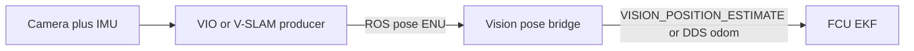

# Conceitos de localização indoor

Fundamentos para voo sem GPS (indoor) com navegação visual externa. Esta página explica
**o que** são SLAM / VIO / V-SLAM e **como** o controlador de voo funde essa pose. Para
comandos do SDK e tabelas de parâmetros do FCU, veja o [README de Localização](../)
(incluindo o [procedimento indoor](../#procedimento-indoor) e a
[origem do EKF](../#origem-do-ekf)). Para o caminho mais antigo com T265, veja
[Legado T265](../legacy/).

> Seções marcadas como *prática Black Bee* são orientações operacionais das nossas voos.
> Todo o resto é baseado na documentação citada dos fabricantes e dos firmwares.

## Por que navegação externa indoor

Sem GNSS, o piloto automático ainda precisa de uma posição local consistente para manter o
Loiter, executar setpoints GUIDED/OFFBOARD ou voar missões autônomas. ArduPilot e PX4
resolvem isso tratando uma estimativa de visão do companion como uma fonte de **navegação
externa** para o EKF (EKF3 / EKF2), o mesmo papel que o GPS desempenha outdoor
([estimação de posição sem GPS do ArduPilot](https://ardupilot.org/dev/docs/mavlink-nongps-position-estimation.html),
[estimação de posição externa do PX4](https://docs.px4.io/main/en/ros/external_position_estimation.html)).

Duas consequências decorrem disso:

1. **Alguém precisa produzir uma pose** — um tracker visual-inercial ou um stack de
   V-SLAM no companion (ou em uma câmera de tracking dedicada).
2. **No ArduPilot, alguém precisa definir a origem do EKF** quando nenhum GPS fornece um
   fix (ou confiar na restauração de origem gravada da 4.7+, ou em
   `set_ekf_origin:=true` no vision feeder); a fusão EV local do PX4 não precisa disso
   para os modos estilo Position. Detalhes:
   [Origem do EKF](../#origem-do-ekf),
   [frames de coordenadas do veículo](../../vehicle/#coordinate-frames).

O módulo de localização do Nectar é a **ponte**: ele pega uma pose ROS do producer de
visão e a entrega ao FCU via MAVROS, MAVLink direto, ou PX4 DDS. Ele não implementa o
SLAM propriamente dito.

## SLAM, VO, VIO, V-SLAM

O [Simultaneous Localization and Mapping (SLAM)](https://en.wikipedia.org/wiki/Simultaneous_localization_and_mapping)
estima conjuntamente a pose do sensor e um mapa do ambiente. Uma revisão amplamente citada
é Cadena et al., *Past, Present, and Future of Simultaneous Localization and Mapping*
(IEEE Transactions on Robotics, 2016)
([IEEE Xplore](https://ieeexplore.ieee.org/document/7747236)).

Distinções úteis para o voo:

| Termo | Significado | Modo de falha típico |
|------|---------|----------------------|
| **Visual odometry (VO)** | Pose incremental apenas a partir do movimento da câmera | Deriva sem limite; sensível a textura e iluminação |
| **Visual-inertial odometry (VIO)** | VO fundida com uma IMU | Ainda deriva, mas com melhor suavidade de curto prazo e observabilidade de escala |
| **V-SLAM** | VO/VIO mais um **mapa** e geralmente **loop closure** | Pode corrigir a deriva ao revisitar lugares conhecidos; a qualidade do mapa depende da cena |

**Odometria** responde "onde estou em relação a onde comecei?" e acumula erro.
**Mapeamento + loop closure** responde "eu já estive aqui antes?" e pode trazer a
estimativa de volta quando os mesmos landmarks são reconhecidos novamente.

O [cuVSLAM](https://nvidia-isaac-ros.github.io/concepts/visual_slam/cuvslam/index.html) da
NVIDIA é uma biblioteca de SLAM visual-inercial estéreo/multi-câmera acelerada por GPU,
exposta em ROS 2 por meio do
[Isaac ROS Visual SLAM](https://nvidia-isaac-ros.github.io/repositories_and_packages/isaac_ros_visual_slam/isaac_ros_visual_slam/index.html).
A Intel RealSense **T265** era uma câmera de tracking dedicada que executava um pipeline
VIO no próprio dispositivo e publicava pose / TF (agora descontinuada; veja
[Legado T265](../legacy/)).

Os overlays de trajetória do RViz (trajetória verde do SLAM vs trajetória roxa de VO no
nosso perfil light) **visualizam a estimativa**. Eles não são uma etapa de calibração. O
movimento de aquecimento que constrói a cobertura do mapa continua útil — isso é prática
operacional, não calibração de extrinsics do sensor. Veja
[Procedimento indoor](../#procedimento-indoor) e [Visualização](../#visualizacao).

## Matemática básica

Apenas um esboço em nível didático. Para um tratamento completo da estimação em
manifolds, veja Barfoot, *State Estimation for Robotics*, ou a revisão de Cadena acima.

### Pose

A pose de um corpo rígido é um elemento do grupo especial euclidiano \(SE(3)\): uma
rotação \(R \in SO(3)\) e uma translação \(t \in \mathbb{R}^3\),

\[
T = \begin{bmatrix} R & t \\ 0^\top & 1 \end{bmatrix} \in SE(3).
\]

A composição \(T_{WA} = T_{WB}\,T_{BA}\) encadeia frames. O núcleo do SDK usa **ENU /
FLU**; o FCU usa **NED / FRD**. Os transportes convertem no wire — veja
[frames de coordenadas do veículo](../../vehicle/#coordinate-frames).

Sistemas de visão costumam publicar a pose em um frame de câmera ou de odometria que ainda
precisa de um offset de frame do corpo (`VISO_POS_*` / `EKF2_EV_POS_*`) para que o EKF
saiba onde a câmera está posicionada em relação ao centro do veículo.

### Front-end e back-end (conceitual)

A maioria dos stacks de SLAM visual compartilha uma estrutura de duas camadas
(Cadena et al.):

- **Front-end** — detecta e casa features (ou usa resíduos fotométricos densos) entre
  frames; associa medições a landmarks; rejeita outliers.
- **Back-end** — estima poses (e opcionalmente posições de landmarks) com um filtro (por
  exemplo, EKF) ou um otimizador (bundle adjustment / pose graph).

O **loop closure** adiciona uma restrição de pose relativa (ou de landmark) entre poses
não consecutivas quando o mesmo lugar é reconhecido. Resolver o grafo então corrige a
deriva acumulada ao longo do caminho. No Isaac ROS Visual SLAM você pode ver essa correção
como a trajetória verde `/visual_slam/tracking/slam_path` se ajustando em relação à
trajetória roxa `/visual_slam/tracking/vo_path`
([Visualização](../#visualizacao)).

### Medição no EKF do controlador de voo

O companion **não** substitui o estimador de atitude/posição do FCU. Ele envia uma pose
externa (e opcionalmente velocidade) que o EKF funde como uma medição. No caminho MAVLink
a mensagem usual é a
[`VISION_POSITION_ESTIMATE`](https://mavlink.io/en/messages/common.html#VISION_POSITION_ESTIMATE)
(#102); a velocidade pode usar a
[`VISION_SPEED_ESTIMATE`](https://mavlink.io/en/messages/common.html#VISION_SPEED_ESTIMATE)
(#103). O ArduPilot documenta a taxa esperada (≥ 4 Hz) e a seleção de fonte em
[Non-GPS Position Estimation](https://ardupilot.org/dev/docs/mavlink-nongps-position-estimation.html).
O PX4 documenta a fusão de external vision e as expectativas de taxa em
[External Position Estimation](https://docs.px4.io/main/en/ros/external_position_estimation.html)
e [VIO](https://docs.px4.io/main/en/computer_vision/visual_inertial_odometry.html).

Conceitualmente, cada pose de visão é uma medição da posição do veículo (e frequentemente
do yaw) no frame local, com um delay e um modelo de ruído:

- **Delay** — a visão chega atrasada em relação à IMU. O firmware expõe isso como
  `VISO_DELAY_MS` (ArduPilot) ou `EKF2_EV_DELAY` (PX4). Um delay errado aparece como
  atraso ou oscilação no Loiter.
- **Confiança / ruído** — quão fortemente o EKF acredita na atualização de visão
  (`VISO_POS_M_NSE`, `VISO_YAW_M_NSE`, PX4 `EKF2_EVP_NOISE` / `EKF2_EVA_NOISE`, etc.).
  Ruído apertado sobre uma estimativa ruim compete com a IMU; ruído solto subutiliza uma
  estimativa boa.
- **Seleção de fonte** — o ArduPilot `EK3_SRC1_* = 6` (ExternalNav) ou os bits de
  `EKF2_EV_CTRL` do PX4 precisam habilitar a fusão, senão as mensagens são recebidas mas
  ignoradas ([EKF source selection](https://ardupilot.org/copter/docs/common-ekf-sources.html)).

As bridges do Nectar enviam **posição por padrão**. A velocidade opcional
(`send_speed:=true`) está documentada em [Velocidade](../#velocidade-opcional): o twist do
cuVSLAM em `/visual_slam/tracking/odometry` é uma diferença finita sobre poses recentes no
wrapper do Isaac ROS, não um estado de velocidade independente — então habilitar tanto a
fusão de posição quanto a de velocidade pode contar em dobro uma medição se o ruído for
configurado de forma agressiva.

### Escala

A VO monocular tem uma escala métrica não observável; o estéreo e a VIO (com excitação da
IMU) tornam a escala observável. Pares infra estéreo da RealSense e pipelines auxiliados
por IMU são as escolhas indoor usuais para um Loiter métrico. Historicamente, as
orientações de bring-up do T265 incluíam levantar o veículo ~1 m antes do voo para que o
movimento vertical exercitasse a escala — veja [Procedimento indoor](../#procedimento-indoor)
e [Legado T265](../legacy/).

## Componentes de VIO / V-SLAM

Um stack indoor funcional precisa de mais do que "uma câmera e ROS":

| Peça | Papel |
|-------|------|
| **Câmera(s)** | Intensidade (e opcionalmente profundidade) para o matching do front-end. Estéreo melhora a escala métrica. |
| **IMU** | Taxa angular e aceleração em alta taxa; preenche lacunas da visão e ajuda na escala. Precisa estar sincronizada no tempo com as imagens. |
| **Extrinsics** | Transforms câmera↔IMU e câmera↔corpo. Offsets errados enviesam a estimativa fundida. |
| **Sincronização de tempo** | Timestamps de imagem e IMU em um relógio comum; um desvio grande parece delay. |
| **Producer** | VIO do dispositivo (T265) ou SLAM onboard (cuVSLAM no Jetson). |
| **Bridge** | Alinhamento de frame, limitação de taxa, entrega por MAVLink/MAVROS/DDS. |
| **EKF do FCU** | Funde a visão com a IMU (e opcionalmente rangefinder / baro para altura). |

### Modos de falha (prática)

Estes aparecem repetidamente na documentação de firmware e em voo:

- **Cenas sem textura ou repetitivas** — paredes em branco, pisos brilhantes, padrões
  repetitivos fortes → fome de features ou matches falsos.
- **Motion blur / movimento abrupto** — translação ou yaw rápidos demais excedem as
  premissas do tracker.
- **Vibração** — faça o soft-mount da câmera; o acoplamento rígido injeta ruído das
  hélices na IMU e na imagem (*prática Black Bee*: espuma e elásticos entre as fixações).
- **Objetos em movimento no campo de visão** — pessoas caminhando perto da lente durante o
  bring-up corrompem o mapa / a pose.
- **Mudanças de iluminação** — variações súbitas de exposição confundem o matching.
- **Rolling shutter** (dependendo do sensor) — rotação rápida distorce a geometria;
  global-shutter ou movimento cuidadoso ajuda.
- **Interferência de emissor / IR** (D435i) — as notas do Isaac ROS RealSense alertam que
  o projetor de IR pode perturbar o matching estéreo se deixado ligado durante o VSLAM;
  siga o [tutorial cuVSLAM da RealSense](https://nvidia-isaac-ros.github.io/concepts/visual_slam/cuvslam/tutorial_realsense.html).

## Como o firmware consome a visão

1. O producer publica a pose (caminho atual do Nectar:
   `/visual_slam/tracking/vo_pose_covariance` a ~90 Hz a partir do Isaac ROS Visual
   SLAM).
2. A bridge converte frames se necessário e encaminha ao FCU
   ([Backends](../#backends)).
3. O EKF funde quando as fontes estão configuradas (e a origem, quando necessário —
   [Configuração do FCU](../#configuracao-do-fcu), [Origem do EKF](../#origem-do-ekf)).
4. Os modos de posição (Loiter, GUIDED, OFFBOARD) usam a pose local fundida — a mesma pose
   que o núcleo do veículo lê para a navegação indoor `PoseSource.VISION`.

Exatamente **um** processo pode alimentar o FCU com visão por vez
([Regra do feeder único](../#regra-do-feeder-unico)).

## Dois sistemas que usamos

| | T265 + VIO no dispositivo | D435i + Isaac ROS cuVSLAM |
|---|---|---|
| **Onde o tracking roda** | ASIC de tracking na câmera | Jetson (container Isaac ROS) |
| **Mapa / loop closure** | VIO do dispositivo (visibilidade externa limitada) | Tópicos explícitos de V-SLAM; loop closure visível nas trajetórias / vis clouds |
| **Companion (Black Bee)** | Raspberry Pi (2023–2024) | Jetson Orin Nano |
| **Link com o FCU** | `vision_to_mavros` → MAVROS → `VISION_POSITION_ESTIMATE` | Backends `vision_pose` do Nectar (MAVROS / MAVLink / DDS) |
| **`VISO_TYPE` do ArduPilot** | `2` (Intel T265) | `1` (MAVLink) |
| **Tópico de pose típico no MAVROS** | `/mavros/vision_pose/pose` | `/mavros/vision_pose/pose_cov` |
| **Status** | Câmera descontinuada; fallback | Caminho indoor atual |

Detalhes sobre o stack antigo: [Legado T265](../legacy/).
Detalhes sobre executar o novo stack: [README de Localização](../).

## Referências

### Levantamentos e teoria

- C. Cadena et al., *Past, Present, and Future of Simultaneous Localization and Mapping*, IEEE TRO, 2016 — [IEEE Xplore](https://ieeexplore.ieee.org/document/7747236)
- T. D. Barfoot, *State Estimation for Robotics* (Cambridge University Press)

### NVIDIA / cuVSLAM

- [Página de conceito do cuVSLAM](https://nvidia-isaac-ros.github.io/concepts/visual_slam/cuvslam/index.html)
- [Isaac ROS Visual SLAM (`isaac_ros_visual_slam`)](https://nvidia-isaac-ros.github.io/repositories_and_packages/isaac_ros_visual_slam/isaac_ros_visual_slam/index.html)
- [Tutorial RealSense + cuVSLAM](https://nvidia-isaac-ros.github.io/concepts/visual_slam/cuvslam/tutorial_realsense.html)
- [Relatório técnico do cuVSLAM (arXiv:2506.04359)](https://arxiv.org/abs/2506.04359)

### Autopilot / MAVLink

- [ArduPilot: Non-GPS Position Estimation](https://ardupilot.org/dev/docs/mavlink-nongps-position-estimation.html)
- [ArduPilot: EKF Source Selection](https://ardupilot.org/copter/docs/common-ekf-sources.html)
- [ArduPilot: ROS VIO tracking camera](https://ardupilot.org/dev/docs/ros-vio-tracking-camera.html)
- [ArduPilot: Intel RealSense T265](https://ardupilot.org/copter/docs/common-vio-tracking-camera.html)
- [PX4: External Position Estimation](https://docs.px4.io/main/en/ros/external_position_estimation.html)
- [PX4: Visual Inertial Odometry (VIO)](https://docs.px4.io/main/en/computer_vision/visual_inertial_odometry.html)
- [Mensagem MAVLink `VISION_POSITION_ESTIMATE`](https://mavlink.io/en/messages/common.html#VISION_POSITION_ESTIMATE)

### Comunidade / bridge legado

- LuckyBird (Thien Nguyen), série T265 no Discourse do ArduPilot — [parte 1](https://discuss.ardupilot.org/t/integration-of-ardupilot-and-vio-tracking-camera-part-1-getting-started-with-the-intel-realsense-t265-on-rasberry-pi-3b/43162), [parte 2](https://discuss.ardupilot.org/t/integration-of-ardupilot-and-vio-tracking-camera-part-2-complete-installation-and-indoor-non-gps-flights/43405)
- [thien94/vision_to_mavros](https://github.com/thien94/vision_to_mavros) (ROS 1) e [Black-Bee-Drones/vision_to_mavros](https://github.com/Black-Bee-Drones/vision_to_mavros) (adaptação para ROS 2)
