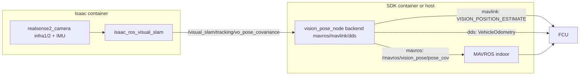

# Localização (control/localization)

## Índice da documentação

| Doc | Escopo |
|-----|-------|
| Este README | Arquitetura, Executar, configuração do FCU, origem do EKF, SOP indoor, SITL, RViz |
| [concepts.md](concepts/) | Teoria de SLAM / VIO / V-SLAM, matemática, fusão com o FCU, T265 vs cuVSLAM |
| [legacy.md](legacy/) | Histórico e versões do T265 + `vision_to_mavros` (2023–2024) |

## Papel

Integração de navegação externa (external-nav) para voo sem GPS (indoor). Alimenta o FCU
com uma pose de Visual SLAM para que seu EKF (ArduPilot EKF3 / PX4 EKF2) possa estimar a
posição sem GPS.

Vive sob `control` porque faz a ponte entre o producer de VSLAM e os transportes MAVROS e
MAVLink. O pipeline é dividido em um **producer** (RealSense + Isaac ROS Visual SLAM,
executado no container Isaac) e um **consumer** (uma bridge de vision-pose que encaminha a
pose ao FCU, executada do lado do SDK). Eles se comunicam por host networking com um
`ROS_DOMAIN_ID` compartilhado.

## Topologia



## Componentes

| Parte | Caminho | Papel |
|------|------|------|
| Launch do producer | `nectar/launch/isaac_vslam_realsense.launch.py` | RealSense + Visual SLAM (container Isaac) |
| Launch do consumer | `nectar/launch/vision_pose.launch.py` | MAVROS (opcional) + bridge de vision-pose |
| Relay MAVROS | `control/localization/vision_pose_bridge.py` (`MavrosVisionRelay`) | republica a pose em `/mavros/vision_pose/pose_cov` |
| Bridge MAVLink | reaproveitado de `nectar.control.mavlink.VisionPoseBridge` | envia `VISION_POSITION_ESTIMATE` |
| Bridge DDS | `control/px4/vision_bridge.py` (`Px4VisionOdometryBridge`) | publica `px4_msgs/VehicleOdometry` em `/fmu/in/vehicle_visual_odometry` |
| Velocidade (opcional) | `MavrosVisionSpeedRelay`, `nectar.control.mavlink.VisionSpeedBridge`, `speed_topic` na bridge DDS | veja [Velocidade](#velocidade-opcional) |
| Conversões de frame | `control/localization/frames.py` | twist do corpo -> mundo -> NED |
| Node | `control/localization/nodes/vision_pose_node.py` | seleciona o backend, conecta a bridge |
| Parâmetros VSLAM | `control/localization/config/vslam_realsense.yaml` | ajuste (tuning) de RealSense + Visual SLAM |
| Config MAVROS | `control/mavros/config/indoor_mavros.yaml`, `indoor_pluginlists.yaml` | perfil MAVROS indoor |

## Executar

> **Pré-requisito:** producer e consumer compartilham o `ROS_DOMAIN_ID` (padrão `14`, veja
> [`scripts/lib/config.sh`](https://github.com/Black-Bee-Drones/nectar-sdk/blob/main/scripts/lib/config.sh)).
> Jetson, computador de bordo/host e o laptop opcional (RViz) devem usar o mesmo domínio.

### 1. Produtor (container Isaac)

```bash
make isaac-run          # or: ./docker/isaac_vslam/run_docker.sh

# inside:

nectar-vslam            # alias → launch no source tree montado do workspace
```

O `nectar-vslam` encaminha argumentos extras (`"$@"`). Todo o ajuste de RealSense +
Visual SLAM fica em um único YAML (não em `/opt/ros/.../isaac_ros_visual_slam/`):

| Onde | Caminho |
|------|---------|
| Host | `nectar/nectar/control/localization/config/vslam_realsense.yaml` |
| Container Isaac | `/workspaces/isaac_ros-dev/src/nectar-sdk/nectar/nectar/control/localization/config/vslam_realsense.yaml` |

O container Isaac monta o `ros2_ws` inteiro, então edições no host aparecem ao vivo —
reinicie o `nectar-vslam` depois de mudar. Arquivo alternativo opcional:

```bash
nectar-vslam params_file:=/path/to/other.yaml
```

Padrões: infra @ `640x360x90` + IMU para o cuVSLAM (emitter desligado), RGB ligado
com o profile padrão do realsense (`0,0,0` → escolha do device, frequentemente
`1280x720x30` no D435i) para detecção (`/camera/color/...`), depth desligado. O SLAM remapeia
**apenas infra**; assine a color para modelos de IA. Confirme que a RealSense é
enumerada e que os tópicos do VSLAM publicam. Notas do Docker:
[Isaac ROS Visual SLAM (Jetson)](../../../setup/docker/#isaac-ros-visual-slam-jetson).

### 2. Consumidor — feeder de vision (manter em execução) {#2-consumidor-feeder-de-vision-manter-em-execucao}

| Backend | Comando |
|---------|---------|
| MAVROS | `ros2 launch nectar vision_pose.launch.py backend:=mavros fcu_url:=…` |
| MAVLink direto | `ros2 launch nectar vision_pose.launch.py backend:=mavlink mavlink_url:=…` |
| PX4 DDS | `ros2 launch nectar vision_pose.launch.py backend:=dds` |

Ou: `make driver DRONE=mavlink ENV=indoor`. Verifique a pose fundida
([Procedimento indoor](#procedimento-indoor)) e só então inicie a missão em um endpoint
MAVLink **diferente** do feeder.

`mavlink_url` / `fcu_url` são de formato livre — ajuste à sua linha serial ou ao fan-out do
roteador. Layout MAVProxy de exemplo no Jetson da Black Bee (GCS / missão / feeder):
`14550` / `14551` / `14552`.

Respeite a [regra do feeder único](#regra-do-feeder-unico): não inicie também um segundo
feeder de vision no mesmo link do FCU a partir de uma missão.

### 3. Missão

`PoseSource.VISION` com `auto_vision_feed=False` (padrão): a missão **assina** o tópico do
VSLAM para navegação do companion e **não** envia `VISION_*`. Ative `auto_vision_feed=True`
para um feed em processo único (nesse caso, não execute também o feeder standalone de
mavlink no mesmo endpoint). Velocidade opcional nesse caminho: `vision_send_speed=True`.

## Procedimento indoor

Checklist do dia de voo para o stack **atual** (D435i + cuVSLAM). Os comandos e as tabelas
do FCU estão acima e em [Configuração do FCU](#configuracao-do-fcu); esta seção trata
apenas de ordem e prática.

### Montagem (*prática Black Bee*)

VIO / V-SLAM assume que a câmera e a IMU se movem junto com a aeronave. Vibração ou uma
fixação solta parece movimento para o estimador.

- Alinhe o eixo óptico da D435i com as extrinsics configuradas (`VISO_POS_*` / frames do
  launch do Isaac).
- Fixação soft-mount: elásticos e espuma entre a câmera e o frame; espuma no case do
  sensor onde ajudar sem bloquear as lentes ou o USB.
- Depois de transportar ou remontar, reinicie o producer + a bridge e refaça as
  verificações abaixo — não reaproveite a sessão de mapa do dia anterior.

### Bring-up

1. **Produtor** — [Executar §1](#1-produtor-container-isaac).
2. **Consumidor** — [Executar §2](#2-consumidor-feeder-de-vision-manter-em-execucao).
3. **Verificação do pipeline** — mova a aeronave manualmente; a pose local fundida do FCU
   precisa mudar (`vision_fcu_check.py` e/ou o MAVLink Inspector da GCS). RViz opcional:
   [Visualização](#visualizacao).
4. **Origem do EKF** — apenas quando necessário; veja [Origem do EKF](#origem-do-ekf). Flag
   opcional do feeder: `set_ekf_origin:=true`.
5. **Aquecimento (warm-up)** — caminhe com o veículo lentamente pelo volume onde ele vai
   voar (quadrado / círculo / volta pela arena). Movimento suave; evite yaw abrupto e
   pessoas cruzando o FOV ([modos de falha](concepts/#modos-de-falha-pratica)). Isso
   constrói a cobertura do mapa e permite abortar no chão se o tracking parecer ruim.
6. **Sanidade de escala / vertical** — levante e translade manualmente; X/Y/Z fundidos
   devem se mover aproximadamente a distância certa. (O bring-up do T265 historicamente
   pedia um levantamento de ~1 m para a escala vertical — [Legado](legacy/); com D435i +
   cuVSLAM trate isso como uma verificação, não uma calibração oculta.)
7. **Primeiro voo** — Stabilize ou AltHold → movimento suave observando a pose fundida →
   Loiter somente quando o tracking parecer estável (pronto para reverter imediatamente).
   Depois, missão / perfis mais exigentes. Padrão do LuckyBird
   [Discourse parte 2](https://discuss.ardupilot.org/t/integration-of-ardupilot-and-vio-tracking-camera-part-2-complete-installation-and-indoor-non-gps-flights/43405).

Após muito tempo ligado, mudanças de fixação/USB/parâmetros, ou avisos estranhos na GCS:
reinicie o producer + a bridge (e reinicie o FCU depois de mudanças de parâmetro).

### Triagem

| Sintoma | Causa provável | O que tentar |
|---------|--------------|-------------|
| Nenhum tópico VSLAM | Câmera / Isaac / USB | `rs-enumerate-devices` no container Isaac; USB3; reinicie o `nectar-vslam` |
| Color OK, pose parada / infra cai | Largura de banda USB, launch errado, cuVSLAM obsoleto | `ros2 topic hz` em `/camera/infra1/image_rect_raw` e `/visual_slam/tracking/vo_pose_covariance`; use o YAML do Nectar (não `/opt/ros/...`); USB3; `make isaac-stop` e reinicie |
| Edição do YAML ignorada | Arquivo errado ou install antigo | Edite o YAML montado do Nectar acima; não edite o launch empacotado da NVIDIA em `/opt/ros` |
| VSLAM OK, pose do FCU congelada | Bridge, domínio ou feeder duplicado | `ROS_DOMAIN_ID` compartilhado; reinicie o consumer; [regra do feeder único](#regra-do-feeder-unico) |
| Vision no ROS, EKF não usa | Parâmetros / origem | [Configuração do FCU](#configuracao-do-fcu), [Origem do EKF](#origem-do-ekf); reinicie após mudar parâmetros |
| Caminho instável / divergindo | Vibração, textura, movimento abrupto, sessão obsoleta | Soft-mount; aquecimento mais lento; reinicie o producer |
| Loiter oscila / desloca | Delay / ruído; velocidade contada em dobro | Ajuste `VISO_DELAY_MS` / ruído; deixe `send_speed` desligado a menos que os logs mostrem benefício |
| Flags estranhas na GCS após muito tempo ligado | Nós obsoletos / estado do EKF | Reinicie FCU + producer + bridge |

## Velocidade (opcional)

Por padrão, os feeders enviam **apenas posição**. `send_speed:=true` em
`vision_pose.launch.py` (ou `vision_send_speed=True` com `auto_vision_feed`) também envia a
velocidade do VSLAM; a pose continua sendo enviada normalmente. O EKF3 não inicializa
apenas com velocidade ([ardupilot#23485](https://github.com/ArduPilot/ardupilot/issues/23485)).

| Backend | Portador da velocidade |
|---------|------------------|
| `mavros` | `geometry_msgs/TwistStamped` em `/mavros/vision_speed/speed_twist`; o plugin [`vision_speed`](https://github.com/mavlink/mavros/blob/ros2/mavros_extras/src/plugins/vision_speed_estimate.cpp) converte ENU -> NED e envia [`VISION_SPEED_ESTIMATE`](https://mavlink.io/en/messages/common.html#VISION_SPEED_ESTIMATE) |
| `mavlink` | `VISION_SPEED_ESTIMATE` (#103) pelo mesmo link pymavlink usado pela pose |
| `dds` | `velocity` + `velocity_frame = VELOCITY_FRAME_NED` na `VehicleOdometry` já publicada para a pose |

```bash
ros2 launch nectar vision_pose.launch.py backend:=mavros send_speed:=true
ros2 launch nectar vision_pose.launch.py backend:=mavlink send_speed:=true mavlink_url:=…
```

Argumentos: `speed_topic` (padrão `/visual_slam/tracking/odometry`); o node também tem
`speed_output_topic`, `speed_timeout_s`.

### O que o cuVSLAM realmente fornece

O cuVSLAM estima **pose e covariância da pose**; ele não tem estado de velocidade. O twist
em `/visual_slam/tracking/odometry` é produzido pelo wrapper ROS como uma diferença finita
sobre as últimas 10 poses,
`dp = pose(t0)⁻¹ · pose(t1)`
([`PoseCache::GetVelocity`](https://github.com/NVIDIA-ISAAC-ROS/isaac_ros_visual_slam/blob/main/isaac_ros_visual_slam/src/impl/pose_cache.cpp)).
Portanto, ele é derivado da mesma pose que já enviamos, não é uma medição independente. A
aceleração é uma *entrada* (IMU da RealSense, `tracking_mode:=1`), não uma saída.

Essa forma de `dp` torna o twist **no frame do corpo** (`child_frame_id`, FLU), como o
`nav_msgs/Odometry` exige. O `VISION_SPEED_ESTIMATE` não carrega atitude, então o FCU não
pode rotacioná-lo: as bridges rotacionam de corpo para mundo usando a atitude da mesma
amostra de odometria antes da troca ENU -> NED (`frames.py`). O `ODOMETRY` é o
contraexemplo — ele carrega o quaternion e o próprio ArduPilot rotaciona a velocidade
body-FRD.

### Configuração do FCU para velocidade

O ArduPilot lista a velocidade como opcional, junto com a posição
([Non-GPS Position Estimation](https://ardupilot.org/dev/docs/mavlink-nongps-position-estimation.html)).
Ela só é fundida depois que a fonte é selecionada:

- `EK3_SRC1_VELXY = 6`, `EK3_SRC1_VELZ = 6` (ExternalNav). Com `0` as mensagens são
  recebidas e logadas, mas não fundidas.
- `VISO_VEL_M_NSE` define o ruído de medição da velocidade. O ArduPilot **ignora** o campo
  de covariância do `VISION_SPEED_ESTIMATE` e sempre usa este parâmetro
  ([`AP_VisualOdom_MAV.cpp`](https://github.com/ArduPilot/ardupilot/blob/master/libraries/AP_VisualOdom/AP_VisualOdom_MAV.cpp)),
  então é o único ajuste para o quanto o EKF confia nessa entrada. Como o twist é derivado
  da posição que já enviamos, começar de forma conservadora (o padrão de `0.1` m/s) evita
  contar em dobro uma única medição como se fossem duas independentes.
- PX4: o bit 2 de `EKF2_EV_CTRL` habilita a fusão de velocidade 3D.

Verifique as inovações de `XKFS`/`XKF3` nos logs antes e depois de habilitar.

## Configuração do FCU {#configuracao-do-fcu}

A bridge apenas entrega a pose — o estimador do FCU ainda precisa ser configurado para
fundi-la. **ArduPilot (EKF3) e PX4 (EKF2) usam parâmetros diferentes e uma taxa mínima
diferente**. Os dois backends MAVLink enviam o
[`VISION_POSITION_ESTIMATE`](https://mavlink.io/en/messages/common.html#VISION_POSITION_ESTIMATE)
(#102); o EKF o funde uma vez configurado. As regras de origem variam por firmware — veja
[Origem do EKF](#origem-do-ekf).

> Nossos voos indoor em **hardware** até hoje são em **ArduPilot 4.6.x / 4.8-dev**. O
> conjunto de PX4 abaixo é baseado na documentação do PX4 e corresponde ao pipeline de
> referência (o mesmo relay MAVROS) usado pelo
> [tutorial VSLAM-UAV](https://www.andrewbernas.com/docs/tutorials/robots/vslam/setup) no
> PX4 v1.15.4. O **SITL** já exercita esse caminho (`ENV=indoor` → `indoor_room_px4` +
> `gz_vision_source`); valide no seu Pixhawk antes de usar em competição.

### ArduPilot (EKF3)

| Parâmetro | Valor | Finalidade |
|-----------|-------|---------|
| `VISO_TYPE` | `1` (MAVLink) | Habilita o backend external-nav que consome `VISION_POSITION_ESTIMATE` de um companion (o caminho T265 usa `2`, veja [Notas de hardware](#notas-de-hardware)) |
| `EK3_SRC1_POSXY` | `6` (ExternalNav) | Posição horizontal a partir do VSLAM |
| `EK3_SRC1_VELXY` | `6` ou `0` | Velocidade horizontal — `6` apenas com `send_speed:=true`, veja [Velocidade](#velocidade-opcional) |
| `EK3_SRC1_POSZ` | `6` (ExternalNav) | Altura — veja [Fonte de altura](#fonte-de-altura) |
| `EK3_SRC1_VELZ` | `6` ou `0` | Velocidade vertical, mesma condição de `VELXY` |
| `EK3_SRC1_YAW` | `6` (ExternalNav) | Yaw a partir do VSLAM (com `COMPASS_USE=0`), ou `1` para manter a bússola |
| `VISO_POS_X/Y/Z` | offset da câmera (m) | Posição da câmera no frame do corpo |
| `GPS1_TYPE` | `0` | Desabilita o GPS indoor (renomeado de `GPS_TYPE` a partir da 4.5+) |

Taxa ≥ 4 Hz. Ajuste (tuning): `VISO_POS_M_NSE`, `VISO_YAW_M_NSE`, `VISO_DELAY_MS`,
`VISO_QUAL_MIN`. Referências:
[EKF source selection](https://ardupilot.org/copter/docs/common-ekf-sources.html),
[Non-GPS position estimation](https://ardupilot.org/dev/docs/mavlink-nongps-position-estimation.html),
[`VISO_TYPE`](https://github.com/ArduPilot/ardupilot/blob/master/libraries/AP_VisualOdom/AP_VisualOdom.cpp),
[`EK3_SRC*`](https://github.com/ArduPilot/ardupilot/blob/master/libraries/AP_NavEKF/AP_NavEKF_Source.cpp).

### PX4 (EKF2)

| Parâmetro | Valor | Finalidade |
|-----------|-------|---------|
| `EKF2_EV_CTRL` | bitmask — bit0 h-pos, bit1 v-pos, bit2 vel 3D, bit3 yaw (`15` = todos) | Habilita a fusão de external-vision. O PX4 lançado (≥1.14) já vem com `15`, então a fusão inicia automaticamente quando os dados chegam — **verifique no seu firmware** |
| `EKF2_HGT_REF` | `3` (Vision) | Referência de altura — veja [Fonte de altura](#fonte-de-altura) |
| `EKF2_EV_DELAY` | ~`50` ms | Delay do EV em relação à IMU; ajuste a partir dos logs |
| `EKF2_EV_POS_X/Y/Z` | offset da câmera (m) | Posição da câmera no frame do corpo |
| `EKF2_GPS_CTRL` | `0` | Desabilita o GNSS indoor |
| `EKF2_MAG_TYPE` | `None` | Só se estiver usando yaw da visão |

Taxa de 30–50 Hz — **o PX4 rejeita external vision quando a taxa é baixa demais** (muito
mais estrito que o ArduPilot); o cuVSLAM a ~90 Hz atende esse requisito. Ajuste:
`EKF2_EV_NOISE_MD`, `EKF2_EVP_NOISE`, `EKF2_EVA_NOISE`, `EKF2_EV_QMIN`. Referências:
[External position estimation](https://docs.px4.io/main/en/ros/external_position_estimation.html),
[VIO](https://docs.px4.io/main/en/computer_vision/visual_inertial_odometry.html),
[EKF2 tuning](https://docs.px4.io/main/en/advanced_config/tuning_the_ecl_ekf.html),
[`params_external_vision.yaml`](https://github.com/PX4/PX4-Autopilot/blob/main/src/modules/ekf2/params_external_vision.yaml),
[padrão de `EKF2_EV_CTRL` (#24298)](https://github.com/PX4/PX4-Autopilot/issues/24298).

Os backends `mavros`/`mavlink` entregam essa estimativa como `VISION_POSITION_ESTIMATE`; o
backend nativo `dds` publica `px4_msgs/VehicleOdometry` em
`/fmu/in/vehicle_visual_odometry` no lugar (mesmos parâmetros do EKF2, sem MAVROS/MAVLink).
Veja [Backends](#backends).

### Origem do EKF

A **origem** do EKF é o lat/lon/alt global que define o NED local `(0,0,0)`. Ela **não é**
o Home (ponto de retorno do RTL) e **não é** a origem do mapa do VSLAM. O Home permanece
com o FCU: o ArduPilot o inicializa depois da origem (e novamente ao armar, para o RTL do
Copter). A bridge nunca envia `SET_HOME_POSITION`.

**Opt-in a partir do vision feeder** (desligado por padrão):

```bash
ros2 launch nectar vision_pose.launch.py backend:=mavlink set_ekf_origin:=true

# optional overrides:

#   origin_lat:=… origin_lon:=… origin_alt_m:=… origin_timeout_s:=2.0

```

Os padrões são o lat/lon do laboratório da Black Bee (`-22.41434308754571`,
`-45.44843145453864`) com `origin_alt_m:=0.0` (defina a AMSL do local se a altura no mapa
da GCS precisar ficar correta). Se `GPS_GLOBAL_ORIGIN` já estiver presente, o envio é
ignorado. Suportado em `mavros`, `mavlink` e `dds`.

Alternativas manuais: *Set EKF Origin Here* do Mission Planner, `SET_GPS_GLOBAL_ORIGIN`, ou
[`ahrs-set-origin.lua`](https://github.com/ArduPilot/ardupilot/blob/master/libraries/AP_Scripting/examples/ahrs-set-origin.lua).

**ArduPilot**
([Non-GPS Position Estimation](https://ardupilot.org/dev/docs/mavlink-nongps-position-estimation.html),
[Home / origin](https://ardupilot.org/dev/docs/mavlink-get-set-home-and-origin.html)):

- Se **nenhum GPS** estiver fornecendo fix, defina a origem antes que o EKF possa estimar
  a posição (necessário para Loiter / Guided / Auto e para publicar a pose local).
- Os valores de lat/lon só precisam ser um WGS84 válido; são uma referência, não um
  levantamento topográfico.
- Uma vez definida, a origem não pode ser movida até o próximo reboot.
- Se um **GPS estiver presente e obtiver fix**, o ArduPilot normalmente define a origem
  por conta própria ([Non-GPS Navigation](https://ardupilot.org/copter/docs/common-non-gps-navigation-landing-page.html)).
- A partir da **4.7+**, `AHRS_OPTIONS` bit 3 (RecordOrigin) + bit 4
  (UseRecordedOriginForNonGPS) podem salvar/restaurar a origem entre ciclos de energia,
  então não é preciso defini-la a cada boot.
- O ícone do veículo no mapa do Mission Planner aparece quando existe uma origem ([wiki do
  T265](https://ardupilot.org/copter/docs/common-vio-tracking-camera.html), LuckyBird);
  isso é visualização da GCS, não uma etapa de calibração separada.

Stabilize / AltHold não precisam de uma estimativa de posição. Se você "simplesmente
rodar" sem definir a origem e o Loiter ainda funcionar, a origem já estava definida (fix de
GPS, origem gravada na 4.7+, ou uma definição anterior via GCS/script/`set_ekf_origin`).

**PX4**
([External position estimation](https://docs.px4.io/main/en/ros/external_position_estimation.html)):

- A fusão EV local (Position / OFFBOARD local) usa o frame local vindo da visão; o guia de
  setup do VSLAM-UAV não exige definir uma origem para esse caminho.
- `SET_GPS_GLOBAL_ORIGIN` serve para construir uma estimativa **global** a partir da pose
  local, para que **modos automáticos que precisam de posição global** (Mission, Return,
  …) possam rodar indoor (`set_ekf_origin:=true` nos backends `dds` / `mavros` cobre esse
  caso).

**Nota histórica:** o caminho ROS do LuckyBird e o `set_origin.py` / clique no MP eram
explícitos. O `t265_to_mavlink.py` upstream pode opcionalmente enviar
`SET_GPS_GLOBAL_ORIGIN`. O `vision_to_mavros` (ROS 2) da Black Bee apenas republica a pose.
Veja [Legado](legacy/).

### Fonte de altura

Não usamos o **barômetro** indoor — ele deriva perto do solo e no fluxo de ar das hélices.
Escolhemos o POSZ entre duas fontes e mantemos o resto do conjunto (POSXY / VELXY / YAW) na
visão:

- **Vision** (`EK3_SRC1_POSZ=6` / `EKF2_HGT_REF=Vision`): a altitude é relativa à origem
  do VSLAM, **sem terrain following** — o drone mantém uma altura constante ao cruzar
  plataformas ou obstáculos na arena. Este é o nosso padrão e tem sido útil em missões com
  plataformas elevadas.
- **Rangefinder voltado para baixo** (`EK3_SRC1_POSZ=2` / `EKF2_HGT_REF=Range` +
  `EKF2_RNG_CTRL`): a altitude **acompanha o terreno**. O ArduPilot avisa que isso é "só
  apropriado ... onde o piso é plano, sem obstruções no solo"
  ([EKF sources](https://ardupilot.org/copter/docs/common-ekf-sources.html)); o PX4
  observa que "a origem NED local vai subir e descer com o nível do solo"
  ([EKF2 tuning](https://docs.px4.io/main/en/advanced_config/tuning_the_ecl_ekf.html)).
  Sobre obstáculos fixos o veículo então sobe para compensar, então mascaramos as quedas
  abruptas upstream com o [`ObstacleMaskFilter`](../../sensors/#obstaclemaskfilter) antes
  que o FCU chegue a vê-las.

## Backends

- `mavros`: o `MavrosVisionRelay` republica o `PoseWithCovarianceStamped` do VSLAM (ENU) em
  `/mavros/vision_pose/pose_cov`; o MAVROS converte para NED para o FCU.
- `mavlink`: `nectar.control.mavlink.VisionPoseBridge` converte ENU->NED e envia
  `VISION_POSITION_ESTIMATE` por um link pymavlink dedicado.
- `dds`: `nectar.control.px4.Px4VisionOdometryBridge` converte ENU->NED e publica
  `px4_msgs/VehicleOdometry` em `/fmu/in/vehicle_visual_odometry` (uXRCE-DDS nativo do
  PX4). Precisa de um `MicroXRCEAgent` em execução e de `px4_msgs`; defina `px4_namespace`
  para corresponder a um cliente com namespace.

Cada backend ganha um caminho de velocidade com `send_speed:=true`
([Velocidade](#velocidade-opcional)); o caminho de pose acima não é afetado.

## Regra do feeder único {#regra-do-feeder-unico}

Exatamente **um** processo pode enviar vision externa para o FCU:

| Transporte | Feeder padrão | Papel na missão |
|-----------|----------------|--------------|
| MAVROS | `vision_pose_node backend:=mavros` | Assina `/mavros/vision_pose/…` |
| pymavlink direto | `vision_pose_node backend:=mavlink` standalone em um endpoint dedicado | `PoseSource.VISION`, `auto_vision_feed=False` (somente assinatura) |
| uXRCE-DDS | `vision_pose_node backend:=dds` | Lê a pose fundida dos tópicos DDS do PX4 |

Opt-in `auto_vision_feed=True`: a missão envia `VISION_*` (opcional `vision_send_speed`).
Nunca execute também o feeder standalone de mavlink no mesmo endpoint.

## SITL

Gazebo indoor: ground-truth → tópicos canônicos do VSLAM → mesmos backends → EKF3 / EKF2.

| Firmware | Terminal 1 | Terminal 2 (`sim-bridge`) | Feeder | Missão |
|----------|------------|---------------------------|--------|---------|
| ArduPilot `PROTOCOL=mavlink` (padrão) | `sim-start … ENV=indoor` | Gazebo + `vision_pose_node` no SERIAL0 (`tcp:…:5760`) | node mavlink | SERIAL1 (`tcp:…:5762`) |
| ArduPilot `PROTOCOL=mavros` | igual | Gazebo + MAVROS + `vision_pose_node` | node mavros | SERIAL0 |
| PX4 `mavros` / `dds` | `sim-start FIRMWARE=px4 ENV=indoor` | producer + consumer | node mavros / dds | preset correspondente |
| PX4 `PROTOCOL=mavlink` | igual | apenas producer (UDP offboard único) | missão `auto_vision_feed=True` | `PX4_MAVLINK_SITL_VISION_CONFIG` |

Arena compartilhada: o ArduPilot compõe `nectar_indoor`; o PX4 usa `indoor_room_px4` +
`x500_nectar` (PosePublisher ~50 Hz). Parâmetros: ArduPilot `indoor.parm`; PX4
`px4_indoor.env`. O `x500_vision` padrão do PX4 só via override explícito. Matriz completa:
[README de simulação](../../simulation/).

Para exercitar a origem opcional do EKF no ArduPilot indoor:

```bash
make sim-start  FIRMWARE=ardupilot ENV=indoor
make sim-bridge FIRMWARE=ardupilot ENV=indoor ARGS='set_ekf_origin:=true'

# vision_pose_node log: "EKF origin: sent …" or "already set, skip send"

```

Observação: o SITL padrão do ArduPilot ainda fixa uma origem SIM home (Camberra) mesmo com
`GPS1_TYPE=0`, então uma sobrescrita tardia geralmente não se mantém — use a linha de log
para confirmar o caminho do feeder; valide lat/lon em hardware sem GPS (ou depois de um FCU
limpo, sem origem).

```bash
ros2 topic hz /visual_slam/tracking/vo_pose_covariance   # ~50 Hz
ros2 topic echo /mavros/vision_pose/pose_cov --once        # PROTOCOL=mavros
```

## Visualização {#visualizacao}

Os overlays de trajetória mostram a **estimativa de SLAM / odometria** para que você possa
avaliar a qualidade do tracking e o loop closure — eles não são uma etapa de calibração.
Use-os no [bring-up](#bring-up) para verificar: a trajetória acompanha o movimento manual,
o ruído é aceitável para o Loiter, e a trajetória verde do SLAM se ajusta ao revisitar um
local (loop closure).

A NVIDIA recomenda rodar o RViz em um PC remoto, não no Jetson
([tutorial RealSense](https://nvidia-isaac-ros.github.io/concepts/visual_slam/cuvslam/tutorial_realsense.html)).

Dois perfis (`rviz/vslam_light.rviz`, `rviz/vslam_full.rviz`):

| Perfil | Mostra | Custo no producer |
|---------|-------|---------------|
| `light` (padrão) | TF + odometria + trajetória SLAM (verde) + trajetória VO (roxa) | nenhum (os tópicos de tracking são sempre publicados) |
| `full` | light + nuvens de landmarks / loop-closure + pose graph | ative `enable_slam_visualization` (e landmarks / observations) no YAML do VSLAM |

O perfil `light` desenha duas trajetórias sempre publicadas: a trajetória **verde** do SLAM
(`/visual_slam/tracking/slam_path`, corrigida por loop closure) e a trajetória **roxa** de
VO (`/visual_slam/tracking/vo_path`, odometria bruta). Quando um loop se fecha, a
trajetória verde se ajusta em relação à roxa — esse é o loop closure, visível sem custo no
producer. A nuvem de pontos roxa literal do loop closure vive no `full` (é um tópico
`/visual_slam/vis/*`, publicado apenas quando as flags de visualização estão ativas em
`vslam_realsense.yaml`).

As duas trajetórias `light` são mostradas como um **buffer deslizante** (últimos 15 s por
padrão) para que a janela não se preencha com a trajetória inteira. O `vslam_rviz.launch.py`
executa um relay `path_window_node` junto com o RViz (sem custo no Jetson) que republica
`/visual_slam/tracking/{slam,vo}_path` recortado para os últimos `window_seconds` em
tópicos `*_windowed`, que o perfil light assina. Defina `window_seconds` como `0` para o
histórico completo.

**Laptop (nectar buildado)**:

```bash
ros2 launch nectar vslam_rviz.launch.py profile:=light            # or profile:=full
ros2 launch nectar vslam_rviz.launch.py window_seconds:=30        # longer buffer
```

**Laptop (apenas o repo, sem build)** — execute o relay também, senão as trajetórias light
ficam vazias:

```bash
ros2 run nectar path_window_node.py    # if built; otherwise: python3 .../nodes/path_window_node.py
rviz2 -d src/nectar-sdk/nectar/nectar/control/localization/rviz/vslam_light.rviz
```

O perfil `full` exige que o producer publique os tópicos `/visual_slam/vis/*`, que ficam
desligados por padrão para manter o Jetson leve. Em `vslam_realsense.yaml`, defina
`enable_slam_visualization`, `enable_landmarks_view` e `enable_observations_view` como
`true` e reinicie o `nectar-vslam`.

## Notas de hardware

**Atual:** Intel RealSense **D435i** + **Isaac ROS Visual SLAM (cuVSLAM)** em um Jetson
Orin Nano; pose a ~90 Hz. Producer / consumer: [Executar](#executar). Dia do voo:
[Procedimento indoor](#procedimento-indoor).

**Legado / fallback:** RealSense **T265** +
[`vision_to_mavros`](https://github.com/Black-Bee-Drones/vision_to_mavros) (`VISO_TYPE=2`).
Histórico completo, versões e bring-up: [Legado T265](legacy/). Comparação conceitual:
[Conceitos](concepts/#dois-sistemas-que-usamos).

## Referências

Teoria do módulo e uma bibliografia mais completa:
[Conceitos → Referências](concepts/#referencias).

- [Isaac ROS Visual SLAM (isaac_ros_visual_slam)](https://nvidia-isaac-ros.github.io/repositories_and_packages/isaac_ros_visual_slam/isaac_ros_visual_slam/index.html)
- [cuVSLAM](https://nvidia-isaac-ros.github.io/concepts/visual_slam/cuvslam/index.html)
- [Isaac ROS Development Environment](https://nvidia-isaac-ros.github.io/v/release-3.2/concepts/docker_devenv/index.html)
- [ArduPilot: Non-GPS Position Estimation](https://ardupilot.org/dev/docs/mavlink-nongps-position-estimation.html)
- [ArduPilot: Setting Home and/or EKF origin](https://ardupilot.org/dev/docs/mavlink-get-set-home-and-origin.html)
- [ArduPilot: Non-GPS Navigation](https://ardupilot.org/copter/docs/common-non-gps-navigation-landing-page.html)
- [PX4: External Position Estimation](https://docs.px4.io/main/en/ros/external_position_estimation.html)
