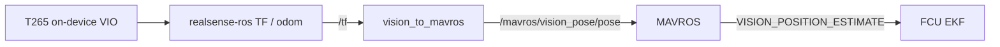

# Legado: T265 e vision_to_mavros

Caminho indoor histórico que a Black Bee voou antes da D435i + Isaac ROS Visual SLAM:
câmera de tracking Intel RealSense **T265**, computador de bordo (tipicamente um
Raspberry Pi), MAVROS, e [`vision_to_mavros`](https://github.com/Black-Bee-Drones/vision_to_mavros).

Esta página serve para entender logs mais antigos, hardware de fallback, e como a bridge
atual do Nectar evoluiu. Para o stack **atual**, use o
[README de Localização](../) ([procedimento indoor](../#procedimento-indoor),
[origem do EKF](../#origem-do-ekf)). Conceitos: [Conceitos](../concepts/).

## Linha do tempo

| Período | Stack | Notas |
|--------|-------|-------|
| **2023** | ROS 1, RPi, T265, `vision_to_mavros` (thien94), ArduPilot | Primeiro drone de competição indoor; IMAV 2023 indoor (3º lugar). |
| **2024** | ROS 2 Humble, RPi, T265, port [`vision_to_mavros`](https://github.com/Black-Bee-Drones/vision_to_mavros) da Black Bee | Mesmo fluxo de dados; launches ROS 2 (`t265_all_nodes_launch.py`). |
| **Depois de 2024** | Jetson Orin Nano, D435i, Isaac ROS cuVSLAM, `vision_pose` do Nectar | T265 descontinuada; sensível a vibração e ao ambiente; um acidente que trincou a tampa da lente deixou o tracking menos confiável. O T265 permanece como fallback documentado. |

## Fluxo de dados



Comparado a hoje:

| | T265 legado | D435i + cuVSLAM atual |
|---|-------------|-------------------------|
| Producer da pose | VIO no dispositivo (on-camera) | Isaac ROS Visual SLAM no Jetson |
| Bridge | Pacote externo `vision_to_mavros` | `control/localization` do Nectar (`vision_pose_node`) |
| Tópico MAVROS | `/mavros/vision_pose/pose` | `/mavros/vision_pose/pose_cov` (típico) |
| `VISO_TYPE` do ArduPilot | `2` (Intel T265) | `1` (MAVLink) |
| Limitação de taxa / alinhamento ENU | Dentro do `vision_to_mavros` | Producer + backends do Nectar / MAVROS |

A visão geral do LuckyBird sobre frames e por que uma bridge é necessária:
[Discourse parte 2](https://discuss.ardupilot.org/t/integration-of-ardupilot-and-vio-tracking-camera-part-2-complete-installation-and-indoor-non-gps-flights/43405).
O `realsense-ros` já publica nas convenções ENU do ROS, mas a montagem da câmera e o
alinhamento corpo/mundo do T265 ainda precisam de uma rotação para que o heading do FCU
corresponda ao do veículo — esse é um dos principais papéis do `vision_to_mavros`.

## O que o vision_to_mavros faz

A partir do [README ROS 2 da Black Bee](https://github.com/Black-Bee-Drones/vision_to_mavros)
e do pacote upstream [thien94](https://github.com/thien94/vision_to_mavros):

1. **TF → pose** — consulta `source_frame_id` → `target_frame_id` (padrões em torno de
   `/camera_link` e `/camera_odom_frame`) e publica `geometry_msgs/PoseStamped` em
   `/mavros/vision_pose/pose`.
2. **Limitação de taxa** — o T265 / TF pode ser muito mais rápido do que o FCU precisa; o
   LuckyBird cita ~10–15 Hz como mínimo prático e ~30 Hz como típico (`output_rate`,
   padrão `30.0` no port ROS 2).
3. **Alinhamento de montagem / mundo** — `roll_cam`, `pitch_cam`, `yaw_cam`, e
   `gamma_world` rotacionam os frames de câmera e de mundo para a convenção de corpo ENU
   que o MAVROS espera antes da conversão para NED no wire.

Padrões de exemplo voltados para frente (porta USB à direita): `roll_cam=0`,
`pitch_cam=0`, `yaw_cam=0`, `gamma_world=-1.5707963`. Outras orientações estão tabeladas
no README do pacote.

Launches (ROS 2):

```bash
ros2 launch vision_to_mavros t265_tf_to_mavros_launch.py   # bridge only
ros2 launch vision_to_mavros t265_all_nodes_launch.py       # T265 + MAVROS + bridge
```

## Versões de software (pins do SDK)

O T265 precisa de librealsense / realsense-ros **mais antigos** do que os padrões atuais
para D4xx. Os pins vivem em
[`scripts/lib/config.sh`](https://github.com/Black-Bee-Drones/nectar-sdk/blob/main/scripts/lib/config.sh),
[COMPATIBILITY](../../../../setup/compatibility/),
[docs/setup/realsense.md](../../../../setup/realsense/), e
[guia Docker](../../../../setup/docker/).

| Alvo | librealsense | realsense-ros | Notas |
|--------|--------------|---------------|-------|
| D4xx Humble (padrão do SDK) | v2.55.1 | 4.55.1 | `make realsense` |
| **T265 (somente Humble)** | **v2.53.1** | **4.51.1** | `LIBREALSENSE_VERSION=v2.53.1 REALSENSE_ROS_TAG=4.51.1 make realsense` |
| Docker `:humble-t265` | v2.53.1 | 4.51.1 | Imagem pré-buildada voltada para T265 |
| Camada Isaac VSLAM (producer D435i) | v2.55.1 (RSUSB) | **4.51.1-isaac** | Dentro da imagem `make isaac-run` — não é o stack T265 |

Não misture um T265 com a imagem producer do Isaac cuVSLAM esperando suporte de primeira
classe; o caminho Isaac tem como alvo estéreo D435i + IMU para Visual SLAM.

Imagens de companion históricas na equipe também usaram librealsense **2.50.0** durante o
bring-up inicial em ROS 2; prefira o override do SDK acima para qualquer coisa nova.

## Parâmetros do ArduPilot (T265)

A partir da página [Intel RealSense T265](https://ardupilot.org/copter/docs/common-vio-tracking-camera.html)
do ArduPilot e das notas de bring-up da equipe:

| Parâmetro | Valor típico | Finalidade |
|-----------|---------------|---------|
| `VISO_TYPE` | `2` | Backend Intel T265 |
| `EK3_SRC1_POSXY` | `6` | Posição horizontal ExternalNav |
| `EK3_SRC1_VELXY` | `6` ou ajustado | Velocidade horizontal ExternalNav (fornecida pelo T265) |
| `EK3_SRC1_POSZ` | `1` (Baro) ou `6` | A equipe costumava preferir **baro para Z** porque a altura por visão era sensível a vibração; o caminho D435i atual usa vision Z por padrão — veja [Fonte de altura](../#fonte-de-altura) |
| `EK3_SRC1_VELZ` | `6` | Velocidade vertical ExternalNav |
| `EK3_SRC1_YAW` | `6` ou bússola | Yaw da visão vs bússola |
| `GPS1_TYPE` | `0` | Opcional: desabilita o GPS indoor |
| Serial para o companion | por exemplo `SERIAL2_PROTOCOL=2`, `SERIAL2_BAUD=921` | MAVLink para o RPi (porta depende da fiação) |

Reinicie o FCU depois de mudar esses parâmetros. No ArduPilot sem fix de GPS, defina a
**origem do EKF** antes dos modos de posição — mesmas regras de hoje
([Origem do EKF](../#origem-do-ekf)).

## Bring-up histórico (era ROS 2)

Procedimento público resumido (LuckyBird + adaptação ROS 2 da equipe):

1. Ligue a aeronave e o companion; confirme o T265 no USB3 e o serial companion↔FCU.
2. No companion: confirme a câmera (`rs-enumerate-devices`).
3. Suba o stack — tudo em um:
   `ros2 launch vision_to_mavros t265_all_nodes_launch.py`
   ou os três nós separadamente (launch T265 da realsense, MAVROS,
   `t265_tf_to_mavros_launch.py`) como na parte 2 do LuckyBird.
4. Verifique a taxa de `/mavros/vision_pose/pose` (~30 Hz) e o `VISION_POSITION_ESTIMATE`
   no MAVLink Inspector da GCS.
5. Defina a origem do EKF no mapa quando o ArduPilot não tiver uma origem derivada de GPS
   ([Origem do EKF](../#origem-do-ekf)).
6. **Verificação de escala:** levante o veículo ~**1 m** e o abaixe de novo (orientação do
   ArduPilot / da equipe para a escala vertical do T265), depois mova manualmente e
   confirme que o ícone da GCS acompanha.
7. Primeiro voo: Stabilize/AltHold → movimento suave → Loiter com reversão imediata se o
   tracking falhar — mesmo padrão do [Procedimento indoor](../#procedimento-indoor).

O ROS 1 usava equivalentes do `roslaunch` (`rs_t265.launch`, `t265_tf_to_mavros.launch`,
`t265_all_nodes.launch`); o grafo era o mesmo.

## O que se manteve vs o que mudou

**Ainda verdadeiro hoje**

- ArduPilot: origem do EKF exigida quando nenhum GPS fornece um fix (a menos que a
  restauração de origem gravada da 4.7+ esteja habilitada) — [Origem do EKF](../#origem-do-ekf).
- Verificação de movimento manual / ícone da GCS antes do Loiter.
- Cuidado com soft-mount e vibração.
- Um único feeder de visão para o FCU.
- Stabilize/AltHold antes de confiar no Loiter em um setup novo.

**Mudou com o Nectar + cuVSLAM**

- O producer roda no Jetson dentro do container Isaac (`nectar-vslam`), não como VIO no
  próprio T265.
- A bridge é in-tree (`vision_pose.launch.py` / `VisionPoseBridge` /
  `MavrosVisionRelay`), não um pacote `vision_to_mavros` separado.
- `VISO_TYPE=1` e o tópico de pose com covariância são o caminho padrão do ArduPilot.
- O loop closure e a visualização da trajetória SLAM/VO são de primeira classe
  ([Visualização](../#visualizacao)).
- A velocidade opcional é derivada no wrapper do Isaac e habilitada por meio da flag
  `send_speed:=true` ([Velocidade](../#velocidade-opcional)).

## Referências

- [ArduPilot: Intel RealSense T265](https://ardupilot.org/copter/docs/common-vio-tracking-camera.html)
- [ArduPilot: ROS VIO tracking camera](https://ardupilot.org/dev/docs/ros-vio-tracking-camera.html)
- Série T265 do LuckyBird — [parte 1](https://discuss.ardupilot.org/t/integration-of-ardupilot-and-vio-tracking-camera-part-1-getting-started-with-the-intel-realsense-t265-on-rasberry-pi-3b/43162), [parte 2](https://discuss.ardupilot.org/t/integration-of-ardupilot-and-vio-tracking-camera-part-2-complete-installation-and-indoor-non-gps-flights/43405)
- [thien94/vision_to_mavros](https://github.com/thien94/vision_to_mavros) · [Black-Bee-Drones/vision_to_mavros](https://github.com/Black-Bee-Drones/vision_to_mavros)
- [Instalação da RealSense (override para T265)](../../../../setup/realsense/)
- [Docker RealSense / `:humble-t265`](../../../../setup/docker/)
- [Conceitos — comparação de sistemas](../concepts/#dois-sistemas-que-usamos)
