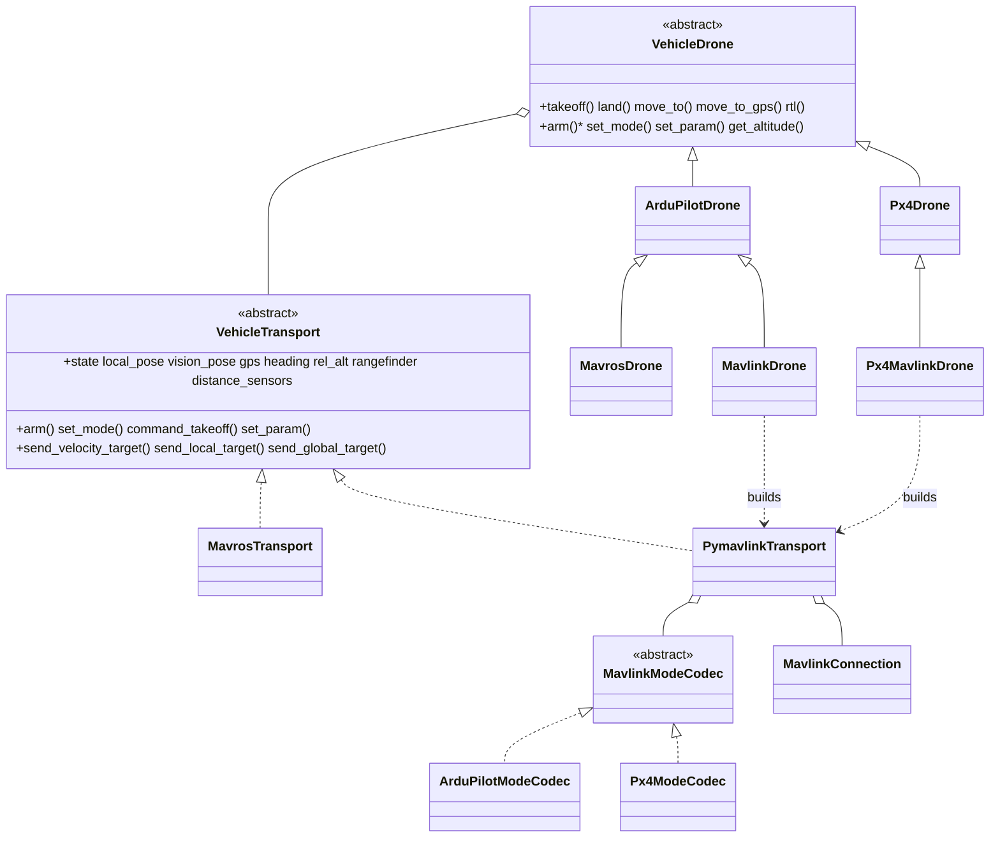

# Controle MAVLink Direto

Um caminho de controle [pymavlink](https://mavlink.io/en/mavgen_python/) direto para veículos ArduPilot **e PX4**, para os casos em que a ponte [MAVROS](../mavros/) não está disponível, não é desejada, ou é insuficiente (stack de computador de bordo mais leve, plugins customizados, ou um único proprietário da porta serial do FCU).

`MavlinkDrone` é o mesmo veículo ArduPilot que o [`MavrosDrone`](https://github.com/Black-Bee-Drones/nectar-sdk/blob/main/nectar/nectar/control/mavros/drone.py), alcançado por um transporte diferente. Ambos são subclasses do núcleo [`ArduPilotDrone`](../ardupilot/) compartilhado, então **toda a lógica de voo/navegação é idêntica** — apenas a conectividade on-wire difere.

`PymavlinkTransport` é **neutro em relação a firmware**: um [`MavlinkModeCodec`](https://github.com/Black-Bee-Drones/nectar-sdk/blob/main/nectar/nectar/control/mavlink/modes.py) injetado isola a única diferença de firmware (encode/decode do modo de voo). `ArduPilotModeCodec` (padrão, `SET_MODE` + `mode_mapping()` do pymavlink) apoia o `MavlinkDrone`; [`Px4ModeCodec`](https://github.com/Black-Bee-Drones/nectar-sdk/blob/main/nectar/nectar/control/px4/mavlink_drone.py) (`MAV_CMD_DO_SET_MODE` com os modos `(main, sub)` do PX4) apoia o [`Px4MavlinkDrone`](https://github.com/Black-Bee-Drones/nectar-sdk/blob/main/nectar/nectar/control/px4/mavlink_drone.py). Telemetria, setpoints, arming, parâmetros e taxas de stream são compartilhados sem alteração.



## Componentes

### `MavlinkConnection`

Wrapper fino em torno de `mavutil.mavlink_connection`, em [`connection.py`](https://github.com/Black-Bee-Drones/nectar-sdk/blob/main/nectar/nectar/control/mavlink/connection.py). Abre um único endpoint MAVLink, faz o handshake de heartbeat para descobrir `target_system`/`target_component`, e expõe a conexão bruta via `.master`. Adiciona um **`send_lock`**: um único endpoint precisa ter um leitor de RX, mas pode ter muitos remetentes (setpoints, heartbeat, rangefinder, ponte de visão), e `mav.*_send` não é thread-safe, então todo remetente serializa por esse lock.

### `PymavlinkTransport`

[`transport.py`](https://github.com/Black-Bee-Drones/nectar-sdk/blob/main/nectar/nectar/control/mavlink/transport.py) — a implementação de `VehicleTransport` que possui o link do FCU diretamente.

- **RX**: um timer do ROS no node do drone drena `recv_match(blocking=False)` e despacha cada mensagem por uma tabela de handlers. Tipos decodificados: `HEARTBEAT`, `GLOBAL_POSITION_INT`, `LOCAL_POSITION_NED`, `ATTITUDE`, `RANGEFINDER`/`DISTANCE_SENSOR`, `PARAM_VALUE`, `COMMAND_ACK` e `STATUSTEXT`. Isso mantém o modelo de concorrência idêntico ao MAVROS — a telemetria é atualizada na thread do executor, e as chamadas bloqueantes de voo a leem na thread do usuário.
- **TX**: um timer de heartbeat a 1 Hz anuncia o computador de bordo; comandos saem via `command_long`/`set_mode`/`param_set`; setpoints via `set_position_target_local_ned` / `set_position_target_global_int`.
- **Frames**: o núcleo fala ENU/FLU; o transporte converte para o NED/FRD on-wire na saída e de volta para ENU na entrada (exatamente o que o MAVROS faz internamente).
- **Streams**: em `start()`, ele solicita intervalos de mensagem via [`streams.py`](https://github.com/Black-Bee-Drones/nectar-sdk/blob/main/nectar/nectar/control/mavlink/streams.py) (`MAV_CMD_SET_MESSAGE_INTERVAL`); um helper legado `REQUEST_DATA_STREAM` (`request_data_streams`) também é fornecido em `streams.py`, para firmwares mais antigos, mas não é chamado automaticamente.

#### Exposição de STATUSTEXT

O MAVROS repassa o [`STATUSTEXT`](https://mavlink.io/en/messages/common.html#STATUSTEXT) do FCU para `/rosout`; o transporte direto não tem esse relay, então `_on_statustext` loga o texto do FCU no logger ROS do drone, com uma severidade correspondente (`MAV_SEVERITY_ERROR` → `error`, `WARNING` → `warn`, senão `info`). Isso expõe o motivo real da rejeição de um comando — mais utilmente falhas de `PreArm: ...` — que de outra forma ficariam invisíveis sobre um link direto. Mensagens idênticas consecutivas são deduplicadas.

#### Confirmação de parâmetro

`set_param` limpa qualquer valor em cache, envia `PARAM_SET`, e então espera até **0,5 s** pelo eco `PARAM_VALUE` do FCU, verificando se o valor ecoado corresponde (dentro de uma tolerância) antes de retornar `True`/logar a confirmação. O ArduPilot ecoa um parâmetro conhecido em poucos milissegundos e permanece em silêncio para um parâmetro desconhecido, então o timeout curto mantém o probing de alias (4.6 `WPNAV_*` → 4.8 `WP_*`) responsivo sem falsos negativos em um link rápido. Diferente do resultado de serviço do MAVROS (que só confirma que a requisição foi aceita), isso confirma que o valor de fato foi aplicado.

#### Sensores de distância

Cada mensagem `DISTANCE_SENSOR` é decodificada em um `DistanceReading` e armazenada por id de sensor em um mapa copy-on-write, exposto como `distance_sensors` (e `get_distance(orientation)` no drone). O sensor voltado para baixo também atualiza `rangefinder`. Toda orientação reportada é coletada automaticamente, sem nenhuma configuração do lado do SDK além da configuração de rangefinder/proximidade no FCU. Veja o [README do núcleo do veículo](../vehicle/#sensores-de-distancia) para o modelo de dados.

#### Taxas de stream

[`streams.py`](https://github.com/Black-Bee-Drones/nectar-sdk/blob/main/nectar/nectar/control/mavlink/streams.py) solicita estas taxas por mensagem em `start()` (sobrescrevível via `MavlinkConfig.stream_rates`). A orientação de Non-GPS do ArduPilot quer pose ≥ 4 Hz; os padrões solicitam mais, para que a navegação PID tenha feedback fresco.

| Mensagem | Taxa (Hz) |
| --- | --- |
| `HEARTBEAT` | 1 |
| `SYS_STATUS` | 2 |
| `ATTITUDE` | 20 |
| `GLOBAL_POSITION_INT` | 10 |
| `LOCAL_POSITION_NED` | 20 |
| `GPS_RAW_INT` | 5 |
| `RANGEFINDER` | 10 |
| `DISTANCE_SENSOR` | 10 |
| `VFR_HUD` | 5 |
| `HOME_POSITION` | 1 |

Uma taxa `<= 0` desabilita um stream. `GPS_RAW_INT` e alguns outros são solicitados por completude, mesmo que a posição venha de `GLOBAL_POSITION_INT`/`LOCAL_POSITION_NED`.

A regra de um único leitor de RX é o que permite que um `RangefinderPublisher` e uma `VisionPoseBridge` compartilhem a mesma `MavlinkConnection` com segurança — eles só *enviam*, por meio do lock.

### Pose de visão (indoor)

[`vision_bridge.py`](https://github.com/Black-Bee-Drones/nectar-sdk/blob/main/nectar/nectar/control/mavlink/vision_bridge.py) — navegação externa para ambiente sem GPS. Com
`pose_source=VISION`, `PymavlinkTransport` sempre preenche `vision_pose` a partir de
`vision_pose_topic`, para o PID do computador de bordo. Quem envia
[`VISION_POSITION_ESTIMATE`](https://mavlink.io/en/messages/common.html#VISION_POSITION_ESTIMATE)
para o FCU (o [Non-GPS Position Estimation](https://ardupilot.org/dev/docs/mavlink-nongps-position-estimation.html) do ArduPilot
quer ≥ 4 Hz) é controlado por `auto_vision_feed`:

| `auto_vision_feed` | Feed do FCU | Pose do computador de bordo |
| --- | --- | --- |
| `False` (padrão) | `vision_pose_node backend:=mavlink` separado, em **outro** endpoint MAVLink | `VisionPoseSubscriber` |
| `True` | `VisionPoseBridge` própria da missão (opcional `vision_send_speed` → `VisionSpeedBridge`) | mesma ponte, `on_pose` |

Nunca rode os dois remetentes no mesmo endpoint. Pipeline ponta a ponta (produtor,
backends, configuração do FCU): [Localization](localization/).

**Qual tópico apontar** (`vision_pose_topic`):

| Cenário | Tópico | Por quê |
| --- | --- | --- |
| Hardware real | Saída do VSLAM, `/visual_slam/tracking/vo_pose_covariance` (padrão) | Assina diretamente o estimador |
| Simulação Gazebo (indoor) | igual | `gz_vision_source` republica o ground truth no tópico canônico (`MAVLINK_SITL_VISION_CONFIG`) |

A taxa de repasse é igual à taxa de subscription. `vision_rate_hz` **não** está conectado — não confie nele para limitar a taxa.

## Início rápido

**Outdoor / SITL sobre TCP**:

```python
from nectar.control import DroneFactory, MavlinkConfig, PoseSource

config = MavlinkConfig(connection_string="tcp:127.0.0.1:5760", expect_lidar=False)
drone = DroneFactory.create("mavlink", config)

drone.takeoff(altitude=2.0)
drone.move_to(x=2.0, y=1.0, z=0.0, precision=0.2)
drone.rtl(land=True)
```

**Hardware real via serial** (Jetson ↔ Pixhawk):

```python
config = MavlinkConfig(connection_string="/dev/ttyTHS1", baud=921600)
drone = DroneFactory.create("mavlink", config)
```

**Indoor, baseado em visão** (feeder externo por padrão):

```python
config = MavlinkConfig(
    pose_source=PoseSource.VISION,
    connection_string="/dev/ttyUSB0",  # or a router UDP endpoint for the mission
    vision_pose_topic="/visual_slam/tracking/vo_pose_covariance",
)
drone = DroneFactory.create("mavlink", config)
```

Presets prontos ([`config.py`](https://github.com/Black-Bee-Drones/nectar-sdk/blob/main/nectar/nectar/control/config.py)): `MAVLINK_SITL_CONFIG` (tcp `5760`),
`MAVLINK_SITL_GAZEBO_CONFIG` / `MAVLINK_SITL_VISION_CONFIG` (missão em SERIAL1 tcp `5762`;
feeder indoor em SERIAL0 tcp `5760` quando `mavros:=false`).

### Formato da connection string

Diferente do `MavrosConfig` (`fcu_url` do MAVROS), `MavlinkConfig.connection_string` é **nativo do pymavlink**:

| Forma | Exemplo |
| --- | --- |
| TCP | `tcp:127.0.0.1:5760` |
| UDP listener | `udp:127.0.0.1:14551` |
| UDP sender | `udpout:192.168.1.10:14550` |
| Serial | `/dev/ttyUSB0` (+ `baud=`) |

### Compartilhando a conexão com um rangefinder

```python
from nectar.sensors.rangefinder_publisher import RangefinderPublisher

pub = RangefinderPublisher(sensor, drone.connection)  # shares the lock
pub.start()
```

## Quando usar qual transporte

| | `MavrosDrone` (`"mavros"`) | `MavlinkDrone` (`"mavlink"`) |
| --- | --- | --- |
| Link | exige um `mavros_node` em execução | possui o endpoint do FCU diretamente |
| Dependências | stack ROS MAVROS | apenas pymavlink |
| Feed de visão indoor | `vision_pose` → MAVROS | `vision_pose_node` externo (padrão) ou `auto_vision_feed=True` |
| Melhor para | implantações ROS completas, ferramental MAVROS existente | stacks de computador de bordo mínimos, proprietário único da serial |

Ambos expõem a mesma API `Drone` e as mesmas capacidades.

## Referências

- [Documentação do pymavlink](https://mavlink.io/en/mavgen_python/)
- [Mensagens comuns do MAVLink](https://mavlink.io/en/messages/common.html)
- [ArduPilot Copter commands in Guided mode](https://ardupilot.org/dev/docs/copter-commands-in-guided-mode.html)
- [ArduPilot Non-GPS position estimation](https://ardupilot.org/dev/docs/mavlink-nongps-position-estimation.html)
- [mavlink-router](https://github.com/mavlink-router/mavlink-router) — distribui (fan out) a serial do FCU para múltiplos endpoints
