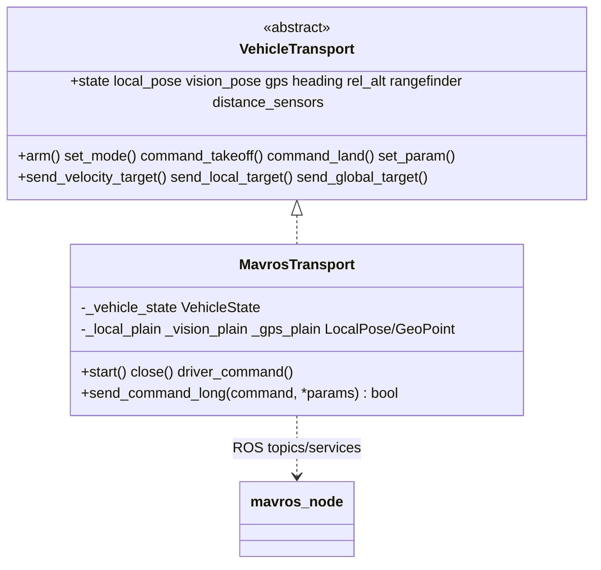

# Transporte MAVROS

`MavrosTransport` conecta o [núcleo do veículo](../vehicle/) compartilhado a um [`mavros_node`](https://github.com/mavlink/mavros) em execução. Ele apoia o mesmo veículo sobre MAVROS para os dois firmwares (`MavrosDrone` para ArduPilot, `Px4MavrosDrone` para PX4) — o comportamento de voo agnóstico a firmware, a navegação, o takeoff/land, o GPS, o RTL e o PID são **compartilhados e documentados no [núcleo do veículo](../vehicle/)** (as especificidades de setpoint/parâmetro do ArduPilot estão em [ArduPilot](../ardupilot/)).

> Para a API pública do `Drone`, os métodos de navegação, as referências, as fontes de altitude, a detecção de takeoff/land e a configuração de PID, veja o [README do núcleo do veículo](../vehicle/).

## Papel

[`MavrosTransport`](https://github.com/Black-Bee-Drones/nectar-sdk/blob/main/nectar/nectar/control/mavros/transport.py) implementa a interface [`VehicleTransport`](https://github.com/Black-Bee-Drones/nectar-sdk/blob/main/nectar/nectar/control/vehicle/transport.py) contra o MAVROS:

- **Telemetria** ← **subscriptions** do ROS. Cada callback converte uma mensagem `mavros_msgs`/`geometry_msgs`/`sensor_msgs` em um valor simples de `vehicle/types` e o armazena atomicamente.
- **Comandos** → **service clients** do ROS (`/mavros/set_mode`, `/mavros/cmd/*`, `/mavros/param/set_parameters`).
- **Setpoints** → **publishers** do ROS (`/mavros/setpoint_raw/local`, `/mavros/setpoint_position/global`).
- A **conversão de frame** é feita pelo próprio MAVROS (ENU↔NED), então o transporte publica valores na convenção ROS diretamente.



`MavrosDrone` é simplesmente `ArduPilotDrone` construído com um `MavrosTransport`, e `Px4MavrosDrone` é `Px4Drone` construído com o mesmo transporte (veja [`drone.py`](https://github.com/Black-Bee-Drones/nectar-sdk/blob/main/nectar/nectar/control/mavros/drone.py) e [`../px4/mavros_drone.py`](https://github.com/Black-Bee-Drones/nectar-sdk/blob/main/nectar/nectar/control/px4/mavros_drone.py)).

## Requisitos

O MAVROS é uma dependência opcional (não faz parte da instalação padrão do SDK). Instale-o uma vez com `make drone-mavros` (ou `./scripts/setup.sh drone mavros`), que adiciona `ros-<distro>-mavros`/`-mavros-extras` e os datasets do GeographicLib.

Um `mavros_node` precisa então estar fazendo a ponte com o FCU. O transporte pode iniciá-lo para você quando `MavrosConfig.start_driver=True`:

```
ros2 launch mavros apm.launch fcu_url:=<connection_string>
```

`MavrosConfig.connection_string` é um [`fcu_url`](https://github.com/mavlink/mavros/blob/ros2/mavros/README.md) do MAVROS (por exemplo, `serial:///dev/ttyUSB0:921600`, `tcp://127.0.0.1:5760`), **não** uma string do pymavlink. Veja o [transporte MAVLink](../mavlink/) para a alternativa de conexão direta.

## Configuração

```python
import nectar
from nectar.control import DroneFactory, MavrosConfig, PoseSource

nectar.init()

config = MavrosConfig(
    pose_source=PoseSource.VISION,        # VISION (indoor) or GPS (outdoor)
    expect_lidar=True,                    # wait for rangefinder at startup
    connection_string="serial:///dev/ttyUSB0:921600",
    apply_setpoint_params=False,          # True to push WPNAV/GUID params to the FCU on arm
)
drone = DroneFactory.create("mavros", config)
```

`MavrosConfig` expõe um nome de tópico para cada subscription (`state_topic`, `lidar_topic`, `local_position_topic`, `vision_topic`, `gps_topic`, `heading_topic`, `rel_alt_topic`), uma tupla opcional `distance_sensors` (veja [Sensores de Distância](#sensores-de-distancia)), além de `pid_config_file` / `setpoint_config_file` / `apply_setpoint_params` (consumidos pelo núcleo compartilhado). A `pose_source` seleciona o conjunto de subscriptions indoor vs. outdoor.

**Presets de SITL** (em [`config.py`](https://github.com/Black-Bee-Drones/nectar-sdk/blob/main/nectar/nectar/control/config.py)): `SITL_CONFIG`, `SITL_GPS_CONFIG`, `SITL_GAZEBO_CONFIG`, `SITL_VISION_CONFIG`.

## Mapeamento de Telemetria

Os callbacks de subscriber convertem mensagens ROS para os tipos simples do núcleo:

| Tópico ROS | Tipo ROS | Tipo no núcleo | Armazenado como |
|---|---|---|---|
| `/mavros/state` | `mavros_msgs/State` | `VehicleState` | `state` |
| `/mavros/local_position/pose` | `geometry_msgs/PoseStamped` | `LocalPose` | `local_pose` |
| `/mavros/vision_pose/pose_cov` | `geometry_msgs/PoseWithCovarianceStamped` | `LocalPose` | `vision_pose` |
| `/mavros/vision_pose/pose` | `geometry_msgs/PoseStamped` | `LocalPose` | `vision_pose` |
| `/mavros/global_position/global` | `sensor_msgs/NavSatFix` | `GeoPoint` | `gps` |
| `/mavros/global_position/rel_alt` | `std_msgs/Float64` | `float` | `rel_alt` |
| `/mavros/global_position/compass_hdg` | `std_msgs/Float64` | `float` | `heading` |
| `/mavros/rangefinder/rangefinder` | `sensor_msgs/Range` | `float` | `rangefinder` |

`/mavros/state` é assinado com durabilidade `TRANSIENT_LOCAL`, de modo que o último estado em cache seja entregue na subscription (capturando de forma confiável mudanças de arm/modo). A subscription de visão é escolhida em runtime: um callback `PoseWithCovarianceStamped` quando o nome do tópico contém `pose_cov`, caso contrário um `PoseStamped` simples. Indoor (`pose_source=VISION`) assina o tópico de visão; outdoor assina GPS, rel-alt e heading da bússola.

Os tópicos de comando (publishers) e os serviços do MAVROS estão listados abaixo.

## Sensores de Distância {#sensores-de-distancia}

`lidar_topic` alimenta o `rangefinder` voltado para baixo, usado para altitude. Para expor rangefinders adicionais ou setores de proximidade (`distance_sensors` / `get_distance(orientation)` no drone), dois lados precisam estar alinhados:

1. O MAVROS precisa publicá-los. Seu plugin [`distance_sensor`](https://github.com/mavlink/mavros/blob/ros2/mavros_extras/src/plugins/distance_sensor.cpp) mapeia cada id `DISTANCE_SENSOR` do FCU para um tópico `sensor_msgs/Range`, por meio dos parâmetros por sensor do plugin.
2. O SDK precisa assinar esses tópicos. `Range` não carrega id nem orientação, então declare cada um em `MavrosConfig.distance_sensors` para marcar as leituras recebidas:

```python
from nectar.control import MavrosConfig, DistanceSensorTopic, SensorOrientation

config = MavrosConfig(
    distance_sensors=(
        DistanceSensorTopic("/mavros/distance_sensor/rangefinder_fwd", SensorOrientation.FORWARD, sensor_id=1),
        DistanceSensorTopic("/mavros/distance_sensor/rangefinder_left", SensorOrientation.LEFT, sensor_id=2),
    ),
)
```

`sensor_type` é derivado de `Range.radiation_type`; `signal_quality` não está disponível via MAVROS e permanece `None`. O [transporte MAVLink](../mavlink/) direto não precisa de nada disso, lendo id e orientação diretamente de `DISTANCE_SENSOR`. Veja o [README do núcleo do veículo](../vehicle/#sensores-de-distancia) para o modelo de dados.

## Tópicos e Serviços ROS2

### Publishers

| Tópico | Tipo | Finalidade |
|-------|------|---------|
| `/mavros/setpoint_raw/local` | PositionTarget | Setpoints de velocidade e posição local |
| `/mavros/setpoint_position/global` | GeoPoseStamped | Setpoints de posição GPS (outdoor) |
| `/mavros/setpoint_raw/global` | GlobalPositionTarget | Setpoints brutos de GPS (outdoor) |

Setpoints locais usam uma bitmask de velocidade (velocidade + yaw-rate ativos) para `move_velocity`, e uma bitmask de posição (posição + yaw ativos) para alvos de posição local. O MAVROS traduz `PositionTarget` para [`SET_POSITION_TARGET_LOCAL_NED`](https://mavlink.io/en/messages/common.html#SET_POSITION_TARGET_LOCAL_NED) (veja [`setpoint_mixin.hpp`](https://github.com/mavlink/mavros/blob/ros2/mavros/include/mavros/setpoint_mixin.hpp)).

### Serviços

| Serviço | Tipo | Finalidade |
|---------|------|---------|
| `/mavros/set_mode` | SetMode | Muda o modo de voo |
| `/mavros/cmd/arming` | CommandBool | Arma/desarma os motores |
| `/mavros/cmd/takeoff` | CommandTOL | Comando de takeoff |
| `/mavros/cmd/land` | CommandTOL | Comando de land |
| `/mavros/cmd/set_home` | CommandHome | Define a posição de home |
| `/mavros/cmd/command` | CommandLong | Comandos MAVLink genéricos (`set_speed`, `do_servo`, disarm) |
| `/mavros/param/set_parameters` | SetParameters | Define parâmetros do FCU |

## Comportamento das Chamadas de Serviço

Todas as chamadas de serviço passam por `BaseDrone._call_service`, que é segura contra deadlock: seguindo a [orientação de sync/async do ROS 2](https://docs.ros.org/en/humble/How-To-Guides/Sync-Vs-Async.html), ela chama `call_async` e bloqueia na future enquanto o executor do SDK continua girando (spinning) os callbacks em uma thread de fundo. Ela retorna o **objeto de resposta** (ou `None` em timeout/erro); só valida campos da resposta quando um `validator` é passado.

O transporte interpreta as respostas assim:

| Comando | Método | Condição de sucesso |
|---|---|---|
| set_mode, arm, takeoff, land, set_home, disarm | `bool(res)` | **Heurística de ACK de serviço** — uma resposta retornada conta como sucesso |
| `COMMAND_LONG` genérico (`set_speed`, `do_servo`) | `send_command_long` | `bool(res) and res.success` |
| `set_param` | — | todos os `results[].successful` |

**Por que a heurística de ACK de serviço para arm/takeoff/land**: validar `res.success` / `res.result` nesses serviços produzia falsos negativos e retentativas desnecessárias, então o transporte trata uma resposta bem-formada do MAVROS como aceitação e deixa o núcleo do veículo confirmar o resultado pela telemetria: `arm()` faz poll de `is_armed`/modo, e takeoff/land usam a detecção de estabilização do [`FlightSequencer`](../vehicle/#decolagem-e-pouso). O `COMMAND_LONG` genérico não tem estado de acompanhamento para fazer poll, então ainda verifica `res.success`.

### Códigos MAV_RESULT

Os serviços de comando do MAVROS reportam o [MAV_RESULT](https://mavlink.io/en/messages/common.html#MAV_RESULT) do MAVLink no campo `result`: `0 ACCEPTED`, `1 TEMPORARILY_REJECTED`, `2 DENIED`, `3 UNSUPPORTED`, `4 FAILED`, `5 IN_PROGRESS`.

## Visão Indoor

Com o MAVROS, o EKF do FCU (EKF3 do ArduPilot / EKF2 do PX4) recebe navegação externa pelo próprio plugin de visão do MAVROS: uma fonte de pose externa publica em `/mavros/vision_pose/pose_cov` (ou `/pose`), e o MAVROS converte ENU→NED e envia [`VISION_POSITION_ESTIMATE`](https://mavlink.io/en/messages/common.html#VISION_POSITION_ESTIMATE) para o FCU. O transporte apenas **assina** o mesmo tópico para expor `vision_pose` para a navegação PID do lado do computador de bordo.

- **D435i + Isaac ROS Visual SLAM** (atual): `D435i → isaac_ros_visual_slam → relay → /mavros/vision_pose/pose_cov` — [Localization](localization/)
- **T265 + [vision_to_mavros](https://github.com/Black-Bee-Drones/vision_to_mavros)** (legado/fallback): `T265 VIO → /tf → vision_to_mavros (ENU alignment) → /mavros/vision_pose/pose` — [Legacy T265](localization/legacy.md)

Os parâmetros de FCU por firmware (fontes, taxa, fonte de altura) e a origem do EKF estão
documentados em [Localization → FCU setup](localization/#fcu-setup) /
[EKF origin](localization/#ekf-origin). Teoria:
[Concepts](localization/concepts.md). O
[transporte MAVLink](../mavlink/) direto substitui esse relay do MAVROS por uma
`VisionPoseBridge` embutida.

## Referências

- [MAVROS GitHub](https://github.com/mavlink/mavros) · [MAVROS ROS2 API](https://docs.ros.org/en/humble/p/mavros/) · [MAVROS Wiki](https://wiki.ros.org/mavros)
- [SET_POSITION_TARGET_LOCAL_NED](https://mavlink.io/en/messages/common.html#SET_POSITION_TARGET_LOCAL_NED) · [MAV_RESULT](https://mavlink.io/en/messages/common.html#MAV_RESULT) · [VISION_POSITION_ESTIMATE](https://mavlink.io/en/messages/common.html#VISION_POSITION_ESTIMATE)
- [ROS 2 Sync vs Async Service Clients](https://docs.ros.org/en/humble/How-To-Guides/Sync-Vs-Async.html) · [ROS 2 Executors](https://docs.ros.org/en/humble/Concepts/Intermediate/About-Executors.html)
- [vision_to_mavros](https://github.com/Black-Bee-Drones/vision_to_mavros) · [Isaac ROS cuVSLAM with RealSense](https://nvidia-isaac-ros.github.io/concepts/visual_slam/cuvslam/tutorial_realsense.html)
- Lógica de voo compartilhada: [Núcleo do veículo](../vehicle/) · Especificidades do ArduPilot: [ArduPilot](../ardupilot/)
