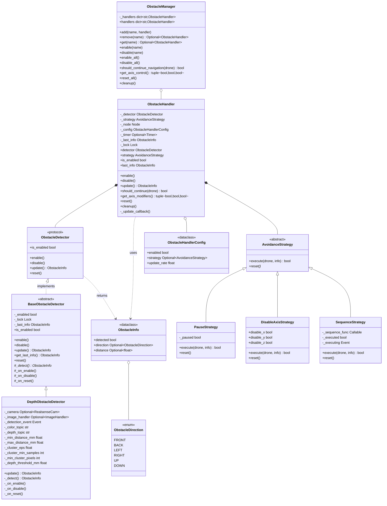
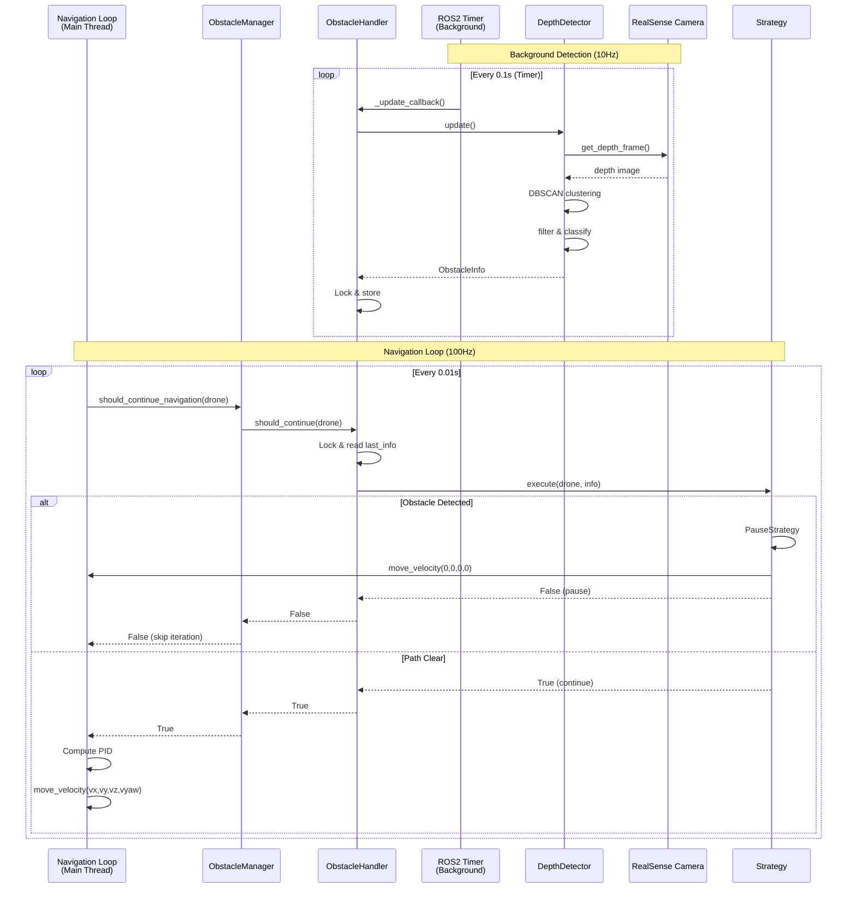
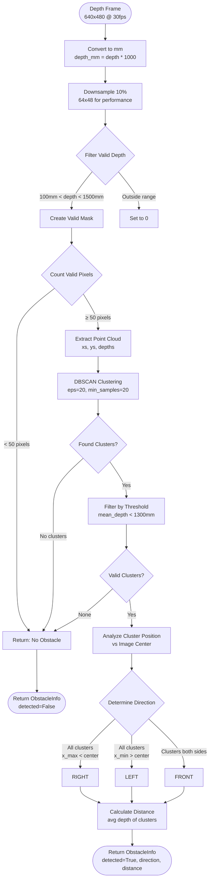
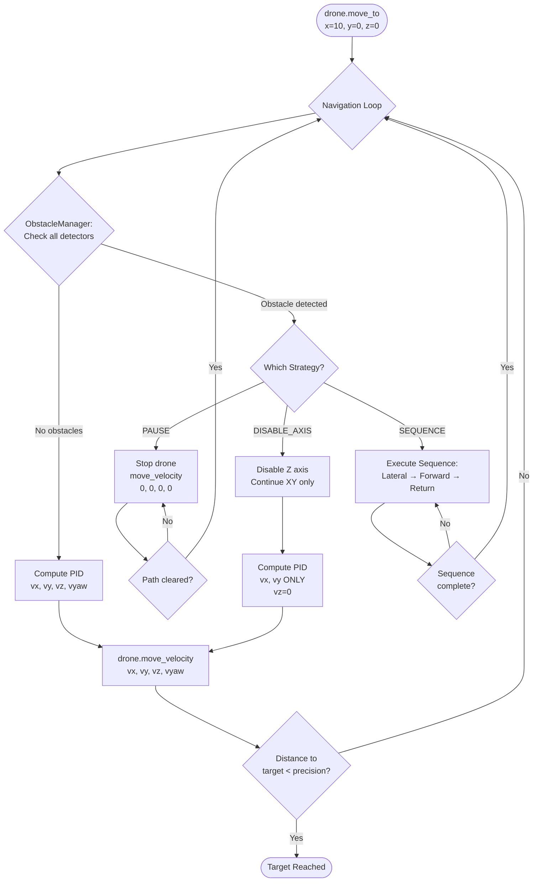

# Módulo de Detecção de Obstáculos

Detecção de obstáculos baseada em eventos, com um strategy pattern para comportamentos de
desvio de obstáculos. Um detector reporta obstáculos, uma strategy decide como reagir, e o
`ObstacleManager` os executa como parte da navegação — associe um a qualquer drone com
`add_obstacle_detector`.

## Resumo rápido

```python
from nectar.control import DepthObstacleDetector, strategies

drone.add_obstacle_detector("depth", DepthObstacleDetector(), strategies.PauseStrategy())
drone.enable_all_obstacle_detectors()

drone.move_to(x=10.0, y=0.0, z=0.0)   # pauses while an obstacle is detected ahead
```

## Arquitetura



## Fluxo de Detecção em Tempo Real



## Conceitos Centrais

### Separação de Responsabilidades

- **Detecção** (O quê): identifica obstáculos e retorna `ObstacleInfo`
- **Strategy** (Como): define o comportamento de resposta
- **Handler** (Quando): gerencia o timing e a integração
- **Manager** (Onde): coordena múltiplos detectores em um drone

### ObstacleInfo

Estrutura de dados do resultado da detecção.

```python
@dataclass
class ObstacleInfo:
    detected: bool
    direction: Optional[ObstacleDirection] = None  # FRONT, BACK, LEFT, RIGHT, UP, DOWN
    distance: Optional[float] = None  # meters
```

### Protocolo ObstacleDetector

Interface para detectores de obstáculos.

```python
class ObstacleDetector(Protocol):
    @property
    def is_enabled(self) -> bool: ...

    def enable(self) -> None: ...
    def disable(self) -> None: ...
    def update(self) -> ObstacleInfo: ...
    def reset(self) -> None: ...
```

## Detectores

### Zonas de Detecção

A direção é derivada da posição do cluster em relação ao centro da imagem (veja o
flowchart abaixo e
[`depth_camera.py`](https://github.com/Black-Bee-Drones/nectar-sdk/blob/main/nectar/nectar/control/obstacles/depth_camera.py)):

- Todos os clusters à esquerda do centro → `ObstacleDirection.RIGHT`
- Todos os clusters à direita do centro → `ObstacleDirection.LEFT`
- Clusters nos dois lados → `ObstacleDirection.FRONT`

**Limiares de distância** (mm, salvo indicação contrária):

| Parâmetro | Valor | Papel |
|-----------|-------|-------|
| Distância mínima | 100 | Ignora retornos mais próximos do que isso |
| Distância máxima | 1500 | Limite do alcance de detecção |
| Filtro de cluster | 1300 | Profundidade média máxima do cluster para contar como obstáculo |

### DepthObstacleDetector

Detecção baseada na câmera de profundidade RealSense D435i usando clustering DBSCAN.

**Configuração**:

```python
from nectar.control.obstacles import DepthObstacleDetector

detector = DepthObstacleDetector(
    min_distance_mm=100,         # ignore returns closer than this
    max_distance_mm=1500,        # maximum detection range
    cluster_eps=20,              # DBSCAN epsilon
    cluster_min_samples=20,      # DBSCAN minimum samples
    min_cluster_pixels=50,       # minimum valid pixels to attempt clustering
    depth_threshold_mm=1300,     # max cluster mean depth to count as obstacle
    color_topic="/camera/color/image_raw",
    depth_topic="/camera/depth/image_rect_raw",
)
```

> **Nota:** o detector possui seu próprio `ImageHandler` da RealSense (e node ROS)
> internamente — nenhum argumento `node` é passado.

#### Processamento da câmera de profundidade



### BaseObstacleDetector

Classe base abstrata que fornece gerenciamento de estado thread-safe.

```python
from nectar.control.obstacles import BaseObstacleDetector

class CustomDetector(BaseObstacleDetector):
    def _detect(self) -> ObstacleInfo:
        # Custom detection logic
        return ObstacleInfo(detected=True, direction=ObstacleDirection.FRONT)

    def _on_reset(self) -> None:
        # Reset internal state (optional hook)
        pass
```

## Strategies

### Fluxo de Decisão da Strategy



### Resumo das Strategies

| Strategy | Comportamento | Retorna | Caso de uso |
|----------|----------|---------|----------|
| **PauseStrategy** | `move_velocity(0,0,0,0)` até liberar | `False` enquanto detectado | Obstáculos dinâmicos (pessoas, drones) |
| **DisableAxisStrategy** | Desabilita o controle do eixo especificado | `True` (continua) | Terrain following (lidar) |
| **SequenceStrategy** | Executa uma manobra de evasão | `False` durante a execução | Obstáculos estáticos (paredes, árvores) |

### Interface AvoidanceStrategy

```python
class AvoidanceStrategy(ABC):
    @abstractmethod
    def execute(self, drone: BaseDrone, info: ObstacleInfo) -> bool:
        """
        Execute avoidance behavior.

        Returns:
            True if navigation should continue, False to pause
        """
        pass

    @abstractmethod
    def reset(self) -> None:
        pass
```

### PauseStrategy

Para o drone quando um obstáculo é detectado, retoma quando liberado.

```python
from nectar.control.obstacles import strategies

strategy = strategies.PauseStrategy()
```

**Comportamento**:

```python
def execute(self, drone, info):
    if info.detected:
        drone.move_velocity(0, 0, 0, 0)  # Stop
        return False  # Don't continue navigation
    else:
        return True  # Resume navigation
```

**Caso de uso**: Obstáculos dinâmicos (pessoas, outros drones) que podem se afastar.

### DisableAxisStrategy

Desabilita o controle de eixos específicos durante a detecção de obstáculo.

```python
strategy = strategies.DisableAxisStrategy(
    disable_x=False,
    disable_y=False,
    disable_z=True  # Disable altitude control
)
```

**Comportamento**: Retorna `True` (continua a navegação) mas sinaliza quais eixos
desabilitar via `get_axis_modifiers()`.

**Caso de uso**: Terrain following com lidar (desabilita o PID de Z, deixa o ArduPilot
controlar a altitude).

### SequenceStrategy

Executa uma sequência callable customizada quando um obstáculo é detectado.

```python
from functools import partial

strategy = strategies.SequenceStrategy(
    partial(
        strategies.lateral_pass_return_sequence,
        lateral_distance=1.0,
        forward_distance=2.5,
        precision=0.2
    )
)
```

**Comportamento**: Chama `sequence_func(drone, info)`, que executa `drone.move_to()`
diretamente.

**Sequências prontas**:

| Sequência | Passos | Resultado |
|----------|-------|--------|
| `lateral_pass_return_sequence` | ① `y=lateral` → ② `x=forward` → ③ `y=-lateral` | Retorna à trajetória original |
| `lateral_pass_sequence` | ① `y=lateral` → ② `x=forward` | Permanece deslocado |
| `simple_lateral_sequence` | ① `y=lateral` | Passo lateral único |
| `climb_over_sequence` | ① `z=+height` → ② `x=forward` → ③ `z=-height` | Contorno vertical |

**Lógica de direção**: `LEFT` → move para a direita (`-y`), `RIGHT`/`FRONT` → move para a
esquerda (`+y`)

## Integração

### ObstacleHandler

Combina detector + strategy com timing.

```python
from nectar.control.obstacles import ObstacleHandler, ObstacleHandlerConfig

handler = ObstacleHandler(
    detector=DepthObstacleDetector(),
    strategy=strategies.PauseStrategy(),
    node=node,
    config=ObstacleHandlerConfig(
        enabled=True,
        update_rate=0.1
    )
)
```

**Mecanismos de atualização**:

1. **Baseado em timer** (padrão): um timer do ROS2 chama `_update_callback()` na taxa
   especificada
2. **Manual**: chame `handler.update()` explicitamente (defina `update_rate=0`)

**Thread safety**: usa locks para o acesso ao estado (`_last_info`).

### ObstacleManager

Gerencia múltiplos handlers em um drone.

```python
manager = ObstacleManager()

manager.add("depth", depth_handler)
manager.add("lidar", lidar_handler)

manager.enable("depth")
manager.disable("lidar")

# In navigation loop

if not manager.should_continue_navigation(drone):
    continue  # Strategy is handling obstacle

disable_x, disable_y, disable_z = manager.get_axis_control()
```

**Integração com a navegação**:

```python

# In VehicleNavigator.navigate_pid()

while True:
    if not drone.obstacle_manager.should_continue_navigation(drone):
        continue  # Pause or sequence executing

    disable_x, disable_y, disable_z = drone.obstacle_manager.get_axis_control()

    control_x = x is not None and not disable_x
    control_y = y is not None and not disable_y
    control_z = z is not None and not disable_z

    # Continue with PID control
```

## API do Drone

### Adicionando Detectores

```python
drone.add_obstacle_detector(
    name: str,
    detector: ObstacleDetector,
    strategy: AvoidanceStrategy,
    config: Optional[ObstacleHandlerConfig] = None
)
```

**Exemplo**:

```python
detector = DepthObstacleDetector()
strategy = strategies.PauseStrategy()
config = ObstacleHandlerConfig(update_rate=0.15)  # 6.7 Hz

drone.add_obstacle_detector("depth", detector, strategy, config)
```

### Controle

```python
drone.enable_obstacle_detector("depth")
drone.disable_obstacle_detector("depth")
drone.enable_all_obstacle_detectors()
drone.disable_all_obstacle_detectors()
drone.remove_obstacle_detector("depth")
```

## Exemplos de Uso

### Evasão Lateral

```python
from functools import partial

detector = DepthObstacleDetector()

strategy = strategies.SequenceStrategy(
    partial(
        strategies.lateral_pass_return_sequence,
        lateral_distance=1.5,
        forward_distance=3.0
    )
)

drone.add_obstacle_detector("depth", detector, strategy)
drone.enable_obstacle_detector("depth")

drone.takeoff(1.5)
drone.move_to(x=10.0, y=0.0, z=0.0)  # Executes evasion when obstacle detected
drone.land()
```

### Sequência Customizada

```python
def my_evasion(drone, info, climb_height=1.0):
    """Climb over obstacle."""
    drone.node.get_logger().info("Climbing over obstacle")
    drone.move_to(z=climb_height, precision=0.2)
    drone.move_to(x=3.0, precision=0.2)
    drone.move_to(z=-climb_height, precision=0.2)

strategy = strategies.SequenceStrategy(partial(my_evasion, climb_height=1.5))
drone.add_obstacle_detector("depth", detector, strategy)
```

### Terrain Following

```python

# Custom lidar detector (not provided)

lidar_detector = LidarObstacleDetector(node)

strategy = strategies.DisableAxisStrategy(disable_z=True)

drone.add_obstacle_detector("lidar", lidar_detector, strategy)
drone.enable_obstacle_detector("lidar")

# Z control disabled when lidar detects terrain variation

drone.move_to(x=10.0, y=0.0, z=0.0)
```

### Múltiplos Detectores

```python
depth_detector = DepthObstacleDetector()
ultrasonic_detector = UltrasonicDetector(node)  # Custom

drone.add_obstacle_detector(
    "depth", depth_detector,
    strategies.SequenceStrategy(strategies.lateral_pass_return_sequence)
)

drone.add_obstacle_detector(
    "ultrasonic", ultrasonic_detector,
    strategies.PauseStrategy()
)

drone.enable_all_obstacle_detectors()
```

## Exemplo de Strategy Customizada

```python
from nectar.control.obstacles.strategies import AvoidanceStrategy

class BackupStrategy(AvoidanceStrategy):
    def __init__(self, backup_distance=1.0):
        self.backup_distance = backup_distance
        self._backing_up = False

    def execute(self, drone, info):
        if info.detected and not self._backing_up:
            self._backing_up = True
            drone.move_to(x=-self.backup_distance, precision=0.2)
            self._backing_up = False
            return False  # Don't continue until backup complete

        return not info.detected

    def reset(self):
        self._backing_up = False

drone.add_obstacle_detector("depth", detector, BackupStrategy(backup_distance=2.0))
```

## Thread Safety

- **Detectores**: rodam em timers independentes do ROS2 (threads de fundo)
- **Handlers**: usam locks para o acesso ao estado
- **Strategies**: executam na thread de navegação (thread principal)
- **Manager**: single-threaded (loop de navegação)

**Sincronização**: os locks do handler previnem race conditions entre o callback do timer
e o loop de navegação.
