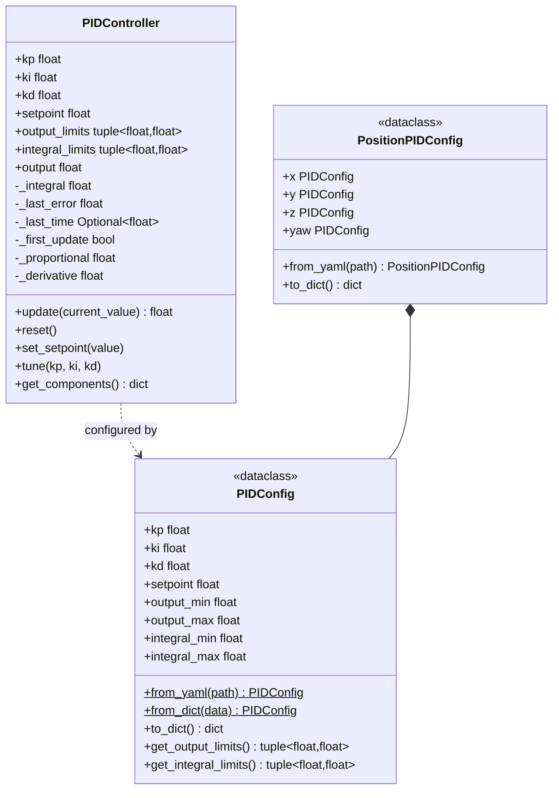

# Módulo do Controlador PID

Controlador PID configurável com anti-windup, clamping de saída e ajuste (tuning) baseado
em YAML, além de uma variante por eixo (`x`/`y`/`z`/`yaw`) para controle de posição.
Usado pelos métodos de PID do navigator, e também utilizável de forma independente para
qualquer malha de controle.

## Resumo rápido

```python
from nectar.control.pid import PIDController

pid = PIDController(kp=1.0, ki=0.1, kd=0.05, setpoint=2.0)
output = pid.update(current_value)   # control output, clamped to output_limits
```

## Conceitos

Um `PIDController` é configurado por um `PIDConfig` (carregável a partir de YAML); o
`PositionPIDConfig` agrupa um `PIDConfig` por eixo para `x`/`y`/`z`/`yaw`.



## PIDController

Implementação de PID padrão com anti-windup e clamping de saída.

### API

```python
from nectar.control.pid import PIDController

pid = PIDController(
    kp: float = 0.0,                      # Proportional gain
    ki: float = 0.0,                      # Integral gain
    kd: float = 0.0,                      # Derivative gain
    setpoint: float = 0.0,                # Target value
    output_limits: tuple = (-1.0, 1.0),   # Output clamp
    integral_limits: tuple = (-1.0, 1.0), # Anti-windup
    output_deadband: float = 0.0          # Symmetric output deadband (0 disables)
)
```

### Malha de controle

`PIDController.update()` implementa um PID em tempo discreto com anti-windup no termo
integral e clamping na saída:

$$
e_k = r - y_k
$$

$$
P_k = K_p \, e_k
$$

$$
I_k = \mathrm{clamp}\!\left(K_i \sum_{i=0}^{k} e_i \, \Delta t,\; I_{\min},\, I_{\max}\right)
$$

$$
D_k = K_d \frac{e_k - e_{k-1}}{\Delta t}
$$

$$
u_k = \mathrm{clamp}(P_k + I_k + D_k,\; u_{\min},\, u_{\max})
$$

Onde \(r\) é o setpoint (`setpoint`), \(y_k\) é a medição atual, \(\Delta t\) é o tempo
decorrido entre as chamadas (a partir de `time.time()`), e
\(\mathrm{clamp}(x, a, b) = \min(\max(x, a), b)\).

Um **deadband de saída** opcional (`output_deadband`) força \(u_k = 0\) quando
\(|u_k| < \mathrm{deadband}\) após o clamping.

```python
control_output = pid.update(current_value: float) -> float
```

### Métodos

```python
pid.update(current_value)              # Returns control output
pid.reset()                            # Clear integral, previous error
pid.set_setpoint(value)                # Change target
pid.tune(kp, ki, kd)                   # Update gains
pid.get_components()                   # Returns proportional, integral, derivative, output
```

## PIDConfig

Dataclass de configuração para PID de um único eixo.

```python
from nectar.control.pid import PIDConfig

config = PIDConfig(
    kp=0.5,
    ki=0.0,
    kd=0.0,
    output_min=-0.42,
    output_max=0.42,
    integral_min=-0.5,
    integral_max=0.5
)
```

### Carregando a partir de YAML

```yaml

# pid_config.yaml

kp: 0.5
ki: 0.0
kd: 0.0
output_min: -0.42
output_max: 0.42
integral_min: -0.5
integral_max: 0.5
```

```python
config = PIDConfig.from_yaml("pid_config.yaml")
```

### Carregando a partir de um dicionário

```python
config = PIDConfig.from_dict({
    "kp": 0.5,
    "output_min": -0.42,
    "output_max": 0.42
})
```

**Valores padrão**: campos não especificados usam os padrões (ki=0.0, kd=0.0, etc.).

## PositionPIDConfig

Configuração multi-eixo para controle de posição (X, Y, Z, yaw).

```python
from nectar.control.pid import PositionPIDConfig, PIDConfig

config = PositionPIDConfig(
    x=PIDConfig(kp=0.5, output_min=-0.42, output_max=0.42),
    y=PIDConfig(kp=0.5, output_min=-0.42, output_max=0.42),
    z=PIDConfig(kp=0.22, output_min=-0.15, output_max=0.1),
    yaw=PIDConfig(kp=0.5, ki=0.1, output_min=-0.2, output_max=0.2)
)
```

### Formato YAML

```yaml

# position_config.yaml

x:
  kp: 0.5
  ki: 0.0
  kd: 0.0
  output_min: -0.42
  output_max: 0.42
  integral_min: -0.5
  integral_max: 0.5

y:
  kp: 0.5
  output_min: -0.42
  output_max: 0.42

z:
  kp: 0.22
  output_min: -0.15
  output_max: 0.1

yaw:
  kp: 0.5
  ki: 0.1
  output_min: -0.2
  output_max: 0.2
  integral_min: -0.05
  integral_max: 0.05
```

```python
config = PositionPIDConfig.from_yaml("position_config.yaml")
```

## Uso no Controle do Drone

### Integração com ArduPilotDrone

Controladores PID criados por eixo a partir da configuração:

```python

# In VehicleNavigator.navigate_pid()

pid_x = self._create_pid("x")      # Creates from self._pid_config.x
pid_y = self._create_pid("y")
pid_z = self._create_pid("z")
pid_yaw = self._create_pid("yaw")

# Control loop

while True:
    dx, dy, dz, dyaw = self._compute_errors(target, yaw)

    vx = pid_x.update(-dx)
    vy = pid_y.update(-dy)
    vz = pid_z.update(-dz)
    vyaw = pid_yaw.update(-dyaw)

    drone.move_velocity(vx, vy, vz, vyaw)
```

### Carregamento da configuração

**Automático** — a config escolhe um preset por `is_indoor`:

| Modo | Preset carregado |
|------|---------------|
| Indoor (vision) | `ardupilot/config/position_indoor.yaml` |
| Outdoor (GPS) | `ardupilot/config/position_outdoor.yaml` |
| SITL | `position_sim_indoor.yaml` / `position_sim_outdoor.yaml` |

```python
config = MavrosConfig(pose_source=PoseSource.VISION)
drone = DroneFactory.create("mavros", config)
```

**Explícito**:

```python
config = MavrosConfig(
    pose_source=PoseSource.VISION,
    pid_config_file="/path/to/custom.yaml"
)
```

**Em runtime**:

```python
drone.set_pid_config("/path/to/config.yaml")
drone.set_pid_config(config_dict)
drone.set_pid_config(PositionPIDConfig(...))
```

## Diretrizes de Ajuste (Tuning)

### Ganho Proporcional (kp)

Controla a magnitude da resposta.

- **kp maior**: resposta mais rápida, overshoot potencial
- **kp menor**: resposta mais lenta, mais estável

- **Indoor**: 0.3-0.6 (a pose por visão é precisa)
- **Outdoor**: 0.6-1.0 (o ruído do GPS exige um ganho maior)

### Ganho Integral (ki)

Elimina o erro em regime permanente.

- **ki maior**: eliminação de erro mais rápida, instabilidade potencial
- **ki menor**: convergência mais lenta, mais estável

- **Típico**: 0.0-0.1 (frequentemente não é necessário para controle de posição)
- **Yaw**: 0.05-0.15 (ajuda com a deriva da bússola)

### Ganho Derivativo (kd)

Amortece oscilações e overshoot.

- **kd maior**: mais amortecimento, sensível a ruído
- **kd menor**: menos amortecimento, resposta mais suave

**Controle de posição**: geralmente 0.0 (os comandos de velocidade já fornecem
amortecimento)

### Limites de Saída

Limites do comando de velocidade (m/s para posição, rad/s para yaw).

- **Indoor**: ±0.4-0.6 m/s (seguro em espaço restrito)
- **Outdoor**: ±0.8-1.5 m/s (mais agressivo permitido)
- **Vertical**: ±0.15-0.8 m/s (assimétrico: subida mais lenta)

### Limites Integrais

Proteção anti-windup.

- **Típico**: 10-20% dos limites de saída
- **Propósito**: evitar que o termo integral acumule durante a saturação

## Configurações Padrão

### Indoor (baseado em visão)

```yaml
x:
  kp: 0.5
  output_min: -0.42
  output_max: 0.42

y:
  kp: 0.5
  output_min: -0.42
  output_max: 0.42

z:
  kp: 0.22
  output_min: -0.15
  output_max: 0.1

yaw:
  kp: 0.5
  ki: 0.1
  output_min: -0.2
  output_max: 0.2
```

**Racional**:

- Velocidades menores por segurança indoor
- Limites de Z assimétricos (subida mais lenta para evitar colisão com o teto)
- O termo integral do yaw compensa a deriva da pose por visão

### Outdoor (baseado em GPS)

```yaml
x:
  kp: 0.8
  output_min: -1.0
  output_max: 1.0

y:
  kp: 0.8
  output_min: -1.0
  output_max: 1.0

z:
  kp: 0.5
  output_min: -0.8
  output_max: 0.8

yaw:
  kp: 0.5
  ki: 0.1
  output_min: -0.3
  output_max: 0.3
```

**Racional**:

- Ganhos maiores compensam a latência e o ruído do GPS
- Limites de velocidade maiores para transições mais rápidas entre waypoints
- Limites de Z simétricos (ambiente outdoor aberto)

## Exemplos

### Controle PID Básico

```python
from nectar.control.pid import PIDController

altitude_pid = PIDController(
    kp=0.5,
    ki=0.1,
    kd=0.0,
    setpoint=10.0,
    output_limits=(-0.5, 0.5)
)

while True:
    current_altitude = get_altitude()
    vz = altitude_pid.update(current_altitude)
    set_velocity_z(vz)
```

### Controle de Posição com Configuração

```python
from nectar.control.pid import PositionPIDConfig

config = PositionPIDConfig.from_yaml("ardupilot/config/position_outdoor.yaml")

pid_x = PIDController(
    kp=config.x.kp,
    ki=config.x.ki,
    kd=config.x.kd,
    output_limits=config.x.get_output_limits(),
    integral_limits=config.x.get_integral_limits()
)
```

### Ajuste Durante o Voo

```python

# Start with conservative gains

drone.set_pid_config({
    "x": {"kp": 0.3, "output_min": -0.3, "output_max": 0.3},
    "y": {"kp": 0.3, "output_min": -0.3, "output_max": 0.3},
    "z": {"kp": 0.2, "output_min": -0.2, "output_max": 0.2}
})

drone.move_to(x=2.0, y=0.0, z=0.0)

# Increase gains if response too slow

drone.set_pid_config({
    "x": {"kp": 0.6, "output_min": -0.5, "output_max": 0.5},
    "y": {"kp": 0.6, "output_min": -0.5, "output_max": 0.5}
})

drone.move_to(x=-2.0, y=0.0, z=0.0)
```
