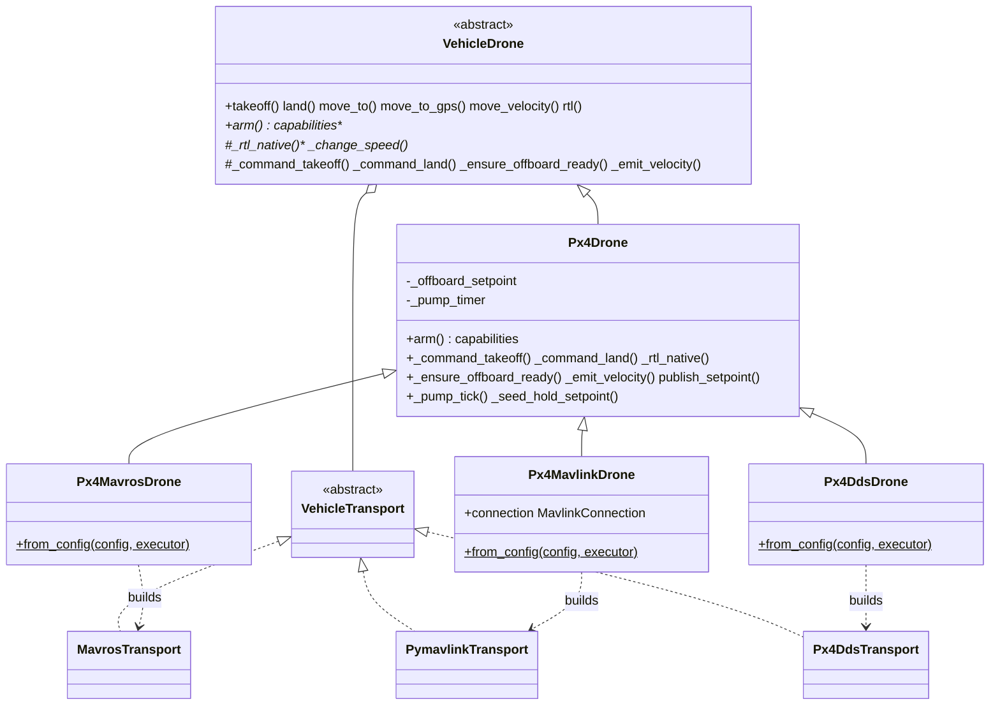

# Firmware PX4

Suporte a [PX4](https://px4.io/) construído sobre o [núcleo do veículo](../vehicle/) compartilhado. `Px4Drone` implementa a semântica de voo específica do PX4; a navegação agnóstica a transporte, o PID, o sequencer e a API de movimento são herdados sem alteração de `VehicleDrone`.

> Para a API pública do `Drone`, os métodos de navegação, as referências, as fontes de altitude e a detecção de takeoff/land, veja o [Núcleo do Veículo](../vehicle/). Esta página cobre apenas o que é específico do PX4.

## Papel

`Px4Drone` ([`drone.py`](https://github.com/Black-Bee-Drones/nectar-sdk/blob/main/nectar/nectar/control/px4/drone.py)) especializa o [`VehicleDrone`](https://github.com/Black-Bee-Drones/nectar-sdk/blob/main/nectar/nectar/control/vehicle/drone.py) para o PX4:

- **Controle offboard**: o PX4 só aceita o modo `OFFBOARD` — e só arma nele — enquanto os setpoints são transmitidos a mais de 2 Hz, e ele sai do offboard se o stream parar por ~500 ms ([offboard do PX4](https://docs.px4.io/main/en/ros2/offboard_control.html)). Um timer ROS de fundo (o *pump de offboard*) republica o último setpoint comandado a `offboard_rate_hz` (padrão 20 Hz), para que o veículo permaneça em offboard entre comandos explícitos de movimento.
- **Sequência de arme**: gera um setpoint de hold → transmite → troca para `OFFBOARD` → arma.
- **Takeoff**: sobe até um setpoint de posição em offboard (sem mudança de modo), reaproveitando a detecção de estabilização baseada em velocidade do [`FlightSequencer`](https://github.com/Black-Bee-Drones/nectar-sdk/blob/main/nectar/nectar/control/vehicle/sequencer.py).
- **Land / RTL**: modos `AUTO.LAND` / `AUTO.RTL` do PX4; altitude de RTL via `RTL_RETURN_ALT`, loiter-vs-land via `RTL_LAND_DELAY`.

`Px4Drone` é agnóstico a transporte; é combinado com um de três backends, de modo que uma missão roda sem alteração em qualquer um deles:

- `Px4MavrosDrone` (`px4`, [`mavros_drone.py`](https://github.com/Black-Bee-Drones/nectar-sdk/blob/main/nectar/nectar/control/px4/mavros_drone.py)) — `Px4Drone` sobre o [`MavrosTransport`](../mavros/), a mesma conectividade MAVROS que os drones ArduPilot usam, alcançada via `mavros px4.launch`.
- `Px4MavlinkDrone` (`px4_mavlink`, [`mavlink_drone.py`](https://github.com/Black-Bee-Drones/nectar-sdk/blob/main/nectar/nectar/control/px4/mavlink_drone.py)) — `Px4Drone` sobre o [`PymavlinkTransport`](../mavlink/) neutro em relação a firmware, com um `Px4ModeCodec`: um link MAVLink direto, sem MAVROS. Espelha o drone `mavlink` do ArduPilot.
- `Px4DdsDrone` (`px4_dds`, [`dds_drone.py`](https://github.com/Black-Bee-Drones/nectar-sdk/blob/main/nectar/nectar/control/px4/dds_drone.py)) — `Px4Drone` sobre o [`Px4DdsTransport`](https://github.com/Black-Bee-Drones/nectar-sdk/blob/main/nectar/nectar/control/px4/dds_transport.py), uORB nativo do PX4 sobre uXRCE-DDS (veja abaixo).

O encode de modo de voo do PX4 para os backends MAVLink vive uma única vez em [`modes.py`](https://github.com/Black-Bee-Drones/nectar-sdk/blob/main/nectar/nectar/control/px4/modes.py) (`MODE_TO_PX4` + `px4_mode_name`), compartilhado por `Px4ModeCodec` e `Px4DdsTransport`.

## Arquitetura



## Modos de voo

[Modos de voo](https://docs.px4.io/main/en/flight_modes_mc/) do PX4 usados por este SDK (strings `custom_mode` do MAVROS):

| Modo | Uso |
|------|-----|
| `OFFBOARD` | Controle por setpoint do computador de bordo (move_to / move_velocity). Exigido para a navegação do SDK. |
| `AUTO.LAND` | Pousa na posição atual (`land()`). |
| `AUTO.RTL` | Retorno ao ponto de lançamento (`rtl(method=NATIVE)`). |

Diferente do modo `GUIDED` único do ArduPilot, o PX4 separa o controle offboard dos modos autônomos de takeoff/land/RTL, e o offboard exige o stream contínuo de setpoint descrito acima.

## Capacidades

`Px4Drone.capabilities` é derivado a partir da `pose_source` configurada (veja [`capabilities.py`](https://github.com/Black-Bee-Drones/nectar-sdk/blob/main/nectar/nectar/control/capabilities.py)): `PID_NAV`, `LOCAL_SETPOINT`, `VELOCITY_BODY`/`WORLD`/`TAKEOFF`, `ACTUATOR`, `GRIPPER`, `PARAMS`, `NATIVE_RTL`, `OBSTACLE_AVOIDANCE`, `RANGEFINDER`, `DISTANCE_SENSORS`, além de `GPS_NAV`/`GLOBAL_SETPOINT` (outdoor) ou `VISION_POSE` (indoor). O PX4 declara `ACTUATOR` (`DO_SET_ACTUATOR`) e `GRIPPER` (`DO_GRIPPER`) para payloads, mas não o caminho de PWM por canal `SERVO` (`do_servo`) do ArduPilot; veja [Atuadores de payload](#atuadores-de-payload-gripper).

## Visão indoor / externa (EKF2)

Para voo sem GPS, `pose_source=PoseSource.VISION` faz o SDK ler a pose local fundida do FCU, para navegação PID do lado do computador de bordo. A pose externa em si é alimentada ao FCU pela ponte separada de [localization](localization/) (`vision_pose.launch.py backend:=mavros|mavlink|dds`), que envia `VISION_POSITION_ESTIMATE` (ou `VehicleOdometry` no DDS). O EKF2 do PX4 funde isso quando `EKF2_EV_CTRL` / `EKF2_HGT_REF` estão definidos, o GNSS está desabilitado (`EKF2_GPS_CTRL=0`), e o stream está a 30–50 Hz (o PX4 rejeita taxas muito baixas — muito mais rígido que o ≥4 Hz do ArduPilot).

**SITL:** `ENV=indoor` voa o `x500_nectar` na mesma arena `indoor_room_px4` compartilhada, com `gz_vision_source` espelhando os tópicos cuVSLAM de hardware (mesmo padrão do indoor do ArduPilot). Os parâmetros são carregados de `simulation/params/px4_indoor.env`. Veja [Localization → SITL](localization/#sitl).

**Hardware:** os voos de competição até hoje são em ArduPilot; a tabela de parâmetros do PX4 é baseada na documentação do PX4 / no tutorial VSLAM-UAV, e está pronta para uma migração para Pixhawk — valide na sua aeronave antes do uso em competição. Conjunto completo de parâmetros e equivalentes no ArduPilot: [Localization → FCU setup](localization/#fcu-setup).

## Configuração

```python
import nectar
from nectar.control import DroneFactory, Px4MavrosConfig, PoseSource

nectar.init()

config = Px4MavrosConfig(
    pose_source=PoseSource.GPS,                   # GPS (outdoor) or VISION (indoor)
    connection_string="udp://:14540@127.0.0.1:14580",  # PX4 SITL offboard API
    offboard_rate_hz=20.0,                        # setpoint stream rate (>2 Hz)
)
drone = DroneFactory.create("px4", config)
```

`Px4MavrosConfig` carrega os nomes de tópico do MAVROS (idênticos ao `MavrosConfig`), `connection_string` (um `fcu_url` do MAVROS), `offboard_rate_hz`, `mavros_launch` (padrão `px4.launch`), e os campos de config de setpoint `setpoint_config_file` / `apply_setpoint_params` (veja abaixo).

**Presets de SITL** (em [`config.py`](https://github.com/Black-Bee-Drones/nectar-sdk/blob/main/nectar/nectar/control/config.py)): `PX4_SITL_CONFIG`, `PX4_SITL_GAZEBO_CONFIG`, `PX4_SITL_VISION_CONFIG`, `PX4_MAVLINK_SITL_VISION_CONFIG`, `PX4_DDS_SITL_VISION_CONFIG`.

## Configuração de setpoint (velocidade / aceleração)

O análogo, no PX4, dos parâmetros WPNAV do ArduPilot é a família `MPC_*` do controlador de posição multicoptero. [`Px4SetpointConfig`](https://github.com/Black-Bee-Drones/nectar-sdk/blob/main/nectar/nectar/control/px4/setpoint_config.py) carrega limites SI de velocidade/aceleração/jerk e os mapeia para `MPC_*` (veja os [Diagramas de Controlador do PX4](https://docs.px4.io/main/en/flight_stack/controller_diagrams) e a [Referência de Parâmetros](https://docs.px4.io/main/en/advanced/parameter_reference)):

| Campo | Parâmetro PX4 | Significado |
|-------|-----------|---------|
| `speed` | `MPC_XY_CRUISE` | Velocidade de cruzeiro horizontal |
| `vel_max` | `MPC_XY_VEL_MAX` | Limite máximo de velocidade horizontal (elevado para ≥ `speed`) |
| `speed_up` / `speed_down` | `MPC_Z_VEL_MAX_UP` / `MPC_Z_VEL_MAX_DN` | Velocidade de subida / descida |
| `accel` | `MPC_ACC_HOR` | Aceleração horizontal |
| `accel_up` / `accel_down` | `MPC_ACC_UP_MAX` / `MPC_ACC_DOWN_MAX` | Aceleração vertical |
| `jerk` | `MPC_JERK_AUTO` | Limite de jerk de trajetória |
| `yaw_rate` | `MPC_YAWRAUTO_MAX` | Taxa de yaw automática (graus/s) |
| `takeoff_speed` | `MPC_TKO_SPEED` | Velocidade de subida no takeoff |

Esses parâmetros governam os caminhos de setpoint **POSITION / POSITION_GLOBAL** e a subida de takeoff em offboard do PX4. O caminho padrão **PID / PID_EKF** não é afetado — nele o SDK computa a velocidade e o limite é o clamp de saída do PID por eixo (veja o [núcleo do veículo](../vehicle/#configuracao-de-pid)), idêntico ao ArduPilot.

Definido via config (`apply_setpoint_params=True` envia os parâmetros ao FCU em `arm()`) ou em runtime; `set_speed` muda um único eixo em tempo real:

```python
from nectar.control import DroneFactory, Px4MavrosConfig, Px4SetpointConfig

drone = DroneFactory.create("px4", Px4MavrosConfig(
    setpoint_config_file="setpoint_outdoor.yaml", apply_setpoint_params=True,
))
drone.set_setpoint_config({"speed": 3.0, "accel": 2.5})  # push MPC_* to the FCU
drone.set_speed(2.0, "horizontal")                        # live: MPC_XY_CRUISE/VEL_MAX
```

Presets embutidos vivem no [diretório `config/`](https://github.com/Black-Bee-Drones/nectar-sdk/tree/main/nectar/nectar/control/px4/config) (`setpoint_outdoor.yaml`, `setpoint_indoor.yaml`, e as variantes de SITL `setpoint_sim_*`).

> **Limitação:** o backend nativo uXRCE-DDS (`px4_dds`) não consegue definir parâmetros, então `apply_setpoint_params` / `set_setpoint_config` / `set_speed` são no-ops nele — use o backend MAVROS ou MAVLink direto, ou defina os parâmetros `MPC_*` no QGC.

## Atuadores de payload / gripper {#atuadores-de-payload-gripper}

Para payloads (por exemplo, um gancho de liberação), use a API neutra em relação a firmware, em qualquer backend:

```python
drone.set_gripper(grab=False)        # MAV_CMD_DO_GRIPPER: release (grab=True closes)
drone.set_actuator(index=1, value=1.0)  # MAV_CMD_DO_SET_ACTUATOR: normalized -1..1
```

O PX4 mapeia isso para as funções de saída `Gripper` e `Peripheral Actuator Set` configuradas em [Actuators](https://docs.px4.io/main/en/config/actuators.html) / [Servo Gripper](https://docs.px4.io/main/en/peripherals/gripper_servo.html). O `do_servo(channel, pwm)` por canal do ArduPilot não está disponível no PX4 (ele não declara a capacidade `SERVO`); `set_actuator` / `set_gripper` são os substitutos portáveis.

## Requisitos

Um `mavros_node` precisa estar fazendo a ponte com o FCU do PX4. O transporte o inicia para você quando `Px4MavrosConfig.start_driver=True`:

```
ros2 launch mavros px4.launch fcu_url:=<connection_string>
```

Para o SITL do PX4, a API MAVLink de offboard fica na UDP 14540 (`udp://:14540@127.0.0.1:14580`); em hardware, use o `fcu_url` serial/UDP apropriado.

## Simulação

SITL do PX4 com Gazebo (o próprio PX4 inicia o Gazebo), via a CLI unificada de simulação:

**Terminal 1 — PX4 SITL + Gazebo** (mundo outdoor compartilhado do Nectar + `x500_nectar`, offboard na UDP 14540; sensores correspondentes `/front_camera/*`, `/down_camera`, e o lidar voltado para baixo em `/mavros/rangefinder/rangefinder`):

```bash
make sim-start FIRMWARE=px4 ENV=outdoor
```

**Terminal 2 — MAVROS + pontes de câmera**:

```bash
make sim-bridge FIRMWARE=px4 ENV=outdoor
```

**Rodar um script** (backend MAVROS):

```bash
python3 basic.py --drone px4
```

Para o backend pymavlink direto, retire o MAVROS no Terminal 2 e use o drone
`px4_mavlink` (ele mesmo se conecta à UDP 14540; o rangefinder chega como
`DISTANCE_SENSOR` do MAVLink, câmeras via `ros_gz_bridge`):

```bash
make sim-bridge FIRMWARE=px4 ENV=outdoor PROTOCOL=mavlink   # cameras only, no MAVROS
python3 basic.py --drone px4_mavlink --connection udp:0.0.0.0:14540
```

`make sim-start FIRMWARE=px4 ENV=outdoor` voa o PX4 na mesma arena de
`make sim-start FIRMWARE=ardupilot ENV=outdoor`, com os mesmos tópicos de sensor, então
as missões são agnósticas a firmware. Instale uma vez com `make sim-install FIRMWARE=px4`.
Veja o [guia de Simulação](../../simulation/) para a arquitetura de mundo compartilhado.

## Uso

```python
import nectar
from nectar.control import DroneFactory, PX4_SITL_GAZEBO_CONFIG

nectar.init()
drone = DroneFactory.create("px4", PX4_SITL_GAZEBO_CONFIG)

drone.takeoff(altitude=3.0)
drone.move_to(x=5.0, y=0.0, z=0.0, precision=0.3)
drone.move_to_gps(latitude=-22.413, longitude=-45.449, altitude=15.0)
drone.rtl(land=True)
nectar.shutdown()
```

## Caminho nativo uXRCE-DDS (`px4_dds`)

Um segundo transporte alcança o PX4 diretamente por sua [ponte uXRCE-DDS](https://docs.px4.io/main/en/ros2/user_guide.html), usando [`px4_msgs`](https://github.com/PX4/px4_msgs) — sem MAVROS. `Px4DdsDrone` é `Px4Drone` sobre um [`Px4DdsTransport`](https://github.com/Black-Bee-Drones/nectar-sdk/blob/main/nectar/nectar/control/px4/dds_transport.py):

- Telemetria em `/fmu/out/*` (`VehicleLocalPosition`, `VehicleStatus`, `VehicleGlobalPosition`), com a QoS `sensor_data` que o PX4 exige.
- Comandos via `/fmu/in/vehicle_command` (`VehicleCommand`); setpoints via `/fmu/in/offboard_control_mode` + `/fmu/in/trajectory_setpoint`.
- O NED/FRD do PX4 é convertido de/para o ENU/FLU do núcleo, no transporte.

A visão externa indoor usa o mesmo link DDS: o backend `dds` de localization publica `px4_msgs/VehicleOdometry` em `/fmu/in/vehicle_visual_odometry` para o EKF2 (`ros2 launch nectar vision_pose.launch.py backend:=dds`). Veja [Localization](localization/#backends).

Requisitos (uma vez) — compila o `px4_msgs` e o agent (contra o Fast-DDS do ROS):

```bash
make sim-install FIRMWARE=px4 ARGS=--native
```

Uso — 3 terminais (o SITL do PX4 inicia o cliente uXRCE-DDS por conta própria):

**Terminal 1 — PX4 SITL + Gazebo**:

```bash
make sim-start FIRMWARE=px4 ENV=outdoor
```

**Terminal 2 — agent uXRCE-DDS** (`MicroXRCEAgent udp4 -p 8888`):

```bash
make sim-bridge FIRMWARE=px4 ENV=outdoor PROTOCOL=dds
```

**Rodar um script**:

```bash
python3 nectar/nectar/examples/control/basic.py --drone px4_dds --env outdoor
```

```python
from nectar.control import DroneFactory, PX4_DDS_SITL_CONFIG
drone = DroneFactory.create("px4_dds", PX4_DDS_SITL_CONFIG)
```

Notas / limitações:

- **Tópicos versionados**: o PX4 versiona alguns tópicos uORB (por exemplo, `vehicle_local_position_v1`, `vehicle_status_v4`). `Px4DdsConfig` expõe `local_position_topic` / `status_topic` / `global_position_topic` (os padrões acompanham o `main` atual do PX4); sobrescreva-os para casar com um firmware diferente. `px4_msgs` precisa ser o branch que corresponde à sua release do PX4.
- `set_param` não é encaminhado pela uXRCE-DDS por padrão (use o QGC ou o caminho MAVROS); `rtl(method=NATIVE)` nativo ainda troca para `AUTO.RTL`, mas não consegue enviar `RTL_RETURN_ALT`.
- Setpoints globais (GPS) são apenas de frame local no caminho nativo; use um método PID ou o caminho MAVROS para `move_to_gps` com `POSITION_GLOBAL`.
- Setups sem sudo: se o agent for instalado em um prefixo de usuário em vez de `/usr/local`, adicione o diretório de lib dele ao `LD_LIBRARY_PATH` (a instalação `--native` usa `sudo make install` + `ldconfig`, o que evita isso).

## Referências

- [PX4 User Guide](https://docs.px4.io/) · [Basic Concepts](https://docs.px4.io/main/en/getting_started/px4_basic_concepts.html)
- [Flight Modes (Multicopter)](https://docs.px4.io/main/en/flight_modes_mc/) · [Basic Flying (MC)](https://docs.px4.io/main/en/flying/basic_flying_mc.html)
- [ROS 2 User Guide](https://docs.px4.io/main/en/ros2/) · [ROS 2 Offboard Control](https://docs.px4.io/main/en/ros2/offboard_control.html)
- [PX4 Simulation](https://docs.px4.io/main/en/simulation/) · [Gazebo Simulation](https://docs.px4.io/main/en/sim_gazebo_gz/)
- Lógica de voo compartilhada: [Núcleo do veículo](../vehicle/) · Conectividade MAVROS: [Transporte MAVROS](../mavros/)
