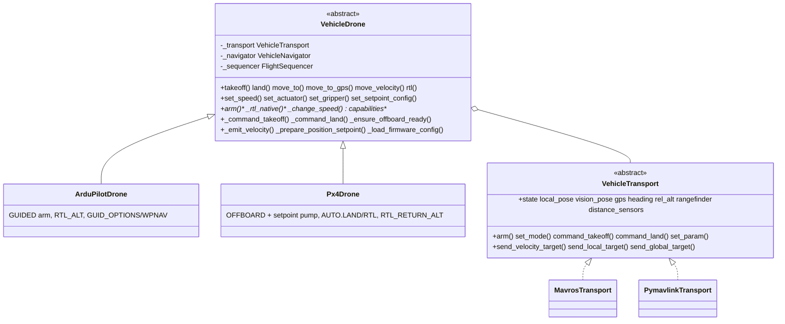
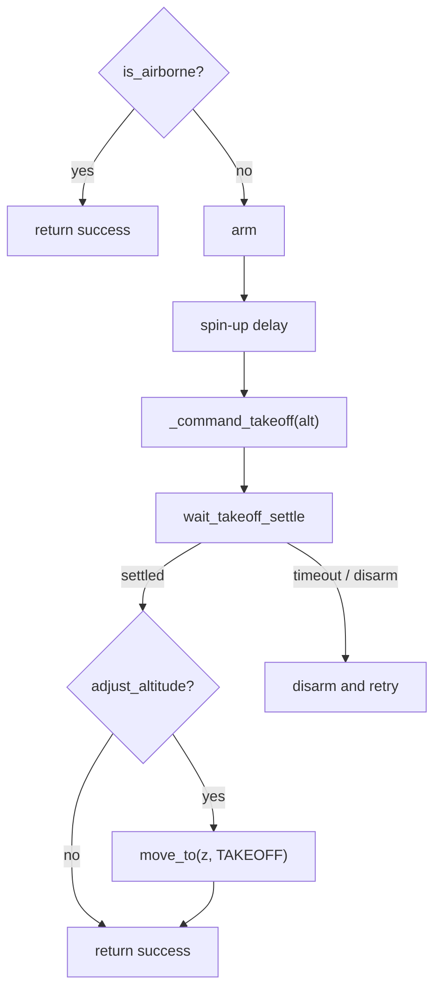
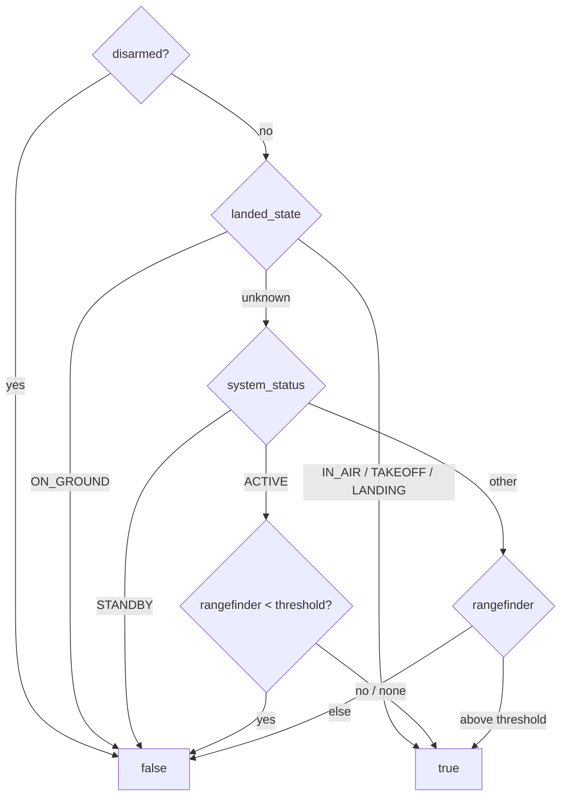
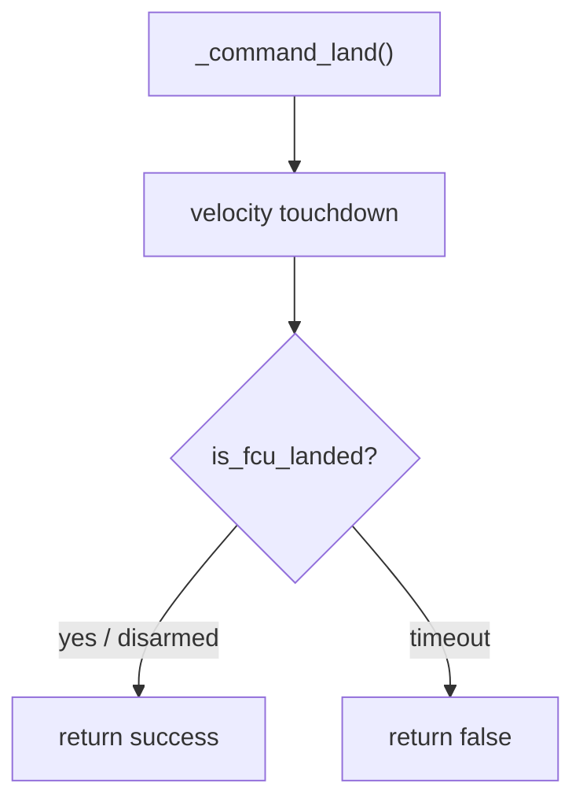
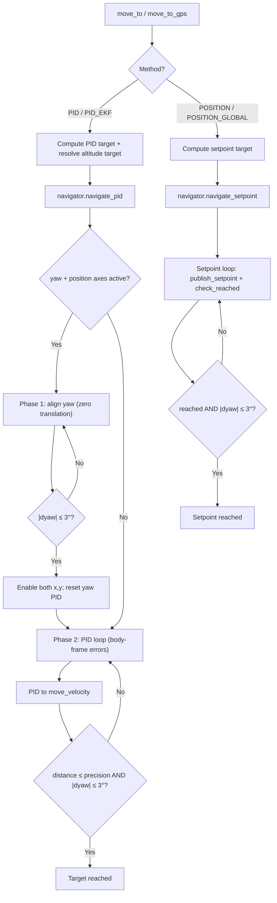

# Núcleo do Veículo

Lógica de voo agnóstica a firmware, compartilhada por todo autopiloto da classe MAVLink no SDK. ArduPilot e PX4 são o **mesmo comportamento de veículo, alcançado por meio de semânticas de firmware e transportes diferentes** — toda a navegação, a detecção de takeoff/land, a matemática de GPS, o controle PID e a API de movimento vivem aqui uma única vez. As especializações de firmware ([ardupilot](../ardupilot/), [px4](../px4/)) implementam apenas as partes que diferem; os transportes ([mavros](../mavros/), [mavlink](../mavlink/)) implementam apenas a conectividade on-wire.

> Este README é a referência do comportamento compartilhado — métodos de navegação, frames de referência, fontes de altitude, detecção de takeoff/land, tratamento de GPS/EGM96 e configuração de PID — e se aplica a todo veículo (tanto ArduPilot quanto PX4). As semânticas específicas de cada firmware estão em [ArduPilot](../ardupilot/) (GUIDED, WPNAV/GUID_OPTIONS, parâmetros nativos de RTL) e [PX4](../px4/) (OFFBOARD, nomes de modo, parâmetros de RTL).

## Design

Uma **ponte** (bridge) de dois eixos: uma classe de semântica de firmware (subclasse de `VehicleDrone`) é composta com um `VehicleTransport` de protocolo on-wire. O lado drone possui a orquestração de voo sobre tipos simples, sem ROS ([`types.py`](https://github.com/Black-Bee-Drones/nectar-sdk/blob/main/nectar/nectar/control/vehicle/types.py)); o lado transporte converte esses tipos de/para seu formato on-wire (tópicos/serviços ROS, MAVLink puro ou uXRCE-DDS). Assim, a mesma lógica de voo serve ArduPilot e PX4 sobre MAVROS ou um link direto, sem duplicação.



## Módulos

| Arquivo | Responsabilidade |
| --- | --- |
| `types.py` | Dataclasses simples (`Vec3`, `LocalPose`, `GeoPoint`, `Attitude`, `VehicleState`, `LocalTarget`, `GlobalTarget`, `TargetFrame`). Convenções ENU/radianos. Sem imports de ROS. |
| `transport.py` | ABC `VehicleTransport`: propriedades de leitura de telemetria + métodos de escrita de comando/setpoint + ciclo de vida. |
| `setpoint_config.py` | `SetpointConfig` base — limites SI de velocidade/aceleração/jerk, I/O compartilhado de YAML/dict e clamp de faixa; `to_fcu_params` por firmware (ArduPilot `WPNAV_*`, PX4 `MPC_*`). |
| `drone.py` | `VehicleDrone(BaseDrone)` — comportamento de voo compartilhado + hooks de firmware. |
| `navigator.py` | `VehicleNavigator` — loops de navegação por PID e por setpoint sobre alvos/poses simples. |
| `target_computer.py` | Computação de alvo sem estado (offsets locais/GPS → `LocalTarget`/`GlobalTarget`). |
| `gps_utils.py` | Correção do geoide EGM96, verificações geodésicas de chegada, construção de alvo global. |
| `sequencer.py` | `FlightSequencer` — detecção de estabilização de takeoff/land baseada em velocidade. |

## Hooks de firmware

`VehicleDrone` mantém toda a orquestração e delega as partes específicas de firmware a hooks sobrescrevíveis:

| Hook | Padrão | ArduPilot | PX4 |
|------|---------|-----------|-----|
| `arm()` | abstrato | GUIDED + parâmetros WPNAV (opcional) | OFFBOARD + pump de setpoint |
| `_command_takeoff(alt)` | `command_takeoff` do transporte | comando de takeoff do FCU | setpoint de subida em offboard |
| `_command_land()` | `command_land` do transporte | comando de land do FCU | `AUTO.LAND` |
| `_rtl_native(alt, land)` | abstrato | `RTL_ALT`/`RTL_ALT_FINAL` + modo `RTL` | `RTL_RETURN_ALT`/`RTL_LAND_DELAY` + `AUTO.RTL` |
| `_ensure_offboard_ready()` | no-op | no-op (GUIDED persiste) | (re)entra em OFFBOARD, mantém o pump vivo |
| `_prepare_position_setpoint(p)` | no-op | sincroniza `WPNAV_RADIUS` | no-op |
| `_emit_velocity(...)` | envio do transporte | envio do transporte | também armazena para o pump de offboard |
| `_change_speed(v, axis)` | abstrato | `DO_CHANGE_SPEED` | parâmetro `MPC_XY_CRUISE`/`MPC_Z_VEL_MAX_*` |
| `_load_firmware_config()` | carrega a config de setpoint | + contabilidade de raio | + inicia o pump de offboard |
| `_apply_setpoint_config()` | `set_param` por parâmetro (+alias) | WPNAV cm/s + alias `WP_*` | `MPC_*` (SI) |
| `capabilities` | abstrato | declara o conjunto do ArduPilot | declara o conjunto do PX4 |

## Convenções

- **Frames**: o núcleo é ENU (x=Leste, y=Norte, z=Cima) / FLU; os transportes convertem de/para o NED/FRD on-wire.
- **Yaw**: radianos, ENU (0 = Leste, positivo no sentido anti-horário). O *heading* da bússola (graus, NED) é mantido separado para a matemática de corpo em GPS.
- **Atomicidade**: as propriedades de telemetria retornam o valor mais recente por atribuição de objeto inteiro (atômica sob o GIL), então a thread de voo nunca vê uma pose parcialmente escrita.

## Conexão e Prontidão

`connect()` não retorna assim que o transporte inicia — ele espera (até um timeout) por um heartbeat vivo do FCU, definindo `_connected` somente quando o link estiver de pé. Depois de conectar:

- `is_fcu_connected` — heartbeat do FCU presente (estado bruto do link).
- `is_ready` — conectado **e** o driver/transporte está em execução; este é o portão que as chamadas de nível mais alto verificam antes de armar ou comandar.

## Tipos de Altitude

O FCU expõe [várias definições de altitude](https://ardupilot.org/copter/docs/common-understanding-altitude.html); o SDK escolhe entre elas com `AltitudeSource`:

| Tipo | Descrição | Fonte | Uso no SDK |
|------|-------------|--------|-----------|
| **AGL** (Above Ground Level) | Distância até o solo diretamente abaixo | Rangefinder (lidar) | `AltitudeSource.LIDAR`, terrain following |
| **Relativa** | Altitude acima de HOME/ORIGIN | EKF (baro + GPS) | `AltitudeSource.REL_ALT`, `move_to_gps` |
| **AMSL** (Above Mean Sea Level) | Altitude acima do nível médio do mar | EKF + modelo de geoide | Setpoints globais |
| **Elipsoide (WGS84)** | Altitude de GPS bruta acima do elipsoide WGS84 | Receptor GPS | `GeoPoint.altitude` bruto |
| **Vision Z** | Z da pose de visão, relativo à origem de visão | VIO externo | `AltitudeSource.VISION`, navegação indoor |

**AMSL vs Elipsoide**: receptores GPS emitem altitude acima do elipsoide WGS84, mas setpoints globais esperam AMSL. A diferença é a [altura do geoide](https://en.wikipedia.org/wiki/EGM96), corrigida por `GPSUtils` usando o modelo EGM96.

**Surface Tracking**: com um [rangefinder voltado para baixo](https://ardupilot.org/copter/docs/common-rangefinder-landingpage.html) dentro do alcance, o FCU consegue manter AGL constante ([surface tracking do ArduPilot](https://ardupilot.org/copter/docs/terrain-following.html)). `AltitudeSource.LIDAR` implementa um conceito semelhante no nível do SDK, via controle PID.

## Frames de Coordenadas

O FCU usa **NED** (Norte-Leste-Baixo) / **FRD** (Frente-Direita-Baixo) internamente. O núcleo do SDK usa **ENU** (Leste-Norte-Cima) / **FLU** (Frente-Esquerda-Cima). O transporte realiza a conversão na saída/entrada — **o código do SDK sempre usa ENU/FLU**.

| Frame | SDK (ENU/FLU) | FCU Interno (NED/FRD) | Origem |
|-------|---------------|------------------------|--------|
| **Mundo** | X=Leste, Y=Norte, Z=Cima | X=Norte, Y=Leste, Z=Baixo | Origem do EKF |
| **Corpo** | X=Frente, Y=Esquerda, Z=Cima | X=Frente, Y=Direita, Z=Baixo | Centro do veículo |
| **WGS84** | Latitude, Longitude, Altitude | Igual | Elipsoide de referência da Terra |

O enum `MoveReference` do SDK mapeia para um `TargetFrame` on-wire:

| MoveReference | TargetFrame | Significado da velocidade (entrada do SDK) |
|---|---|---|
| **BODY** | BODY (FRAME_BODY_NED) | vx=frente, vy=esquerda, vz=cima (relativo ao heading) |
| **WORLD** | LOCAL (FRAME_LOCAL_NED) | vx=leste, vy=norte, vz=cima (direções absolutas) |
| **TAKEOFF** | BODY (FRAME_BODY_NED) | Velocidades no heading de takeoff, rotacionadas para o frame de corpo atual |

> **Nota:** o frame local do EKF precisa de uma origem — outdoor, o GPS geralmente a define;
> indoor, sem fix de GPS, o ArduPilot precisa de uma origem manual (ou gravada
> automaticamente em 4.7+) antes que comandos de pose local / `FRAME_LOCAL_NED`
> funcionem. Detalhes:
> [Localization → Origem do EKF](localization/#ekf-origin).

## Sensores de Distância

`rangefinder` / `AltitudeSource.LIDAR` expõe apenas o sensor voltado para baixo, usado para altitude. Todo rangefinder e setor de proximidade que o FCU reporta (uma mensagem `DISTANCE_SENSOR` por unidade) também fica disponível como telemetria bruta, para detecção de obstáculos, redundância ou verificação:

- `drone.distance_sensors` — `dict[int, DistanceReading]` indexado pelo id do sensor MAVLink, contendo a leitura mais recente por sensor.
- `drone.get_distance(orientation)` — o `DistanceReading` mais recente voltado para uma dada `SensorOrientation`, ou `None`.

`SensorOrientation` espelha os valores de [MAV_SENSOR_ORIENTATION](https://mavlink.io/en/messages/common.html#MAV_SENSOR_ORIENTATION) usados para sensores de distância: `FORWARD`, os setores de yaw (`FORWARD_RIGHT`, `RIGHT`, `BACK_RIGHT`, `BACK`, `BACK_LEFT`, `LEFT`, `FORWARD_LEFT`), `UP`, `DOWN` e `OTHER`. Cada `DistanceReading` carrega `distance`, `orientation`, `min_distance` / `max_distance`, `sensor_id`, `sensor_type` ([MAV_DISTANCE_SENSOR](https://mavlink.io/en/messages/common.html#MAV_DISTANCE_SENSOR)), `signal_quality` (quando reportado), `raw_orientation` e um `timestamp` monotônico.

A configuração do sensor é feita do lado do FCU (por exemplo, `RNGFNDx_*` do ArduPilot, [configuração de rangefinder](https://ardupilot.org/copter/docs/common-rangefinder-setup.html) e, para setores horizontais, `PRXx_*` [sensores de proximidade](https://ardupilot.org/copter/docs/common-proximity-landingpage.html)). O sensor voltado para baixo (`SensorOrientation.DOWN`) também atualiza `rangefinder`. O transporte MAVLink direto coleta todas as leituras automaticamente; o transporte MAVROS exige que elas sejam declaradas em config (veja o [README do MAVROS](../mavros/#sensores-de-distancia)).

## Decolagem e Pouso

[`FlightSequencer`](https://github.com/Black-Bee-Drones/nectar-sdk/blob/main/nectar/nectar/control/vehicle/sequencer.py) trata estabilização de subida/descida e a checagem de voo. A estabilização usa velocidade vertical `|dz/dt|` numa janela curta para que picos de rangefinder/EKF/visão (±0,2–0,3 m) não reiniciem a detecção. Após o toque por velocidade, `land()` espera confirmação de pouso do FCU antes de retornar, para que um `takeoff()` seguinte não seja curto-circuitado com o veículo ainda no solo.

### Decolagem

```python
drone.takeoff(altitude=1.5)  # defaults: max_retries=2, adjust_altitude=True, precision=0.12m, timeout=25s
drone.takeoff(altitude=2.0, adjust_altitude=False)
```



Por tentativa: arme (guided/offboard do firmware), `_SPIN_UP_DELAY`, captura da pose de takeoff só na primeira tentativa, `_command_takeoff` (comando FCU no ArduPilot; setpoint de subida offboard no PX4), depois `wait_takeoff_settle`. Ajuste opcional com `move_to(z=altitude, reference=TAKEOFF)` se `adjust_altitude=True`. Progresso da subida ~1 Hz.

**Estabilização** exige: subida ≥ `_LIFTOFF_DELTA`; altitude ≥ `target_alt - min(_SETTLE_ALT_TOLERANCE, _SETTLE_ALT_FRACTION × climb)`; `|vz|` médio em `_SETTLE_WINDOW` abaixo de `_SETTLE_VELOCITY`.

**Retries**: sem levantamento (ou desarme no meio) → desarma e tenta de novo. Estabilizado com `height_gain < _LIFTOFF_DELTA` e `is_airborne` verdadeiro é aceito.

### Checagem de voo (`is_airborne`)

Usada pelo atalho de takeoff. Prioridade alinhada ao [MAVSDK `Telemetry::in_air`](https://mavsdk.mavlink.io/) ([`MAV_LANDED_STATE`](https://mavlink.io/en/messages/common.html#MAV_LANDED_STATE)):



MAVROS / MAVLink direto pedem `EXTENDED_SYS_STATE` via `SET_MESSAGE_INTERVAL` (o ArduPilot não publica por padrão). Sem `landed_state`, só o rangefinder entra no gate — não visão nem `rel_alt`.

| Constante | Padrão | Significado |
|---|---|---|
| `_SPIN_UP_DELAY` | 2,7 s | Delay pós-arme antes do comando de takeoff |
| `_LIFTOFF_DELTA` | 0,08 m | Subida acima de `start_alt` para considerar levantado |
| `_SETTLE_WINDOW` | 0,8 s | Janela da velocidade vertical média |
| `_SETTLE_VELOCITY` | 0,25 m/s | Magnitude da velocidade vertical abaixo da qual a subida estabilizou |
| `_SETTLE_POLL` | 0,1 s | Intervalo de poll dos loops |
| `_SETTLE_LOG_INTERVAL` | 1,0 s | Throttle do log de subida |
| `_SETTLE_ALT_TOLERANCE` | 0,5 m | Faixa máxima abaixo do alvo |
| `_SETTLE_ALT_FRACTION` | 0,3 | Fração da subida usada como faixa |
| `_AIRBORNE_THRESHOLD` | 0,9 m | Gate AGL de lidar sem `landed_state` e status ACTIVE |

Lidar ruidoso ou subida lenta: aumente `_SETTLE_VELOCITY` ou reduza `_SETTLE_WINDOW`.

### Pouso

```python
drone.land()              # default timeout=60s
drone.land(timeout=45.0)
```



1. Captura `start_alt`, envia `_command_land()` (land FCU no ArduPilot, `AUTO.LAND` no PX4).
2. **Toque por velocidade**: desceu (`start_alt - alt > _LIFTOFF_DELTA` ou `alt < _LANDED_THRESHOLD`) e taxa de descida em `_LAND_SETTLE_WINDOW` abaixo de `_LAND_STOP_VELOCITY`, ou desarmado.
3. **Confirmação FCU** (`is_fcu_landed`): `landed_state == ON_GROUND`, ou `STANDBY`, ou desarmado. Transportes sem estado de voo MAVLink aceitam o toque. Não espera `DISARM_DELAY`.

`land()` pode retornar `True` ainda armado (`ON_GROUND` / `STANDBY` durante `DISARM_DELAY`). Um `takeoff()` seguinte é válido porque `is_airborne` é falso. Use `drone.is_armed` se o chamador precisar dos motores desligados.

| Constante | Padrão | Significado |
|---|---|---|
| `_LANDED_THRESHOLD` | 0,3 m | Fallback absoluto de “já baixo” |
| `_LAND_SETTLE_WINDOW` | 1,2 s | Janela da taxa de descida |
| `_LAND_STOP_VELOCITY` | 0,05 m/s | Taxa que conta como toque |

| Sintoma | Ajuste |
|---|---|
| Timeout em descida muito lenta (< 0,1 m/s) | baixe `_LAND_STOP_VELOCITY` |
| Toque com descida ainda rápida | suba `_LAND_STOP_VELOCITY` |
| Ruído de propwash no solo | suba `_LAND_SETTLE_WINDOW` |
| Detecção mais rápida com sensor estável | baixe `_LAND_SETTLE_WINDOW` |
| Timeout esperando pouso FCU após o toque | suba `land(timeout=...)`; cheque o land detector do FCU |

ACK de arme/takeoff no MAVLink direto: [transporte MAVLink](mavlink.md#command-acknowledgements).

## Navegação

A navegação vive em [`VehicleNavigator`](https://github.com/Black-Bee-Drones/nectar-sdk/blob/main/nectar/nectar/control/vehicle/navigator.py), mantendo as classes de drone focadas na interface de firmware/hardware, nos dados de sensor e na computação de alvo.

`move_to` e `move_to_gps` aceitam `method: NavigationMethod` (padrões: `move_to` → `PID_EKF`, `move_to_gps` → `PID`). `rtl` aceita `method: RTLMethod` (padrão `NAVIGATE`, que usa `PID_EKF` internamente).

### Matriz de Capacidades

| Ponto de Entrada | PoseSource | Método | Referência | AltitudeSource | Notas |
|------------|-----------|--------|-----------|----------------|-------|
| `move_to` | VISION | PID | BODY, TAKEOFF | AUTO, VISION, LIDAR | Pose de visão bruta (PID de velocidade do SDK) |
| `move_to` | VISION | PID_EKF | BODY, TAKEOFF | AUTO, VISION, LIDAR | **Padrão** — pose local do EKF (frame unificado) |
| `move_to` | VISION | POSITION | BODY, TAKEOFF | N/A | Setpoint local |
| `move_to` | VISION | POSITION_GLOBAL | — | — | Não suportado (sem GPS indoor) |
| `move_to` | GPS | PID | BODY, TAKEOFF | AUTO, LIDAR, REL_ALT | GPS bruto (PID de velocidade do SDK) |
| `move_to` | GPS | PID_EKF | BODY, TAKEOFF | AUTO, LIDAR, REL_ALT | **Padrão** — pose local do EKF (frame unificado) |
| `move_to` | GPS | POSITION | BODY, TAKEOFF | N/A | Setpoint local |
| `move_to` | GPS | POSITION_GLOBAL | BODY, TAKEOFF | N/A | Setpoint GPS com AMSL (longo alcance) |
| `move_to` | qualquer | qualquer | WORLD | qualquer | Não suportado (lança `CapabilityNotSupportedError`) |
| `move_to_gps` | GPS | PID | N/A | REL_ALT | Waypoint GPS, PID de GPS bruto (**padrão**) |
| `move_to_gps` | GPS | PID_EKF | N/A | REL_ALT | Waypoint GPS, PID local do EKF |
| `move_to_gps` | GPS | POSITION | — | — | Não suportado (entrada GPS precisa de saída global) |
| `move_to_gps` | GPS | POSITION_GLOBAL | N/A | N/A | Setpoint GPS para o FCU |
| `move_to_gps` | VISION | qualquer | N/A | qualquer | Não suportado |
| `move_velocity` | qualquer | N/A | BODY, WORLD, TAKEOFF | N/A | Comando de velocidade direto |

O PX4 compartilha essa matriz; o único desvio é `POSITION_GLOBAL` sobre o backend nativo uXRCE-DDS (`px4_dds`), onde setpoints globais são apenas de frame local — use um método PID ou o caminho MAVROS (veja [PX4](../px4/#caminho-nativo-uxrce-dds-px4_dds)).

### Comportamento dos Parâmetros de `move_to`

**Valores de eixo — `x`, `y`, `z`, `yaw`**: cada um pode ser um `float` ou `None`. O comportamento depende do método:

| Valor | PID / PID_EKF | POSITION / POSITION_GLOBAL |
|-------|---------------|----------------------------|
| `float` | Ativo — o PID conduz esse eixo | Incluído no alvo do FCU |
| `None` | **Desabilitado** — sem velocidade nesse eixo, excluído da verificação de chegada | Offset zero — mantém a posição/yaw atual nesse eixo |

**Diferença chave**: com métodos PID, `None` de fato desabilita o eixo (sem velocidade, excluído da verificação de distância). Com métodos POSITION, o FCU recebe um alvo 3D+yaw completo e controla todos os eixos; `None` significa offset zero (um snapshot do valor atual no momento da chamada).

> **Nota sobre a precisão de `None`**: com **PID**, um eixo desabilitado não é controlado — vento ou inércia podem causar drift sem correção. Com **POSITION**, o alvo para um eixo `None` é um snapshot da posição atual, que pode diferir ligeiramente de onde você quer estar. Para posicionamento multi-eixo preciso, especifique todos os eixos explicitamente.

**Frames de referência — `reference`**:

| Referência | Origem | Heading | Caso de uso |
|-----------|--------|---------|----------|
| `BODY` | Posição atual | Heading atual | "Mova 2m para frente de onde estou agora" |
| `TAKEOFF` | Posição de takeoff | Heading de takeoff | "Vá até o ponto 3m para frente de onde decolei" |

Com **BODY**, os offsets se encadeiam a partir da posição atual. Com **TAKEOFF**, os offsets são absolutos a partir da origem de takeoff; eixos `None` mantêm a posição atual nesse eixo (não a origem de takeoff). `move_to` não suporta `WORLD` e lança `CapabilityNotSupportedError`.

```
TAKEOFF reference, drone at (3, -2) in takeoff frame:

move_to(x=0, y=None) → target (0, -2)   # takeoff-origin X, current Y preserved
move_to(x=0, y=0)    → target (0, 0)    # full takeoff origin
```

#### Comportamento de Yaw + Posição (PID / PID_EKF)

Quando `yaw` é especificado junto com um eixo de posição (`x` ou `y`), a navegação PID é **yaw primeiro**:

1. **Fase 1 — Alinhamento de yaw**: rotaciona até o yaw alvo mantendo a posição (translação zero). Completa quando `|dyaw| ≤ 3°` (`YAW_THRESHOLD`).
2. **Fase 2 — Translação**: move até o alvo mantendo o yaw. Tanto `x` quanto `y` são ativados, independentemente de qual foi especificado, porque depois da rotação o alvo no frame mundo pode se projetar em qualquer um dos eixos de corpo.

O alvo de posição é computado no momento da chamada, na direção de heading original — a rotação de yaw altera apenas a orientação final. Com POSITION / POSITION_GLOBAL, yaw e posição são controlados simultaneamente pelo FCU (sem fase de yaw primeiro).

### Exemplos de Navegação

**Relativo ao corpo** (relativo à posição atual):

```python
drone.move_to(x=2.0, y=0.0, z=0.0)            # 2m forward
drone.move_to(z=0.5)                           # 0.5m up (x/y disabled)
drone.move_to(x=3.0, yaw=45.0)                 # rotate 45°, then 3m to target
```

**Relativo ao takeoff** (offsets absolutos a partir da origem de takeoff):

```python
drone.move_to(x=2.0, y=0.0, z=0.0, reference=MoveReference.TAKEOFF)
drone.move_to(x=0.0, y=0.0, z=0.0, reference=MoveReference.TAKEOFF)  # back to takeoff
```

**Terrain following** (z = altura acima do solo):

```python
drone.move_to(x=2.0, z=0.3, altitude_source=AltitudeSource.LIDAR)   # fly at 0.3m AGL
```

**Método de navegação** (PID local do EKF, ou controle de posição do FCU):

```python
drone.move_to(x=2.0, method=NavigationMethod.PID_EKF)
drone.move_to(x=2.0, y=1.0, method=NavigationMethod.POSITION)
```

**Waypoints GPS** (outdoor):

```python
drone.move_to_gps(latitude=-27.1234, longitude=-48.4567, altitude=15.0, precision=1.0)
drone.move_to_gps(latitude=-27.1234, longitude=-48.4567, altitude=15.0,
                  method=NavigationMethod.POSITION_GLOBAL)
```

**Velocidade**:

```python
drone.move_velocity(vx=0.5, reference=MoveReference.BODY)     # forward (heading-relative)
drone.move_velocity(vx=0.5, reference=MoveReference.WORLD)    # east (ENU absolute)
drone.move_velocity(vx=1.0, duration=2.0)                     # forward for 2s, then stop
```

### Comportamento da Fonte de Altitude

| AltitudeSource | Sensor | Quando Usado | Computação de dz |
|---------------|--------|-----------|----------------|
| AUTO | Melhor disponível | Padrão para `move_to` | Distância de corpo baseada em posição |
| LIDAR | Rangefinder | Terrain following, AGL preciso | `altitude_target - current_lidar` |
| VISION | Z da pose de visão | Manutenção de altitude indoor | Distância de corpo baseada em posição |
| REL_ALT | Altitude relativa de GPS | `move_to_gps` PID, outdoor | `altitude_target - current_rel_alt` |

**Parâmetro de altitude `z` por referência**:

| Referência | `z` | LIDAR | REL_ALT | AUTO / VISION |
|-----------|-----|-------|---------|---------------|
| BODY | `float` | `current_lidar + z` | `current_rel_alt + z` | dz baseado em posição |
| BODY | `None` | Desabilitado | Desabilitado | Desabilitado (FCU mantém) |
| TAKEOFF | `float` | `z` (AGL absoluto) | `z` (altitude relativa absoluta) | `takeoff_z + z` |
| TAKEOFF | `None` | Desabilitado | Desabilitado | Desabilitado (mantém a atual) |

**Limite do LIDAR**: limitado a 15 m (`LIDAR_ALTITUDE_LIMIT`); recorre ao cálculo baseado em posição se excedido.

A posição de takeoff é armazenada no **início de `takeoff()`** (no solo, antes de subir). Para frames de visão/local, `takeoff_z ≈ 0`, então com AUTO/VISION + referência TAKEOFF, `z` é efetivamente a **altura absoluta acima do nível do solo de takeoff**. Depois de `takeoff(1.5)`, use `z=1.5` para manter a mesma altura — `z=0` significa "vá até o nível do solo".

**Segurança contra colisão com o solo**: `move_to` rejeita valores de `z` que produziriam uma altitude alvo ≤ 0 (com TAKEOFF, `z ≤ 0`; com BODY, `current_altitude + z ≤ 0`). O eixo é definido como `None` (altitude desabilitada) e um aviso é logado; o drone ainda se move nos outros eixos.

### Fluxo de Navegação



### Navegação PID

Controle baseado em velocidade com feedback em malha fechada via `navigate_pid()`:

1. O drone computa a posição alvo (frame mundo, por referência) e resolve o alvo de altitude (por fonte de altitude).
2. O navigator cria controladores PID por eixo a partir de `pid_config`.
3. Se yaw + posição: alinha o yaw primeiro (Fase 1), depois habilita tanto x quanto y.
4. Loop de posição (~100 Hz): computa os erros de posição e yaw no frame de corpo, sobrescreve o erro de altitude se um alvo de altitude estiver definido (LIDAR/REL_ALT), atualiza os PIDs, publica velocidade e verifica a chegada (`distance ≤ precision AND |dyaw| ≤ 3°`).

**Zona morta**: a velocidade por eixo é zerada quando `|error| < precision / 2`, para evitar oscilação. **Eixos ativos**: apenas eixos não-`None` são controlados e contados na verificação de distância (a exceção de yaw+x/y acima se aplica).

### Navegação por Setpoint (Posição)

Publicação direta de setpoint via `navigate_setpoint()`. O FCU recebe um alvo completo (posição + yaw) e controla todos os eixos simultaneamente — sem fase de yaw primeiro.

- **Local** (`LocalTarget`): publica um setpoint local NED; verifica a distância euclidiana usando a pose local do EKF.
- **Global** (`GlobalTarget`): publica um setpoint global AMSL; verifica a distância geodésica usando GPS + altitude relativa.

Ambos verificam se o yaw alvo foi alcançado (dentro de `YAW_THRESHOLD = 3°`) antes de declarar chegada.

Como um firmware roteia um setpoint publicado para seus controladores de bordo é específico de cada firmware: a seleção `AC_PosControl`/`AC_WPNav` do modo GUIDED do ArduPilot e os parâmetros `WPNAV_*` estão em [ArduPilot](../ardupilot/#controladores-de-posicao-do-modo-guided-do-ardupilot); o pump de setpoint OFFBOARD contínuo do PX4 está em [PX4](../px4/).

### Transformações de Frame de Referência

| API | BODY | WORLD | TAKEOFF |
|-----|------|-------|---------|
| `move_velocity()` | sim | sim | sim |
| `move_to()` | sim | não | sim |

- **BODY** — relativo à posição/orientação atual. `move_to` rotaciona o offset para coordenadas de mundo pelo yaw atual antes de somá-lo à posição atual.
- **WORLD** — direções ENU absolutas, independentes do heading (apenas `move_velocity`; `move_to` lança `CapabilityNotSupportedError`). Funciona indoor (visão + origem do EKF) e outdoor (GPS).
- **TAKEOFF** — relativo à posição/orientação de takeoff. Exige que a posição de takeoff tenha sido definida via `takeoff()` ou `set_takeoff_position()`.

## RTL

`rtl()` usa por padrão `RTLMethod.NAVIGATE` (caminho PID do SDK até home). Use `RTLMethod.NATIVE` para o modo RTL próprio do FCU.

```python
drone.rtl(altitude=5.0, method=RTLMethod.NAVIGATE, land=True)   # climb, fly to takeoff via PID, land
drone.rtl(method=RTLMethod.NATIVE)                              # FCU RTL, auto-land
```

- **NAVIGATE**: opcionalmente sobe/desce até `altitude`, navega até a posição de takeoff (`x=0, y=0, z=0, reference=TAKEOFF`, `PID_EKF`), depois pousa se `land=True`. Este caminho é idêntico entre firmwares.
- **NATIVE**: troca o FCU para seu próprio modo de retorno ao ponto de lançamento; o nome do modo e os parâmetros de altitude/loiter são específicos de firmware — veja [ArduPilot](../ardupilot/#rtl) (`RTL`, `RTL_ALT`/`RTL_ALT_FINAL`) e [PX4](../px4/) (`AUTO.RTL`, `RTL_RETURN_ALT`/`RTL_LAND_DELAY`).

## Utilitários de GPS

[`GPSUtils`](https://github.com/Black-Bee-Drones/nectar-sdk/blob/main/nectar/nectar/control/vehicle/gps_utils.py) fornece métodos estáticos para navegação outdoor, usados pelo navigator e pelo drone.

### Correção Geoidal EGM96

A altitude de GPS (elipsoide WGS84) difere de AMSL pela altura do geoide. Setpoints globais esperam AMSL. `GPSUtils` usa o [modelo de geoide EGM96](https://en.wikipedia.org/wiki/EGM96) (grade de 5′, interpolação cúbica) para converter:

```
AMSL = GPS_ellipsoid_altitude - geoid_height + relative_altitude
```

> **Nota:** o dataset EGM96 precisa estar instalado (fornecido pela [GeographicLib](https://geographiclib.sourceforge.io/), lido de `/usr/share/GeographicLib/geoids/egm96-5.pgm`).

### API

```python
from nectar.control.vehicle.gps_utils import GPSUtils

GPSUtils.geoid_height(latitude, longitude)                     # EGM96 geoid height (m)

GPSUtils.create_global_target(                                 # AMSL-corrected GlobalTarget
    latitude, longitude, altitude_rel, heading, initial_altitude
)

reached, distance, alt_diff = GPSUtils.check_reached(          # geodesic arrival check
    cur_lat, cur_lon, cur_alt, tgt_lat, tgt_lon, tgt_alt,
    precision_radius=0.5, alt_threshold=0.5,
)

east, north = GPSUtils.local_offset(                           # equirectangular E/N offset (m)
    cur_lat, cur_lon, tgt_lat, tgt_lon,
)
```

`create_global_target` armazena o yaw em radianos ENU (convertido a partir do `heading` em NED) para corresponder à convenção do frame local. `local_offset` é uma aproximação equirretangular do offset leste/norte em metros; a chegada é sempre decidida pela distância geodésica de `check_reached`.

## Configuração de PID

`VehicleDrone` carrega um `PositionPIDConfig` (`PIDConfig` por eixo `x/y/z/yaw`) na construção. Se `pid_config_file` estiver definido, ele é carregado de lá; caso contrário, os presets embutidos por firmware (`position_indoor.yaml` / `position_outdoor.yaml`, sob o `config/` de cada firmware — [presets do ArduPilot](https://github.com/Black-Bee-Drones/nectar-sdk/tree/main/nectar/nectar/control/ardupilot/config) ou [presets do PX4](https://github.com/Black-Bee-Drones/nectar-sdk/tree/main/nectar/nectar/control/px4/config)) são selecionados por `is_indoor`. Os presets de SITL vêm como `position_sim_indoor.yaml` / `position_sim_outdoor.yaml` — aponte `pid_config_file` para eles ao voar no simulador. Atualize em runtime a partir de um caminho de arquivo, dict ou objeto:

```python
drone.set_pid_config("/path/to/config.yaml")
drone.set_pid_config({"x": {"kp": 0.8, "output_min": -1.0, "output_max": 1.0}})
```

Os internos do controlador (ganhos, clamps de saída, tratamento integral) vivem no [módulo PID](pid.md).

## Transportes

O mesmo veículo é alcançado por transportes intercambiáveis, todos implementando a ABC `VehicleTransport`:

- [Transporte MAVROS](../mavros/) — `MavrosTransport`: subscriptions → telemetria, service clients → comandos, publishers → setpoints. Exige um `mavros_node` em execução. Compartilhado por ArduPilot e PX4.
- [Transporte MAVLink direto](../mavlink/) — `PymavlinkTransport`: possui o link do FCU diretamente (decodificação por timer de RX, `mav.*_send` direto), ponte de visão embutida. Neutro em relação a firmware, por meio de um codec de modo injetado.
- [Transporte PX4 uXRCE-DDS](../px4/) — `Px4DdsTransport`: uORB nativo do PX4 pela ponte uXRCE-DDS (`px4_msgs`), sem MAVROS.

## Referências

- [Mensagens comuns do MAVLink](https://mavlink.io/en/messages/common.html) · [MAV_FRAME](https://mavlink.io/en/messages/common.html#MAV_FRAME) · [SET_POSITION_TARGET_LOCAL_NED](https://mavlink.io/en/messages/common.html#SET_POSITION_TARGET_LOCAL_NED)
- [Understanding Altitude](https://ardupilot.org/copter/docs/common-understanding-altitude.html) · [EGM96](https://en.wikipedia.org/wiki/EGM96) · [GeographicLib](https://geographiclib.sourceforge.io/)
- Especificidades de firmware: [ArduPilot](../ardupilot/) · [PX4](../px4/) · Ajuste de PID: [PID](pid.md)
