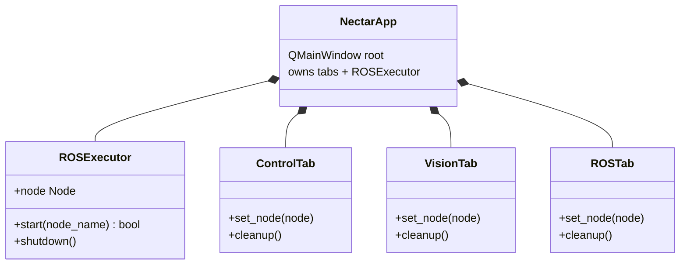
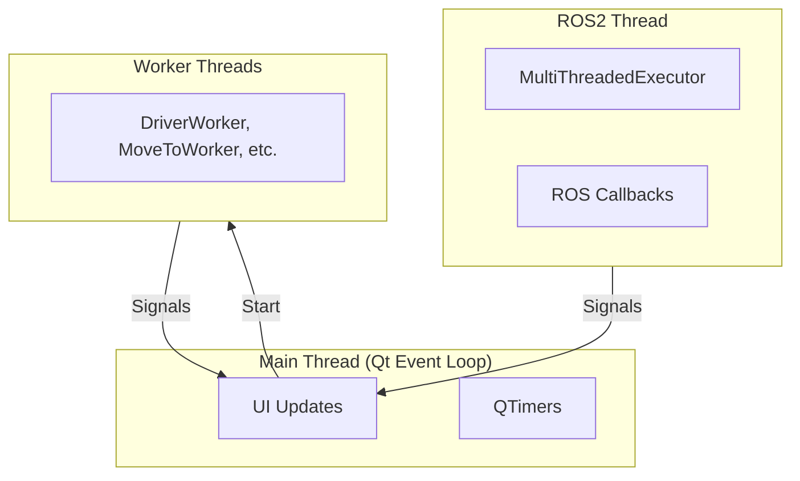

# Módulo de Interface

Interface gráfica baseada em Qt6/PySide6 para controle de drones, visão computacional e ferramentas de sistema do ROS2.

<div align="center" markdown>


*GUI do Nectar SDK - Control, Vision e ferramentas ROS2 em uma única interface*

</div>

## Início rápido

```python
from nectar.interface import main

# Launch the GUI

main()
```

Ou pela linha de comando:

```bash
ros2 run nectar app.py
```

## Funcionalidades

### Aba Control

Interface de controle de drones com controle de velocidade por teclado e navegação por posição.

**Fluxo de conexão**:

1. **Select Firmware + Link**: Escolha o firmware (ArduPilot, PX4, Bebop, Crazyflie) e, para ArduPilot/PX4, o transporte (MAVROS, MAVLink, ou DDS). O painel de configuração se adapta à seleção.
2. **Connect Driver**: Inicia o processo de driver em segundo plano — MAVROS (`apm.launch` / `px4.launch`), o servidor do Crazyflie, o driver do Bebop, ou `MicroXRCEAgent` para PX4 DDS. Links MAVLink diretos (ArduPilot/PX4) abrem o link do FCU dentro da própria instância, então este passo é pulado.
3. **Initialize Instance**: Cria o objeto do drone com a configuração selecionada no painel.
4. **Ready**: Controles de voo habilitados.

**Indicadores de status**:

- **Driver**: processo de driver / agent do ROS2 em execução
- **Instance**: objeto do drone inicializado
- **FCU**: controlador de voo conectado (veículos com FCU)
- **Armed**: estado de armamento dos motores (veículos com FCU / Crazyflie)

**Controle de velocidade**:

- **Teclado**: W/S (cima/baixo), A/D (yaw), setas (frente/trás/esquerda/direita)
- **Sliders**: Ajustam a velocidade máxima por eixo (Vx, Vy, Vz, Vyaw)
- **Reference Frame**: Body, World, ou Takeoff

**Controle de posição** (veículos com FCU e Crazyflie):

- Navega até a posição alvo com offsets de X, Y, Z, Yaw
- Frames de referência: Body ou Takeoff
- Precisão e timeout configuráveis

**Backends** (Firmware + Link):

| Firmware / Link | Chave | Notas |
|-----------------|-----|-------|
| ArduPilot / MAVROS | `mavros` | Controle completo do ArduPilot (arm, takeoff, land, velocidade, posição, telemetria) pela ponte MAVROS |
| ArduPilot / MAVLink | `mavlink` | Mesmo controle por um link pymavlink direto (sem MAVROS); defina a connection string e, para voo indoor, o preset do tópico de vision-pose (`/visual_slam/tracking/vo_pose_covariance`) |
| PX4 / MAVROS | `px4` | Streaming de setpoint OFFBOARD; a conexão usa por padrão o endpoint offboard do PX4 (`udp://:14540@127.0.0.1:14580` para SITL) |
| PX4 / MAVLink | `px4_mavlink` | Link pymavlink direto (sem MAVROS); padrão `udp:0.0.0.0:14540` |
| PX4 / DDS | `px4_dds` | uXRCE-DDS nativo. **Connect Driver** inicia o `MicroXRCEAgent` na porta UDP configurada (padrão 8888); um agent iniciado em outro lugar (por exemplo, `make sim-bridge FIRMWARE=px4 PROTOCOL=dds`) é detectado automaticamente. A prontidão é o aparecimento dos tópicos `/fmu/*` do PX4, não um processo ou nome de sessão |
| Bebop | `bebop` | Controle básico (takeoff, land, velocidade, flips) |
| Crazyflie | `crazyflie` | Takeoff, land, velocidade e posição a bordo (`goTo`) |

Os painéis de MAVROS e MAVLink são compartilhados entre ArduPilot e PX4 e se adaptam ao firmware: o padrão de conexão muda para o endpoint offboard do PX4, e as listas de presets de PID e setpoint são carregadas do [config do PX4](https://github.com/Black-Bee-Drones/nectar-sdk/tree/main/nectar/nectar/control/px4/config) em vez do [config do ArduPilot](https://github.com/Black-Bee-Drones/nectar-sdk/tree/main/nectar/nectar/control/ardupilot/config) (ambos incluem os presets SITL `*_sim_*`). O config de setpoint expõe os limites de velocidade/aceleração de cada firmware — `WPNAV`/`GUID_OPTIONS` do ArduPilot ou `MPC_*` do PX4 — com **Apply setpoint params to FCU** aplicando-os no momento do arm. O painel uXRCE-DDS (`px4_dds`) expõe a fonte de pose, a porta UDP do agent (padrão 8888), o namespace e o preset de PID — mas sem controles de setpoint/apply-setpoint, já que os parâmetros do PX4 não são transportados pelo uXRCE-DDS.

### Aba Vision

Processamento de visão computacional em tempo real com múltiplas fontes de câmera e filtros.

**Fontes de câmera**: Webcam, RealSense, T265, OAK-D, C920, IMX219, tópico ROS, profundidade ROS, arquivo

**Categorias de filtro**:

- **Color**: Filtragem de cor HSV com calibração
- **Edge**: Detecção de bordas Canny, contornos
- **Blur/Transform**: Blur gaussiano, sharpen, rotação, resize
- **Morphology**: Erosão, dilatação, threshold adaptativo, equalização de histograma
- **Effects**: Pencil sketch, estilização, cartoonify, linhas/círculos de Hough, optical flow
- **AI**: Tracking de mãos (MediaPipe), face mesh (MediaPipe)
- **Markers**: Detecção ArUco (17 tipos de dicionário)

**Estimativa de profundidade** (câmeras de profundidade):

- Medição de distância em tempo real
- Visualização de profundidade colorizada
- Medição por clique (click-to-measure)

### Aba ROS

Ferramentas de introspecção e interação com o sistema ROS2.

**Topics**:

- Navegar, subscrever e publicar mensagens
- Visualização de mensagens em tempo real
- Detecção automática de configurações de QoS

**Services**:

- Navegar e chamar services
- Tratamento customizado de request/response

**Parameters**:

- Visualizar e modificar parâmetros de nó
- Atualizações em tempo real

**Plot**:

- Plotagem em tempo real de campos numéricos
- Múltiplos plots, pause/resume
- Exportação para CSV

## Arquitetura

### Estrutura de alto nível



### Modelo de threads



**Pontos-chave**:

- O executor do ROS2 roda em uma thread separada
- Operações bloqueantes (start do driver, navegação) usam worker threads
- Comandos de velocidade são enviados via QTimer (intervalo de 50ms)
- Todas as atualizações de UI acontecem na thread principal

## Para desenvolvedores

### Widgets

Componentes de UI reutilizáveis disponíveis em `nectar.interface.widgets`:

| Widget | Finalidade |
|--------|-------------|
| `Card` | Container elevado com cantos arredondados |
| `StatusIndicator` | Ponto de status com label (active/inactive/warning/error) |
| `LabeledSlider` | Slider vertical com label e exibição de valor |
| `CollapsibleSection` | Seção expansível/recolhível |
| `VideoDisplay` | Exibição de frame OpenCV com suporte a clique |
| `ImageViewer` | Exibição de vídeo com label de informação |
| `DualVideoDisplay` | Exibição de RGB e profundidade |
| `DroneConfigPanel` | UI de configuração do drone |
| `DetectionConfigPanel` | Configuração do modelo de detecção de objetos |
| `MessageFieldEditor` | Editor de campos de mensagem ROS |
| `ParameterReconfigureWidget` | Editor de parâmetros do ROS2 |

**Exemplo**:

```python
from nectar.interface import Card, StatusIndicator, LabeledSlider

card = Card()
card.add_widget(StatusIndicator("Status", "active"))
card.add_widget(LabeledSlider("Speed", 0.0, 1.0, 0.5))
```

### ROSExecutor

Gerencia o nó e o executor do ROS2 em uma thread de fundo:

```python
from nectar.interface import ROSExecutor

executor = ROSExecutor()
executor.start("my_node")
node = executor.node  # Access ROS2 node
executor.shutdown()
```

**Signals**:

- `status_changed(bool)`: Status de conexão do ROS2
- `error_occurred(str)`: Erros do ROS2

### Worker Threads

Operações de longa duração usam workers `QThread` para evitar congelamento da UI:

- **DriverWorker**: Inicia/para processos de driver do ROS2
- **DroneInstanceWorker**: Inicializa objetos de drone
- **MoveToWorker**: Navegação por posição (loop PID bloqueante)
- **FlightActionWorker**: Chamadas de serviço (arm, takeoff, land)
- **CameraInitWorker**: Inicialização de câmera

**Padrão**:

```python
worker = MyWorker()
worker_thread = QThread()
worker.moveToThread(worker_thread)
worker.finished.connect(worker_thread.quit)
worker_thread.started.connect(worker.run)
worker_thread.start()
```

### Chamadas de serviço

As chamadas de serviço do ROS 2 usam um padrão assíncrono para evitar deadlocks. `BaseDrone._call_service` dispara `call_async`, e então bloqueia a thread chamadora em um `threading.Event` que é sinalizado pelo done-callback do future — o executor compartilhado (a thread de spin de fundo do SDK ou o `ROSExecutor` da GUI) leva o future à conclusão em sua própria thread:

```python
future = client.call_async(request)
done = threading.Event()
future.add_done_callback(lambda _f: done.set())
done.wait(timeout=...)        # calling thread blocks; the executor thread completes the future
result = future.result()
```

Chamadas de voo bloqueantes (takeoff, move_to, …) fazem polling da própria conclusão com `_wait_until(predicate, timeout)` (um loop de `time.sleep(0.05)`), contando com esse mesmo executor de fundo para continuar entregando os callbacks de telemetria.

### Layout

- `app.py` — janela principal `NectarApp`; `ros_executor.py` — integração ROS 2/Qt; `theme.py` — estilo e cores
- `tabs/` — `control_tab.py` (controle de drone), `vision_tab.py` (câmera e filtros), `ros_tab.py` (ferramentas ROS 2)
- `widgets/` — componentes reutilizáveis: `drone_config.py`, `detection_panel.py`, `message_editor.py`, `param_reconfigure.py`

### Temas

Cores definidas em `theme.py`:

```python
from nectar.interface import COLORS

COLORS.background      # #0A0E14
COLORS.surface         # #12171E
COLORS.accent          # #F5A623 (amber)
COLORS.success         # #34C759 (green)
COLORS.error           # #FF453A (red)

# ... see theme.py for full list

```

## Solução de problemas

**UI congela**: Garanta que operações bloqueantes usem worker threads (não a thread principal)

**Timeouts de serviço**: Verifique se o driver está em execução e se o FCU está conectado

**Sem telemetria**: Verifique a conexão do driver e se a configuração do sensor corresponde à configuração do FCU

**Câmera não funciona**: Verifique as permissões do dispositivo e os nomes dos tópicos ROS

## Referências

- [Qt for Python](https://doc.qt.io/qtforpython-6/)
- [ROS2 Executors](https://docs.ros.org/en/humble/Concepts/Intermediate/About-Executors.html)
