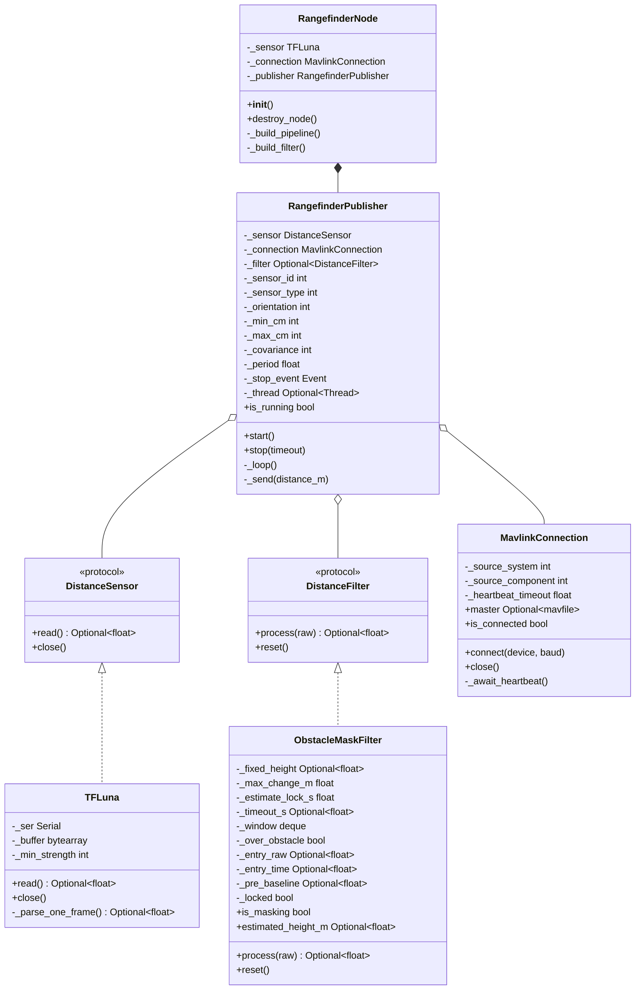
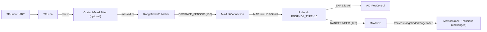
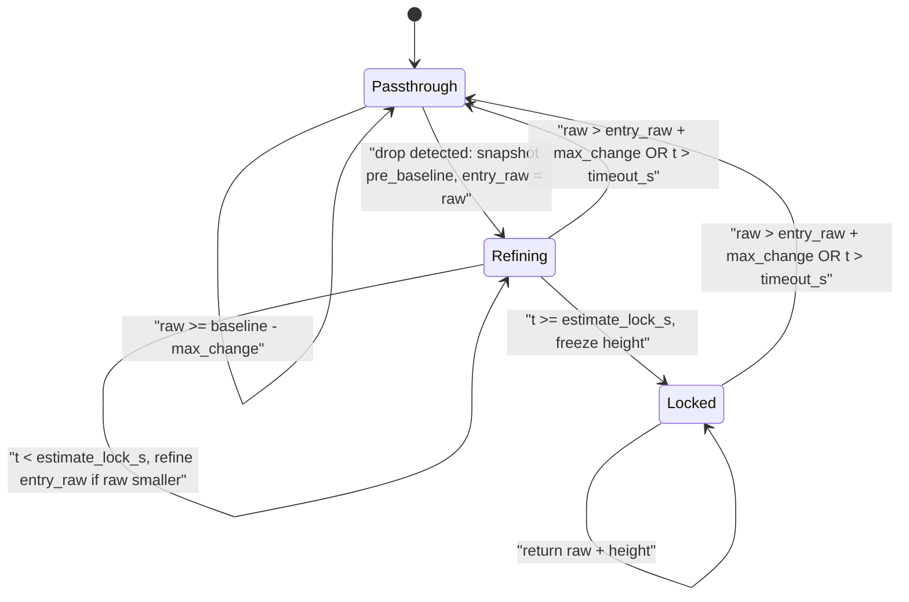

# Módulo de Sensores

Drivers de sensores do lado do companion computer e filtros de valor, além de um nó ROS2 pronto para uso que faz a ponte de um rangefinder serial para o `DISTANCE_SENSOR` do MAVLink, de modo que um FCU ArduPilot/PX4 possa consumi-lo como seu rangefinder primário.

O módulo é composition-first: um `DistanceSensor` (driver) e um `DistanceFilter` opcional são conectados a um `RangefinderPublisher` que envia amostras filtradas para uma `MavlinkConnection`. Cada peça é utilizável de forma independente.

## Por que isso existe

Quando um LiDAR voltado para baixo é a fonte de altitude do EKF (`EK3_SRC1_POSZ = Rangefinder`), voar sobre um obstáculo fixo (por exemplo, uma esfera em uma mangueira) causa uma queda abrupta na leitura do rangefinder que o ArduPilot interpreta como o veículo descendo. O controlador de posição sobe para compensar, elevando o drone acima da altitude alvo. Conectar o LiDAR ao computador de bordo em vez de ao FCU permite mascarar essas quedas abruptas antes que o EKF chegue a vê-las.

O ArduPilot não tem um parâmetro nativo para rejeitar mudanças abruptas no rangefinder — o filtro precisa viver antes do FCU (upstream). Veja a [documentação de terrain following do ArduPilot](https://ardupilot.org/copter/docs/terrain-following.html) e o [`AP_RangeFinder_Benewake_CAN.h`](https://github.com/ArduPilot/ardupilot/blob/master/libraries/AP_RangeFinder/AP_RangeFinder_Benewake_CAN.h).

## Arquitetura



## Fluxo de dados



## Componentes

### `DistanceSensor` e `DistanceFilter` (Protocols)

Interfaces estruturais leves em [`base.py`](https://github.com/Black-Bee-Drones/nectar-sdk/blob/main/nectar/nectar/sensors/base.py). As implementações só precisam corresponder ao formato; nenhuma herança é exigida (segue a mesma convenção de `Drone` e `ObstacleDetector` em `nectar/control`).

```python
class DistanceSensor(Protocol):
    def read(self) -> Optional[float]: ...
    def close(self) -> None: ...

class DistanceFilter(Protocol):
    def process(self, raw_distance: float) -> Optional[float]: ...
    def reset(self) -> None: ...
```

### `TFLuna`

Driver serial do Benewake TF-Luna em [`benewake/tfluna.py`](https://github.com/Black-Bee-Drones/nectar-sdk/blob/main/nectar/nectar/sensors/benewake/tfluna.py). Faz o parse do frame UART padrão de 9 bytes (`0x59 0x59 ...`), valida o checksum e a força do sinal, e devolve a última leitura válida a cada `read()`. Não bloqueante: timeout de serial pequeno, drena `in_waiting` a cada chamada, devolve `None` quando nenhum frame novo está pronto.

```python
from nectar.sensors import TFLuna

sensor = TFLuna(port="/dev/ttyUSB0", baudrate=115200)
distance_m = sensor.read()  # float | None
sensor.close()
```

Referência de hardware: [página do produto TF-Luna](https://en.benewake.com/TFLuna/index.html) e [Data Download](https://en.benewake.com/DataDownload/index.aspx?pid=20&lcid=21) (datasheet, manual do usuário, notas de aplicação para Pixhawk).

> A faixa de especificação é 0,20 - 8,00 m. Na prática o sensor devolve leituras válidas até aproximadamente 0,05 - 0,08 m, por isso `min_distance_m` tem padrão `0.05`. Mantenha `RNGFND1_MIN_CM = 20` no FCU conforme a especificação do fabricante — o `DISTANCE_SENSOR.min_distance` reportado pelo SDK e o gating do ArduPilot são independentes de propósito.

### `ObstacleMaskFilter`

Filtro de rangefinder com estado em [`filters/obstacle_mask.py`](https://github.com/Black-Bee-Drones/nectar-sdk/blob/main/nectar/nectar/sensors/filters/obstacle_mask.py). Detecta uma queda abrupta, mascara as leituras durante a passagem sobre o obstáculo e se recupera quando a leitura volta à baseline anterior à entrada. A altura do obstáculo é **auto-estimada por padrão** a partir da magnitude da queda na entrada (`pre_baseline - entry_raw`), então as missões não precisam conhecer as dimensões do obstáculo de antemão. Passe `obstacle_height_m` explicitamente para travar a estimativa em um valor fixo.

#### Máquina de estados



Algoritmo:

- Mantém uma média móvel sobre as últimas `avg_window` leituras enquanto não está mascarando.
- Entra no estado mascarado quando `raw < baseline - max_change_m`. Salva `pre_baseline` e `entry_raw`.
- Nos primeiros `estimate_lock_s` após a entrada (padrão 0,2 s): refina `entry_raw` sempre que chega um raw menor, de modo que a leitura mais profunda do feixe seja capturada enquanto o obstáculo é totalmente cruzado. Depois dessa janela, a altura é congelada.
- Enquanto mascarando: devolve `raw + (pre_baseline - entry_raw)` (ou o override fixo).
- Sai quando `raw > entry_raw + max_change_m`, ou após `timeout_s` (reset de segurança).

#### Passo a passo (auto-detecção)

```
t=0.0s   hover at 3.40 m AGL    raw=3.40  masked=3.40  state=Passthrough
t=1.0s   enter sphere column    raw=1.70  masked=3.40  state=Refining (h=1.70)
t=1.05s  beam settles on top    raw=1.65  masked=3.40  state=Refining (h=1.75)
t=1.20s  estimate locks         h=1.75 frozen          state=Locked
t=2..5s  descend over sphere    raw=0.30  masked=2.05  state=Locked
t=5.1s   exit sphere column     raw=3.20  masked=3.20  state=Passthrough
```

Enquanto refina em altitude constante, a saída mascarada permanece em `pre_baseline` porque `raw + (pre_baseline - entry_raw)` colapsa para `pre_baseline` sempre que `entry_raw` é atualizado para o raw atual. Depois que a altura é travada, o stream mascarado acompanha linearmente qualquer descida do drone, então a configuração `EK3_SRC1_POSZ=Rangefinder` do FCU se comporta corretamente durante toda a missão, sem qualquer conhecimento prévio das dimensões do obstáculo.

**Auto-detecção** (recomendado — altura aprendida a cada travessia):

```python
from nectar.sensors import ObstacleMaskFilter

f = ObstacleMaskFilter(
    max_change_m=0.30,       # entry/exit hysteresis (also caps physically reachable descent rate)
    avg_window=10,           # samples for the entry baseline
    estimate_lock_s=0.2,     # how long to refine the height after entry
    timeout_s=5.0,           # force-reset if stuck masked too long
)
```

**Override de altura fixa** (por exemplo, para SITL ou fixtures conhecidas):

```python
f_fixed = ObstacleMaskFilter(obstacle_height_m=1.7)
```

Depois leia as amostras filtradas e o estado:

```python
filtered = f.process(raw)    # float (current sample masked or passed through)
f.is_masking                 # bool
f.estimated_height_m         # float | None (current estimate while masking)
f.reset()                    # clear all state (e.g. on mode change)
```

### `RangefinderPublisher`

Peça de composição em [`rangefinder_publisher.py`](https://github.com/Black-Bee-Drones/nectar-sdk/blob/main/nectar/nectar/sensors/rangefinder_publisher.py). Possui uma thread de fundo que lê o sensor em uma taxa configurável, aplica o filtro opcional e envia o `DISTANCE_SENSOR` do MAVLink (id 132) pela conexão.

```python
from nectar.control import MavlinkConnection
from nectar.sensors import (
    ObstacleMaskFilter,
    RangefinderPublisher,
    TFLuna,
)
from pymavlink import mavutil

sensor = TFLuna(port="/dev/ttyUSB0")
conn = MavlinkConnection()
conn.connect("udp:127.0.0.1:14551")

publisher = RangefinderPublisher(
    sensor=sensor,
    connection=conn,
    sensor_id=0,
    sensor_type=mavutil.mavlink.MAV_DISTANCE_SENSOR_LASER,
    orientation=mavutil.mavlink.MAV_SENSOR_ROTATION_PITCH_270,  # downward
    min_distance_m=0.05,
    max_distance_m=8.0,
    rate_hz=50.0,
    filter=ObstacleMaskFilter(),  # auto-detect; pass obstacle_height_m=X to lock
)

publisher.start()

# ... mission runs ...

publisher.stop()
sensor.close()
conn.close()
```

`filter=None` publica as leituras brutas.

### `RangefinderNode`

Ponto de entrada ROS2 em [`nodes/rangefinder_node.py`](https://github.com/Black-Bee-Drones/nectar-sdk/blob/main/nectar/nectar/sensors/nodes/rangefinder_node.py). Declara cada configuração como um parâmetro ROS, de modo que o ajuste por missão viva no arquivo de launch em vez de no código da missão.

**Passthrough bruto** (sem filtro):

```bash
ros2 run nectar rangefinder_node.py --ros-args \
    -p serial_port:=/dev/ttyUSB0 \
    -p mavlink_url:=udp:127.0.0.1:14551
```

**Auto-detecção** (missão Hook e similares; não precisa de `obstacle_height_m`):

```bash
ros2 run nectar rangefinder_node.py --ros-args \
    -p serial_port:=/dev/ttyUSB0 \
    -p mavlink_url:=udp:127.0.0.1:14551 \
    -p filter:=obstacle_mask
```

**Override de altura fixa** (SITL, fixtures conhecidas):

```bash
ros2 run nectar rangefinder_node.py --ros-args \
    -p serial_port:=/dev/ttyUSB0 \
    -p mavlink_url:=udp:127.0.0.1:14551 \
    -p filter:=obstacle_mask \
    -p obstacle_height_m:=1.7
```

#### Parâmetros

- `serial_port` (string, padrão `/dev/ttyUSB0`) — caminho do dispositivo TF-Luna.
- `baudrate` (int, padrão `115200`) — baud rate do TF-Luna.
- `mavlink_url` (string, padrão `udp:127.0.0.1:14551`) — endpoint pymavlink para o FCU. Use um fan-out UDP (por exemplo, mavlink-router) se o MAVROS já possuir a linha serial do FCU.
- `mavlink_baud` (int, padrão `921600`) — Usado somente para endpoints seriais.
- `source_system` (int, padrão `1`) — ID de sistema MAVLink que este companion apresenta.
- `source_component` (int, padrão `191`) — `MAV_COMP_ID_ONBOARD_COMPUTER`.
- `heartbeat_timeout_s` (float, padrão `30.0`) — Espera máxima pelo primeiro heartbeat do FCU.
- `sensor_id` (int 0-7, padrão `0`) — Mapeia para o slot `RNGFND<id+1>_*` do ArduPilot.
- `orientation` (int, padrão `25`) — enum `MAV_SENSOR_ORIENTATION` (`25` = `PITCH_270`, voltado para baixo).
- `min_distance_m` / `max_distance_m` (float, padrão `0.05` / `8.0`) — Alcance do sensor, enviado como parte do `DISTANCE_SENSOR`.
- `covariance_cm` (int 0-254, padrão `0`) — `0` significa "usar os padrões do FCU".
- `rate_hz` (float, padrão `50.0`) — Taxa de publicação.
- `filter` (string, padrão `none`) — `none` ou `obstacle_mask`.
- `obstacle_height_m` (float, padrão `0.0`) — Override de altura do obstáculo em metros. `<= 0` habilita a auto-detecção (o padrão recomendado). Encaminhado para `ObstacleMaskFilter` somente quando `filter=obstacle_mask`.
- `max_change_m`, `avg_window`, `estimate_lock_s`, `timeout_s` — Encaminhados para `ObstacleMaskFilter` quando `filter=obstacle_mask`. Use `timeout_s <= 0` para desabilitar o reset de segurança; `estimate_lock_s` é ignorado no modo de altura fixa.

## Configuração do ArduPilot (uma vez)

Configure no FCU via Mission Planner / editor de parâmetros:

- `RNGFND1_TYPE = 10` (MAVLink)
- `RNGFND1_MIN_CM = 20`, `RNGFND1_MAX_CM = 800` (especificação do fabricante do TF-Luna; veja o [datasheet](https://en.benewake.com/DataDownload/index.aspx?pid=20&lcid=21))
- `RNGFND1_ORIENT = 25` (Down)
- Desconecte fisicamente o UART do TF-Luna do Pixhawk, de modo que a única fonte de rangefinder seja o stream MAVLink filtrado.
- Mantenha `EK3_SRC1_POSZ = Rangefinder` e `EK3_RNG_USE_HGT = -1` se essa for sua configuração atual; o filtro de mascaramento é o que torna essa combinação segura em obstáculos conhecidos.

O Jetson e o MAVROS precisam de acesso ao stream MAVLink do FCU. O padrão de uso é rodar [mavlink-router](https://github.com/mavlink-router/mavlink-router) (ou equivalente) no Jetson para distribuir (fan out) o link serial do FCU tanto para o MAVROS quanto para o endpoint UDP deste nó.

## DISTANCE_SENSOR vs RANGEFINDER

São duas mensagens MAVLink diferentes, com direções opostas:

- [`DISTANCE_SENSOR` (id 132)](https://mavlink.io/en/messages/common.html#DISTANCE_SENSOR): companion → FCU. O que este nó envia. Carrega metadados do sensor (id, tipo, orientação, min/max).
- [`RANGEFINDER` (id 173, ardupilotmega)](https://github.com/mavlink/c_library_v1/blob/master/ardupilotmega/mavlink_msg_rangefinder.h): FCU → GCS, telemetria. O que o MAVROS lê para publicar `/mavros/rangefinder/rangefinder`.

Este nó só emite `DISTANCE_SENSOR`. O fluxo de `RANGEFINDER` é tratado pelo ArduPilot e pelo MAVROS sem nenhum código deste módulo.

## Validação

Bancada (sem voo):

```bash
ros2 run nectar rangefinder_node.py --ros-args -p mavlink_url:=udp:127.0.0.1:14551
ros2 topic echo /mavros/rangefinder/rangefinder
```

Coloque um objeto de altura conhecida sob o sensor enquanto observa o tópico. A leitura deve saltar pelo offset mascarado e se recuperar quando o objeto for removido.

Standalone (sem ROS): veja o [exemplo standalone de rangefinder](https://github.com/Black-Bee-Drones/nectar-sdk/blob/main/nectar/nectar/examples/sensors/rangefinder_example.py).

## Limitações conhecidas do modo de auto-detecção

- **O caso inverso (subida abrupta) não é mascarado.** O filtro só dispara em quedas. Voar para fora de uma mesa ou penhasco faz o raw subir abruptamente; este filtro não faz nada a respeito.
- **Ligar o sensor diretamente sobre um obstáculo contamina a baseline.** A média móvel precisa de pelo menos algumas amostras de solo plano antes da primeira travessia. Solução alternativa: decole, voe até um solo livre por pelo menos `avg_window` amostras, e então prossiga.
- **Obstáculos empilhados ou consecutivos**: o filtro sai e volta a entrar por obstáculo, o que é o comportamento correto. Cada entrada reestima a altura a partir da nova queda.
- **Obstáculo largo, com subida gradual (inclinação > `max_change_m / sample_period`)**: não é detectado como obstáculo porque não há queda abrupta. Isso é intencional — mudanças lentas de elevação parecem terreno, não um obstáculo.

## Solução de problemas

- **`No FCU heartbeat received within 30s`**: o pymavlink não consegue alcançar o FCU. Verifique `mavlink_url`, se o mavlink-router está em execução e se a porta UDP corresponde. Verifique com `mavproxy.py --master=udp:127.0.0.1:14551`.
- **O MAVROS ainda mostra a leitura bruta**: confirme `RNGFND1_TYPE = 10` no FCU e que o UART direto está fisicamente desconectado. O FCU prefere o sensor cabeado diretamente quando ambos estão presentes.
- **O filtro mascara durante uma descida legítima**: `max_change_m` está muito rígido. Aumente-o, ou reduza `avg_window` para que a baseline acompanhe a descida mais rápido.
- **Altura auto-estimada é pequena demais** (o drone ainda sobe um pouco ao cruzar o obstáculo): a janela de travamento expirou antes que o feixe alcançasse o ponto mais profundo. Aumente `estimate_lock_s` (por exemplo, 0,4 s), ou trave a altura com `obstacle_height_m`.
- **Altura auto-estimada é grande demais** (o drone desce ao entrar na região mascarada): amostra de entrada ruidosa. Aumente `avg_window` para que a pre-baseline fique mais estável, ou trave a altura com `obstacle_height_m`.
- **Preso em estado mascarado**: reduza `timeout_s` (padrão 5,0 s) ou defina um valor apenas um pouco maior que a maior travessia de obstáculo esperada na missão.
- **TF-Luna devolve `None` constantemente**: verifique o baud (padrão 115200), a fiação, e se nenhum outro processo está retendo a porta serial. Aumente o argumento de construtor `min_strength` de `TFLuna(...)` (não é um parâmetro ROS) se você suspeitar que o sensor está lendo por meio de reflexões de baixa confiança.

## Referências

- [Página do produto Benewake TF-Luna](https://en.benewake.com/TFLuna/index.html) e [Data Download](https://en.benewake.com/DataDownload/index.aspx?pid=20&lcid=21) (datasheet, manual do usuário, notas de aplicação Pixhawk)
- [Página de rangefinder do ArduPilot](https://ardupilot.org/copter/docs/common-rangefinder-landingpage.html)
- [Terrain following do ArduPilot](https://ardupilot.org/copter/docs/terrain-following.html)
- [Configuração Benewake do ArduPilot](https://ardupilot.org/copter/docs/common-benewake-tf02-lidar.html)
- [`AP_RangeFinder.h`](https://github.com/ArduPilot/ardupilot/blob/master/libraries/AP_RangeFinder/AP_RangeFinder.h)
- [Mensagem MAVLink `DISTANCE_SENSOR`](https://mavlink.io/en/messages/common.html#DISTANCE_SENSOR)
- [Documentação do pymavlink](https://mavlink.io/en/mavgen_python/)
