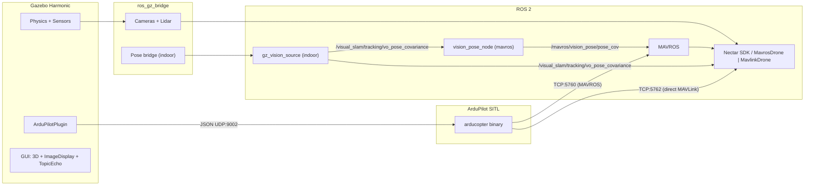

# Módulo de Simulação

Simulação ArduPilot SITL + Gazebo Harmonic para desenvolvimento e testes do Nectar, sobre qualquer um dos dois transportes (MAVROS ou MAVLink direto).

## Como funciona

O [SITL](https://ardupilot.org/dev/docs/sitl-simulator-software-in-the-loop.html) do ArduPilot roda o firmware ArduCopter completo na máquina host. O [Gazebo Harmonic](https://gazebosim.org/docs/harmonic) fornece a simulação de física e sensores. O [ArduPilotPlugin](https://github.com/ArduPilot/ardupilot_gazebo) faz a ponte da física do Gazebo para o SITL via JSON sobre UDP (porta 9002). O SITL expõe dois endpoints MAVLink: TCP `5760` (SERIAL0, para o [MAVROS](https://github.com/mavlink/mavros)) e TCP `5762` (SERIAL1, para um cliente pymavlink direto / `MavlinkDrone`) — assim os dois transportes podem rodar contra o mesmo simulador. O [ros_gz_bridge](https://github.com/ros-gz/ros_gz) converte os dados de sensores do Gazebo em mensagens ROS 2.



## Dois ambientes

### Outdoor (GPS)

- World: `outdoor_field.sdf` -- campo aberto com zona de obstáculo em x=13..18, portão para atravessar (fly-through gate)
- GPS via plugin `gz-sim-navsat-system` com coordenadas WGS84 (Canberra por padrão)
- Parâmetros ArduPilot: `copter.parm` + `gazebo.parm` (rangefinder habilitado)
- Preset de config: `SITL_GAZEBO_CONFIG` (PoseSource.GPS)

### Indoor (Vision)

- World: `indoor_room.sdf` — sala de 20x20x12m, drone em x=-5
- Sem GPS; EKF3 ExternalNav pelas mesmas pontes de visão do hardware
  (detalhes: [localization README — SITL](control/localization/#sitl))
- Parâmetros: `copter.parm` + `gazebo.parm` + `indoor.parm`
- Config: `SITL_VISION_CONFIG` (PoseSource.VISION)

## Sensores simulados

| Sensor real             | Sensor Gazebo        | Tópico (ROS 2)                                                              | Notas                                             |
| ----------------------- | -------------------- | -------------------------------------------------------------------------- | ------------------------------------------------- |
| RealSense D435i (front) | `rgbd_camera`        | `/front_camera/image`, `/front_camera/depth_image`, `/front_camera/points` | 640x480, RGB + depth + point cloud                |
| Arducam (down)          | `camera`             | `/down_camera`                                                             | 640x480 RGB, voltada para baixo                      |
| TFLuna lidar (down)     | Sonar simulado do SITL | `/mavros/rangefinder/rangefinder`                                          | `RNGFND1_TYPE=1`, distância ao solo pela física    |
| TFLuna lidar (down)     | `gpu_lidar`          | `/lidar/range`                                                             | LaserScan direto via Gazebo, rangefinder de 1 amostra |

A tabela acima é o world do ArduPilot. Nos dois firmwares o SDK lê o
rangefinder voltado para baixo em `/mavros/rangefinder/rangefinder`: o ArduPilot o deriva
do sonar do SITL, enquanto o PX4 funde o `gpu_lidar` gz do `x500_nectar` em um
`distance_sensor` e o transmite como `DISTANCE_SENSOR` do MAVLink (veja
`simulation/config/px4_config_sitl.yaml`). O ArduPilot também expõe o
LaserScan bruto do Gazebo `gpu_lidar` em `/lidar/range`.

## GUI do Gazebo

Os dois SDFs de world incluem plugins de GUI integrados (sem janelas extras necessárias):

- Painéis **ImageDisplay** para RGB frontal, profundidade frontal e câmera inferior (começam recolhidos, clique para expandir)
- **TopicEcho** para visualizar qualquer tópico do transporte do Gazebo em tempo real
- **WorldStats** mostrando tempo de simulação, tempo real, RTF

## Instalação

**ArduPilot** — clona `~/ardupilot` + builda o ArduCopter SITL, depois instala Gazebo Harmonic + ArduPilotPlugin + ros_gz_bridge:

```bash
make sim-install FIRMWARE=ardupilot
```

**PX4** — clona `~/PX4-Autopilot` + builda px4_sitl + Gazebo, e cria symlinks dos assets compartilhados do Nectar (`x500_nectar`, `outdoor_field_scenery`, `outdoor_field_px4`) na árvore do PX4. Acrescente `ARGS=--native` para o caminho uXRCE-DDS:

```bash
make sim-install FIRMWARE=px4
```

**Ambos**:

```bash
make sim-install FIRMWARE=all
```

Depois recarregue seu shell: `source ~/.bashrc`.

## Uso

Um padrão para os dois firmwares. A divisão em dois terminais é inevitável (o
SITL do autopilot e a stack ROS são processos separados), então é simétrica:

- **Terminal 1 — `sim-start`**: o simulador (SITL do ArduPilot; para PX4, também o Gazebo).
- **Terminal 2 — `sim-bridge`**: a stack ROS (Gazebo + pontes para ArduPilot; para PX4, MAVROS, MicroXRCE-DDS, ou somente câmera, dependendo de `PROTOCOL`).

Escolha o cenário com três variáveis (padrões `ardupilot` / `outdoor` /
`mavlink`, então `make sim-start` + `make sim-bridge` puros = ArduPilot outdoor sobre
MAVLink direto). `ENV` precisa coincidir entre os dois terminais.

- `FIRMWARE` = `ardupilot` | `px4`
- `ENV` = `outdoor` | `indoor`
- `PROTOCOL` = `mavlink` (pymavlink direto, **padrão**) | `mavros`. Para PX4, `dds` seleciona o agent uXRCE-DDS nativo.

| Cenário                          | Terminal 1                                      | Terminal 2                                                        | Config de missão                                       |
| --------------------------------- | ----------------------------------------------- | ----------------------------------------------------------------- | ---------------------------------------------------- |
| ArduPilot outdoor, MAVLink direto | `make sim-start FIRMWARE=ardupilot ENV=outdoor` | `make sim-bridge FIRMWARE=ardupilot ENV=outdoor`                  | `MavlinkDrone` / `MAVLINK_SITL_GAZEBO_CONFIG` |
| ArduPilot outdoor, MAVROS         | (mesmo Terminal 1)                               | `make sim-bridge FIRMWARE=ardupilot ENV=outdoor PROTOCOL=mavros`  | `MavrosDrone` / `SITL_GAZEBO_CONFIG` |
| ArduPilot indoor, MAVLink direto  | `make sim-start FIRMWARE=ardupilot ENV=indoor`  | `make sim-bridge FIRMWARE=ardupilot ENV=indoor`                   | `MavlinkDrone` / `MAVLINK_SITL_VISION_CONFIG`        |
| ArduPilot indoor, MAVROS          | (mesmo Terminal 1)                               | `make sim-bridge FIRMWARE=ardupilot ENV=indoor PROTOCOL=mavros`   | `MavrosDrone` / `SITL_VISION_CONFIG`                 |
| PX4 outdoor, MAVLink direto       | `make sim-start FIRMWARE=px4 ENV=outdoor`       | `make sim-bridge FIRMWARE=px4 ENV=outdoor`                        | `Px4MavlinkDrone` / `PX4_MAVLINK_SITL_GAZEBO_CONFIG` |
| PX4 outdoor, MAVROS               | (mesmo Terminal 1)                               | `make sim-bridge FIRMWARE=px4 ENV=outdoor PROTOCOL=mavros`        | `Px4MavrosDrone` / `PX4_SITL_GAZEBO_CONFIG`          |
| PX4 outdoor, uXRCE-DDS            | (mesmo Terminal 1)                               | `make sim-bridge FIRMWARE=px4 ENV=outdoor PROTOCOL=dds`           | `Px4DdsDrone` / `PX4_DDS_SITL_CONFIG`            |
| PX4 indoor, MAVLink direto        | `make sim-start FIRMWARE=px4 ENV=indoor`        | `make sim-bridge FIRMWARE=px4 ENV=indoor`                         | `Px4MavlinkDrone` / `PX4_MAVLINK_SITL_VISION_CONFIG` |
| PX4 indoor, MAVROS (external-nav) | (mesmo Terminal 1)                               | `make sim-bridge FIRMWARE=px4 ENV=indoor PROTOCOL=mavros`         | `Px4MavrosDrone` / `PX4_SITL_VISION_CONFIG`          |
| PX4 indoor, uXRCE-DDS             | (mesmo Terminal 1)                               | `make sim-bridge FIRMWARE=px4 ENV=indoor PROTOCOL=dds`            | `Px4DdsDrone` / `PX4_DDS_SITL_VISION_CONFIG`         |

- **ArduPilot**: O Terminal 1 roda a física do SITL; o Terminal 2 inicia o Gazebo + `ros_gz_bridge`. Com `PROTOCOL=mavlink` (padrão), o `vision_pose_node` inicia no SERIAL0 (tcp `5760`) indoors; a missão usa o SERIAL1 (tcp `5762`). Ative o venv do nectar (`nectar-activate`) antes do Terminal 2 para que o pymavlink esteja disponível — caso contrário o feeder termina e a porta `5762` fica fechada. `PROTOCOL=mavros` acrescenta o MAVROS no SERIAL0, além do `vision_pose_node`.
- **As connection strings diferem por transporte**: o MAVROS usa uma URL (`tcp://host:port`, `udp://...`); o `MavlinkDrone` (pymavlink) de MAVLink direto usa uma string simples (`tcp:127.0.0.1:5762`, `udp:host:port`, ou um caminho serial como `/dev/ttyUSB0`). A forma `tcp://` também é aceita pelo `MavlinkDrone` e é normalizada.
- **PX4**: O Terminal 1 (`start_px4.sh`) roda o PX4 **e** seu Gazebo. O Terminal 2 roda as pontes. A API offboard é UDP `14540`. O `PROTOCOL=mavlink` indoor usa um feed de responsabilidade da missão (`auto_vision_feed` em `PX4_MAVLINK_SITL_VISION_CONFIG`) porque o SITL expõe um único endpoint offboard.
- **PX4 uXRCE-DDS** (`PROTOCOL=dds`): o Terminal 2 roda o `MicroXRCEAgent` (udp4 :8888); outdoor deixa o agent em foreground. Indoor também inicia `px4_sitl.launch.py vision:=true backend:=dds` para que GT→VSLAM→`VehicleOdometry` alcance o EKF2. Configuração única: `make sim-install FIRMWARE=px4 ARGS=--native` (builda `px4_msgs` + o agent). O `px4_msgs` precisa corresponder ao firmware do PX4 (os tópicos são versionados, por exemplo `vehicle_status_v4`).
- **Indoor**: os dois firmwares usam `gz_vision_source` → pontes de visão (veja
  [localization SITL](control/localization/#sitl)).
- Encaminhe argumentos extras de launch/script com `ARGS=...`, por exemplo um toggle avulso de mavros ou o world de teste de rangefinder:

```bash
make sim-bridge FIRMWARE=ardupilot ARGS="world:=rangefinder_test.sdf mavros:=false"
```

- **Arenas de missão customizadas (recomendado):** pacotes de competição distribuem **somente scenery** (`model.config` + `model.sdf` + meshes). O Nectar compõe a stack do veículo (plugins, iris, câmeras, lidar). `ENV` seleciona ExternalNav indoor vs GPS outdoor; o mapa e o spawn são argumentos de launch:

```bash
make sim-start  FIRMWARE=ardupilot ENV=indoor
make sim-bridge FIRMWARE=ardupilot ENV=indoor \
  ARGS='scenery:=model://my_arena spawn_pose:="-5 0 0.195 0 0 0" resource_path:=/path/to/pkg/simulation/models'
```

| Argumento | Papel |
|-----|------|
| `world:=outdoor\|indoor` | Compõe a partir do template de veículo do Nectar (+ scenery de estoque se `scenery` estiver vazio) |
| `scenery:=model://name` | Substitui o scenery de estoque por um modelo de missão |
| `spawn_pose:="x y z r p y"` | Pose do iris (graus); vazio = padrão do template |
| `resource_path:=a:b` | Diretórios extras no `GZ_SIM_RESOURCE_PATH` (`simulation/models` da missão) |
| `world:=/abs/path.sdf` | Escape hatch: world customizado completo (precisa embutir drone/sensores você mesmo). Passe `vision:=true` para ExternalNav indoor — worlds por caminho **não** habilitam vision automaticamente. |

Worlds compostos usam nomes fixos `nectar_indoor` / `nectar_outdoor` (tópico de pose `/world/<name>/dynamic_pose/info`). Worlds customizados completos usam o `<world name="...">` do SDF. Pacotes de missão que só fornecem scenery **não** devem fixar (hard-code) iris/câmeras em seu SDF.

- ArduPilot headless sem Gazebo (MAVROS puro): rode `./scripts/simulation/start_sitl.sh` e depois `ros2 launch nectar sitl.launch.py` diretamente.

> Rode `make sim-stop` antes de reiniciar o Terminal 2 — isso limpa todo processo de
> simulação para os dois firmwares (arducopter/px4, Gazebo, MAVROS, pontes, nós de vision).

### Arquitetura de world compartilhado

**O Nectar possui a stack do veículo; as missões possuem o scenery.**

- `simulation/templates/{indoor,outdoor}_vehicle.sdf.in` — templates de composição do ArduPilot (plugins, iris, câmeras/lidar do Nectar). O launch substitui scenery + spawn.
- `simulation/models/indoor_room_scenery/` — sala indoor de estoque de 20×20×12 m + obstáculos.
- `simulation/models/outdoor_field_scenery/` — portão outdoor + obstáculos. Também usado por `outdoor_field.sdf` / `outdoor_field_px4.sdf`.
- `simulation/models/x500_nectar/` — `x500` do PX4 + sensores correspondentes. Outdoor/indoor do PX4 usam o mesmo scenery via include.
- `simulation/worlds/outdoor_field_px4.sdf` — world somente-scenery para o PX4 (sem tags `<plugin>` de world; o `server.config` do PX4 injeta os systems). Origem GPS com declinação próxima de zero (lat 0, lon 40), **não** a Canberra do ArduPilot — veja as notas de magnetômetro em documentos anteriores ([gz-sim#2536](https://github.com/gazebosim/gz-sim/issues/2536)).
- `simulation/worlds/indoor_room_px4.sdf` — world indoor somente-scenery para o PX4 (mesmo `indoor_room_scenery`). A pose GT vem do PosePublisher no `x500_nectar` (o Gazebo 8 exige attachment no nível do modelo; 50 Hz; spawnado como `x500_nectar_0`).

Layout de um pacote de missão:

```text
my_mission/simulation/models/<arena>/{model.config,model.sdf,meshes/}
```

Sem iris, câmeras, ou plugins de world do Gazebo no pacote de missão.

O `install_px4.sh` cria symlinks dos assets do Nectar (`x500_nectar`, scenery + worlds outdoor/indoor) em `Tools/simulation/gz/{models,worlds}` do PX4, de modo que o launcher do PX4 os encontre enquanto a fonte de verdade permanece em `nectar-sdk/`. `start_px4.sh --autostart` reaproveita o airframe `4001` (x500) já existente do PX4 via `PX4_SYS_AUTOSTART`, então nenhum arquivo de airframe é acrescentado na árvore do PX4. O indoor carrega automaticamente `params/px4_indoor.env` e faz o spawn em `PX4_GZ_MODEL_POSE=-5,0,0.2`.

### Parar tudo

```bash
make sim-stop
```

Um único stop para os dois firmwares: mata arducopter, PX4 (px4_sitl/bin/px4), MicroXRCEAgent, Gazebo, MAVROS, ros_gz_bridge, gz_vision_source, e os processos do vision_pose_node.

### Verificar sensores

| Verificação | Comando |
|-------|---------|
| Estado | `ros2 topic echo /mavros/state --once` |
| GPS (outdoor) | `ros2 topic echo /mavros/global_position/global --once --qos-reliability best_effort` |
| Vision pose (indoor) | `ros2 topic echo /mavros/vision_pose/pose_cov --once` |
| Rangefinder | `ros2 topic echo /mavros/rangefinder/rangefinder --once` |
| Câmera frontal | `ros2 topic echo /front_camera/image --once` |
| Profundidade | `ros2 topic echo /front_camera/depth_image --once` |

### Rangefinders com múltiplas orientações

O `rangefinder_test.sdf` posiciona um iris com lidares de raio único frontal e traseiro
entre duas paredes. O modelo `iris_with_rangefinders` encaminha os lidares
frontal/traseiro para o ArduPilot como `rng_2/rng_3`, e `rangefinder_test.parm` os expõe
como `RNGFND2/3` (orientações frente/trás). O rangefinder voltado para baixo
(`RNGFND1`, orientação para baixo) permanece no sonar analógico do SITL a partir de `gazebo.parm`:
no solo a aeronave tem apenas ~0,2 m de altura, então um lidar GPU voltado para baixo lê
abaixo do seu alcance mínimo, enquanto o sonar reporta a altura do veículo em relação ao
terreno de forma confiável. O ArduPilot emite um `DISTANCE_SENSOR` por instância, acessível por
`drone.distance_sensors` e `drone.get_distance(orientation)`.

**Terminal 1 — SITL com os três rangefinders**:

```bash
./scripts/simulation/start_sitl.sh --gazebo \
    --params nectar/simulation/params/rangefinder_test.parm
```

**Terminal 2 — Gazebo (e MAVROS) com o world de teste**:

```bash
ros2 launch nectar sitl_gazebo.launch.py world:=rangefinder_test.sdf
```

**Terminal 3 — inspecionar as leituras** (tópicos MAVROS):

```bash
ros2 topic echo /mavros/rangefinder/rangefinder --once
ros2 topic echo /mavros/distance_sensor/rangefinder/front --once
```

No código, os dois transportes expõem cada unidade reportada via `drone.distance_sensors`
e `drone.get_distance(orientation)` (a unidade voltada para baixo também atualiza
`drone.rangefinder`); veja o [vehicle core README](control/vehicle/#distance-sensors).
O caminho do MAVROS depende das entradas do plugin `distance_sensor` em
`config/apm_config_sitl.yaml` (`rangefinder/rangefinder`, `rangefinder/front`,
`rangefinder/back`) mapeadas para as orientações.

## Presets de configuração

Definidos em `nectar/control/config.py`:

| Preset                       | Transporte | Porta  | PoseSource | Lidar | Caso de uso                                                                            |
| ---------------------------- | --------- | ----- | ---------- | ----- | ----------------------------------------------------------------------------------- |
| `SITL_CONFIG`                | mavros    | 5760  | GPS        | Não    | SITL headless, sem sensores                                                           |
| `SITL_GPS_CONFIG`            | mavros    | 5760  | GPS        | Não    | SITL headless com GPS                                                              |
| `SITL_GAZEBO_CONFIG`         | mavros    | 5760  | GPS        | Sim   | Gazebo outdoor                                                                      |
| `SITL_VISION_CONFIG`         | mavros    | 5760  | VISION     | Sim   | Gazebo indoor                                                                       |
| `MAVLINK_SITL_CONFIG`        | mavlink   | 5760  | GPS        | Não    | SITL headless, pymavlink direto                                                     |
| `MAVLINK_SITL_GAZEBO_CONFIG` | mavlink   | 5762  | GPS        | Não    | Gazebo outdoor, direto (SERIAL1, junto com MAVROS)                                  |
| `MAVLINK_SITL_VISION_CONFIG` | mavlink   | 5762  | VISION     | Não    | Gazebo indoor; feeder no SERIAL0 / 5760                                             |
| `PX4_SITL_CONFIG`            | px4       | 14540 | GPS        | Não    | PX4 SITL headless (offboard via MAVROS)                                            |
| `PX4_SITL_GAZEBO_CONFIG`     | px4         | 14540 | GPS        | Sim   | PX4 SITL + Gazebo (x500_nectar, outdoor)                                            |
| `PX4_SITL_VISION_CONFIG`     | px4         | 14540 | VISION     | Sim   | PX4 SITL indoor (indoor_room_px4 + gz_vision_source → EKF2)                         |
| `PX4_MAVLINK_SITL_CONFIG`        | px4_mavlink | 14540 | GPS        | Não    | PX4 SITL headless, pymavlink direto                                              |
| `PX4_MAVLINK_SITL_GAZEBO_CONFIG` | px4_mavlink | 14540 | GPS        | Sim   | PX4 SITL + Gazebo (x500_nectar, outdoor), pymavlink direto                       |
| `PX4_MAVLINK_SITL_VISION_CONFIG` | px4_mavlink | 14540 | VISION     | Sim   | PX4 SITL indoor; feed de vision de responsabilidade da missão (offboard UDP único)              |
| `PX4_DDS_SITL_CONFIG`            | px4_dds     | 8888  | GPS        | Sim   | PX4 SITL uXRCE-DDS nativo (MicroXRCEAgent na 8888), outdoor                      |
| `PX4_DDS_SITL_VISION_CONFIG`     | px4_dds     | 8888  | VISION     | Não    | PX4 SITL indoor uXRCE-DDS (VehicleOdometry EV)                                   |

```python
from nectar.control import (
    DroneFactory,
    SITL_GAZEBO_CONFIG,
    MAVLINK_SITL_GAZEBO_CONFIG,
    PX4_SITL_GAZEBO_CONFIG,
    PX4_MAVLINK_SITL_GAZEBO_CONFIG,
)
```

**Outdoor via MAVROS** (porta 5760):

```python
drone = DroneFactory.create("mavros", SITL_GAZEBO_CONFIG)
```

**Outdoor via MAVLink direto** (porta 5762, `sim-bridge ... PROTOCOL=mavlink`):

```python
drone = DroneFactory.create("mavlink", MAVLINK_SITL_GAZEBO_CONFIG)
```

**PX4 via MAVROS** (offboard UDP 14540, `sim-start`/`sim-bridge FIRMWARE=px4 ENV=outdoor`):

```python
drone = DroneFactory.create("px4", PX4_SITL_GAZEBO_CONFIG)
```

**PX4 via pymavlink direto** (offboard UDP 14540, `sim-bridge ... PROTOCOL=mavlink`):

```python
drone = DroneFactory.create("px4_mavlink", PX4_MAVLINK_SITL_GAZEBO_CONFIG)
```

## Suíte de testes

O status por distro do protocolo outdoor vive em [`docs/COMPATIBILITY.md`](../setup/compatibility/) (seção Simulation). Gate do Tier-3 por protocolo: `make verify-sitl FIRMWARE=<ardupilot|px4> PROTOCOL=<mavros|mavlink|dds>` — mapeia para as linhas de cenário abaixo.

`sitl_test.py` roda testes de navegação atômicos. Cada teste começa a partir de um hover limpo e verifica uma capacidade específica.

### Uso

```bash

# All outdoor tests over MAVROS (37 tests, tcp 5760)

python3 nectar/nectar/examples/simulation/sitl_test.py

# Same suite over direct pymavlink (MavlinkDrone, tcp 5762)

python3 nectar/nectar/examples/simulation/sitl_test.py --mavlink

# Indoor-compatible subset (vision config, skips the 5 GPS-only tests -> 32 tests)

python3 nectar/nectar/examples/simulation/sitl_test.py --indoor

# Land between tests for a full reset

python3 nectar/nectar/examples/simulation/sitl_test.py --fresh pid_fwd

# Specific tests / a group / list everything

python3 nectar/nectar/examples/simulation/sitl_test.py pid_fwd setpoint_fwd
python3 nectar/nectar/examples/simulation/sitl_test.py --group vel
python3 nectar/nectar/examples/simulation/sitl_test.py --list
```

Flags: `--mavlink` (pymavlink direto na tcp 5762), `--px4` (PX4 via MAVROS, offboard na udp 14540), `--indoor` (config vision, pula os testes somente-GPS), `--fresh` (pousa entre os testes).

### Grupos de teste

| Grupo             | Testes                                                                                                | Descrição                            |
| ----------------- | ---------------------------------------------------------------------------------------------------- | -------------------------------------- |
| `vel`             | vel_fwd, vel_lat, vel_up, vel_yaw, vel_takeoff, vel_world, vel_world_north, vel_world_rotated, brake | Velocidade nos frames BODY/WORLD/TAKEOFF  |
| `pid`             | pid_fwd, pid_lat, pid_alt, pid_yaw                                                                   | Navegação PID com GPS bruto            |
| `pid_local`       | pid_local_fwd, pid_local_lat, pid_local_yaw                                                          | Navegação PID com posição local do EKF |
| `setpoint`        | setpoint_fwd, setpoint_lat, setpoint_yaw                                                             | Publicação de setpoint de posição local     |
| `setpoint_global` | setpoint_global, setpoint_global_yaw                                                                 | Setpoint global GPS (somente outdoor)     |
| `wpnav`           | setpoint_wpnav                                                                                       | Setpoint de waypoint AC_WPNav             |
| `rtl`             | rtl_pid, rtl_ardupilot                                                                               | Retorno ao ponto de lançamento                       |
| `yaw`             | vel_yaw, pid_yaw, pid_local_yaw, setpoint_yaw, setpoint_global_yaw, yaw_direction, yaw_takeoff_ref   | Tratamento de yaw entre métodos            |
| `world`           | vel_world, vel_world_north, vel_world_rotated                                                        | Velocidade em frame WORLD                   |
| `nav`             | pid_fwd, pid_lat, pid_local_fwd, pid_local_lat                                                       | Navegação PID central                    |
| `compound`        | sequential, takeoff_ref                                                                              | Sequências de múltiplos passos                    |
| `square`          | sq_pid, sq_pid_takeoff, sq_pid_local, sq_setpoint, sq_setpoint_global, sq_wpnav                      | Padrões de quadrado de 3m                     |

Testes pré-voo (`sensors`, `heading_enu`) rodam sem takeoff. Testes somente-GPS (pulados com `--indoor`): `heading_enu`, `setpoint_global`, `setpoint_global_yaw`, `sq_setpoint_global`, `rtl_ardupilot`.

O teste `set_speed` exercita o `MAV_CMD_DO_CHANGE_SPEED` (horizontal/subida/descida). Ele não
está no conjunto pré-voo porque o ArduCopter só aceita esse comando em um modo capaz de navegação
(GUIDED), então precisa rodar em voo.

## Parâmetros do ArduPilot

### gazebo.parm (carregado em todas as sessões Gazebo)

| Parâmetro         | Valor | Finalidade                                |
| ----------------- | ----- | -------------------------------------- |
| `SIM_SONAR_SCALE` | 10    | Fator de escala do sonar do SITL              |
| `RNGFND1_TYPE`    | 1     | Rangefinder analógico controlado por SIM_SONAR |
| `RNGFND1_SCALING` | 10    | Escala de tensão para distância            |
| `RNGFND1_PIN`     | 0     | Pino analógico                             |
| `RNGFND1_MAX`     | 40    | Alcance máximo (m)                          |
| `RNGFND1_MIN`     | 0.10  | Alcance mínimo (m)                          |

### indoor.parm (carregado adicionalmente para ArduPilot indoor)

| Parâmetro        | Valor  | Finalidade                           |
| ---------------- | ------ | ---------------------------------- |
| `GPS1_TYPE`      | 0      | Desabilita o GPS                       |
| `EK3_SRC1_POSXY` | 6      | ExternalNav para posição XY       |
| `EK3_SRC1_VELXY` | 6      | ExternalNav para velocidade XY       |
| `EK3_SRC1_POSZ`  | 1      | Barômetro para Z (padrão)         |
| `EK3_SRC1_YAW`   | 6      | ExternalNav para yaw               |
| `VISO_TYPE`      | 1      | Habilita a entrada de odometria visual      |
| `ARMING_CHECK`   | 388598 | Desabilita checagens de arming relacionadas ao GPS |

### px4_indoor.env (carregado para PX4 indoor via `PX4_PARAM_*`)

| Parâmetro        | Valor | Finalidade                                      |
| ---------------- | ----- | --------------------------------------------- |
| `EKF2_GPS_CTRL`  | 0     | Desabilita o auxílio de GNSS                          |
| `EKF2_EV_CTRL`   | 11    | EV h-pos + v-pos + yaw (sem velocidade)         |
| `EKF2_HGT_REF`   | 3     | Referência de altura = Vision                    |
| `EKF2_MAG_TYPE`  | 5     | Nenhum (yaw pela vision)                       |
| `COM_ARM_WO_GPS` | 1     | Permite armar sem GPS (SITL)              |

## Vision indoor

Pose/twist ground-truth → tópicos VSLAM canônicos via `gz_vision_source.py`, e depois
os mesmos backends `vision_pose_node` do hardware. Notas completas (tempo de sim, velocidade,
`send_speed`): [localization README — SITL](control/localization/#sitl).

No Jazzy, o `ros_gz` pode remover o `child_frame_id`; a fonte usa
`model_index` (padrão 0) como fallback.

## Layout

Assets de simulação (`nectar/simulation/`):

- `params/` — arquivos de parâmetros do SITL: `gazebo.parm` / `indoor.parm` (ArduPilot), `px4_indoor.env` (PX4 EKF2 EV), `rangefinder_test.parm`
- `config/` — perfis de ponte MAVROS: `apm_config_sitl.yaml` / `apm_pluginlists_sitl.yaml` (ArduPilot), `px4_config_sitl.yaml` / `px4_pluginlists_sitl.yaml` (PX4)
- `models/` — `indoor_room_scenery`, `outdoor_field_scenery`, `iris_with_rangefinders`, `x500_nectar`
- `templates/` — `indoor_vehicle.sdf.in`, `outdoor_vehicle.sdf.in` (compostos por `sitl_gazebo.launch.py`)
- `worlds/` — `outdoor_field.sdf`, `outdoor_field_px4.sdf`, `indoor_room.sdf`, `indoor_room_px4.sdf`, `rangefinder_test.sdf`

Scripts de instalação e start (`scripts/simulation/`): `install_sitl.sh`, `install_gazebo.sh`,
`install_px4.sh`, `start_sitl.sh`, `start_px4.sh`, e `gz_vision_source.py`.

Arquivos de launch (`nectar/launch/`): `sitl.launch.py` (somente MAVROS), `sitl_gazebo.launch.py`
(Gazebo ArduPilot + `ros_gz_bridge`), `px4_sitl.launch.py` (ponte PX4). A suíte de testes de navegação
é `examples/simulation/sitl_test.py`.

## Referências

- [ArduPilot SITL](https://ardupilot.org/dev/docs/sitl-simulator-software-in-the-loop.html)
- [ArduPilot SITL com Gazebo](https://ardupilot.org/dev/docs/sitl-with-gazebo.html)
- [Plugin ardupilot_gazebo](https://github.com/ArduPilot/ardupilot_gazebo)
- [Gazebo Harmonic](https://gazebosim.org/docs/harmonic)
- [Sensores do Gazebo](https://gazebosim.org/api/sensors)
- [ros_gz_bridge](https://github.com/ros-gz/ros_gz)
- [MAVROS](https://github.com/mavlink/mavros)
- [EKF3 do ArduPilot](https://ardupilot.org/copter/docs/common-apm-navigation-extended-kalman-filter-overview.html)
- [Configuração VIO do ArduPilot](https://ardupilot.org/copter/docs/common-vio-tracking-camera.html)
- [Rangefinders do ArduPilot](https://ardupilot.org/copter/docs/common-rangefinder-landingpage.html)
