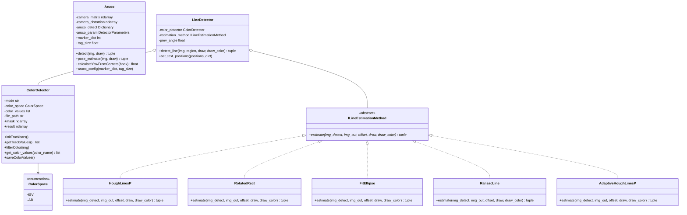
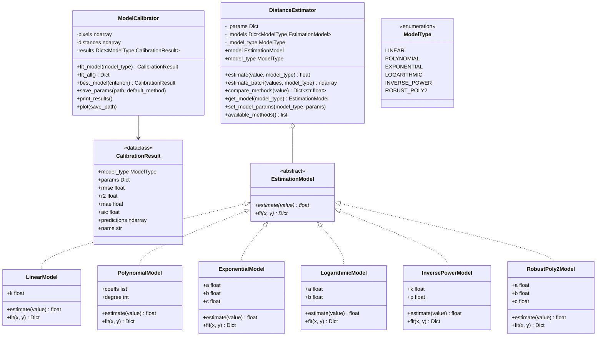
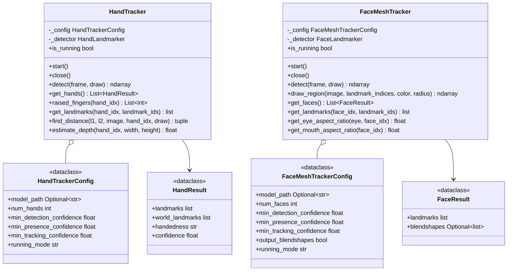

# Visão — Algoritmos

Algoritmos de processamento de imagem que rodam sobre frames de qualquer [câmera](../camera/):
marcadores ArUco, filtragem de cor, detecção de linha, regressão de distância e tracking de
mão/face com MediaPipe. Cada um é uma classe pequena que você constrói uma vez e chama a cada
frame.

Veja também: [Cameras](../camera/) · [ROS 2 nodes](../nodes/) ·
[Vision overview](../).

## Hierarquia de classes



## Marcadores ArUco

Detecta marcadores ArUco usando `cv2.aruco.ArucoDetector` e estima a posição do marcador mais o
yaw via `cv2.aruco.estimatePoseSingleMarkers` (`pose_estimate` devolve a translação e um yaw
derivado dos cantos; o vetor de rotação não é exposto).

> **Nota:** a estimativa de pose exige a matriz intrínseca da câmera, obtida na [calibração de câmera](../camera/#calibracao-de-camera).

```python
Aruco(marker_dict: int, tag_size: float)

bbox, marker_id = aruco.detect(img, draw=True)                  # detection only
marker_id, translation, yaw = aruco.pose_estimate(img, draw=True)  # requires calibration
```

- `marker_dict`: tamanho do dicionário (4, 5, 6, 7 para 4x4, 5x5, ...)
- `tag_size`: tamanho físico do marcador em metros
- `pose_estimate` devolve o id do marcador (ou `None`), a `translation` [x, y, z] em metros
  (frame da câmera), e o `yaw` em graus (0-360)

```python
from nectar.vision import Aruco

aruco = Aruco(marker_dict=5, tag_size=0.05)  # 5x5, 5 cm
marker_id, translation, yaw = aruco.pose_estimate(frame, draw=True)
if marker_id is not None:
    x, y, z = translation
    print(f"Marker {marker_id}: x={x:.2f} y={y:.2f} z={z:.2f} yaw={yaw:.1f}")
```

## Detecção de cor

Filtragem por espaço de cor usando `cv2.inRange()` com operações morfológicas. HSV (hue 0-179,
saturation/value 0-255) e LAB (L 0-255, a/b 0-255) são suportados. Dois modos: `track`
(calibração interativa por trackbar) e `preset` (carrega valores pré-calibrados de um JSON).

```python
ColorDetector(mode: str = "track", color: str = None, color_space: ColorSpace = ColorSpace.HSV, file_path: str = None)

detector.filterColor(img)  # updates detector.mask and detector.result
detector.initTrackbars()   # calibration window (track mode)
detector.saveColorValues() # save calibration to JSON
```

```python
from nectar.vision import ColorDetector, ColorSpace

# track: tune thresholds live, then saveColorValues("red")

detector = ColorDetector(mode="track", color_space=ColorSpace.HSV)
detector.initTrackbars()

# preset: load saved values from JSON

detector = ColorDetector(mode="preset", color="red", color_space=ColorSpace.HSV)
detector.filterColor(frame)
mask = detector.mask
```

JSON de calibração (padrão `~/.config/nectar/color_calibration.json`; passe `file_path=` para um
arquivo da missão). Calibre uma vez com o [nó de calibração de cor](nodes.md) ou
`saveColorValues()`, depois carregue pelo nome. Copie esse arquivo para o mesmo caminho no
veículo, ou passe `-p calibration_file:=/path/to/colors.json`.

```json
{
    "red": {
        "HSV": [[0, 100, 100], [10, 255, 255]],
        "LAB": [[20, 150, 128], [255, 200, 200]]
    },
    "blue": {
        "HSV": [[100, 100, 100], [130, 255, 255]]
    }
}
```

## Detecção de linha

Detecção de linha baseada em cor: uma máscara binária do `ColorDetector` mais um método de
estimação geométrica.

| Método | Algoritmo | Quando usar |
|--------|-----------|-------------|
| `HoughLinesP` | `cv2.HoughLinesP` → `cv2.fitLine` nos pontos finais | Linhas finas, múltiplos segmentos a mesclar |
| `RotatedRect` | `cv2.minAreaRect` no maior contorno | Linhas contínuas espessas, blob único |
| `FitEllipse` | `cv2.fitEllipse` no contorno | Linhas curvas/em forma de arco |
| `RansacLine` | `cv2.fitLine` com DIST_L2 nos pontos do contorno | Máscaras ruidosas com pixels outliers |
| `AdaptiveHoughLinesP` | HoughLinesP com threshold a partir de `mean + std` da máscara | Iluminação variável |

```python
LineDetector(color: str, estimation_method: ILineEstimationMethod, color_space: ColorSpace = None, file_path: str = None)

img, mask, cx, cy, angle, width, height = detector.detect_line(
    img, region=(400, 300), draw=True, draw_color=(0, 255, 0)
)
```

`detect_line` devolve a imagem anotada, a máscara binária da região, o centro da linha `cx, cy`
em pixels, o `angle` em graus (-90 a 90), e a `width, height` média da linha em pixels.

```python
from nectar.vision import LineDetector, HoughLinesP, ColorSpace

detector = LineDetector(
    color="blue", estimation_method=HoughLinesP, color_space=ColorSpace.HSV
)
result, mask, cx, cy, angle, w, h = detector.detect_line(frame, draw=True)
if not math.isnan(cx):
    print(f"Line at ({cx:.0f}, {cy:.0f}), angle {angle:.1f}")
```

## Estimativa de distância

Converte uma medida em pixels para uma distância no mundo real usando modelos de regressão.

> **Nota:** exige dados de calibração — pares `(distance_cm, pixel_value)` coletados em distâncias conhecidas.



| Modelo | Fórmula | Método de ajuste |
|-------|---------|----------------|
| `LINEAR` | d = k / pixels | Média de `distance × pixels` |
| `POLYNOMIAL` | d = Σ(aᵢ × pixelsⁱ) | `np.polyfit` (mínimos quadrados) |
| `EXPONENTIAL` | d = a × e^(-b×pixels) + c | `scipy.optimize.curve_fit` |
| `LOGARITHMIC` | d = a × ln(pixels) + b | `scipy.optimize.curve_fit` |
| `INVERSE_POWER` | d = k / pixels^p | `scipy.optimize.curve_fit` com bounds |
| `ROBUST_POLY2` | d = a×pixels² + b×pixels + c | `sklearn.linear_model.HuberRegressor` (resistente a outliers) |

Calibre uma vez, depois estime:

```python
from nectar.vision.algorithms.distance import ModelCalibrator
from nectar.vision import DistanceEstimator, ModelType
from pathlib import Path

data = [(50, 32.2), (60, 28.5), (70, 24.2), (100, 21.6), (150, 16.8)]  # (distance_cm, pixels)
calibrator = ModelCalibrator(data)
calibrator.fit_all()
calibrator.print_results()
calibrator.save_params(Path("parameters.yaml"))
calibrator.plot(Path("model_comparison.png"))

estimator = DistanceEstimator(model_type=ModelType.POLYNOMIAL)
distance_cm = estimator.estimate(21.6)                 # single
distances = estimator.estimate_batch([15, 20, 25, 30]) # batch
results = estimator.compare_methods(21.6)              # {model: distance}
```

## Tracking com MediaPipe

Detecção de landmarks de mão e face em tempo real usando os modelos do MediaPipe.



Os dois trackers compartilham a mesma forma: construa com uma config, use como context manager,
chame `detect(frame, draw=True)` por frame, e depois leia os landmarks. `model_path=None` baixa
o modelo automaticamente; `running_mode` é `"IMAGE"` (síncrono — resultados disponíveis
imediatamente após `detect()`) ou `"LIVE_STREAM"` (assíncrono — resultados chegam via callback).
Use `"IMAGE"` em scripts simples, a menos que você precise de um pipeline de callback de câmera
ao vivo.

**Tracking de mão** — 21 landmarks por mão, com reconhecimento de gestos por estado dos dedos:

```python
from nectar.vision import HandTracker, HandTrackerConfig

with HandTracker(HandTrackerConfig(num_hands=2, running_mode="IMAGE")) as tracker:
    tracker.detect(frame, draw=True)
    fingers = tracker.raised_fingers()          # [thumb, index, middle, ring, pinky]
    gestures = {
        (0, 0, 0, 0, 0): "fist",
        (1, 1, 1, 1, 1): "open_palm",
        (0, 1, 0, 0, 0): "pointing",
        (0, 1, 1, 0, 0): "peace",
    }
    gesture = gestures.get(tuple(fingers), "unknown")
```

**Tracking de face mesh** — 478 landmarks por face, com aspect ratios de olho/boca e extração de
região:

```python
from nectar.vision import FaceMeshTracker, FaceMeshTrackerConfig, FaceLandmarkRegion

with FaceMeshTracker(FaceMeshTrackerConfig(num_faces=1, running_mode="IMAGE")) as tracker:
    tracker.detect(frame, draw=True)
    if tracker.get_eye_aspect_ratio("left") < 0.15:
        print("Blink detected")
    left_eye = tracker.get_landmarks(landmark_ids=FaceLandmarkRegion.LEFT_EYE)
    tracker.draw_region(frame, FaceLandmarkRegion.LEFT_EYE, color=(0, 255, 0))
```

## Optical flow

`OpticalFlowEstimator` fornece estimativa de movimento esparsa e densa entre frames. Veja
`examples/vision/optical_flow_example.py` para uma visualização executável.

## Referências

| Função / biblioteca | Documentação | Usado em |
|--------------------|---------------|---------|
| `cv2.aruco.ArucoDetector` | [ArUco Detection](https://docs.opencv.org/4.x/d5/dae/tutorial_aruco_detection.html) | `Aruco.detect()` |
| `cv2.aruco.estimatePoseSingleMarkers` | [ArUco Pose](https://docs.opencv.org/4.x/d9/d6a/group__aruco.html#ga84dd2e88f3e8c3255eb78e0f79571571) | `Aruco.pose_estimate()` |
| `cv2.inRange`, `cv2.morphologyEx` | [Thresholding](https://docs.opencv.org/4.x/da/d97/tutorial_threshold_inRange.html) | `ColorDetector.filterColor()` |
| `cv2.HoughLinesP`, `cv2.fitLine` | [Hough Line Transform](https://docs.opencv.org/4.x/d9/db0/tutorial_hough_lines.html) | `HoughLinesP`, `RansacLine` |
| `cv2.minAreaRect`, `cv2.fitEllipse` | [Contour Features](https://docs.opencv.org/4.x/d3/dc0/group__imgproc__shape.html) | `RotatedRect`, `FitEllipse` |
| MediaPipe Hand Landmarker | [docs](https://ai.google.dev/edge/mediapipe/solutions/vision/hand_landmarker) | `HandTracker` |
| MediaPipe Face Landmarker | [docs](https://ai.google.dev/edge/mediapipe/solutions/vision/face_landmarker) | `FaceMeshTracker` |
| `numpy.polyfit` / `scipy.optimize.curve_fit` / `sklearn.HuberRegressor` | [numpy](https://numpy.org/doc/stable/reference/generated/numpy.polyfit.html) · [scipy](https://docs.scipy.org/doc/scipy/reference/generated/scipy.optimize.curve_fit.html) · [sklearn](https://scikit-learn.org/stable/modules/generated/sklearn.linear_model.HuberRegressor.html) | distance models |
