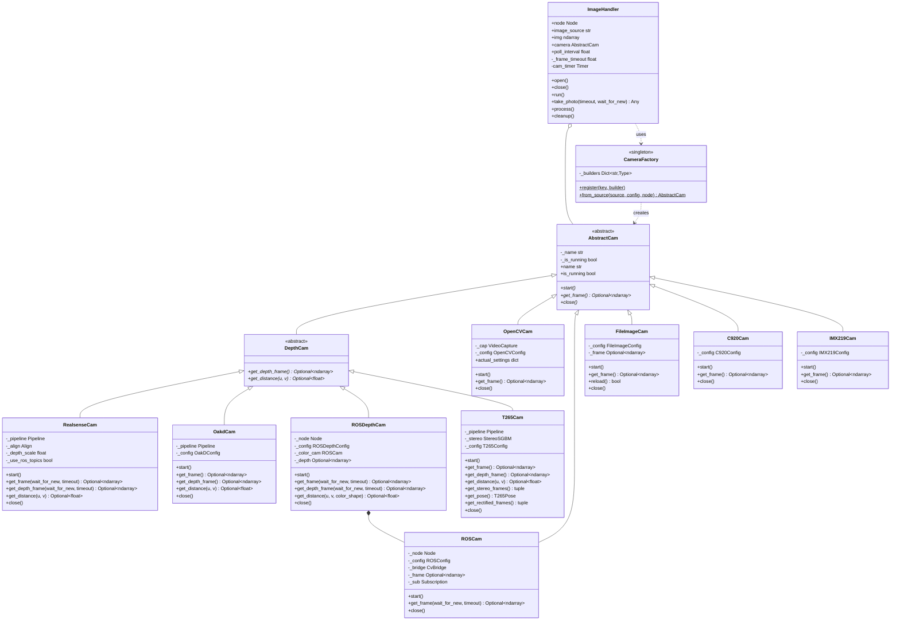
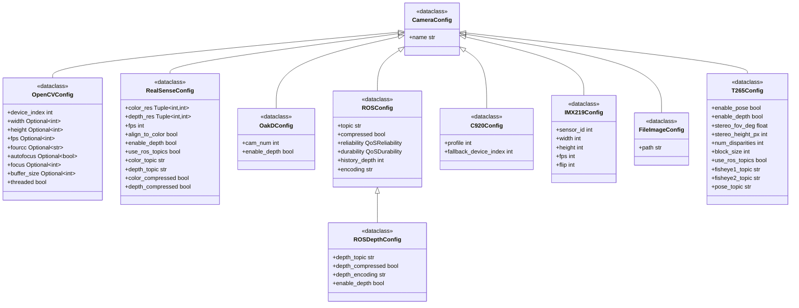

# Visão — Câmeras

Camada de abstração de câmeras para o módulo de visão. A `CameraFactory` abre qualquer câmera
suportada por meio de uma interface comum; o `ImageHandler` transforma uma câmera em um stream
ROS 2 orientado a callback.

Todas as câmeras implementam `AbstractCam` (`start` / `get_frame` / `close`); câmeras com
capacidade de profundidade acrescentam `DepthCam` (`get_depth_frame` / `get_distance`).

Veja também: [Algorithms](../algorithms/) · [ROS 2 nodes](../nodes/) ·
[Vision overview](../).

## Hierarquia de classes



## CameraFactory

Cria instâncias de câmera a partir de um identificador de fonte, detectando automaticamente o
tipo de fonte.

```python
CameraFactory.from_source(source: str, *, config: CameraConfig = None, node: Node = None) -> AbstractCam
CameraFactory.register(key: str, builder: Type[AbstractCam])
```

**Fontes registradas**:

| Chave | Classe de câmera | Descrição |
|-----|--------------|-------------|
| `webcam` | `OpenCVCam` | Webcams USB genéricas |
| `opencv` | `OpenCVCam` | Alias para webcam |
| `realsense` | `RealsenseCam` | Intel RealSense D4xx (cor + profundidade via pyrealsense2) |
| `t265` | `T265Cam` | Intel RealSense T265 (fisheye + profundidade estéreo + pose 6DOF) |
| `oakd` | `OakdCam` | Câmeras Luxonis OAK-D |
| `c920` | `C920Cam` | Logitech C920/C920e |
| `imx219` | `IMX219Cam` | Raspberry Pi Camera v2 (Jetson) |
| `ros` | `ROSCam` | Tópicos de imagem ROS 2 |
| `ros_depth` | `ROSDepthCam` | Tópicos de imagem ROS 2 cor + profundidade |
| `file` | `FileImageCam` | Arquivos de imagem estáticos |

Detecção automática: um caminho de arquivo resolve para `FileImageCam`, uma fonte que começa com
`/` resolve para `ROSCam`, e qualquer chave registrada resolve para sua câmera correspondente.

```python
from nectar.vision import CameraFactory, OpenCVConfig

camera = CameraFactory.from_source("webcam")
camera = CameraFactory.from_source("webcam", config=OpenCVConfig(width=1280, height=720, fps=30))
camera = CameraFactory.from_source("/camera/image_raw", node=node)   # ROS topic
camera = CameraFactory.from_source("/path/to/image.jpg")             # file
```

## ImageHandler

Interface de câmera apoiada por um `Node` ROS 2 interno (registrado no
executor de runtime do SDK — veja
[`nectar.runtime`](https://github.com/Black-Bee-Drones/nectar-sdk/blob/main/nectar/nectar/runtime.py)).
`run()` captura frames em uma thread worker (`get_frame(wait_for_new=True)` para tópicos
ROS e OpenCV threaded). Essa espera não pode rodar no executor: o `EventsExecutor` é
single-thread, então um timer que espera a próxima imagem ROS trava, e um timer que
copia o último frame a cada 0.3 ms compete com a subscription e com a inferência.
A janela OpenCV, se habilitada, permanece em um timer ROS.

```python
ImageHandler(
    image_source: str,
    image_processing_callback: Callable = None,
    show_result: str = None,             # OpenCV window name
    *,
    config: CameraConfig = None,
    camera: AbstractCam = None,          # pre-configured camera
    poll_interval: float = 0.01,         # sync grab sleep / display timer (seconds)
    frame_timeout: float = 0.1,          # frame wait timeout (async)
    executor: Executor = None,           # defaults to nectar.runtime executor
)
```

| Método | Finalidade |
|--------|---------|
| `run()` | Inicia a captura contínua em uma thread worker |
| `open()` | Inicialização manual da câmera |
| `close()` | Interrompe a câmera |
| `take_photo(timeout_sec=1.0, wait_for_new=True)` | Captura única (single-shot) |
| `cleanup()` | Libera a câmera, destrói o timer, desregistra o nó interno |

```python
import nectar
from nectar.vision import ImageHandler, OpenCVConfig

nectar.init()
handler = ImageHandler(
    image_source="webcam",
    config=OpenCVConfig(width=1280, height=720),
    image_processing_callback=lambda frame: detector.detect(frame),
    show_result="Camera View",
)
handler.run()
nectar.spin()
```

## AbstractCam e DepthCam

`AbstractCam` é a classe base para todo driver; `DepthCam` a estende para câmeras RGB-D.

```python
class AbstractCam(ABC):
    name: str                              # camera identifier
    is_running: bool                       # capture status

    def start() -> None                    # initialize camera
    def get_frame() -> Optional[ndarray]   # capture BGR frame
    def close() -> None                    # release resources

class DepthCam(AbstractCam):
    def get_depth_frame() -> Optional[ndarray]           # depth in meters (float32)
    def get_distance(u: int, v: int) -> Optional[float]  # distance at pixel
```

## Classes de configuração

Cada driver recebe uma config em dataclass, subclasse de `CameraConfig`.



## Câmera de tracking T265 {#t265-tracking-camera}

A T265 tem duas câmeras fisheye global-shutter de 848x800 (30 Hz), uma IMU BMI055 (giroscópio a
200 Hz, acelerômetro a 62 Hz), e um VPU Movidius Myriad 2 embarcado rodando V-SLAM, que emite pose
6DOF a 200 Hz.

Não é uma câmera de profundidade. A `T265Cam` computa profundidade estéreo no host a partir do
par fisheye, usando o StereoSGBM do OpenCV com correção de distorção fisheye Kannala-Brandt,
seguindo a referência
[librealsense t265_stereo.py](https://github.com/IntelRealSense/librealsense/blob/v2.53.1/wrappers/python/examples/t265_stereo.py).
O alcance efetivo de profundidade é de ~0,3-3 m, dada a baseline de 64 mm.

**Modos de acesso**:

| Modo | `use_ros_topics` | Quando usar |
|------|-------------------|-------------|
| Direto | `False` | T265 dedicada ao SDK. Usa o pipeline baseado em callback do pyrealsense2. |
| Tópicos ROS | `True` | `realsense2_camera` já em execução. Assina os tópicos de fisheye + CameraInfo + pose. |

> **Aviso:** quando o `realsense2_camera` detém o dispositivo USB, o modo direto falha. Use o modo de tópicos ROS para compartilhar a câmera.

O pipeline de profundidade estéreo roda uma vez em `start()` (intrínsecos/extrínsecos
Kannala-Brandt a partir dos perfis do pyrealsense2 ou de `CameraInfo`, mapas de undistort/rectify,
matrizes de projeção/reprojeção), e depois por frame em `get_depth_frame()` (remapeia o par
fisheye, roda o `cv2.StereoSGBM`, converte disparidade em profundidade via
`depth = focal * baseline / disparity`).

**`T265Config`**:

| Parâmetro | Tipo | Padrão | Descrição |
|-----------|------|---------|-------------|
| `enable_pose` | bool | `True` | Assina/captura o stream de pose 6DOF |
| `enable_depth` | bool | `True` | Computa profundidade estéreo a partir do par fisheye |
| `stereo_fov_deg` | float | `90.0` | FOV de saída para as imagens estéreo rectificadas |
| `stereo_height_px` | int | `300` | Altura de saída em pixels (largura = altura + max_disp) |
| `num_disparities` | int | `96` | Faixa máxima de busca de disparidade do StereoSGBM (divisível por 16) |
| `block_size` | int | `16` | Tamanho de bloco do StereoSGBM |
| `use_ros_topics` | bool | `False` | `True`: assina tópicos ROS. `False`: pyrealsense2 direto. |
| `fisheye1_topic` | str | `/camera/fisheye1/image_raw` | Tópico do fisheye esquerdo (modo ROS) |
| `fisheye2_topic` | str | `/camera/fisheye2/image_raw` | Tópico do fisheye direito (modo ROS) |
| `pose_topic` | str | `/camera/pose/sample` | Tópico de pose (modo ROS, Odometry ou PoseStamped) |

**`T265Pose`** (devolvido por `get_pose()`):

| Campo | Tipo | Descrição |
|-------|------|-------------|
| `translation` | ndarray (3,) | Posição [x, y, z] em metros |
| `rotation` | ndarray (4,) | Quaternion [x, y, z, w] |
| `velocity` | ndarray (3,) | Velocidade linear [vx, vy, vz] m/s |
| `angular_velocity` | ndarray (3,) | Velocidade angular [wx, wy, wz] rad/s |
| `tracker_confidence` | int | 0 (falhou) a 3 (alta) |
| `timestamp` | float | Timestamp sincronizado com o host, em segundos |

```python
from nectar.vision import T265Cam, T265Config

# Direct mode (T265 dedicated to the SDK)

cam = T265Cam(T265Config(enable_depth=True, enable_pose=True))
cam.start()
frame = cam.get_frame()          # left fisheye (BGR, 800x848x3)
depth = cam.get_depth_frame()    # stereo depth (float32, meters, 300x300)
pose = cam.get_pose()            # T265Pose
left, right = cam.get_stereo_frames()

# ROS topic mode (realsense2_camera already running)

cam = T265Cam(T265Config(use_ros_topics=True), node=node)
cam.start()
```

**Opções de V-SLAM** (somente no modo direto, definidas no sensor de pose antes de
`pipeline.start()`):

| Opção | Nome no pyrealsense2 | Padrão | Descrição |
|--------|-------------------|---------|-------------|
| Mapeamento | `rs.option.enable_mapping` | 1 (ativo) | Mapa de features interno. Reduz o drift por meio de pequenos loop closures. |
| Relocalização | `rs.option.enable_relocalization` | 1 (ativo) | Reconecta ao mapa após um grande drift. Pode causar saltos grandes de pose. |
| Salto de pose | `rs.option.enable_pose_jumping` | 1 (ativo) | Permite correções de translação descontínuas. |
| Preservação de mapa | `rs.option.enable_map_preservation` | 0 (inativo) | Preserva o mapa entre ciclos de stop/start. |

> **Aviso:** para voo de drone com o EKF do ArduPilot, desative a relocalização e o salto de pose (o EKF não lida bem com teletransportes descontínuos de posição); mantenha o mapeamento ativado. Veja [PR #4321](https://github.com/IntelRealSense/librealsense/pull/4321), [realsense-ros #779](https://github.com/IntelRealSense/realsense-ros/issues/779).
>
> **Nota — versões do T265 e do RealSense:** o suporte a RealSense usa duas pilhas
> independentes:
>
> 1. **Sistema / ROS (`make realsense`)** — compila o **librealsense** e o **realsense-ros** a
>    partir do source. Sobrescreva as versões com `LIBREALSENSE_VERSION` e `REALSENSE_ROS_TAG`
>    (os padrões por distro do ROS estão em `scripts/lib/config.sh`). Para a T265, descontinuada
>    no Humble: `LIBREALSENSE_VERSION=v2.53.1 REALSENSE_ROS_TAG=4.51.1 make realsense`. Esse
>    build também instala um **pyrealsense2** correspondente em `/usr/local/lib` (adicionado ao
>    `PYTHONPATH`).
> 2. **Extra do pip (`nectar-sdk[realsense]`)** — instala o **pyrealsense2 do PyPI ≥2.55** para
>    o **modo direto D4xx** (`RealsenseCam`). O PyPI descontinuou o suporte à T265 (TM2) depois
>    da versão 2.53.x; o extra do pip não é destinado à T265.
>
> Para a T265: use o **modo de tópicos ROS** (`T265Config(use_ros_topics=True)`) com as versões
> de `make realsense` da T265 acima, ou o **modo direto** com o pyrealsense2 de um build source
> v2.53.1 — não apenas o extra do pip isoladamente. Veja [RealSense setup](../../../setup/realsense/).

## Calibração de câmera

A calibração intrínseca computa a matriz de câmera 3×3 (fx, fy, cx, cy) e os coeficientes de
distorção (k1, k2, p1, p2, k3). Um único nó `CameraCalibration` trata os dois padrões de
tabuleiro e grava os arquivos de saída compartilhados (`camera_matrix.txt`,
`camera_distortion.txt`), carregados via `load_calibration()`.

| Padrão | Valor de `pattern` | Notas |
|---------|-----------------|-------|
| ChArUco (padrão, recomendado) | `charuco` | Precisão subpixel de tabuleiro de xadrez combinada com a robustez do ArUco a oclusão e visões parciais, então frames nas bordas da imagem ainda contribuem |
| Chessboard | `chessboard` | Tabuleiro de xadrez impresso simples, totalmente visível em cada frame, com refinamento via `cornerSubPix` |

**Modos de captura**:

| Modo | Valor de `mode` | Comportamento |
|------|--------------|----------|
| Auto (padrão) | `auto` | Aceita uma view automaticamente quando o tabuleiro é detectado com pelo menos `min_corners_per_frame` cantos e `auto_interval` segundos tiverem passado. Para depois de `target_views`. |
| Manual | `manual` | Acionado por teclas na janela de preview: `c` captura, `u` desfaz a última, `r` reseta tudo, `Enter` finaliza + calibra, `q` sai. Exige uma janela GUI; recorre ao modo auto quando nenhuma está disponível. |

A janela de preview é opcional (`show_preview`), então o nó roda headless (por exemplo, em um
Jetson via SSH). O progresso é logado no terminal nos dois modos.

**Imprima o tabuleiro** (ChArUco): qualquer PDF de tabuleiro de
[`carlosmccosta/charuco_detector`](https://github.com/carlosmccosta/charuco_detector/tree/master/boards/vector_format/black_and_white)
em escala 100%. Os padrões correspondem ao PDF A4, 5×7, quadrado de 40 mm, marcador de 30 mm,
DICT_4X4_1000. Cole a impressão em uma superfície rígida e plana. Impressoras rescalam ~0,5-2%,
então meça N quadrados com um paquímetro após imprimir e calcule o tamanho real do quadrado; o
comprimento do marcador escala pelo mesmo fator (30/40 = 0,75 para esse tabuleiro).

```bash
ros2 run nectar calibration.py                                          # auto ChArUco (default)
ros2 run nectar calibration.py --ros-args -p width:=1920 -p height:=1080 # match production resolution

ros2 run nectar calibration.py --ros-args \
    -p pattern:=chessboard -p mode:=manual \
    -p chessboard_cols:=9 -p chessboard_rows:=7 -p square_length:=0.025  # manual chessboard

ros2 run nectar calibration.py --ros-args -p show_preview:=false         # headless
```

Calibre na mesma resolução que você vai usar em produção (os intrínsecos são específicos da
resolução). Mova o tabuleiro para preencher diferentes regiões da imagem e use inclinações
fortes (pitch/yaw ±30°), especialmente perto das bordas, onde a distorção é mais forte.

**Parâmetros**:

| Parâmetro | Tipo | Padrão | Descrição |
|-----------|------|---------|-------------|
| `pattern` | string | `charuco` | Padrão do tabuleiro: `charuco` ou `chessboard` |
| `mode` | string | `auto` | Modo de captura: `auto` ou `manual` |
| `image_source` | string | `webcam` | Fonte de câmera (qualquer valor de `CameraFactory`) |
| `device_index` | int | `0` | Índice do `VideoCapture` do OpenCV (só para `webcam`/`opencv`) |
| `width` | int | `0` | Largura de captura solicitada; `0` mantém o padrão da câmera |
| `height` | int | `0` | Altura de captura solicitada; `0` mantém o padrão da câmera |
| `chessboard_cols` | int | `9` | Cantos internos em X (só chessboard) |
| `chessboard_rows` | int | `7` | Cantos internos em Y (só chessboard) |
| `squares_x` | int | `5` | Quadrados do tabuleiro em X (só charuco) |
| `squares_y` | int | `7` | Quadrados do tabuleiro em Y (só charuco) |
| `square_length` | float | `0.040` | Lado do quadrado medido em metros (paquímetro após imprimir) |
| `marker_length` | float | `0.030` | Lado do marcador medido em metros (charuco; escala com `square_length`) |
| `aruco_dict` | string | `DICT_4X4_1000` | Nome do dicionário predefinido (charuco); abreviação `4X4_1000` aceita |
| `min_corners_per_frame` | int | `6` | Número mínimo de cantos exigido para aceitar um frame |
| `target_views` | int | `20` | Views aceitas a coletar antes da calibração automática |
| `auto_interval` | float | `0.75` | Segundos entre capturas automáticas (modo auto) |
| `show_preview` | bool | `true` | Janela de preview ao vivo; desativada automaticamente quando não há GUI disponível |
| `save_dataset` | bool | `true` | Também grava os frames aceitos em `dataset/` |
| `output_dir` | string | `""` | Diretório de saída; vazio resolve para o diretório do pacote de calibração, para que `load_calibration()` o encontre |

Procure obter `reprojection_error < 0.5 px` (logado após a calibração). Valores acima de 1,0 px
disparam um aviso e geralmente indicam um tabuleiro flexionado, motion blur, ou baixa cobertura de
poses.

```python
from nectar.vision.camera import CameraCalibration

matrix, distortion = CameraCalibration.load_calibration()
```

## Geometria de imagem (ImageCalculus)

Transformações de coordenadas de pixel para mundo, para câmeras voltadas para baixo, usando um
modelo de câmera pinhole com aproximações de pequeno ângulo para compensação de pitch/roll.

```python
from nectar.vision.utils import ImageCalculus

calc = ImageCalculus(
    camera_offset={"forward": 0.1, "right": 0.0, "up": 0.0},   # meters
    camera_resolution={"width": 1920, "height": 1080},
    pixels_per_degree={"horizontal": 30, "vertical": 30},
)

# Ground intersection from a pixel -> (forward, right, down) in meters

vector = calc.calculate_vector_from_drone_to_ground(
    target_pixel=(640, 360), height=10.0, pitch=5.0, roll=2.0
)

# Pixel -> GPS

lat, lon = ImageCalculus.estimate_pixel_gps(
    origin_lat=-27.1234, origin_lon=-48.4567,
    origin_row=540, origin_col=960,
    target_row=300, target_col=800,
    gsd=0.05, image_bearing=45.0,
)

# Meters -> pixel offset

offset_px = ImageCalculus.calculate_offset_pixels(
    offset_meters=0.1, height_meters=10.0, fov_degrees=60.0, image_pixels=1920
)
```

## Referências

| SDK | Documentação | Classe de câmera |
|-----|---------------|--------------|
| Intel RealSense (D4xx) | [RealSense SDK 2.0](https://dev.intelrealsense.com/docs/docs-get-started) | `RealsenseCam` |
| Intel RealSense (T265) | [T265 docs](https://github.com/IntelRealSense/librealsense/blob/v2.53.1/doc/t265.md), [t265_stereo.py](https://github.com/IntelRealSense/librealsense/blob/v2.53.1/wrappers/python/examples/t265_stereo.py) | `T265Cam` |
| DepthAI | [Luxonis DepthAI](https://docs.luxonis.com/software/) | `OakdCam` |
| GStreamer | [nvarguscamerasrc](https://docs.nvidia.com/jetson/archives/r35.4.1/DeveloperGuide/text/SD/CameraDevelopment/CameraSoftwareDevelopmentSolution.html) | `IMX219Cam` |
| `cv2.VideoCapture` | [Video I/O](https://docs.opencv.org/4.x/d8/dfe/classcv_1_1VideoCapture.html) | `OpenCVCam` |
| `cv2.calibrateCamera` | [Camera Calibration](https://docs.opencv.org/4.x/dc/dbb/tutorial_py_calibration.html) | `CameraCalibration` |
| `cv2.aruco.CharucoDetector` | [ChArUco Detection](https://docs.opencv.org/4.x/df/d4a/tutorial_charuco_detection.html) | `CameraCalibration` |
| `sensor_msgs/Image`, `CompressedImage` | [sensor_msgs](https://docs.ros.org/en/humble/p/sensor_msgs/) | `ROSCam`, camera publisher node |
| `cv_bridge` | [cv_bridge](https://github.com/ros-perception/vision_opencv/tree/humble) | `ROSCam` |
