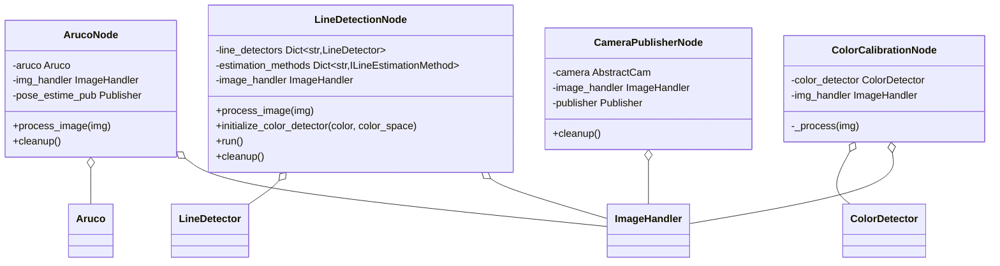

# Visão — Nós ROS 2

Nós prontos para rodar que envolvem os [algoritmos](../algorithms/) e as [câmeras](../camera/)
de visão como executáveis ROS 2 (`ros2 run nectar <node>.py`). Cada um controla um
`ImageHandler` internamente e publica em mensagens `nectar_interfaces`.

Veja também: [Cameras](../camera/) · [Algorithms](../algorithms/) ·
[Vision overview](../).

## Arquitetura



## Nó de detecção ArUco

```bash
ros2 run nectar aruco_node.py --ros-args \
    -p image_source:=webcam -p marker_dict:=5 -p tag_size:=0.05
```

| Parâmetro | Tipo | Padrão | Descrição |
|-----------|------|---------|-------------|
| `image_source` | string | webcam | Fonte de câmera |
| `marker_dict` | int | 5 | Dicionário ArUco (4, 5, 6, 7) |
| `tag_size` | float | 0.2 | Tamanho do marcador em metros |

Publica `/aruco/pose_estimate` (`nectar_interfaces/ArucoTransforms`).

## Nó de detecção de linha

```bash
ros2 run nectar line_detection_node.py --ros-args \
    -p line_colors:="blue,red" -p method:=HoughLinesP \
    -p spaces:="hsv,lab" -p image_source:=webcam -p show_visualization:=true
```

| Parâmetro | Tipo | Padrão | Descrição |
|-----------|------|---------|-------------|
| `line_colors` | string | teste | Nomes de cor separados por vírgula, do JSON de calibração (por exemplo, `blue,red`). O padrão `teste` é um placeholder — defina nomes que existam no seu arquivo. |
| `method` | string | HoughLinesP | Método de estimação |
| `spaces` | string | hsv | Espaços de cor separados por vírgula |
| `image_source` | string | webcam | Fonte de câmera |
| `show_visualization` | bool | true | Mostra a janela OpenCV |
| `visualization_name` | string | Line Detection | Título da janela |
| `calibration_file` | string | (vazio) | JSON de calibração. Vazio usa `~/.config/nectar/color_calibration.json`. |

Métodos: `HoughLinesP`, `RotatedRect`, `FitEllipse`, `RansacLine`, `AdaptiveHoughLinesP`. Por
cor, publica `/line_state/{color}` (`nectar_interfaces/LineInfo`) e `/line_detect/{color}`
(`std_msgs/Bool`).

## Nó de calibração de cor

```bash
ros2 run nectar color_calibration_node.py --ros-args \
    -p image_source:=webcam -p color_space:=hsv -p flood_tolerance:=15
```

Calibração interativa HSV/LAB em uma única janela: clique com o botão esquerdo em uma região
colorida para computar automaticamente os thresholds via flood fill, depois ajuste fino com as
seis trackbars de canal. A visão empilhada mostra `original | mask | result`.

| Parâmetro | Tipo | Padrão | Descrição |
|-----------|------|---------|-------------|
| `image_source` | string | webcam | Fonte de câmera |
| `color_space` | string | hsv | Espaço de cor inicial (`hsv` ou `lab`) |
| `flood_tolerance` | int | 15 | Tolerância inicial de flood-fill para a amostragem por clique |
| `calibration_file` | string | (vazio) | JSON de calibração. Vazio usa `~/.config/nectar/color_calibration.json`. |

| Tecla | Ação |
|-----|--------|
| clique esquerdo | Amostra a região clicada (flood fill) |
| `c` | Alterna HSV / LAB |
| `s` | Salva (pede um nome de cor) |
| `l` | Carrega uma cor nomeada |
| `z` | Desfaz a última amostra |
| `r` | Reseta |
| `q` | Sai |

As cores salvas são gravadas em `~/.config/nectar/color_calibration.json` (ou `calibration_file`) e
carregadas via `ColorDetector(mode="preset", color=<name>)` e pelo nó de detecção de linha. Copie
esse arquivo para o mesmo caminho no veículo, ou passe `-p calibration_file:=/path/to/colors.json`.

> **Nota:** este nó exige uma GUI do OpenCV (mouse + trackbars).

## Nó publisher de câmera

Publica qualquer fonte de `CameraFactory` como um tópico de imagem ROS 2. Selecione o driver com
`camera_source` (`webcam`, `realsense`, `oakd`, `c920`, `imx219`, `ros`, ...) e defina os
parâmetros específicos da fonte.

```bash
ros2 run nectar camera_publisher_node.py --ros-args \
    -p camera_source:=webcam -p device_index:=0 \
    -p width:=1280 -p height:=720 -p fps:=30 \
    -p use_compression:=true -p jpeg_quality:=80 -p threaded:=true
```

| Parâmetro | Tipo | Padrão | Descrição |
|-----------|------|---------|-------------|
| `camera_source` | string | webcam | Chave do driver de câmera passada para `CameraFactory` |
| `device_index` | int | 0 | Índice do dispositivo USB/webcam |
| `width` / `height` | int | 640 / 480 | Tamanho do frame |
| `fps` | int | 30 | FPS alvo |
| `use_compression` | bool | true | Publica imagens comprimidas em JPEG |
| `jpeg_quality` | int | 80 | Qualidade do JPEG (0-100) |
| `buffer_size` | int | 2 | Tamanho do buffer da câmera |
| `threaded` | bool | true | Thread de captura em background |

Publica `image_raw/compressed` (`sensor_msgs/CompressedImage`) ou `image_raw`
(`sensor_msgs/Image`, quando a compressão está desabilitada).
