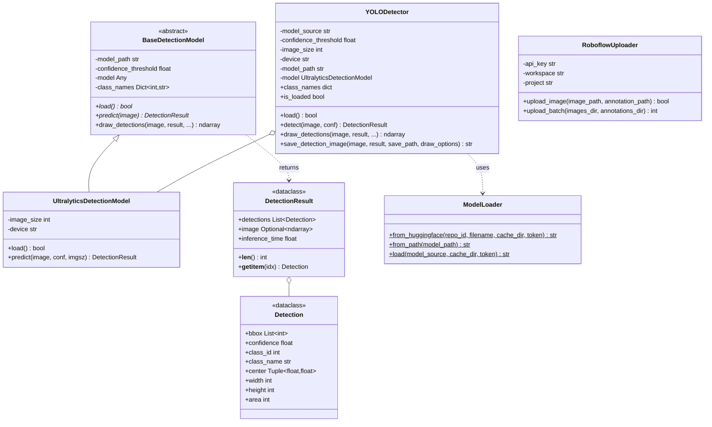

# AI Module

Deep learning inference and model management for aerial robotics. Modular design supports multiple model types and backends.

## Module Structure

```
ai/
├── __init__.py              # Public exports
├── README.md                # This file
│
├── detection/               # Detection implementations
│   ├── __init__.py
│   ├── base.py              # BaseDetectionModel, UltralyticsDetectionModel
│   ├── yolo_detector.py     # YOLODetector
│   └── models/
│       ├── __init__.py
│       └── model_loader.py  # ModelLoader
│
├── utils/                   # Utilities
│   ├── __init__.py
│   └── roboflow_uploader.py # Dataset upload
│
└── notebooks/               # Training notebooks
    └── object_detection_train.ipynb
```

## Architecture



## Core Components

### YOLODetector

YOLO model wrapper with HuggingFace integration and automatic device selection.

**API**:
```python
YOLODetector(
    model_source: str,              # Local path or HuggingFace "repo:file.pt"
    confidence_threshold: float = 0.25,
    image_size: int = 640,          # Input size for inference
    device: str = "auto",           # "auto", "cpu", "cuda", "0", "1", "mps"
    auto_load: bool = True,         # Load model on initialization
    token: Optional[str] = None,    # HuggingFace API token
)
```

**Methods**:
- `load() -> bool`: Load the model (if `auto_load=False`)
- `detect(image, conf) -> DetectionResult`: Run inference
- `draw_detections(image, result, ...) -> ndarray`: Annotate image
- `save_detection_image(image, result, save_path) -> str`: Save annotated image

**Example**:
```python
from mirela_sdk.ai import YOLODetector

# From HuggingFace
detector = YOLODetector(
    model_source="blackbeedrones/cbr-25-base:yolov11n.pt",
    confidence_threshold=0.25,
    device="auto",
)

# From local file
detector = YOLODetector(
    model_source="/path/to/model.pt",
    device="cuda",
)

# Run detection
result = detector.detect(frame)

for det in result.detections:
    print(f"{det.class_name}: {det.confidence:.2f} at {det.center}")

# Visualize
annotated = detector.draw_detections(
    image=frame,
    result=result,
    annotator_type="color",
    show_labels=True,
)
```

### ModelLoader

Model file resolution from local paths or HuggingFace Hub with caching.

**API**:
```python
ModelLoader.load(model_source: str, cache_dir: str = None, token: str = None) -> str
ModelLoader.from_huggingface(repo_id: str, filename: str = None, token: str = None) -> str
ModelLoader.from_path(model_path: str) -> str
```

**Model Source Formats**:
- Local: `/path/to/model.pt`
- HuggingFace: `user/repo:filename.pt`

**Example**:
```python
from mirela_sdk.ai import ModelLoader

# Local file
path = ModelLoader.load("/models/yolo.pt")

# Public HuggingFace
path = ModelLoader.load("ultralytics/yolov8:yolov8n.pt")

# Private HuggingFace
path = ModelLoader.load(
    "company/private-model:detector.pt",
    token="hf_your_token"
)

# Or use environment variable
import os
os.environ["HF_TOKEN"] = "hf_your_token"
path = ModelLoader.load("company/private-model:detector.pt")
```

### Detection & DetectionResult

Data classes for detection results.

**Detection**:
```python
@dataclass
class Detection:
    bbox: List[int]        # [x1, y1, x2, y2]
    confidence: float      # 0.0 to 1.0
    class_id: int          # Class index
    class_name: str = ""   # Human-readable name
    
    # Computed properties
    center: Tuple[float, float]  # (cx, cy) pixel coordinates
    width: int                   # Bounding box width
    height: int                  # Bounding box height
    area: int                    # width * height
```

**DetectionResult**:
```python
@dataclass
class DetectionResult:
    detections: List[Detection]
    image: Optional[np.ndarray] = None    # Original image
    inference_time: float = 0.0           # Seconds
    
    def __len__(self) -> int              # Number of detections
    def __getitem__(self, idx) -> Detection
```

**Example**:
```python
result = detector.detect(frame)

# Iterate detections
for det in result.detections:
    x1, y1, x2, y2 = det.bbox
    cx, cy = det.center
    print(f"Class {det.class_id} ({det.class_name})")
    print(f"  Confidence: {det.confidence:.2%}")
    print(f"  Center: ({cx:.0f}, {cy:.0f})")
    print(f"  Size: {det.width}x{det.height} ({det.area} px²)")

# Filter by class
persons = [d for d in result if d.class_name == "person"]

# Get highest confidence
if result.detections:
    best = max(result.detections, key=lambda d: d.confidence)

# Timing
print(f"Inference: {result.inference_time*1000:.1f}ms")
print(f"FPS: {1/result.inference_time:.1f}")
```

### BaseDetectionModel

Abstract base class for detection models. Extend to add new model architectures (e.g., RT-DETR, DINO).

**Interface**:
```python
class BaseDetectionModel(ABC):
    model_path: str
    confidence_threshold: float
    model: Any
    class_names: Dict[int, str]
    
    @abstractmethod
    def load(self) -> bool
    
    @abstractmethod
    def predict(self, image: np.ndarray, **kwargs) -> DetectionResult
    
    def draw_detections(
        self,
        image: np.ndarray,
        result: DetectionResult,
        show_labels: bool = True,
        show_confidence: bool = True,
        show_class: bool = True,
        annotator_type: str = "box",
        thickness: int = 2,
        text_scale: float = 0.5,
    ) -> np.ndarray
```

## Visualization

Annotation rendering via [Supervision](https://github.com/roboflow/supervision) library.

**Annotator Types**:
| Type | Rendering |
|------|-----------|
| `box` | Rectangle outline (cv2.rectangle) |
| `round_box` | Rectangle with rounded corners |
| `color` | Filled region with alpha=0.3 overlay |

**Example**:
```python
# Standard boxes
annotated = detector.draw_detections(
    image=frame,
    result=result,
    annotator_type="box",
    thickness=2,
)

# Colored regions (good for dense detections)
annotated = detector.draw_detections(
    image=frame,
    result=result,
    annotator_type="color",
    show_confidence=False,
)

# Save result
detector.save_detection_image(
    image=frame,
    result=result,
    save_path="output/detection.jpg",
    draw_options={"annotator_type": "round_box"},
)
```

## Device Management

### Device Selection

`device="auto"` checks `torch.cuda.is_available()` → CUDA, else `torch.backends.mps.is_available()` → MPS, else CPU.

**Device Options**:
| Device | Backend |
|--------|---------|
| `auto` | CUDA → MPS → CPU (priority order) |
| `cpu` | PyTorch CPU tensors |
| `cuda` | CUDA device 0 |
| `0`, `1` | Specific CUDA device index |
| `mps` | Metal Performance Shaders (Apple Silicon) |

**Example**:
```python
# Auto-detect
detector = YOLODetector(model_source="...", device="auto")

# Force CPU
detector = YOLODetector(model_source="...", device="cpu")

# Specific GPU
detector = YOLODetector(model_source="...", device="0")
```

### GPU Verification

```python
import torch

print(f"CUDA available: {torch.cuda.is_available()}")
if torch.cuda.is_available():
    print(f"Device: {torch.cuda.get_device_name(0)}")
    print(f"GPU count: {torch.cuda.device_count()}")
    print(f"Memory: {torch.cuda.get_device_properties(0).total_memory / 1e9:.1f} GB")
```

## Utilities

### RoboflowUploader

Upload images and annotations to Roboflow for dataset management.

```python
from mirela_sdk.ai import RoboflowUploader

uploader = RoboflowUploader(
    api_key="rf_your_api_key",
    workspace="your-workspace",
    project="your-project",
)

# Single image
uploader.upload_image(
    image_path="/path/to/image.jpg",
    annotation_path="/path/to/annotation.txt",  # YOLO format
)

# Batch upload
count = uploader.upload_batch(
    images_dir="/path/to/images",
    annotations_dir="/path/to/labels",
)
print(f"Uploaded {count} images")
```

## Usage Examples

### Real-time Stream

```python
from mirela_sdk.ai import YOLODetector
from mirela_sdk.vision import ImageHandler

class DetectorNode(Node):
    def __init__(self):
        super().__init__("detector")
        
        self.detector = YOLODetector(
            model_source="blackbeedrones/cbr-25-base:yolov11n.pt",
            device="auto",
        )
        
        self.handler = ImageHandler(
            node=self,
            image_source="webcam",
            image_processing_callback=self.process,
            show_result="Detections",
        )
        self.handler.run()
    
    def process(self, frame):
        result = self.detector.detect(frame)
        annotated = self.detector.draw_detections(frame, result)
        frame[:] = annotated
```

### Batch Processing

```python
from mirela_sdk.ai import YOLODetector
from pathlib import Path

detector = YOLODetector(model_source="model.pt", device="cuda")

for img_path in Path("images").glob("*.jpg"):
    image = cv2.imread(str(img_path))
    result = detector.detect(image)
    
    detector.save_detection_image(
        image=image,
        result=result,
        save_path=f"output/{img_path.name}",
    )
```

### With Depth Camera

```python
from mirela_sdk.ai import YOLODetector
from mirela_sdk.vision import RealsenseCam, RealSenseConfig

detector = YOLODetector(model_source="model.pt")

config = RealSenseConfig(enable_depth=True)
cam = RealsenseCam(config)
cam.start()

while True:
    frame = cam.get_frame()
    result = detector.detect(frame)
    
    for det in result.detections:
        cx, cy = det.center
        distance = cam.get_distance(int(cx), int(cy))
        print(f"{det.class_name}: {distance:.2f}m")
```

## Dependencies

| Package | Purpose |
|---------|---------|
| `ultralytics` | YOLO inference engine |
| `supervision` | Detection visualization |
| `torch` | Deep learning backend |
| `huggingface_hub` | Model downloads |
| `numpy` | Array operations |
| `opencv-python` | Image processing |

### Installation

```bash
pip install ultralytics supervision huggingface-hub torch
```