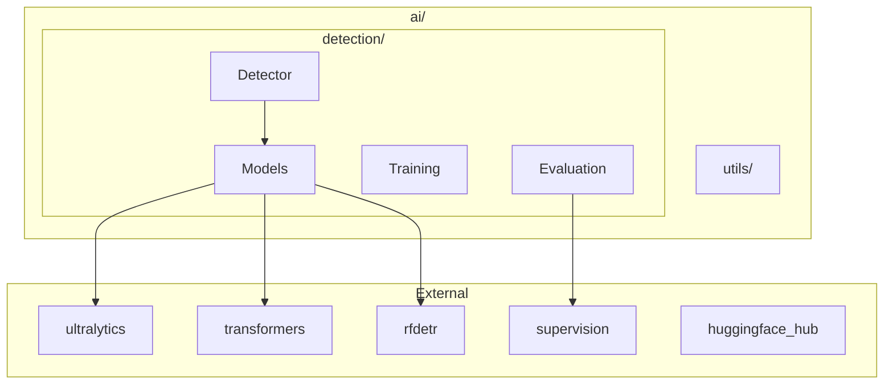

# AI Module

Deep learning inference and model management for aerial robotics.

## Structure

```
ai/
├── detection/          # Object detection (see detection/README.md)
└── utils/              # Utilities (RoboflowUploader)
```

## Architecture



## Quick Start

```python
from mirela_sdk.ai.detection import Detector

detector = Detector("yolov8n.pt")
detector.load()

result = detector.detect(image)
for det in result:
    print(f"{det.class_name}: {det.confidence:.2f}")
```

## Public API

### Detection

```python
from mirela_sdk.ai.detection import (
    # Main API
    Detector,
    Framework,
    
    # Model classes
    UltralyticsModel,
    TransformersModel,
    RFDETRModel,
    BaseDetectionModel,
    
    # Types
    Detection,
    DetectionResult,
    
    # Configs
    TrainingConfig,
    EvaluationConfig,
    
    # Utilities
    ModelLoader,
    ObjectDetectionEvaluator,
)
```

### Detector

Factory-based interface supporting multiple frameworks:

```python
from mirela_sdk.ai.detection import Detector, Framework

# Auto-detect framework
detector = Detector("yolov8n.pt")

# Explicit framework
detector = Detector("model.pt", framework="ultralytics")
detector = Detector("facebook/detr-resnet-50", framework=Framework.TRANSFORMERS)
detector = Detector("rfdetr-base", framework=Framework.RFDETR)

# HuggingFace model
detector = Detector("user/repo:model.pt")

detector.load()
result = detector.detect(image, conf=0.5)
annotated = detector.draw_detections(image, result)
```

### Framework Enum

```python
Framework.ULTRALYTICS  # YOLOv8, YOLOv10, YOLO11
Framework.TRANSFORMERS  # DETR, Conditional DETR
Framework.RFDETR        # RF-DETR
```

### Training

```python
from mirela_sdk.ai.detection import Detector, TrainingConfig

detector = Detector("yolov8n.pt")
detector.load()

config = TrainingConfig(
    dataset_path="/path/to/dataset",
    epochs=100,
    batch_size=16,
    tensorboard=True,
    push_to_hub=True,
    hub_model_id="user/model-name",
)

result = detector.train(config)
```

### Evaluation

```python
from mirela_sdk.ai.detection import EvaluationConfig
from mirela_sdk.ai.detection.evaluation import ObjectDetectionEvaluator

config = EvaluationConfig(
    model_path="best.pt",
    dataset_path="/path/to/dataset",
    framework="ultralytics",
)

evaluator = ObjectDetectionEvaluator(detector.model, config)
metrics = evaluator.evaluate()
print(f"mAP@50: {metrics.map50:.4f}")
```

## Utilities

### RoboflowUploader

```python
from mirela_sdk.ai.utils import RoboflowUploader

uploader = RoboflowUploader(
    api_key="rf_api_key",
    workspace="workspace",
    project="project",
)

uploader.upload_image("image.jpg", "annotation.txt")
count = uploader.upload_batch("images/", "labels/")
```

### ModelLoader

```python
from mirela_sdk.ai.detection import ModelLoader

# Local file
path = ModelLoader.load("/models/model.pt")

# HuggingFace
path = ModelLoader.load("user/repo:model.pt")

# Private repo
path = ModelLoader.load("user/repo:model.pt", token="hf_token")
```

## Device Management

`device="auto"` checks: CUDA → MPS → CPU

```python
detector = Detector("model.pt", device="auto")   # Auto-detect
detector = Detector("model.pt", device="cpu")    # Force CPU
detector = Detector("model.pt", device="0")      # GPU 0
```

## Integration with Vision

```python
from mirela_sdk.ai.detection import Detector
from mirela_sdk.vision import ImageHandler

class DetectorNode(Node):
    def __init__(self):
        super().__init__("detector")
        
        self.detector = Detector("model.pt")
        self.detector.load()
        
        self.handler = ImageHandler(
            node=self,
            image_source="webcam",
            image_processing_callback=self.process,
            show_result="Detections",
        )
        self.handler.run()
    
    def process(self, frame):
        result = self.detector.detect(frame)
        annotated = self.detector.draw_detections(frame, result)
        frame[:] = annotated
```

## Notebooks

Training notebooks are hosted on Google Colab for easy access to GPU resources:

| Notebook | Description |
|----------|-------------|
| [](https://colab.research.google.com/drive/1wIVALzoWfBYOlEwwSncHajSe8_OLjxCP?usp=sharing) | **Object Detection Training** - Train and evaluate YOLO, DETR, and RF-DETR models with Roboflow datasets |

## Dependencies

| Package | Version | Purpose |
|---------|---------|---------|
| `torch` | 2.7.1 | Deep learning backend |
| `torchvision` | 0.22.1 | Vision utilities |
| `ultralytics` | 8.3.152 | YOLO inference |
| `transformers` | 4.53.0 | DETR models |
| `timm` | 1.0.24 | Vision models |
| `rfdetr` | 1.3.0 | RF-DETR |
| `supervision` | 0.26.1 | Visualization, metrics |
| `huggingface-hub` | 0.32.2 | Model downloads |
| `accelerate` | 1.12.0 | Multi-GPU training |
| `tensorboard` | 2.19.0 | Training visualization |
| `albumentations` | 2.0.8 | Data augmentation |
| `roboflow` | 1.1.66 | Dataset management |

### Installation

```bash
# 1. Install PyTorch (based on CUDA version)
# CPU:
pip install torch==2.7.1 torchvision==0.22.1 --index-url https://download.pytorch.org/whl/cpu
# CUDA 12.4:
pip install torch==2.7.1 torchvision==0.22.1 --index-url https://download.pytorch.org/whl/cu124

# 2. Install AI dependencies
pip install -r requirements-ai.txt
```
