# Control Module API Reference

Complete API reference for the Mirela SDK control module.

## Architecture Overview

```mermaid
classDiagram
    %% Factory Pattern
    class DroneFactory {
        <<singleton>>
        +create(type, config, node) Drone
        +register(type, factory_func)
        +available_types() list
        +is_registered(type) bool
    }
    
    %% Protocols (Interfaces)
    class Drone {
        <<protocol>>
        +is_ready bool
        +connect() bool
        +disconnect()
        +arm() bool
        +disarm() bool
        +takeoff(altitude) bool
        +land(timeout) bool
        +move_velocity(vx, vy, vz, vyaw, duration, reference)
        +move_to(x, y, z, yaw, reference, timeout, precision, strategy) bool
        +move_to_gps(lat, lon, alt, heading, timeout, precision, strategy) bool
        +emergency_stop()
        +set_home() bool
        +rtl(altitude, precision, strategy, land) bool
    }
    
    class ObstacleDetector {
        <<protocol>>
        +is_enabled bool
        +update() ObstacleInfo
        +reset()
        +enable()
        +disable()
    }
    
    %% Base Classes
    class BaseDrone {
        <<abstract>>
        -_config DroneConfig
        -_node Node
        -_connected bool
        -_driver_running bool
        -_obstacle_manager ObstacleManager
        +config DroneConfig
        +node Node
        +is_ready bool
        +obstacle_manager ObstacleManager
        +add_obstacle_detector(name, detector, strategy, config)
        +enable_obstacle_detector(name)
        +disable_obstacle_detector(name)
        +delay(seconds)
        +cleanup()
        #_init_driver()
        #_start_driver() bool
        #_get_driver_name() str
    }
    
    class BaseObstacleDetector {
        <<abstract>>
        -_enabled bool
        -_lock Lock
        +is_enabled bool
        +enable()
        +disable()
        +reset()
        +update() ObstacleInfo*
    }
    
    %% Implementations
    class MavrosDrone {
        -_mavros_state State
        -_gps NavSatFix
        -_vision_pos PoseWithCovarianceStamped
        -_heading Float64
        -_rng_alt Range
        -_pid_config PositionPIDConfig
        -_takeoff_position Union
        +is_indoor bool
        +mavros_state State
        +gps NavSatFix
        +heading float
        +rel_alt float
        +vision_pos PoseWithCovarianceStamped
        +lidar_alt float
        +height float
        +position Union
        +set_mode(mode)
        +set_param(param_id, value)
        +do_servo(aux_out, pwm_value)
        +set_takeoff_position(pose, heading)
        +set_pid_config(config)
    }
    
    class BebopDrone {
        +flip(direction)
        +camera_control(tilt, pan)
        +snapshot()
        +flat_trim()
    }
    
    class DepthObstacleDetector {
        -_depth_handler ImageHandler
        -_threshold float
        -_roi tuple
        +update() ObstacleInfo
    }
    
    %% Configuration
    class DroneConfig {
        <<dataclass>>
        +name str
        +start_driver bool
    }
    
    class MavrosConfig {
        <<dataclass>>
        +pose_source PoseSource
        +default_nav_strategy NavigationStrategy
        +connection_string str
        +pid_config_file Optional~str~
        +use_lidar bool
        +state_topic str
        +gps_topic str
        +vision_topic str
        +lidar_topic str
    }
    
    class BebopConfig {
        <<dataclass>>
        +ip str
        +namespace str
    }
    
    %% Obstacle System
    class ObstacleManager {
        -_handlers dict
        +add(name, handler)
        +remove(name) bool
        +enable(name)
        +disable(name)
        +enable_all()
        +disable_all()
        +should_continue_navigation(drone) bool
        +get_axis_control() tuple
        +reset_all()
        +cleanup()
    }
    
    class ObstacleHandler {
        -_detector ObstacleDetector
        -_strategy AvoidanceStrategy
        -_timer Timer
        -_enabled bool
        +should_continue(drone) bool
        +get_axis_modifiers() tuple
        +enable()
        +disable()
        +cleanup()
    }
    
    class AvoidanceStrategy {
        <<abstract>>
        +execute(drone, info) bool*
        +reset()*
    }
    
    class PauseStrategy {
        +execute(drone, info) bool
        +reset()
    }
    
    class DisableAxisStrategy {
        -_disable_x bool
        -_disable_y bool
        -_disable_z bool
        +execute(drone, info) bool
        +reset()
    }
    
    class SequenceStrategy {
        -_sequence_func Callable
        -_state dict
        +execute(drone, info) bool
        +reset()
    }
    
    %% PID System
    class PIDController {
        -_kp float
        -_ki float
        -_kd float
        -_setpoint float
        -_integral float
        -_last_error float
        +update(state) float
        +set_setpoint(value)
        +reset()
    }
    
    class PIDConfig {
        <<dataclass>>
        +kp float
        +ki float
        +kd float
        +output_min float
        +output_max float
    }
    
    class PositionPIDConfig {
        <<dataclass>>
        +x PIDConfig
        +y PIDConfig
        +z PIDConfig
        +yaw PIDConfig
    }
    
    %% Relationships
    DroneFactory --> Drone : creates
    Drone <|.. BaseDrone : implements
    BaseDrone <|-- MavrosDrone : inherits
    BaseDrone <|-- BebopDrone : inherits
    BaseDrone *-- ObstacleManager : contains
    BaseDrone o-- DroneConfig : uses
    
    MavrosDrone o-- MavrosConfig : uses
    MavrosDrone o-- PositionPIDConfig : uses
    BebopDrone o-- BebopConfig : uses
    
    DroneConfig <|-- MavrosConfig : inherits
    DroneConfig <|-- BebopConfig : inherits
    
    ObstacleDetector <|.. BaseObstacleDetector : implements
    BaseObstacleDetector <|-- DepthObstacleDetector : inherits
    
    ObstacleManager o-- ObstacleHandler : manages
    ObstacleHandler o-- ObstacleDetector : uses
    ObstacleHandler o-- AvoidanceStrategy : uses
    
    AvoidanceStrategy <|-- PauseStrategy : inherits
    AvoidanceStrategy <|-- DisableAxisStrategy : inherits
    AvoidanceStrategy <|-- SequenceStrategy : inherits
    
    MavrosDrone ..> PIDController : creates
    PositionPIDConfig *-- PIDConfig : contains
```



## DroneFactory

### Methods

```python
DroneFactory.create(
    drone_type: str,
    config: DroneConfig,
    node: Node
) -> BaseDrone
```

Creates drone instance of specified type.

**Parameters**:
- `drone_type`: `"mavros"`, `"bebop"`, or custom registered type
- `config`: Type-specific configuration (MavrosConfig, BebopConfig, etc.)
- `node`: ROS2 node for communication

**Returns**: BaseDrone subclass instance

**Raises**: `ValueError` if drone_type not registered

---

```python
DroneFactory.register(
    drone_type: str,
    factory_func: Callable[[DroneConfig, Node], BaseDrone]
)
```

Register custom drone type.

**Example**:
```python
DroneFactory.register("custom", CustomDrone.from_config)
```

## BaseDrone

### Properties

```python
@property
def config(self) -> DroneConfig
```
Drone configuration object.

---

```python
@property
def node(self) -> Node
```
ROS2 node instance.

---


```python
@property
def is_ready(self) -> bool
```
Connection status and driver running state.

---

```python
@property
def obstacle_manager(self) -> ObstacleManager
```
Obstacle detection manager instance.

### Core Methods

```python
def connect(self) -> bool
```
Establish connection to drone. Returns connection status.

---

```python
def disconnect(self) -> None
```
Disconnect from drone and cleanup resources.

---

```python
def arm(self) -> bool
```
Arm motors. Returns success status.

---

```python
def disarm(self) -> bool
```
Force disarm motors, bypassing safety checks.

---

```python
def takeoff(self, altitude: float) -> bool
```
Takeoff to specified altitude.

**Parameters**:
- `altitude`: Target altitude in meters

**Returns**: Success status

**Note**: MavrosDrone has additional `max_retries: int = 2` parameter

---

```python
def land(self, timeout: float = 30.0) -> bool
```
Land at current position.

---

```python
def emergency_stop(self) -> None
```
Immediate motor shutdown (force disarm).

### Movement Methods

```python
def move_velocity(
    self,
    vx: float = 0.0,
    vy: float = 0.0,
    vz: float = 0.0,
    vyaw: float = 0.0,
    duration: Optional[float] = None,
    reference: MoveReference = MoveReference.BODY
) -> None
```

Velocity control.

**Parameters**:
- `vx`, `vy`, `vz`: Velocity in m/s (forward, lateral, vertical)
- `vyaw`: Angular velocity in rad/s
- `duration`: Execution time in seconds (None = continuous)
- `reference`: `BODY` or `WORLD` frame

---

```python
def move_to(
    self,
    x: Optional[float] = None,
    y: Optional[float] = None,
    z: Optional[float] = None,
    yaw: Optional[float] = None,
    reference: MoveReference = MoveReference.BODY,
    timeout: Optional[float] = 60.0,
    precision: float = 0.2,
    strategy: NavigationStrategy = NavigationStrategy.PID
) -> bool
```

Position navigation.

**Parameters**:
- `x`, `y`, `z`: Target position in meters (None = no control for that axis)
- `yaw`: Target yaw in degrees (GPS) or radians (vision)
- `reference`: `BODY`, `WORLD`, or `TAKEOFF`
- `timeout`: Maximum navigation time
- `precision`: Arrival threshold in meters
- `strategy`: `PID` or `SETPOINT`

**Returns**: True if target reached, False on timeout

**Raises**: `TakeoffPositionNotSetError` if using `TAKEOFF` reference without setting position

---

```python
def move_to_gps(
    self,
    latitude: float,
    longitude: float,
    altitude: Optional[float] = None,
    heading: Optional[float] = None,
    timeout: Optional[float] = 60.0,
    precision: float = 0.5,
    strategy: NavigationStrategy = NavigationStrategy.PID
) -> bool
```

GPS waypoint navigation.

**Parameters**:
- `latitude`, `longitude`: WGS84 coordinates
- `altitude`: AMSL altitude in meters (None = current altitude)
- `heading`: Target heading in degrees (None = current heading)
- `precision`: Arrival threshold in meters
- `strategy`: `PID` or `SETPOINT`

**Returns**: True if waypoint reached

**Raises**: `CapabilityNotSupportedError` if drone doesn't support GPS

---

```python
def rtl(
    self,
    altitude: Optional[float] = None,
    precision: float = 0.2,
    strategy: RTLStrategy = RTLStrategy.PID,
    land: bool = True
) -> bool
```

Return to launch position.

**Parameters**:
- `altitude`: Transit altitude (None = current altitude)
- `precision`: Arrival threshold for PID strategy
- `strategy`: `PID` (navigate to takeoff) or `ARDUPILOT` (trigger FCU RTL)
- `land`: Execute landing after reaching home

**Returns**: Success status

---

```python
def set_home(self) -> bool
```
Set current position as home. Returns success status.

### Obstacle Management

```python
def add_obstacle_detector(
    self,
    name: str,
    detector: ObstacleDetector,
    strategy: AvoidanceStrategy,
    config: Optional[ObstacleHandlerConfig] = None
) -> None
```

Add obstacle detector to drone.

**Parameters**:
- `name`: Unique identifier
- `detector`: ObstacleDetector implementation
- `strategy`: AvoidanceStrategy implementation
- `config`: Handler configuration (update rate, enabled state)

---

```python
def enable_obstacle_detector(self, name: str) -> None
def disable_obstacle_detector(self, name: str) -> None
def enable_all_obstacle_detectors(self) -> None
def disable_all_obstacle_detectors(self) -> None
def remove_obstacle_detector(self, name: str) -> None
```

Detector state management.

### Utility Methods

```python
def delay(self, seconds: float) -> None
```

Non-blocking delay with ROS spinning.

---

```python
def cleanup(self) -> None
```

Cleanup resources (subscribers, publishers, clients, obstacle detectors).

## MavrosDrone

Extends BaseDrone with MAVROS-specific functionality.

### Additional Properties

```python
@property
def is_indoor(self) -> bool
```
True if `pose_source == PoseSource.VISION`.

---

```python
@property
def mavros_state(self) -> State
```
FCU state (mode, armed, connected).

---

```python
@property
def gps(self) -> NavSatFix
```
GPS data. Raises `SensorNotAvailableError` in indoor mode.

---

```python
@property
def heading(self) -> float
```
Compass heading in degrees. Raises `SensorNotAvailableError` in indoor mode.

---

```python
@property
def vision_pos(self) -> Optional[PoseWithCovarianceStamped]
```
Vision-based pose estimate.

---

```python
@property
def lidar_alt(self) -> Optional[float]
```
Lidar rangefinder altitude.

---

```python
@property
def height(self) -> float
```
Best available altitude: lidar → vision.z → rel_alt.

---

```python
@property
def position(self) -> Union[PoseWithCovarianceStamped, NavSatFix]
```
Current position (vision pose if indoor, GPS if outdoor).

### MAVROS-Specific Methods

```python
def set_mode(self, mode: str) -> None
```

Change FCU flight mode.

**Common Modes**: `"GUIDED"`, `"STABILIZE"`, `"LOITER"`, `"RTL"`, `"LAND"`

---

```python
def set_param(self, param_id: str, param_value: int) -> None
```

Set ArduPilot parameter.

**Example**:
```python
drone.set_param("RTL_ALT", 1500)  # cm
```

---

```python
def do_servo(self, aux_out: int, pwm_value: int) -> None
```

Control auxiliary servo output.

**Parameters**:
- `aux_out`: Servo channel (0-7 maps to channels 9-16)
- `pwm_value`: PWM value (typically 1000-2000)

---

```python
def set_takeoff_position(
    self,
    pose: Optional[Union[PoseWithCovarianceStamped, NavSatFix, PositionTarget, GeoPoseStamped]] = None,
    heading: Optional[float] = None
) -> None
```

Manually set takeoff position.

**Parameters**:
- `pose`: Position to use as takeoff reference (None = current position)
- `heading`: Heading for GPS pose (required if pose is NavSatFix)

---

```python
def set_pid_config(
    self,
    config: Union[str, dict, PositionPIDConfig]
) -> None
```

Update PID configuration.

**Accepts**:
- String: Path to YAML file
- Dict: Configuration dictionary
- PositionPIDConfig: Config object

## BebopDrone

Extends BaseDrone with Bebop-specific functionality.

### Additional Properties

```python
@property
def has_gps(self) -> bool  # False
@property
def supports_position_control(self) -> bool  # False
@property
def supports_velocity_control(self) -> bool  # True
@property
def supports_flips(self) -> bool  # True
```

### Bebop-Specific Methods

```python
def flip(self, direction: int) -> None
```

Execute flip maneuver.

**Direction**: `0=Front`, `1=Back`, `2=Right`, `3=Left`

---

```python
def camera_control(self, tilt: float, pan: float) -> None
```

Control camera gimbal.

**Range**: `tilt=-90 to 90`, `pan=-180 to 180` (degrees)

---

```python
def snapshot(self) -> None
```

Capture photo.

---

```python
def flat_trim(self) -> None
```

Calibrate IMU (drone must be on flat surface).

## Obstacle Detection API

### ObstacleDetector Protocol

```python
@property
def is_enabled(self) -> bool

def enable(self) -> None
def disable(self) -> None
def update(self) -> ObstacleInfo
def reset(self) -> None
```

### AvoidanceStrategy

```python
@abstractmethod
def execute(self, drone: BaseDrone, info: ObstacleInfo) -> bool
    
@abstractmethod
def reset(self) -> None
```

**Returns**: True if navigation should continue, False to pause.

### Built-in Strategies

```python
strategies.PauseStrategy()
strategies.DisableAxisStrategy(disable_x=False, disable_y=False, disable_z=True)
strategies.SequenceStrategy(sequence_func: Callable)
```

### Sequence Functions

```python
strategies.lateral_pass_return_sequence(
    drone: BaseDrone,
    info: ObstacleInfo,
    lateral_distance: float = 1.0,
    forward_distance: float = 2.5,
    precision: float = 0.2
)

strategies.lateral_pass_sequence(drone, info, lateral_distance, forward_distance, precision)
strategies.simple_lateral_sequence(drone, info, lateral_distance, precision)
strategies.climb_over_sequence(drone, info, climb_height, forward_distance, precision)
```

## Type Definitions

### Enums

```python
class PoseSource(Enum):
    GPS = auto()      # Outdoor - satellite positioning
    VISION = auto()   # Indoor - external pose estimation

class MoveReference(Enum):
    BODY = auto()     # Relative to drone orientation
    WORLD = auto()    # Relative to world frame (NED)
    TAKEOFF = auto()  # Relative to takeoff position (position control only)

class NavigationStrategy(Enum):
    PID = auto()       # Velocity-based control with feedback
    SETPOINT = auto()  # Direct position setpoint publishing

class RTLStrategy(Enum):
    PID = auto()        # Navigate to takeoff using PID
    ARDUPILOT = auto()  # Trigger FCU RTL mode

class ObstacleDirection(Enum):
    FRONT = auto()
    BACK = auto()
    LEFT = auto()
    RIGHT = auto()
    UP = auto()
    DOWN = auto()
```

### Data Classes

```python
@dataclass
class ObstacleInfo:
    detected: bool
    direction: Optional[ObstacleDirection] = None
    distance: Optional[float] = None

@dataclass
class ObstacleHandlerConfig:
    enabled: bool = True
    update_rate: float = 0.1  # Hz (0 = manual updates only)

@dataclass
class PIDConfig:
    kp: float = 0.0
    ki: float = 0.0
    kd: float = 0.0
    setpoint: float = 0.0
    output_min: float = -1.0
    output_max: float = 1.0
    integral_min: float = -1.0
    integral_max: float = 1.0

@dataclass
class PositionPIDConfig:
    x: PIDConfig
    y: PIDConfig
    z: PIDConfig
    yaw: PIDConfig
```

## Exception Types

```python
class DroneError(Exception)
    # Base exception for all drone errors

class DriverNotFoundError(DroneError)
    # Raised when drone driver not found or not running

class TakeoffPositionNotSetError(DroneError)
    # Raised when operation requires takeoff position but not set

class SensorNotAvailableError(DroneError)
    # Raised when sensor not available in current mode

class CapabilityNotSupportedError(DroneError)
    # Raised when capability not supported by drone type
```

## Complete Usage Example

```python
import rclpy
from rclpy.node import Node
from mirela_sdk.control import (
    DroneFactory,
    MavrosConfig,
    PoseSource,
    NavigationStrategy,
    MoveReference,
    RTLStrategy,
    DepthObstacleDetector,
    strategies,
    ObstacleHandlerConfig
)
from functools import partial

rclpy.init()
node = Node('advanced_control')

config = MavrosConfig(
    pose_source=PoseSource.VISION,
    navigation=NavigationStrategy.PID,
    pid_config_file="/path/to/custom_pid.yaml"
)

drone = DroneFactory.create("mavros", config, node)

depth_detector = DepthObstacleDetector(node)
evasion_strategy = strategies.SequenceStrategy(
    partial(strategies.lateral_pass_return_sequence, lateral_distance=1.5)
)

drone.add_obstacle_detector(
    "depth",
    depth_detector,
    evasion_strategy,
    ObstacleHandlerConfig(update_rate=0.15)
)
drone.enable_obstacle_detector("depth")

try:
    drone.connect()
    drone.takeoff(altitude=2.0)
    
    drone.move_to(x=3.0, y=2.0, z=0.5, reference=MoveReference.BODY, precision=0.2)
    drone.move_to(x=5.0, y=5.0, z=2.0, reference=MoveReference.WORLD, precision=0.3)
    drone.move_to(x=0.0, y=0.0, z=0.0, reference=MoveReference.TAKEOFF)
    
    drone.rtl(altitude=3.0, strategy=RTLStrategy.PID, land=True)
    
except Exception as e:
    node.get_logger().error(f"Mission failed: {e}")
    drone.emergency_stop()
finally:
    drone.disconnect()
    rclpy.shutdown()
```


