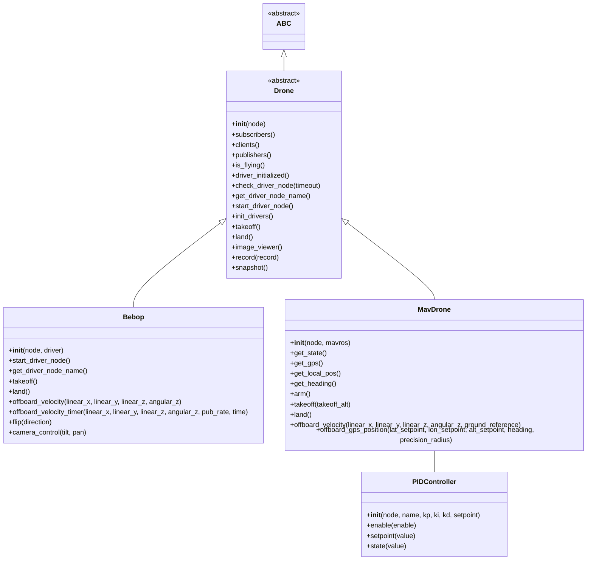

# Drone Control Package 🚁

This package provides an extensible framework for controlling drones via ROS2, with implementations for MAVROS-enabled drones and the Parrot Bebop 2. Below is an example usage and a brief description of the key classes.

---

## **Basic Usage Example**

### **Controlling a Parrot Bebop 2**
```python
from bebop.bebop_api import Bebop
from rclpy.node import Node

class MyBebopNode(Node):
    def __init__(self):
        super().__init__('my_bebop_node')
        self.bebop = Bebop(node=self, driver=True)  # Initialize Bebop with this node
    
    def run(self):
        self.bebop.takeoff()  # Command the drone to take off
        # Add more commands here, such as:
        # self.bebop.offboard_velocity(0.5, 0.0, 0.0, 0.0)
        # self.bebop.flip("forward")
        self.bebop.land()  # Land the drone

# Run your ROS2 node
import rclpy
def main(args=None):
    rclpy.init(args=args)
    node = MyBebopNode()
    try:
        node.run()
    finally:
        node.destroy_node()
        rclpy.shutdown()
```

---

## Features ✨

* **Abstract Drone Control:** The `drone.py` module defines an abstract `Drone` class, providing a common interface for controlling different drone types. This allows for easy integration of new drone platforms.
* **MAVROS Integration:**  Control MAV-enabled drones through the `mavros_api.py` module, offering functionalities like takeoff/landing, setting flight modes, GPS control, and more.
* **Parrot Bebop 2 Support:**  Fly your Bebop 2 with ease using the `bebop_api.py` module, providing commands for takeoff/landing, velocity control, flips, camera adjustments, and snapshots.
* **Precision Landing:**  The `precision_landing.py` module enables precise landing using ArUco marker detection, ideal for targeted package delivery.
* **GPS Controller:**  Leverage the `gps_controller.py` module for advanced GPS functionalities like geofencing, geoid height calculations, and bearing/distance calculations.
* **PID Controller:**  The `controller.py` module provides a Python interface to a ROS2 PID control library, allowing for precise control loops.

## Package Structure 📂

* **`control`**: Contains the core drone control logic.
    * **`drone.py`**: Abstract base class for drone control.
    * **`mavros`**:  MAVROS-specific implementation.
        * **`__init__.py`**: Exposes `GPSController`, `MavDrone`, and `PrecisionLanding`.
        * **`gps_controller.py`**:  GPS control functionalities.
        * **`mavros_api.py`**: MAVROS API interaction.
        * **`precision_landing.py`**: Precision landing with ArUco markers.
    * **`bebop`**: Bebop-specific implementation.
        * **`__init__.py`**: Exposes the `Bebop` class.
        * **`bebop_api.py`**: Bebop API interaction.
    * **`pid`**: PID controller implementation.
        * **`__init__.py`**: Exposes the `PIDController` class.
        * **`controller.py`**: PID controller logic.

--- 
## **Key Classes**

### **Abstract Base Classes**
- **`Drone`**: The base class for all drone types. Implements fundamental methods like:
  - `takeoff()`, `land()`
  - `init_drivers()`
  - `is_flying()`, `check_driver_node(timeout)`
  
### **MAVROS Drone Implementation**
- **`MavDrone`**: Extends `Drone` for MAV-enabled drones. Key features:
  - `offboard_gps_position(lat, lon, alt, heading, precision_radius)`
  - `arm()`, `land()`
  - Access GPS data with `get_gps()`, `get_heading()`, `get_state()`
  - Precision control with `offboard_velocity()`

### **Parrot Bebop Drone**
- **`Bebop`**: Specialized implementation for the Parrot Bebop 2. Key features:
  - `takeoff()`, `land()`
  - `offboard_velocity()`, `flip(direction)`
  - Camera controls: `camera_control(tilt, pan)`
  - Snapshot and recording functionality

### **PID Control**
- **`PIDController`**: A utility for precise control loops. Key methods:
  - `setpoint(value)`: Define the target value for the PID loop.
  - `enable(enable)`: Activate/deactivate the PID controller.
  - `state(value)`: Update the current state.

---


