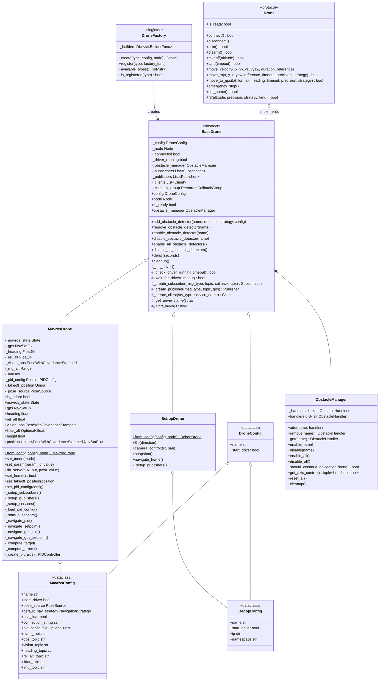
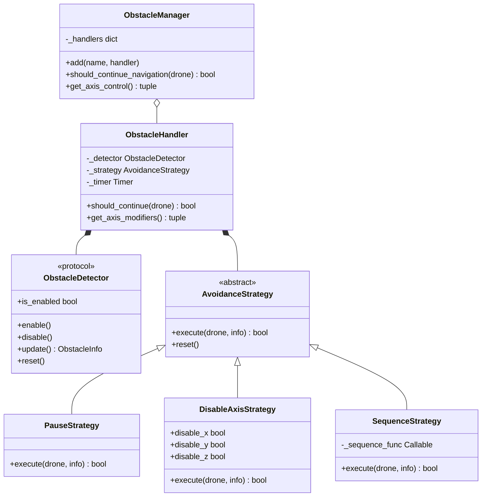

# Drone Control Module

Protocol-based drone control framework for ROS2 with factory pattern instantiation, configurable navigation strategies, and event-based obstacle detection.

## Documentation Index

- **README.md**: This file - Architecture overview and quick start
- **API.md**: Complete API reference for all classes and methods
- **mavros/README.md**: MAVROS-specific implementation details
- **bebop/README.md**: Parrot Bebop 2 implementation details
- **obstacles/README.md**: Obstacle detection system documentation
- **pid/README.md**: PID controller implementation and tuning

## Architecture



## Core Components

### DroneFactory

Centralized drone instantiation with type registration.

**API**:
```python
DroneFactory.create(drone_type: str, config: DroneConfig, node: Node) -> BaseDrone
DroneFactory.register(drone_type: str, factory_func: Callable)
```

**Supported Types**:
- `mavros`: ArduPilot/PX4 via MAVROS
- `bebop`: Parrot Bebop 2

**Example**:
```python
from mirela_sdk.control import DroneFactory, MavrosConfig, PoseSource

config = MavrosConfig(pose_source=PoseSource.VISION)
drone = DroneFactory.create("mavros", config, node)
```

### Drone Protocol

Duck-typed interface defining drone contract. All drones must implement:

**Core Operations**:
- `connect()`, `disconnect()`: Connection management
- `arm()`, `disarm()`: Motor control
- `takeoff()`, `land()`: Vertical maneuvers
- `emergency_stop()`: Force shutdown

**Movement**:
- `move_velocity()`: Direct velocity control
- `move_to()`: Position navigation
- `move_to_gps()`: GPS waypoint navigation
- `rtl()`: Return-to-launch

**State**:
- `state`: Current drone state (armed, flying, mode)
- `is_ready`: Connection and driver status

### BaseDrone

Abstract base providing common functionality.

**Responsibilities**:
- Driver lifecycle (start, monitor)
- ROS2 resource management (subscribers, publishers, clients)
- Obstacle manager integration
- Delay utility with ROS spinning

**Protected Methods**:
- `_create_subscriber()`, `_create_publisher()`, `_create_client()`
- `_init_driver()`, `_check_driver_running()`, `_wait_for_driver()`
- `delay(seconds)`: Non-blocking delay

### Configuration System

Type-safe dataclass hierarchy.

**MavrosConfig**:
```python
MavrosConfig(
    pose_source: PoseSource = PoseSource.GPS,     # GPS or VISION
    navigation: NavigationStrategy = NavigationStrategy.PID,  # PID, SETPOINT
    connection_string: str = "serial:///dev/ttyUSB0:921600",
    pid_config_file: Optional[str] = None,
    state_topic: str = "/mavros/state",
    gps_topic: str = "/mavros/global_position/global",
    vision_topic: str = "/mavros/vision_pose/pose_cov",
    # ... additional topic configurations
)
```

**BebopConfig**:
```python
BebopConfig(
    ip: str = "192.168.42.1",
    namespace: str = "bebop"
)
```

## Movement API

### Reference Frames

```python
class MoveReference(Enum):
    BODY = auto()      # Relative to current orientation
    WORLD = auto()     # NED frame (vision) or GPS frame (outdoor)
    TAKEOFF = auto()   # Relative to takeoff position (position control)
```

### Velocity Control

```python
drone.move_velocity(
    vx: float = 0.0,           # Forward velocity (m/s)
    vy: float = 0.0,           # Lateral velocity (m/s)
    vz: float = 0.0,           # Vertical velocity (m/s)
    vyaw: float = 0.0,         # Angular velocity (rad/s)
    duration: Optional[float] = None,  # Execution time (seconds)
    reference: MoveReference = MoveReference.BODY  # BODY or WORLD
)
```

### Position Navigation

```python
drone.move_to(
    x: Optional[float] = None,
    y: Optional[float] = None,
    z: Optional[float] = None,
    yaw: Optional[float] = None,  # degrees for GPS, radians for vision
    reference: MoveReference = MoveReference.BODY,
    timeout: Optional[float] = 60.0,
    precision: float = 0.2,
    strategy: NavigationStrategy = NavigationStrategy.PID
) -> bool
```

**Navigation Strategies**:
- `PID`: Velocity-based control with feedback loop (precise, configurable)
- `SETPOINT`: Direct position setpoint publishing (simpler, less precise)

### GPS Navigation

```python
drone.move_to_gps(
    latitude: float,
    longitude: float,
    altitude: Optional[float] = None,  
    heading: Optional[float] = None,   # degrees
    timeout: Optional[float] = 60.0,
    precision: float = 0.5,            # meters
    strategy: NavigationStrategy = NavigationStrategy.PID
) -> bool
```

**Features**:
- EGM96 geoid height correction
- Body-frame error calculation using GPS and compass
- Haversine distance computation

### Return-to-Launch

```python
drone.rtl(
    altitude: Optional[float] = None,  # Transit altitude (meters)
    precision: float = 0.2,
    strategy: RTLStrategy = RTLStrategy.PID,  # PID or ARDUPILOT
    land: bool = True
) -> bool
```

**RTL Strategies**:
- `PID`: Navigate to takeoff position using PID control
- `ARDUPILOT`: Trigger ArduPilot's native RTL mode

## Obstacle Detection

Event-based system using strategy pattern.



### Integration

```python
from mirela_sdk.control import strategies

# Simple pause behavior
drone.add_obstacle_detector(
    "depth",
    DepthObstacleDetector(node),
    strategy=strategies.PauseStrategy()
)

# Custom evasion sequence
from functools import partial

strategy = strategies.SequenceStrategy(
    partial(strategies.lateral_pass_return_sequence, lateral_distance=1.0)
)
drone.add_obstacle_detector("depth", detector, strategy)

# Disable Z axis for terrain following
strategy = strategies.DisableAxisStrategy(disable_z=True)
drone.add_obstacle_detector("lidar", detector, strategy)

drone.enable_all_obstacle_detectors()
```

See `obstacles/README.md` for complete documentation.

## PID Control

Configurable position control with separate gains for X, Y, Z, yaw axes.

**Configuration** (`config/mavros/position_indoor.yaml`):
```yaml
x:
  kp: 0.5
  ki: 0.0
  kd: 0.0
  output_min: -0.42
  output_max: 0.42
```

**Runtime Updates**:
```python
from mirela_sdk.control.pid import PositionPIDConfig, PIDConfig

config = PositionPIDConfig(
    x=PIDConfig(kp=0.8, output_min=-1.0, output_max=1.0),
    y=PIDConfig(kp=0.8, output_min=-1.0, output_max=1.0),
    z=PIDConfig(kp=0.5, output_min=-0.8, output_max=0.8),
    yaw=PIDConfig(kp=0.5, ki=0.1, output_min=-0.3, output_max=0.3)
)
drone.set_pid_config(config)
```

See `pid/README.md` for implementation details.

## Exception Hierarchy

```python
DroneError
├── ConnectionError
├── DriverNotFoundError
├── TakeoffError
├── LandingError
├── NavigationError
│   ├── TakeoffPositionNotSetError
│   ├── InvalidModeError
│   └── InvalidStrategyError
├── SensorNotAvailableError
├── CapabilityNotSupportedError
├── GPSError
└── TimeoutError
```

## Usage Examples

### Basic Flight

```python
import rclpy
from rclpy.node import Node
from mirela_sdk.control import DroneFactory, MavrosConfig, PoseSource

rclpy.init()
node = Node('drone_control')

config = MavrosConfig(pose_source=PoseSource.VISION)
drone = DroneFactory.create("mavros", config, node)

drone.takeoff(altitude=1.5)
drone.move_to(x=2.0, y=1.0, z=0.0, precision=0.2)
drone.rtl(land=True)
```

### GPS Waypoint Mission

```python
config = MavrosConfig(pose_source=PoseSource.GPS)
drone = DroneFactory.create("mavros", config, node)

waypoints = [
    (-27.1234, -48.4567, 15.0),
    (-27.1245, -48.4578, 15.0),
    (-27.1256, -48.4589, 15.0)
]

drone.takeoff(altitude=15.0)

for lat, lon, alt in waypoints:
    drone.move_to_gps(lat, lon, alt, precision=1.0)

drone.land()
```

### Multiple Reference Frames

```python
from mirela_sdk.control.types import MoveReference

drone.takeoff(1.5)

# Body-relative
drone.move_to(x=1.0, y=0.5, z=0.0, reference=MoveReference.BODY)

# World-frame
drone.move_to(x=5.0, y=3.0, z=2.0, reference=MoveReference.WORLD)

# Takeoff-relative
drone.move_to(x=0.0, y=0.0, z=0.0, reference=MoveReference.TAKEOFF)
```

### Obstacle-Aware Navigation

```python
from mirela_sdk.control import DepthObstacleDetector, strategies

detector = DepthObstacleDetector(node)
drone.add_obstacle_detector("depth", detector, strategies.PauseStrategy())
drone.enable_obstacle_detector("depth")

drone.takeoff(1.5)
drone.move_to(x=10.0, y=0.0, z=0.0)  # Pauses when obstacles detected
drone.land()
```

## Implementation Modules

- **mavros/**: MAVROS-specific implementation (MavrosDrone, GPS utilities, PID navigation)
- **bebop/**: Parrot Bebop 2 implementation (BebopDrone, velocity control, acrobatic maneuvers)
- **obstacles/**: Obstacle detection system (detectors, strategies, handlers)
- **pid/**: PID controller implementation and configuration

See individual module READMEs for detailed documentation.

## Type System

**Enums**:
- `PoseSource`: GPS, VISION
- `MoveReference`: BODY, WORLD, TAKEOFF
- `NavigationStrategy`: PID, SETPOINT
- `RTLStrategy`: PID, ARDUPILOT
- `ObstacleDirection`: FRONT, BACK, LEFT, RIGHT, UP, DOWN
- `DroneState`: Current state snapshot
- `Position`, `Velocity`, `GPSCoordinate`: Spatial data
- `Pose`: Position + Orientation
- `ObstacleInfo`: Detection result

