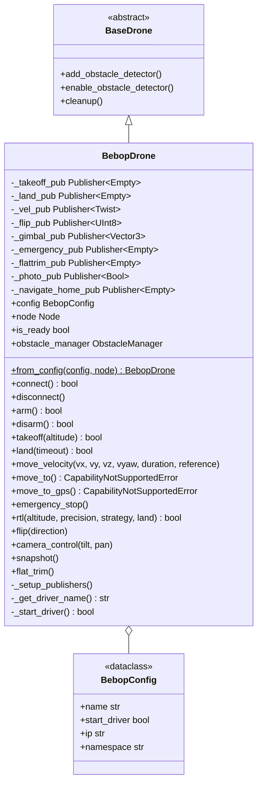

# Bebop Control Module

Parrot Bebop 2 drone control via ROS2 driver for velocity-based flight operations.

## Architecture



## BebopDrone

### Initialization

```python
from mirela_sdk.control import DroneFactory, BebopConfig

config = BebopConfig(
    name="bebop_drone",
    start_driver=True,
    ip="192.168.42.1",      # Bebop WiFi network IP
    namespace="bebop"        # ROS2 topic namespace
)

drone = DroneFactory.create("bebop", config, node)
```

### Properties

```python
drone.config              # BebopConfig: Configuration object
drone.node                # Node: ROS2 node instance
drone.is_ready            # bool: Driver running and connected
drone.obstacle_manager    # ObstacleManager: Obstacle detection system
```

## Capabilities and Limitations

### ✅ Supported Features

| Feature | Status | Notes |
|---------|--------|-------|
| Velocity Control | ✅ | Body frame only, normalized [-1, 1] |
| Takeoff / Land | ✅ | Altitude parameter ignored (fixed height) |
| Emergency Stop | ✅ | Via reset command |
| RTL | ✅ | Uses autoflight navigate_home |
| Flip Maneuvers | ✅ | Front, Back, Left, Right |
| Camera Gimbal | ✅ | Tilt and pan control |
| Photo Capture | ✅ | Onboard camera snapshot |
| IMU Calibration | ✅ | Flat trim command |
| Obstacle Detection | ✅ | Inherited from BaseDrone |

### ❌ Unsupported Features

| Feature | Limitation | Workaround |
|---------|----------|------------|
| Position Control (`move_to`) | Not available | Use velocity commands with external localization |
| GPS Navigation | Not available | Bebop lacks GPS sensor |
| WORLD/TAKEOFF Reference Frames | Body frame only | Transform coordinates externally |
| Altitude Parameter in Takeoff | Ignored | Bebop uses fixed takeoff altitude |
| PID Navigation | Not supported | Implement custom position controller if needed |

**Note**: Attempting to call `move_to()` or `move_to_gps()` raises `CapabilityNotSupportedError`.

## Control API

### Velocity Control

```python
drone.move_velocity(
    vx: float = 0.0,      # Forward (+) / Backward (-), normalized [-1, 1]
    vy: float = 0.0,      # Left (+) / Right (-), normalized [-1, 1]
    vz: float = 0.0,      # Up (+) / Down (-), normalized [-1, 1]
    vyaw: float = 0.0,    # CCW (+) / CW (-), normalized [-1, 1]
    duration: Optional[float] = None,  # Execution time (seconds)
    reference: MoveReference = MoveReference.BODY  # Only BODY supported
)
```

**Velocity Normalization**: All inputs are clamped to [-1.0, 1.0] range.

**Duration Behavior**:
- `None`: Single command publish (continuous until next command)
- `float`: Republish at 30 Hz for specified duration

### Flight Operations

```python
# Takeoff (altitude parameter ignored)
drone.takeoff(altitude=1.5)  # Altitude not used, fixed ~1m height

# Land
drone.land(timeout=30.0)

# Return to Launch
drone.rtl(land=True)  # Triggers autoflight navigate_home

# Emergency stop
drone.emergency_stop()
```

### Bebop-Specific Features

**Acrobatic Flip**:
```python
drone.flip(direction)
# 0 = Front flip
# 1 = Back flip
# 2 = Right flip
# 3 = Left flip
```

**Camera Gimbal Control**:
```python
drone.camera_control(
    tilt=-45.0,   # Degrees: positive=down, negative=up
    pan=15.0      # Degrees: positive=left, negative=right
)
```

**Photo Capture**:
```python
drone.snapshot()  # Capture photo with onboard camera
```

**IMU Calibration**:
```python
drone.flat_trim()  # Must be on flat, level surface
```

## Configuration

### BebopConfig

```python
from mirela_sdk.control import BebopConfig

config = BebopConfig(
    name="bebop_drone",       # Drone identifier
    start_driver=True,        # Auto-start driver on init
    ip="192.168.42.1",        # Bebop WiFi IP address
    namespace="bebop"         # ROS2 topic namespace prefix
)
```

**WiFi Connection**: Bebop creates its own WiFi network. Connect to `Bebop2-XXXXXX` network before launching driver.

## ROS2 Topics

### Publishers

All topics use configured namespace prefix (default: `/bebop`).

| Topic | Type | Purpose |
|-------|------|---------|
| `/{namespace}/takeoff` | Empty | Trigger takeoff |
| `/{namespace}/land` | Empty | Trigger landing |
| `/{namespace}/cmd_vel` | Twist | Velocity commands |
| `/{namespace}/flip` | UInt8 | Execute flip maneuver |
| `/{namespace}/move_camera` | Vector3 | Gimbal control (x=tilt, y=pan) |
| `/{namespace}/reset` | Empty | Emergency stop / reset |
| `/{namespace}/flattrim` | Empty | IMU calibration |
| `/{namespace}/photo` | Bool | Capture photo |
| `/{namespace}/autoflight/navigate_home` | Empty | RTL command |

### Velocity Command Format

```python
# Twist message structure
msg.linear.x   # Forward/backward velocity [-1, 1]
msg.linear.y   # Left/right velocity [-1, 1]
msg.linear.z   # Up/down velocity [-1, 1]
msg.angular.z  # Yaw rate [-1, 1]
```

## Driver Dependencies

BebopDrone requires the [ros2_bebop_driver](https://github.com/jeremyfix/ros2_bebop_driver) ROS2 package.

### Installation

**Dependencies**:
```bash
sudo apt install ros-${ROS_DISTRO}-camera-info-manager libavdevice-dev libavahi-client-dev
```

**Build ros2_parrot_arsdk** (ARSDK 3.14.0 wrapper):
```bash
cd ~/ros2_ws/src
git clone https://github.com/jeremyfix/ros2_parrot_arsdk.git
cd ~/ros2_ws
colcon build --packages-select ros2_parrot_arsdk
```

**Build ros2_bebop_driver**:
```bash
cd ~/ros2_ws/src
git clone https://github.com/jeremyfix/ros2_bebop_driver.git
cd ~/ros2_ws
colcon build --packages-select ros2_bebop_driver --symlink-install
source install/setup.bash
```

### Manual Driver Launch

```bash
ros2 launch ros2_bebop_driver bebop_node_launch.xml ip:=192.168.42.1
```

**Note**: If `BebopConfig.start_driver=True`, the driver is launched automatically via `ProcessUtils.start_process()`.

## Usage Examples

### Basic Flight

```python
import rclpy
from rclpy.node import Node
from mirela_sdk.control import DroneFactory, BebopConfig

rclpy.init()
node = Node('bebop_control')

config = BebopConfig(ip="192.168.42.1")
drone = DroneFactory.create("bebop", config, node)

# Connect and takeoff
drone.connect()
drone.takeoff(altitude=1.5)  # Altitude ignored

# Velocity control
drone.move_velocity(vx=0.3, duration=2.0)  # Forward 2 seconds
drone.move_velocity(vy=0.3, duration=2.0)  # Left 2 seconds
drone.move_velocity(vyaw=0.5, duration=1.0)  # Rotate CCW 1 second

# Land
drone.land()
```

### Acrobatic Maneuvers

```python
drone.takeoff(1.5)
drone.delay(3.0)

# Execute flips
drone.flip(0)  # Front flip
drone.delay(3.0)

drone.flip(2)  # Right flip
drone.delay(3.0)

drone.land()
```

### Camera Operations

```python
drone.takeoff(1.5)

# Tilt camera down 45 degrees
drone.camera_control(tilt=45.0, pan=0.0)
drone.delay(1.0)

# Capture photo
drone.snapshot()
drone.delay(0.5)

# Tilt camera up
drone.camera_control(tilt=-30.0, pan=0.0)
drone.snapshot()

drone.land()
```

### Return to Launch

```python
drone.takeoff(1.5)

# Fly around
drone.move_velocity(vx=0.4, duration=5.0)
drone.move_velocity(vyaw=0.5, duration=2.0)
drone.move_velocity(vx=0.4, duration=5.0)

# Return home and land
drone.rtl(land=True)  # Uses autoflight navigate_home
```

## Error Handling

```python
from mirela_sdk.control.exceptions import (
    CapabilityNotSupportedError,
    DriverNotFoundError
)

try:
    # Position control not supported
    drone.move_to(x=1.0, y=0.5, z=0.0)
except CapabilityNotSupportedError as e:
    node.get_logger().warn(f"Feature not supported: {e}")
    # Use velocity control instead
    drone.move_velocity(vx=0.3, duration=3.0)

try:
    config = BebopConfig(start_driver=True)
    drone = DroneFactory.create("bebop", config, node)
except DriverNotFoundError:
    node.get_logger().error("ros2_bebop_driver not found. Is it installed?")
```

## Network Setup

### WiFi Connection

1. **Power on Bebop 2**
2. **Connect to Bebop WiFi**
3. **Verify IP**: Default is `192.168.42.1`
4. **Test connection**:
   ```bash
   ping 192.168.42.1
   ```

## Limitations and Workarounds

### 1. No Position Control

**Limitation**: Bebop lacks onboard positioning capability.

**Workaround**: Implement external position estimation (e.g., motion capture, visual odometry) and custom position controller:

```python
# Example: Simple position controller using external pose
def simple_position_control(drone, target_x, target_y, current_pose):
    error_x = target_x - current_pose.x
    error_y = target_y - current_pose.y
    
    kp = 0.5
    vx = max(-1.0, min(1.0, kp * error_x))
    vy = max(-1.0, min(1.0, kp * error_y))
    
    drone.move_velocity(vx=vx, vy=vy)
```

### 2. Body Frame Only

**Limitation**: WORLD and TAKEOFF reference frames not supported.

**Workaround**: Transform target coordinates to body frame before sending velocity commands.

### 3. Fixed Takeoff Altitude

**Limitation**: `takeoff(altitude)` parameter ignored by Bebop hardware.

**Workaround**: Use velocity control to adjust altitude after takeoff:

```python
drone.takeoff(altitude=2.0)  # Takes off to ~1m
drone.delay(3.0)

# Climb to desired altitude
drone.move_velocity(vz=0.3, duration=3.0)  # Climb ~3 seconds
```

### 4. No GPS Navigation

**Limitation**: Bebop 2 lacks GPS sensor.

**Workaround**: Indoor positioning only. Use visual-inertial odometry or external tracking systems.

## Troubleshooting

### Driver Not Starting

**Symptom**: `DriverNotFoundError` on initialization.

**Solutions**:
1. Verify driver installation:
   ```bash
   ros2 pkg list | grep ros2_bebop_driver
   ```
2. Check WiFi connection:
   ```bash
   ping 192.168.42.1
   ```
3. Launch driver manually:
   ```bash
   ros2 launch ros2_bebop_driver bebop_node_launch.xml ip:=192.168.42.1
   ```

### Velocity Commands Not Working

**Symptom**: Drone doesn't respond to `move_velocity()`.

**Solutions**:
1. Check driver node is running:
   ```bash
   ros2 node list | grep bebop_driver
   ```
2. Verify topic publication:
   ```bash
   ros2 topic echo /bebop/cmd_vel
   ```
3. Ensure drone is armed (Bebop auto-arms on takeoff)

### Flip Not Executing

**Symptom**: `flip()` command doesn't work.

**Requirements**:
- Drone must be flying (after takeoff)
- Sufficient altitude (>1m recommended)
- Sufficient battery

**Solution**:
```python
drone.takeoff(1.5)
drone.delay(3.0)  
drone.move_velocity(0, 0, 0, 0, duration=0.5)  
drone.delay(1.0)
drone.flip(0) 
```

---

## References

- [ros2_bebop_driver](https://github.com/jeremyfix/ros2_bebop_driver) - ROS2 driver implementation
- [ros2_parrot_arsdk](https://github.com/jeremyfix/ros2_parrot_arsdk) - Parrot ARSDK wrapper
- [Parrot Bebop 2 Specifications](https://www.parrot.com/en/support/documentation/bebop-range) - Official docs page
- [Bebop 2 Commands and Events](https://developer.parrot.com/docs/bebop/index.html?c#commands-and-events) - Official docs page
- [ARSDK Documentation](https://developer.parrot.com/docs/SDK3/) - Parrot SDK version 3


