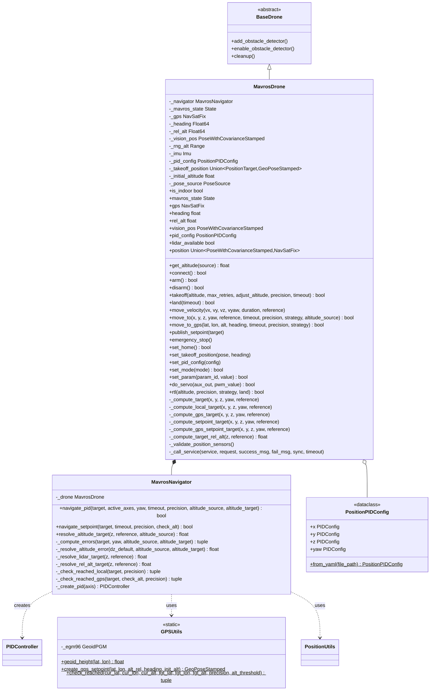
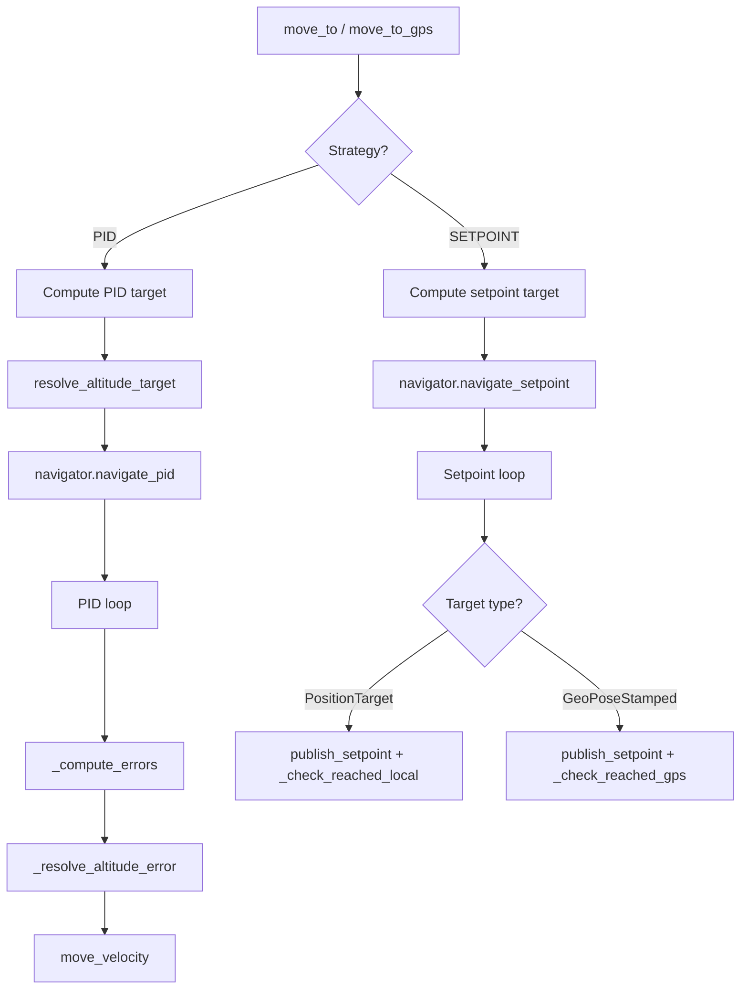

# MAVROS Control Module

ArduPilot/PX4 drone control via MAVROS for ROS2.

## Key Concepts

### MAVLink and MAVROS

[MAVLink](https://ardupilot.org/dev/docs/mavlink-basics.html) is a lightweight binary protocol used for communication between the flight controller (FCU), ground stations, and companion computers. [MAVROS](https://github.com/mavlink/mavros) is a ROS2 node that bridges MAVLink and ROS2, exposing FCU data as topics/services and translating ROS2 commands into MAVLink messages.

This SDK uses MAVROS to send velocity/position commands and read sensor data. The drone must be in [GUIDED mode](https://ardupilot.org/dev/docs/copter-commands-in-guided-mode.html) for offboard control.

### Flight Modes

ArduPilot [flight modes](https://ardupilot.org/copter/docs/flight-modes.html) determine how the FCU interprets inputs. Key modes used by this SDK:

| Mode | Description |
|------|-------------|
| GUIDED | Offboard control. Accepts position/velocity commands from companion computer via MAVLink. Required for SDK navigation. |
| STABILIZE | Manual stabilized flight. Pilot controls via RC. |
| LOITER | GPS-based position hold. Maintains position when sticks centered. |
| RTL | Return to launch. Autonomously flies back to home position and lands. |
| LAND | Auto-land at current position. |

Mode is set via `drone.set_mode()` which calls the [`/mavros/set_mode`](https://docs.ros.org/en/humble/p/mavros/) service. See [MAVLink flight mode protocol](https://ardupilot.org/dev/docs/mavlink-get-set-flightmode.html).

### EKF (Extended Kalman Filter)

The [EKF](https://ardupilot.org/copter/docs/common-apm-navigation-extended-kalman-filter-overview.html) is ArduPilot's state estimator. It fuses IMU, GPS, barometer, and optionally vision/rangefinder data to produce a reliable estimate of the vehicle's position, velocity, and attitude. All altitude and position values in this SDK ultimately come from the EKF's output via MAVROS topics.

### Altitude Types

ArduPilot uses [several altitude definitions](https://ardupilot.org/copter/docs/common-understanding-altitude.html):

| Type | Description | Source | SDK Usage |
|------|-------------|--------|-----------|
| **AGL** (Above Ground Level) | Distance from vehicle to ground directly below | Rangefinder (lidar) | `AltitudeSource.LIDAR`, terrain following |
| **Relative** | Altitude above HOME/ORIGIN. Displayed in GCS/OSD. | EKF (baro + GPS) | `AltitudeSource.REL_ALT`, `move_to_gps` |
| **AMSL** (Above Mean Sea Level) | Altitude above mean sea level | EKF + geoid model | MAVROS GPS setpoint topics |
| **Ellipsoid (WGS84)** | Raw GPS altitude above WGS84 reference ellipsoid. Not the same as AMSL. | GPS receiver | Raw `NavSatFix.altitude` |
| **Vision Z** | Z component from vision pose in local frame. Relative to vision system origin. | External VIO (T265, d435i, etc.) | `AltitudeSource.VISION`, indoor navigation |

**AMSL vs Ellipsoid**: GPS receivers output altitude above the WGS84 ellipsoid, but MAVROS setpoint topics expect AMSL. The difference is the [geoid height](https://en.wikipedia.org/wiki/EGM96), corrected by `GPSUtils` using the EGM96 model.

**Surface Tracking**: When a [downward-facing rangefinder](https://ardupilot.org/copter/docs/common-rangefinder-landingpage.html) is within range, ArduPilot performs [surface tracking](https://ardupilot.org/copter/docs/terrain-following.html) -- adjusting target altitude to maintain constant AGL. Our `AltitudeSource.LIDAR` mode implements a similar concept at the SDK level via PID control.

### Coordinate Frames

| Frame | Axes | Origin | Used For |
|-------|------|--------|----------|
| **NED** (North-East-Down) | X=North, Y=East, Z=Down | Home or local origin | MAVROS local setpoints (`FRAME_LOCAL_NED`) |
| **Body NED** | X=Forward, Y=Right, Z=Down | Vehicle center | Velocity commands (`FRAME_BODY_NED`) |
| **WGS84** | Latitude, Longitude, Altitude | Earth reference ellipsoid | GPS coordinates (`NavSatFix`, `GeoPoseStamped`) |
| **Local Vision** | Depends on VIO setup | Vision system origin | Vision pose (`PoseWithCovarianceStamped`), indoor |

MAVROS bridges between the FCU's internal frames and ROS2 messages. For indoor operation, an external vision system must publish pose to `/mavros/vision_pose/pose_cov`. See [ArduPilot VIO setup](https://ardupilot.org/copter/docs/common-vio-tracking-camera.html) and [vision_to_mavros](https://github.com/Black-Bee-Drones/vision_to_mavros).

The SDK's `MoveReference` enum maps to these frames:
- **BODY**: offsets relative to current position and heading (body NED)
- **WORLD**: velocities in local NED frame (`move_velocity` only)
- **TAKEOFF**: offsets relative to stored takeoff position and heading

## Architecture



## MavrosDrone

### Initialization

```python
from mirela_sdk.control import DroneFactory, MavrosConfig, PoseSource

config = MavrosConfig(
    pose_source=PoseSource.VISION,          # or GPS
    expect_lidar=True,                      # Wait for lidar at startup
    connection_string="serial:///dev/ttyUSB0:921600",
    pid_config_file=None,                   # Optional custom PID config
)

drone = DroneFactory.create("mavros", config, node)
```

### Pose Sources

**VISION** (Indoor):
- Subscribes to `/mavros/vision_pose/pose_cov`
- Uses local NED frame
- Requires external pose estimation (Realsense, T265, etc.)

**GPS** (Outdoor):
- Subscribes to `/mavros/global_position/global`
- Uses WGS84 coordinates with EGM96 geoid correction
- Requires GPS fix and compass heading

### Properties

```python
drone.is_indoor                 # bool: True if pose_source == VISION
drone.mavros_state             # State: FCU state (mode, armed, connected)
drone.gps                      # NavSatFix: GPS data (outdoor only)
drone.heading                  # float: Compass heading degrees (outdoor only)
drone.rel_alt                  # float: Relative altitude (outdoor only)
drone.vision_pos               # PoseWithCovarianceStamped: Vision pose (indoor only)
drone.lidar_available          # bool: Whether lidar data has been received
drone.get_altitude()           # float: Best available altitude (lidar > vision Z > rel_alt)
drone.get_altitude(AltitudeSource.LIDAR)   # float: Lidar rangefinder reading
drone.get_altitude(AltitudeSource.VISION)  # float: Vision pose Z
drone.get_altitude(AltitudeSource.REL_ALT) # float: GPS relative altitude
drone.position                 # Union[PoseWithCovarianceStamped, NavSatFix]
drone.pid_config               # PositionPIDConfig: Current PID configuration
```

### Takeoff

```python
drone.takeoff(altitude=1.5)  # Default: adjust_altitude=True, precision=0.12m, timeout=25s
drone.takeoff(altitude=2.0, adjust_altitude=False)
drone.takeoff(altitude=1.5, precision=0.15, timeout=30.0)
```

**Sequence**:
1. Arms drone in GUIDED mode
2. Sets takeoff position (first attempt only)
3. Sends takeoff command to FCU
4. Waits for altitude gain (verifies height change >= 0.1m)
5. If `adjust_altitude=True`: Uses `move_to()` to fine-tune altitude to target
6. Retries up to `max_retries` times if altitude doesn't change

## Navigation

Navigation logic is encapsulated in `MavrosNavigator` (composition), keeping `MavrosDrone` focused on hardware interface, sensor data, and target computation.

### Capability Matrix

| Entry Point | PoseSource | Strategy | Reference | AltitudeSource | Notes |
|------------|-----------|----------|-----------|----------------|-------|
| `move_to` | VISION | PID | BODY | AUTO, VISION | Default indoor |
| `move_to` | VISION | PID | BODY | LIDAR | Terrain following |
| `move_to` | VISION | PID | TAKEOFF | AUTO, VISION | Absolute from takeoff |
| `move_to` | VISION | PID | TAKEOFF | LIDAR | Absolute height AGL |
| `move_to` | VISION | SETPOINT | BODY, TAKEOFF | N/A | FCU handles altitude |
| `move_to` | GPS | PID | BODY | AUTO, LIDAR | Lidar preferred outdoor |
| `move_to` | GPS | PID | BODY | REL_ALT | Relative altitude |
| `move_to` | GPS | PID | TAKEOFF | AUTO, LIDAR | Absolute height AGL |
| `move_to` | GPS | PID | TAKEOFF | REL_ALT | Relative altitude |
| `move_to` | GPS | SETPOINT | BODY, TAKEOFF | N/A | AMSL-corrected target |
| `move_to` | any | any | WORLD | any | Not supported |
| `move_to_gps` | GPS | PID | N/A | REL_ALT | GPS waypoint with PID |
| `move_to_gps` | GPS | SETPOINT | N/A | N/A | GPS setpoint to FCU |
| `move_to_gps` | VISION | any | N/A | any | Not supported |
| `move_velocity` | any | N/A | BODY, WORLD, TAKEOFF | N/A | Direct velocity |

### Navigation Examples

**Indoor -- move relative to current position (BODY)**:
```python
# Drone moves 2m forward, then 1m left from where it ends up
drone.move_to(x=2.0, y=0.0, z=0.0)             # 2m forward
drone.move_to(x=0.0, y=1.0, z=0.0)             # 1m left
drone.move_to(z=0.5)                            # 0.5m up (x/y disabled)
```

**Indoor -- move relative to takeoff position (TAKEOFF)**:
```python
# Coordinates are absolute offsets from where the drone took off
drone.move_to(x=2.0, y=0.0, z=0.0, reference=MoveReference.TAKEOFF)  # 2m forward of takeoff
drone.move_to(x=2.0, y=1.0, z=0.0, reference=MoveReference.TAKEOFF)  # same X, 1m left of takeoff
drone.move_to(x=0.0, y=0.0, z=0.0, reference=MoveReference.TAKEOFF)  # back to takeoff position
```

**Indoor -- terrain following with lidar**:
```python
# z is height above ground (lidar reading), not position-based
drone.move_to(x=2.0, y=0.0, z=0.3, altitude_source=AltitudeSource.LIDAR)  # fly at 0.3m AGL
drone.move_to(x=2.0, y=0.0, z=1.5, altitude_source=AltitudeSource.LIDAR)  # fly at 1.5m AGL

# With TAKEOFF reference, z is absolute AGL altitude
drone.move_to(x=0.0, y=0.0, z=1.0,
              reference=MoveReference.TAKEOFF,
              altitude_source=AltitudeSource.LIDAR)  # hold 1.0m AGL at takeoff XY
```

**Indoor -- let FCU handle position (SETPOINT)**:
```python
# FCU receives target position directly; no PID loop on our side
drone.move_to(x=2.0, y=1.0, z=0.0, strategy=NavigationStrategy.SETPOINT)
```

**Outdoor -- GPS waypoint navigation**:
```python
# Navigate to absolute GPS coordinates; altitude is relative (above home)
drone.move_to_gps(lat=-27.1234, lon=-48.4567, altitude=15.0, precision=1.0)

# Let FCU handle navigation via setpoint
drone.move_to_gps(lat=-27.1234, lon=-48.4567, altitude=15.0,
                  strategy=NavigationStrategy.SETPOINT)
```

**Outdoor -- relative movement with PID**:
```python
# Move 5m forward from current GPS position using PID + lidar for altitude
drone.move_to(x=5.0, y=0.0, z=0.0, altitude_source=AltitudeSource.LIDAR)
```

**Velocity control**:
```python
# Body-frame: forward relative to where drone is pointing
drone.move_velocity(vx=0.5, vy=0.0, vz=0.0, reference=MoveReference.BODY)

# World-frame: north in NED frame regardless of heading
drone.move_velocity(vx=0.5, vy=0.0, vz=0.0, reference=MoveReference.WORLD)

# Timed: move forward for 2 seconds then stop
drone.move_velocity(vx=1.0, duration=2.0, reference=MoveReference.BODY)
```

### Altitude Source Behavior

| AltitudeSource | Sensor | When Used | dz Computation |
|---------------|--------|-----------|----------------|
| AUTO | Best available | Default for `move_to` | Position-based via `get_body_distance()` |
| LIDAR | Rangefinder | Terrain following, precise AGL | `altitude_target - current_lidar` |
| VISION | Vision pose Z | Indoor altitude hold | Position-based via `get_body_distance()` |
| REL_ALT | GPS relative alt | `move_to_gps` PID, outdoor | `altitude_target - current_rel_alt` |

**LIDAR altitude target resolution**:
- BODY reference: `current_lidar + z` (relative offset)
- TAKEOFF reference: `z` (absolute height above ground)
- Capped at 15m; falls back to position-based if exceeded

### Navigation Flow



### PID Navigation

Velocity-based control with closed-loop feedback via `MavrosNavigator.navigate_pid()`.

**Algorithm**:
```
1. MavrosDrone computes target position (based on reference frame)
2. MavrosDrone resolves altitude_target (based on altitude_source)
3. MavrosNavigator creates PID controllers from config
4. Loop at ~100 Hz:
   a. Compute body-frame errors (dx, dy, dz, dyaw)
   b. Override dz if altitude_target set (LIDAR/REL_ALT source)
   c. Update PID controllers with errors
   d. Generate and publish velocity commands
   e. Check arrival condition
```

**Dead Zone**: Velocity commands zeroed when within `precision / 2` meters to prevent oscillation.

### Setpoint Navigation

Direct position setpoint publishing via `MavrosNavigator.navigate_setpoint()`. Handles both indoor and outdoor targets in a single method:

**Indoor** (PositionTarget): Publishes to `/mavros/setpoint_raw/local`, checks Euclidean distance using vision pose.

**Outdoor** (GeoPoseStamped): Publishes to `/mavros/setpoint_position/global` with AMSL-corrected altitude, checks geodesic distance using GPS and relative altitude.

### Velocity Control

Direct velocity command publishing to flight controller.

**Method**: `move_velocity(vx, vy, vz, vyaw, duration, reference)`

**Reference Frames**:
- **BODY** (default): Uses `FRAME_BODY_NED`. Velocities relative to current orientation.
- **WORLD**: Uses `FRAME_LOCAL_NED`. Velocities relative to world NED frame.
- **TAKEOFF**: Transforms velocities from takeoff frame to body frame before publishing.

**Duration**: If `duration` is specified, command is published at 30 Hz for the specified time. If `None`, command is published once (continuous until next command).

## Reference Frame Transformations

### Supported References by Method

| Method | BODY | WORLD | TAKEOFF |
|--------|------|-------|---------|
| `move_velocity()` | yes | yes | yes |
| `move_to()` | yes | no | yes |

**Note**: `move_to()` does not support `WORLD` reference and will raise `CapabilityNotSupportedError` if used.

### BODY Frame

Relative to current position and orientation.

**move_velocity**: Uses `FRAME_BODY_NED` coordinate frame.

**move_to**: Transforms relative offsets to world coordinates:
```python
dx = x * cos(current_yaw) - y * sin(current_yaw)
dy = x * sin(current_yaw) + y * cos(current_yaw)
target = current_position + (dx, dy, z)
```

### WORLD Frame

Relative to world/local NED frame. **move_velocity only**.

### TAKEOFF Frame

Relative to takeoff position and orientation.

**move_velocity**: Transforms velocities from takeoff frame to body frame before publishing.

**move_to**: Direct offset from takeoff position:
```python
target = takeoff_position + rotate(x, y, z, takeoff_yaw)
```

**Requirement**: Takeoff position must be set via `takeoff()` or `set_takeoff_position()`.

## RTL Implementation

### PID Strategy

Navigate to takeoff position using PID control.

**Sequence**:
1. If altitude specified: climb/descend to altitude
2. Navigate to takeoff position (x=0, y=0, z=0, reference=TAKEOFF)
3. If `land=True`: execute landing

```python
drone.rtl(altitude=5.0, strategy=RTLStrategy.PID, land=True)
```

### ArduPilot Strategy

Trigger ArduPilot's native RTL mode.

**Sequence**:
1. If altitude specified: set RTL_ALT parameter
2. Set mode to "RTL"
3. If `land=False`: return after 5 seconds

```python
drone.rtl(altitude=15.0, strategy=RTLStrategy.ARDUPILOT, land=True)
```

## ROS2 Topics

### Subscribers

| Topic | Type | Purpose |
|-------|------|---------|
| `/mavros/state` | State | FCU connection and mode |
| `/mavros/rangefinder/rangefinder` | Range | Lidar altitude |
| `/mavros/imu/data` | Imu | IMU measurements |
| `/mavros/vision_pose/pose_cov` | PoseWithCovarianceStamped | Vision pose (indoor) |
| `/mavros/global_position/global` | NavSatFix | GPS position (outdoor) |
| `/mavros/global_position/rel_alt` | Float64 | Relative altitude (outdoor) |
| `/mavros/global_position/compass_hdg` | Float64 | Compass heading (outdoor) |

### Publishers

| Topic | Type | Purpose |
|-------|------|---------|
| `/mavros/setpoint_raw/local` | PositionTarget | Velocity/position setpoints |
| `/mavros/setpoint_position/global` | GeoPoseStamped | GPS setpoints (outdoor) |
| `/mavros/setpoint_raw/global` | GlobalPositionTarget | GPS raw setpoints (outdoor) |

### Services

| Service | Type | Purpose |
|---------|------|---------|
| `/mavros/set_mode` | SetMode | Change flight mode |
| `/mavros/cmd/arming` | CommandBool | Arm/disarm motors |
| `/mavros/cmd/takeoff` | CommandTOL | Takeoff command |
| `/mavros/cmd/land` | CommandTOL | Land command |
| `/mavros/cmd/set_home` | CommandHome | Set home position |
| `/mavros/cmd/command` | CommandLong | Generic MAVLink commands |
| `/mavros/param/set_parameters` | SetParameters | Set FCU parameters |

## PID Configuration

### Default Configurations

**Indoor** (`config/mavros/position_indoor.yaml`):
```yaml
x:
  kp: 0.5
  output_min: -0.42
  output_max: 0.42

y:
  kp: 0.5
  output_min: -0.42
  output_max: 0.42

z:
  kp: 0.22
  output_min: -0.15
  output_max: 0.1

yaw:
  kp: 0.5
  ki: 0.1
  output_min: -0.2
  output_max: 0.2
```

**Outdoor** (`config/mavros/position_outdoor.yaml`):
```yaml
x:
  kp: 0.8
  output_min: -1.0
  output_max: 1.0

y:
  kp: 0.8
  output_min: -1.0
  output_max: 1.0

z:
  kp: 0.5
  output_min: -0.8
  output_max: 0.8

yaw:
  kp: 0.5
  ki: 0.1
  output_min: -0.3
  output_max: 0.3
```

### Runtime Updates

```python
# From YAML file
drone.set_pid_config("/path/to/config.yaml")

# From dictionary
drone.set_pid_config({
    "x": {"kp": 0.8, "output_min": -1.0, "output_max": 1.0},
    "y": {"kp": 0.8, "output_min": -1.0, "output_max": 1.0},
    "z": {"kp": 0.5, "output_min": -0.8, "output_max": 0.8},
    "yaw": {"kp": 0.5, "ki": 0.1, "output_min": -0.3, "output_max": 0.3}
})

# From PositionPIDConfig object
from mirela_sdk.control.pid import PositionPIDConfig, PIDConfig

config = PositionPIDConfig(
    x=PIDConfig(kp=0.8, output_min=-1.0, output_max=1.0),
    y=PIDConfig(kp=0.8, output_min=-1.0, output_max=1.0),
    z=PIDConfig(kp=0.5, output_min=-0.8, output_max=0.8),
    yaw=PIDConfig(kp=0.5, ki=0.1, output_min=-0.3, output_max=0.3)
)
drone.set_pid_config(config)
```

## ArduPilot-Specific Features

### Flight Modes

```python
drone.set_mode("GUIDED")     # Offboard control
drone.set_mode("STABILIZE")  # Manual stabilized
drone.set_mode("LOITER")     # Position hold
drone.set_mode("RTL")        # Return to launch
drone.set_mode("LAND")       # Auto land
```

### Parameter Setting

```python
drone.set_param("RTL_ALT", 1500)  # RTL altitude in cm
```

### Servo Control

Controls auxiliary servo outputs (AUX1-AUX8, mapped to FCU channels 9-16). See [ArduPilot Servo Documentation](https://ardupilot.org/copter/docs/common-servo.html).

```python
drone.do_servo(aux_out=1, pwm_value=1500)  # Servo channel 9
drone.do_servo(aux_out=2, pwm_value=2000)  # Servo channel 10
```

## GPS Utilities

`GPSUtils` provides static methods for GPS navigation, used internally by `MavrosNavigator` and `MavrosDrone` for outdoor operations.

### EGM96 Geoid Correction

GPS altitude (WGS84 ellipsoid) differs from AMSL by the geoid height at a given location. MAVROS setpoint topics expect AMSL altitude. `GPSUtils` uses the [EGM96 geoid model](https://en.wikipedia.org/wiki/EGM96) (5-minute grid, cubic interpolation) to convert:

```
AMSL = GPS_ellipsoid_altitude - geoid_height + relative_altitude
```

The EGM96 dataset must be installed (provided by [GeographicLib](https://geographiclib.sourceforge.io/)). Can check in the intallation guide.

### API

**create_gps_setpoint**: Creates a `GeoPoseStamped` with AMSL-corrected altitude and heading quaternion.

```python
from mirela_sdk.control.mavros.gps_utils import GPSUtils

setpoint = GPSUtils.create_gps_setpoint(
    latitude=-27.1234,
    longitude=-48.4567,
    altitude_rel=15.0,         # Relative altitude above home (meters)
    heading=90.0,              # Heading in degrees (0=North, clockwise)
    initial_altitude=100.0,    # GPS altitude at startup for offset calculation
)
# Returns: GeoPoseStamped with AMSL altitude ready for MAVROS
```

**geoid_height**: Returns the EGM96 geoid height for a coordinate.

```python
height = GPSUtils.geoid_height(latitude=-27.1234, longitude=-48.4567)
```

**check_reached**: Checks if current GPS position is within precision of target using geodesic distance.

```python
reached, distance, alt_diff = GPSUtils.check_reached(
    current_lat, current_lon, current_alt,
    target_lat, target_lon, target_alt,
    precision_radius=0.5,   # Horizontal threshold (meters)
    alt_threshold=0.5,      # Vertical threshold (meters)
)
```

## Service Call Behavior

All MAVROS service calls use `_call_service` with automatic response validation and deadlock-safe execution.

Per [ROS 2 guidelines](https://docs.ros.org/en/humble/How-To-Guides/Sync-Vs-Async.html), we use `call_async()` with a spin loop to avoid deadlock:

```python
future = service.call_async(request)
while not future.done():
    rclpy.spin_once(self._node, timeout_sec=0.05)
    if elapsed > timeout:
        raise TimeoutError(...)
result = future.result()
```

| Parameter | Default | Description |
|-----------|---------|-------------|
| `sync` | `True` | If True, waits for response using spin loop. If False, returns immediately. |
| `timeout` | `10.0` | Maximum seconds to wait for service availability and response. |

### Response Validation

| Service Type | Field Checked | Failure Condition |
|--------------|---------------|-------------------|
| `SetMode` | `mode_sent` | `False` |
| `CommandBool`, `CommandTOL`, `CommandLong` | `success`, `result` | `success=False` or `result != ACCEPTED` |
| `SetParameters` | `results[].successful` | Any `False` |

### MAV_RESULT Codes

MAVROS command services return [MAVLink MAV_RESULT](https://mavlink.io/en/messages/common.html#MAV_RESULT) codes in the `result` field:

| Code | Name | Description |
|------|------|-------------|
| 0 | `ACCEPTED` | Command executed successfully |
| 1 | `TEMPORARILY_REJECTED` | Command valid but cannot execute now |
| 2 | `DENIED` | Command invalid or not permitted |
| 3 | `UNSUPPORTED` | Command not supported by autopilot |
| 4 | `FAILED` | Command failed to execute |
| 5 | `IN_PROGRESS` | Command being executed |

Failed commands log the result code:
```
[WARN] /mavros/cmd/arming: Failed (Result: DENIED)
```

---

## References

### MAVLink & MAVROS
- [MAVLink Basics](https://ardupilot.org/dev/docs/mavlink-basics.html)
- [MAVLink Protocol](https://mavlink.io/en/)
- [MAV_RESULT Enum](https://mavlink.io/en/messages/common.html#MAV_RESULT)
- [MAV_CMD Commands](https://mavlink.io/en/messages/common.html#mav_commands)
- [MAVROS GitHub](https://github.com/mavlink/mavros)
- [MAVROS ROS2 API](https://docs.ros.org/en/humble/p/mavros/)
- [MAVROS Wiki (ROS1, still useful)](https://wiki.ros.org/mavros)

### ArduPilot
- [ArduPilot Copter Documentation](https://ardupilot.org/copter/)
- [Flight Modes](https://ardupilot.org/copter/docs/flight-modes.html)
- [MAVLink Flight Mode Protocol](https://ardupilot.org/dev/docs/mavlink-get-set-flightmode.html)
- [GUIDED Mode Commands](https://ardupilot.org/dev/docs/copter-commands-in-guided-mode.html)
- [Understanding Altitude](https://ardupilot.org/copter/docs/common-understanding-altitude.html)
- [EKF Navigation Filter](https://ardupilot.org/copter/docs/common-apm-navigation-extended-kalman-filter-overview.html)
- [Rangefinders](https://ardupilot.org/copter/docs/common-rangefinder-landingpage.html)
- [Terrain Following](https://ardupilot.org/copter/docs/terrain-following.html)
- [Servo Configuration](https://ardupilot.org/copter/docs/common-servo.html)

### Vision & Indoor Navigation
- [VIO Tracking Camera (ArduPilot)](https://ardupilot.org/copter/docs/common-vio-tracking-camera.html)
- [ROS VIO Setup Guide](https://ardupilot.org/dev/docs/ros-vio-tracking-camera.html)
- [vision_to_mavros](https://github.com/Black-Bee-Drones/vision_to_mavros)

### ROS2
- [Sync vs Async Service Clients](https://docs.ros.org/en/humble/How-To-Guides/Sync-Vs-Async.html)
- [ROS2 Executors](https://docs.ros.org/en/humble/Concepts/Intermediate/About-Executors.html)
- [Callback Groups](https://docs.ros.org/en/humble/How-To-Guides/Using-callback-groups.html)
