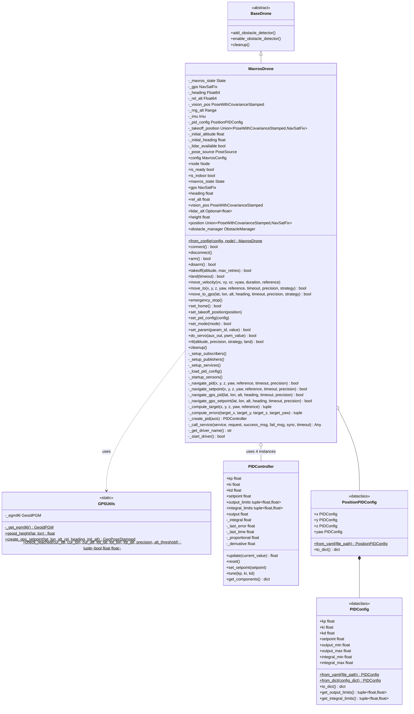

# MAVROS Control Module

ArduPilot/PX4 drone control via MAVROS for ROS2.

## Architecture



## MavrosDrone

### Initialization

```python
from mirela_sdk.control import DroneFactory, MavrosConfig, PoseSource

config = MavrosConfig(
    pose_source=PoseSource.VISION,          # or GPS
    navigation=NavigationStrategy.PID,       # or SETPOINT
    connection_string="serial:///dev/ttyUSB0:921600",
    pid_config_file=None,                    # Optional custom PID config
    state_topic="/mavros/state",
    gps_topic="/mavros/global_position/global",
    vision_topic="/mavros/vision_pose/pose_cov",
    lidar_topic="/mavros/rangefinder/rangefinder",
    imu_topic="/mavros/imu/data",
    rel_alt_topic="/mavros/global_position/rel_alt",
    heading_topic="/mavros/global_position/compass_hdg"
)

drone = DroneFactory.create("mavros", config, node)
```

### Pose Sources

**VISION** (Indoor):
- Subscribes to `/mavros/vision_pose/pose_cov`
- Uses local NED frame
- Requires external pose estimation (ZED, Realsense, etc.)

**GPS** (Outdoor):
- Subscribes to `/mavros/global_position/global`
- Uses WGS84 coordinates with EGM96 geoid correction
- Requires GPS fix and compass heading

### Properties

```python
drone.is_indoor                 # bool: True if pose_source == VISION
drone.mavros_state             # State: FCU state (mode, armed, connected)
drone.gps                      # NavSatFix: GPS data (outdoor only)
drone.heading                  # float: Compass heading degrees (outdoor only)
drone.vision_pos               # PoseWithCovarianceStamped: Vision pose (indoor only)
drone.lidar_alt                # Optional[float]: Lidar rangefinder altitude
drone.height                   # float: Best available altitude source
drone.position                 # Union[PoseWithCovarianceStamped, NavSatFix]
```

## Navigation Implementation

### PID Navigation

Velocity-based control with closed-loop feedback.

**Algorithm**:
```
1. Compute target position (based on reference frame)
2. Calculate body-frame errors (dx, dy, dz, dyaw)
3. Update PID controllers with errors
4. Generate velocity commands
5. Publish to /mavros/setpoint_raw/local
6. Check arrival condition
7. Repeat at 100 Hz
```

**PID Loop**:
```python
vx = pid_x.update(-dx)
vy = pid_y.update(-dy)
vz = pid_z.update(-dz)
vyaw = pid_yaw.update(-dyaw)

msg = PositionTarget()
msg.coordinate_frame = PositionTarget.FRAME_BODY_NED
msg.type_mask = 1479  # Velocity control
msg.velocity.x = vx
msg.velocity.y = vy
msg.velocity.z = vz
msg.yaw_rate = vyaw

local_pub.publish(msg)
```

**Dead Zone**: Velocity commands zeroed when within `precision / 2` meters to prevent oscillation.

### Velocity Control

Direct velocity command publishing to flight controller.

**Method**: `move_velocity(vx, vy, vz, vyaw, duration, reference)`

**Reference Frames**:
- **BODY** (default): Uses `FRAME_BODY_NED`. Velocities relative to current orientation.
- **WORLD**: Uses `FRAME_LOCAL_NED`. Velocities relative to world NED frame.
- **TAKEOFF**: Transforms velocities from takeoff frame to body frame before publishing.

**Duration**: If `duration` is specified, command is published at 30 Hz for the specified time. If `None`, command is published once (continuous until next command).

### Setpoint Navigation

Direct position setpoint publishing to flight controller.

**Indoor** (Vision):
```python
msg = PositionTarget()
msg.coordinate_frame = PositionTarget.FRAME_LOCAL_NED
msg.type_mask = 0b0000111111000111  # Position + yaw
msg.position.x = target_x
msg.position.y = target_y
msg.position.z = target_z
msg.yaw = target_yaw

local_pub.publish(msg)
```

**Outdoor** (GPS):
```python
msg = GeoPoseStamped()
msg.pose.position.latitude = target_lat
msg.pose.position.longitude = target_lon
msg.pose.position.altitude = target_alt  # AMSL with EGM96 correction
msg.pose.orientation = quaternion_from_euler(0, 0, radians(target_heading))

gps_pub.publish(msg)
```

## Reference Frame Transformations

### Supported References by Method

| Method | BODY | WORLD | TAKEOFF |
|--------|------|-------|---------|
| `move_velocity()` | ✅ | ✅ | ✅ |
| `move_to()` | ✅ | ❌ | ✅ |

**Note**: `move_to()` does not support `WORLD` reference and will raise `CapabilityNotSupportedError` if used.

### BODY Frame

Relative to current orientation.

**move_velocity**: Uses `FRAME_BODY_NED` coordinate frame.

**move_to**: Transforms relative offsets to world coordinates:
```python
# Transform to world coordinates
dx = x * cos(current_yaw) - y * sin(current_yaw)
dy = x * sin(current_yaw) + y * cos(current_yaw)
dz = z

target_x = current_x + dx
target_y = current_y + dy
target_z = current_z + dz
```

### WORLD Frame

Relative to world/local NED frame.

**move_velocity only**: Uses `FRAME_LOCAL_NED` coordinate frame. Velocities are interpreted in world frame.

**Not supported in move_to**: Use `BODY` or `TAKEOFF` reference instead.

### TAKEOFF Frame

Relative to takeoff position and orientation.

**move_velocity**: Transforms velocities from takeoff frame to body frame before publishing.

**move_to**: Direct offset from takeoff position:
```python
# Direct offset from takeoff position
target_x = takeoff_x + x
target_y = takeoff_y + y
target_z = takeoff_z + z
target_yaw = takeoff_yaw + yaw
```

**Requirement**: Takeoff position must be set via `takeoff()` or `set_takeoff_position()`.

### GPS Offset Calculation

```python
from mirela_sdk.utils.gps_calculate import GPSCalculate

# Calculate GPS coordinate from body-frame offset
lat, lon, alt = GPSCalculate.calculate_gps_offset(
    x, -y, z,  # NED convention: y inverted
    current_lat, current_lon, current_alt,
    heading
)
```

## RTL Implementation

### PID Strategy

Navigate to takeoff position using PID control.

**Sequence**:
1. If altitude specified: climb/descend to altitude
2. Navigate to takeoff position (x=0, y=0, z=0, reference=TAKEOFF)
3. If `land=True`: execute landing

```python
drone.rtl(altitude=5.0, strategy=RTLStrategy.PID, land=True)
```

### ArduPilot Strategy

Trigger ArduPilot's native RTL mode.

**Sequence**:
1. If altitude specified: set RTL_ALT parameter
2. Set mode to "RTL"
3. If `land=False`: return after 5 seconds

```python
drone.rtl(altitude=15.0, strategy=RTLStrategy.ARDUPILOT, land=True)
```

## ROS2 Topics

### Subscribers

| Topic | Type | Purpose |
|-------|------|---------|
| `/mavros/state` | State | FCU connection and mode |
| `/mavros/rangefinder/rangefinder` | Range | Lidar altitude |
| `/mavros/imu/data` | Imu | IMU measurements |
| `/mavros/vision_pose/pose_cov` | PoseWithCovarianceStamped | Vision pose (indoor) |
| `/mavros/global_position/global` | NavSatFix | GPS position (outdoor) |
| `/mavros/global_position/rel_alt` | Float64 | Relative altitude (outdoor) |
| `/mavros/global_position/compass_hdg` | Float64 | Compass heading (outdoor) |

### Publishers

| Topic | Type | Purpose |
|-------|------|---------|
| `/mavros/setpoint_raw/local` | PositionTarget | Velocity/position setpoints |
| `/mavros/setpoint_position/global` | GeoPoseStamped | GPS setpoints (outdoor) |
| `/mavros/setpoint_raw/global` | GlobalPositionTarget | GPS raw setpoints (outdoor) |

### Services

| Service | Type | Purpose |
|---------|------|---------|
| `/mavros/set_mode` | SetMode | Change flight mode |
| `/mavros/cmd/arming` | CommandBool | Arm/disarm motors |
| `/mavros/cmd/takeoff` | CommandTOL | Takeoff command |
| `/mavros/cmd/land` | CommandTOL | Land command |
| `/mavros/cmd/set_home` | CommandHome | Set home position |
| `/mavros/cmd/command` | CommandLong | Generic MAVLink commands |
| `/mavros/param/set_parameters` | SetParameters | Set FCU parameters |

## PID Configuration

### Default Configurations

**Indoor** (`config/mavros/position_indoor.yaml`):
```yaml
x:
  kp: 0.5
  output_min: -0.42
  output_max: 0.42

y:
  kp: 0.5
  output_min: -0.42
  output_max: 0.42

z:
  kp: 0.22
  output_min: -0.15
  output_max: 0.1

yaw:
  kp: 0.5
  ki: 0.1
  output_min: -0.2
  output_max: 0.2
```

**Outdoor** (`config/mavros/position_outdoor.yaml`):
```yaml
x:
  kp: 0.8
  output_min: -1.0
  output_max: 1.0

y:
  kp: 0.8
  output_min: -1.0
  output_max: 1.0

z:
  kp: 0.5
  output_min: -0.8
  output_max: 0.8

yaw:
  kp: 0.5
  ki: 0.1
  output_min: -0.3
  output_max: 0.3
```

### Runtime Updates

```python
# From YAML file
drone.set_pid_config("/path/to/config.yaml")

# From dictionary
drone.set_pid_config({
    "x": {"kp": 0.8, "output_min": -1.0, "output_max": 1.0},
    "y": {"kp": 0.8, "output_min": -1.0, "output_max": 1.0},
    "z": {"kp": 0.5, "output_min": -0.8, "output_max": 0.8},
    "yaw": {"kp": 0.5, "ki": 0.1, "output_min": -0.3, "output_max": 0.3}
})

# From PositionPIDConfig object
from mirela_sdk.control.pid import PositionPIDConfig, PIDConfig

config = PositionPIDConfig(
    x=PIDConfig(kp=0.8, output_min=-1.0, output_max=1.0),
    y=PIDConfig(kp=0.8, output_min=-1.0, output_max=1.0),
    z=PIDConfig(kp=0.5, output_min=-0.8, output_max=0.8),
    yaw=PIDConfig(kp=0.5, ki=0.1, output_min=-0.3, output_max=0.3)
)
drone.set_pid_config(config)
```

## GPS Utilities

### GPSUtils

Static utility class for GPS-related calculations.

**create_gps_setpoint**:
```python
from mirela_sdk.control.mavros.gps_utils import GPSUtils

setpoint = GPSUtils.create_gps_setpoint(
    latitude=27.1234,
    longitude=-48.4567,
    altitude=15.0,          # Relative altitude
    heading=90.0,           # degrees
    initial_altitude=100.0  # Initial GPS altitude for EGM96 correction
)
# Returns: GeoPoseStamped with AMSL altitude
```

**check_reached**:
```python
reached, distance, alt_error = GPSUtils.check_reached(
    current_lat, current_lon, current_alt,
    target_lat, target_lon, target_alt,
    precision=0.5
)
# Returns: (bool, horizontal_distance, altitude_error)
```

## ArduPilot-Specific Features

### Flight Modes

```python
drone.set_mode("GUIDED")     # Offboard control
drone.set_mode("STABILIZE")  # Manual stabilized
drone.set_mode("LOITER")     # Position hold
drone.set_mode("RTL")        # Return to launch
drone.set_mode("LAND")       # Auto land
```

### Parameter Setting

```python
# Set single parameter
drone.set_param("RTL_ALT", 1500)  # RTL altitude in cm

# Via service call for more complex parameters
from rcl_interfaces.msg import Parameter
from rcl_interfaces.srv import SetParameters

param = Parameter()
param.name = "PARAM_NAME"
param.value.integer_value = 100

req = SetParameters.Request()
req.parameters.append(param)
# Service call via _param_srv
```

### Servo Control

```python
# Control auxiliary outputs (e.g., gripper, camera trigger)
drone.do_servo(aux_out=1, pwm_value=1500)  # Servo channel 9
drone.do_servo(aux_out=2, pwm_value=2000)  # Servo channel 10
```

## Usage Examples

### Indoor Position Control

```python
from mirela_sdk.control import DroneFactory, MavrosConfig, PoseSource

config = MavrosConfig(pose_source=PoseSource.VISION)
drone = DroneFactory.create("mavros", config, node)

drone.takeoff(altitude=1.5)
drone.move_to(x=2.0, y=1.0, z=0.0, precision=0.2)
drone.move_to(x=-1.0, y=0.5, z=0.5, precision=0.2)
drone.rtl(land=True)
```

### Outdoor GPS Mission

```python
config = MavrosConfig(pose_source=PoseSource.GPS)
drone = DroneFactory.create("mavros", config, node)

waypoints = [
    (-27.1234, -48.4567, 15.0),
    (-27.1245, -48.4578, 20.0),
    (-27.1256, -48.4589, 15.0)
]

drone.takeoff(altitude=15.0)

for lat, lon, alt in waypoints:
    success = drone.move_to_gps(lat, lon, alt, precision=1.0)
    if not success:
        drone.node.get_logger().error(f"Failed to reach waypoint")
        break

drone.rtl(strategy=RTLStrategy.ARDUPILOT, land=True)
```

### Mixed Reference Frames

```python
from mirela_sdk.control.types import MoveReference

drone.takeoff(1.5)

# Move 2m forward in body frame
drone.move_to(x=2.0, y=0.0, z=0.0, reference=MoveReference.BODY)

# Velocity control in world frame
drone.move_velocity(vx=0.5, vy=0.0, vz=0.0, reference=MoveReference.WORLD)

# Return to takeoff position
drone.move_to(x=0.0, y=0.0, z=0.0, reference=MoveReference.TAKEOFF)
```

### Velocity Control Examples

```python
from mirela_sdk.control.types import MoveReference

# Body-frame velocity (relative to current orientation)
drone.move_velocity(vx=0.5, vy=0.0, vz=0.0, reference=MoveReference.BODY)

# World-frame velocity (relative to world NED frame)
drone.move_velocity(vx=0.5, vy=0.0, vz=0.0, reference=MoveReference.WORLD)

# Takeoff-frame velocity (relative to takeoff orientation)
drone.move_velocity(vx=0.5, vy=0.0, vz=0.0, reference=MoveReference.TAKEOFF)

# Velocity for specific duration
drone.move_velocity(vx=1.0, duration=2.0, reference=MoveReference.BODY)
```

## Service Call Behavior

All MAVROS service calls use `_call_service` with automatic response validation and deadlock-safe execution.

### Async Pattern with Spin Loop

Per [ROS 2 guidelines](https://docs.ros.org/en/humble/How-To-Guides/Sync-Vs-Async.html), synchronous `client.call()` causes deadlock when called from callbacks or the same thread as the executor. We use `call_async()` with a spin loop:

```python
future = service.call_async(request)
while not future.done():
    rclpy.spin_once(self._node, timeout_sec=0.05)
    if elapsed > timeout:
        raise TimeoutError(...)
result = future.result()
```

This pattern:
- Avoids deadlock (no blocking on executor thread)
- Maintains ROS2 communication during wait
- Allows timeout handling
- Provides synchronous-like behavior when needed

### Parameters

| Parameter | Default | Description |
|-----------|---------|-------------|
| `sync` | `True` | If True, waits for response using spin loop. If False, returns immediately. |
| `timeout` | `10.0` | Maximum seconds to wait for service availability and response. |

### Response Validation

Responses are validated based on message type:

| Service Type | Field Checked | Failure Condition |
|--------------|---------------|-------------------|
| `SetMode` | `mode_sent` | `False` |
| `CommandBool`, `CommandTOL`, `CommandLong` | `success`, `result` | `success=False` or `result != ACCEPTED` |
| `SetParameters` | `results[].successful` | Any `False` |

### MAV_RESULT Codes

MAVROS command services return [MAVLink MAV_RESULT](https://mavlink.io/en/messages/common.html#MAV_RESULT) codes in the `result` field:

| Code | Name | Description |
|------|------|-------------|
| 0 | `ACCEPTED` | Command executed successfully |
| 1 | `TEMPORARILY_REJECTED` | Command valid but cannot execute now |
| 2 | `DENIED` | Command invalid or not permitted |
| 3 | `UNSUPPORTED` | Command not supported by autopilot |
| 4 | `FAILED` | Command failed to execute |
| 5 | `IN_PROGRESS` | Command being executed |

Failed commands log the result code:
```
[WARN] /mavros/cmd/arming: Failed (Result: DENIED)
```

### Usage Examples

**Flight actions** (arm, disarm, takeoff, land) use `sync=True`:

```python
def arm(self) -> bool:
    req = CommandBool.Request()
    req.value = True
    res = self._call_service(
        self._arm_srv, req, "Armed", "Arm failed", sync=True
    )
    return bool(res)
```

**Timeout handling**:

```python
try:
    drone.arm()
except TimeoutError as e:
    drone.node.get_logger().error(f"Service timeout: {e}")

## Error Handling

```python
from mirela_sdk.control.exceptions import (
    TakeoffPositionNotSetError,
    SensorNotAvailableError,
    CapabilityNotSupportedError
)

try:
    # Requires takeoff position
    drone.move_to(x=1.0, reference=MoveReference.TAKEOFF)
except TakeoffPositionNotSetError:
    drone.takeoff(1.5)  # Sets takeoff position
    drone.move_to(x=1.0, reference=MoveReference.TAKEOFF)

try:
    # GPS not available indoors
    if drone.is_indoor:
        heading = drone.heading  # Raises SensorNotAvailableError
except SensorNotAvailableError as e:
    drone.node.get_logger().warn(f"Sensor unavailable: {e}")

try:
    # Service timeout
    drone.arm()
except TimeoutError as e:
    drone.node.get_logger().error(f"Service not available: {e}")
```

---

## References

### MAVLink & MAVROS
- [MAVLink Protocol](https://mavlink.io/en/)
- [MAV_RESULT Enum](https://mavlink.io/en/messages/common.html#MAV_RESULT)
- [MAV_CMD Commands](https://mavlink.io/en/messages/common.html#mav_commands)
- [MAVROS GitHub](https://github.com/mavlink/mavros)
- [MAVROS ROS2 API](https://docs.ros.org/en/humble/p/mavros/)

### ArduPilot
- [ArduPilot Copter Documentation](https://ardupilot.org/copter/)
- [Flight Modes](https://ardupilot.org/copter/docs/flight-modes.html)
- [Understanding Altitude](https://ardupilot.org/copter/docs/common-understanding-altitude.html)

### ROS2
- [Sync vs Async Service Clients](https://docs.ros.org/en/humble/How-To-Guides/Sync-Vs-Async.html)
- [ROS2 Executors](https://docs.ros.org/en/humble/Concepts/Intermediate/About-Executors.html)
- [Callback Groups](https://docs.ros.org/en/humble/How-To-Guides/Using-callback-groups.html)

