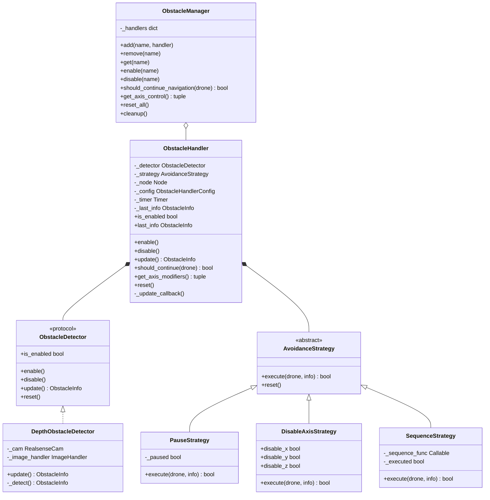

# Obstacle Detection Module

Event-based obstacle detection with strategy pattern for avoidance behaviors.

## Architecture



## Core Concepts

### Separation of Concerns

**Detection** (What): Identify obstacles and return `ObstacleInfo`  
**Strategy** (How): Define response behavior  
**Handler** (When): Manage timing and integration  
**Manager** (Where): Coordinate multiple detectors on a drone

### ObstacleInfo

Detection result data structure.

```python
@dataclass
class ObstacleInfo:
    detected: bool
    direction: Optional[ObstacleDirection] = None  # FRONT, BACK, LEFT, RIGHT, UP, DOWN
    distance: Optional[float] = None  # meters
```

### ObstacleDetector Protocol

Interface for obstacle detectors.

```python
class ObstacleDetector(Protocol):
    @property
    def is_enabled(self) -> bool: ...
    
    def enable(self) -> None: ...
    def disable(self) -> None: ...
    def update(self) -> ObstacleInfo: ...
    def reset(self) -> None: ...
```

## Detectors

### DepthObstacleDetector

RealSense D435i depth camera-based detection using DBSCAN clustering.

**Configuration**:
```python
from mirela_sdk.control.obstacles import DepthObstacleDetector

detector = DepthObstacleDetector(
    node=node,
    max_distance_mm=1500,        # Maximum detection range
    depth_threshold_mm=1300,     # Cluster distance threshold
    min_cluster_size=50,         # Minimum points for valid cluster
    dbscan_eps=20.0,             # DBSCAN clustering epsilon
    dbscan_min_samples=20,       # DBSCAN minimum samples
    avoidance_min_m=0.5,         # Minimum avoidance distance
    avoidance_max_m=1.3,         # Maximum avoidance distance
    camera_config=None           # Optional RealSenseConfig
)
```

**Algorithm**:
1. Acquire depth frame from RealSense camera
2. Downsample depth image (10% scale for performance)
3. Filter valid points (0 < depth < max_distance_mm)
4. Apply DBSCAN clustering to group obstacle points
5. Filter clusters by mean depth (< depth_threshold_mm)
6. Determine obstacle direction (LEFT, RIGHT, FRONT) based on cluster position
7. Calculate closest obstacle distance

**Direction Logic**:
- All clusters left of center → `ObstacleDirection.LEFT`
- All clusters right of center → `ObstacleDirection.RIGHT`
- Clusters on both sides → `ObstacleDirection.FRONT`

### BaseObstacleDetector

Abstract base class providing thread-safe state management.

```python
from mirela_sdk.control.obstacles import BaseObstacleDetector

class CustomDetector(BaseObstacleDetector):
    def _detect(self) -> ObstacleInfo:
        # Custom detection logic
        return ObstacleInfo(detected=True, direction=ObstacleDirection.FRONT)
    
    def _reset_detector_state(self) -> None:
        # Reset internal state
        pass
```

## Strategies

### AvoidanceStrategy Interface

```python
class AvoidanceStrategy(ABC):
    @abstractmethod
    def execute(self, drone: BaseDrone, info: ObstacleInfo) -> bool:
        """
        Execute avoidance behavior.
        
        Returns:
            True if navigation should continue, False to pause
        """
        pass
    
    @abstractmethod
    def reset(self) -> None:
        pass
```

### PauseStrategy

Stops drone when obstacle detected, resumes when clear.

```python
from mirela_sdk.control.obstacles import strategies

strategy = strategies.PauseStrategy()
```

**Behavior**:
```python
def execute(self, drone, info):
    if info.detected:
        drone.move_velocity(0, 0, 0, 0)  # Stop
        return False  # Don't continue navigation
    else:
        return True  # Resume navigation
```

**Use Case**: Dynamic obstacles (people, other drones) that may move away.

### DisableAxisStrategy

Disables specific axis control during obstacle detection.

```python
strategy = strategies.DisableAxisStrategy(
    disable_x=False,
    disable_y=False,
    disable_z=True  # Disable altitude control
)
```

**Behavior**: Returns `True` (continue navigation) but signals which axes to disable via `get_axis_modifiers()`.

**Use Case**: Terrain following with lidar (disable Z PID, let ArduPilot handle altitude).

### SequenceStrategy

Executes custom callable sequence when obstacle detected.

```python
from functools import partial

strategy = strategies.SequenceStrategy(
    partial(
        strategies.lateral_pass_return_sequence,
        lateral_distance=1.0,
        forward_distance=2.5,
        precision=0.2
    )
)
```

**Behavior**: Calls `sequence_func(drone, info)` which executes `drone.move_to()` directly.

**Built-in Sequences**:

**lateral_pass_return_sequence**:
```python
def lateral_pass_return_sequence(drone, info, lateral_distance=1.0, forward_distance=2.5):
    lateral = _compute_lateral(info.direction, lateral_distance)
    
    drone.move_to(y=lateral, ...)      # Move laterally
    drone.move_to(x=forward_distance, ...)  # Move forward
    drone.move_to(y=-lateral, ...)     # Return to path
```

**lateral_pass_sequence**:
```python
drone.move_to(y=lateral, ...)
drone.move_to(x=forward, ...)
# Don't return to original path
```

**simple_lateral_sequence**:
```python
drone.move_to(y=lateral, ...)
# Single lateral move
```

**climb_over_sequence**:
```python
drone.move_to(z=climb_height, ...)
drone.move_to(x=forward, ...)
drone.move_to(z=-climb_height, ...)
```

## Integration

### ObstacleHandler

Combines detector + strategy with timing.

```python
from mirela_sdk.control.obstacles import ObstacleHandler, ObstacleHandlerConfig

handler = ObstacleHandler(
    detector=DepthObstacleDetector(node),
    strategy=strategies.PauseStrategy(),
    node=node,
    config=ObstacleHandlerConfig(
        enabled=True,
        update_rate=0.1  # 10 Hz update timer
    )
)
```

**Update Mechanisms**:

1. **Timer-based** (default): ROS2 timer calls `_update_callback()` at specified rate
2. **Manual**: Call `handler.update()` explicitly (set `update_rate=0`)

**Thread Safety**: Uses locks for state access (`_last_info`).

### ObstacleManager

Manages multiple handlers on a drone.

```python
manager = ObstacleManager()

manager.add("depth", depth_handler)
manager.add("lidar", lidar_handler)

manager.enable("depth")
manager.disable("lidar")

# In navigation loop
if not manager.should_continue_navigation(drone):
    continue  # Strategy is handling obstacle

disable_x, disable_y, disable_z = manager.get_axis_control()
```

**Navigation Integration**:
```python
# In MavrosDrone._navigate_pid()
while True:
    if not self._obstacle_manager.should_continue_navigation(self):
        continue  # Pause or sequence executing
    
    disable_x, disable_y, disable_z = self._obstacle_manager.get_axis_control()
    
    control_x = x is not None and not disable_x
    control_y = y is not None and not disable_y
    control_z = z is not None and not disable_z
    
    # Continue with PID control
```

## Drone API

### Adding Detectors

```python
drone.add_obstacle_detector(
    name: str,
    detector: ObstacleDetector,
    strategy: AvoidanceStrategy,
    config: Optional[ObstacleHandlerConfig] = None
)
```

**Example**:
```python
detector = DepthObstacleDetector(node)
strategy = strategies.PauseStrategy()
config = ObstacleHandlerConfig(update_rate=0.15)  # 6.7 Hz

drone.add_obstacle_detector("depth", detector, strategy, config)
```

### Control

```python
drone.enable_obstacle_detector("depth")
drone.disable_obstacle_detector("depth")
drone.enable_all_obstacle_detectors()
drone.disable_all_obstacle_detectors()
drone.remove_obstacle_detector("depth")
```

## Usage Examples

### Simple Pause

```python
from mirela_sdk.control import DepthObstacleDetector, strategies

detector = DepthObstacleDetector(node)
drone.add_obstacle_detector("depth", detector, strategies.PauseStrategy())
drone.enable_obstacle_detector("depth")

drone.takeoff(1.5)
drone.move_to(x=10.0, y=0.0, z=0.0)  # Pauses when obstacle detected
drone.land()
```

### Lateral Evasion

```python
from functools import partial

detector = DepthObstacleDetector(node)

strategy = strategies.SequenceStrategy(
    partial(
        strategies.lateral_pass_return_sequence,
        lateral_distance=1.5,
        forward_distance=3.0
    )
)

drone.add_obstacle_detector("depth", detector, strategy)
drone.enable_obstacle_detector("depth")

drone.takeoff(1.5)
drone.move_to(x=10.0, y=0.0, z=0.0)  # Executes evasion when obstacle detected
drone.land()
```

### Custom Sequence

```python
def my_evasion(drone, info, climb_height=1.0):
    """Climb over obstacle."""
    drone.node.get_logger().info("Climbing over obstacle")
    drone.move_to(z=climb_height, precision=0.2)
    drone.move_to(x=3.0, precision=0.2)
    drone.move_to(z=-climb_height, precision=0.2)

strategy = strategies.SequenceStrategy(partial(my_evasion, climb_height=1.5))
drone.add_obstacle_detector("depth", detector, strategy)
```

### Terrain Following

```python
# Custom lidar detector (not provided)
lidar_detector = LidarObstacleDetector(node)

strategy = strategies.DisableAxisStrategy(disable_z=True)

drone.add_obstacle_detector("lidar", lidar_detector, strategy)
drone.enable_obstacle_detector("lidar")

# Z control disabled when lidar detects terrain variation
drone.move_to(x=10.0, y=0.0, z=0.0)
```

### Multiple Detectors

```python
depth_detector = DepthObstacleDetector(node)
ultrasonic_detector = UltrasonicDetector(node)  # Custom

drone.add_obstacle_detector(
    "depth", depth_detector,
    strategies.SequenceStrategy(strategies.lateral_pass_return_sequence)
)

drone.add_obstacle_detector(
    "ultrasonic", ultrasonic_detector,
    strategies.PauseStrategy()
)

drone.enable_all_obstacle_detectors()
```

## Custom Strategy Example

```python
from mirela_sdk.control.obstacles.strategies import AvoidanceStrategy

class BackupStrategy(AvoidanceStrategy):
    def __init__(self, backup_distance=1.0):
        self.backup_distance = backup_distance
        self._backing_up = False
    
    def execute(self, drone, info):
        if info.detected and not self._backing_up:
            self._backing_up = True
            drone.move_to(x=-self.backup_distance, precision=0.2)
            self._backing_up = False
            return False  # Don't continue until backup complete
        
        return not info.detected
    
    def reset(self):
        self._backing_up = False

drone.add_obstacle_detector("depth", detector, BackupStrategy(backup_distance=2.0))
```

## Thread Safety

**Detectors**: Run on independent ROS2 timers (background threads)  
**Handlers**: Use locks for state access  
**Strategies**: Execute in navigation thread (main thread)  
**Manager**: Single-threaded (navigation loop)

**Synchronization**: Handler locks prevent race conditions between timer callback and navigation loop.


