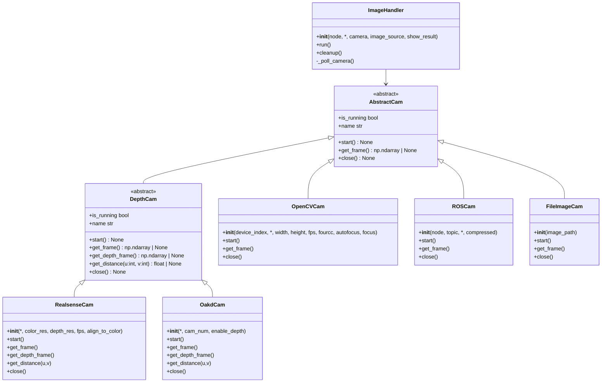

# Image Processing Tools 📷

Provides a collection of tools for image processing, focusing on color detection, ArUco marker detection, camera calibration, line detection, and distance estimation, built as part of the Mirela SDK.  It leverages OpenCV, ROS 2, and DepthAI for robust and versatile image analysis.

## Features ✨

* **Color Detection:**  Precisely detect and track colors in images using predefined values or interactive trackbars.  Save and load calibrated color ranges for consistent performance.
* **ArUco Marker Detection:**  Detect and estimate the pose (translation and rotation) of ArUco markers in images or video streams.  Publish pose estimates as ROS 2 messages for seamless integration with robotic systems.
* **Camera Calibration:**  Calibrate your camera using a chessboard pattern to obtain accurate intrinsic and distortion parameters.  Save and load calibration data for efficient reuse.
* **Line Detection:** Detect and track lines in images or video streams using various estimation methods. Determine line position (center) and orientation (angle). Publish line information as ROS 2 messages.
* **Distance Estimation:** Estimate distances from pixel measurements using multiple mathematical models including linear, polynomial, exponential, and robust methods. Includes calibration tools for custom scenarios.
* **Oak-D Camera Support:**  Integrates with DepthAI for advanced functionalities like stereo depth perception and IMU sensor access.
* **ROS 2 Integration:**  Several components are designed as ROS 2 nodes for easy integration into robotic applications.
* **Versatile Image Handling:**  Supports various image sources, including ROS topics, webcams, Oak-D cameras, and image files.

## File Overview 📖

### Camera and Image Handling 👁️

* **`camera/image_handler.py`:**  Handles image acquisition from various sources (ROS topics, webcams, Oak-D, files).
* **`camera/oakd_cam.py`:** Provides the `OakdCam` class for managing and controlling an OAK-D camera.

### Camera Calibration 📸

* **`camera/calibration/calibration.py`:**  Calibrates a camera using a chessboard pattern.
* **`camera/calibration/camera_distortion.txt`:** Stores camera distortion parameters.
* **`camera/calibration/camera_matrix.txt`:** Stores the camera intrinsic matrix.
* **`camera/calibration/dataset/dataset.txt`:** Chessboard dataset for camera calibration.

### Image Calculus 🧮

* **`camera/image_calculus.py`:** Provides the `ImageCalculus` class for calculating GPS coordinates from pixel locations.

### ArUco Marker Detection 🚩

* **`aruco/aruco_detect.py`:** Defines the `Aruco` class for ArUco marker detection and pose estimation.
* **`aruco/aruco_node.py`:** ROS 2 node for detecting ArUco markers and publishing their pose estimates.

### Color Detection 🎨

* **`color/color_detector.py`:**  Defines the `ColorDetector` class for color detection and filtering. Supports 'track' and 'preset' modes.
* **`color/color_calibration_node.py`:** ROS 2 node for calibrating color detection parameters using trackbars.
* **`color/color_calibration.txt`:**  Stores calibrated HSV color ranges for different object categories.

### Line Detection 📏

* **`line/line_detector.py`:** Defines the `LineDetector` class for line detection using various estimation methods.
* **`line/line_detection_node.py`:** ROS 2 node for detecting lines and publishing their position and orientation.
* Multiple line estimation algorithms including:
  * `HoughLinesP`: Uses probabilistic Hough transform for line detection.
  * `RotatedRect`: Approximates lines using a rotated rectangle on contours.
  * `FitEllipse`: Fits ellipses to detected contours.
  * `RansacLine`: Uses RANSAC algorithm for robust line detection.
  * `AdaptiveHoughLinesP`: Adapts parameters based on image characteristics.

### Distance Estimation 📐

* **`distance/distance_estimation.py`:** Defines the `DistanceEstimator` class for estimating distances from pixel measurements using multiple mathematical models.
* **`distance/distance_calibration.py`:** Provides the `DistanceCalibrator` class for calibrating distance estimation models with your own data.
* **`distance/distance_models.py`:** Advanced model analysis and comparison tools for research and optimization.
* **`distance/distance_parameters.py`:** Pre-calibrated parameters for various distance estimation models.

## Package Structure 📂

* **`image_processing`**: Contains the core image processing logic.
    * **`camera`**:  Camera handling and calibration functionalities.
        * **`__init__.py`**: Exposes `ImageHandler`, `OakdCam`, and calibration classes.
        * **`image_handler.py`**: Image acquisition from various sources.
        * **`oakd_cam.py`**: OAK-D camera management.
        * **`calibration`**: Camera calibration logic.
            * **`calibration.py`**: Camera calibration class.
            * **`camera_distortion.txt`**: Camera distortion parameters.
            * **`camera_matrix.txt`**: Camera intrinsic matrix.
            * **`dataset`**: Chessboard dataset for calibration.
        * **`image_calculus.py`**: Image calculus for GPS calculations.
    * **`aruco`**: ArUco marker detection and pose estimation.
        * **`__init__.py`**: Exposes `Aruco` and `ArucoNode`.
        * **`aruco_detect.py`**: ArUco marker detection class.
        * **`aruco_node.py`**: ROS 2 node for ArUco detection.
    * **`color`**: Color detection and calibration.
        * **`__init__.py`**: Exposes `ColorDetector` and `ColorCalibrationNode`.
        * **`color_detector.py`**: Color detection class.
        * **`color_calibration_node.py`**: ROS 2 node for color calibration.
        * **`color_calibration.txt`**: Calibrated HSV color ranges.
    * **`line`**: Line detection and tracking.
        * **`__init__.py`**: Exposes `LineDetector` and `LineDetectionNode`.
        * **`line_detector.py`**: Line detection class with multiple estimation methods.
        * **`line_detection_node.py`**: ROS 2 node for line detection.
    * **`distance`**: Distance estimation and calibration.
        * **`__init__.py`**: Exposes distance estimation classes and functions.
        * **`distance_estimation.py`**: Core distance estimation functionality.
        * **`distance_calibration.py`**: Distance calibration utilities.
        * **`distance_models.py`**: Advanced model analysis tools.
        * **`distance_parameters.py`**: Pre-calibrated model parameters.

## **Key Classes**

### **Camera Handling**
- **`ImageHandler`**: Manages image acquisition from various sources.
- **`OakdCam`**: Controls an OAK-D camera for advanced image processing.

### **Camera Calibration**
- **`Calibration`**: Calibrates a camera using a chessboard pattern.
- **`ImageCalculus`**: Converts pixel locations to GPS coordinates.

### **ArUco Marker Detection**
- **`Aruco`**: Detects and estimates the pose of ArUco markers.
- **`ArucoNode`**: ROS 2 node for ArUco marker detection.

### **Color Detection**
- **`ColorDetector`**: Detects and tracks colors in images.
- **`ColorCalibrationNode`**: ROS 2 node for color calibration.

### **Line Detection**
- **`LineDetector`**: Detects and tracks lines in images using various estimation methods.
- **`LineDetectionNode`**: ROS 2 node for line detection.
- **Line Estimation Methods**:
  - **`HoughLinesP`**: Probabilistic Hough transform for line detection.
  - **`RotatedRect`**: Detects lines using rotated rectangles on contours.
  - **`FitEllipse`**: Fits ellipses to detected contours.
  - **`RansacLine`**: Uses RANSAC algorithm for robust line fitting.
  - **`AdaptiveHoughLinesP`**: Dynamically adjusts parameters based on image characteristics.

### **Distance Estimation**
- **`DistanceEstimator`**: Estimates distances using multiple mathematical models with optional input validation.
- **`DistanceCalibrator`**: Calibrates custom distance estimation models from measurement data.
- **`DistanceModelAnalyzer`**: Advanced analysis and comparison of different estimation models.

### **Image Processing Utilities**
- **`ImageCalculus`**: Converts pixel locations to GPS coordinates.

## Distance Estimation Usage Guide 📐

### Quick Start

```python
from mirela_sdk.image_processing import DistanceEstimator, EstimationMethod

# Create estimator with default settings
estimator = DistanceEstimator()

# Estimate distance from pixel measurement
pixel_size = 25.0
distance_cm = estimator.estimate(pixel_size)
print(f"Estimated distance: {distance_cm:.2f} cm")

# Use specific estimation method
distance_cm = estimator.estimate(pixel_size, EstimationMethod.EXPONENTIAL)
```

### Custom Calibration

```python
from mirela_sdk.image_processing import DistanceCalibrator, EstimationMethod

# Create calibrator
calibrator = DistanceCalibrator()

# Add your measurement data (distance_cm, pixel_measurement)
data_points = [
    (50, 32.2),
    (60, 28.5),
    (70, 24.2),
    (80, 23.9),
    (100, 21.6),
    (120, 19.9),
    (150, 16.8),
    (180, 14.8),
]

calibrator.add_data_points(data_points)

# Calibrate different models
linear_result = calibrator.calibrate_linear()
poly_result = calibrator.calibrate_polynomial(degree=2)

print(f"Linear model RMSE: {linear_result['rmse']:.2f}")
print(f"Polynomial model RMSE: {poly_result['rmse']:.2f}")

# Get best calibration
best_name, best_params = calibrator.get_best_calibration()
print(f"Best model: {best_name} (RMSE: {best_params['rmse']:.2f})")

# Create estimator from calibration
estimator = calibrator.create_estimator_from_calibration(
    valid_range=(15.0, 35.0)
)
```

### Advanced Usage with Validation

```python
from mirela_sdk.image_processing import DistanceEstimator, EstimationMethod

# Create estimator with input validation
estimator = DistanceEstimator(
    default_method=EstimationMethod.POLYNOMIAL,
    valid_range=(15.0, 35.0),  # Expected input range
    validate_inputs=True
)

# Set custom valid range
estimator.set_valid_range((10.0, 40.0))

# Get available methods
methods = estimator.get_available_methods()
print(f"Available methods: {methods}")

# Get method information
info = estimator.get_method_info(EstimationMethod.EXPONENTIAL)
print(f"Formula: {info['formula']}")
```

### Model Evaluation

```python
from mirela_sdk.image_processing import DistanceCalibrator, EstimationMethod

# Evaluate existing estimator
calibrator = DistanceCalibrator()
calibrator.add_data_points(your_test_data)

estimator = DistanceEstimator(default_method=EstimationMethod.POLYNOMIAL)
metrics = calibrator.evaluate_estimator(estimator, EstimationMethod.POLYNOMIAL)

print(f"RMSE: {metrics['rmse']:.2f}")
print(f"MAE: {metrics['mae']:.2f}")
print(f"R²: {metrics['r2']:.4f}")
```

### Calibration Workflow

1. **Collect Data**: Measure real distances and corresponding pixel measurements
2. **Create Calibrator**: Initialize `DistanceCalibrator` and add your data points
3. **Test Models**: Try different calibration methods (linear, polynomial)
4. **Evaluate**: Compare RMSE and R² values to choose the best model
5. **Deploy**: Create `DistanceEstimator` from your best calibration
6. **Validate**: Test with new data to ensure accuracy

### Available Estimation Methods

- **LINEAR**: Simple inverse relationship (`output = k / input`)
- **POLYNOMIAL**: Polynomial fitting of various degrees
- **EXPONENTIAL**: Exponential decay model (`output = a * exp(-b * input) + c`)
- **INVERSE_POWER**: Generalized power law (`output = k / input^p`)
- **LOGARITHMIC**: Logarithmic relationship (`output = a * log(input) + b`)
- **ROBUST_POLY2**: Robust 2nd-degree polynomial using Huber regression

## Class Diagram 

```mermaid
classDiagram
    %% Classes base abstratas
    class Node {
        <<abstract>>
    }
    
    class ILineEstimationMethod {
        <<abstract>>
        +estimate(img_detect, img_out, offset, draw) tuple
    }
    
    ILineEstimationMethod <|-- HoughLinesP
    ILineEstimationMethod <|-- RotatedRect
    ILineEstimationMethod <|-- FitEllipse
    ILineEstimationMethod <|-- RansacLine
    ILineEstimationMethod <|-- AdaptiveHoughLinesP
    

    %% Classes de processamento de imagem que herdam de Node
    Node <|-- ColorCalibrationNode
    Node <|-- ArucoNode
    Node <|-- Calibration
    Node <|-- LineDetectionNode

    class ColorCalibrationNode {
        +__init__(image_source)
        +process(img)
    }

    class ArucoNode {
        +__init__()
        +process_image(img)
        +cleanup()
    }
    
    class LineDetectionNode {
        +__init__()
        +parameters_callback(params)
        +process_image(img)
        +run()
        +cleanup()
    }

    class Calibration {
        +__init__(chessboard_size)
        -__photo(img)
        +run_photos()
        -__find_corners(show_result)
        +calibrate(show_corners)
        +overwrite_matrices()
        +get_camera_matrix_distortion(cls)
    }

    %% Classes utilitárias de processamento de imagem
    class ColorDetector {
        +__init__(mode, color)
        +hsv_color()
        +hsv_color(values)
        +empty(a)
        +initTrackbars()
        +getTrackValues()
        +filterColor(img)
        +getColorHSV(color_name)
        +saveColorHSV()
    }

    class Aruco {
        +__init__(marker_dict, tag_size)
        +total_markers()
        +marker_dict()
        +tag_size()
        +aruco_config(marker_dict, tag_size)
        +detect(img, draw)
        +calculateYawFromCorners(bbox)
        +pose_estimate(img, draw)
    }
    
    class LineDetector {
        +__init__(color, estimation_method)
        +set_text_positions(positions_dict)
        +detect_line(img, region, draw, draw_color)
    }
    
    class HoughLinesP {
        +estimate(img_detect, img_out, offset, draw, draw_color) tuple
    }
    
    class RotatedRect {
        +estimate(img_detect, img_out, offset, draw, draw_color) tuple
    }
    
    class FitEllipse {
        +estimate(img_detect, img_out, offset, draw) tuple
    }
    
    class RansacLine {
        +estimate(img_detect, img_out, offset, draw) tuple
    }
    
    class AdaptiveHoughLinesP {
        +estimate(img_detect, img_out, offset, draw) tuple
    }

    class DistanceEstimator {
        +__init__(default_method, valid_range, validate_inputs)
        +estimate(input_value, method) float
        +estimate_distance(height_px, method) float
        +set_default_method(method)
        +set_valid_range(valid_range)
        +get_available_methods() list
        +get_method_info(method) dict
    }

    class DistanceCalibrator {
        +__init__()
        +add_data_point(distance, pixel)
        +add_data_points(data_points)
        +calibrate_linear() dict
        +calibrate_polynomial(degree) dict
        +get_best_calibration() tuple
        +create_estimator_from_calibration(name, valid_range) DistanceEstimator
        +evaluate_estimator(estimator, method) dict
        +generate_parameter_code(name) str
    }

    class DistanceModelAnalyzer {
        +__init__(data_points)
        +fit_all_models()
        +calculate_metrics()
        +plot_models_comparison(save_path)
        +get_best_model(criterion) tuple
        +print_detailed_results()
        +generate_parameters_file(output_path)
    }

    class ImageHandler {
        +__init__(node, image_source, image_processing_callback, show_result, cap, oakd_num)
        +_configure_ros_topic()
        +process()
        +ros_topic_callback(data)
        +webcam_callback()
        +oakd_callback()
        +run()
        +cleanup()
        +__del__()
    }

    class ImageCalculus {
        +find_coordinate(centerpixel_lon, centerpixel_lat, centerpixel_height, centerpixel_width, pixel2_height, pixel2_width, gdr, bearing)
    }

    class OakdCam {
        +__init__()
        +setup_camera(cam_num, link_out, set_control)
        +init_cam(full_speed)
        +color_camera()
        +mono_camera()
        +getQueue_CamType()
        +getFrame(queue)
        +get_stereo_depth()
        +configure_stereo_node_output(stream_names)
    }

    %% Relationships
    ColorDetector -- ColorCalibrationNode
    Aruco -- ArucoNode
    OakdCam -- ImageHandler
    LineDetector -- LineDetectionNode
    LineDetector -- ColorDetector
    DistanceCalibrator -- DistanceEstimator
    DistanceModelAnalyzer -- DistanceEstimator
```



## Camera Abstraction Architecture

To support multiple capture sources (OpenCV webcams, ROS topics, Oak-D, Intel RealSense D435i, and image files) with a consistent API, the camera layer has been redesigned around two abstraction levels:

- `AbstractCam`: base interface for starting, grabbing frames, and closing a camera.
- `DepthCam`: specialization for devices that provide depth and point distance queries.

This design allows `ImageHandler` to manage initialization, polling, and cleanup generically, while still letting you use camera-specific features directly when needed.

### Key Principles

- **Simple common API**: `start()`, `get_frame()`, `close()` for all cameras.
- **Depth capabilities separated**: `get_depth_frame()` and `get_distance(u, v)` are available only on `DepthCam` implementations.
- **Pluggable cameras**: `ImageHandler` accepts any `AbstractCam` instance, or can build cameras from a simple `image_source` string for backward compatibility.
- **Forward-compatible**: You can still use specific camera classes directly when needed (e.g., fine-grained Oak-D controls or RealSense-specific options).

### Classes

- `AbstractCam` (base): lifecycle and RGB frame capture.
- `DepthCam` (base): adds depth capture and distance queries.
- `OpenCVCam` (concrete): generic OpenCV webcam capture, with optional C920 tuning.
- `ROSCam` (concrete): subscribes to a ROS 2 `sensor_msgs/Image` (or `CompressedImage`) topic and exposes the latest frame.
- `RealsenseCam` (concrete, DepthCam): Intel RealSense D435i color + depth stream and pixel distance.
- `OakdCam` (concrete, DepthCam): DepthAI Oak-D color (and optional stereo depth) with existing control features preserved.
- `FileImageCam` (concrete): Single-image source useful for testing pipelines.

### Updated ImageHandler

`ImageHandler` now:
- Accepts a `camera` instance (`AbstractCam`) or builds one from `image_source`.
- Polls `camera.get_frame()` on a timer and invokes your processing callback.
- Optionally shows frames in an OpenCV window.
- Cleans up timers and camera resources safely.

If your camera implements `DepthCam`, you can access `get_depth_frame()` and `get_distance(u, v)` directly via the `camera` instance you passed to `ImageHandler`.

### Diagram



### Usage Examples

- Use ImageHandler with a RealSense camera and query distance at a pixel:

```python
from mirela_sdk.image_processing.camera.realsense_cam import RealsenseCam
from mirela_sdk.image_processing.camera.image_handler import ImageHandler

cam = RealsenseCam(fps=30)
handler = ImageHandler(node, camera=cam, show_result="RealSense")

# Inside your processing callback you can access handler.camera for depth queries
# e.g., distance_m = handler.camera.get_distance(u=320, v=240)
```

- Keep using string sources for quick starts:

```python
handler = ImageHandler(node, image_source="webcam", show_result="Webcam")
# or
handler = ImageHandler(node, image_source="oakd", show_result="Oak-D")
# or
handler = ImageHandler(node, image_source="/camera/image_raw", show_result="ROS Topic")
```

- Use ROSCam directly when you want fine-grained topic control:

```python
from mirela_sdk.image_processing.camera.ros_cam import ROSCam
cam = ROSCam(node, topic="/camera/image_raw", compressed=False)
cam.start()
frame = cam.get_frame()
cam.close()
```