# Image Processing Tools 📷

Provides a collection of tools for image processing, focusing on color detection, ArUco marker detection, camera calibration, and line detection, built as part of the Mirela SDK.  It leverages OpenCV, ROS 2, and DepthAI for robust and versatile image analysis.

## Features ✨

* **Color Detection:**  Precisely detect and track colors in images using predefined values or interactive trackbars.  Save and load calibrated color ranges for consistent performance.
* **ArUco Marker Detection:**  Detect and estimate the pose (translation and rotation) of ArUco markers in images or video streams.  Publish pose estimates as ROS 2 messages for seamless integration with robotic systems.
* **Camera Calibration:**  Calibrate your camera using a chessboard pattern to obtain accurate intrinsic and distortion parameters.  Save and load calibration data for efficient reuse.
* **Line Detection:** Detect and track lines in images or video streams using various estimation methods. Determine line position (center) and orientation (angle). Publish line information as ROS 2 messages.
* **Oak-D Camera Support:**  Integrates with DepthAI for advanced functionalities like stereo depth perception and IMU sensor access.
* **ROS 2 Integration:**  Several components are designed as ROS 2 nodes for easy integration into robotic applications.
* **Versatile Image Handling:**  Supports various image sources, including ROS topics, webcams, Oak-D cameras, and image files.

## File Overview 📖

### Camera and Image Handling 👁️

* **`camera/image_handler.py`:**  Handles image acquisition from various sources (ROS topics, webcams, Oak-D, files).
* **`camera/oakd_cam.py`:** Provides the `OakdCam` class for managing and controlling an OAK-D camera.

### Camera Calibration 📸

* **`camera/calibration/calibration.py`:**  Calibrates a camera using a chessboard pattern.
* **`camera/calibration/camera_distortion.txt`:** Stores camera distortion parameters.
* **`camera/calibration/camera_matrix.txt`:** Stores the camera intrinsic matrix.
* **`camera/calibration/dataset/dataset.txt`:** Chessboard dataset for camera calibration.

### Image Calculus 🧮

* **`camera/image_calculus.py`:** Provides the `ImageCalculus` class for calculating GPS coordinates from pixel locations.

### ArUco Marker Detection 🚩

* **`aruco/aruco_detect.py`:** Defines the `Aruco` class for ArUco marker detection and pose estimation.
* **`aruco/aruco_node.py`:** ROS 2 node for detecting ArUco markers and publishing their pose estimates.

### Color Detection 🎨

* **`color/color_detector.py`:**  Defines the `ColorDetector` class for color detection and filtering. Supports 'track' and 'preset' modes.
* **`color/color_calibration_node.py`:** ROS 2 node for calibrating color detection parameters using trackbars.
* **`color/color_calibration.txt`:**  Stores calibrated HSV color ranges for different object categories.

### Line Detection 📏

* **`line/line_detector.py`:** Defines the `LineDetector` class for line detection using various estimation methods.
* **`line/line_detection_node.py`:** ROS 2 node for detecting lines and publishing their position and orientation.
* Multiple line estimation algorithms including:
  * `HoughLinesP`: Uses probabilistic Hough transform for line detection.
  * `RotatedRect`: Approximates lines using a rotated rectangle on contours.
  * `FitEllipse`: Fits ellipses to detected contours.
  * `RansacLine`: Uses RANSAC algorithm for robust line detection.
  * `AdaptiveHoughLinesP`: Adapts parameters based on image characteristics.

## Package Structure 📂

* **`image_processing`**: Contains the core image processing logic.
    * **`camera`**:  Camera handling and calibration functionalities.
        * **`__init__.py`**: Exposes `ImageHandler`, `OakdCam`, and calibration classes.
        * **`image_handler.py`**: Image acquisition from various sources.
        * **`oakd_cam.py`**: OAK-D camera management.
        * **`calibration`**: Camera calibration logic.
            * **`calibration.py`**: Camera calibration class.
            * **`camera_distortion.txt`**: Camera distortion parameters.
            * **`camera_matrix.txt`**: Camera intrinsic matrix.
            * **`dataset`**: Chessboard dataset for calibration.
        * **`image_calculus.py`**: Image calculus for GPS calculations.
    * **`aruco`**: ArUco marker detection and pose estimation.
        * **`__init__.py`**: Exposes `Aruco` and `ArucoNode`.
        * **`aruco_detect.py`**: ArUco marker detection class.
        * **`aruco_node.py`**: ROS 2 node for ArUco detection.
    * **`color`**: Color detection and calibration.
        * **`__init__.py`**: Exposes `ColorDetector` and `ColorCalibrationNode`.
        * **`color_detector.py`**: Color detection class.
        * **`color_calibration_node.py`**: ROS 2 node for color calibration.
        * **`color_calibration.txt`**: Calibrated HSV color ranges.
    * **`line`**: Line detection and tracking.
        * **`__init__.py`**: Exposes `LineDetector` and `LineDetectionNode`.
        * **`line_detector.py`**: Line detection class with multiple estimation methods.
        * **`line_detection_node.py`**: ROS 2 node for line detection.

## **Key Classes**

### **Camera Handling**
- **`ImageHandler`**: Manages image acquisition from various sources.
- **`OakdCam`**: Controls an OAK-D camera for advanced image processing.

### **Camera Calibration**
- **`Calibration`**: Calibrates a camera using a chessboard pattern.
- **`ImageCalculus`**: Converts pixel locations to GPS coordinates.

### **ArUco Marker Detection**
- **`Aruco`**: Detects and estimates the pose of ArUco markers.
- **`ArucoNode`**: ROS 2 node for ArUco marker detection.

### **Color Detection**
- **`ColorDetector`**: Detects and tracks colors in images.
- **`ColorCalibrationNode`**: ROS 2 node for color calibration.

### **Line Detection**
- **`LineDetector`**: Detects and tracks lines in images using various estimation methods.
- **`LineDetectionNode`**: ROS 2 node for line detection.
- **Line Estimation Methods**:
  - **`HoughLinesP`**: Probabilistic Hough transform for line detection.
  - **`RotatedRect`**: Detects lines using rotated rectangles on contours.
  - **`FitEllipse`**: Fits ellipses to detected contours.
  - **`RansacLine`**: Uses RANSAC algorithm for robust line fitting.
  - **`AdaptiveHoughLinesP`**: Dynamically adjusts parameters based on image characteristics.

### **Image Processing Utilities**
- **`ImageCalculus`**: Converts pixel locations to GPS coordinates.

## Class Diagram 

```mermaid
classDiagram
    %% Classes base abstratas
    class Node {
        <<abstract>>
    }
    
    class ILineEstimationMethod {
        <<abstract>>
        +estimate(img_detect, img_out, offset, draw) tuple
    }
    
    ILineEstimationMethod <|-- HoughLinesP
    ILineEstimationMethod <|-- RotatedRect
    ILineEstimationMethod <|-- FitEllipse
    ILineEstimationMethod <|-- RansacLine
    ILineEstimationMethod <|-- AdaptiveHoughLinesP
    

    %% Classes de processamento de imagem que herdam de Node
    Node <|-- ColorCalibrationNode
    Node <|-- ArucoNode
    Node <|-- Calibration
    Node <|-- LineDetectionNode

    class ColorCalibrationNode {
        +__init__(image_source)
        +process(img)
    }

    class ArucoNode {
        +__init__()
        +process_image(img)
        +cleanup()
    }
    
    class LineDetectionNode {
        +__init__()
        +parameters_callback(params)
        +process_image(img)
        +run()
        +cleanup()
    }

    class Calibration {
        +__init__(chessboard_size)
        -__photo(img)
        +run_photos()
        -__find_corners(show_result)
        +calibrate(show_corners)
        +overwrite_matrices()
        +get_camera_matrix_distortion(cls)
    }

    %% Classes utilitárias de processamento de imagem
    class ColorDetector {
        +__init__(mode, color)
        +hsv_color()
        +hsv_color(values)
        +empty(a)
        +initTrackbars()
        +getTrackValues()
        +filterColor(img)
        +getColorHSV(color_name)
        +saveColorHSV()
    }

    class Aruco {
        +__init__(marker_dict, tag_size)
        +total_markers()
        +marker_dict()
        +tag_size()
        +aruco_config(marker_dict, tag_size)
        +detect(img, draw)
        +calculateYawFromCorners(bbox)
        +pose_estimate(img, draw)
    }
    
    class LineDetector {
        +__init__(color, estimation_method)
        +set_text_positions(positions_dict)
        +detect_line(img, region, draw, draw_color)
        -_calculate_confidence(binary_img, center_x, angle)
    }
    
    class HoughLinesP {
        +estimate(img_detect, img_out, offset, draw, draw_color) tuple
    }
    
    class RotatedRect {
        +estimate(img_detect, img_out, offset, draw, draw_color) tuple
    }
    
    class FitEllipse {
        +estimate(img_detect, img_out, offset, draw) tuple
    }
    
    class RansacLine {
        +estimate(img_detect, img_out, offset, draw) tuple
    }
    
    class AdaptiveHoughLinesP {
        +estimate(img_detect, img_out, offset, draw) tuple
    }

    class ImageHandler {
        +__init__(node, image_source, image_processing_callback, show_result, cap, oakd_num)
        +_configure_ros_topic()
        +process()
        +ros_topic_callback(data)
        +webcam_callback()
        +oakd_callback()
        +run()
        +cleanup()
        +__del__()
    }

    class ImageCalculus {
        +find_coordinate(centerpixel_lon, centerpixel_lat, centerpixel_height, centerpixel_width, pixel2_height, pixel2_width, gdr, bearing)
    }

    class OakdCam {
        +__init__()
        +setup_camera(cam_num, link_out, set_control)
        +init_cam(full_speed)
        +color_camera()
        +mono_camera()
        +getQueue_CamType()
        +getFrame(queue)
        +get_stereo_depth()
        +configure_stereo_node_output(stream_names)
    }

    %% Relationships
    ColorDetector -- ColorCalibrationNode
    Aruco -- ArucoNode
    OakdCam -- ImageHandler
    LineDetector -- LineDetectionNode
    LineDetector -- ColorDetector
```

