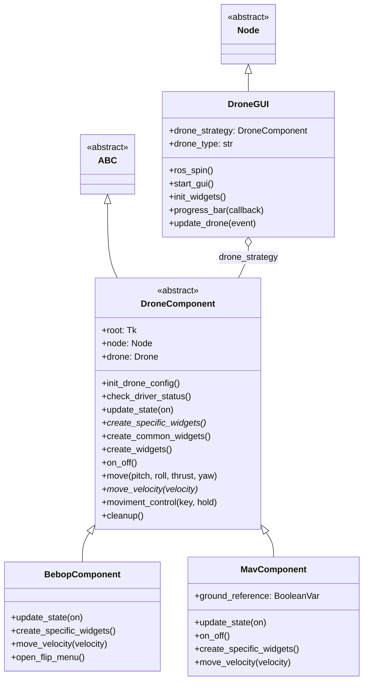

# Drone Control GUI 🧐

[Tkinter](https://docs.python.org/3/library/tkinter.html)-based graphical interface for drone control using ROS2. Supports Parrot Bebop and MAVROS-enabled drones through a unified interface.

https://github.com/user-attachments/assets/6bdf06b6-89f3-4474-a76e-3c20b0dd950f

## Features

- **Multi-Drone Support**: Control Bebop or MAV drones through unified interface
- **ROS2 Integration**: Communicates with drone drivers via ROS2 topics/services
- **Keyboard Controls**: WASD + QE for movement, Space for emergency stop
- **Velocity Sliders**: Fine-grained control of pitch, roll, thrust, yaw
- **Camera Integration**: Live stream, snapshots, video recording 📷
- **Driver Status**: Real-time monitoring of driver connection state

## Usage

```bash
ros2 run mirela_sdk gui
```

## Architecture



## Components

### DroneGUI (`gui.py`)

Main application window. Handles ROS2 spinning, drone type selection, and component initialization.

**Key Methods**:
| Method | Description |
|--------|-------------|
| `ros_spin()` | ROS2 executor callback |
| `start_gui()` | Initialize Tkinter mainloop |
| `update_drone(event)` | Handle drone type change |

### DroneComponent (`drone_component.py`)

Abstract base class for drone-specific UI components. Implements common functionality:

- Keyboard event binding
- Velocity slider creation
- Driver status monitoring
- Movement command translation

**Key Methods**:
| Method | Description |
|--------|-------------|
| `init_drone_config()` | Create drone instance |
| `check_driver_status()` | Poll driver node status |
| `moviment_control(key, hold)` | Handle keyboard input |
| `create_specific_widgets()` | Override for drone-specific UI |

### BebopComponent (`bebop_component.py`)

Bebop 2-specific UI with flip menu and camera controls.

**Features**:
- Flip maneuvers (front, back, left, right)
- Camera tilt/pan control
- Snapshot and recording

**Example**:
```python
self.drone.takeoff()
self.drone.flip(0)  # Front flip
self.drone.camera_control(tilt=-30, pan=0)
self.drone.land()
```

### MavComponent (`mav_component.py`)

MAVROS-specific UI with flight modes and ground reference toggle.

**Features**:
- Arm/disarm control
- Flight mode selection (GUIDED, LOITER, RTL)
- Body/world reference toggle

**Example**:
```python
self.drone.set_mode("GUIDED")
self.drone.arm_takeoff(1.5)
self.drone.offboard_velocity(0.5, 0.0, 0.0, 0.0, ground_reference=True)
self.drone.land()
```

## Keyboard Bindings

| Key | Action |
|-----|--------|
| `W` | Forward (+X velocity) |
| `S` | Backward (-X velocity) |
| `A` | Left (+Y velocity) |
| `D` | Right (-Y velocity) |
| `Q` | Rotate left (+Yaw) |
| `E` | Rotate right (-Yaw) |
| `Space` | Emergency stop |
| `Up` | Increase altitude |
| `Down` | Decrease altitude |

## Dependencies

| Package | Purpose |
|---------|---------|
| `tkinter` | GUI framework |
| `rclpy` | ROS2 Python client |
| `Pillow` | Image handling |
