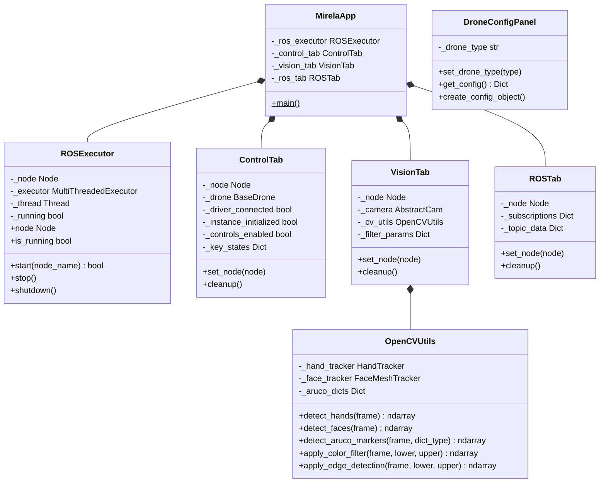
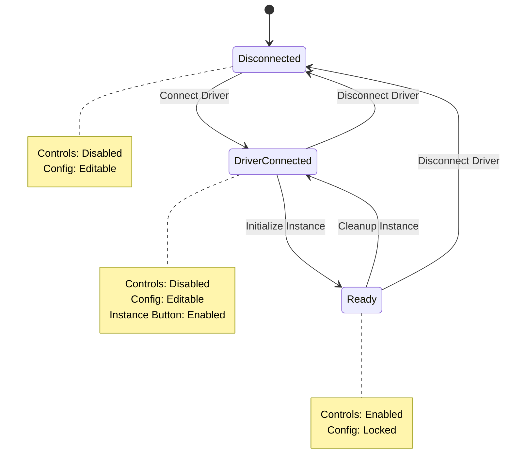

# Interface Module

Qt6/PySide6-based graphical user interface for drone control, computer vision, and ROS2 system tools.

## Documentation Index

- **README.md**: This file - Module architecture and usage
- **tabs/**: Tab implementations (Control, Vision, ROS)
- **widgets/**: Reusable UI components
- **theme.py**: Styling and color definitions

## Architecture



### Widget Architecture


## Features

### Control Tab

Drone control interface with keyboard-based velocity control and action buttons.

#### Connection Architecture

The Control Tab separates **driver connection** from **drone instance initialization**:



| State | Driver | Instance | Controls | Config |
|-------|--------|----------|----------|--------|
| Disconnected | Off | No | Disabled | Editable |
| Driver Connected | Running | No | Disabled | Editable |
| Ready | Running | Yes | Enabled | Locked |

**Driver Connection**:
- Starts/stops the ROS2 driver process (MAVROS or Bebop driver)
- Runs in background tmux session
- Status checked every 3 seconds

**Instance Initialization**:
- Creates drone object with configuration
- Requires driver to be running
- Enables flight controls when initialized

#### Keyboard Controls

| Key | Action |
|-----|--------|
| W | Thrust up (+Z) |
| S | Thrust down (-Z) |
| A | Yaw left (+yaw) |
| D | Yaw right (-yaw) |
| ↑ | Pitch forward (+X) |
| ↓ | Pitch backward (-X) |
| ← | Roll left (+Y) |
| → | Roll right (-Y) |

#### Supported Drones

| Drone | Features |
|-------|----------|
| **Mavros** | Arm, disarm, takeoff, land, velocity control, mode setting |
| **Bebop** | Takeoff, land, flip maneuvers, velocity control |

#### Configuration

| Mavros Options | Description |
|----------------|-------------|
| Pose Source | GPS (outdoor) or Vision (indoor) |
| Navigation | PID or Setpoint strategy |
| Use LiDAR | Enable rangefinder altitude |
| Connection | FCU connection string |

| Bebop Options | Description |
|---------------|-------------|
| IP Address | Drone IP (default: 192.168.42.1) |
| Namespace | ROS2 namespace |

**Velocity Sliders**: Adjust maximum velocity for each axis (pitch, roll, thrust, yaw).

### Vision Tab

Real-time computer vision processing with multiple camera sources and filters.

**Camera Sources**:
| Source | Description |
|--------|-------------|
| `webcam` | USB webcam via OpenCV |
| `realsense` | Intel RealSense D4xx |
| `oakd` | Luxonis OAK-D |
| `ros` | ROS2 image topic |
| `file` | Static image file |

**Available Filters**:

| Category | Filters |
|----------|---------|
| Color | HSV color filter with range sliders |
| Edge | Canny edge detection, contour detection |
| Blur | Gaussian blur, sharpen |
| Transform | Rotation, resize |
| Morphology | Erode, dilate, open, close, adaptive threshold, histogram equalization |
| Effects | Pencil sketch, stylization, cartoonify, color quantization, Hough lines/circles, optical flow |
| AI | Hand tracking (MediaPipe), face mesh (MediaPipe) |
| Markers | ArUco marker detection (17 dictionary types) |

### ROS Tab

Comprehensive ROS2 system introspection and interaction tools.

**Topics**:
- Browse available topics with type information
- Subscribe to any topic and view messages in real-time
- Publish messages to topics (YAML/JSON format)
- Filter topics by name or type

**Services**:
- Browse available services with type information
- Call services with custom requests
- View service responses

**Parameters**:
- Browse nodes in the ROS2 graph
- View parameters for each node

**Image Viewer**:
- Subscribe to image topics (raw or compressed)
- Real-time display with resolution info

## Quick Start

```python
from mirela_sdk.interface import main

# Launch the GUI
main()
```

Or from command line:

```bash
ros2 run mirela_sdk gui
```

## ROS2 Integration

The application uses a dedicated `ROSExecutor` that runs in a background thread to prevent blocking the Qt event loop:

```python
from mirela_sdk.interface import ROSExecutor

executor = ROSExecutor()
executor.start("my_node")

# Access the ROS2 node
node = executor.node

# Cleanup
executor.shutdown()
```

**Signals**:
- `status_changed(bool)`: Emitted when ROS2 connection status changes
- `error_occurred(str)`: Emitted on ROS2 errors

## Theming

The application uses a dark theme with accent colors. Colors are defined in `theme.py`:

```python
from mirela_sdk.interface import COLORS

# Available colors
COLORS.background      # #0D1117 - Main background
COLORS.surface         # #161B22 - Card/panel background
COLORS.surface_elevated # #21262D - Elevated surfaces
COLORS.border          # #30363D - Borders
COLORS.text_primary    # #E6EDF3 - Primary text
COLORS.text_secondary  # #8B949E - Secondary text
COLORS.text_muted      # #6E7681 - Muted text
COLORS.accent          # #FDCE01 - Accent (yellow)
COLORS.success         # #3FB950 - Success (green)
COLORS.warning         # #D29922 - Warning (orange)
COLORS.error           # #F85149 - Error (red)
COLORS.info            # #58A6FF - Info (blue)
```

## Custom Widgets

### Card

Elevated container with rounded corners:

```python
from mirela_sdk.interface import Card

card = Card()
card.add_widget(QLabel("Title"))
card.add_layout(content_layout)
```

### StatusIndicator

Status dot with label:

```python
from mirela_sdk.interface import StatusIndicator

status = StatusIndicator("Connection", "inactive")
status.set_status("active")  # active, inactive, warning, error, info
status.set_label("Connected")
```

### LabeledSlider

Vertical slider with label and value display:

```python
from mirela_sdk.interface import LabeledSlider

slider = LabeledSlider("Speed", min_val=0.0, max_val=1.0, default=0.5)
slider.valueChanged.connect(lambda v: print(f"Value: {v}"))
value = slider.value()
```

### CollapsibleSection

Expandable/collapsible section:

```python
from mirela_sdk.interface import CollapsibleSection

section = CollapsibleSection("Advanced Options")
section.add_widget(QCheckBox("Option 1"))
section.add_widget(QCheckBox("Option 2"))
```

### VideoDisplay

OpenCV frame display widget:

```python
from mirela_sdk.interface import VideoDisplay
import numpy as np

display = VideoDisplay()
display.set_placeholder("No video")

# Display frame (BGR format)
frame = np.zeros((480, 640, 3), dtype=np.uint8)
display.display_frame(frame)
```

### DroneConfigPanel

Configuration panel for drone settings:

```python
from mirela_sdk.interface import DroneConfigPanel

panel = DroneConfigPanel()
panel.set_drone_type("mavros")  # or "bebop"

# Get configuration as dictionary
config = panel.get_config()

# Create config dataclass instance
config_obj = panel.create_config_object()
```

## Module Structure

```
interface/
├── __init__.py           # Public API exports
├── README.md             # This file
├── app.py                # Main application window
├── ros_executor.py       # ROS2-Qt integration
├── run_gui.py            # Entry point script
├── theme.py              # Styling and colors
│
├── tabs/                 # Tab implementations
│   ├── __init__.py
│   ├── control_tab.py    # Drone control
│   ├── vision_tab.py     # Computer vision
│   └── ros_tab.py        # ROS2 tools
│
├── widgets/              # Reusable components
│   ├── __init__.py
│   ├── components.py     # Card, StatusIndicator, etc.
│   └── drone_config.py   # DroneConfigPanel widget
│
└── images/               # Assets
    ├── logo.png
    ├── camera.png
    ├── photo.png
    └── video.png
```

## Dependencies

| Package | Version | Purpose |
|---------|---------|---------|
| PySide6 | ≥6.5 | Qt6 bindings |
| opencv-python | ≥4.8 | Computer vision |
| numpy | ≥1.24 | Array operations |
| rclpy | ROS2 Humble | ROS2 Python client |
| cv_bridge | ROS2 Humble | ROS-OpenCV bridge |
| PyYAML | ≥6.0 | Message serialization |

### Installation

```bash
# PySide6
pip install PySide6

# ROS2 packages (in ROS2 environment)
sudo apt install ros-humble-cv-bridge
```

## References

### Qt6/PySide6

| Topic | Documentation |
|-------|---------------|
| PySide6 Getting Started | [Qt for Python](https://doc.qt.io/qtforpython-6/) |
| QMainWindow | [QMainWindow Class](https://doc.qt.io/qtforpython-6/PySide6/QtWidgets/QMainWindow.html) |
| Signals & Slots | [Signals and Slots](https://doc.qt.io/qtforpython-6/tutorials/basictutorial/signals_and_slots.html) |
| Styling | [Qt Style Sheets](https://doc.qt.io/qt-6/stylesheet-reference.html) |

### ROS2

| Topic | Documentation |
|-------|---------------|
| rclpy | [ROS2 Python Client Library](https://docs.ros.org/en/humble/Tutorials/Beginner-Client-Libraries/Writing-A-Simple-Py-Publisher-And-Subscriber.html) |
| cv_bridge | [cv_bridge](https://github.com/ros-perception/vision_opencv) |
| Executors | [ROS2 Executors](https://docs.ros.org/en/humble/Concepts/Intermediate/About-Executors.html) |

### OpenCV

| Topic | Documentation |
|-------|---------------|
| Image Processing | [OpenCV Image Processing](https://docs.opencv.org/4.x/d2/d96/tutorial_py_table_of_contents_imgproc.html) |
| ArUco | [ArUco Module](https://docs.opencv.org/4.x/d9/d6a/group__aruco.html) |
| Video I/O | [VideoCapture](https://docs.opencv.org/4.x/d8/dfe/classcv_1_1VideoCapture.html) |

### MediaPipe

| Topic | Documentation |
|-------|---------------|
| Hand Landmarker | [MediaPipe Hands](https://ai.google.dev/edge/mediapipe/solutions/vision/hand_landmarker) |
| Face Landmarker | [MediaPipe Face](https://ai.google.dev/edge/mediapipe/solutions/vision/face_landmarker) |
