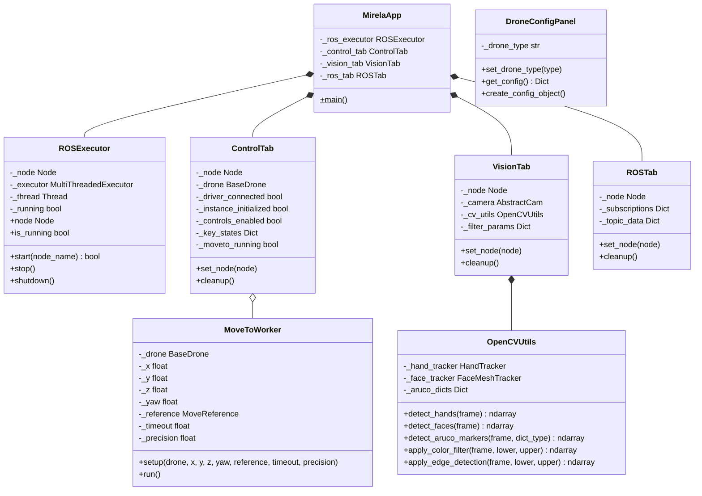
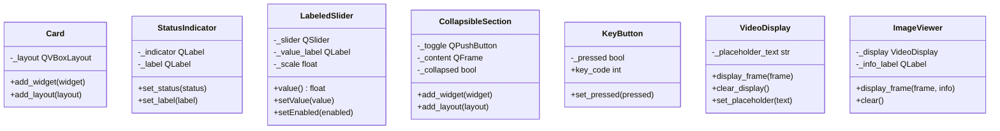
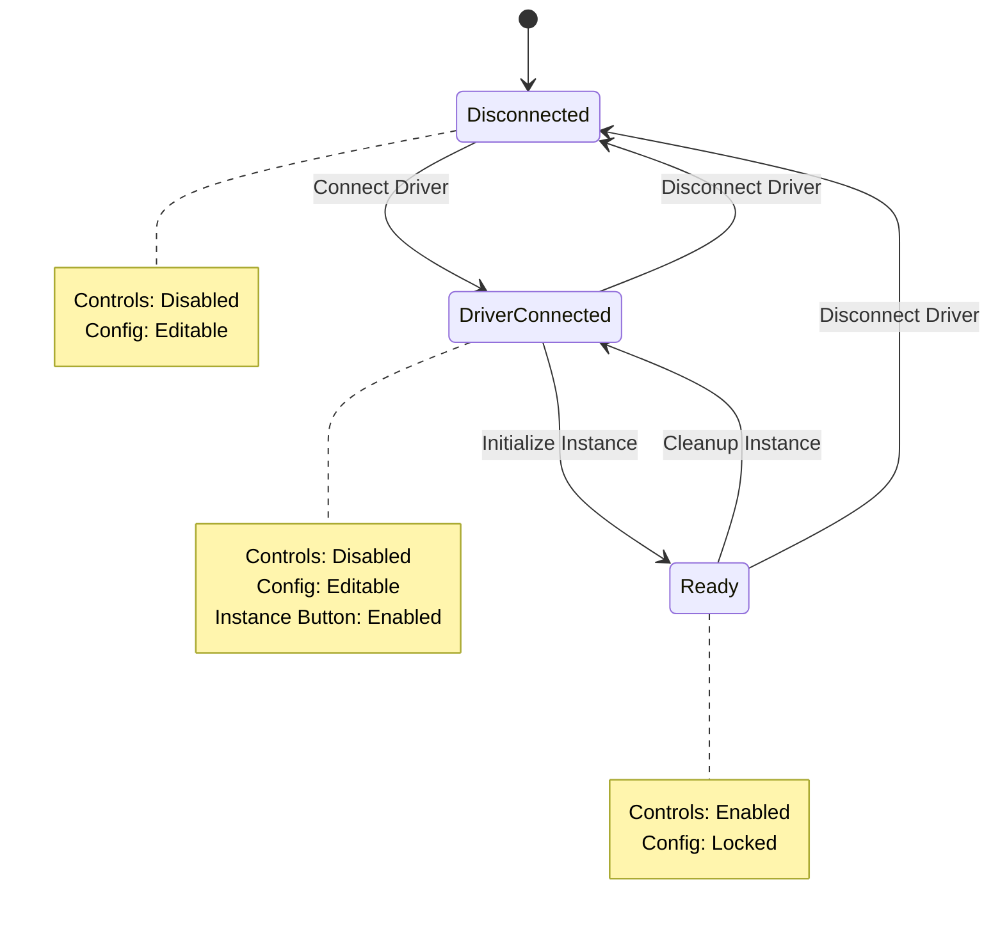
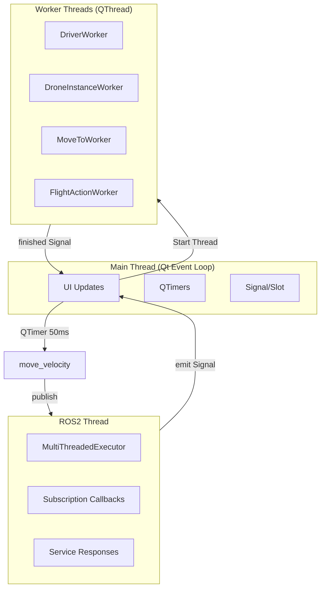

# Interface Module

Qt6/PySide6-based graphical user interface for drone control, computer vision, and ROS2 system tools.

## Documentation Index

- **README.md**: This file - Module architecture and usage
- **tabs/**: Tab implementations (Control, Vision, ROS)
- **widgets/**: Reusable UI components
- **theme.py**: Styling and color definitions

## Architecture



### Widget Architecture



## Features

### Control Tab

Drone control interface with keyboard-based velocity control and action buttons.

#### Connection Architecture

The Control Tab separates **driver connection** from **drone instance initialization**:



| State | Driver | Instance | Controls | Config |
|-------|--------|----------|----------|--------|
| Disconnected | Off | No | Disabled | Editable |
| Driver Connected | Running | No | Disabled | Editable |
| Ready | Running | Yes | Enabled | Locked |

**Driver Connection**:
- Starts/stops the ROS2 driver process (MAVROS or Bebop driver)
- Runs in background tmux session
- Status checked every 3 seconds

**Instance Initialization**:
- Creates drone object with configuration
- Requires driver to be running
- Enables flight controls when initialized

#### Status Panel

| Indicator | Source | Description |
|-----------|--------|-------------|
| **Driver** | ProcessUtils | ROS2 driver process running |
| **Instance** | DroneFactory | Drone object initialized |
| **FCU** | `mavros_state.connected` | FCU heartbeat received (Mavros only) |
| **Armed** | `mavros_state.armed` | Motors armed state from FCU (Mavros only) |

> Note: Armed status comes from FCU heartbeat (same as MissionPlanner), not from tracking `arm()` method calls.

#### Telemetry Panel

**Mavros Telemetry** (from FCU via MAVROS):

| Field | Indoor (Vision) | Outdoor (GPS) |
|-------|-----------------|---------------|
| Position | X, Y, Z (meters) | Lat, Lon (degrees), Alt (meters) |
| Height | Best source (LiDAR > Vision > RelAlt) | Best source |
| LiDAR | Rangefinder altitude | Rangefinder altitude |
| RelAlt | N/A | Relative altitude above home |
| Yaw | From quaternion | Compass heading |
| Heading | N/A | Compass heading |
| Mode | Flight mode | Flight mode |

**Bebop Telemetry**:
- Bebop driver does not expose telemetry data
- All fields show "N/A"

#### Velocity Control

Combined keyboard controls and velocity sliders in one compact panel.

| Key | Action |
|-----|--------|
| W | Move up (+Z) |
| S | Move down (-Z) |
| A | Yaw left (+yaw) |
| D | Yaw right (-yaw) |
| ↑ | Move forward (+X) |
| ↓ | Move backward (-X) |
| ← | Move left (+Y) |
| → | Move right (-Y) |

**Velocity Sliders**: Adjust maximum velocity for each axis (Vx, Vy, Vz, Vyaw).

**Reference Frame**: Body, World, or Takeoff frame selection.

#### Position Control (Mavros only)

Navigate to a target position using `move_to()`. Hidden for drones without position control.

| Parameter | Description | Range |
|-----------|-------------|-------|
| X | Forward (+) / Backward (-) offset | ±20 m |
| Y | Left (+) / Right (-) offset | ±20 m |
| Z | Up (+) / Down (-) offset | ±20 m |
| Yaw | Target yaw angle | ±180° |

Each axis has a **checkbox** to enable/disable it:
- **Checked**: Axis is used with the specified value
- **Unchecked**: Axis is ignored (None)

At least one of X, Y, or Z must be enabled to execute.

| Option | Description | Default |
|--------|-------------|---------|
| Reference | Reference frame for movement | Body |
| Precision | Arrival threshold in meters | 0.2 m |
| Timeout | Maximum navigation time | 60 s |

**Reference Frames**:
- **Body**: Relative to current drone orientation
- **Takeoff**: Relative to takeoff position

**Note**: World frame is not supported in position control. Use Body or Takeoff reference.

The operation runs in a background thread. Cancel button stops navigation immediately.

#### Supported Drones

| Drone | Features | Capabilities |
|-------|----------|--------------|
| **Mavros** | Arm, disarm, takeoff, land, velocity control, position control, mode setting | Telemetry, Position Control |
| **Bebop** | Takeoff, land, flip maneuvers, velocity control | - |

**Capability-based UI**: Panels are shown/hidden based on drone capabilities:
- **Position Control**: Only visible for drones supporting `move_to()` (Mavros)
- **Telemetry**: Only visible for drones exposing sensor data (Mavros)

#### Configuration

| Mavros Options | Description |
|----------------|-------------|
| Pose Source | GPS (outdoor) or Vision (indoor) |
| Navigation | PID or Setpoint strategy |
| Use LiDAR | Enable rangefinder altitude |
| Connection | FCU connection string |

| Bebop Options | Description |
|---------------|-------------|
| IP Address | Drone IP (default: 192.168.42.1) |
| Namespace | ROS2 namespace |

### Vision Tab

Real-time computer vision processing with multiple camera sources and filters.

**Camera Sources**:
| Source | Description |
|--------|-------------|
| `webcam` | USB webcam via OpenCV |
| `realsense` | Intel RealSense D4xx |
| `oakd` | Luxonis OAK-D |
| `ros` | ROS2 image topic |
| `file` | Static image file |

**Available Filters**:

| Category | Filters |
|----------|---------|
| Color | HSV color filter with range sliders |
| Edge | Canny edge detection, contour detection |
| Blur | Gaussian blur, sharpen |
| Transform | Rotation, resize |
| Morphology | Erode, dilate, open, close, adaptive threshold, histogram equalization |
| Effects | Pencil sketch, stylization, cartoonify, color quantization, Hough lines/circles, optical flow |
| AI | Hand tracking (MediaPipe), face mesh (MediaPipe) |
| Markers | ArUco marker detection (17 dictionary types) |

### ROS Tab

Comprehensive ROS2 system introspection and interaction tools.

**Topics**:
- Browse available topics with type information
- Subscribe to any topic and view messages in real-time
- Publish messages to topics (YAML/JSON format)
- Filter topics by name or type

**Services**:
- Browse available services with type information
- Call services with custom requests
- View service responses

**Parameters**:
- Browse nodes in the ROS2 graph
- View parameters for each node

**Image Viewer**:
- Subscribe to image topics (raw or compressed)
- Real-time display with resolution info

## Quick Start

```python
from mirela_sdk.interface import main

# Launch the GUI
main()
```

Or from command line:

```bash
ros2 run mirela_sdk gui
```

## Execution Model

The interface integrates Qt6 event loop with ROS2 while avoiding deadlocks and UI freezes.

### Thread Architecture



### ROS2 Integration

`ROSExecutor` runs the ROS2 executor in a background thread:

```python
from mirela_sdk.interface import ROSExecutor

executor = ROSExecutor()
executor.start("my_node")
node = executor.node
executor.shutdown()
```

**Signals**:
- `status_changed(bool)`: ROS2 connection status changes
- `error_occurred(str)`: ROS2 errors

### Drone Commands

| Command Type | Execution | Thread |
|--------------|-----------|--------|
| Velocity control | Direct publish | Main (via QTimer) |
| Flight actions (arm, takeoff, land) | Service call | FlightActionWorker |
| Position control (move_to) | Blocking navigation loop | MoveToWorker |
| Driver start/stop | Process management | DriverWorker |

**Velocity commands** are sent via `QTimer` at 50ms intervals. Commands are only sent when:
- Keys are pressed (continuous movement)
- Transitioning from movement to stop (one zero command)

**Flight actions** run in `FlightActionWorker` to prevent UI blocking during service calls.

**Position control** runs in `MoveToWorker` because `move_to()` contains a blocking PID loop.

### Service Call Pattern

ROS2 services use `call_async()` with a spin loop to avoid deadlocks:

```python
# In drone.py _call_service method
future = service.call_async(request)
while not future.done():
    rclpy.spin_once(self._node, timeout_sec=0.05)
    # Check timeout
result = future.result()
```

This pattern:
- Avoids deadlocks from `client.call()` blocking the executor
- Maintains ROS2 communication during wait
- Allows timeout handling

**Service response validation** checks MAVROS-specific fields (`mode_sent`, `success`, `result`) and logs MAVLink result codes on failure.

### Camera Integration

| Source | Class | Notes |
|--------|-------|-------|
| Webcam | `WebcamCamera` | OpenCV VideoCapture |
| RealSense | `RealsenseCamera` | pyrealsense2, requires device |
| OAK-D | `OakDCamera` | depthai, requires device |
| ROS Topic | `ROSCamera` | Subscribes to image topic |
| File | `FileCamera` | Static image |

Camera frame acquisition runs in the main thread via `QTimer`. For ROS cameras, the subscription callback stores the latest frame which the timer retrieves.

### Sensor Validation

Before navigation, `_validate_position_sensors()` checks sensor availability:
- Indoor (Vision): Requires `_vision_pos` from `/mavros/vision_pose/pose_cov`
- Outdoor (GPS): Requires `_gps` from `/mavros/global_position/global`

Raises `SensorNotAvailableError` if data is missing.

## Troubleshooting

### UI Freezes

| Symptom | Cause | Solution |
|---------|-------|----------|
| Freeze on arm/takeoff/land | Service call blocking main thread | Check `FlightActionWorker` is used |
| Freeze on move_to | Navigation loop in main thread | Check `MoveToWorker` is used |
| Freeze on driver connect | Process wait in main thread | Check `DriverWorker` is used |
| Freeze during velocity control | Unlikely (uses QTimer) | Check timer interval |

### Service Timeouts

| Symptom | Cause | Solution |
|---------|-------|----------|
| "Service not available" | Driver not running | Start driver first |
| "Timeout waiting for response" | FCU not responding | Check FCU connection |
| "Mode not sent" | Unsupported flight mode | Check FCU firmware |
| "Failed (Result: DENIED)" | Pre-arm checks failed | Check vehicle state |

### No Telemetry

| Symptom | Cause | Solution |
|---------|-------|----------|
| All fields "N/A" | No sensor data received | Check driver and FCU connection |
| Position "N/A" | Wrong pose source | Match config to FCU setup |
| LiDAR "N/A" | Rangefinder not connected | Check hardware |

### Logging Levels

- `DEBUG`: Velocity commands, telemetry updates
- `INFO`: State changes (arm, takeoff, mode), navigation start/complete
- `WARN`: Sensor unavailable, service failures, timeouts
- `ERROR`: Critical failures, exceptions

## Theming

The application uses a dark theme with accent colors. Colors are defined in `theme.py`:

```python
from mirela_sdk.interface import COLORS

# Available colors
COLORS.background      # #0D1117 - Main background
COLORS.surface         # #161B22 - Card/panel background
COLORS.surface_elevated # #21262D - Elevated surfaces
COLORS.border          # #30363D - Borders
COLORS.text_primary    # #E6EDF3 - Primary text
COLORS.text_secondary  # #8B949E - Secondary text
COLORS.text_muted      # #6E7681 - Muted text
COLORS.accent          # #FDCE01 - Accent (yellow)
COLORS.success         # #3FB950 - Success (green)
COLORS.warning         # #D29922 - Warning (orange)
COLORS.error           # #F85149 - Error (red)
COLORS.info            # #58A6FF - Info (blue)
```

## Custom Widgets

### Card

Elevated container with rounded corners:

```python
from mirela_sdk.interface import Card

card = Card()
card.add_widget(QLabel("Title"))
card.add_layout(content_layout)
```

### StatusIndicator

Status dot with label:

```python
from mirela_sdk.interface import StatusIndicator

status = StatusIndicator("Connection", "inactive")
status.set_status("active")  # active, inactive, warning, error, info
status.set_label("Connected")
```

### LabeledSlider

Vertical slider with label and value display:

```python
from mirela_sdk.interface import LabeledSlider

slider = LabeledSlider("Speed", min_val=0.0, max_val=1.0, default=0.5)
slider.valueChanged.connect(lambda v: print(f"Value: {v}"))
value = slider.value()
```

### CollapsibleSection

Expandable/collapsible section:

```python
from mirela_sdk.interface import CollapsibleSection

section = CollapsibleSection("Advanced Options")
section.add_widget(QCheckBox("Option 1"))
section.add_widget(QCheckBox("Option 2"))
```

### VideoDisplay

OpenCV frame display widget:

```python
from mirela_sdk.interface import VideoDisplay
import numpy as np

display = VideoDisplay()
display.set_placeholder("No video")

# Display frame (BGR format)
frame = np.zeros((480, 640, 3), dtype=np.uint8)
display.display_frame(frame)
```

### DroneConfigPanel

Configuration panel for drone settings:

```python
from mirela_sdk.interface import DroneConfigPanel

panel = DroneConfigPanel()
panel.set_drone_type("mavros")  # or "bebop"

# Get configuration as dictionary
config = panel.get_config()

# Create config dataclass instance
config_obj = panel.create_config_object()
```

## Module Structure

```
interface/
├── __init__.py           # Public API exports
├── README.md             # This file
├── app.py                # Main application (MirelaApp)
├── ros_executor.py       # ROS2-Qt thread integration
├── run_gui.py            # Entry point
├── theme.py              # Styling and colors
│
├── tabs/
│   ├── __init__.py
│   ├── control_tab.py    # Drone control (workers, timers, panels)
│   ├── vision_tab.py     # Camera and filters
│   └── ros_tab.py        # Topics, services, parameters
│
├── widgets/
│   ├── __init__.py
│   ├── components.py     # Card, StatusIndicator, LabeledSlider, etc.
│   ├── drone_config.py   # DroneConfigPanel
│   ├── detection_panel.py # YOLO detection panel
│   ├── message_editor.py # ROS message editor
│   └── param_reconfigure.py # Parameter reconfigure widget
│
└── images/
    └── *.png             # UI assets
```

## Dependencies

| Package | Version | Purpose |
|---------|---------|---------|
| PySide6 | ≥6.5 | Qt6 bindings |
| opencv-python | ≥4.8 | Computer vision |
| numpy | ≥1.24 | Array operations |
| rclpy | ROS2 Humble | ROS2 Python client |
| cv_bridge | ROS2 Humble | ROS-OpenCV bridge |
| PyYAML | ≥6.0 | Message serialization |

### Installation

```bash
# PySide6
pip install PySide6

# ROS2 packages (in ROS2 environment)
sudo apt install ros-humble-cv-bridge
```

## References

### Qt6/PySide6

| Topic | Documentation |
|-------|---------------|
| PySide6 Getting Started | [Qt for Python](https://doc.qt.io/qtforpython-6/) |
| QMainWindow | [QMainWindow Class](https://doc.qt.io/qtforpython-6/PySide6/QtWidgets/QMainWindow.html) |
| Signals & Slots | [Signals and Slots](https://doc.qt.io/qtforpython-6/tutorials/basictutorial/signals_and_slots.html) |
| Styling | [Qt Style Sheets](https://doc.qt.io/qt-6/stylesheet-reference.html) |

### ROS2

| Topic | Documentation |
|-------|---------------|
| rclpy | [ROS2 Python Client Library](https://docs.ros.org/en/humble/Tutorials/Beginner-Client-Libraries/Writing-A-Simple-Py-Publisher-And-Subscriber.html) |
| cv_bridge | [cv_bridge](https://github.com/ros-perception/vision_opencv) |
| Executors | [ROS2 Executors](https://docs.ros.org/en/humble/Concepts/Intermediate/About-Executors.html) |

### OpenCV

| Topic | Documentation |
|-------|---------------|
| Image Processing | [OpenCV Image Processing](https://docs.opencv.org/4.x/d2/d96/tutorial_py_table_of_contents_imgproc.html) |
| ArUco | [ArUco Module](https://docs.opencv.org/4.x/d9/d6a/group__aruco.html) |
| Video I/O | [VideoCapture](https://docs.opencv.org/4.x/d8/dfe/classcv_1_1VideoCapture.html) |

### MediaPipe

| Topic | Documentation |
|-------|---------------|
| Hand Landmarker | [MediaPipe Hands](https://ai.google.dev/edge/mediapipe/solutions/vision/hand_landmarker) |
| Face Landmarker | [MediaPipe Face](https://ai.google.dev/edge/mediapipe/solutions/vision/face_landmarker) |
