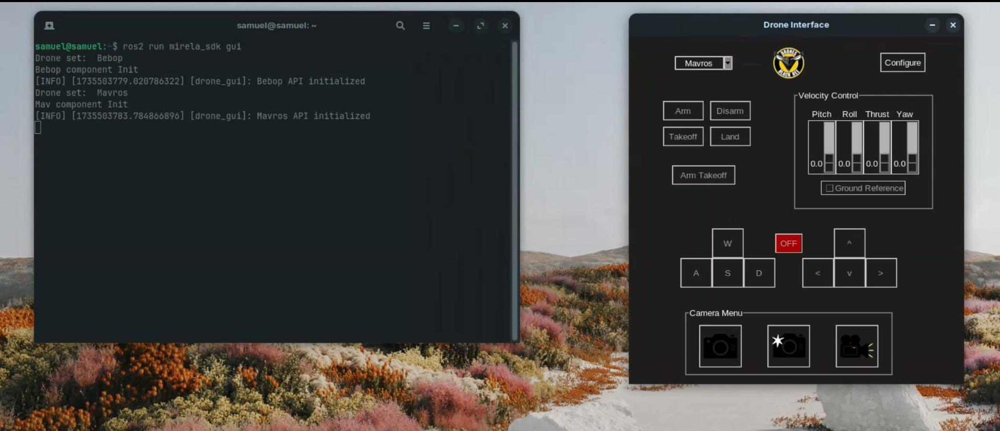
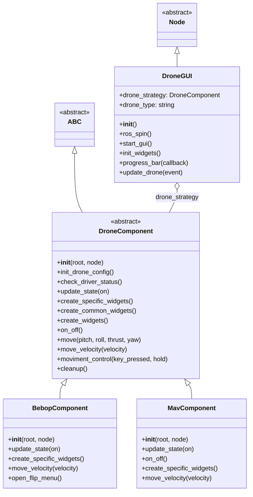

# Drone Control GUI 🧐

This hosts a Python-based Graphical User Interface (GUI) built with `Tkinter` for controlling drones using ROS 2 and the `mirela_sdk`.  It offers a flexible architecture for supporting different drone types, currently including Parrot Bebop and MAV (Micro Air Vehicle) drones.

## Features

* **Multi-Drone Support:**  Control different drone types (Bebop, MAV) through a unified interface.
* **ROS 2 Integration:** Leverages ROS 2 for communication with the drone drivers.
* **Intuitive Controls:**  Keyboard controls, sliders for pitch, roll, thrust, and yaw, and dedicated buttons for takeoff, landing, and other actions.
* **Camera Integration:**  Supports opening the drone's camera stream, taking snapshots, and recording videos. 📷
* **Real-time Driver Status:** Monitors and displays the drone driver's status in the GUI.
* **Modular Design:**  Uses an abstract base class (`DroneComponent`) for easy extension to new drone types.

## File Overview 📂

### `drone_component.py`

This file defines the abstract base class `DroneComponent`, providing a foundation for creating drone interface components. It handles common functionalities like keyboard control, velocity sliders, basic drone actions (on/off), and driver status monitoring.

* **Key Methods:** `__init__`, `init_drone_config`, `check_driver_status`, `update_state`, `create_specific_widgets`, `create_common_widgets`, `moviment_control`, `move`, `on_off`, `create_widgets`, `move_velocity`, `cleanup`.

### `bebop_component.py`

Implements the GUI component specifically for controlling a Parrot Bebop drone.

* **Key Methods:** `__init__`, `update_state`, `create_specific_widgets`, `move_velocity`, `open_flip_menu`.
* **Example Usage:**
    * `self.drone.takeoff()`
    * `self.drone.land()`
    * `self.drone.flip(0)`  *(Front flip)*
    * `self.drone.offboard_velocity(*velocity)`

### `mav_component.py`

Implements the GUI component for controlling a MAV drone using Mavros.

* **Key Methods:** `__init__`, `update_state`, `on_off`, `create_specific_widgets`, `move_velocity`.
* **Example Usage:**
    * `self.drone.takeoff(1.0)`
    * `self.drone.arm_takeoff(1.0)`
    * `self.drone.offboard_velocity(*velocity, self.ground_reference.get())`

### `gui.py`

This file implements the main GUI application, allowing users to select the drone type and initiate the connection.

* **Key Methods:** `__init__`, `ros_spin`, `start_gui`, `init_widgets`, `progress_bar`, `update_drone`, `main`.

## Class Diagram 

