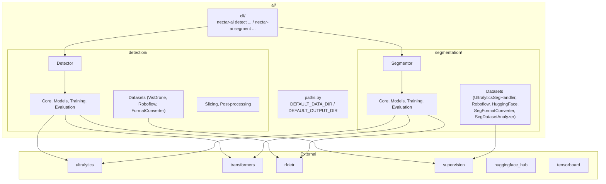

# AI Module

Deep learning inference, training, and evaluation for aerial robotics.

## Structure

```
ai/
├── paths.py            # Shared DEFAULT_DATA_DIR / DEFAULT_OUTPUT_DIR
├── cli/                # Unified CLI entry point (nectar-ai)
├── detection/          # Object detection (see detection/README.md)
├── segmentation/       # Image segmentation (see segmentation/README.md)
├── data/               # Shared datasets (gitignored)
└── outputs/            # Shared training outputs (gitignored)
```

## Architecture



## Quick Start

### Detection

```python
from nectar.ai.detection import Detector

detector = Detector("yolov8n.pt")
detector.load()
result = detector.detect(image)
for det in result:
    print(f"{det.class_name}: {det.confidence:.2f}")
```

### Segmentation

```python
from nectar.ai.segmentation import Segmentor

segmentor = Segmentor("yolov8n-seg.pt")
segmentor.load()
result = segmentor.segment(image)
for seg in result:
    print(f"{seg.class_name}: {seg.confidence:.2f}, mask_area={seg.mask_area}px")
```

## Public API

### Detection

```python
from nectar.ai.detection import (
    Detector, Framework,
    UltralyticsModel, TransformersModel, RFDETRModel, BaseDetectionModel,
    Detection, DetectionResult,
    TrainingConfig, EvaluationConfig,
    ModelLoader, ObjectDetectionEvaluator,
)
```

### Segmentation

```python
from nectar.ai.segmentation import (
    Segmentor,
    UltralyticsSegModel, TransformersSegModel, RFDETRSegModel, BaseSegmentationModel,
    Segmentation, SegmentationResult,
    SegTrainingConfig, SegEvaluationConfig,
    SegmentationEvaluator,
    SegFormatConverter, SegDatasetAnalyzer,
    UltralyticsSegHandler, RoboflowSegHandler,
)
from nectar.ai.segmentation.datasets import (
    HuggingFaceSegHandler, HuggingFaceSegDatasetUploader,
    seg_coco_to_hf, seg_yolo_to_hf, hf_to_coco_seg, hf_to_yolo_seg, generate_seg_dataset_card,
)
```

## CLI

```
nectar-ai <task> <command> [options]

Tasks:
  detect       Object detection (aliases: detection, od)
  segment      Image segmentation (aliases: segmentation, seg)

Commands:
  train     Train a model
  predict   Run inference on images
  eval      Evaluate a model on a dataset
  dataset   Dataset management (download, convert, analyze, subset, ...)
```

### Examples

```bash
# Detection
nectar-ai detect train --config configs/visdrone_yolo26n.yaml
nectar-ai detect dataset download --source visdrone --output data/visdrone
nectar-ai detect eval --model-path best.pt --dataset-path data/visdrone --framework ultralytics

# Segmentation
nectar-ai segment train --config configs/crackseg_yolo26n_seg.yaml
nectar-ai segment dataset download --source ultralytics --dataset crack-seg --output data/crack-seg
nectar-ai segment dataset download --source huggingface --repo user/my-seg --format yolo --output data/my-seg
nectar-ai segment dataset analyze --input data/crack-seg
nectar-ai segment dataset upload --target huggingface --repo user/my-seg --dataset data/my-seg --public --model-repo user/my-model
nectar-ai segment eval --model-path best.pt --dataset-path data/crack-seg --framework ultralytics
nectar-ai segment predict --model best.pt --input image.jpg --output predictions/ --save-masks
```

## Training

Both detection and segmentation support training via YAML config or CLI args.

```python
# Detection
from nectar.ai.detection import Detector, TrainingConfig
detector = Detector("yolov8n.pt")
detector.load()
result = detector.train(TrainingConfig(dataset_path="data/visdrone", epochs=100))

# Segmentation
from nectar.ai.segmentation import Segmentor, SegTrainingConfig
segmentor = Segmentor("yolo26n-seg.pt")
segmentor.load()
result = segmentor.train(SegTrainingConfig(dataset_path="data/crack-seg/data.yaml", epochs=50))
```

## Evaluation

Both modules generate evaluation artifacts: confusion matrix, error analysis, prediction samples, per-class metrics CSV/JSON. Detection produces 4 curve plots (PR, P, R, F1). Segmentation produces 8 curve plots (4 Box + 4 Mask) with separate box and mask mAP via `torchmetrics`.

```python
# Detection
from nectar.ai.detection.evaluation import ObjectDetectionEvaluator

# Segmentation
from nectar.ai.segmentation.evaluation import SegmentationEvaluator
```

The segmentation evaluator uses `load_segmentation_dataset()` which loads ground truth with binary masks from YOLO-seg polygon labels or COCO segmentation annotations. Mask mAP is computed via `torchmetrics` (`iou_type="segm"`), while P/R/F1 use `supervision` with `MetricTarget.MASKS`.

## Shared Paths

Both modules use the same data and output directories:

```python
from nectar.ai.paths import DEFAULT_DATA_DIR, DEFAULT_OUTPUT_DIR
# DEFAULT_DATA_DIR  -> nectar/nectar/ai/data/
# DEFAULT_OUTPUT_DIR -> nectar/nectar/ai/outputs/
```

These directories are gitignored.

## Supported Frameworks

| Framework | Detection | Segmentation |
|-----------|-----------|--------------|
| Ultralytics (YOLO) | Train, Eval, Predict | Train, Eval, Predict |
| RF-DETR | Train, Eval, Predict | Train, Eval, Predict |
| HuggingFace Transformers | Train, Eval, Predict | Predict (training WIP) |

## Device Management

`device="auto"` checks: CUDA -> MPS -> CPU.

```python
segmentor = Segmentor("model.pt", device="auto")   # Auto-detect
segmentor = Segmentor("model.pt", device="cpu")    # Force CPU
segmentor = Segmentor("model.pt", device="0")      # GPU 0
```

## Dependencies

| Package | Version | Purpose |
|---------|---------|---------|
| `ultralytics` | 8.4.36 | YOLO models |
| `transformers` | 5.5.0 | DETR, MaskFormer, SegFormer |
| `rfdetr` | 1.7.1 | RF-DETR detection + segmentation |
| `supervision` | 0.27.0 | Metrics, visualization, Detections bridge |
| `huggingface-hub` | 1.9.2 | Model upload/download |
| `tensorboard` | 2.20.0 | Training visualization |
| `albumentations` | 2.0.8 | Data augmentation |
| `roboflow` | 1.2.13 | Dataset download |

### Installation

```bash
# PyTorch (match your CUDA version)
pip install torch torchvision --index-url https://download.pytorch.org/whl/cu124

# AI dependencies
pip install -e ".[ai]"
```
