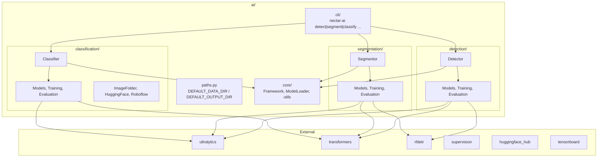

# AI Module

Deep learning inference, training, and evaluation for aerial robotics.

## Tutorials (Colab)

| Task | Link |
|------|------|
| Detection | [Open in Colab](https://colab.research.google.com/drive/1mQmbWwnwn-nzMdBlzvkuBmYPMHUrCm_Z?usp=sharing) |
| Classification | [Open in Colab](https://colab.research.google.com/drive/1mEo05wfYJRsuxKodxbFwBuxRSRh43f-X?usp=sharing) |
| Segmentation | [Open in Colab](https://colab.research.google.com/drive/1qZzAF_iD2sZyuWPin48XpxaY6dtak_gV?usp=sharing) |

## Structure

```
ai/
├── paths.py            # Shared DEFAULT_DATA_DIR / DEFAULT_OUTPUT_DIR
├── cli/                # Unified CLI entry point (nectar-ai)
├── core/               # Shared Framework, ModelLoader, device/Hub/TB/callbacks
├── detection/          # Object detection (see detection/README.md)
├── segmentation/       # Image segmentation (see segmentation/README.md)
├── classification/     # Image classification (see classification/README.md)
├── data/               # Shared datasets (gitignored)
└── outputs/            # Shared training outputs (gitignored)
```

## Architecture



## Quick Start

### Detection

```python
from nectar.ai.detection import Detector

detector = Detector("yolov8n.pt")
detector.load()
result = detector.detect(image)
for det in result:
    print(f"{det.class_name}: {det.confidence:.2f}")
```

### Segmentation

```python
from nectar.ai.segmentation import Segmentor

segmentor = Segmentor("yolov8n-seg.pt")
segmentor.load()
result = segmentor.segment(image)
for seg in result:
    print(f"{seg.class_name}: {seg.confidence:.2f}, mask_area={seg.mask_area}px")
```

### Classification

```python
from nectar.ai.classification import Classifier

classifier = Classifier("yolo26n-cls.pt")
classifier.load()
result = classifier.classify(image)
print(result.top1_name, result.top1_confidence)
```

## Public API

### Detection

```python
from nectar.ai.detection import (
    Detector, Framework,
    UltralyticsModel, TransformersModel, RFDETRModel, BaseDetectionModel,
    Detection, DetectionResult,
    TrainingConfig, EvaluationConfig,
    ModelLoader, ObjectDetectionEvaluator,
)
```

### Segmentation

```python
from nectar.ai.segmentation import (
    Segmentor,
    UltralyticsSegModel, TransformersSegModel, RFDETRSegModel, BaseSegmentationModel,
    Segmentation, SegmentationResult,
    SegTrainingConfig, SegEvaluationConfig,
    SegmentationEvaluator,
)
```

### Classification

```python
from nectar.ai.classification import (
    Classifier,
    UltralyticsClsModel, TransformersClsModel, BaseClassificationModel,
    Classification, ClassificationResult,
    ClsTrainingConfig, ClsEvaluationConfig,
    ClassificationEvaluator,
    ImageFolderDetector, ClsDatasetAnalyzer, ClsDatasetHandlerRegistry,
)
```

## CLI

```
nectar-ai <task> <command> [options]

Tasks:
  detect       Object detection (aliases: detection, od)
  segment      Image segmentation (aliases: segmentation, seg)
  classify     Image classification (aliases: classification, cls)

Commands:
  train     Train a model
  predict   Run inference on images
  eval      Evaluate a model on a dataset
  dataset   Dataset management (download, convert, analyze, subset, ...)
```

### Examples

**Detection**:

```bash
nectar-ai detect train --config configs/visdrone_yolo26n.yaml
nectar-ai detect dataset download --source visdrone --output data/visdrone
nectar-ai detect eval --model-path best.pt --dataset-path data/visdrone --framework ultralytics
```

**Segmentation**:

```bash
nectar-ai segment train --config configs/crackseg_yolo26n_seg.yaml
nectar-ai segment dataset download --source ultralytics --dataset crack-seg --output data/crack-seg
nectar-ai segment eval --model-path best.pt --dataset-path data/crack-seg --framework ultralytics
```

**Classification**:

```bash
nectar-ai classify train --config configs/mnist_yolo26n_cls.yaml
nectar-ai classify dataset download --source ultralytics --dataset mnist160 --output data/mnist160
nectar-ai classify predict --model yolo26n-cls.pt --input image.jpg --output predictions/
nectar-ai classify eval --model-path best.pt --dataset-path data/mnist160 --framework ultralytics
```

## Training

```python
from nectar.ai.classification import Classifier, ClsTrainingConfig
classifier = Classifier("yolo26n-cls.pt")
classifier.load()
result = classifier.train(ClsTrainingConfig(dataset_path="data/mnist160", epochs=50, imgsz=64))
```

## Shared Paths

```python
from nectar.ai.paths import DEFAULT_DATA_DIR, DEFAULT_OUTPUT_DIR
```

| Constant | Resolves to |
|----------|-------------|
| `DEFAULT_DATA_DIR` | `nectar/nectar/ai/data/` |
| `DEFAULT_OUTPUT_DIR` | `nectar/nectar/ai/outputs/` |

## Supported Frameworks

| Framework | Detection | Segmentation | Classification |
|-----------|-----------|--------------|----------------|
| Ultralytics (YOLO) | Train, Eval, Predict | Train, Eval, Predict | Train, Eval, Predict |
| RF-DETR | Train, Eval, Predict | Train, Eval, Predict | — |
| HuggingFace Transformers | Train, Eval, Predict | Train, Eval, Predict | Train, Eval, Predict |

## Device Management

| `device` | Behavior |
|----------|----------|
| `"auto"` | Auto-detect (CUDA → MPS → CPU) |
| `"cpu"` | Force CPU |
| `"0"` | GPU index 0 |

## Dependencies

| Package | Version | Purpose |
|---------|---------|---------|
| `ultralytics` | 8.4.36 | YOLO models |
| `transformers` | 5.5.0 | DETR, MaskFormer, ViT |
| `rfdetr` | 1.7.1 | RF-DETR detection + segmentation |
| `supervision` | 0.27.0 | Metrics, visualization |
| `huggingface-hub` | 1.9.2 | Model upload/download |
| `tensorboard` | 2.20.0 | Training visualization |
| `albumentations` | 2.0.8 | Data augmentation |
| `roboflow` | 1.2.13 | Dataset download |

### Installation

```bash
pip install torch torchvision --index-url https://download.pytorch.org/whl/cu124
pip install -e ".[ai]"
```
