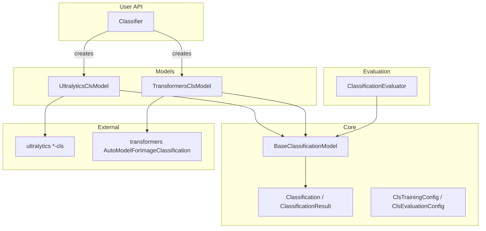

# Classification Module

Image classification across Ultralytics YOLO-cls and HuggingFace Transformers
behind one `Classifier` — load a model, call `classify`, and get typed top-k results.
The same API covers training, evaluation, and ImageFolder / HuggingFace dataset tooling
via the `nectar-ai classify` CLI.

## At a glance

```python
from nectar.ai.classification import Classifier

classifier = Classifier("yolo26n-cls.pt")
classifier.load()
result = classifier.classify(image)
print(result.top1_name, result.top1_confidence)
for pred in result.topk(5):
    print(pred.class_name, pred.confidence)
```

## Tutorial (Colab)

End-to-end classify workflow (dataset → train → TensorBoard → eval → Hub):

[Open in Google Colab](https://colab.research.google.com/drive/1mQmbWwnwn-nzMdBlzvkuBmYPMHUrCm_Z?usp=sharing)

## Architecture



## Classifier

```python
from nectar.ai.classification import Classifier
from nectar.ai.core import Framework

classifier = Classifier("yolo26n-cls.pt")
classifier = Classifier("google/vit-base-patch16-224-in21k", framework=Framework.TRANSFORMERS)
classifier.load()
result = classifier.classify(image, topk=5)
annotated = classifier.draw_classification(image, result)
```

Framework auto-detect: `-cls` → Ultralytics; `vit` / `google/` / `facebook/` → Transformers.

## Example configs

Portable templates under `configs/` (relative paths only; no org-specific Hub IDs):

| Config | Backend | Dataset prep |
|--------|---------|--------------|
| `mnist_yolo26n_cls.yaml` | Ultralytics YOLO-cls | `dataset download --source ultralytics --dataset mnist160` |
| `mnist_vit_example.yaml` | Transformers ViT | `dataset download --source huggingface --repo ylecun/mnist --max-samples 128` |
| `cifar10_yolo26n_cls_example.yaml` | Ultralytics + Hub knobs | `dataset download --source ultralytics --dataset cifar10 --max-samples 200` |

Copy a config and change `dataset_path`, `model`, `epochs`, and optionally enable Hub upload.

## Training

**ImageFolder layout** (Ultralytics classification dataset format):

```
dataset/
├── train/<class_name>/*.jpg
├── val/<class_name>/*.jpg
└── test/<class_name>/*.jpg
```

```python
from nectar.ai.classification import Classifier, ClsTrainingConfig

classifier = Classifier("yolo26n-cls.pt")
classifier.load()
result = classifier.train(ClsTrainingConfig(
    dataset_path="data/mnist160",
    epochs=50,
    imgsz=64,
    tensorboard=True,
))
```

```bash
# Ultralytics + TensorBoard
nectar-ai classify train --config configs/mnist_yolo26n_cls.yaml --tensorboard

# Transformers ViT
nectar-ai classify train --config configs/mnist_vit_example.yaml

# Enable Hub upload (requires HF_TOKEN): set in YAML or override
nectar-ai classify train --config configs/cifar10_yolo26n_cls_example.yaml \
    --push-to-hub --hub-model-id your-org/cifar10-yolo26n-cls
```

Bring your own ImageFolder the same way: point `data.dataset_path` at any
`train/<class>/*.jpg` tree (Food-101, custom data, etc.).

## Evaluation

Produces top-1/top-5 accuracy, macro/weighted P/R/F1, confusion matrix, per-class CSV/JSON,
and prediction samples.

```bash
nectar-ai classify eval --model-path best.pt --dataset-path data/mnist160 \
    --framework ultralytics --split test
```

## Dataset management

```bash
# Tiny Ultralytics set (recommended for smoke tests)
nectar-ai classify dataset download --source ultralytics --dataset mnist160 \
    --output data/mnist160

# CIFAR-10 cached under nectar/ai/data/ultralytics/, then a small subset
nectar-ai classify dataset download --source ultralytics --dataset cifar10 \
    --max-samples 200 --output data/cifar10-subset

nectar-ai classify dataset download --source huggingface --repo ylecun/mnist \
    --max-samples 128 --output data/mnist-hf

nectar-ai classify dataset analyze --input data/mnist160
nectar-ai classify dataset convert --input data/raw --output data/normalized
nectar-ai classify dataset stratify --input data/unsplit --output data/split
nectar-ai classify dataset subset --input data/full --output data/subset --max-train-samples 1000
nectar-ai classify dataset upload --target huggingface --repo user/my-cls --dataset data/mnist160 --public
```

## CLI

```
nectar-ai classify <command> [options]

Commands: train | predict | eval | dataset
Aliases: classification, cls
```

## Supported frameworks

| Framework | Train | Eval | Predict |
|-----------|-------|------|---------|
| Ultralytics YOLO-cls | yes | yes | yes |
| HuggingFace Transformers | yes | yes | yes |

## Layout

- `classifier.py` — `Classifier` facade and factory
- `core/` — types, configs, `BaseClassificationModel`
- `models/` — Ultralytics and Transformers backends
- `training/` — framework-specific training configs
- `evaluation/` — `ClassificationEvaluator` + plots
- `datasets/` — ImageFolder tools, HF converters, handlers
- `cli/`, `configs/`, `scripts/`
- Shared across tasks: `nectar.ai.core` (Framework, ModelLoader, utils)
