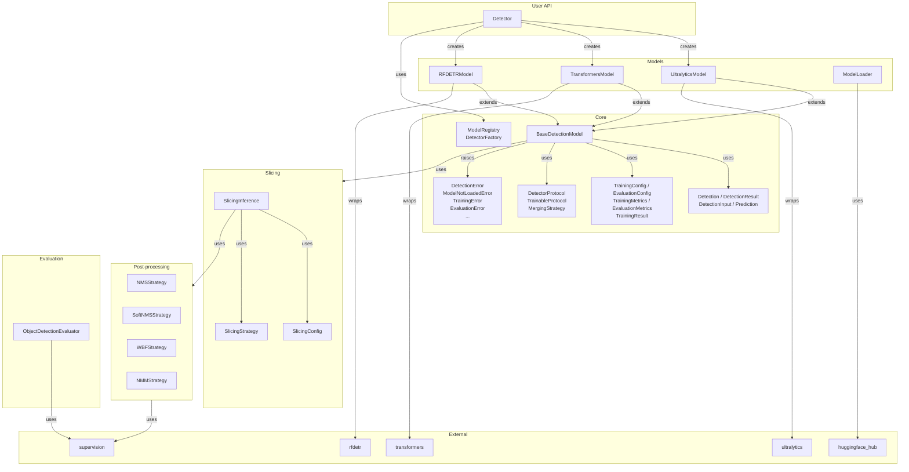
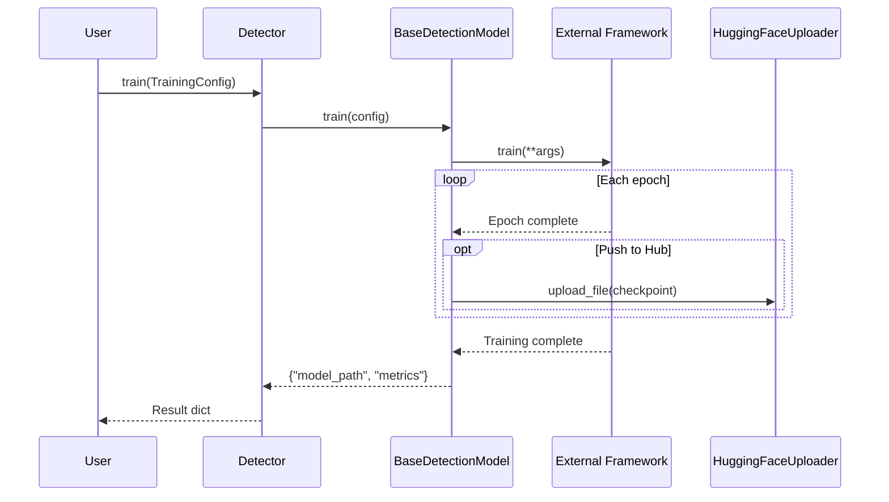
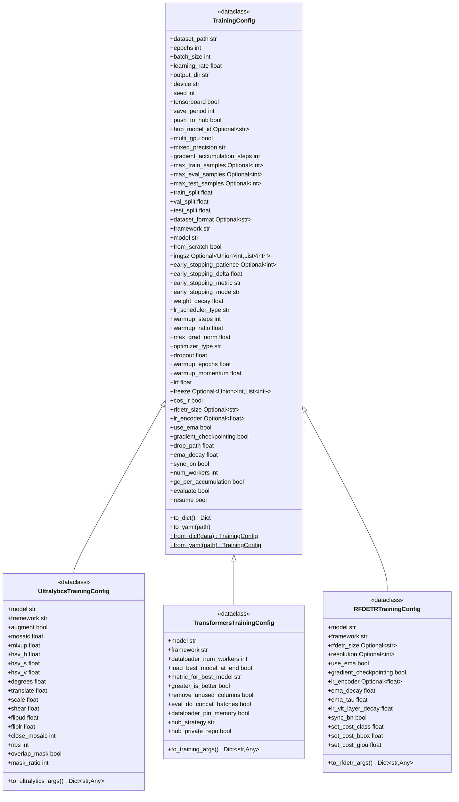
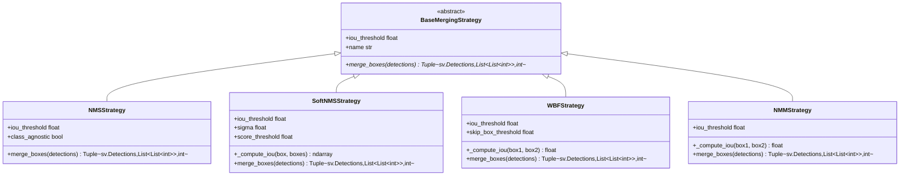

# Detection Module

Object detection API supporting Ultralytics YOLO, HuggingFace Transformers, and RF-DETR frameworks.

## Architecture



## Quick Start

```python
from nectar.ai.detection import Detector

detector = Detector("yolov8n.pt")
detector.load()

result = detector.detect(image)
for det in result:
    print(f"{det.class_name}: {det.confidence:.2f}")
```

## Detector

Factory-based detector with auto-detection or explicit framework selection.

```python
from nectar.ai.detection import Detector, Framework

# Auto-detect from model name
detector = Detector("yolov8n.pt")

# Explicit framework
detector = Detector("model.pt", framework="ultralytics")
detector = Detector("facebook/detr-resnet-50", framework=Framework.TRANSFORMERS)

# HuggingFace model (user/repo:filename)
detector = Detector("user/repo:model.pt")

detector.load()
result = detector.detect(image, conf=0.5)
results = detector.detect_batch([img1, img2, img3])
annotated = detector.draw_detections(image, result)

# Properties
detector.framework          # Framework.ULTRALYTICS
detector.is_loaded          # bool
detector.class_names        # Dict[int, str]
Detector.available_frameworks()  # ['ultralytics', 'transformers', 'rfdetr']
```

### Framework Enum

```python
Framework.ULTRALYTICS  # YOLOv8, YOLOv10, YOLO11
Framework.TRANSFORMERS  # DETR, Conditional DETR
Framework.RFDETR        # RF-DETR
```

## Class Diagram

```mermaid
classDiagram
    class Framework {
        <<enum>>
        ULTRALYTICS
        TRANSFORMERS
        RFDETR
    }

    class Detector {
        -_builders Dict~str,BuilderFunc~
        -_model BaseDetectionModel
        -_framework Framework
        -_loaded bool
        -_hf_token Optional~str~
        -_kwargs Dict
        +model_source str
        +device str
        +confidence_threshold float
        +framework Framework
        +is_loaded bool
        +class_names Dict~int,str~
        +model BaseDetectionModel
        +register(framework, builder)$
        +available_frameworks()$ List~str~
        +_detect_framework(source)$ Framework
        +_create_model(framework, model_name)$ BaseDetectionModel
        +load(model_path) bool
        +detect(image, conf, iou) DetectionResult
        +detect_batch(images, conf, iou) List~DetectionResult~
        +train(config) Dict~str,Any~
        +evaluate(config) Dict~str,Any~
        +draw_detections(image, result, show_labels, show_confidence, show_class, annotator_type, thickness, text_scale) ndarray
        +enable_slicing(config)
        +disable_slicing()
    }

    class BaseDetectionModel {
        <<abstract>>
        +model_name str
        +framework str
        +model Any
        +class_names Dict~int,str~
        +slicing_config Optional~SlicingConfig~
        -_slicing_inference Optional~SlicingInference~
        -logger Logger
        +is_loaded bool
        +load_model(path)*
        +_predict_single(input)* Prediction
        +_predict_batch(input) Prediction
        +predict(input) Prediction
        +_predict_with_slicing(input) Prediction
        +detect(image, conf, iou) DetectionResult
        +detect_batch(images, conf, iou) List~DetectionResult~
        +train(config)* TrainingResult
        +save(path)* str
        +evaluate(config) EvaluationMetrics
        +draw_detections(image, result, show_labels, show_confidence, show_class, annotator_type, thickness, text_scale) ndarray
        +enable_slicing(config)
        +disable_slicing()
    }

    class UltralyticsModel {
        -model Optional~YOLO~
        -_callbacks List
        +from_scratch bool
        +load_model(path)
        +_download_from_huggingface(path) str
        +train(config) TrainingResult
        +save(path) str
    }

    class TransformersModel {
        -model Optional~AutoModelForObjectDetection~
        -processor Optional~AutoImageProcessor~
        +from_scratch bool
        +load_model(path, id2label, label2id, imgsz)
        +train(config) TrainingResult
        +save(path) str
    }

    class RFDETRModel {
        -model Optional
        -model_class Type
        -base_model_name str
        -model_path Optional~str~
        +rfdetr_size Optional~str~
        +resolution Optional~int~
        +from_scratch bool
        +load_model(path)
        +_infer_model_size(path) str
        +train(config) TrainingResult
    }

    class Detection {
        <<dataclass>>
        +xyxy ndarray
        +confidence float
        +class_id int
        +class_name str
        +center Tuple~float,float~
        +width int
        +height int
        +area int
        +bbox List~int~
        +to_dict() Dict
        +from_dict(data)$ Detection
    }

    class DetectionResult {
        <<dataclass>>
        +detections List~Detection~
        +image Optional~ndarray~
        +inference_time float
        +image_path Optional~str~
        +model_name Optional~str~
        +__len__() int
        +__getitem__(idx) Detection
        +__iter__() Iterator
        +__bool__() bool
        +filter_by_confidence(threshold) DetectionResult
        +filter_by_class(class_names) DetectionResult
        +filter_by_class_id(class_ids) DetectionResult
        +to_supervision() sv.Detections
        +from_supervision(detections, class_names)$ DetectionResult
        +to_dict() Dict
    }

    class TrainingConfig {
        <<dataclass>>
        +dataset_path str
        +epochs int
        +batch_size int
        +learning_rate float
        +output_dir str
        +device str
        +seed int
        +tensorboard bool
        +save_period int
        +push_to_hub bool
        +hub_model_id Optional~str~
        +multi_gpu bool
        +mixed_precision str
        +gradient_accumulation_steps int
        +max_train_samples Optional~int~
        +max_eval_samples Optional~int~
        +max_test_samples Optional~int~
        +train_split float
        +val_split float
        +test_split float
        +dataset_format Optional~str~
        +framework str
        +model str
        +from_scratch bool
        +imgsz Optional~Union~int,List~int~~
        +early_stopping_patience Optional~int~
        +early_stopping_delta float
        +early_stopping_metric str
        +early_stopping_mode str
        +weight_decay float
        +lr_scheduler_type str
        +warmup_steps int
        +warmup_ratio float
        +max_grad_norm float
        +optimizer_type str
        +dropout float
        +warmup_epochs float
        +warmup_momentum float
        +lrf float
        +freeze Optional~Union~int,List~int~~
        +cos_lr bool
        +rfdetr_size Optional~str~
        +lr_encoder Optional~float~
        +use_ema bool
        +gradient_checkpointing bool
        +drop_path float
        +ema_decay float
        +sync_bn bool
        +num_workers int
        +gc_per_accumulation bool
        +evaluate bool
        +resume bool
        +to_dict() Dict
        +to_yaml(path)
        +from_dict(data)$ TrainingConfig
        +from_yaml(path)$ TrainingConfig
    }

    class EvaluationConfig {
        <<dataclass>>
        +model_path str
        +dataset_path str
        +framework str
        +output_dir str
        +dataset_type str
        +split str
        +conf_threshold float
        +iou_threshold float
        +device str
        +batch_size int
        +num_samples Optional~int~
        +to_dict() Dict
        +from_dict(data)$ EvaluationConfig
        +from_yaml(path)$ EvaluationConfig
    }

    class TrainingMetrics {
        <<dataclass>>
        +epoch int
        +train_loss float
        +val_loss Optional~float~
        +map50 Optional~float~
        +map50_95 Optional~float~
        +precision Optional~float~
        +recall Optional~float~
        +f1_score Optional~float~
        +learning_rate Optional~float~
        +to_dict() Dict
    }

    class EvaluationMetrics {
        <<dataclass>>
        +map50 float
        +map50_95 float
        +mar50 float
        +mar50_95 float
        +precision float
        +recall float
        +f1_score float
        +inference_time_per_image float
        +total_detections int
        +per_class_metrics List~Dict~
        +visualizations Dict~str,str~
        +to_dict() Dict
        +save_json(path)
    }

    class TrainingResult {
        <<dataclass>>
        +model_path str
        +metrics TrainingMetrics
        +config TrainingConfig
    }

    class DetectionInput {
        <<dataclass>>
        +image Union~ImageType,BatchImageType~
        +conf_threshold float
        +iou_threshold float
        +device Optional~str~
        +is_batch bool
        +to_dict() Dict
    }

    class Prediction {
        <<dataclass>>
        +detections Optional~sv.Detections~
        +batch_detections Optional~List~sv.Detections~~
        +results Optional~List~DetectionResult~~
        +inference_time float
        +image_path Optional~Union~str,List~str~~
        +model_name Optional~str~
        +is_batch bool
        +num_detections int
        +to_dict() Dict
        +from_detections(detections, class_names)$ Prediction
        +from_batch_detections(batch_detections, class_names)$ Prediction
    }

    class ModelRegistry {
        <<singleton>>
        -_models Dict~str,Type~
        -_factories Dict~str,Callable~
        +register(name)$ Callable
        +register_factory(name, factory_func)$
        +get(name)$ Type
        +create(name, model_name, config)$ BaseDetectionModel
        +list_models()$ List~str~
        +is_registered(name)$ bool
        +clear()$
    }

    class DetectorFactory {
        <<static>>
        +create(framework, model_source, config)$ BaseDetectionModel
        +from_pretrained(model_id, framework)$ BaseDetectionModel
        +from_checkpoint(checkpoint_path, framework)$ BaseDetectionModel
    }

    class SlicingConfig {
        <<dataclass>>
        +strategy SlicingStrategy
        +slice_size Tuple~int,int~
        +overlap_ratio float
        +iou_threshold float
        +conf_threshold float
        +min_slice_area_ratio float
        +max_slices int
        +adaptive_threshold float
        +clustering_eps float
        +clustering_min_samples int
        +merge_strategy str
        +include_full_image bool
        +from_dict(config_dict)$ SlicingConfig
        +to_dict() Dict
        +grid(slice_size, overlap_ratio)$ SlicingConfig
        +adaptive(slice_size, threshold)$ SlicingConfig
    }

    class SlicingStrategy {
        <<enumeration>>
        NONE
        GRID
        ADAPTIVE
        CLUSTERING
        SUPERVISION
    }

    class SlicingInference {
        -config SlicingConfig
        -slicer ImageSlicer
        -_merge_strategy BaseMergingStrategy
        +run_sliced_inference(image, inference_callback, initial_detections) sv.Detections
        -_create_merge_strategy(strategy_name) BaseMergingStrategy
    }

    class ObjectDetectionEvaluator {
        -model Any
        -config EvaluationConfig
        -output_dir Path
        -device str
        -logger Logger
        +evaluate() EvaluationMetrics
    }

    Detector --> Framework
    Detector --> BaseDetectionModel
    Detector ..> UltralyticsModel : creates
    Detector ..> TransformersModel : creates
    Detector ..> RFDETRModel : creates

    BaseDetectionModel <|-- UltralyticsModel
    BaseDetectionModel <|-- TransformersModel
    BaseDetectionModel <|-- RFDETRModel

    BaseDetectionModel --> Detection
    BaseDetectionModel --> DetectionResult
    BaseDetectionModel --> DetectionInput
    BaseDetectionModel --> Prediction
    BaseDetectionModel --> TrainingConfig
    BaseDetectionModel --> EvaluationConfig
    BaseDetectionModel --> SlicingConfig
    BaseDetectionModel ..> SlicingInference : uses

    DetectionResult o-- Detection
    DetectionResult --> DetectionInput
    Prediction o-- DetectionResult
    Prediction --> DetectionInput

    DetectorFactory --> ModelRegistry
    ModelRegistry --> BaseDetectionModel

    SlicingInference o-- SlicingConfig
    SlicingInference --> SlicingStrategy
    SlicingInference --> BaseMergingStrategy

    ObjectDetectionEvaluator --> EvaluationConfig
    ObjectDetectionEvaluator --> EvaluationMetrics
```



## Direct Model Classes

For advanced control:

```python
from nectar.ai.detection import UltralyticsModel, TransformersModel, RFDETRModel

model = UltralyticsModel("yolov8n.pt")
model.load_model()

model = TransformersModel("facebook/detr-resnet-50")
model.load_model()

model = RFDETRModel("rfdetr-base", resolution=560)
model.load_model()
```

## Core Types

### Detection

```python
from nectar.ai.detection import Detection

det = Detection(
    bbox=np.array([100, 100, 200, 200]),  # xyxy
    confidence=0.95,
    class_id=0,
    class_name="person",
)

det.center    # (150, 150)
det.width     # 100
det.height    # 100
det.area      # 10000
```

### DetectionResult

```python
result = detector.detect(image)

len(result)              # Number of detections
result.detections        # List[Detection]
result.inference_time    # Seconds

for det in result:
    print(det.class_name, det.confidence)

filtered = result.filter_by_confidence(0.5)
filtered = result.filter_by_class([0, 1, 2])
```

## Training

```python
from nectar.ai.detection import Detector, TrainingConfig

detector = Detector("yolov8n.pt")
detector.load()

config = TrainingConfig(
    dataset_path="/path/to/dataset",
    epochs=100,
    batch_size=16,
    learning_rate=0.001,
    output_dir="outputs/",
    tensorboard=True,
    push_to_hub=True,
    hub_model_id="user/model-name",
)

result = detector.train(config)
print(f"Model saved: {result['model_path']}")
```

### Training Flow



### Framework-Specific Configs



## Evaluation

```python
from nectar.ai.detection import Detector, EvaluationConfig
from nectar.ai.detection.evaluation import ObjectDetectionEvaluator

detector = Detector("best.pt")
detector.load()

config = EvaluationConfig(
    model_path="best.pt",
    dataset_path="/path/to/dataset",
    framework="ultralytics",
    split="test",
    conf_threshold=0.25,
)

evaluator = ObjectDetectionEvaluator(detector.model, config)
metrics = evaluator.evaluate()

print(f"mAP@50: {metrics.map50:.4f}")
print(f"mAP@50-95: {metrics.map50_95:.4f}")
```

## Slicing Inference

For high-resolution images:

```python
detector = Detector("yolov8n.pt")
detector.load()

detector.enable_slicing({
    "strategy": "grid",
    "slice_size": (640, 640),
    "overlap_ratio": 0.2,
    "merge_strategy": "nms",  # nms, soft_nms, wbf, nmm
})

result = detector.detect(large_image)
detector.disable_slicing()
```

### Post-processing Strategies



## Extension

### Adding a Framework

```python
from nectar.ai.detection import Detector
from nectar.ai.detection.core.base import BaseDetectionModel

class CustomModel(BaseDetectionModel):
    def load_model(self, path):
        pass

    def _predict_single(self, input):
        pass

    def train(self, config):
        pass

    def save(self, path):
        pass

Detector.register("custom", lambda name, **kw: CustomModel(name, **kw))
detector = Detector("model.pt", framework="custom")
```

## CLI

### Unified CLI

The detection module provides a unified CLI with subcommands:

```bash
# Training
python -m nectar.ai.detection.cli.main train --config configs/yolo_example.yaml

# Prediction
python -m nectar.ai.detection.cli.main predict --model yolov8n.pt --input image.jpg

# Evaluation
python -m nectar.ai.detection.cli.main eval --model-path best.pt --framework ultralytics --dataset-path /path/to/dataset

# Dataset management
python -m nectar.ai.detection.cli.main dataset download --source visdrone --output datasets/visdrone
python -m nectar.ai.detection.cli.main dataset convert --input datasets/coco --output datasets/yolo --format yolo
python -m nectar.ai.detection.cli.main dataset stratify --input datasets/unsplit --output datasets/split --train-ratio 0.8
python -m nectar.ai.detection.cli.main dataset subset --input datasets/full --output datasets/subset --max-train-samples 1000
python -m nectar.ai.detection.cli.main dataset analyze --input datasets/my_dataset
python -m nectar.ai.detection.cli.main dataset merge --dataset1 datasets/d1 --dataset2 datasets/d2 --output datasets/merged --train-config '{"d1": 1000, "d2": 5000}' --output-format coco
python -m nectar.ai.detection.cli.main dataset upload --target huggingface --repo user/my-dataset --dataset datasets/my_dataset --message "Upload dataset"
python -m nectar.ai.detection.cli.main dataset upload --target roboflow --api-key KEY --project my-project --dataset datasets/my_dataset
python -m nectar.ai.detection.cli.main dataset upload-images --api-key KEY --project my-project --directory images/
```

### Individual CLI Commands

#### Predict

```bash
python -m nectar.ai.detection.cli.predict \
    --model yolov8n.pt \
    --input image.jpg \
    --output results/
```

#### Train

Using CLI arguments:

```bash
python -m nectar.ai.detection.cli.train \
    --model yolov8n.pt \
    --dataset /path/to/dataset \
    --epochs 100
```

Using config file:

```bash
python -m nectar.ai.detection.cli.train \
    --config configs/yolo_example.yaml
```

#### Evaluate

```bash
python -m nectar.ai.detection.cli.evaluate \
    --model-path best.pt \
    --framework ultralytics \
    --dataset-path /path/to/dataset
```

## Dataset Management

The detection module provides dataset management utilities for format conversion, subset creation, stratification, augmentation, and analysis.

### Format Detection and Conversion

Datasets are automatically detected and converted between COCO and YOLO formats as needed:

```python
from nectar.ai.detection.datasets import FormatDetector, FormatConverter

# Auto-detect format
detector = FormatDetector("datasets/my_dataset")
format_type = detector.detect()  # "coco" or "yolo"

# Convert format
converter = FormatConverter("datasets/coco", "datasets/yolo")
yaml_path = converter.convert(target_format="yolo")
```

### Balanced Subset Creation

Create balanced subsets maintaining class distribution:

```python
from nectar.ai.detection.datasets import SubsetCreator

creator = SubsetCreator("datasets/full", "datasets/subset", seed=42)
subset_path = creator.create(
    max_train_samples=1000,
    max_eval_samples=200,
    max_test_samples=100,
)
```

### Dataset Stratification

Split unsplit datasets into train/val/test with balanced class distribution:

```python
from nectar.ai.detection.datasets import Stratifier

stratifier = Stratifier("datasets/unsplit", "datasets/split", seed=42)
split_path = stratifier.stratify(
    train_ratio=0.8,
    val_ratio=0.2,
    test_ratio=0.0,
)
```

### Augmentation Configuration

Build augmentation configs from presets or custom transforms:

```python
from nectar.ai.detection.datasets import AugmentationBuilder, AUG_CONSERVATIVE

# Use preset
builder = AugmentationBuilder(preset="conservative")

# Custom config
builder = AugmentationBuilder(config={
    "HorizontalFlip": {"p": 0.5},
    "Rotate": {"limit": 15, "p": 0.3},
})

# Save to file
builder.to_yaml("augmentations.yaml")
```

### Dataset Analysis

Analyze dataset distribution and generate visualizations:

```python
from nectar.ai.detection.datasets import DatasetAnalyzer

analyzer = DatasetAnalyzer("datasets/my_dataset", output_dir="analysis/")
results = analyzer.analyze()
# Generates plots and statistics report
```

### Dataset Handlers

Download datasets from various sources using the handler registry:

```python
from nectar.ai.detection.datasets import DatasetHandlerRegistry

# VisDrone
handler_class = DatasetHandlerRegistry.get("visdrone")
handler = handler_class("datasets/visdrone")
handler.download_and_convert(output_format="coco")

# Roboflow
handler_class = DatasetHandlerRegistry.get("roboflow")
handler = handler_class("datasets/roboflow", api_key="YOUR_KEY")
handler.download(workspace="workspace", project="project", version=1, format_type="yolo")
```

### Dataset Merging

Merge two datasets (YOLO or COCO format) with balanced sampling:

```python
from nectar.ai.detection.datasets import DatasetMerger

# Auto-detect formats and merge (output format matches first dataset)
merger = DatasetMerger("datasets/dataset1", "datasets/dataset2", "datasets/merged", seed=42)
merger.merge({
    "train": {"d1": 1000, "d2": 5000},
    "valid": {"d1": "all", "d2": 500},
    "test": {"d1": 200, "d2": 200}
})

# Specify output format explicitly
merger = DatasetMerger(
    "datasets/dataset1",
    "datasets/dataset2",
    "datasets/merged",
    output_format="coco",  # or "yolo", "auto"
    seed=42
)
```

### Dataset Upload

Upload datasets to HuggingFace Hub or Roboflow:

```python
from nectar.ai.detection.datasets import HuggingFaceDatasetUploader, RoboflowUploader

# HuggingFace dataset upload
hf_uploader = HuggingFaceDatasetUploader(
    repo_id="user/my-dataset",
    private=True,
)
hf_uploader.upload_dataset(
    dataset_path="datasets/my_dataset",
    commit_message="Upload dataset v1.0"
)

# Roboflow dataset upload (for annotation workflow)
roboflow_uploader = RoboflowUploader(api_key="YOUR_KEY")
roboflow_uploader.upload_directory(
    directory_path="images/",
    project_name="my-project",
    batch_name="batch-1"
)
```

## Config Files

YAML config files for training (see `configs/` for examples):

```yaml
# configs/detr_example.yaml
data:
  dataset_path: /path/to/coco/dataset
  dataset_format: coco

train:
  framework: transformers
  model: facebook/detr-resnet-50
  epochs: 50
  batch_size: 4
  learning_rate: 5e-5
  output_dir: outputs/detr
  device: cuda
  tensorboard: true
  push_to_hub: false
  multi_gpu: false
  mixed_precision: "no"

eval:
  evaluate: true
  eval_split: test
  conf_threshold: 0.25
  iou_threshold: 0.5
```

Shell scripts with config support:

```bash
# Transformers (DETR)
./scripts/train_transformers.sh --config configs/detr_example.yaml

# RF-DETR
./scripts/train_rfdetr.sh --config configs/rfdetr_example.yaml

# Ultralytics (YOLO)
./scripts/train_ultralytics.sh --config configs/yolo_example.yaml
```

## Module Structure

```
detection/
├── detector.py          # Detector with factory
├── cli/
│   ├── train.py         # Training CLI
│   ├── predict.py       # Inference CLI
│   └── evaluate.py      # Evaluation CLI
├── configs/             # Example config files
│   ├── detr_example.yaml
│   ├── rfdetr_example.yaml
│   └── yolo_example.yaml
├── scripts/             # Shell scripts
│   ├── train_transformers.sh
│   ├── train_rfdetr.sh
│   └── train_ultralytics.sh
├── core/
│   ├── base.py          # BaseDetectionModel
│   ├── types.py         # Detection, DetectionResult
│   ├── configs.py       # TrainingConfig, EvaluationConfig
│   └── protocols.py     # DetectorProtocol, TrainableProtocol
├── models/
│   ├── ultralytics.py   # UltralyticsModel
│   ├── transformers.py  # TransformersModel
│   ├── rfdetr.py        # RFDETRModel
│   └── model_loader.py  # HuggingFace loader
├── training/
│   └── config.py        # Framework-specific configs
├── evaluation/
│   └── evaluator.py     # ObjectDetectionEvaluator
├── slicing/
│   ├── config.py        # SlicingConfig
│   └── inference.py     # SlicingInference
├── postprocess/
│   ├── nms.py           # NMSStrategy
│   ├── soft_nms.py      # SoftNMSStrategy
│   ├── wbf.py           # WBFStrategy
│   └── nmm.py           # NMMStrategy
├── datasets/           # Dataset management utilities
│   ├── format.py       # FormatDetector, FormatConverter
│   ├── subset.py       # SubsetCreator
│   ├── stratify.py     # Stratifier
│   ├── augment.py      # AugmentationBuilder
│   ├── analyze.py      # DatasetAnalyzer
│   ├── merge.py        # DatasetMerger
│   ├── handlers.py     # DatasetHandlerRegistry
│   ├── handlers/       # Dataset download handlers
│   │   ├── base.py     # BaseDatasetHandler
│   │   ├── visdrone.py # VisDroneHandler
│   │   └── roboflow.py # RoboflowHandler
│   └── upload.py       # RoboflowUploader, HuggingFaceDatasetUploader
└── utils/
    ├── device.py        # get_device
    └── huggingface.py   # HuggingFaceUploader
```
