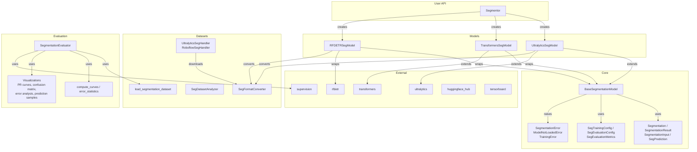

# Segmentation Module

Instance segmentation across Ultralytics YOLO, HuggingFace Transformers (MaskFormer), and
RF-DETR Seg behind one `Segmentor` — load a model, call `segment`, and get typed masks. The
same API covers training and evaluation, with dataset tooling and a `nectar-ai segment` CLI.

## At a glance

```python
from nectar.ai.segmentation import Segmentor

segmentor = Segmentor("yolov8n-seg.pt")     # framework auto-detected from the model name
segmentor.load()
result = segmentor.segment(image)
for seg in result:
    print(f"{seg.class_name}: {seg.confidence:.2f}, mask_area={seg.mask_area}px")
```

## Tutorial (Colab)

End-to-end segment workflow (dataset → train → TensorBoard → eval → Hub):

[Open in Google Colab](https://colab.research.google.com/drive/1qZzAF_iD2sZyuWPin48XpxaY6dtak_gV?usp=sharing)

## Concepts

`Segmentor` is a factory over three framework backends (`UltralyticsSegModel`,
`TransformersSegModel`, `RFDETRSegModel`), all sharing `BaseSegmentationModel`, the same
typed results, dataset handling, and evaluation:



## Segmentor

Factory-based interface with auto-detection or explicit framework selection.

**Auto-detect from the model name**:

```python
from nectar.ai.segmentation import Segmentor
from nectar.ai.core import Framework

segmentor = Segmentor("yolov8n-seg.pt")
segmentor = Segmentor("rfdetr-seg-nano")
segmentor = Segmentor("facebook/maskformer-swin-tiny-coco")
```

**Explicit framework**:

```python
segmentor = Segmentor("model.pt", framework="ultralytics")
segmentor = Segmentor("rfdetr-seg-medium", framework=Framework.RFDETR)
segmentor = Segmentor("facebook/maskformer-swin-tiny-coco", framework=Framework.TRANSFORMERS)
```

Load and run:

```python
segmentor.load()
result = segmentor.segment(image, conf=0.5)
annotated = segmentor.draw_segmentations(image, result, show_masks=True, show_boxes=True)
```

## Core Types

```python
from nectar.ai.segmentation import (
    Segmentation,          # Single instance: xyxy, confidence, class_id, class_name, mask
    SegmentationResult,    # Per-image container: list of Segmentation + semantic_map
    SegmentationInput,     # Model input: image(s), thresholds, device
    SegPrediction,         # Model output: sv.Detections + SegmentationResult list
)
```

`Segmentation` carries a binary mask (`np.ndarray` of shape `(H, W)` dtype `bool`) alongside the bounding box. Properties: `mask_area`, `polygon`, `center`, `width`, `height`.

`SegmentationResult` converts to/from `supervision.Detections` via `to_supervision()` / `from_supervision()`.

## Models

| Class | Framework | Segmentation Type | Formats |
|-------|-----------|-------------------|---------|
| `UltralyticsSegModel` | Ultralytics | Instance | YOLO-seg |
| `RFDETRSegModel` | RF-DETR | Instance | COCO-seg |
| `TransformersSegModel` | HuggingFace | Instance + Semantic | COCO-seg |

### Ultralytics

Supports YOLOv8-seg, YOLO11-seg, YOLO26-seg.

```python
from nectar.ai.segmentation import UltralyticsSegModel

model = UltralyticsSegModel("yolo26n-seg.pt")
model.load_model()
result = model.segment(image, conf=0.5)
```

### RF-DETR Seg

Supports nano, small, medium, large, xlarge, 2xlarge sizes.

```python
from nectar.ai.segmentation import RFDETRSegModel

model = RFDETRSegModel("rfdetr-seg-nano", resolution=312)
model.load_model()
result = model.segment(image, conf=0.3)
```

### Transformers

Instance segmentation via MaskFormer. Semantic segmentation via SegFormer.

```python
from nectar.ai.segmentation import TransformersSegModel

model = TransformersSegModel("facebook/maskformer-swin-tiny-coco", mode="instance")
model.load_model()
result = model.segment(image)
```

## Training

Training is configured via `SegTrainingConfig` dataclass or YAML config files. Framework-specific configs extend the base.

### YAML Config

```yaml
data:
  dataset_path: data/crack-seg/data.yaml
  dataset_format: yolo

train:
  framework: ultralytics
  model: yolo26n-seg.pt
  epochs: 50
  batch_size: 16
  imgsz: 640
  output_dir: outputs/my-run
  device: "0"
  tensorboard: true
  push_to_hub: true
  hub_model_id: user/model-name

eval:
  evaluate: true
  eval_split: test
  conf_threshold: 0.25
```

### CLI

```bash
nectar-ai segment train --config path/to/config.yaml
nectar-ai segment train --model yolo26n-seg.pt --dataset data/crack-seg/data.yaml --epochs 50
```

### Framework-Specific Configs

```python
from nectar.ai.segmentation.training.config import (
    UltralyticsSegTrainingConfig,
    TransformersSegTrainingConfig,
    RFDETRSegTrainingConfig,
)
```

Each provides a `to_*_args()` method that maps to the underlying framework's training API.

### Dataset Format Conversion

The training pipeline auto-converts between YOLO-seg and COCO-seg formats as needed:

- Ultralytics requires YOLO-seg format (polygon labels in `.txt` files)
- RF-DETR and Transformers require COCO format (polygon annotations in JSON)

Conversion is handled by `SegFormatConverter`.

## Evaluation

The evaluator follows the same pattern as the detection module:

1. Load ground truth with masks via `load_segmentation_dataset()`
2. Run inference at low confidence (0.001) to capture all predictions
3. Filter at user-specified threshold
4. Compute metrics (mAP, precision, recall, F1) via supervision
5. Generate visualization plots and CSV/JSON reports

```python
from nectar.ai.segmentation import SegmentationEvaluator, SegEvaluationConfig

config = SegEvaluationConfig(
    model_path="best.pt",
    dataset_path="data/crack-seg",
    framework="ultralytics",
    output_dir="outputs/eval",
    split="test",
    conf_threshold=0.25,
)

evaluator = SegmentationEvaluator(model, config)
metrics = evaluator.evaluate()
```

### Generated Artifacts

| File | Description |
|------|-------------|
| `BoxPR_curve.png` / `MaskPR_curve.png` | Precision-Recall curve (Box always; Mask when masks present) |
| `BoxP_curve.png` / `MaskP_curve.png` | Precision vs confidence |
| `BoxR_curve.png` / `MaskR_curve.png` | Recall vs confidence |
| `BoxF1_curve.png` / `MaskF1_curve.png` | F1 vs confidence |
| `confusion_matrix.png` | Confusion matrix |
| `error_analysis.png` | FP/FN breakdown, top confusions |
| `performance_analysis.png` | Per-class AP bar + P-R scatter |
| `prediction_samples.png` | GT vs Pred with mask overlays |
| `results.png` | Metrics summary bar chart |
| `per_class_metrics.csv` | Per-class AP, precision, recall, F1 |
| `evaluation_metrics.csv` | Overall metrics |
| `evaluation_report.json` | Full report with config and visualization paths |

### CLI

```bash
nectar-ai segment eval \
  --model-path best.pt \
  --dataset-path data/crack-seg \
  --framework ultralytics \
  --output-dir outputs/eval \
  --split test \
  --conf-threshold 0.25
```

## Dataset Management

### Download

**Ultralytics datasets** (crack-seg, coco8-seg, etc.):

```bash
nectar-ai segment dataset download --source ultralytics --dataset crack-seg --output data/crack-seg
```

**Roboflow projects**:

```bash
nectar-ai segment dataset download --source roboflow --api-key KEY \
  --workspace ws --project proj --version 1 --roboflow-format yolov8
```

**HuggingFace Hub** (native seg dataset → YOLO-seg or COCO-seg on disk):

```bash
nectar-ai segment dataset download --source huggingface \
  --repo blackbeedrones/sae-2026-hook --format yolo --output data/sae-2026-hook
```

### Upload to HuggingFace

`upload` converts a local YOLO-seg/COCO-seg dataset to the Hub-native schema
(`image` + `objects.{bbox, category, area, segmentation}`) and pushes Parquet
shards plus a generated dataset card. The Hub viewer renders bounding-box
overlays (derived from the polygons); the polygons themselves are stored for
mask training and round-trip back to YOLO-seg via `HuggingFaceSegHandler`.

**Native upload** (Parquet + viewer):

```bash
nectar-ai segment dataset upload --target huggingface \
  --repo user/my-seg-dataset --dataset data/my-seg \
  --public --title "My Seg Dataset" --model-repo user/my-model
```

**Raw upload** (files as-is, no viewer / no Parquet):

```bash
nectar-ai segment dataset upload --target huggingface --raw \
  --repo user/my-seg-dataset --dataset data/my-seg
```

```python
from nectar.ai.segmentation.datasets import HuggingFaceSegDatasetUploader

uploader = HuggingFaceSegDatasetUploader(repo_id="user/my-seg-dataset", private=False)
result = uploader.upload_native(
    dataset_path="data/my-seg",          # YOLO-seg or COCO-seg, auto-detected
    card_metadata={"title": "My Seg Dataset", "model_repo": "user/my-model"},
)
print(result["splits"], result["class_names"])
```

### Format Conversion

YOLO-seg labels use normalized polygon vertices: `class_id x1 y1 x2 y2 ... xN yN`.
COCO-seg annotations use absolute polygon coordinates in the `segmentation` field.

```bash
nectar-ai segment dataset convert --input data/crack-seg --output data/crack-seg-coco --format coco
```

```python
from nectar.ai.segmentation.datasets import SegFormatConverter

converter = SegFormatConverter("data/yolo-seg", "data/coco-seg")
converter.convert(target_format="coco", copy_images=True)
```

### Analysis

```bash
nectar-ai segment dataset analyze --input data/crack-seg --output data/crack-seg/analysis
```

Generates: `sample_mosaic.png` (with mask overlays), `class_distribution.png`, `mask_area_distribution.png`, `annotations_per_image.png`, `dimension_insights.png`, `analysis_report.json`.

### Subset

```bash
nectar-ai segment dataset subset --input data/crack-seg --output data/crack-seg-small \
  --max-train-samples 500 --max-eval-samples 100
```

### Prediction

```bash
nectar-ai segment predict --model best.pt --input image.jpg --output predictions/ --save-masks
```

## CLI Reference

```
nectar-ai segment <command> [options]

Commands:
  train     Train a segmentation model
  predict   Run inference
  eval      Evaluate on a dataset
  dataset   Dataset management (download, convert, subset, analyze)
```

## Training Integrations

### HuggingFace Hub Upload

All frameworks upload checkpoints to HuggingFace Hub **during training** (between epochs), not just after. Configured via `push_to_hub: true` and `hub_model_id` in YAML config.

> **Note:** requires the `HF_TOKEN` environment variable.

| Framework | Mechanism | Upload Timing |
|-----------|-----------|---------------|
| Ultralytics | `model.add_callback("on_train_epoch_end", ...)` | Weights after each epoch + full dir on train end |
| RF-DETR | PTL `Callback.on_validation_epoch_end` | Output dir after each validation epoch + on fit end |
| Transformers | Native `push_to_hub` + `hub_strategy="every_save"` | On every checkpoint save |

Callback implementations are shared across tasks via `nectar.ai.core.utils.callbacks`.

### TensorBoard

All frameworks log to TensorBoard when `tensorboard: true` in config:

- **Ultralytics**: events under `{save_dir}/` (configured via `ultralytics_settings`)
- **RF-DETR**: `TensorBoardLogger` added by `build_trainer` (PTL)
- **Transformers**: `report_to: ["tensorboard"]` in `TrainingArguments`

View logs: `tensorboard --logdir nectar/nectar/ai/outputs/`

## E2E Testing

### Prerequisites

```bash
cd nectar-sdk/nectar
export PYTHONPATH=$(pwd):$PYTHONPATH
export HF_TOKEN=<your-hf-token>
pip install -e ".[ai]"
```

### Run all segmentation tests (Ultralytics + RF-DETR + Transformers)

```bash
bash nectar/nectar/ai/segmentation/scripts/e2e_cli_test.sh
```

This script: downloads crack-seg dataset -> analyzes -> trains YOLO26n-seg (3 epochs) -> trains RF-DETR Seg Nano (10 epochs) -> trains MaskFormer Swin-Tiny (2 epochs) -> evaluates + predicts each -> verifies TensorBoard + HF upload -> prints summary.

### Run individual frameworks

```bash
# 1. Download dataset (once)
nectar-ai segment dataset download \
  --source ultralytics --dataset crack-seg \
  --output nectar/nectar/ai/data/crack-seg --format yolo

# 2. Train YOLO26n-seg (500 train samples, 3 epochs, 320px)
nectar-ai segment train --config nectar/nectar/ai/segmentation/configs/crackseg_yolo26n_seg.yaml

# 3. Train RF-DETR Seg Nano (full dataset, 10 epochs, 312px)
nectar-ai segment train --config nectar/nectar/ai/segmentation/configs/crackseg_rfdetr_seg_nano.yaml

# 4. Train MaskFormer Swin-Tiny (50 train samples, 2 epochs, 320px, fp32)
nectar-ai segment train --config nectar/nectar/ai/segmentation/configs/crackseg_mask2former.yaml
```

### Run all detection tests (Ultralytics + RF-DETR + Transformers)

```bash
bash nectar/nectar/ai/detection/scripts/e2e_cli_test.sh
```

This script: downloads gate dataset from Roboflow -> trains YOLO26n (3 epochs) -> trains RF-DETR Nano (5 epochs) -> trains DETR (2 epochs) -> evaluates + predicts each -> verifies TensorBoard + HF upload -> prints summary.

### Run individual detection frameworks

```bash
# 1. Download gate dataset (once)
nectar-ai detect dataset download \
  --source roboflow --api-key $ROBOFLOW_API_KEY \
  --workspace black-bee-drones --project imav-25-gate-sfbbq --version 1 \
  --output nectar/nectar/ai/data/imav-gate --format yolo

# 2. Train YOLO26n (100 train samples, 3 epochs, 320px)
nectar-ai detect train --config nectar/nectar/ai/detection/configs/gate_yolo26n.yaml

# 3. Train RF-DETR Nano (100 train samples, 5 epochs, 312px)
nectar-ai detect train --config nectar/nectar/ai/detection/configs/gate_rfdetr_nano.yaml

# 4. Train DETR (100 train samples, 2 epochs, 320px)
nectar-ai detect train --config nectar/nectar/ai/detection/configs/gate_detr.yaml
```

### What to verify after each run

1. **Training outputs** exist in `nectar/nectar/ai/outputs/<run-name>/`
2. **TensorBoard events**: `find nectar/nectar/ai/outputs/<run-name> -name "events.out.tfevents.*"`
3. **HuggingFace repo** updated at `https://huggingface.co/blackbeedrones/<hub_model_id>`
4. **Evaluation metrics** in `nectar/nectar/ai/outputs/<run-name>/evaluation/metrics_summary.json`
5. **Predictions** in `nectar/nectar/ai/outputs/<run-name>/predictions/`

## Framework Status

Tested end-to-end on the [Crack Segmentation Dataset](https://docs.ultralytics.com/datasets/segment/crack-seg/) (4029 images, 1 class).

| Framework | Train | Eval | Predict | HF Upload | TensorBoard | Notes |
|-----------|-------|------|---------|-----------|-------------|-------|
| Ultralytics (YOLO26n-seg) | OK | OK | OK | Per-epoch | OK | Full pipeline |
| RF-DETR Seg Nano | OK | OK | OK | Per-epoch (PTL) | OK (PTL) | Uses Custom Training API |
| Transformers (MaskFormer) | OK | OK | OK | Native | OK | Instance maps via `CocoInstanceSegDataset`; use fp32 (fp16 matcher NaNs) |

### Ultralytics (YOLO26n-seg) -- Full pipeline

- Download, analyze, train, eval, predict all working via CLI
- Per-epoch HF upload via shared `setup_ultralytics_hf_callbacks()`
- Evaluation uses `MetricTarget.MASKS` for proper mask-based metrics
- Standalone evaluation generates 16 artifacts (13 PNG plots plus CSV/JSON reports; see [Generated Artifacts](#generated-artifacts) above)

### RF-DETR Seg Nano -- Full pipeline

- Pinned to `rfdetr[train]==1.7.1` (PyPI)
- Training uses the [Custom Training API](https://rfdetr.roboflow.com/latest/learn/train/customization/) (`RFDETRModelModule`, `RFDETRDataModule`, `build_trainer`) for callback injection
- Per-epoch HF upload via PTL `HuggingFaceUploadPTLCallback`
- Class names auto-synced from checkpoint on `load_model()`
- Invalid class IDs filtered in `_predict_single()`
- COCO format auto-conversion from YOLO-seg via `SegFormatConverter`
- **Training note**: DETR-style models need sufficient epochs for confidence calibration. Recommended: 10+ epochs with `lr=5e-5`, `cosine` scheduler, `warmup_epochs=2`.

### Transformers (MaskFormer) -- Full pipeline

- Pretrained and fine-tuned inference work via CLI / `Segmentor`
- Training uses `CocoInstanceSegDataset`: COCO polygons → instance maps + `instance_id_to_semantic_id` for the MaskFormer image processor (not DETR-style `annotations=`)
- Collate returns `mask_labels` / `class_labels` (variable-length per image)
- Processor resized to fixed `imgsz` (default 320 in the crack-seg config) for small-GPU VRAM
- **fp16 is auto-disabled** for instance training: MaskFormer's Hungarian matcher produces NaNs under autocast
- TensorBoard logs under the Trainer run directory; per-epoch + final HF upload via shared transformers callback when `push_to_hub: true`
- Validated on crack-seg (GTX 1650 ~1 GB peak at 320px / batch 2; Colab T4 recommended for larger subsets)
- **Eval tip**: early checkpoints are under-confident — use `conf_threshold: 0.01`. PR-curve AP and `box_map50` move first; mask mAP@0.25 stays near zero until scores calibrate (same DETR-style note as RF-DETR)

### Key implementation details

- **Shared callbacks**: `nectar.ai.core.utils.callbacks` provides `setup_ultralytics_hf_callbacks()`, `setup_ultralytics_gc_callback()`, and `get_hf_upload_ptl_callback()` used by detection, segmentation, and classification
- **RF-DETR Custom Training API**: Both detection and segmentation RF-DETR models use `build_trainer` + `trainer.callbacks.extend()` instead of `rfdetr_wrapper.train()`, enabling callback injection
- **RF-DETR dependency**: Pinned to `rfdetr==1.7.1` (PyPI) for PTL training support and segmentation fixes
- **COCO category IDs**: `SegFormatConverter` uses standard 1-indexed IDs (YOLO 0-indexed classes map to COCO `category_id = class_id + 1`)
- **Evaluation metrics**: `SegmentationEvaluator` uses `supervision.metrics` with `MetricTarget.MASKS` when masks are present; falls back to `MetricTarget.BOXES` otherwise
- **MaskFormer dataset**: `CocoInstanceSegDataset` + `instance_seg_collate_fn` in `segmentation/models/dataset.py`

## Config Files

Example training configs in `configs/`:

| Config | Framework | Description |
|--------|-----------|-------------|
| `crackseg_yolo26n_seg.yaml` | Ultralytics | YOLO26n-seg, 3 epochs, 320px, 500 train samples |
| `crackseg_rfdetr_seg_nano.yaml` | RF-DETR | RF-DETR Seg Nano, 10 epochs, 312px, cosine LR |
| `crackseg_mask2former.yaml` | Transformers | MaskFormer Swin-Tiny, 5 epochs, 320px, fp32, Hub upload |

## Layout

The `segmentation/` package mirrors `detection/`:

- `segmentor.py` — the `Segmentor` facade and factory
- `core/` — `BaseSegmentationModel`, segmentation types, `SegTrainingConfig`/`SegEvaluationConfig`, exceptions
- `models/` — framework backends (`UltralyticsSegModel`, `RFDETRSegModel`, `TransformersSegModel`) and dataset loading
- `training/` — framework-specific training configs
- `evaluation/` — `SegmentationEvaluator`, PR/error analysis, plots
- `datasets/` — YOLO-seg/COCO-seg conversion, HuggingFace upload, analysis, and download handlers
- `cli/`, `configs/` — the `nectar-ai segment` CLI and example configs
