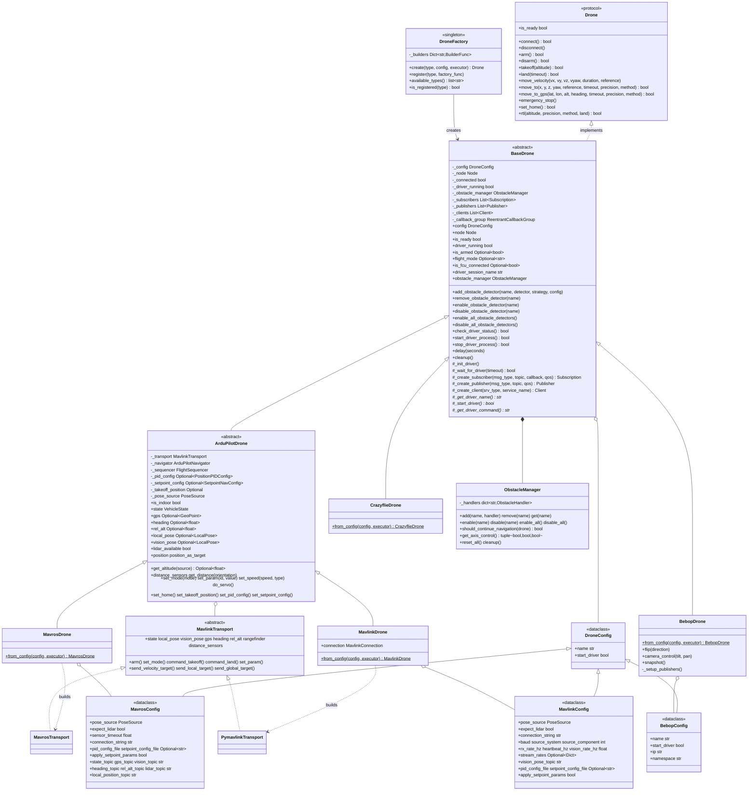

# Drone Control Module

## Role

Protocol-based drone control for ROS 2. `DroneFactory` builds a drone by key behind the common `Drone` protocol; each platform implements the same interface (takeoff, land, move_to, move_to_gps, move_velocity, rtl, obstacle management).

## Documentation Index

| README | Scope |
|--------|-------|
| [ardupilot/](ardupilot/README.md) | Shared ArduPilot vehicle core: navigation, frames, takeoff/land, RTL, PID/setpoint, GPS/EGM96, parameters |
| [mavros/](mavros/README.md) | MAVROS transport (`MavrosDrone`) |
| [mavlink/](mavlink/README.md) | Direct pymavlink transport (`MavlinkDrone`) |
| [localization/](localization/README.md) | Indoor VSLAM external-nav: Isaac producer + vision-pose bridge |
| [obstacles/](obstacles/README.md) | Obstacle detection + avoidance strategies |
| [pid/](pid/README.md) | PID controller and tuning |
| [bebop/](bebop/README.md) | Parrot Bebop 2 (`BebopDrone`) |
| [crazyflie/](crazyflie/README.md) | Bitcraze Crazyflie (`CrazyflieDrone`) |

## Architecture



## Runtime Model

Each drone owns its own ROS 2 `Node` (created internally with a UUID-suffixed name). All SDK subsystem nodes are added to a shared `MultiThreadedExecutor` managed by [`nectar.runtime`](../runtime.py), which spins on a background thread. Blocking calls (`takeoff`, `land`, `move_to`) sleep on the user's thread; the executor keeps firing callbacks (state, pose, GPS, lidar, IMU) without contention.

Three usage patterns share the same primitives:

- **Standalone script**: `nectar.init()` lazily creates the shared executor and starts the spin thread. `DroneFactory.create("mavros", config)` registers the drone's node with it. Call `nectar.shutdown()` on exit.
- **Yasmin mission**: call `nectar.use_executor(YasminNode.get_instance()._executor)` once at startup. SDK subsystems created afterwards register with the Yasmin executor instead of spawning a second spin thread.
- **GUI**: `ROSExecutor.start()` registers its `MultiThreadedExecutor` with `nectar.runtime`. Drones/handlers created from inside tabs share that executor automatically.

## ArduPilot Transport Architecture

`MavrosDrone` and `MavlinkDrone` are the **same ArduPilot vehicle reached over two transports**. All flight/navigation logic lives once in the transport-agnostic [`ArduPilotDrone`](ardupilot/README.md) core, which reads telemetry and issues commands/setpoints through a pluggable `MavlinkTransport` interface:

- `MavrosTransport` — subscriptions → telemetry, service clients → commands, publishers → setpoints (requires a running `mavros_node`).
- `PymavlinkTransport` — owns the FCU link directly; a ROS timer drains the RX stream, commands/setpoints go out via `mav.*_send`. Indoor it auto-starts a `VisionPoseBridge` to feed the EKF (replacing `vision_to_mavros`). See [mavlink/README.md](mavlink/README.md).

The core operates on plain, ROS-free types (`ardupilot/types.py`); each transport converts its wire types (`mavros_msgs`/`geometry_msgs` or raw MAVLink) to/from these. ENU/FLU and radians throughout; transports handle NED/FRD conversion.

### Capabilities

Each drone declares a `frozenset[Capability]` (see `capabilities.py`); query with `drone.supports(Capability.GPS_NAV)`. New drones declare what they support by overriding the `capabilities` property. Unsupported operations raise `CapabilityNotSupportedError`.

Declared sets per drone:

- `ArduPilotDrone` (MAVROS/MAVLink): `PID_NAV`, `LOCAL_SETPOINT`, `VELOCITY_BODY`, `VELOCITY_WORLD`, `VELOCITY_TAKEOFF`, `SERVO`, `PARAMS`, `NATIVE_RTL`, `OBSTACLE_AVOIDANCE`, `RANGEFINDER`, `DISTANCE_SENSORS`, plus `GPS_NAV`/`GLOBAL_SETPOINT` (outdoor) or `VISION_POSE` (indoor) from `pose_source`.
- `CrazyflieDrone`: `LOCAL_SETPOINT`, `VELOCITY_BODY`, `VELOCITY_WORLD`, `VELOCITY_TAKEOFF`, `PARAMS`.
- `BebopDrone`: `VELOCITY_BODY`, `NATIVE_RTL`.

## Core Components

### DroneFactory

Centralized drone instantiation with type registration.

**API**:
```python
DroneFactory.create(drone_type: str, config: DroneConfig,
                    executor: Optional[Executor] = None) -> BaseDrone
DroneFactory.register(drone_type: str, factory_func: Callable)
```

**Supported Types**:
- `mavros`: ArduPilot/PX4 via MAVROS
- `mavlink`: ArduPilot via direct pymavlink (no MAVROS)
- `bebop`: Parrot Bebop 2
- `crazyflie`: Bitcraze Crazyflie

**Example**:
```python
import nectar
from nectar.control import DroneFactory, MavrosConfig, PoseSource

nectar.init()
config = MavrosConfig(pose_source=PoseSource.VISION)
drone = DroneFactory.create("mavros", config)   # optional: executor=<your Executor>
```

### Drone Protocol

Duck-typed interface defining drone contract. All drones must implement:

**Core Operations**:
- `connect()`, `disconnect()`: Connection management
- `arm()`, `disarm()`: Motor control
- `takeoff()`, `land()`: Vertical maneuvers
- `emergency_stop()`: Force shutdown

**Movement**:
- `move_velocity()`: Direct velocity control
- `move_to()`: Position navigation
- `move_to_gps()`: GPS waypoint navigation
- `rtl()`: Return-to-launch

**State**:
- `is_ready`: connection and driver status (all drones)
- ArduPilot drones additionally expose `is_armed`, `flight_mode`, `is_fcu_connected` (see [ardupilot/README.md](ardupilot/README.md)); other platforms expose their own readiness fields

### BaseDrone

Abstract base providing common functionality.

**Responsibilities**:
- Driver lifecycle (start, monitor)
- ROS2 resource management (subscribers, publishers, clients)
- Obstacle manager integration
- Delay utility with ROS spinning

**Protected Methods**:
- `_create_subscriber()`, `_create_publisher()`, `_create_client()`
- `_init_driver()`, `_check_driver_running()`, `_wait_for_driver()`
- `delay(seconds)`: Non-blocking delay

### Configuration System

Type-safe dataclass hierarchy.

**MavrosConfig**:
```python
MavrosConfig(
    pose_source: PoseSource = PoseSource.GPS,     # GPS or VISION
    expect_lidar: bool = True,
    connection_string: str = "serial:///dev/ttyUSB0:921600",
    pid_config_file: Optional[str] = None,
    local_position_topic: str = "/mavros/local_position/pose",
    # ... topic configurations with sensible defaults
)
```

**BebopConfig**:
```python
BebopConfig(
    ip: str = "192.168.42.1",
    namespace: str = "bebop"
)
```

## Movement, Navigation, RTL

`MoveReference` selects the frame: `BODY` (relative to current heading), `WORLD` (ENU world frame), `TAKEOFF` (relative to the takeoff pose). The public movement API — `move_velocity`, `move_to`, `move_to_gps`, `rtl` — plus the navigation methods (`POSITION`, `POSITION_GLOBAL`, `PID`, `PID_EKF`), altitude sources, GPS/EGM96 handling, and RTL modes are defined once in the shared core: see **[ardupilot/README.md](ardupilot/README.md)**. Bebop and Crazyflie support a subset (see their READMEs and the capability matrix above).

## Obstacle Detection

Detector + strategy + handler/manager, integrated into navigation via `drone.add_obstacle_detector(...)`. Full design, detectors, and strategies are documented in **[obstacles/README.md](obstacles/README.md)**.

```python
from nectar.control import DepthObstacleDetector, strategies

drone.add_obstacle_detector("depth", DepthObstacleDetector(), strategies.PauseStrategy())
drone.enable_all_obstacle_detectors()
```

## PID Control

Per-axis position PID (x/y/z/yaw), loaded from `ardupilot/config/*.yaml` by `is_indoor` and overridable at runtime via `drone.set_pid_config(...)`. Tuning, config schema, and the loading lifecycle live in **[pid/README.md](pid/README.md)** and **[ardupilot/README.md](ardupilot/README.md)**.

## Exception Hierarchy

```python
DroneError
├── DriverNotFoundError
├── TakeoffPositionNotSetError
├── SensorNotAvailableError
└── CapabilityNotSupportedError
```

## Usage Examples

### Basic Flight

```python
import nectar
from nectar.control import DroneFactory, MavrosConfig, PoseSource

nectar.init()
config = MavrosConfig(pose_source=PoseSource.VISION)
drone = DroneFactory.create("mavros", config)

drone.takeoff(altitude=1.5)
drone.move_to(x=2.0, y=1.0, z=0.0, precision=0.2)
drone.rtl(land=True)
nectar.shutdown()
```

### GPS Waypoint Mission

```python
config = MavrosConfig(pose_source=PoseSource.GPS)
drone = DroneFactory.create("mavros", config)

waypoints = [
    (-27.1234, -48.4567, 15.0),
    (-27.1245, -48.4578, 15.0),
    (-27.1256, -48.4589, 15.0)
]

drone.takeoff(altitude=15.0)

for lat, lon, alt in waypoints:
    drone.move_to_gps(lat, lon, alt, precision=1.0)

drone.land()
```

### Multiple Reference Frames

```python
from nectar.control.types import MoveReference

drone.takeoff(1.5)

# Body-relative: 1m forward and 0.5m left from current position
drone.move_to(x=1.0, y=0.5, z=0.0, reference=MoveReference.BODY)

# Takeoff-relative: go to position 2m forward of takeoff point
drone.move_to(x=2.0, y=0.0, z=0.0, reference=MoveReference.TAKEOFF)

# Return to takeoff position
drone.move_to(x=0.0, y=0.0, z=0.0, reference=MoveReference.TAKEOFF)

# World-frame velocity
drone.move_velocity(vx=0.5, vy=0.0, vz=0.0, reference=MoveReference.WORLD)
```

### Obstacle-Aware Navigation

```python
from nectar.control import DepthObstacleDetector, strategies

detector = DepthObstacleDetector()
drone.add_obstacle_detector("depth", detector, strategies.PauseStrategy())
drone.enable_obstacle_detector("depth")

drone.takeoff(1.5)
drone.move_to(x=10.0, y=0.0, z=0.0)  # Pauses when obstacles detected
drone.land()
```

## Implementation Modules

- **ardupilot/**: Shared transport-agnostic ArduPilot core (ArduPilotDrone, navigator, target computer, GPS utils, sequencer, transport ABC, plain types)
- **mavros/**: MAVROS transport (MavrosTransport, MavrosDrone)
- **mavlink/**: Direct pymavlink transport (PymavlinkTransport, MavlinkDrone, connection, streams, vision bridge)
- **bebop/**: Parrot Bebop 2 implementation (BebopDrone, velocity control, acrobatic maneuvers)
- **crazyflie/**: Bitcraze Crazyflie implementation
- **localization/**: Indoor VSLAM external-nav (MavrosVisionRelay, vision_pose_node, Isaac launches, RViz)
- **obstacles/**: Obstacle detection system (detectors, strategies, handlers)
- **pid/**: PID controller implementation and configuration

See individual module READMEs for detailed documentation.

## Type System

**Enums**:
- `PoseSource`: GPS, VISION
- `MoveReference`: BODY, WORLD, TAKEOFF
- `NavigationMethod`: POSITION, POSITION_GLOBAL, PID, PID_EKF
- `RTLMethod`: NAVIGATE, NATIVE
- `AltitudeSource`: AUTO, LIDAR, VISION, REL_ALT
- `ObstacleDirection`: FRONT, BACK, LEFT, RIGHT, UP, DOWN
- `ObstacleInfo`: Detection result
