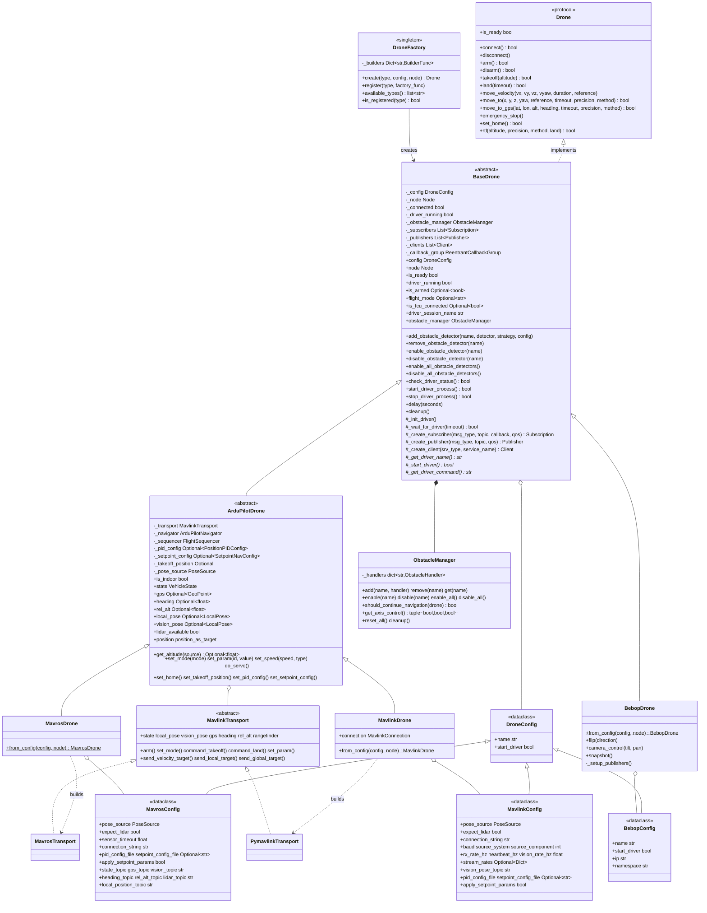
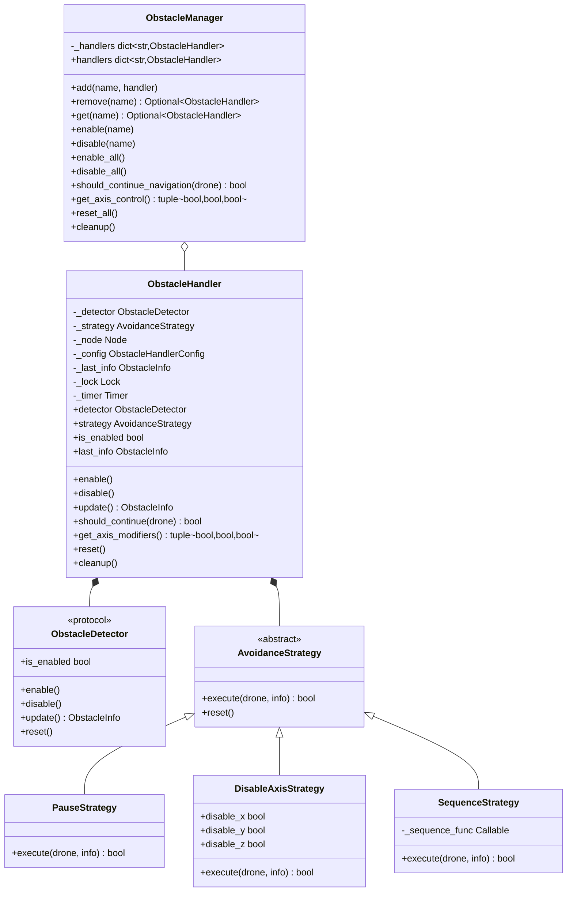

# Drone Control Module

Protocol-based drone control framework for ROS2 with factory pattern instantiation, configurable navigation methods, and event-based obstacle detection.

## Documentation Index

- **README.md**: This file - Architecture overview and quick start
- **ardupilot/README.md**: Shared transport-agnostic ArduPilot vehicle core
- **mavros/README.md**: MAVROS transport (`MavrosDrone`)
- **mavlink/README.md**: Direct pymavlink transport (`MavlinkDrone`)
- **bebop/README.md**: Parrot Bebop 2 implementation details
- **obstacles/README.md**: Obstacle detection system documentation
- **pid/README.md**: PID controller implementation and tuning

## Architecture



## Runtime Model

Each drone owns its own ROS 2 `Node` (created internally with a UUID-suffixed name). All SDK subsystem nodes are added to a shared `MultiThreadedExecutor` managed by [`nectar.runtime`](../runtime.py), which spins on a background thread. Blocking calls (`takeoff`, `land`, `move_to`) sleep on the user's thread; the executor keeps firing callbacks (state, pose, GPS, lidar, IMU) without contention.

Three usage patterns share the same primitives:

- **Standalone script**: `nectar.init()` lazily creates the shared executor and starts the spin thread. `DroneFactory.create("mavros", config)` registers the drone's node with it. Call `nectar.shutdown()` on exit.
- **Yasmin mission**: call `nectar.use_executor(YasminNode.get_instance()._executor)` once at startup. SDK subsystems created afterwards register with the Yasmin executor instead of spawning a second spin thread.
- **GUI**: `ROSExecutor.start()` registers its `MultiThreadedExecutor` with `nectar.runtime`. Drones/handlers created from inside tabs share that executor automatically.

## ArduPilot Transport Architecture

`MavrosDrone` and `MavlinkDrone` are the **same ArduPilot vehicle reached over two transports**. All flight/navigation logic lives once in the transport-agnostic [`ArduPilotDrone`](ardupilot/README.md) core, which reads telemetry and issues commands/setpoints through a pluggable `MavlinkTransport` interface:

- `MavrosTransport` — subscriptions → telemetry, service clients → commands, publishers → setpoints (requires a running `mavros_node`).
- `PymavlinkTransport` — owns the FCU link directly; a ROS timer drains the RX stream, commands/setpoints go out via `mav.*_send`. Indoor it auto-starts a `VisionPoseBridge` to feed the EKF (replacing `vision_to_mavros`). See [mavlink/README.md](mavlink/README.md).

The core operates on plain, ROS-free types (`ardupilot/types.py`); each transport converts its wire types (`mavros_msgs`/`geometry_msgs` or raw MAVLink) to/from these. ENU/FLU and radians throughout; transports handle NED/FRD conversion.

### Capabilities

Each drone declares a `frozenset[Capability]` (see `capabilities.py`); query with `drone.supports(Capability.GPS_NAV)`. `ArduPilotDrone` derives its set from `pose_source` (outdoor → `GPS_NAV`/`GLOBAL_SETPOINT`, indoor → `VISION_POSE`). Unsupported operations raise `CapabilityNotSupportedError`.

## Core Components

### DroneFactory

Centralized drone instantiation with type registration.

**API**:
```python
DroneFactory.create(drone_type: str, config: DroneConfig,
                    executor: Optional[Executor] = None) -> BaseDrone
DroneFactory.register(drone_type: str, factory_func: Callable)
```

**Supported Types**:
- `mavros`: ArduPilot/PX4 via MAVROS
- `mavlink`: ArduPilot via direct pymavlink (no MAVROS)
- `bebop`: Parrot Bebop 2
- `crazyflie`: Bitcraze Crazyflie

**Example**:
```python
from nectar.control import DroneFactory, MavrosConfig, PoseSource

config = MavrosConfig(pose_source=PoseSource.VISION)
drone = DroneFactory.create("mavros", config, node)
```

### Drone Protocol

Duck-typed interface defining drone contract. All drones must implement:

**Core Operations**:
- `connect()`, `disconnect()`: Connection management
- `arm()`, `disarm()`: Motor control
- `takeoff()`, `land()`: Vertical maneuvers
- `emergency_stop()`: Force shutdown

**Movement**:
- `move_velocity()`: Direct velocity control
- `move_to()`: Position navigation
- `move_to_gps()`: GPS waypoint navigation
- `rtl()`: Return-to-launch

**State**:
- `state`: Current drone state (armed, flying, mode)
- `is_ready`: Connection and driver status

### BaseDrone

Abstract base providing common functionality.

**Responsibilities**:
- Driver lifecycle (start, monitor)
- ROS2 resource management (subscribers, publishers, clients)
- Obstacle manager integration
- Delay utility with ROS spinning

**Protected Methods**:
- `_create_subscriber()`, `_create_publisher()`, `_create_client()`
- `_init_driver()`, `_check_driver_running()`, `_wait_for_driver()`
- `delay(seconds)`: Non-blocking delay

### Configuration System

Type-safe dataclass hierarchy.

**MavrosConfig**:
```python
MavrosConfig(
    pose_source: PoseSource = PoseSource.GPS,     # GPS or VISION
    expect_lidar: bool = True,
    connection_string: str = "serial:///dev/ttyUSB0:921600",
    pid_config_file: Optional[str] = None,
    local_position_topic: str = "/mavros/local_position/pose",
    # ... topic configurations with sensible defaults
)
```

**BebopConfig**:
```python
BebopConfig(
    ip: str = "192.168.42.1",
    namespace: str = "bebop"
)
```

## Movement API

### Reference Frames

```python
class MoveReference(Enum):
    BODY = auto()      # Relative to current orientation
    WORLD = auto()     # NED frame (vision) or GPS frame (outdoor)
    TAKEOFF = auto()   # Relative to takeoff position (position control)
```

### Velocity Control

```python
drone.move_velocity(
    vx: float = 0.0,           # Forward velocity (m/s)
    vy: float = 0.0,           # Lateral velocity (m/s)
    vz: float = 0.0,           # Vertical velocity (m/s)
    vyaw: float = 0.0,         # Angular velocity (rad/s)
    duration: Optional[float] = None,  # Execution time (seconds)
    reference: MoveReference = MoveReference.BODY  # BODY or WORLD
)
```

### Position Navigation

```python
drone.move_to(
    x: Optional[float] = None,
    y: Optional[float] = None,
    z: Optional[float] = None,
    yaw: Optional[float] = None,           # degrees
    reference: MoveReference = MoveReference.BODY,
    timeout: Optional[float] = 60.0,
    precision: float = 0.2,
    method: NavigationMethod = NavigationMethod.PID_EKF,
    altitude_source: AltitudeSource = AltitudeSource.AUTO,
) -> bool
```

See [`ardupilot/README.md`](ardupilot/README.md) for the full capability matrix, per-axis/reference behavior, and altitude-source semantics.

**Navigation Methods**:
- `POSITION`: Local position setpoint via `setpoint_raw/local` — works indoor and outdoor
- `POSITION_GLOBAL`: GPS global setpoint via `setpoint_position/global` — outdoor only, long range
- `PID`: Velocity control with raw sensors — vision pose (indoor) or GPS (outdoor)
- `PID_EKF`: Velocity control with EKF local position — unified indoor/outdoor frame

**Altitude Sources** (`PID` and `PID_EKF`):
- `AUTO`: Position-based altitude (vision Z indoor, GPS altitude outdoor)
- `LIDAR`: Ground-relative altitude via rangefinder (terrain following)
- `REL_ALT`: GPS-based relative altitude above home

### GPS Navigation

```python
drone.move_to_gps(
    latitude: float,
    longitude: float,
    altitude: Optional[float] = None,
    heading: Optional[float] = None,   # degrees
    timeout: Optional[float] = 60.0,
    precision: float = 0.5,            # meters
    method: NavigationMethod = NavigationMethod.PID
) -> bool
```

**Features**:
- EGM96 geoid height correction
- Body-frame error calculation using GPS and compass
- Haversine distance computation

### Return-to-Launch

```python
drone.rtl(
    altitude: Optional[float] = None,  # Transit altitude (meters)
    precision: float = 0.2,
    method: RTLMethod = RTLMethod.NAVIGATE,  # NAVIGATE or NATIVE
    land: bool = True
) -> bool
```

**RTL Methods**:
- `NAVIGATE`: Navigate to takeoff position using the drone's configured navigation path (e.g. PID / setpoints on MAVROS)
- `NATIVE`: Trigger the flight stack's native RTL mode (e.g. ArduPilot RTL)

## Obstacle Detection

Event-based system using strategy pattern.



### Integration

```python
from nectar.control import strategies

# Simple pause behavior
drone.add_obstacle_detector(
    "depth",
    DepthObstacleDetector(node),
    strategy=strategies.PauseStrategy()
)

# Custom evasion sequence
from functools import partial

strategy = strategies.SequenceStrategy(
    partial(strategies.lateral_pass_return_sequence, lateral_distance=1.0)
)
drone.add_obstacle_detector("depth", detector, strategy)

# Disable Z axis for terrain following
strategy = strategies.DisableAxisStrategy(disable_z=True)
drone.add_obstacle_detector("lidar", detector, strategy)

drone.enable_all_obstacle_detectors()
```

See `obstacles/README.md` for complete documentation.

## PID Control

Configurable position control with separate gains for X, Y, Z, yaw axes.

**Configuration** (`config/mavros/position_indoor.yaml`):
```yaml
x:
  kp: 0.5
  ki: 0.0
  kd: 0.0
  output_min: -0.42
  output_max: 0.42
```

**Runtime Updates**:
```python
from nectar.control.pid import PositionPIDConfig, PIDConfig

config = PositionPIDConfig(
    x=PIDConfig(kp=0.8, output_min=-1.0, output_max=1.0),
    y=PIDConfig(kp=0.8, output_min=-1.0, output_max=1.0),
    z=PIDConfig(kp=0.5, output_min=-0.8, output_max=0.8),
    yaw=PIDConfig(kp=0.5, ki=0.1, output_min=-0.3, output_max=0.3)
)
drone.set_pid_config(config)
```

See `pid/README.md` for implementation details.

## Exception Hierarchy

```python
DroneError
├── DriverNotFoundError
├── TakeoffPositionNotSetError
├── SensorNotAvailableError
└── CapabilityNotSupportedError
```

## Usage Examples

### Basic Flight

```python
import rclpy
from rclpy.node import Node
from nectar.control import DroneFactory, MavrosConfig, PoseSource

rclpy.init()
node = Node('drone_control')

config = MavrosConfig(pose_source=PoseSource.VISION)
drone = DroneFactory.create("mavros", config, node)

drone.takeoff(altitude=1.5)
drone.move_to(x=2.0, y=1.0, z=0.0, precision=0.2)
drone.rtl(land=True)
```

### GPS Waypoint Mission

```python
config = MavrosConfig(pose_source=PoseSource.GPS)
drone = DroneFactory.create("mavros", config, node)

waypoints = [
    (-27.1234, -48.4567, 15.0),
    (-27.1245, -48.4578, 15.0),
    (-27.1256, -48.4589, 15.0)
]

drone.takeoff(altitude=15.0)

for lat, lon, alt in waypoints:
    drone.move_to_gps(lat, lon, alt, precision=1.0)

drone.land()
```

### Multiple Reference Frames

```python
from nectar.control.types import MoveReference

drone.takeoff(1.5)

# Body-relative: 1m forward and 0.5m left from current position
drone.move_to(x=1.0, y=0.5, z=0.0, reference=MoveReference.BODY)

# Takeoff-relative: go to position 2m forward of takeoff point
drone.move_to(x=2.0, y=0.0, z=0.0, reference=MoveReference.TAKEOFF)

# Return to takeoff position
drone.move_to(x=0.0, y=0.0, z=0.0, reference=MoveReference.TAKEOFF)

# World-frame velocity
drone.move_velocity(vx=0.5, vy=0.0, vz=0.0, reference=MoveReference.WORLD)
```

### Obstacle-Aware Navigation

```python
from nectar.control import DepthObstacleDetector, strategies

detector = DepthObstacleDetector(node)
drone.add_obstacle_detector("depth", detector, strategies.PauseStrategy())
drone.enable_obstacle_detector("depth")

drone.takeoff(1.5)
drone.move_to(x=10.0, y=0.0, z=0.0)  # Pauses when obstacles detected
drone.land()
```

## Implementation Modules

- **ardupilot/**: Shared transport-agnostic ArduPilot core (ArduPilotDrone, navigator, target computer, GPS utils, sequencer, transport ABC, plain types)
- **mavros/**: MAVROS transport (MavrosTransport, MavrosDrone)
- **mavlink/**: Direct pymavlink transport (PymavlinkTransport, MavlinkDrone, connection, streams, vision bridge)
- **bebop/**: Parrot Bebop 2 implementation (BebopDrone, velocity control, acrobatic maneuvers)
- **crazyflie/**: Bitcraze Crazyflie implementation
- **obstacles/**: Obstacle detection system (detectors, strategies, handlers)
- **pid/**: PID controller implementation and configuration

See individual module READMEs for detailed documentation.

## Type System

**Enums**:
- `PoseSource`: GPS, VISION
- `MoveReference`: BODY, WORLD, TAKEOFF
- `NavigationMethod`: POSITION, POSITION_GLOBAL, PID, PID_EKF
- `RTLMethod`: NAVIGATE, NATIVE
- `AltitudeSource`: AUTO, LIDAR, VISION, REL_ALT
- `ObstacleDirection`: FRONT, BACK, LEFT, RIGHT, UP, DOWN
- `ObstacleInfo`: Detection result
